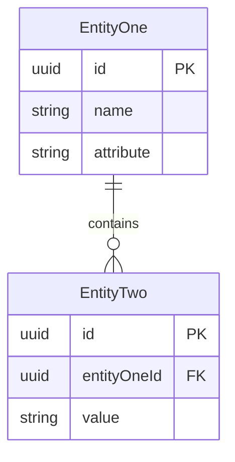
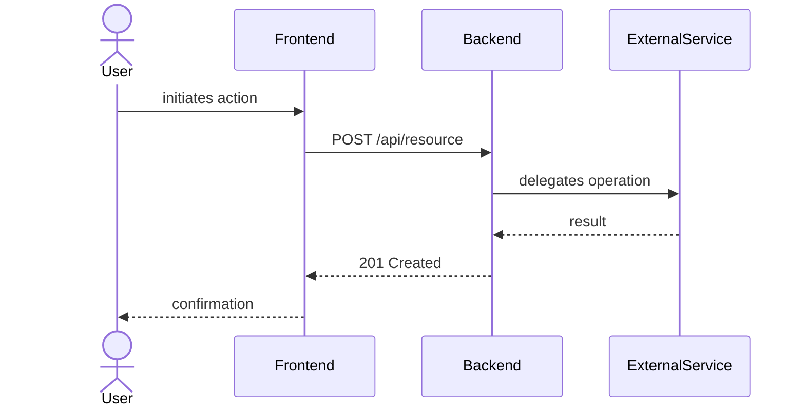

# Feature Specification: [FEATURE NAME]

**Feature Branch**: `[###-feature-name]`

**Created**: [DATE]

**Status**: Draft

**Input**: User description: "$ARGUMENTS"

## User Scenarios & Testing *(mandatory)*

<!--
  IMPORTANT: User stories should be PRIORITIZED as user journeys ordered by importance.
  Each user story/journey must be INDEPENDENTLY TESTABLE - meaning if you implement just ONE of them,
  you should still have a viable MVP (Minimum Viable Product) that delivers value.

  Assign priorities (P1, P2, P3, etc.) to each story, where P1 is the most critical.
  Think of each story as a standalone slice of functionality that can be:
  - Developed independently
  - Tested independently
  - Deployed independently
  - Demonstrated to users independently

  E2E ACCEPTANCE TESTING (Constitution Principle XIII):
  Each acceptance scenario below MUST have a corresponding end-to-end (E2E) test in tests/e2e/.
  - Each scenario maps 1:1 to one It() block in E2E tests
  - E2E tests MUST be written BEFORE implementation begins (red-green development)
  - E2E tests MUST FAIL initially, proving they test actual functionality
  - E2E tests change minimally during implementation (fixture adjustments only)
  - E2E tests turn GREEN when implementation satisfies acceptance criteria
  - Use Ginkgo/Gomega framework following patterns in tests/e2e/README.md
  - Test file naming: tests/e2e/[feature]_test.go
  - Include comment references to spec scenarios in E2E test files
-->

### User Story 1 - [Brief Title] (Priority: P1)

[Describe this user journey in plain language]

**Why this priority**: [Explain the value and why it has this priority level]

**Independent Test**: [Describe how this can be tested independently - e.g., "Can be fully tested by [specific action] and delivers [specific value]"]

**Acceptance Scenarios**:

1. **Given** [initial state], **When** [action], **Then** [expected outcome]
2. **Given** [initial state], **When** [action], **Then** [expected outcome]

---

### User Story 2 - [Brief Title] (Priority: P2)

[Describe this user journey in plain language]

**Why this priority**: [Explain the value and why it has this priority level]

**Independent Test**: [Describe how this can be tested independently]

**Acceptance Scenarios**:

1. **Given** [initial state], **When** [action], **Then** [expected outcome]

---

### User Story 3 - [Brief Title] (Priority: P3)

[Describe this user journey in plain language]

**Why this priority**: [Explain the value and why it has this priority level]

**Independent Test**: [Describe how this can be tested independently]

**Acceptance Scenarios**:

1. **Given** [initial state], **When** [action], **Then** [expected outcome]

---

[Add more user stories as needed, each with an assigned priority]

### Edge Cases

<!--
  ACTION REQUIRED: The content in this section represents placeholders.
  Fill them out with the right edge cases.
-->

- What happens when [boundary condition]?
- How does system handle [error scenario]?

## Requirements *(mandatory)*

<!--
  ACTION REQUIRED: The content in this section represents placeholders.
  Fill them out with the right functional requirements.
-->

### Functional Requirements

- **FR-001**: System MUST [specific capability, e.g., "allow users to create accounts"]
- **FR-002**: System MUST [specific capability, e.g., "validate email addresses"]
- **FR-003**: Users MUST be able to [key interaction, e.g., "reset their password"]
- **FR-004**: System MUST [data requirement, e.g., "persist user preferences"]
- **FR-005**: System MUST [behavior, e.g., "log all security events"]

*Example of marking unclear requirements:*

- **FR-006**: System MUST authenticate users via [NEEDS CLARIFICATION: auth method not specified - email/password, SSO, OAuth?]
- **FR-007**: System MUST retain user data for [NEEDS CLARIFICATION: retention period not specified]

### Domain Model *(if applicable - document before API or database design)*

<!--
  Per Constitution Principle V (Domain-Driven Design & Glossary Management):
  Domain concepts must be explicitly modeled and documented.

  GITHUB-COMPATIBLE MERMAID RULES:
  - erDiagram: { } in attribute blocks is correct Mermaid syntax — GitHub renders it fine
  - classDiagram: { } enclosing class members is correct Mermaid syntax — also fine
  - flowchart/graph TD: NEVER put { } inside node text — it breaks the parser
    Use ["label text"] or ("label text") node forms instead
  - Do NOT put newlines inside node text or relationship labels in any diagram type
  - Wrap relationship labels that contain colons or special characters in double quotes
-->

**Domain Entity Diagram** *(replace entities and fields with this feature's actual domain model)*:



**Activity / Flow Diagram** *(use for non-trivial workflows, state transitions, or multi-party flows)*:

<!--
  Choose the right diagram type:
  - flowchart TD: simple linear flows and decision trees
    - {Decision text?} creates a diamond node (valid in flowchart — { } is Mermaid node syntax)
    - ["Action text"] creates a rectangular node
    - NEVER nest { } inside node text: {bad {nesting}} breaks the parser
    - Keep decision labels short (no newlines, no colons outside quotes)
  - sequenceDiagram: interactions between components/actors over time (recommended for HTTP flows)
  - stateDiagram-v2: state machines and lifecycle transitions
-->



*Replace with the actual flow for this feature. Use `flowchart TD` for simpler decision-tree flows,
`sequenceDiagram` for HTTP/component interactions, or `stateDiagram-v2` for lifecycle transitions.*

**Entities** (things with unique identity):
- **[Entity 1]**: [Brief description, key attributes, lifecycle, invariants]
- **[Entity 2]**: [Brief description, relationships to other entities]

**Aggregates** (consistency boundaries):
- **[Aggregate]**: [Root entity, contained entities, invariants]

**Value Objects** (things without identity):
- **[Value Object]**: [What it represents, immutability constraints]

**Domain Events** (state changes of business significance):
- **[Event 1]**: [When it occurs, what changed]

*All domain terms should be added to ARCHITECTURE.md Glossary section*

### Configuration Requirements *(if applicable - document before implementation)*

<!--
  Per Constitution Principle VII (Configuration-Driven Design):
  Configuration requirements must be designed with examples before implementation.
-->

**Configuration Parameters**:
- **[PARAMETER_NAME]**: [Type, purpose, default value, example]

**Example YAML Configuration**:
```yaml
# Feature-specific configuration
[feature_name]:
  [parameter_1]: [example_value]
  [parameter_2]: [example_value]
  nested:
    [parameter_3]: [example_value]
```

**Configuration Location**: Will be added to `examples/config/[feature_name].yaml` and referenced in `examples/config/README.md`

### API Requirements *(if applicable - design before database)*

<!--
  Per Constitution Principle IV (API Documentation & OpenAPI Transparency) and
  Principle X (API-First Development): APIs must be designed before implementation.
-->

- **API-001**: All end-user APIs MUST be documented in `/api/enduser/openapi.yaml` (OpenAPI 3.0+ format)
- **API-002**: All administrative APIs MUST be documented in `/api/admin/openapi.yaml` (OpenAPI 3.0+ format)
- **API-003**: API documentation MUST include: endpoint paths, HTTP methods, parameters, request/response bodies, error codes, examples, authentication requirements
- **API-004**: End-user API documentation MUST be rendered in `docs/api/` with examples for typical use cases
- **API-005**: APIs MUST follow Zalando RESTful API and Event Guidelines (https://opensource.zalando.com/restful-api-guidelines/)
- **API-006**: All API changes MUST be confirmed by user/stakeholder before implementation begins
- **API-007**: API design decisions (naming conventions, error response format, pagination) MUST be documented in ARCHITECTURE.md or ADR

*Example of API requirement clarification:*

- **API-008**: System exposes [endpoint name] via [NEEDS CLARIFICATION: HTTP method and path not yet designed - coordinate with user]

### Database Requirements *(if applicable)*

<!--
  Per Constitution Principle IX (Persistence Pattern Consistency & Database Migration Management):
  All database schema changes must use go-migrate naming conventions and be tested.
-->

- **DB-001**: All database schema changes MUST be in `/migrations/` directory using go-migrate naming conventions
- **DB-002**: Migration file format MUST be: `[NNN]_[description].up.sql` and `[NNN]_[description].down.sql` (where NNN is sequential: 004, 005, 006...)
  - Example: `004_create_sessions_table.up.sql`, `004_create_sessions_table.down.sql`
- **DB-003**: Each migration MUST be atomic (fully apply or fully rollback on failure)
- **DB-004**: All migrations MUST be tested in PostgreSQL integration tests (apply, rollback, repeat without data loss)
- **DB-005**: All PostgreSQL-backed repositories MUST have integration tests verifying persistence behavior
- **DB-006**: If adding new entities with persistence, implementations MUST follow `specs/004-persistence-layer/quickstart.md` patterns

### Security Requirements *(mandatory for security-critical features)*

<!--
  Per Constitution Principle I: Security-First Development
  Security features must be enabled by default and fail closed.
-->

- **SR-001**: Security controls MUST be enabled by default (explicit configuration required to disable)
- **SR-002**: Cryptographic operations MUST use vetted libraries (per Constitution Principle III)
- **SR-003**: System MUST fail closed on security verification failures (no silent fallbacks)
- **SR-004**: Security-critical operations MUST emit structured audit logs

*Example of security requirements that need library verification:*

- **SR-005**: Signature verification MUST use [IMPLEMENTATION NOTE: Go crypto/* or golang.org/x/crypto packages]
- **SR-006**: Encryption MUST NOT have plaintext fallbacks [IMPLEMENTATION NOTE: No optional security]

### Frontend/Design System Requirements *(if applicable - document before implementation)*

<!--
  Per Constitution Principle XI (Design System Compliance & Consistency):
  Frontend components must use the design system; universal patterns must be contributed back.
-->

**Design System Compliance**:
- All frontend components MUST use design system located at `web/src/design-system/`
- Documentation entrypoint: [web/src/design-system/docs/INDEX.md](../web/src/design-system/docs/INDEX.md)
- Before implementation, review:
  - [DECISION_TREES.md](../web/src/design-system/docs/DECISION_TREES.md) for variant selection
  - [COMPONENT_PAIRING_GUIDE.md](../web/src/design-system/docs/COMPONENT_PAIRING_GUIDE.md) for composition patterns
  - [COMMON_MISTAKES.md](../web/src/design-system/docs/COMMON_MISTAKES.md) to avoid anti-patterns

**Component Classification**:
- **Application-Specific Components**: [List components specific to this feature]
  - Location: `web/src/components/[feature]/`
  - Must use design system primitives (Button, Card, Badge, etc.)
- **Universal Components** (if any): [List components applicable across the application]
  - Location: `web/src/design-system/components/[category]/`
  - Must include Storybook stories
  - Must follow the current `DESIGN_PRINCIPLES.md` and accepted design ADRs, not a proposed replacement

**Design Tokens Usage**:
- Define all visual decisions as semantic tokens under `web/src/design-system/tokens/`
- Do not reference raw palette utilities in components
- DO NOT bypass design tokens with custom CSS
- Use Tailwind v4 `@theme` tokens and CVA variants
- Document visual-direction changes in an ADR and obtain acceptance before implementation
- Self-host brand assets. Do not load fonts, scripts, or images from third-party origins

**Accessibility Requirements**:
- WCAG 2.1 AA compliance mandatory (4.5:1 text contrast, 3:1 UI component contrast)
- Semantic HTML with proper ARIA attributes
- Keyboard navigation support for all interactive elements
- Support light and dark themes. Every component story MUST pass the accessibility addon in both
- Include Storybook stories and visual regression coverage for new design-system components

Principle XI defines this process. It does not mandate a fixed aesthetic or palette.

*Example clarification needed:*

- **FE-001**: Feature requires [component type] component with [specific behavior] [NEEDS CLARIFICATION: Is this universal or app-specific? Should it be added to design system?]

### Key Entities *(include if feature involves data)*

- **[Entity 1]**: [What it represents, key attributes without implementation]
- **[Entity 2]**: [What it represents, relationships to other entities]

*Domain concepts should be added to ARCHITECTURE.md Glossary (per Constitution Principle V)*

## Success Criteria *(mandatory)*

<!--
  ACTION REQUIRED: Define measurable success criteria.
  These must be technology-agnostic and measurable.
-->

### Measurable Outcomes

- **SC-001**: [Measurable metric, e.g., "Users can complete account creation in under 2 minutes"]
- **SC-002**: [Measurable metric, e.g., "System handles 1000 concurrent users without degradation"]
- **SC-003**: [User satisfaction metric, e.g., "90% of users successfully complete primary task on first attempt"]
- **SC-004**: [Business metric, e.g., "Reduce support tickets related to [X] by 50%"]

## Assumptions

<!--
  ACTION REQUIRED: The content in this section represents placeholders.
  Fill them out with the right assumptions based on reasonable defaults
  chosen when the feature description did not specify certain details.
-->

- [Assumption about target users, e.g., "Users have stable internet connectivity"]
- [Assumption about scope boundaries, e.g., "Mobile support is out of scope for v1"]
- [Assumption about data/environment, e.g., "Existing authentication system will be reused"]
- [Dependency on existing system/service, e.g., "Requires access to the existing user profile API"]
