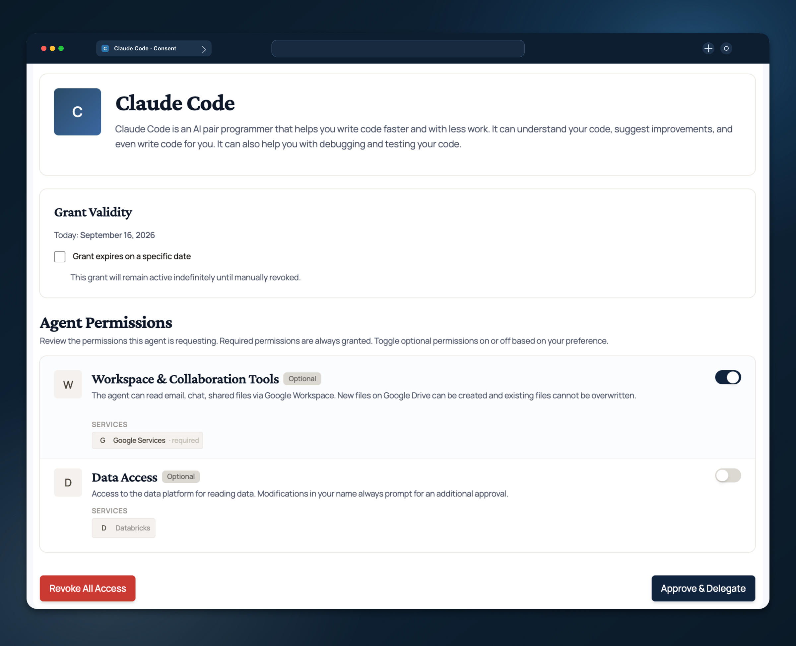

  <picture>
    <source media="(prefers-color-scheme: dark)" srcset="assets/docusaurus/static/img/AIB_Wordmark_White.svg" />
    <source media="(prefers-color-scheme: light)" srcset="assets/docusaurus/static/img/AIB_Wordmark_Black.svg" />
    
  </picture>
  

    
    
    
    
    
    
  

  

    Delegate <strong>scoped, revocable access</strong> to AI agents — without handing them your credentials.
  

---

**Agentic Identity Broker** manages delegation chains for on-behalf-of flows in Agentic AI, bridges distinct OAuth2 infrastructures, and provides a secure token vault. Deployed within the call path via gateways like [Agentgateway](https://agentgateway.dev), it offloads auth burdens from both agent and MCP server creators.

For users, it provides a simple way to manage consent, granting agents granular permissions across services such as Google, GitHub, Databricks, and Linear without compromising control.

## Key Features

- **Secure Identity Management** 
  Agent registration, principal authentication, and session management

- **OAuth2 Delegation & Consent** 
  Manage OAuth2 scopes and user consent for third-party service integrations

- **Security-First Design** 
  Sensitive value redaction, command injection prevention, cryptographic validation, and fail-closed architecture

- **Rich Consent Experience** 
  Modern UX for managing OAuth2 delegations with design system compliance

- **Comprehensive Audit Logging** 
  Structured JSON logging for compliance and security monitoring

## Use Cases

### Internal MCP Servers

Frameworks like FastMCP can implement the whole OAuth2.1 ceremonies as mandated by the MCP spec but this means that you have to configure it for every MCP Server you deploy and maintain it. You also have to configure secure storage and basically run a multitude of OAuth2 authorization servers. With the identity broker and a gateway you can dumb down MCP server development to only provide tools on the target technologie you want. OAuth2 ceremonies, token vaulting and token translation are done transparently. Because token exchange is done centrally via a gateway, this allows agents to interact with hundreds of MCP servers via one channel.

### MCP Servers for SaaS

If you want to offer an MCP server to your customers as part of your SaaS, the identity broker can provide an additional consent surface that records which agents were actually used. With centralized tool authorization, you can keep an audit trail of approvals on your side regardless of which agent the customer runs.

### Hosted Agents

The agentic identity broker can simplify agents by requiring only a single user token that can be used with an arbitrary number of MCP servers. When paired with a portal for user interactions, token procurement can be front-loaded in the portal, and the agent's responsibility is to forward this token to upstream MCP servers via a gateway.

## Documentation

Check out the following docs:

- [Quickstart](https://agenticidentitybroker.dev/docs/get-started) — Get started with Agentic Identity Broker in minutes.
- [agenticidentitybroker.dev](https://agenticidentitybroker.dev/docs/introduction) – Underlying concepts, guides and API specs.

Agentic Identity Broker has a built-in consent management UI:

  

## Contributing

For instructions on how to contribute to the agentgateway project, see the [CONTRIBUTION.md](CONTRIBUTION.md) file.

## Roadmap

**Agentic Identity Broker** is currently in active development. We use this project in production internally for several MCP servers and have seen good potential. We are coding in the open to gauge our approach. If you find it useful, let us know. If you'd like a feature that's missing, open an issue in our [GitHub repo](https://github.com/zalando-incubator/agentic-identity-broker/issues).

While this project was created by professionals with decades of experience in the identity space (including building multiple OIDC and OAuth2 providers), it was developed with a strong focus on agentic engineering and spec-driven development. We review every PR and prioritize sound engineering practices over convenience.

Major roadmap topics include: (a) centralized tool authorization with Open Policy Agent-based authorization policies, (b) support for on-behalf-of flows where no frontend user session exists (semi-autonomous cases with no user directly interacting with an agent), and (c) formalizing token exchange for agent-to-agent calls.

## Contributors

Thanks to all contributors who are helping to make the Agentic Identity Broker better.

### Star History

<a href="https://www.star-history.com/#zalando-incubator/agentic-identity-broker&Date">
 <picture>
   <source media="(prefers-color-scheme: dark)" srcset="https://api.star-history.com/svg?repos=zalando-incubator/agentic-identity-broker&type=Date&theme=dark" />
   <source media="(prefers-color-scheme: light)" srcset="https://api.star-history.com/svg?repos=zalando-incubator/agentic-identity-broker&type=Date" />
   
 </picture>
</a>

---

  <picture>
   <source media="(prefers-color-scheme: dark)" srcset="assets/docusaurus/static/img/Zalando_Wordmark_White_RGB.png" />
   <source media="(prefers-color-scheme: light)" srcset="assets/docusaurus/static/img/Zalando_Wordmark_Black_RGB.png" />
   
 </picture>
    
Agentic Identity Broker is a <a href="https://engineering.zalando.com/">Zalando Engineering</a> project.

