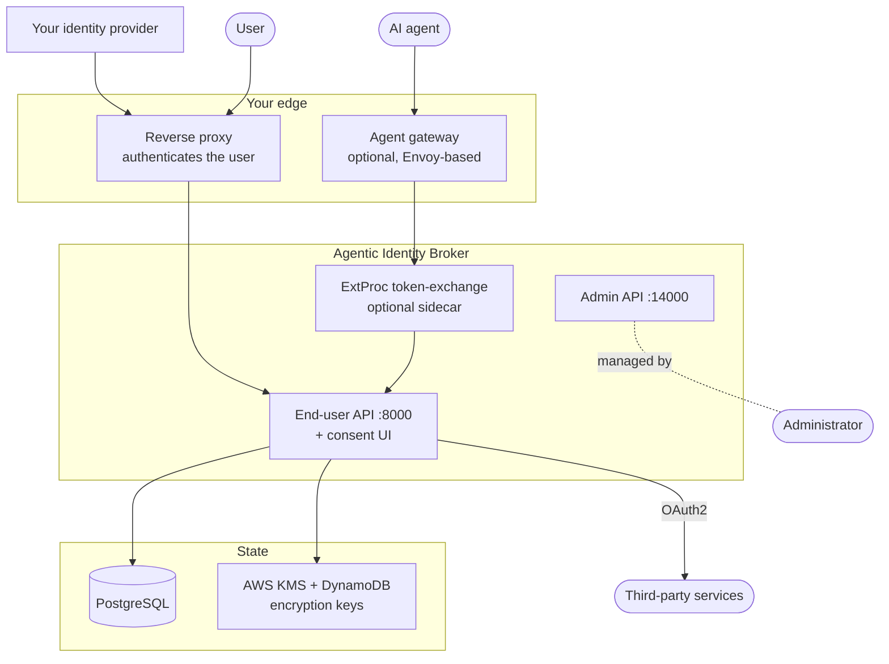
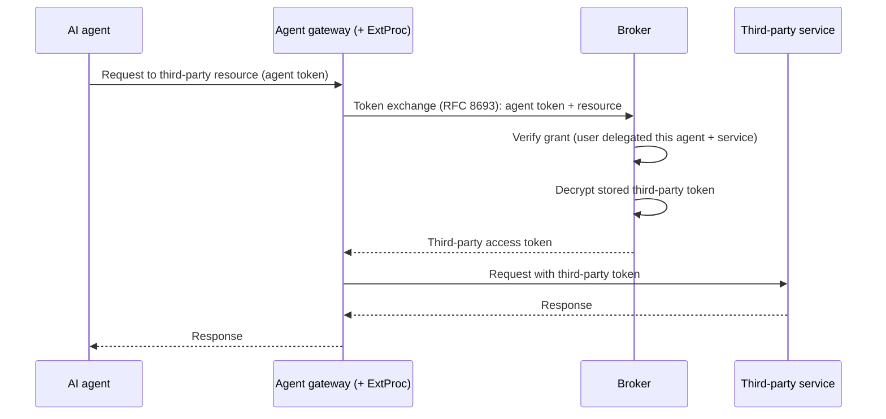

# Architecture

This page describes the broker for operators. It explains the components, network surfaces,
and request flow. It does not describe the internal code structure.

## System context

The broker is one component in a larger system. It requires an authenticating reverse proxy.
An agent gateway can perform token exchange.

## Components

### The broker service

A single Go service that exposes two independent HTTP ports (see [dual-port topology](#dual-port-topology)).
It handles consent management, third-party OAuth2 sessions, the OAuth2 authorization-server
surface, and token exchange. It also serves the **consent UI**, a React single-page
application, at `/` on the end-user port.

### The consent UI

The consent UI is a browser application. A user can review requested access and grant,
adjust, or revoke it. The UI calls only the end-user API. A user can open it to manage a
delegation. The broker can also redirect a user to it during an agent authorization flow.

### The ExtProc token-exchange sidecar (optional)

The ExtProc sidecar is a standalone gRPC service for the Envoy External Processor protocol.
It runs beside an Envoy-based agent gateway. For each request, it exchanges the agent bearer
token for the appropriate third-party token. It stores cached results in memory. It can use
an [OPA](https://www.openpolicyagent.org/) policy to restrict the proxied request. See
[token exchange at the gateway](../guides/token-exchange-gateway.md).

### State

- **PostgreSQL** stores agents, services, permission sets, grants, and encrypted
  third-party sessions. An in-memory backend is available for evaluation and tests.
- **Encryption keys** are in AWS KMS. A DynamoDB table caches intermediate keys. In
  development, the broker uses a single raw key instead. See
  [encryption at rest](./encryption.md).

## Dual-port topology

The broker serves two audiences on separate ports. You can expose, secure, and scale these
ports independently.

| Port | Surface | Audience | Typical exposure |
|---|---|---|---|
| **8000** | End-user API + consent UI + OAuth2 endpoints | Users and agents | Public, behind the authenticating proxy |
| **14000** | Admin API | Administrators and automation | Internal only, behind stricter access control |

The end-user port hosts:

- `/api/me`, `/api/consent/*` — the consent surface used by the UI.
- `/api/third-party/*` — starting and managing third-party OAuth2 sessions.
- `/oauth2/authorize`, `/oauth2/token`, `/oauth2/jwks.json`,
  `/.well-known/oauth-authorization-server` — the [OAuth2 authorization-server](./oauth2-server-modes.md)
  surface.

The admin port provides CRUD operations for agents, third-party services, and permission
sets. It also provides per-agent client credentials and signing keys. The proxy enforces
administrator privilege before a request reaches this port.

See the [API reference](../reference/api.md) for the full contracts.

## Authentication is delegated

The broker does not authenticate users. A trusted reverse proxy authenticates each request.
For example, the proxy can use oauth2-proxy, nginx `auth_request`, an API gateway, or a
service mesh. It sends the user identity in a header. The default header is
`X-Remote-User`. The broker accepts the header only from the proxy.

Keep your identity provider for human login. The broker manages delegation, consent, and
least privilege. An optional JWT pre-authentication mode validates a signed JWT from a
header and extracts a user profile. See
[configure authentication](../guides/configure-authentication.md).

## How a delegated request flows

This is a representative path from an agent request to a third-party API through a gateway:

If a user has not delegated required access, the broker routes the user to the consent
interface. After the user grants access, the original flow resumes. See
[delegation and consent](./delegation-and-consent.md) for this path.

## Deployment shape

The broker is available as containers. It can run on Kubernetes or another container
platform. A typical production deployment includes:

- The broker service with multiple replicas behind the authenticating proxy.
- A one-shot migration job image with a least-privilege database user.
- PostgreSQL. You can use an external database or an operator-managed cluster.
- A KMS key and DynamoDB table for encryption. On AWS, pods authenticate through IRSA.
- An optional ExtProc sidecar with the agent gateway.

See [deploy on Kubernetes](../guides/deploy-on-kubernetes.md) and the
[deployment checklist](../operations/deployment-checklist.md) for the operational detail.
