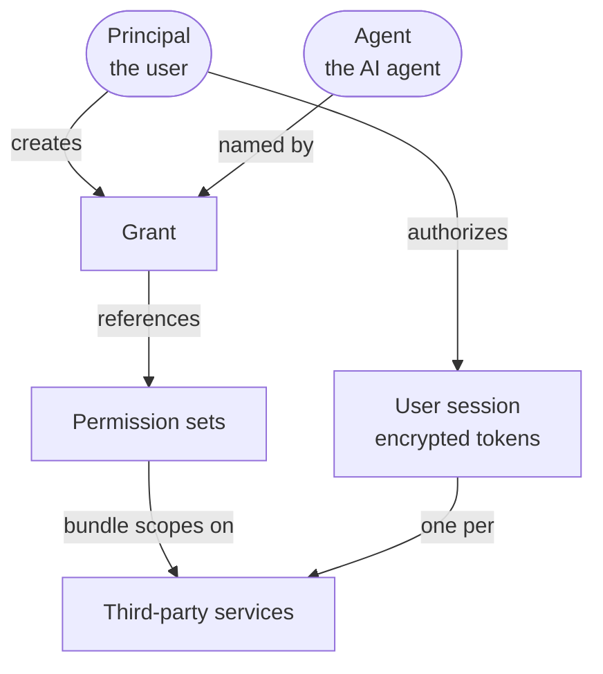
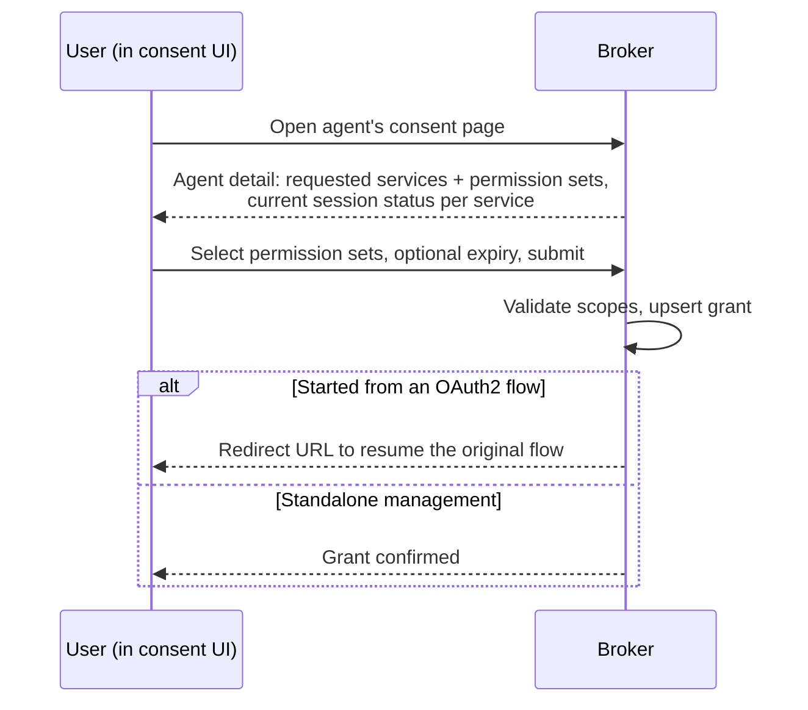

# Delegation and consent

This is the core broker model. The broker creates, honors, and revokes a relationship where
a user gives an agent specific permissions for specific services.

## The objects

### Principal

The principal is the authenticated user. The broker does not authenticate users. A trusted
proxy authenticates each request and sends the principal identifier in a header. The
principal is the subject of each grant and third-party session.

### Agent

An agent is an AI agent registered in the broker. Each agent has a system-generated UUID.
The UUID is the canonical identifier and the OAuth2 `client_id` at the authorization
endpoint. An agent also has a display name and description. It can include governance and
documentation URLs for the consent interface. An agent declares its required services and
permission sets. Each requirement is **mandatory** or **optional**.

An agent can identify itself with an HTTPS URL that points to a **Client ID Metadata
Document (CIMD)**. The broker fetches and validates this document. The consent interface
shows the resulting metadata. See
[OAuth2 server modes](./oauth2-server-modes.md#client-identity-and-cimd).

### Third-party service

A third-party service is an external OAuth2 provider, such as GitHub, Google, Databricks,
or an internal API. Its definition contains the provider client ID and encrypted client
secret. It contains the issuer, endpoints, and available scopes. It can also contain the
resource URIs for [token exchange](./token-exchange.md). Administrators register
services through the [admin API](../guides/manage-agents-and-services.md).

### Permission set

A permission set is an administrator-defined, human-readable group of scopes. It can span
one or more services. For example, **Read repositories** can map to GitHub scopes. Users
consent to permission sets in business terms, not raw provider scopes. An agent marks each
referenced permission set as mandatory or optional.

### Grant

The record of a principal delegating permission sets to an agent. Key properties:

- **At most one active grant per user and agent.** Updating a grant replaces its contents.
  There is one current answer to the question: "What has this user allowed this agent to
  do?"
- **Optional expiry.** A grant can contain `valid_until`. Omit it to make the grant
  indefinite. The broker does not honor expired grants.
- **Revocable at any time.** A user can withdraw specific permission sets or revoke the
  complete grant.

### User session

A user session is an authenticated OAuth2 session for one principal and one third-party
service. It contains encrypted access and refresh tokens, their expiry, and granted scopes.
There is one session for each user and service. Every agent with a delegation uses the same
session. Ending the session deletes its tokens and removes access from all dependent agents.
The broker shows the affected agents before it ends the session.

## Mandatory vs optional requirements

An agent can require some services or permission sets. Each declared requirement is one of
these types:

- **Mandatory** — the agent cannot work without it. The authorization flow stops until the
  user creates an active, unexpired session with the required scopes.
- **Optional** — the agent uses it when available. The authorization flow continues without
  it. The consent interface identifies these requirements.

An agent can state that it requires repository access but can also use calendar access. The
broker enforces this distinction during authorization.

## Creating a delegation

The consent flow is where a user turns a request for access into a grant.

1. The user opens the agent consent page. The user can open it directly or through an agent
   authorization redirect.
2. The broker returns the requested services and permission sets. It identifies each as
   mandatory or optional. It also returns the user session status for each service.
3. The user selects the permission sets and can set an expiry. The user then submits the
   request.
4. The broker validates and stores the grant. If the flow began as an OAuth2 authorization
   request, the response contains a URL that resumes the flow. Otherwise, it confirms the
   grant.

During an authorization flow, the broker seals the consent context in a short-lived,
encrypted server-side token. The context identifies the agent and user. It also contains the
original request. The consent interface cannot use attacker-provided parameters.

If a mandatory service has no session, the broker starts the
[third-party authorization flow](./architecture.md#how-a-delegated-request-flows).
The broker stores the resulting tokens in encrypted form before it completes the delegation.

## Using a delegation

After a grant and its sessions exist, an agent can request a third-party resource. The
broker uses [token exchange](./token-exchange.md) to process the request. It makes
sure that the principal has an active grant for the agent and service. It then returns the
appropriate third-party token. An agent does not hold the provider credential. Each exchange
identifies a user, agent, and resource.

## Revoking a delegation

Users stay in control through two independent levers:

- **Revoke a grant** — withdraw one or more permission sets from an agent. An empty grant
  removes all agent access.
- **Terminate a session** — delete the stored tokens for a third-party service. This affects
  each agent that uses the session. The broker lists these agents before it proceeds.

Administrators can delete an agent. This removes its grants. Administrators can also delete
a service when no grant references it. This prevents delegations that point to a missing
service.

## Related

- [OAuth2 server modes](./oauth2-server-modes.md) — how authorization requests are
  handled.
- [Token exchange](./token-exchange.md) — how a grant becomes a usable token.
- [Manage agents and services](../guides/manage-agents-and-services.md) — the administrator
  workflow.
- [Glossary](./glossary.md) — precise definitions of every term above.
