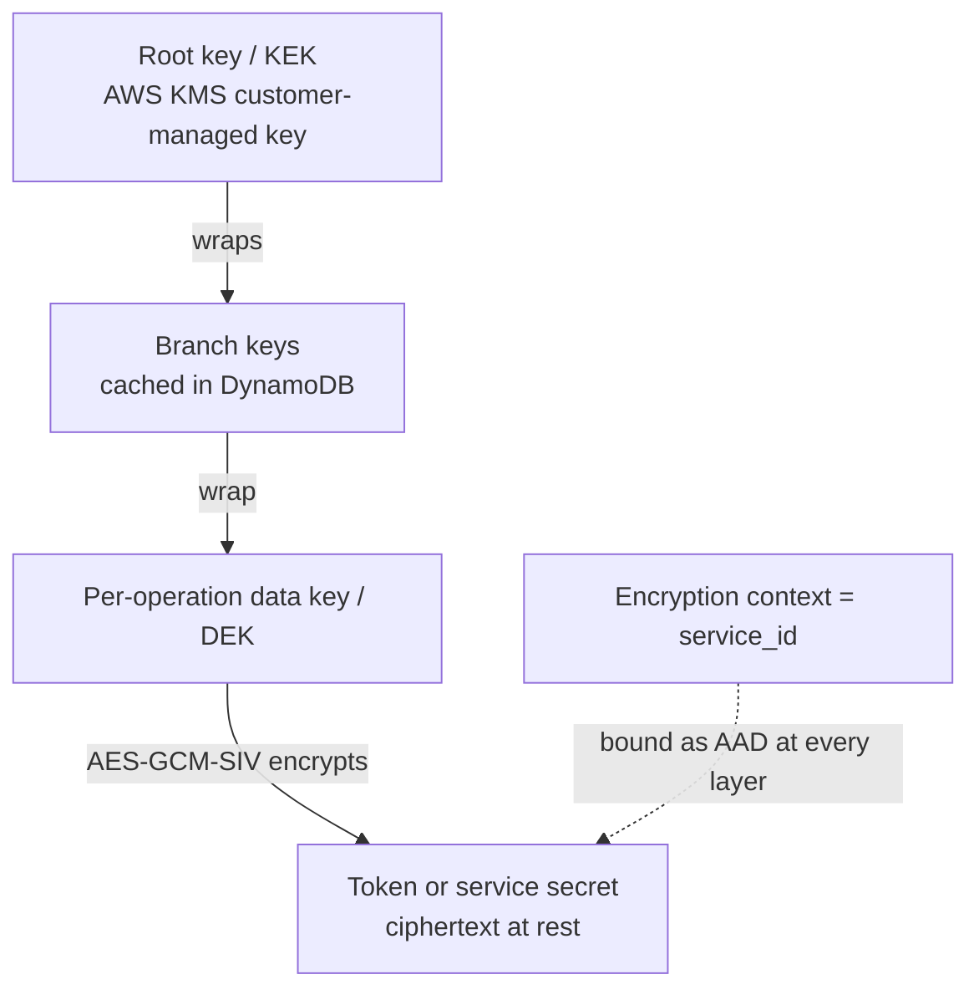

# Encryption at rest

The broker stores third-party tokens and provider secrets that agents never see. These
values must remain unreadable in storage. The broker encrypts every third-party access token,
refresh token, and service `client_secret`. It binds every ciphertext to its service. A
ciphertext cannot be reused for another service.

Encryption is mandatory. The broker does not start without an encryption backend. It has no
plaintext mode or fallback. This page explains the model. See
[configure encryption](../guides/configure-encryption.md) for setup.

## What is protected, and why it matters

Two kinds of sensitive material live in the broker's storage:

- **Third-party tokens** — Access and refresh tokens that the broker receives when a user
  authorizes a service. Agents use these tokens through
  [token exchange](./token-exchange.md). A datastore leak can otherwise expose
  provider access.
- **Service secrets** — The `client_secret` for each registered third-party service.

The broker encrypts both values before storage. The API redacts both values. A service read
returns `REDACTED` instead of its client secret. Plaintext exists only in the broker while it
uses the value.

## Envelope encryption, plainly

Direct encryption of every secret with one long-lived master key is fragile. The master key
handles every plaintext. Rotating it requires re-encryption of every value. Envelope
encryption uses a layered design:

- For each encryption operation, the broker creates a new **data key (DEK)**. It uses the
  DEK to encrypt one value with authenticated encryption (AES-GCM-SIV). This protects
  confidentiality and integrity.
- A higher-level key encrypts the DEK. In production, key layers lead to a **root key
  (KEK)** in a key-management service.
- The stored envelope contains the encrypted DEK and ciphertext. To read the value, the
  broker decrypts the DEK through the key hierarchy. It then decrypts the value.

Each operation uses a separate DEK. A data key protects only one value. The root key does
not process plaintext directly.

## Two backends: production and development

The broker configures exactly one backend. The backend determines where the top key in the
hierarchy is stored.

| | Production | Development |
|---|---|---|
| Root key | AWS KMS customer-managed key (an ARN) | One raw base64-encoded AES-256 key |
| Intermediate keys | DynamoDB-cached **branch keys** (hierarchical keyring) | None |
| Purpose | An HSM-backed root key with audit and IAM control. Branch-key caching reduces KMS calls. | No cloud dependency and fast local startup for development and CI. |
| Configuration | `encryption.aws_kms.key_arn` and a branch-key table | `encryption.memory.raw_key` |

In production, the **hierarchical keyring** is between the KMS root key and per-operation
DEKs. DynamoDB caches branch keys. The broker does not call KMS for every encryption
operation. This reduces latency and KMS cost. The development backend uses one AES-256 key
from the process environment. Do not use this backend in production.

:::warning
The memory backend stores its key in the process environment. It has no HSM protection, key
rotation, or centralized audit. Use AWS KMS for an environment that stores real credentials.
:::

## Encryption context binds ciphertext to its service

Layered keys protect plaintext secrets. **Encryption context** prevents a decrypted value
from use with the wrong service. The broker binds every ciphertext to the `service_id` with
additional authenticated data (AAD) at each envelope layer.

During decryption, the broker must supply the same `service_id` used for encryption. A token
for service A cannot be decrypted for service B, even with the same broker and keys. A
context mismatch stops the operation. This provides cryptographic service isolation. A bug
that reads the wrong ciphertext cannot return a usable token for another service.

## Fail-closed by design

The broker treats encryption as a hard boundary:

- **No plaintext fallback.** A wrong context, unavailable key, or corrupt envelope returns
  an error. The broker does not store or return plaintext.
- **Mandatory at startup.** Without an encryption backend, the broker does not start. A
  deployment cannot run without encryption.
- **Redacted on read.** The API returns secrets as `REDACTED`. It does not return plaintext
  to an administrator.

## Related

- [Configure encryption](../guides/configure-encryption.md) — set up the AWS KMS or memory
  backend.
- [Token exchange](./token-exchange.md) — where the decrypted third-party tokens are
  put to use.
- [Delegation and consent](./delegation-and-consent.md) — the sessions whose tokens
  this encryption protects.
