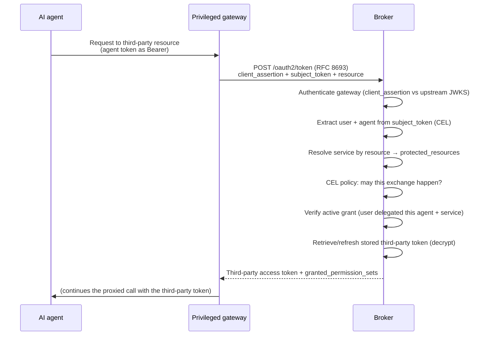

# Token exchange

The broker supports two distinct RFC 8693 flows on `POST /oauth2/token`:

| Flow | Activation | Result |
|---|---|---|
| Third-party token exchange | Standard exchange parameters, including `resource` | A provider credential held in the encrypted token vault. |
| User impersonation | One `audience` equal to `<impersonation.audience_prefix>/<canonical lower-case AgentID UUID or canonical_id>` in local mode | A locally issued broker token with an impersonated `sub`, target-derived UUID `agent_id`, and accountable `act.iss`/`act.sub`. |

This page explains third-party token exchange. User impersonation does not resolve a
third-party resource or return a provider credential. The target agent defines optional
scope policy. The routing audience does not control issued `aud`. See
[user impersonation](../reference/token-exchange.md#user-impersonation) for its request,
response, error, and audit contract. See [Configuration](../configuration.md) for its
operator configuration.

## Third-party token exchange

An agent that holds a third-party token has the problems that the broker prevents. The token
can have broad access. You cannot revoke it for one agent. It does not give useful audit
information. Token exchange keeps the provider credential in one controlled place. It
returns access for a request:

- The agent has only its broker-issued or upstream token. It never has a provider
  credential.
- Each exchange uses an active delegation. Revoking a grant stops future exchanges.
- Each exchange identifies a user, agent, and resource. This creates an audit record.

The broker implements this with **RFC 8693 OAuth2 Token Exchange** on its
`POST /oauth2/token` endpoint.

### The actors

An exchange involves four parties. Each party has a specific role:

- **The privileged gateway** exchanges the token for the agent. It authenticates to the
  broker with a signed `client_assertion` JWT. The broker validates this JWT against the
  upstream JWKS. Only a trusted gateway can request stored credentials. The assertion
  subject identifies the gateway in audit data.
- **The subject token** is the agent token in `subject_token`. The broker uses CEL
  expressions to get the **user** and **agent** identities. The default claims are `sub`
  and `azp`. Together, they identify the delegation.
- **The resource** is the target in `resource`. The broker normalizes it and compares it to
  third-party-service `protected_resources`. This identifies the provider token to return.
- **The broker** makes sure that the user has an active grant for the agent and service. It
  retrieves and refreshes the stored third-party token. It then returns the token.

`subject_token_type` must be `urn:ietf:params:oauth:token-type:access_token`. This is the
only accepted value.

### How an exchange flows

The response contains the third-party `access_token`, `token_type`, and `issued_token_type`.
It also contains the `granted_permission_sets` used for the exchange. The caller can see
the delegated access.

### Two policy gates, composed as fail-closed AND

An exchange has two independent policy gates. Both gates must allow the request:

- **Broker CEL — Can this exchange occur?** The token endpoint evaluates a Common
  Expression Language policy with gateway assertion claims and RFC 8693 request fields. By
  default, the expression is `true`. You can restrict eligible gateways, agents, and
  resources.
- **ExtProc OPA — Can this proxied request continue?** The
  [ExtProc gateway sidecar](../guides/token-exchange-gateway.md) can use an optional Open
  Policy Agent gate. It evaluates the proxied request and relevant MCP tool calls. It allows
  or denies the request. This gate is disabled by default.

The two gates form a fail-closed AND condition. ExtProc OPA can restrict a call that broker
CEL allowed. Broker CEL can reject an exchange even when OPA allows the downstream call.
Neither gate can grant access that the other rejected. A rejected exchange returns an error.
The sidecar does not forward the original agent token.

## Related

- [Token exchange reference](../reference/token-exchange.md) — the request and response
  fields in detail.
- [Token exchange at the gateway](../guides/token-exchange-gateway.md) — deploy the sidecar
  that performs exchange transparently.
- [OAuth2 server modes](./oauth2-server-modes.md) — how the agent's subject token is
  issued in the first place.
- [Delegation and consent](./delegation-and-consent.md) — the grant the broker
  verifies during every exchange.
