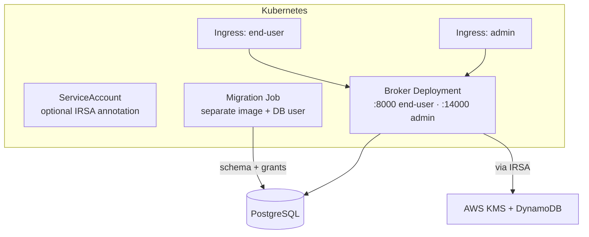

# Deploy on Kubernetes

The broker runs in containers on any Kubernetes cluster. The Helm chart is in
`charts/agentic-identity-broker`. This guide starts with an in-memory evaluation install.
It then describes a production layout with external PostgreSQL, KMS encryption, and
least-privilege AWS access.

The chart deploys a broker Deployment with an end-user API on port 8000 and an admin API
on port 14000. It also deploys resources for storage, migrations, ingress, and AWS
encryption.

## Prerequisites

- A Kubernetes cluster, version 1.25 or later.
- `kubectl`, configured for that cluster.
- Helm 3.x.

For production, you also need these components:

- PostgreSQL version 12 or later. The cluster must be able to access it. You can use the
  Zalando PostgreSQL Operator to create it.
- Encryption infrastructure. Encryption at rest is mandatory. On AWS, use a
  customer-managed KMS key and a DynamoDB branch-key table. See
  [configure encryption at rest](./configure-encryption.md).

## What the chart deploys



The chart main options follow:

| Option | Values key | Purpose |
|---|---|---|
| **Storage** | `storage.type` | `memory` for evaluation or `postgres` for production. |
| **External PostgreSQL** | `postgresql.external.*` | Use an existing database with separate migration and broker credentials. |
| **Operator-managed PostgreSQL** | `postgresql.operator.*` | The Zalando PostgreSQL Operator creates a cluster, users, and Secrets. |
| **Migration Job** | `migration.*` | A one-shot Job applies schema changes before the broker starts. It has a least-privilege database user. |
| **End-user Ingress** | `ingress.enduser.*` | Expose port 8000 behind the authenticating proxy. |
| **Admin Ingress** | `ingress.admin.*` | Expose port 14000 on a restricted path. |
| **Service account / IRSA** | `serviceAccount.*` | Bind an AWS IAM role for KMS and DynamoDB access. |
| **Encryption** | `broker.encryption.*`, `broker.extraConfig.encryption.*` | Select the required encryption backend. |

The chart uses restricted Pod Security defaults. It runs as a non-root user. Its root file
system is read-only. It has no privilege escalation or Linux capabilities.

## Evaluate with in-memory storage

For an evaluation, start the broker with in-memory storage and encryption. Encryption is
mandatory. Supply an encryption key and JWE signing key. Both keys are base64-encoded and
contain 32 bytes:

```bash
helm install broker ./charts/agentic-identity-broker \
  --set-string broker.extraConfig.encryption.memory.raw_key="$(openssl rand -base64 32)" \
  --set broker.thirdPartyOauth2.jweSigningKey="$(openssl rand -base64 32)"
```

Examine the pod and use the health endpoint:

```bash
kubectl get pods -l app.kubernetes.io/name=agentic-identity-broker
kubectl port-forward svc/broker-agentic-identity-broker 8000:8000
curl http://localhost:8000/health
```

:::warning
In-memory storage loses agents, services, grants, and sessions when a pod restarts. The
evaluation key is in a ConfigMap. Use this mode only to evaluate the broker. Do not use it
for real delegations.
:::

## Deploy for production

A production install uses persistent PostgreSQL, KMS-backed encryption, and IRSA AWS access.
Create a values file. Add each section, then install the release.

### Provision PostgreSQL with two database users

Use a persistent database with two roles. The running broker must not have schema-modification
rights:

- A **migration user** has schema privileges: `CREATE`, `ALTER`, and `DROP`. Only the
  migration Job uses this role.
- A **broker user** has data privileges: `SELECT`, `INSERT`, `UPDATE`, and `DELETE`. Only
  the running broker uses this role.

Create them in your database:

```sql
-- Migration user: schema changes
CREATE USER "broker-migration" WITH PASSWORD 'REPLACE_ME';
GRANT ALL PRIVILEGES ON DATABASE broker TO "broker-migration";
GRANT ALL PRIVILEGES ON SCHEMA public TO "broker-migration";

-- Broker user: data access only
CREATE USER broker WITH PASSWORD 'REPLACE_ME';
GRANT CONNECT ON DATABASE broker TO broker;
GRANT USAGE ON SCHEMA public TO broker;
GRANT SELECT, INSERT, UPDATE, DELETE ON ALL TABLES IN SCHEMA public TO broker;
GRANT SELECT, UPDATE ON ALL SEQUENCES IN SCHEMA public TO broker;
ALTER DEFAULT PRIVILEGES IN SCHEMA public
  GRANT SELECT, INSERT, UPDATE, DELETE ON TABLES TO broker;
```

Store each credential in a Kubernetes Secret:

```bash
kubectl create secret generic broker-db-migration \
  --from-literal=username=broker-migration --from-literal=password=REPLACE_ME
kubectl create secret generic broker-db \
  --from-literal=username=broker --from-literal=password=REPLACE_ME
```

You can instead enable `postgresql.operator`. The Zalando PostgreSQL Operator then creates
the cluster, both users, and their Secrets. The chart configures these resources.

### Wire encryption to KMS

Set the KMS key and branch-key table in `broker.extraConfig`. The chart merges this block
into the broker configuration:

```yaml
broker:
  extraConfig:
    encryption:
      aws_kms:
        key_arn: "arn:aws:kms:us-east-1:ACCOUNT:key/KEY-ID"
        dynamodb_table_name: "AgenticIdentityBrokerBranchKeys-prod"
        region: "us-east-1"
        branch_key_ttl: "1h"
```

The project AWS CDK stack can provision the KMS key, DynamoDB table, and IAM role together.
See [configure encryption at rest](./configure-encryption.md#production-aws-kms-hierarchical-keyring)
for the resource details. See [deployment checklist](../operations/deployment-checklist.md)
for commands and resource ARNs.

### Grant AWS access with IRSA

On EKS, use **IAM Roles for Service Accounts (IRSA)** instead of static AWS credentials.
IRSA maps the broker service account to an IAM role through the cluster OIDC provider. The
AWS SDK obtains and rotates temporary credentials. CloudTrail records the pod identity that
used the credentials.

At the operator level:

1. Provision an IAM role for the broker service account. Its trust policy must allow
   `system:serviceaccount:<namespace>:<service-account>` to assume the role. Grant the role
   access to the KMS key and DynamoDB branch-key table. The CDK stack creates this limited
   role.
2. Configure the chart to create the service account and add the role annotation:

   ```yaml
   serviceAccount:
     create: true
     name: broker-sa
     irsa:
       enabled: true
       role: "arn:aws:iam::ACCOUNT:role/AgenticIdentityBrokerEncryptionRole-prod"
   ```

The chart adds the IRSA annotation to the service account. Every broker pod then has an
identity that can use the KMS key and table. For OIDC provider setup, CDK deployment, and
trust policy examination, see
[Kubernetes IRSA deployment guide](../deployment/kubernetes-irsa.md).

### Expose the two APIs separately

The broker ports serve different audiences. Use separate Ingress resources. Restrict the
admin Ingress:

```yaml
ingress:
  enduser:
    enabled: true
    className: nginx
    hosts:
      - host: broker.example.com
        paths:
          - path: /
            pathType: Prefix
    tls:
      - secretName: broker-tls
        hosts:
          - broker.example.com
  admin:
    enabled: true
    className: nginx
    annotations:
      # Restrict the admin API to internal networks.
      nginx.ingress.kubernetes.io/whitelist-source-range: "10.0.0.0/8"
    hosts:
      - host: broker-admin.internal.example.com
        paths:
          - path: /
            pathType: Prefix
```

Put the authenticating reverse proxy in front of the end-user Ingress. The broker does not
authenticate users. Keep the admin API off the public internet. See
[configure authentication](./configure-authentication.md).

### Install

Combine storage, encryption, IRSA, and ingress in `values-production.yaml`. Then add the
runtime settings:

```yaml
replicaCount: 3

storage:
  type: postgres

postgresql:
  external:
    enabled: true
    host: postgres.database.svc.cluster.local
    port: 5432
    database: broker
    migrationSecretName: broker-db-migration
    brokerSecretName: broker-db

serviceAccount:
  create: true
  name: broker-sa
  irsa:
    enabled: true
    role: "arn:aws:iam::ACCOUNT:role/AgenticIdentityBrokerEncryptionRole-prod"

broker:
  thirdPartyOauth2:
    # Reference the JWE signing key from a Secret rather than inlining it.
    jweSigningKeySecret:
      name: broker-jwe
      key: signing-key
  extraConfig:
    encryption:
      aws_kms:
        key_arn: "arn:aws:kms:us-east-1:ACCOUNT:key/KEY-ID"
        dynamodb_table_name: "AgenticIdentityBrokerBranchKeys-prod"
        region: "us-east-1"

autoscaling:
  enabled: true
  minReplicas: 3
  maxReplicas: 10
podDisruptionBudget:
  enabled: true
  minAvailable: 2
```

Install into a dedicated namespace:

```bash
kubectl create namespace identity-broker
helm install broker ./charts/agentic-identity-broker \
  -n identity-broker -f values-production.yaml
```

## The migration Job

With PostgreSQL storage, the chart starts a one-shot migration Job before the broker starts.
The Job is a Helm pre-install and pre-upgrade hook. It uses a separate migration image and
service account. The running broker image does not include schema-migration tools. The Job
applies schema changes with the migration user. It then grants data-access privileges to the
broker user.

The broker Deployment starts only after the Job succeeds. Examine the Job with:

```bash
kubectl get jobs -n identity-broker
kubectl logs job/broker-migrate -n identity-broker
```

## Health and verification

The broker serves `GET /health` on end-user port 8000 and admin port 14000. Use these
endpoints for liveness and readiness probes.

Examine deployment health:

```bash
# Pods and the migration Job
kubectl get pods -l app.kubernetes.io/name=agentic-identity-broker -n identity-broker
kubectl get jobs -n identity-broker

# Broker logs — confirm the encryption backend initialized
kubectl logs deployment/broker-agentic-identity-broker -n identity-broker

# Built-in chart tests
helm test broker -n identity-broker
```

At startup, the broker records the encryption backend that it initialized. A missing or
incorrect backend stops the broker. Kubernetes then puts the pod in `CrashLoopBackOff`.
Examine the logs for the encryption error. The
[deployment checklist](../operations/deployment-checklist.md) includes an encryption smoke
test and a post-deployment verification pass.

## Related

- [Configure encryption at rest](./configure-encryption.md) — the KMS key,
  DynamoDB table, and JWE signing key this guide references.
- [Configure authentication](./configure-authentication.md) — the
  reverse-proxy identity header in front of the end-user API.
- [Deployment checklist](../operations/deployment-checklist.md) — provisioning
  and verification steps for a production rollout.
- [Configuration](../configuration.md) — the full configuration schema behind the
  chart values.
