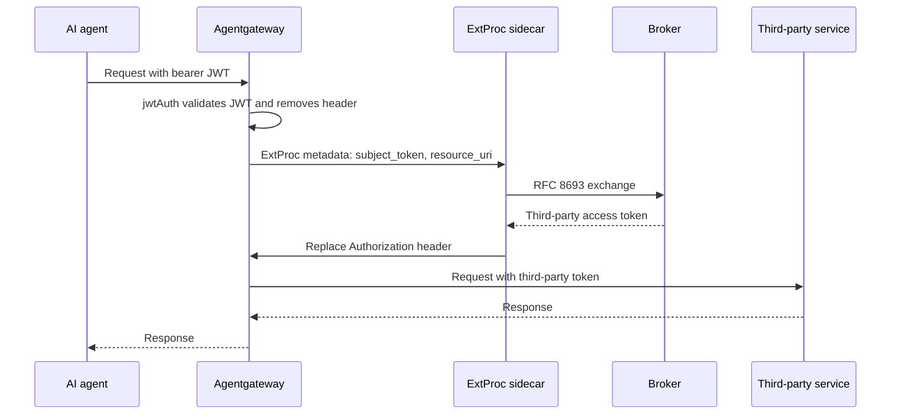

# Set up token exchange at the gateway

The ExtProc token-exchange service (`extproc-token-exchange`) is a standalone gRPC sidecar.
Agentgateway validates the inbound JWT and publishes trusted token-exchange inputs as Envoy dynamic metadata.
The sidecar performs [RFC 8693 token exchange](../concepts/token-exchange.md) with those inputs.

The sidecar accepts only `aib.tokenexchange.subject_token` and `aib.tokenexchange.resource_uri`.
It does not read `Authorization`, request pseudo-headers, or other raw HTTP attributes as token-exchange inputs.
After a successful exchange, it replaces the downstream `Authorization` header with the exchanged credential.

This guide describes the separate Agentgateway policy and ExtProc sidecar configuration.

## What you need

- An Agentgateway v1.5.0 instance with the ExtProc policy. Configure it with the `jwtAuth` syntax shown in this guide.
- A trusted JWT issuer and a JWKS source for the Agentgateway JWT provider.
- A reachable broker token endpoint at `POST /oauth2/token` on end-user port 8000.
- OAuth2 client credentials for the ExtProc sidecar. The sidecar uses them to obtain a client assertion for the broker.
- The sidecar container image (`Dockerfile.extproc`). The sidecar stores state only in an in-memory cache.
- A broker CEL policy if you restrict gateway exchanges. You can also add an OPA policy for the proxied request.

## How the exchange flows

The Agentgateway policy runs before the ExtProc sidecar receives the request:



1. Agentgateway applies `jwtAuth` with `mode: strict`. This policy validates the JWT before the ExtProc policy runs.
2. The ExtProc policy evaluates `jwt.rawToken.unredacted()` and its resource expression. It publishes both results in `aib.tokenexchange` metadata.
3. The sidecar validates both metadata fields. It rejects absent or invalid values and never derives inputs from raw HTTP attributes.
4. The sidecar exchanges the metadata values through the broker `/oauth2/token` endpoint. The broker returns the stored third-party token.
5. The sidecar replaces `Authorization` with `Bearer <exchanged token>`. Agentgateway forwards the request.

### Configure the Agentgateway producer

This block is Agentgateway policy configuration. It is not ExtProc sidecar configuration.
Keep `jwtAuth` before `extProc`. The latter expression needs the validated JWT claims from the former policy.

```yaml
binds:
  - port: 4000
    listeners:
      - routes:
          - policies:
              jwtAuth:
                mode: strict
                preserveToken: false
                providers:
                  - issuer: "https://issuer.example.com"
                    audiences:
                      - "mcp-server"
                    jwks:
                      url: "https://issuer.example.com/.well-known/jwks.json"
              extProc:
                host: "extproc-token-exchange:50051"
                failureMode: failClosed
                metadataContext:
                  aib.tokenexchange:
                    subject_token: "jwt.rawToken.unredacted()"
                    resource_uri: "'https://mcp.example.com/mcp'"
            backends:
              - mcp:
                  targets:
                    - name: tools
                      mcp:
                        host: "https://mcp.example.com/mcp"
```

`preserveToken: false` removes the validated request header before ExtProc runs. Agentgateway retains a claims copy for the following metadata expression.
The claims copy stays inside Agentgateway. Only the fields produced by `metadataContext` cross the gRPC boundary.

Use `jwt.rawToken.unredacted()` exactly. `jwt.rawToken` without `.unredacted()` is redacted and does not produce the raw subject credential.
The `subject_token` result must be the raw bearer credential with no `Bearer ` prefix. The sidecar passes an accepted value to the broker unchanged.

`aib.tokenexchange` is one literal metadata namespace, not a nested configuration path. Both fields must be strings.
Set `resource_uri` to a CEL string literal. It must resolve to an absolute `http` or `https` URL with a non-empty host.

The configured `resource_uri` must exactly match the protected resource that is registered with the broker.

### Fail-closed behavior

The sidecar rejects the request if either required metadata field is absent, empty, non-string, or invalid.
It validates `subject_token` before `resource_uri`. If both are invalid, it returns `invalid_subject_token`.
The response is a 503 JSON immediate response. Diagnostics never contain the subject credential or rejected resource URI.

If exchange fails, the sidecar does not forward the original credential to the third-party service. Generic exchange errors, broker 4xx errors without `error_uri`, transient 429 or 5xx errors, network errors, and timeouts return HTTP 500 with `{"error":"token_exchange_failed","error_description":"token exchange request failed"}`.

If a nontransient broker error contains `error_uri`, MCP receives JSON-RPC code `-32042` URL elicitation. Non-MCP traffic receives the 503 re-authentication response. Expired assertions and open circuits also return their defined 503 responses.

## Configure the sidecar

This is ExtProc sidecar configuration. It does not configure Agentgateway `jwtAuth`, JWKS, `preserveToken`, or `metadataContext`.
The sidecar environment prefix is `EXTPROC_`. Each key maps to `EXTPROC_<SECTION>_<KEY>`.
For example, `grpc.port` maps to `EXTPROC_GRPC_PORT`. String values support `${VAR}` substitution for secret injection.

```yaml
grpc:
  bind: "0.0.0.0"
  port: 50051
  max_concurrent_streams: 100

oauth2:
  # The broker's RFC 8693 token endpoint (required)
  token_endpoint: "https://identity-broker.example.com/oauth2/token"
  # The upstream OAuth2 issuer the sidecar authenticates against (required)
  issuer: "https://upstream-oauth2.example.com"
  # Client credentials for the sidecar itself
  client_id: "extproc-gateway"
  client_secret: "${EXTPROC_OAUTH2_CLIENT_SECRET}"
  # Explicit client_credentials endpoint; defaults to {issuer}/oauth/token
  # client_credentials_endpoint: "https://upstream-oauth2.example.com/oauth/token"
  client_assertion_type: "id_token"
  exchange_timeout: "5s"
  tls:
    # Leave false in production; the endpoints must be https unless this is true
    allow_http: false

cache:
  default_ttl: "5m"   # TTL for a cached token when the response omits expires_in
  max_ttl: "1h"       # hard cap on how long any exchanged token is cached

log:
  level: "info"
  format: "json"
```

The Agentgateway `extProc.host` value points to the sidecar `grpc.bind:grpc.port` listener. The default listener is `0.0.0.0:50051`.
Key sidecar settings follow:

- **`oauth2.token_endpoint`** — The broker `/oauth2/token` endpoint. The sidecar sends each exchange to this endpoint.
- **`oauth2.issuer`**, **`client_id`**, and **`client_secret`** — The sidecar obtains a client assertion through the upstream client-credentials grant. It refreshes the assertion in the background.
- **`oauth2.tls.allow_http`** — Keep this value `false`. The token endpoint and issuer use `https` unless you explicitly allow HTTP for local development.
- **`cache.default_ttl` / `cache.max_ttl`** — These values limit cache lifetime. The sidecar derives lifetime from the exchange response `expires_in`. It uses `default_ttl` when the response omits that value, then limits it to `max_ttl`.

Inject the client secret through the environment. Do not commit it. The sidecar redacts sensitive values from logs.

## The two-gate model

Two independent policy gates can guard a request. Both gates must allow the request:

| Gate | Where | Question it answers |
|---|---|---|
| Broker CEL | Broker `POST /oauth2/token` | Can this gateway exchange a token for this resource? |
| ExtProc OPA | Sidecar request path | Can this proxied request or MCP tool call continue? |

The broker CEL policy is configured on the broker. It decides whether exchange is allowed.
The optional sidecar OPA policy can restrict the proxied request after exchange. It cannot
give access that the broker denied. See
[token exchange](../concepts/token-exchange.md) for the broker CEL policy.

### Optional OPA gate

To evaluate a proxied request, including MCP tool calls, with a Rego policy, add an
`authorization` block. The sidecar buffers and evaluates requests that contain a body. An
undefined result denies the request.

```yaml
authorization:
  enabled: true
  policy:
    # A local Rego file or directory...
    path: "/etc/extproc/policy.rego"
    # ...or an OPA config file for bundles/discovery (mutually exclusive with path)
    # config_file: "/etc/extproc/opa-config.yaml"
    package: "aib.extproc.authz"
    decision: "result"
  default_decision: "deny"   # keep as deny for fail-closed behavior
  evaluation_timeout: 100ms
  max_body_size: 1048576     # bytes buffered for evaluation (1 MiB)
```

:::warning
Keep `default_decision: "deny"`. If a policy result is undefined or evaluation times out,
the OPA gate denies the request.
:::
## Use a trusted Compose JWT

The Compose gateway trusts upstream JWTs from `http://upstream-oauth2:9001` and broker-issued local JWTs from `http://localhost:3000`.

An upstream JWT must contain `token-exchange-broker` in `aud` and identify a registered agent in `azp`. A local JWT must contain the same audience and its broker-issued `agent_id` claim.

### Use a sample-client token

1. Open `http://localhost:9002/`.
2. Select **Login as Local Client** or **Login as Proxy Client**.
3. If you select the local client, connect the listed third-party service.
4. Approve the requested delegation.
5. Select **Call MCP Tool: whoami (allowed)**.

The sample client sends its issued JWT to Agentgateway. It does not expose the credential in a command argument or output.

Before you call the gateway, create an active user grant and a third-party OAuth2 session for the JWT subject. The broker rejects a token without either record.

Give the JWT to a local MCP client as its bearer token. Do not print the credential or put it in command arguments or command history.


## Deployment notes

- **No database.** The sidecar stores only an in-memory cache. Start one sidecar instance
  for each gateway pod. Each instance has its own cache.
- **Container image.** To build a release image, use `just docker-build-extproc`. The command
  builds Linux artifacts for amd64 and arm64. Then it packages the default Dockerfile
  target. To build a source-based development image, run:

  ```bash
  docker build --target development --file Dockerfile.extproc .
  ```

  Configure the sidecar with a YAML file or `EXTPROC_` environment variables.
- **Placement.** Start the sidecar with the gateway. Token exchange then occurs at the edge,
  before the request reaches the third-party service. See
  [architecture](../concepts/architecture.md) for the sidecar location.

## Related

- [Token exchange](../concepts/token-exchange.md) — the concept and the broker-side flow.
- [Token exchange reference](../reference/token-exchange.md) — the RFC 8693 request and
  response contract.
- [Architecture](../concepts/architecture.md) — the sidecar's place in the system.
