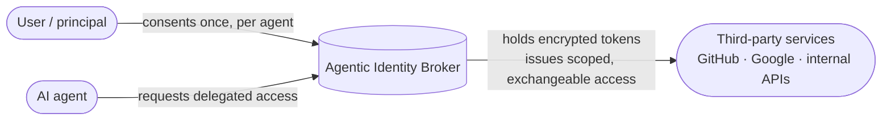

# What is the Agentic Identity Broker?

The Agentic Identity Broker is an open-source **OAuth2 broker for delegation and consent**.
It lets a user give an AI agent access to third-party services. Access is scoped to
specific permissions. The user can limit it by time or revoke it.

The broker sits between three parties:

A user gives consent once for each agent and service. The broker stores third-party tokens
**encrypted at rest**. It gives agents scoped, exchangeable, auditable access. An agent
never sees the user's long-lived credentials.

## The problem

AI agents often call services for the people they work for. They can read a repository,
file a ticket, query a warehouse, or send a calendar invite. Each common access method
has a failure mode that an IAM team can recognize:

| Approach | Why it breaks down |
|---|---|
| Hand the agent the user's OAuth token | The token is too broad. You cannot revoke it per agent. There is no record of agent activity. Tokens spread to every agent. |
| Give each agent its own third-party client | It does not scale. There is no shared consent interface. Provider secrets are copied to every agent. |
| Static API keys or shared service accounts | There is no per-user delegation or expiry. Consent and audit are weak. |

Each option loses **least privilege**, **user consent**, **revocability**, or
**auditability**. Most options lose several. With many agents and users, token sprawl
creates security and operational problems.

## The approach

The broker inserts a single, governed trust boundary:

- **The user consents** to a specific permission set for a specific agent and service. A
  grant can expire.
- **The broker holds the third-party tokens.** It encrypts each token with per-service
  envelope encryption and refreshes tokens when necessary.
- **Agents receive scoped access.** At request time, a gateway can exchange an agent
  token for the appropriate third-party token with
  [RFC 8693 token exchange](../concepts/token-exchange.md). Agents never hold provider
  credentials.
- **The broker records every delegation.** A user can withdraw a grant or end a
  third-party session. Dependent agents then lose access.

The broker supports standard OAuth2. It exposes an
[authorization-server surface](../concepts/oauth2-server-modes.md) (RFC 6749
authorization code + PKCE, RFC 8414 metadata, and a JWKS endpoint). It can proxy an
existing corporate authorization server or issue its own tokens.

## Who it is for

- **IAM and security teams.** They can apply current consent, least-privilege, and audit
  rules to agent access.
- **Platform and infrastructure operators.** They can use a broker rather than repeat
  token storage and refresh in each agent.
- **Teams that use an agent gateway.** They can use policy-checked token exchange at the
  edge.

## What it is not

- It is **not a user identity provider**. The broker does not authenticate humans. A
  trusted reverse proxy authenticates the user and sends the identity in a header.
  Continue to use Keycloak, Auth0, Okta, or your corporate IdP for human login. See
  [Why not a traditional IdP?](./why-not-idp.md).
- It is **not a general secrets manager**. It stores OAuth2 delegations and their
  third-party tokens. It does not store arbitrary application secrets.

## Where to go next

- **[Use cases](./use-cases.md)** — concrete scenarios where delegated agent
  access is the hard part.
- **[Why not a traditional IdP?](./why-not-idp.md)** — how the broker
  complements, rather than replaces, your identity provider.
- **[Concepts](../concepts/index.md)** — the delegation model, architecture, server modes, token
  exchange, and encryption.
- **[Get started](../get-started/index.md)** — run the full stack locally and walk a delegation
  end to end.
