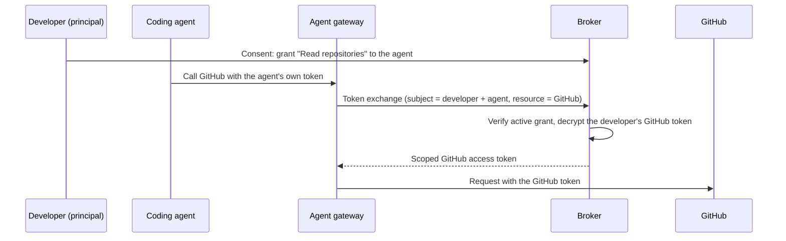

# Use cases

The broker is useful when an AI agent must call a third-party service for a user. This
includes GitHub, Databricks, and Google. Many agents can act for many users. Each agent
needs limited access. A user must give consent and be able to revoke access.

The following scenarios show common identity problems. Each scenario explains how the
[delegation model](../concepts/delegation-and-consent.md) addresses the problem.

## A coding agent acting for many developers

### The scenario

You run a coding agent that reviews pull requests, opens issues, and reads GitHub
repositories. It acts for hundreds of developers. Each developer expects the agent to
access only the resources that the developer can access. The agent is a shared service,
but its access must match the developer for the current request.

### The identity challenge

Copying every developer's GitHub token to the agent creates token sprawl. The service
stores long-lived credentials with broad access. You cannot revoke one developer's access
without affecting other developers. The service also has no record of which developer
authorized each call. A leaked process exposes every developer token.

### How the broker solves it

An administrator defines a permission set, such as **Read repositories**. The set groups
the required GitHub scopes (`repo:status`, `read:org`). Each developer grants the set to
the agent. This creates one grant for each developer and agent. The broker stores GitHub
tokens in encrypted form, one session for each developer. At request time, a gateway
exchanges the agent token for the correct developer GitHub token with
[token exchange](../concepts/token-exchange.md).

Revoking one developer grant stops token exchange immediately. It does not affect other
developers. See [Token exchange at the gateway](../guides/token-exchange-gateway.md) for
deployment information.

## An internal copilot reading the warehouse per analyst

### The scenario

Your analytics team builds an internal copilot that queries a Databricks warehouse. Each
analyst can access different data. The copilot must use only the entitlements of the
analyst who made the request.

### The identity challenge

Using one shared service account gives every analyst the same identity. The warehouse
cannot identify the analyst who ran a query. Least privilege and audit information are
lost. You also cannot remove one analyst's access without disrupting other analysts.

### How the broker solves it

Register Databricks as a third-party OAuth2 service. Map the warehouse scopes to a
read-only permission set. Each analyst grants that set to the copilot. The broker creates
a separate grant for each analyst. When the copilot queries the warehouse, the gateway
exchanges its token for the calling analyst's Databricks token. The query uses that
analyst's entitlements. Each exchange identifies the analyst, agent, and resource.
Revoking a grant removes the copilot's access for that analyst without a deployment.

## A personal assistant with time-boxed Google access

### The scenario

A personal-assistant agent schedules meetings and drafts email with Google Calendar and
Gmail. Users can grant access for a defined period, such as a project or quarter. They
expect that access to end when the period ends.

### The identity challenge

Giving the assistant a broad Google token gives it standing access to a user's mailbox
and calendar. The access has no expiry. The user cannot see or limit the granted access.
There is no consent record. Access continues until the user revokes it.

### How the broker solves it

An administrator defines permission sets in business terms, such as **Read calendar** and
**Send mail**. Users consent to those sets instead of raw provider scopes. Each user
grants the selected sets to the assistant and can set `valid_until` on the grant. The
broker stops honoring the grant when that time ends. The broker stores Google tokens in
encrypted form, refreshes them when necessary, and does not expose them to the assistant.
Users can review and revoke the delegation in the consent interface.

:::note
An agent can mark some access as mandatory and some access as optional. The assistant can
require calendar access and treat mail access as optional. A user who declines mail access
can still use the assistant. See
[mandatory vs optional requirements](../concepts/delegation-and-consent.md#mandatory-vs-optional-requirements).
:::

## An agent platform serving many agents and many users

### The scenario

You operate an agent platform or marketplace. Many agents from different teams act for
many users with third-party services. You need one place for consent, revocation, and
records of each delegation.

### The identity challenge

When each agent manages its own delegation, the user experience differs between agents.
Each agent stores its own tokens and shows its own consent request. Users cannot view all
their grants in one place. Administrators cannot revoke one agent for all its users or
identify which agents can act for one user.

### How the broker solves it

The broker is the trust boundary for the platform. Permission sets define what an agent
requests and what a user approves. The consent interface uses the same format for every
agent. Agents can use a Client ID Metadata Document. The consent interface can then show
validated metadata about the requesting agent. The broker records every grant. Users can
revoke each grant. Ending a third-party session removes access for dependent agents. The
broker shows these agents before it ends the session.

## When this fits

- An AI agent must call a third-party OAuth2 service on a user's behalf, and access has to
  track the individual user.
- You need per-agent, per-service consent that a user can review, time-box, and revoke.
- You want third-party tokens held in one encrypted vault instead of copied into agents.
- You run a gateway that can exchange an agent's token for the right third-party token at
  request time.
- You need every delegation recorded and every agent revocable without redeploys.

If you are weighing this against your existing identity stack, read
[Why not a traditional IdP?](./why-not-idp.md) — the broker complements your
IdP rather than replacing it.
