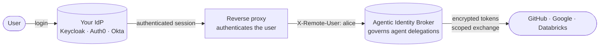

# Why not a traditional IdP?

If you use Keycloak, Auth0, Okta, or a corporate identity provider, you can expect an
identity broker to compete with it. The broker does not compete with your IdP. It
**complements** your IdP and depends on it. Your IdP answers one question: *who is this
human?* The broker answers another: *what can this agent do for this human with a
third-party service?*

Your IdP handles human login. The broker governs agent delegation. Both services receive
requests in the same path but handle different concerns.

## The IdP and the broker

An IdP authenticates people and federates user sessions. It handles login, single
sign-on, multi-factor challenges, and the user directory. The broker does not provide
these functions. It **never authenticates a human**. It trusts an identity from a proxy
and decides which agents can act for the person. It also defines which third-party
permissions an agent can use.

This division is intentional. The broker starts after authentication. It manages consent,
holds third-party tokens in encrypted storage, and exchanges an agent token for a
third-party token. It has no login page, password store, or user directory.

## Division of responsibilities

| Your identity provider owns | The broker owns |
|---|---|
| Human login and credential verification | Per-agent, per-service delegation |
| Single sign-on across your applications | Consent expressed as permission sets |
| Multi-factor and step-up authentication | An encrypted vault of third-party tokens |
| The user directory and profile source of truth | RFC 8693 token exchange at the gateway |
| Password reset, social login, account lifecycle | Per-agent revocation and grant expiry |

The columns do not overlap. The IdP establishes identity. The broker governs the services
and permissions that an agent can use.

## They work together

The broker is behind an IdP-backed reverse proxy. The proxy authenticates each user,
often through your IdP. It sends the authenticated principal to the broker in
`X-Remote-User` by default. The broker accepts that header only from the proxy. The proxy
also enforces administrator privilege before requests reach the admin API.

The broker can validate a signed JWT from the proxy. It can read a display profile from
the token claims. Your IdP or proxy issues that token. The broker does not run its own
login. Human authentication stays in your existing stack.

## When the broker fits

### Choose the broker when

- An AI agent must act for a user with a third-party OAuth2 service.
- A user must be able to review, time-limit, and revoke per-agent, per-service consent.
- Third-party tokens must stay in one encrypted vault, not in agents.
- A gateway must exchange an agent token for the appropriate third-party token at request
  time. See [token exchange](../concepts/token-exchange.md).

### You still need your IdP for

- Authenticating humans: login, passwordless, social, and enterprise credentials.
- Single sign-on across your applications.
- Multi-factor and step-up authentication.
- Being the source of truth for who your users are — their directory and profile.

The broker expects an existing authentication system. It does not replace an IdP, a
high-throughput machine-to-machine authentication layer, a federation fabric, or an
offline-verification system.

## Related

- [What is the Agentic Identity Broker?](./index.md) — the one-paragraph picture.
- [Use cases](./use-cases.md) — where delegated agent access is the hard part.
- [Delegation and consent](../concepts/delegation-and-consent.md) — the model the broker
  governs.
- [Architecture](../concepts/architecture.md) — how the pieces fit at an operator level.
