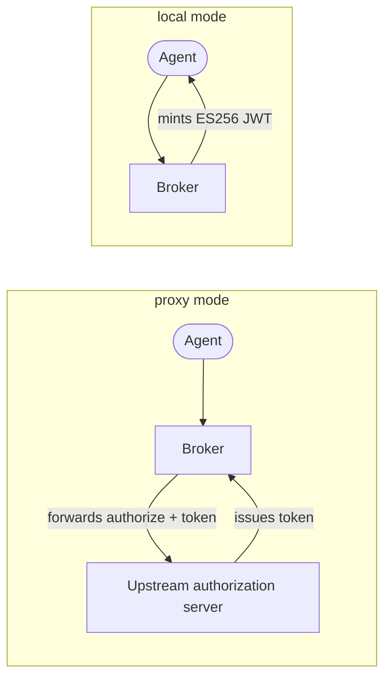

# OAuth2 server modes

The broker provides a standard OAuth2 **authorization-server surface**. Agents use the same
protocol as other clients. The broker can forward authorization to an existing server, issue
its own tokens, or use both. This page explains these three modes. For setup steps, see
[operate the OAuth2 server modes](/docs/guides/operate-oauth2-server-modes).

The broker uses one mode for its lifetime. Configure the mode with
`oauth2_authorization_server.mode`.

## The public OAuth2 surface

Every mode serves the same four public endpoints on end-user port 8000. The backend behavior
differs by mode.

| Endpoint | Purpose |
|---|---|
| `GET /oauth2/authorize` | RFC 6749 authorization endpoint — where an agent's authorization request begins. |
| `POST /oauth2/token` | Token endpoint — authorization-code and client-credentials grants, plus [token exchange](/docs/concepts/token-exchange). |
| `GET /oauth2/jwks.json` | The public JSON Web Key Set used to verify tokens the broker vouches for. |
| `GET /.well-known/oauth-authorization-server` | RFC 8414 metadata describing the endpoints, grant types, and PKCE method above. |

Every mode uses these security rules:

- **PKCE with `S256` is required.** The authorization endpoint accepts only `S256` for the
  code challenge. It does not accept `plain`.
- **`client_id` on `/oauth2/authorize` is the agent UUID.** The UUID identifies the agent in
  the broker. It is not an upstream OAuth2 client ID. The broker uses the UUID to select
  request handling.

In local and hybrid modes, broker-issued authorization codes expire after 60 seconds.
An expired code returns `invalid_grant`, even with valid client credentials and a valid PKCE verifier.
The broker removes expired authorization codes, PKCE sessions, and refresh-token sessions at startup and every minute.
Cleanup errors do not extend code validity.

## The three modes

### Proxy

In `proxy` mode, the broker forwards `/oauth2/authorize` and `/oauth2/token` to your upstream
authorization server. It still applies the grant system. The upstream server issues the
tokens. The broker serves its own RFC 8414 metadata. Its JWKS republishes the upstream public
keys. Verifiers then use one broker endpoint.

At startup, the broker gets upstream metadata. It does not start when this request fails. If
upstream keys later become unavailable, the broker fails closed. `/oauth2/jwks.json` returns
`503`. Flows that require key validation reject requests until upstream keys return.

### Local

In `local` mode, the broker is an OAuth2 authorization server. It issues JWT access tokens
with managed **ES256** keys. Its JWKS and metadata contain only broker-managed keys. Local
mode supports these flows:

- **`client_credentials`** — An agent uses broker-issued credentials. `client_id` is the
  agent UUID. `client_secret` begins with `brk_sec_`.
- **`authorization_code` with PKCE** — An interactive flow for an agent that acts for a
  user.
- **RFC 8693 user impersonation** — A configured privileged client provides client assertion,
  actor, and subject credentials for an audience-selected registered target. The broker
  issues a locally signed token with subject and actor data. This flow is unavailable in
  proxy and hybrid modes. See
  [user impersonation](/docs/reference/token-exchange#user-impersonation).

The broker can rotate signing keys. Before it signs with a new key, it publishes the key to
the JWKS for an activation grace period. This lets token verifiers get the public key. Local
mode does not require an external authorization server.

### Hybrid

In `hybrid` mode, the broker uses both strategies. Agent registration selects the strategy:

- An agent with an upstream client ID uses the proxy path.
- A local agent or a [CIMD](#client-identity-and-cimd) agent receives a locally issued token.

Hybrid mode can serve a mixed agent fleet during a migration or permanently. Both upstream
configuration and local issuance are active. The metadata and JWKS expose the keys for both
strategies.

### Comparison

| Mode | Who issues tokens | Choose it when |
|---|---|---|
| `proxy` (default) | Your upstream authorization server issues tokens. The broker forwards requests and republishes upstream keys. | You use a corporate authorization server for agents. The broker adds consent and delegation. |
| `local` | The broker issues ES256-signed JWT access tokens with managed keys. | You have no authorization server for agents. Or, the broker is the agent token authority. |
| `hybrid` | The broker dispatches by registered agent. | You have agents with upstream clients and agents with local or CIMD registration. |

## Inbound CIMD client resolution

The broker uses **inbound CIMD client resolution** when an agent presents an HTTPS `client_id` to the broker's authorization-server surface. The broker fetches and validates that agent's Client ID Metadata Document before consent. This feature is available only in local and hybrid mode.

The `client_id` form controls what the broker can tell a user during consent. There are two forms:

- **An opaque UUID.** This is the default. The UUID is the agent internal identifier. An administrator creates it during registration. It contains no metadata. The broker uses only its registration data.
- **An HTTPS URL that points to a Client ID Metadata Document (CIMD).** An agent can use this URL as its `client_id` when CIMD is enabled. The broker fetches and validates the JSON document. The consent interface shows its name, description, governance link, and documentation links.

An operator can register a CIMD URL pattern in `client_uris`.
The `*` character matches one complete, non-empty path segment.
The scheme, host, port, and other path segments stay literal.
For example, `https://chatgpt.com/oauth/codex/*/client.json` matches one installation identifier.
The broker uses an exact registration first.
It rejects multiple matching Agents and literal or encoded path separators.

Inbound CIMD provides two functions:

- **Self-describing agents.** An agent can be registered by URL. The broker has metadata for the user who decides about delegation.
- **SSRF-protected fetches.** A configurable blocklist prevents the broker from fetching internal addresses. An agent URL does not become a request-forgery path.

## Outbound CIMD client authentication

For a `private_key_jwt` third-party service, the broker is the OAuth2 client. It publishes a broker-hosted client identity and signs outbound token requests with its dedicated CIMD client-authentication keys. This works independently of inbound CIMD client resolution and is available in proxy, local, and hybrid mode.

## Where token issuance meets delegation

Server modes decide who signs an agent token. They do not grant access to a third-party
service. The [delegation and consent model](/docs/concepts/delegation-and-consent) grants
that access. The broker enforces the model before it completes an authorization request. A
gateway uses [token exchange](/docs/concepts/token-exchange) to obtain a third-party
credential. Delegation and exchange decide which services the token can access.

## Related

- [Operate the OAuth2 server modes](/docs/guides/operate-oauth2-server-modes) — configure and
  run each mode.
- [Token exchange](/docs/concepts/token-exchange) — how an agent's token becomes a
  third-party token.
- [Delegation and consent](/docs/concepts/delegation-and-consent) — the consent the broker
  enforces before any authorization request proceeds.
