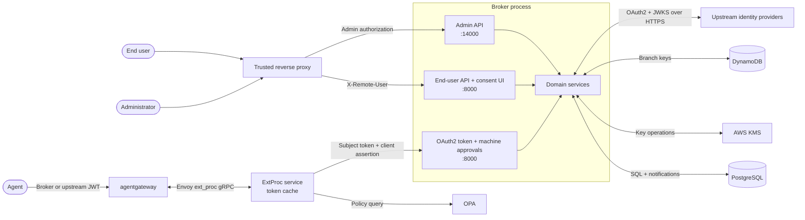

# Security assurance case

The Agentic Identity Broker (AIB) stores third-party OAuth2 tokens for users. Users can delegate scoped, revocable access to AI agents. This delegation does not require users to hand their credentials to agents.

A flaw in AIB can let an agent impersonate a user without consent. This case argues that a production deployment meets five security requirements. It names the code, tests, and CI jobs that support each argument. It also names operator responsibilities and accepted risks.

We follow the [OpenSSF Best Practices](https://www.bestpractices.dev/en/criteria/1) `assurance_case` criterion. Section 1 describes the threat model, and section 2 identifies trust boundaries. Section 3 explains the secure design. Section 4 maps controls to common weaknesses. Section 5 lists assumptions and accepted risks. [Security posture](/docs/resources/security) covers operational controls and vulnerability reports.

**Scope.** This argument covers a production deployment with an authenticating reverse proxy, PostgreSQL, and AWS KMS with DynamoDB branch keys. The in-memory storage adapter, the `memory` encryption backend (a static raw AES key from configuration), and the `security.skip_*` flags are for development and tests. When a deployment uses them, this argument does not hold.

| Requirement | Argued in |
|---|---|
| **SR1.** Only the authenticated user can grant, revoke, or approve access on their own behalf. | Sections 2 and 3 (separation of privilege), A01 in section 4 |
| **SR2.** An agent receives a third-party credential only with a valid subject token, a valid gateway assertion, and an active grant. | Section 3 (complete mediation), A07 in section 4 |
| **SR3.** The broker stores third-party tokens and signing keys only in encrypted form. It stores agent client secrets only as hashes. | Section 3 (fail-safe defaults), A02 in section 4 |
| **SR4.** Agent-supplied URLs cannot reach internal networks. Authorization codes cannot be redirected to an attacker. | Section 3 (validate untrusted destinations), A01 and A10 in section 4 |
| **SR5.** When a security control fails, the broker denies the request. | Section 3 (fail-safe defaults), with two exceptions in section 5 |

## 1. Threat model

The assets we protect, in order of value, are: the vaulted third-party access and refresh tokens; the local signing keys and the ability to mint broker tokens; provider client secrets; the consent state (grants, permission sets, approvals) that decides who gets what; the upstream OAuth2 client identity; and the audit trail. Availability of the token endpoint matters less, because the gateway fails closed when the broker is down.

We consider seven adversaries:

1. A malicious or compromised agent. It holds a valid broker or upstream token for some user and wants the raw third-party credential, or more scope than the user consented to.
2. An unauthenticated network attacker who can reach a broker or ExtProc port directly, for example through a misconfigured Ingress or a flat cluster network.
3. A cross-site web attacker who can make the user's browser send requests but cannot read the responses.
4. Another workload in the same cluster that can open TCP connections to the broker or ExtProc pods.
5. A database-level attacker with read or write access to PostgreSQL but no access to KMS.
6. A relying party of the same upstream identity provider, holding tokens signed by the shared JWKS.
7. A privileged operator or CI job, as a source of misconfiguration and supply-chain risk.

We also consider attackers who control a broker, ExtProc, or migration pod. The STRIDE letters identify threat types. They do not claim that we eliminate every variant.

| Asset | Threat (STRIDE) | Control and remaining exposure |
|---|---|---|
| End-user sessions | Spoof a principal through `X-Remote-User` (S), tamper with consent context (T), read session tokens (I). | The proxy authenticates users and must strip client-supplied identity headers. We seal the authorization context in a JWE with a 10-minute lifetime and bind it to its principal and agent ([ADR 016](https://github.com/zalando-incubator/agentic-identity-broker/blob/main/adrs/016-authorization-session-anti-spoofing.md)). A compromised proxy or broker process is a trusted-system compromise. |
| Agent credentials | Steal a client secret (I), impersonate an agent (S), gain its privileges (E). | We show a client secret once and store only its Argon2id hash. A stolen plaintext secret stays usable until an administrator rotates it. |
| Issued and exchanged tokens | Intercept an authorization code (I), replay a code or token (S), redirect delivery to an attacker (T). | S256 PKCE, single-use codes, registered callback matching, JWT validation, and active-grant checks constrain issuance and exchange. Callers must still protect bearer tokens that we issue correctly. |
| Vaulted third-party tokens | Read tokens from a database dump (I), obtain a token without a grant (E), keep using a token after revocation (E). | Envelope encryption with KMS-protected branch keys, one branch key per service. Token exchange requires an active grant for the requesting agent. Revocation stops new exchanges at once; section 5 describes the ExtProc cache window. |
| Signing keys | Read private keys from storage (I), replace key material (T), mint tokens with a stolen key (E). | We encrypt private keys before storage with the `kid` as encryption context. The public JWKS contains no private fields. A compromised broker pod can use the keys while it runs. |
| Consent and approval records | Forge or alter a grant (T), deny a change (R), approve another user's request (E). | Principal ownership checks bind browser actions. Approval creation needs both a subject token and a gateway assertion. We log structured security events for investigation. Direct database write access can still corrupt records. |

Availability (D) also matters. Upstream outages, floods of authorization requests, and KMS or database failures can deny access. We limit some of this work with fetch timeouts, a request body limit on agent registration, and an [approval rate limiter](https://github.com/zalando-incubator/agentic-identity-broker/blob/main/internal/domain/approval/rate_limiter.go). By [default](https://github.com/zalando-incubator/agentic-identity-broker/blob/main/internal/config/loader.go), each replica allows 10 approval requests per minute for each principal and agent. The broker allows at most 50 pending approvals per principal and agent in the database.

When encryption or authorization fails, the broker denies the operation. Section 5 names the two places where we deliberately fail open. We do not claim availability during an upstream or infrastructure outage.

Encryption at rest limits the damage of a read-only database leak. It does not protect plaintext in the memory of a compromised broker pod. A compromised migration pod can alter records or schema.

## 2. Trust boundaries

These details apply to the trust boundaries in the diagram:

- **Proxy to broker.** The proxy authenticates users and injects `X-Remote-User`. The broker does not authenticate the proxy. It has no shared secret, mTLS, or source allowlist for this connection. Thus, it trusts the header from every caller that reaches the port. The deployment must block direct connections, and the proxy must remove or overwrite any identity header the client sent. [Authentication configuration](/docs/guides/configure-authentication) describes this requirement.
- **Admin port 14000.** The broker does not authenticate admin callers. It only records the principal for audit. The proxy alone decides who reaches this port ([`routing/admin.go`](https://github.com/zalando-incubator/agentic-identity-broker/blob/main/internal/adapters/http/routing/admin.go), [Authentication configuration](/docs/guides/configure-authentication)).
- **API audiences on port 8000.** Port 8000 hosts browser routes, OAuth2 endpoints, and machine approval routes. Approval creation needs a subject token and a client assertion. Sync needs the assertion, consume needs the subject token, and browser actions need the acting user ([ADR 018](https://github.com/zalando-incubator/agentic-identity-broker/blob/main/adrs/018-approval-endpoint-auth-boundaries.md)).
- **Broker to PostgreSQL.** Repositories persist grants, approvals, encrypted sessions, and encrypted signing keys. The runtime database user has data access. A separate migration job holds schema privileges ([ADR 009 migration image](https://github.com/zalando-incubator/agentic-identity-broker/blob/main/adrs/009-separate-migration-docker-image.md), [Kubernetes deployment](/docs/guides/deploy-on-kubernetes)).
- **Broker to KMS and DynamoDB.** The KMS key protects branch keys. DynamoDB stores branch-key records for the hierarchical keyring. A database dump alone does not contain the KMS root key ([ADR 009](https://github.com/zalando-incubator/agentic-identity-broker/blob/main/adrs/009-envelope-encryption-design.md), [ADR 010](https://github.com/zalando-incubator/agentic-identity-broker/blob/main/adrs/010-cdk-encryption-infrastructure.md)).
- **Broker to upstream providers and metadata endpoints.** The broker exchanges OAuth2 credentials and fetches JWKS over HTTPS. We treat agent-supplied client ID metadata document (CIMD) URLs as untrusted input. We fetch them only through the SSRF-protected fetcher ([ADR 015](https://github.com/zalando-incubator/agentic-identity-broker/blob/main/adrs/015-cimd-fetcher-architecture.md)).
- **agentgateway to ExtProc.** agentgateway validates the agent's JWT (`jwtAuth: strict`) and calls the standalone ExtProc service over the Envoy ext_proc gRPC protocol. ExtProc does not authenticate the gRPC caller and reads the subject token and resource URI from the gateway's `metadataContext` ([ADR 036](https://github.com/zalando-incubator/agentic-identity-broker/blob/main/adrs/036-extproc-metadata-token-exchange-input.md)). A successful response carries the exchanged third-party token in a header mutation. Thus, the deployment must restrict the ExtProc port to the gateway, for example with a NetworkPolicy or a loopback bind.
- **ExtProc to broker.** ExtProc requests an RFC 8693 exchange from the broker. It replaces the bearer token only on success. When the broker rejects the exchange, ExtProc rejects the request and forwards no credential. ExtProc caches exchanged tokens for their remaining lifetime, capped by `cache.max_ttl` (default 1 hour) ([ADR 011](https://github.com/zalando-incubator/agentic-identity-broker/blob/main/adrs/011-extproc-standalone-binary.md), [ADR 012](https://github.com/zalando-incubator/agentic-identity-broker/blob/main/adrs/012-extproc-in-memory-token-cache.md), [Token exchange gateway](/docs/guides/token-exchange-gateway)).
- **ExtProc to OPA.** When policy authorization is enabled, ExtProc builds a policy input from gateway metadata, request headers, and the parsed JSON-RPC body, and denies the request unless OPA allows it. Policy evaluation needs the request body, so agentgateway must deliver the `RequestBody` phase to ExtProc ([ADR 028](https://github.com/zalando-incubator/agentic-identity-broker/blob/main/adrs/028-opa-extproc-authorization.md)).

Three of these connections rely on network position instead of an authentication check: proxy to port 8000, proxy to port 14000, and agentgateway to ExtProc. On each, a caller that reaches the port is trusted. Section 5 states the operator conditions that follow. The broker verifies the peer cryptographically on the remaining connections: TLS to PostgreSQL, KMS, and identity providers, and signed tokens on the token endpoint.

## 3. Secure design argument

We apply the Saltzer and Schroeder principles named by the OpenSSF criteria. We also validate untrusted destinations.

| Principle | How we apply it | Evidence |
|---|---|---|
| Fail-safe defaults | The broker refuses to start without an encryption backend. Failed encryption, decryption, or context checks return an error without a plaintext fallback. The PostgreSQL adapter refuses an unencrypted secret. When the broker rejects an exchange, ExtProc returns an error response. | [ADR 009](https://github.com/zalando-incubator/agentic-identity-broker/blob/main/adrs/009-envelope-encryption-design.md), [`builder_test.go`](https://github.com/zalando-incubator/agentic-identity-broker/blob/main/internal/app/builder_test.go), [`tests/e2e/encryption_vault_raw_test.go`](https://github.com/zalando-incubator/agentic-identity-broker/blob/main/tests/e2e/encryption_vault_raw_test.go), [`tests/e2e/extproc/token_exchange_test.go`](https://github.com/zalando-incubator/agentic-identity-broker/blob/main/tests/e2e/extproc/token_exchange_test.go) |
| Least privilege | Helm defaults run the broker as non-root with a read-only root filesystem and no privilege escalation. They drop all capabilities and select the RuntimeDefault seccomp profile. The migration job uses its own database user, secret, and service account. | [`values.yaml`](https://github.com/zalando-incubator/agentic-identity-broker/blob/main/charts/agentic-identity-broker/values.yaml), [ADR 009 migration image](https://github.com/zalando-incubator/agentic-identity-broker/blob/main/adrs/009-separate-migration-docker-image.md) |
| Complete mediation | For every exchange request, the broker checks the subject token, gateway assertion, policy, resource, and active grant for the service. It returns a credential only after all checks pass. ExtProc serves cached tokens without a new broker request. After a revocation, a cached token stays usable until it expires (at most `cache.max_ttl`). | [Token exchange](/docs/concepts/token-exchange), [`tests/e2e/revoke_grant_test.go`](https://github.com/zalando-incubator/agentic-identity-broker/blob/main/tests/e2e/revoke_grant_test.go), [`tests/e2e/token_exchange_test.go`](https://github.com/zalando-incubator/agentic-identity-broker/blob/main/tests/e2e/token_exchange_test.go) |
| Separation of privilege | Approval creation needs independent user context (subject token) and a trusted gateway assertion. Sync, consume, and browser actions each have their own rule. | [ADR 018](https://github.com/zalando-incubator/agentic-identity-broker/blob/main/adrs/018-approval-endpoint-auth-boundaries.md), [`tests/e2e/approval_api_test.go`](https://github.com/zalando-incubator/agentic-identity-broker/blob/main/tests/e2e/approval_api_test.go) |
| Least common mechanism | We serve the admin API on its own listener and keep third-party sessions per user. We rate-limit approvals per principal and agent. | [ADR 004](https://github.com/zalando-incubator/agentic-identity-broker/blob/main/adrs/004-dual-server-isolation.md), [`tests/e2e/third_party_session_tenant_isolation_test.go`](https://github.com/zalando-incubator/agentic-identity-broker/blob/main/tests/e2e/third_party_session_tenant_isolation_test.go) |
| Economy of mechanism | We use established libraries instead of our own security code. We use fosite for OAuth2 and the AWS Encryption SDK and Go `crypto` for cryptography. We use Go's `http.CrossOriginProtection` for CSRF. | [ARCHITECTURE.md](https://github.com/zalando-incubator/agentic-identity-broker/blob/main/ARCHITECTURE.md), [ADR 009](https://github.com/zalando-incubator/agentic-identity-broker/blob/main/adrs/009-envelope-encryption-design.md) |
| Open design | The source, ADRs, and this case are public. Security depends on keys (KMS key, branch keys, signing keys), not on secret algorithms. | This repository |
| Psychological acceptability | Security controls are on by default. Operators do not have to opt in. Section 5 lists the configuration values that disable controls. | [Security posture](/docs/resources/security) |
| Bind authorization to its initiator | In authorization server mode, broker-issued codes require S256 PKCE. The broker rejects the `plain` method. The code verifier links the token request to the client that started authorization. In proxy mode, the upstream provider enforces PKCE. | [`provider_test.go`](https://github.com/zalando-incubator/agentic-identity-broker/blob/main/internal/domain/oauth2server/provider_test.go) rejects `plain`. [`tests/e2e/oauth2_authorize_e2e_test.go`](https://github.com/zalando-incubator/agentic-identity-broker/blob/main/tests/e2e/oauth2_authorize_e2e_test.go) rejects a mismatched verifier. |
| Validate untrusted destinations | Non-loopback callbacks must match a registered URI exactly. RFC 8252 loopback callbacks can change only the port. CIMD URLs must use HTTPS. At connect time, the fetcher checks the resolved IP and blocks private and special-purpose ranges. It disables redirects. The default limits are 5 KiB per response and 1 second per fetch. | [ADR 015](https://github.com/zalando-incubator/agentic-identity-broker/blob/main/adrs/015-cimd-fetcher-architecture.md), [`tests/e2e/cimd_redirect_uri_test.go`](https://github.com/zalando-incubator/agentic-identity-broker/blob/main/tests/e2e/cimd_redirect_uri_test.go), [`fetcher_test.go`](https://github.com/zalando-incubator/agentic-identity-broker/blob/main/internal/adapters/cimd/fetcher_test.go) |

## 4. Common weaknesses countered

We map controls to the **OWASP Top 10 (2021)** with example CWE identifiers. Sections 1 to 3 address A04 (Insecure Design). Scanners find classes of defects. They do not prove that authorization or deployment controls work. Thus, we name the tests that exercise each behavior.

| Weakness | Control | Evidence |
|---|---|---|
| A01 Broken Access Control, CWE-863 (incorrect authorization) | Grant ownership, active delegation, and endpoint-specific approval authentication. | `revoke_grant_test.go` rejects exchange after revocation and cross-principal revocation. [`approval_api_test.go`](https://github.com/zalando-incubator/agentic-identity-broker/blob/main/tests/e2e/approval_api_test.go) rejects approval and consumption by another principal. It also rejects creation or consumption without a subject token. |
| A01 Broken Access Control, CWE-352 (CSRF) | Go `http.CrossOriginProtection` on consent and approval browser routes. | [`routing/enduser_test.go`](https://github.com/zalando-incubator/agentic-identity-broker/blob/main/internal/adapters/http/routing/enduser_test.go) rejects cross-origin posts to consent and approval routes. |
| A01 Broken Access Control, CWE-601 (open redirect) | Registered callback matching with only the loopback-port exception. | `cimd_redirect_uri_test.go` rejects non-loopback port mismatches. |
| A02 Cryptographic Failures, CWE-311 (missing encryption) | Encrypted token vault and signing keys, no plaintext fallback, and Argon2id client-secret hashes. | `encryption_vault_raw_test.go` and [`adapter_test.go`](https://github.com/zalando-incubator/agentic-identity-broker/blob/main/internal/adapters/encryption/aws/adapter_test.go) check that ciphertext differs from plaintext. They also check that decryption with the wrong context fails and returns no plaintext. CI runs these tests with a local AES keyring, not KMS. |
| A03 Injection, CWE-89 and CWE-79 | We parameterize sqlx queries. The React SPA escapes output and uses `X-Frame-Options: DENY` and `nosniff`. We fuzz parsers for untrusted input. | [`fuzz.yml`](https://github.com/zalando-incubator/agentic-identity-broker/blob/main/.github/workflows/fuzz.yml) fuzzes six parsers. These include parsers for CIMD documents, resource URIs, MCP messages, and impersonation requests. CodeQL `security-extended` queries scan for injection. |
| A05 Security Misconfiguration, CWE-16 | The validators reject invalid configuration for authentication, storage, encryption, and token exchange before startup. Helm applies restrictive pod defaults. | [`internal/config`](https://github.com/zalando-incubator/agentic-identity-broker/tree/main/internal/config) validator, storage, and encryption tests. Section 5 lists what the validator cannot check. |
| A06 Vulnerable and Outdated Components, CWE-1104 | Dependency review blocks pull requests that add a dependency with a known high-severity vulnerability. Whole-tree scanners check `main`. | The [`ci.yml`](https://github.com/zalando-incubator/agentic-identity-broker/blob/main/.github/workflows/ci.yml) `dependency-review` job belongs to the required `CI gate`. The [`security.yml`](https://github.com/zalando-incubator/agentic-identity-broker/blob/main/.github/workflows/security.yml) workflow runs govulncheck and OSV-Scanner. |
| A07 Identification and Authentication Failures, CWE-287 | Signed gateway assertions, subject-token validation, PKCE, and single-use authorization codes. | `token_exchange_test.go` rejects badly signed assertions and malformed subject tokens. `oauth2_authorize_e2e_test.go` rejects a PKCE mismatch and a replayed code. [`jwt_preauth_test.go`](https://github.com/zalando-incubator/agentic-identity-broker/blob/main/tests/e2e/jwt_preauth_test.go) rejects bad signatures, expiry, audience, and issuer. |
| A08 Software and Data Integrity Failures, CWE-829 | CI actions use pinned commit SHAs. Release images include an SBOM and SLSA provenance signed through Sigstore. | [`release.yml`](https://github.com/zalando-incubator/agentic-identity-broker/blob/main/.github/workflows/release.yml), [`scorecard.yml`](https://github.com/zalando-incubator/agentic-identity-broker/blob/main/.github/workflows/scorecard.yml). |
| A09 Security Logging and Monitoring Failures, CWE-532 and CWE-778 | Structured security events record token exchange, credentials, grants, and approvals without token values. | [`impersonation_test.go`](https://github.com/zalando-incubator/agentic-identity-broker/blob/main/tests/e2e/impersonation_test.go) checks that impersonation decisions are logged without assertions or tokens. |
| A10 Server-Side Request Forgery, CWE-918 | HTTPS-only CIMD URLs, a blocklist for resolved IPs, and redirect rejection at the dial boundary. | `fetcher_test.go` checks that a blocked address is never contacted. [`cimd_ssrf_test.go`](https://github.com/zalando-incubator/agentic-identity-broker/blob/main/tests/e2e/cimd_ssrf_test.go) rejects private, loopback, link-local, and HTTP metadata URLs end to end. |

**Verification cadence.** We run unit, integration, and E2E suites on every code change. If a suite fails, the required `CI gate` status blocks the pull request.

CodeQL analyzes Go and JavaScript/TypeScript on pull requests, on `main`, and weekly. It is not a required check. The whole-tree gosec, govulncheck, and OSV-Scanner job runs daily and on dependency changes to `main`, but not on pull requests. Parser fuzzing runs weekly for a fixed time budget. Unit runs execute the fuzz seeds.

Locally, `just security` runs the scanners. The `just verify` command runs static checks, the scanners, and all test suites.

## 5. Assumptions and accepted risks

This argument depends on operator conditions that the broker cannot enforce:

- The proxy removes or overwrites client-supplied `X-Remote-User` headers and restricts port 14000 to administrators. It is the only network path to both ports.
- Only the gateway can reach the ExtProc gRPC port (default `0.0.0.0:50051`). The Helm chart does not ship a NetworkPolicy for this; the operator adds one or binds ExtProc to loopback beside the gateway.
- When ExtProc runs with OPA authorization, agentgateway delivers the request body to ExtProc. ExtProc asks for a buffered body in its headers-phase response; the gateway's ext_proc configuration must honour that or set a buffered request body mode explicitly. Without a body phase, ExtProc cannot evaluate tool-call policy.
- JWT pre-authentication in `jwks` mode sets `expected_audience` and `expected_issuer`. Without them, the broker accepts any token signed by the identity provider, including tokens issued to other applications.
- In `proxy` and `hybrid` modes, `token_exchange.client_assertion.issuer_uri` names an issuer distinct from the one that issues agent subject tokens, or the CEL authorization policy identifies the gateway by claim. The default policy `true` accepts any valid assertion from the anchor.
- PostgreSQL storage backs every deployment with more than one replica. The `memory` storage backend keeps codes, sessions, and signing keys per pod.
- TLS protects every connection, including PostgreSQL. The validator accepts `sslmode=disable`.
- Production does not use the `memory` encryption backend, `security.skip_cimd_ssrf_validation`, `security.skip_thirdparty_https_validation`, or JWT `verification: none`. The broker logs a warning for some of these but still starts.
- The gateway runs with `preserveToken: false`. Thus, the agent's original token never reaches the upstream resource.

We accept these risks:

- A grant revocation stops new exchanges at once. But tokens that ExtProc already cached stay usable until they expire, for at most `cache.max_ttl`.
- A stolen agent client secret stays valid until an administrator rotates it.
- An administrator's change to a permission set's service scopes applies to existing grants. Users are not asked to consent again.
- An agent registered without `allowed_scopes` may request any scope, and the broker echoes it in the `scope` claim. Resource servers must not authorize on the `scope` claim of such agents.
- Broker-issued access tokens carry an `aud` claim only when the token claims policy adds one. Resource servers must verify `iss` and should require `aud` through policy.
- Each replica keeps its own state for the per-minute approval limit. Thus, the effective limit grows with the replica count.
- We fail open in two places to keep service during outages. When the broker has a transient error, ExtProc serves a cached token until shortly after it expires. When the database cannot count pending approvals, the broker skips the 50-pending cap.

When a change touches a trust boundary or a listed control, we review this case. When a new ADR concerns authentication, authorization, or encryption, we also review this case. Each such pull request updates the affected rows here.
