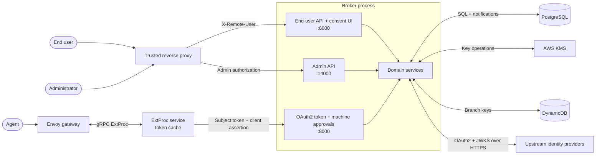

# Security assurance case

The broker stores third-party OAuth2 tokens for users and hands them to AI agents, so a flaw in it lets an agent act as a user without consent. This page argues that a production deployment meets the 5 security requirements below and points to the code, tests and CI jobs that support each argument. It also states what we leave to operators and which risks we accept.

We structure the case after the [OpenSSF Best Practices](https://www.bestpractices.dev/en/criteria/1) `assurance_case` criterion: section 1 is the threat model, section 2 the trust boundaries, section 3 the secure design argument and section 4 the common weaknesses we counter. Section 5 lists the assumptions the argument depends on. [Security posture](/docs/resources/security) covers operational controls and how to report a vulnerability.

**Scope.** We argue for a production deployment with an authenticating reverse proxy, PostgreSQL, and AWS KMS with DynamoDB branch keys. The in-memory storage adapter, the `memory` encryption backend (a static raw AES key from configuration) and the `security.skip_*` flags are for development and tests, and the argument doesn't hold when a deployment uses them.

| Requirement | Argued in |
|---|---|
| **SR1.** Only the authenticated user can grant, revoke or approve access on their own behalf. | Sections 2 and 3 (separation of privilege), A01 in section 4 |
| **SR2.** An agent receives a third-party credential only with a valid subject token, a valid gateway assertion and an active grant. | Section 3 (complete mediation), A07 in section 4 |
| **SR3.** The broker stores third-party tokens and signing keys only encrypted, and agent client secrets only as hashes. | Section 3 (fail-safe defaults), A02 in section 4 |
| **SR4.** Agent-supplied URLs can't reach internal networks, and authorization codes can't be redirected to an attacker. | Section 3 (validate untrusted destinations), A01 and A10 in section 4 |
| **SR5.** When a security control fails, the broker denies the request. | Section 3 (fail-safe defaults), with 2 exceptions in section 5 |

## 1. Threat model

We consider 4 kinds of attackers: malicious agents or OAuth2 clients, untrusted upstream resources and metadata endpoints, network attackers, and attackers who control a broker, ExtProc or migration pod. The STRIDE letters name the threat; they don't claim that we eliminate every variant.

| Asset | Threat (STRIDE) | Control and remaining exposure |
|---|---|---|
| End-user sessions | Spoof a principal through `X-Remote-User` (S), tamper with consent context (T), read session tokens (I). | The proxy authenticates users and must strip client-supplied identity headers. We seal the authorization context in a JWE that expires after 10 minutes and bind it to its principal and agent ([ADR 016](https://github.com/zalando-incubator/agentic-identity-broker/blob/main/adrs/016-authorization-session-anti-spoofing.md)). A compromised proxy or broker process is a trusted-system compromise. |
| Agent credentials | Steal a client secret (I), impersonate an agent (S), gain its privileges (E). | We show a client secret once and store only its Argon2id hash. A stolen plaintext secret stays usable until an administrator rotates it. |
| Issued and exchanged tokens | Intercept an authorization code (I), replay a code or token (S), redirect delivery to an attacker (T). | S256 PKCE, 60-second single-use codes, registered callback matching, JWT validation and active-grant checks constrain issuance and exchange. A bearer token that we issued correctly still needs protection at the caller. |
| Signing keys | Read private keys from storage (I), replace key material (T), mint tokens with a stolen key (E). | We encrypt private keys before storage with the `kid` as encryption context, and the public JWKS carries no private fields. A compromised broker pod can use the keys while it runs. |
| Consent and approval records | Forge or alter a grant (T), deny a change (R), approve another user's request (E). | Principal ownership checks bind browser actions, and approval creation needs both a subject token and a gateway assertion. We log structured security events for investigation. Direct database write access can still corrupt records. |

Availability (D) also matters, because upstream outages, floods of authorization requests, and KMS or database failures deny access. We bound some of that work with fetch timeouts, request body limits and an [approval rate limiter](https://github.com/zalando-incubator/agentic-identity-broker/blob/main/internal/domain/approval/rate_limiter.go). By [default](https://github.com/zalando-incubator/agentic-identity-broker/blob/main/internal/config/loader.go) it allows 10 approval requests per minute for each principal and agent on each replica, and at most 50 pending approvals per principal and agent in the database. When encryption or authorization fails, the broker denies the operation; section 5 lists the 2 places where we deliberately fail open. We don't claim availability during an upstream or infrastructure outage.

Encryption at rest limits the damage of a database-only leak. It doesn't protect plaintext in the memory of a compromised broker pod, and a compromised migration pod can alter records or schema.

## 2. Trust boundaries

- **Proxy to broker.** The proxy authenticates users and injects `X-Remote-User`. The broker doesn't authenticate the proxy (no shared secret, mTLS or source allowlist), so it trusts the header from any caller that reaches the port. The deployment must block direct connections. See [Authentication configuration](/docs/guides/configure-authentication).
- **Admin port 14000.** The broker doesn't authenticate admin callers itself; it only records the principal for audit. The proxy alone decides who reaches this port ([`routing/admin.go`](https://github.com/zalando-incubator/agentic-identity-broker/blob/main/internal/adapters/http/routing/admin.go), [Authentication configuration](/docs/guides/configure-authentication)).
- **API audiences on port 8000.** Port 8000 hosts browser routes, OAuth2 endpoints and machine approval routes. Approval creation needs a subject token and a client assertion, sync needs the assertion, consume needs the subject token, and browser actions need the acting user ([ADR 018](https://github.com/zalando-incubator/agentic-identity-broker/blob/main/adrs/018-approval-endpoint-auth-boundaries.md)).
- **Broker to PostgreSQL.** Repositories persist grants, approvals, encrypted sessions and encrypted signing keys. The runtime database user has data access, and the separate migration job holds schema privileges ([ADR 009 migration image](https://github.com/zalando-incubator/agentic-identity-broker/blob/main/adrs/009-separate-migration-docker-image.md), [Kubernetes deployment](/docs/guides/deploy-on-kubernetes)).
- **Broker to KMS and DynamoDB.** The KMS key protects branch keys, and DynamoDB stores branch-key records for the hierarchical keyring. A database dump alone doesn't contain the KMS root key ([ADR 009](https://github.com/zalando-incubator/agentic-identity-broker/blob/main/adrs/009-envelope-encryption-design.md), [ADR 010](https://github.com/zalando-incubator/agentic-identity-broker/blob/main/adrs/010-cdk-encryption-infrastructure.md)).
- **Broker to upstream providers and metadata endpoints.** The broker exchanges OAuth2 credentials and fetches JWKS over HTTPS. We treat agent-supplied client ID metadata document (CIMD) URLs as untrusted input and fetch them only through the SSRF-protected fetcher ([ADR 015](https://github.com/zalando-incubator/agentic-identity-broker/blob/main/adrs/015-cimd-fetcher-architecture.md)).
- **Envoy to ExtProc to broker.** Envoy calls the standalone ExtProc service over gRPC. ExtProc requests an RFC 8693 exchange from the broker and replaces the bearer token only on success. When the broker rejects the exchange, ExtProc rejects the request and forwards no credential. ExtProc caches exchanged tokens for their remaining lifetime, capped by `cache.max_ttl` (default 1 hour) ([ADR 011](https://github.com/zalando-incubator/agentic-identity-broker/blob/main/adrs/011-extproc-standalone-binary.md), [ADR 012](https://github.com/zalando-incubator/agentic-identity-broker/blob/main/adrs/012-extproc-in-memory-token-cache.md), [Token exchange gateway](/docs/guides/token-exchange-gateway)).

## 3. Secure design argument

We apply the Saltzer and Schroeder principles that the OpenSSF criteria name, plus input validation for untrusted destinations.

| Principle | How we apply it | Evidence |
|---|---|---|
| Fail-safe defaults | The broker refuses to start without an encryption backend. Failed encryption, decryption or context checks return an error and never fall back to plaintext, and the PostgreSQL adapter refuses an unencrypted secret. ExtProc returns an error response when the broker rejects an exchange. | [ADR 009](https://github.com/zalando-incubator/agentic-identity-broker/blob/main/adrs/009-envelope-encryption-design.md), [`builder_test.go`](https://github.com/zalando-incubator/agentic-identity-broker/blob/main/internal/app/builder_test.go), [`tests/e2e/encryption_vault_raw_test.go`](https://github.com/zalando-incubator/agentic-identity-broker/blob/main/tests/e2e/encryption_vault_raw_test.go), [`tests/e2e/extproc/token_exchange_test.go`](https://github.com/zalando-incubator/agentic-identity-broker/blob/main/tests/e2e/extproc/token_exchange_test.go) |
| Least privilege | Helm defaults run the broker as non-root with a read-only root filesystem, no privilege escalation, all capabilities dropped and the RuntimeDefault seccomp profile. The migration job uses its own database user, secret and service account. | [`values.yaml`](https://github.com/zalando-incubator/agentic-identity-broker/blob/main/charts/agentic-identity-broker/values.yaml), [ADR 009 migration image](https://github.com/zalando-incubator/agentic-identity-broker/blob/main/adrs/009-separate-migration-docker-image.md) |
| Complete mediation | For every exchange request, the broker checks the subject token, the gateway assertion, policy, the resource and an active grant that covers the service before it returns a credential. ExtProc serves cached tokens without asking the broker again, so after a revocation a cached token stays usable until it expires (at most `cache.max_ttl`). | [Token exchange](/docs/concepts/token-exchange), [`tests/e2e/revoke_grant_test.go`](https://github.com/zalando-incubator/agentic-identity-broker/blob/main/tests/e2e/revoke_grant_test.go), [`tests/e2e/token_exchange_test.go`](https://github.com/zalando-incubator/agentic-identity-broker/blob/main/tests/e2e/token_exchange_test.go) |
| Separation of privilege | Approval creation needs independent user context (subject token) and a trusted gateway assertion. Sync, consume and browser actions each have their own rule. | [ADR 018](https://github.com/zalando-incubator/agentic-identity-broker/blob/main/adrs/018-approval-endpoint-auth-boundaries.md), [`tests/e2e/approval_api_test.go`](https://github.com/zalando-incubator/agentic-identity-broker/blob/main/tests/e2e/approval_api_test.go) |
| Least common mechanism | We serve the admin API on its own listener, keep third-party sessions per user, and rate-limit approvals per principal and agent. | [ADR 004](https://github.com/zalando-incubator/agentic-identity-broker/blob/main/adrs/004-dual-server-isolation.md), [`tests/e2e/third_party_session_tenant_isolation_test.go`](https://github.com/zalando-incubator/agentic-identity-broker/blob/main/tests/e2e/third_party_session_tenant_isolation_test.go) |
| Economy of mechanism | We use established libraries instead of our own security code: fosite for OAuth2, the AWS Encryption SDK and Go `crypto` for cryptography, and Go's `http.CrossOriginProtection` for CSRF. | [ARCHITECTURE.md](https://github.com/zalando-incubator/agentic-identity-broker/blob/main/ARCHITECTURE.md), [ADR 009](https://github.com/zalando-incubator/agentic-identity-broker/blob/main/adrs/009-envelope-encryption-design.md) |
| Open design | The source, ADRs and this case are public. Security depends on keys (KMS key, branch keys, signing keys), not on secret algorithms. | This repository |
| Psychological acceptability | Security controls are on by default, so operators don't have to opt in. Section 5 lists the settings that turn a control off. | [Security posture](/docs/resources/security) |
| Bind authorization to its initiator | In authorization server mode, the codes the broker issues require S256 PKCE and the broker rejects the `plain` method. The code verifier links the token request to the client that started authorization. In proxy mode the upstream provider enforces PKCE. | [`provider_test.go`](https://github.com/zalando-incubator/agentic-identity-broker/blob/main/internal/domain/oauth2server/provider_test.go) rejects `plain`. [`tests/e2e/oauth2_authorize_e2e_test.go`](https://github.com/zalando-incubator/agentic-identity-broker/blob/main/tests/e2e/oauth2_authorize_e2e_test.go) rejects a mismatched verifier. |
| Validate untrusted destinations | Non-loopback callbacks must match a registered URI exactly; RFC 8252 loopback callbacks may change only the port. CIMD URLs must use HTTPS, and the fetcher checks the resolved IP at connect time, blocks private and special-purpose ranges, disables redirects, and limits the response to 5 KiB and 1 second by default. | [ADR 015](https://github.com/zalando-incubator/agentic-identity-broker/blob/main/adrs/015-cimd-fetcher-architecture.md), [`tests/e2e/cimd_redirect_uri_test.go`](https://github.com/zalando-incubator/agentic-identity-broker/blob/main/tests/e2e/cimd_redirect_uri_test.go), [`fetcher_test.go`](https://github.com/zalando-incubator/agentic-identity-broker/blob/main/internal/adapters/cimd/fetcher_test.go) |

## 4. Common weaknesses countered

We map controls to the **OWASP Top 10 (2021)** with example CWE identifiers. A04 (Insecure Design) is the subject of sections 1 to 3. Scanners find classes of defects, but they don't prove that authorization or deployment controls work, so we name the tests that exercise each behavior.

| Weakness | Control | Where we verify it |
|---|---|---|
| A01 Broken Access Control, CWE-863 (incorrect authorization) | Grant ownership, active delegation and endpoint-specific approval authentication. | `revoke_grant_test.go` rejects exchange after revocation and cross-principal revocation. [`approval_api_test.go`](https://github.com/zalando-incubator/agentic-identity-broker/blob/main/tests/e2e/approval_api_test.go) rejects approve and consume by another principal, and create or consume without a subject token. |
| A01 Broken Access Control, CWE-352 (CSRF) | Go `http.CrossOriginProtection` on consent and approval browser routes. | [`routing/enduser_test.go`](https://github.com/zalando-incubator/agentic-identity-broker/blob/main/internal/adapters/http/routing/enduser_test.go) rejects cross-origin posts to consent and approval routes. |
| A01 Broken Access Control, CWE-601 (open redirect) | Registered callback matching with only the loopback-port exception. | `cimd_redirect_uri_test.go` rejects non-loopback port mismatches. |
| A02 Cryptographic Failures, CWE-311 (missing encryption) | Encrypted token vault and signing keys, no plaintext fallback, Argon2id client-secret hashes. | `encryption_vault_raw_test.go` and [`adapter_test.go`](https://github.com/zalando-incubator/agentic-identity-broker/blob/main/internal/adapters/encryption/aws/adapter_test.go) check that ciphertext differs from plaintext and that decryption with the wrong context fails without returning plaintext. CI runs them with a local AES keyring, not KMS. |
| A03 Injection, CWE-89 and CWE-79 | Parameterized sqlx queries. A React SPA that escapes output, with `X-Frame-Options: DENY` and `nosniff`. Fuzzed parsers for untrusted input. | [`fuzz.yml`](https://github.com/zalando-incubator/agentic-identity-broker/blob/main/.github/workflows/fuzz.yml) fuzzes 6 parsers (CIMD documents, resource URIs, MCP messages, impersonation requests, etc). CodeQL `security-extended` queries scan for injection. |
| A05 Security Misconfiguration, CWE-16 | Config validators reject invalid authentication, storage, encryption and token-exchange settings before startup. Restrictive Helm pod defaults. | [`internal/config`](https://github.com/zalando-incubator/agentic-identity-broker/tree/main/internal/config) validator, storage and encryption tests. Section 5 lists what the validator can't check. |
| A06 Vulnerable and Outdated Components, CWE-1104 | Dependency review blocks pull requests that add a dependency with a known high-severity vulnerability. Whole-tree scanners check `main`. | [`ci.yml`](https://github.com/zalando-incubator/agentic-identity-broker/blob/main/.github/workflows/ci.yml) `dependency-review` job, part of the required `CI gate`. govulncheck and OSV-Scanner in [`security.yml`](https://github.com/zalando-incubator/agentic-identity-broker/blob/main/.github/workflows/security.yml). |
| A07 Identification and Authentication Failures, CWE-287 | Signed gateway assertions, subject-token validation, PKCE and single-use authorization codes. | `token_exchange_test.go` rejects badly signed assertions and malformed subject tokens. `oauth2_authorize_e2e_test.go` rejects a PKCE mismatch and a replayed code. [`jwt_preauth_test.go`](https://github.com/zalando-incubator/agentic-identity-broker/blob/main/tests/e2e/jwt_preauth_test.go) rejects bad signatures, expiry, audience and issuer. |
| A08 Software and Data Integrity Failures, CWE-829 | CI actions pinned by commit SHA. Release images carry SLSA provenance signed through Sigstore, and an SBOM. | [`release.yml`](https://github.com/zalando-incubator/agentic-identity-broker/blob/main/.github/workflows/release.yml), [`scorecard.yml`](https://github.com/zalando-incubator/agentic-identity-broker/blob/main/.github/workflows/scorecard.yml). |
| A09 Security Logging and Monitoring Failures, CWE-532 and CWE-778 | Structured security events for token exchange, credentials, grants and approvals, without token values. | [`impersonation_test.go`](https://github.com/zalando-incubator/agentic-identity-broker/blob/main/tests/e2e/impersonation_test.go) checks that impersonation decisions are logged without assertions or tokens. |
| A10 Server-Side Request Forgery, CWE-918 | HTTPS-only CIMD URLs, resolved-IP blocklist and redirect rejection at the dial boundary. | `fetcher_test.go` checks that a blocked address is never contacted. [`cimd_ssrf_test.go`](https://github.com/zalando-incubator/agentic-identity-broker/blob/main/tests/e2e/cimd_ssrf_test.go) rejects private, loopback, link-local and HTTP metadata URLs end to end. |

**Verification cadence.** We run unit, integration and E2E suites on every code change, and the required `CI gate` status blocks a pull request when any of them fails. CodeQL analyzes Go and JavaScript/TypeScript on pull requests, on `main` and weekly, but it isn't a required check. The whole-tree gosec, govulncheck and OSV-Scanner job runs daily and on dependency changes to `main`, not on pull requests. Parser fuzzing runs for a fixed time budget weekly, and unit runs execute the fuzz seeds. Locally, `just security` runs the scanners, and `just verify` runs static checks, the scanners and all test suites.

## 5. Assumptions and accepted risks

The argument holds only when the operator meets these conditions. The broker can't enforce them itself.

- The proxy strips client-supplied `X-Remote-User` headers, restricts port 14000 to administrators, and is the only network path to both ports.
- TLS protects every connection, including PostgreSQL (the validator accepts `sslmode=disable`).
- Production doesn't use the `memory` encryption backend, `security.skip_cimd_ssrf_validation`, `security.skip_thirdparty_https_validation` or JWT `verification: none`. The broker logs a warning for some of these but still starts.
- The gateway runs with `preserveToken: false`, so the agent's original token never reaches the upstream resource.

We accept these risks:

- A grant revocation stops new exchanges at once, but tokens that ExtProc already cached stay usable until they expire, for at most `cache.max_ttl`.
- A stolen agent client secret stays valid until an administrator rotates it.
- The per-minute approval limit keeps its state per replica, so the effective limit grows with the replica count.
- We fail open in 2 places to keep service during outages. When the broker has a transient error, ExtProc serves a cached token until shortly after it expires. When the database can't count pending approvals, the broker skips the 50-pending cap.

We review this case when a change touches a trust boundary, adds an ADR on authentication, authorization or encryption, or changes a control listed above. Each such pull request updates the affected rows here.
