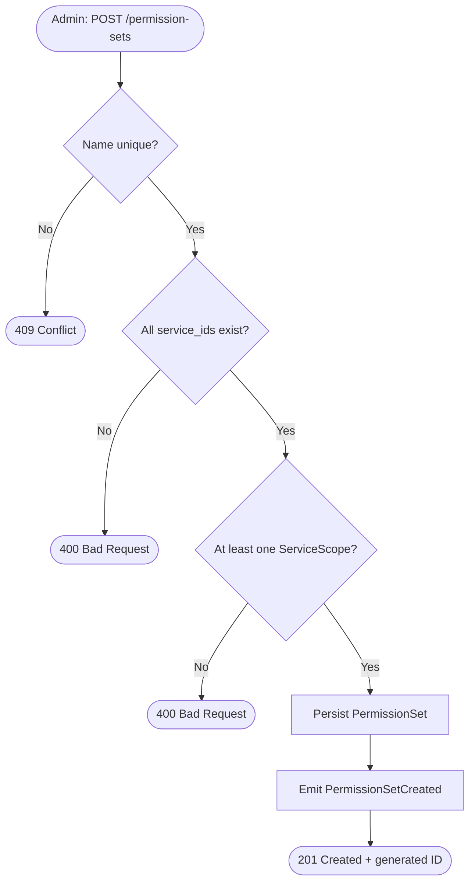
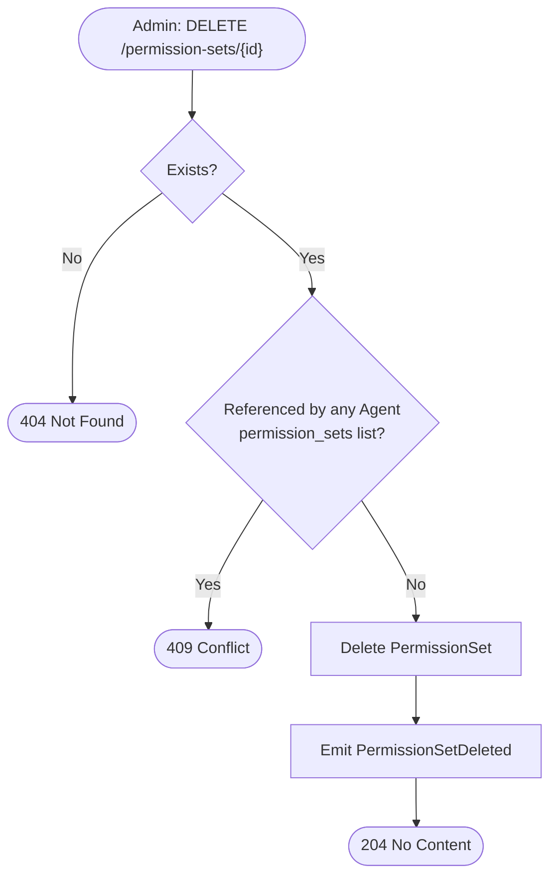
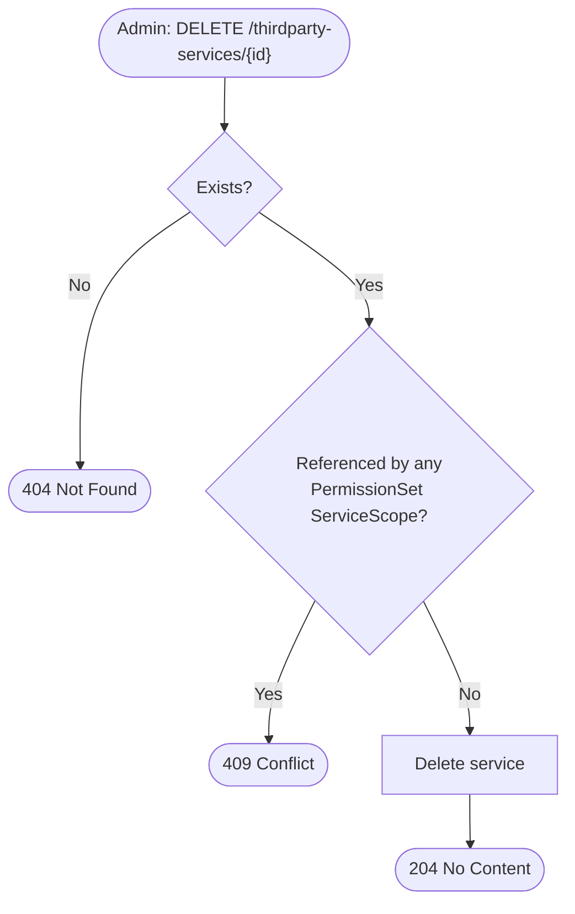
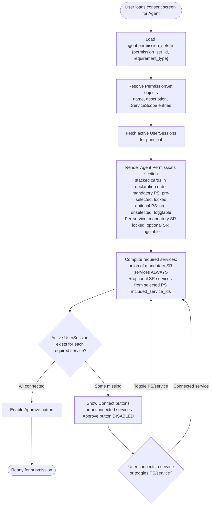
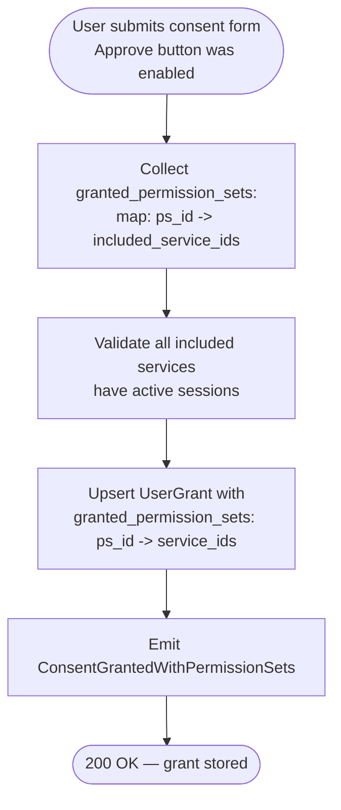
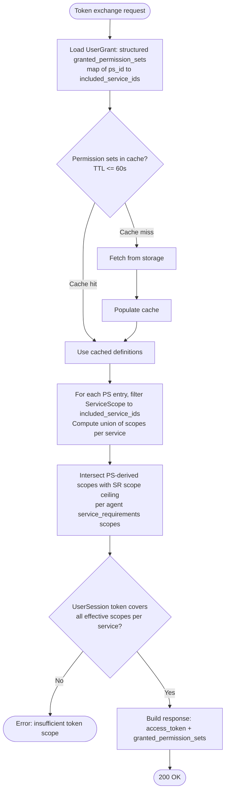

# Feature Specification: Permission Sets

**Feature Branch**: `019-permission-sets`
**Created**: 2026-03-14
**Status**: Draft
**Input**: User description: "Implement the permission set feature described in https://github.com/zalando-incubator/agentic-identity-broker/issues/200. Permission sets should be manageable on the admin endpoint. In the consent screen the permission sets should be displayed above and independent of the required services. The services should only show up as action items if they do not have an active session. PermissionSets should be able to cover multiple services to optimize for usability."

## User Scenarios & Testing *(mandatory)*

### User Story 1 — Admin Manages Permission Sets (Priority: P1)

An administrator defines named, human-readable permission sets that group OAuth2 scopes across one or more third-party services. These permission sets are then referenced by agents as their preferred or alternative authorization bundles.

**Why this priority**: Without permission sets defined in the system, agents cannot reference them and the consent screen cannot display them. This is the foundational data layer everything else depends on.

**Independent Test**: Can be fully tested by calling the admin API to create, read, update, and delete permission sets, and verifying the data is persisted and retrievable.

**Acceptance Scenarios**:

1. **Given** no permission sets exist, **When** an admin POSTs a new permission set with a name, description, and one or more service-scope pairs, **Then** the permission set is created and its generated ID is returned.
2. **Given** a permission set exists, **When** an admin GETs the permission set by ID, **Then** the response includes its name, description, and the list of service-scope entries.
3. **Given** a permission set exists, **When** an admin PUTs an update with a modified description or different scopes, **Then** the permission set reflects the new values.
4. **Given** a permission set not referenced by any agent, **When** an admin DELETEs it, **Then** the permission set is removed and subsequent GET returns 404.
5. **Given** a permission set referenced by at least one agent's `permission_sets` list or any active user grant, **When** an admin attempts to DELETE it, **Then** the request is rejected with a 409 Conflict and an explanatory error.
6. **Given** multiple permission sets exist, **When** an admin GETs the permission set list with optional filtering by service ID, **Then** only matching permission sets are returned.

---

### User Story 2 — Consent Screen Shows Permission Sets First (Priority: P1)

When a user visits the consent screen for an agent, the screen displays the agent's requested permission sets prominently at the top — using human-readable names and descriptions — independent of how many third-party services those sets span. Required service connections appear below. Each selected service shows its connection status.

**Why this priority**: This is the primary UX improvement. Users should understand what capability they are granting before they see service connection status.

**Independent Test**: Render the consent screen with two permission set alternatives and one active service. The active service shows its status and no connect button.

**Acceptance Scenarios**:

1. **Given** an agent has mandatory and optional permission sets in its `permission_sets` list, **When** the user loads the consent screen, **Then** the "Agent Permissions" section shows all sets as stacked cards — mandatory sets are pre-selected and locked (cannot be untoggled), optional sets are togglable. Service connections appear below, showing mandatory SR services always plus optional SR services from included PS selections.
2. **Given** a permission set spans two services, **When** the user views its details on the consent screen, **Then** only services intersecting with the agent's `service_requirements` are shown in the card. The description explains the capabilities in human-readable terms without surfacing raw OAuth2 scope strings.
3. **Given** the user already has an active OAuth2 session for a service shown in the connections section, **When** the consent screen renders, **Then** the service shows a satisfied indicator and no connect button.
4. **Given** the user does not have an active session for a service shown in the connections section, **When** the consent screen renders, **Then** an action item (connect button) is shown for that service, labelled "Required" or "Optional" per its **effective** requirement type — a service is effectively mandatory if its SR `requirement_type` is `mandatory` OR any currently-selected PS has a `ServiceScope.requirement_type` of `mandatory` for that service.
5. **Given** an agent has at least one optional permission set, **When** the user toggles an optional set card on or off, **Then** the card's checked state updates and the service connections section updates dynamically — optional SR services from that PS appear or disappear accordingly.
6. **Given** the agent has only a single mandatory permission set and no optional sets, **When** the consent screen renders, **Then** the single locked card is displayed. The Approve button is disabled until all services in the connections section have active sessions.
7. **Given** all services shown in the connections section have active sessions, **When** the consent screen renders, **Then** the Approve button is enabled and the service connections section shows all services as connected.

---

### User Story 3 — Agent Declares Permission Sets at Agent Level (Priority: P2)

When an agent is registered or updated, it declares an ordered list of permission sets directly at the agent level — independent of service requirements. Each entry in the list pairs a `PermissionSet` ID with a `requirement_type` (`mandatory` or `optional`). The system validates that all referenced permission set IDs exist.

**Why this priority**: Agents drive consent. Until agents can declare their permission sets (orthogonal to service requirements), the consent screen has no per-agent "Agent Permissions" data to display.

**Independent Test**: Can be fully tested by creating an agent with a `permission_sets` list containing at least one mandatory and one optional entry, then verifying the consent-info endpoint returns the resolved permission sets with their requirement types. `ServiceRequirement` entries remain unchanged alongside.

**Acceptance Scenarios**:

1. **Given** valid permission sets exist, **When** an agent is registered with a `permission_sets` list of `{permission_set_id, requirement_type}` entries, **Then** the agent is created successfully and the list is persisted in declaration order.
2. **Given** an agent registration references a non-existent permission set ID in its `permission_sets` list, **When** the registration request is submitted, **Then** the request is rejected with a 400 error identifying the invalid ID.
3. **Given** an agent with a `permission_sets` list, **When** the consent-info endpoint is called for that agent, **Then** the response includes resolved permission set objects (name, description, covered services) with their `requirement_type` for each entry, in declaration order.
4. **Given** an agent with both `ServiceRequirement` entries and a `permission_sets` list, **When** the agent is retrieved, **Then** the two fields are returned independently — `service_requirements` and `permission_sets` are orthogonal and neither references the other.
5. **Given** an agent registration where `service_requirements` includes a `service_id` that is not covered by any `ServiceScope` entry across the declared `permission_sets`, **When** the registration request is submitted, **Then** the request is rejected with a 400 error listing the uncovered service IDs (FR-019).

6. **Given** an agent service requirement has `require_all_scopes: true`, **When** the consent-info endpoint is called, **Then** its service entry discloses the sorted, deduplicated union of scopes from the agent's assigned permission sets that cover that same service, with descriptions; permission-set service entries remain scope-redacted and scopes for non-required services are excluded.

---

### User Story 4 — User Grant Stores Granted Permission Sets (Priority: P2)

When a user submits the consent form, the system stores which permission sets (by ID) were granted, rather than raw scopes. The token exchange response includes the granted permission set IDs alongside the access token, enabling downstream enforcement.

**Why this priority**: Persisting permission sets rather than raw scopes is the data contract change that makes the full authorization model possible. Without this, the consent is not durable.

**Independent Test**: Can be fully tested by submitting a consent grant via the end-user API and verifying the stored `UserGrant` contains the permission set IDs, then requesting a token exchange and verifying `granted_permission_sets` appears in the response.

**Acceptance Scenarios**:

1. **Given** a user reviews the consent screen (mandatory PS locked, optional PS togglable, per-service toggles for optional SR services), **When** the user submits consent, **Then** a `UserGrant` is stored with `granted_permission_sets: {<permission_set_id>: [included_service_ids]}` — each key is a PS ID mapping to the explicit list of service IDs the user included (all **effectively mandatory** services — SR mandatory OR `ServiceScope.requirement_type` mandatory within that PS — plus user-toggled optional SR services).
2. **Given** a `UserGrant` exists with `granted_permission_sets`, **When** a token exchange is requested, **Then** the response includes `granted_permission_sets: {<permission_set_id>: [included_service_ids]}` alongside the access token.
3. **Given** a user has an existing grant and re-visits consent to change their selections, **When** the user submits the updated grant, **Then** the `UserGrant` is upserted with the new `granted_permission_sets` entries (mandatory PS always present, per-service inclusions reflect current toggle state).
4. **Given** two granted permission sets both cover Service A with different scopes and both include Service A in their `included_service_ids`, **When** a token exchange is requested, **Then** the token exchange resolves both sets' `ServiceScope` entries for Service A and returns an access token scoped to their scope union.

---

### Edge Cases

- What happens when a permission set is updated (scopes changed) after a user has already granted it? The stored `UserGrant` references the set by ID with explicit `included_service_ids`. Scope changes for already-included services take effect on the next token exchange (via cache). However, if a new service is added to the PS, it does NOT appear in the user's `included_service_ids` — the user must re-consent to include it.
- What happens when the agent's preferred permission set is deleted? The system rejects deletion of in-use permission sets (409 Conflict), preventing dangling references.
- What happens when a `ThirdpartyOAuth2Service` is deleted while a `PermissionSet` references it? Deletion is blocked with a 409 Conflict — symmetric with permission set deletion protection. The service must be removed from all `ServiceScope` entries first.
- What happens when the user deselects all optional permission sets? If the agent has at least one mandatory entry, consent proceeds normally — mandatory sets are always granted and the grant contains only their IDs. If the agent has no mandatory entries (all-optional), the user must select at least one optional set; submitting with zero selected is rejected with a 400 (FR-014).
- What happens if an agent is registered with an empty `permission_sets` list? The registration is rejected with a 400 validation error — at least one entry is required.
- How does the system handle a permission set that covers Service A and Service B, but the user only has an active session for Service A? The consent screen shows Service B in the connections section with a Connect button (if it's in SR). The Approve button remains disabled until Service B is connected.
- What happens if all required services have active sessions? The service connections section shows all services as connected. The Approve button is enabled.
- What happens if the `UserSession` token does not cover the scopes of a granted permission set at token exchange time? The exchange fails with a descriptive error (FR-018). The user must initiate a new OAuth2 session for the affected service to acquire the missing scopes. Note: this should be rare with FR-020 blocking submission without sessions, but can occur if sessions expire between consent and exchange.
- Permission set definitions may change between consent grant and token exchange (cache staleness ≤60s). This is acceptable — the cache TTL bounds the window of stale scope resolution.

---

## Activity Diagrams

### Admin — Create Permission Set

---

### Admin — Delete Permission Set

---

### Admin — Delete ThirdpartyOAuth2Service (referential integrity guard)

---

### Consent Screen — Rendering & Selection

---

### Consent Submission

---

### Token Exchange — Permission Set Scope Resolution & Validation

---

## Requirements *(mandatory)*

### Functional Requirements

- **FR-001**: The admin API MUST support creating a `PermissionSet` with a unique name, description, and a list of `ServiceScope` entries (each entry: `{service_id, scopes[], requirement_type: "mandatory"|"optional"}`). `requirement_type` defaults to `"optional"` if omitted.
- **FR-002**: The admin API MUST support reading a single `PermissionSet` by ID and listing all `PermissionSet` records with optional filtering by `service_id`.
- **FR-003**: The admin API MUST support updating a `PermissionSet`'s name, description, and `ServiceScope` list.
- **FR-004**: The admin API MUST reject deletion of a `PermissionSet` referenced by any agent's `permission_sets` list, returning a 409 Conflict.
- **FR-005**: A `PermissionSet` MUST cover one or more services; a single `PermissionSet` MAY include scopes for more than one third-party service.
- **FR-006**: An `Agent` MUST declare a `permission_sets` list of `{permission_set_id: UUID, requirement_type: "mandatory"|"optional"}` entries at the agent level, independent of `service_requirements`. The list MUST contain at least one entry — an empty list is a 400 validation error on agent create/update. All referenced permission set IDs MUST exist — any invalid ID is also a 400 error. The list is persisted in declaration order. No constraint on the mandatory/optional split — all-optional is valid. `ServiceRequirement` entries do NOT carry permission set references.
- **FR-019**: **Service-requirement coverage invariant**: At agent create/update time, every `service_id` in the agent's `service_requirements` MUST be covered by at least one `ServiceScope` entry across the agent's referenced permission sets. If any service requirement references a service not covered by any PS, the request MUST be rejected with a 400 validation error listing the uncovered service IDs. The reverse is NOT required — a PS may reference services not in the agent's `service_requirements` (PermissionSets are global, ServiceRequirements are agent-local). No scope-subset validation is performed at registration time — PS scopes may be broader than SR scopes. The SR scope ceiling is enforced at token exchange time (FR-013).
- **FR-007**: The consent info endpoint MUST return resolved `PermissionSet` objects (name, description, covered services) rather than raw scope lists. The response MUST also include the full list of all known `ThirdpartyOAuth2Service` records (`available_services`) to allow the frontend to display service names, icons, and labels for the service connections section.
- **FR-008**: The consent screen MUST render an "Agent Permissions" section above the service connections section. Permission sets MUST be displayed as stacked cards in agent-declaration order. Clicking a PS card **toggles its selection** for optional sets (default unchecked); mandatory PS cards are pre-selected and locked. Within each PS card, **only services that intersect with the agent's `service_requirements`** are displayed — PS-covered services not in the agent's SR are hidden from the card. For displayed services: a service is shown as **locked** (always included) if either its `SR.requirement_type` is `mandatory` OR its `ServiceScope.requirement_type` is `mandatory`; otherwise it is shown with a per-service toggle (default on when the PS is selected). Multiple optional sets may be selected simultaneously.
- **FR-009**: The consent screen MUST display a service connections section showing selected services and their connection status. The displayed services are computed as the union of: (1) **all mandatory SR services** (from `service_requirements` where `requirement_type=mandatory`) — shown regardless of PS selection state; and (2) **optional SR services** (where `requirement_type=optional`) that appear in `included_service_ids` of any currently selected PS. Optional SR services NOT included via any selected PS MUST be hidden. Each displayed service MUST show a visual label/badge ("Required" or "Optional" per its **effective** requirement type — SR `requirement_type` mandatory OR any selected PS `ServiceScope.requirement_type` mandatory → "Required"; otherwise "Optional"). Services with an active session MUST show a satisfied indicator and no connection action.
- **FR-010**: The service connections section is **dynamic** — it updates reactively when the user toggles PS cards or per-service toggles within PS cards. Mandatory SR services remain visible at all times. Optional SR services appear/disappear as PS selection changes. This ensures the user only sees services they are actually delegating access for.
- **FR-020**: The consent screen MUST block submission (Approve button disabled) until **all services** currently shown in the service connections section have active sessions. This prevents storing grants that would immediately fail at token exchange. The UX flow is: select PS → toggle per-service options → connect outstanding services → approve.
- **FR-011**: Submitting consent MUST store the user's grant selections as `granted_permission_sets: {<permission_set_id: UUID>: [included_service_ids: UUID[]]}` in the `UserGrant`. Each key is a PS ID and each value is the explicit list of service IDs the user included: services that are effectively mandatory (SR mandatory OR `ServiceScope.requirement_type` mandatory) are always included; optional services appear only if the user toggled them on within that PS card. PS-covered services not in the agent's `service_requirements` are never stored. Upsert semantics — one grant per user-agent pair.
- **FR-012**: The token exchange response MUST include a `granted_permission_sets: {<permission_set_id: UUID>: [included_service_ids: UUID[]]}` field alongside the existing `access_token`, `token_type`, and `expires_in` fields.
- **FR-013**: At token exchange time, for each service **in the agent's `service_requirements`**, the system MUST compute the union of scopes from all granted permission sets whose `ServiceScope` entries cover that service **AND** whose `included_service_ids` contain that service. When `ServiceRequirement.require_all_scopes` is false (the default), the resulting PS-derived scopes MUST be intersected with `ServiceRequirement.scopes` for that service — SR.scopes acts as a per-agent ceiling, silently capping PS scopes that exceed the agent's allowed boundary. When `require_all_scopes` is true, `ServiceRequirement.scopes` MUST be empty and the full PS-derived union is effective. Services covered by granted PermissionSets but NOT in the grant's `included_service_ids` are ignored. Services covered by PS but NOT in the agent's `service_requirements` are also ignored.
- **FR-014**: All mandatory permission sets are always included in the submitted grant (users cannot deselect them). Within each PS, all effectively mandatory services (SR `requirement_type=mandatory` OR `ServiceScope.requirement_type=mandatory`) are always in `included_service_ids`; optional services (neither condition applies) are included only if the user toggled them on. Optional permission sets are included only if the user toggled them on. Consent MUST be submitted with at least one PS entry — if the agent's `permission_sets` list contains no mandatory entries, the user MUST select at least one optional set before submitting (400 if the submitted list is empty). An empty `granted_permission_sets` list is never a valid grant.
- **FR-015**: Both in-memory and PostgreSQL storage adapters MUST implement the `PermissionSet` repository.
- **FR-016**: The database migration MUST invalidate (delete) all existing `UserGrant` records. The `DelegatedToken` sub-structure is removed; `UserGrant` gains a `granted_permission_sets JSONB` column storing the structured map `{ps_id: [included_service_ids]}`. Affected users will be required to re-consent on their next access.
- **FR-017**: During token exchange, the system MUST resolve `granted_permission_sets` → effective scopes using an in-process cache (≈60s TTL), applying the explicit SR scope ceiling or the `require_all_scopes` full-union rule from FR-013. It MUST validate that the existing `UserSession` token already covers the resulting effective scopes — it MUST NOT expand or re-request scopes.
- **FR-018**: If the `UserSession` token does not satisfy the required scopes of a granted permission set at exchange time, the token exchange MUST fail with a descriptive error.
- **FR-021**: The consent-info response MUST disclose the scope set a user can authorize for every `require_all_scopes` service requirement: the sorted, deduplicated union from the agent's assigned Permission Sets that cover that same service, with provider scope descriptions. This is a consent-time maximum; token exchange remains constrained to Permission Sets and service IDs actually included in the user grant. Raw scopes MUST remain omitted from `permission_sets.service_scopes`, and Permission Set services absent from `service_requirements` MUST not be disclosed.

### Domain Model

**Entities**:

- **PermissionSet**: A human-readable, admin-defined bundle of OAuth2 scopes spanning one or more third-party services. Has a stable UUID, a display name, a description, and a list of `ServiceScope` entries. Can be referenced by multiple agents' `permission_sets` lists. Cannot be deleted while in use.

- **ServiceScope**: A value object within a `PermissionSet` that pairs a `ThirdpartyOAuth2Service` reference with a list of OAuth2 scopes and a `requirement_type` (`"mandatory"|"optional"`). The `requirement_type` declares whether this service is mandatory within the context of a selected PS — independent of the agent's `ServiceRequirement.requirement_type`. Represents the grant boundary for one specific service within the set.

**Modified Entities**:

- **Agent** (extended): Gains a `permission_sets` field — an ordered list of `{permission_set_id: UUID, requirement_type: "mandatory"|"optional"}` entries declared at the agent level. This field is orthogonal to `service_requirements`; neither field references the other.

- **ServiceRequirement** (extended): Retains `{service_id, scopes[], requirement_type}` and adds `require_all_scopes` (default false). It serves two distinct roles: (1) **session gating** — defines which services need active `UserSession`s and whether they're mandatory/optional for the agent to function; and (2) **scope resolution** — when `require_all_scopes` is false, `scopes[]` defines the maximum allowed scopes per service; when true, `scopes[]` must be empty and the full granted Permission Set union is effective. Before consent, the response discloses the assigned Permission Set union for that service; at exchange, only user-granted Permission Sets and included service IDs contribute.

- **UserGrant** (modified): Gains a structured `granted_permission_sets: [{permission_set_id: UUID, included_service_ids: UUID[]}]` field at the grant level. Each entry pairs a granted PS with the explicit list of service IDs the user included at consent time. Effectively mandatory services (SR `requirement_type` mandatory OR `ServiceScope.requirement_type` mandatory within that PS) are always in `included_service_ids`; optional services appear only if the user toggled them on. PS-covered services not in the agent's `service_requirements` are never included. The positive-inclusion model ensures that changes to PS definitions (adding new services) do NOT silently extend existing grants — users must re-consent. The `DelegatedToken` sub-structure (formerly `{service_id, scopes[]}`) is removed — scope grouping is now derived at token exchange time by resolving each included service's scopes from the PS definition.

**Aggregates**:

- **PermissionSet**: Root entity with embedded `ServiceScope` list. Invariant: must contain at least one `ServiceScope` entry.

**Value Objects**:

- **ServiceScope**: `{service_id: UUID, scopes: string[], requirement_type: "mandatory"|"optional"}` — treated as immutable within a `PermissionSet`. Defaults to `"optional"` if omitted.

**Domain Events**:

- **PermissionSetCreated**: Emitted when a new permission set is saved.
- **PermissionSetUpdated**: Emitted when a permission set's definition changes (name, description, or scopes).
- **PermissionSetDeleted**: Emitted when a permission set is successfully deleted. Fields: `permission_set_id`, `name`.
- **ConsentGrantedWithPermissionSets**: Emitted when a user grants an agent access, recording the selected permission sets and per-service inclusions. Fields: `principal`, `agent_id`, `granted_permission_sets: {<permission_set_id>: [included_service_ids]}`.

*All new domain terms must be added to ARCHITECTURE.md Glossary section.*

### API Requirements

- **API-001**: All end-user APIs MUST be documented in `/api/enduser/openapi.yaml` (OpenAPI 3.0+ format)
- **API-002**: All administrative APIs MUST be documented in `/api/admin/openapi.yaml` (OpenAPI 3.0+ format)
- **API-003**: API documentation MUST include endpoint paths, HTTP methods, parameters, request/response bodies, error codes, examples, and authentication requirements
- **API-004**: APIs MUST follow Zalando RESTful API and Event Guidelines
- **API-005**: All API changes MUST be confirmed by the user/stakeholder before implementation begins

**Admin API endpoints** (to be documented in `/api/admin/openapi.yaml`):

| Method | Path | Description |
|--------|------|-------------|
| POST   | `/permission-sets` | Create a new permission set |
| GET    | `/permission-sets` | List permission sets (optional filter: `?service_id=`) |
| GET    | `/permission-sets/{id}` | Get permission set by ID |
| PUT    | `/permission-sets/{id}` | Replace a permission set |
| DELETE | `/permission-sets/{id}` | Delete (rejects with 409 if in use) |

**End-user API changes** (to be documented in `/api/enduser/openapi.yaml`):

- `GET /agents/{id}/consent-info` — response extended to include: (1) the agent's resolved `permission_sets` list (name, description, `requirement_type` per PS entry, and covered services — each covered service carries `{service_id, requirement_type}` so the frontend can determine which services are locked within that PS card; raw `scopes[]` are intentionally omitted from the consent-info shape per FR-007); (2) `active_session_service_ids: UUID[]` for services where the principal already has an active session; (3) `available_services: [AvailableServiceInfo]` — all known `ThirdpartyOAuth2Service` records (id, name, description) for the frontend to render service labels in the connections section
- `POST /agents/{id}/grants` — request body accepts `granted_permission_sets: {<permission_set_id>: [included_service_ids]}` (structured map); response includes the stored grant
- `POST /oauth2/token` (token exchange) — response extended with `granted_permission_sets: {<permission_set_id>: [included_service_ids]}` field

### Database Requirements

- **DB-001**: All database schema changes MUST be in `/migrations/` directory using go-migrate naming conventions
- **DB-002**: Migration files for the `permission_sets` table, `permission_set_service_scopes` join table, `agent_permission_sets` join table (agent-level PS list with `requirement_type` and `position`), and modifications to `user_grants` table (add `granted_permission_sets JSONB` for structured `{ps_id: [included_service_ids]}` map, remove `delegated_tokens` JSONB column), following the `[NNN]_[description].up.sql` / `.down.sql` format
- **DB-003**: Each migration MUST be atomic (fully apply or fully rollback on failure)
- **DB-004**: All migrations MUST be tested in PostgreSQL integration tests (apply, rollback, repeat without data loss)
- **DB-005**: All PostgreSQL-backed repositories MUST have integration tests verifying persistence behavior
- **DB-006**: Referential integrity between `permission_sets` and `thirdparty_oauth2_services` MUST be enforced at the database level with a foreign key constraint. Deletion of a `ThirdpartyOAuth2Service` referenced by any `PermissionSet`'s `ServiceScope` MUST be rejected (409 Conflict) at both the application layer and via a database-level `RESTRICT` constraint.

### Non-Functional Requirements

- **NFR-001**: Permission set definitions MUST be resolved via an in-process cache with a TTL of approximately 60 seconds to avoid repeated storage reads on the hot token exchange path. Cache staleness is bounded and acceptable for this use case.
- **NFR-002**: Token exchange scope validation MUST add no more than 5ms latency overhead (cache hit path) relative to the pre-existing exchange flow.

### Security Requirements

- **SR-001**: Admin endpoints for permission set CRUD MUST be accessible only to authenticated administrators via the admin port (`:14000`)
- **SR-002**: The system MUST prevent deletion of permission sets with existing agent references, enforced at the application level (via `CountAgentsReferencingPermissionSet` check before delete). Note: database-level FK enforcement is not possible because the `permission_sets` list is stored as JSONB in the `agents` table — FK constraints apply only to relational columns. DB-level referential integrity applies instead to the service→permission-set direction (DB-006)
- **SR-003**: The `granted_permission_sets` field in the token exchange response MUST NOT include raw OAuth2 scopes — only permission set IDs
- **SR-004**: Permission set create, update, and delete operations MUST emit structured audit log entries

### Frontend/Design System Requirements

**Design System Compliance**:
- All frontend components MUST use design system located at `web/src/design-system/`
- Before implementation, review DECISION_TREES.md, COMPONENT_PAIRING_GUIDE.md, and COMMON_MISTAKES.md

**Component Classification**:
- **Application-Specific Components**: Permission set selection cards, service connection status indicators
  - Location: `web/src/components/consent/`
  - Must use design system primitives (Card, Badge, Checkbox, Button)
- The `ConsentScreen` component layout MUST be restructured so the permission set selection section renders above the service connections section

**Design Tokens Usage**:
- Use semantic tokens: `trust-deep`, `trust`, `success-primary`, `neutral-*`
- Permission set cards use `trust` palette for the recommended/preferred set, `neutral` for alternatives
- Already-connected services use `success-primary` status indicator
- DO NOT use extended palettes: `navy-700`, `emerald-600`, `gray-*`

**Accessibility Requirements**:
- WCAG 2.1 AA compliance mandatory (4.5:1 text contrast, 3:1 UI component contrast)
- Permission set cards MUST be selectable via keyboard
- Service connection status (active/inactive) MUST be communicated via ARIA labels, not color alone

---

## Success Criteria *(mandatory)*

### Measurable Outcomes

- **SC-001**: Administrators can create, update, and delete permission sets via the admin API in under 2 minutes per operation, with no developer intervention required.
- **SC-002**: Users viewing the consent screen see human-readable permission set names and descriptions instead of raw OAuth2 scope strings for 100% of agents that have permission sets configured.
- **SC-003**: The consent screen shows a satisfied indicator and no connection action for each service with an active session — verified across all acceptance scenarios.
- **SC-004**: Token exchange responses include the `granted_permission_sets` field for 100% of exchanges where the underlying grant stores permission set IDs.
- **SC-005**: Granting access to an agent requires no more interaction steps than the current scope-based flow — the permission set model must not increase the number of consent screen interactions.
- **SC-006**: Both in-memory and PostgreSQL storage backends pass the same `PermissionSet` repository test suite with identical behavior.

---

## Clarifications

### Session 2026-04-24

- Q: Can a permission set mandate a specific service independently of the agent's `ServiceRequirement`? → A: Yes, via `ServiceScope.requirement_type`. An optional SR on the agent is correct when the PS itself is optional (the service is not needed when the PS is deselected). But when the user selects that PS, the PS may declare the service as mandatory within its context. Effective per-service lock state on the consent card = `max(SR.requirement_type, ServiceScope.requirement_type)` where mandatory > optional. FR-019 is unchanged — every SR must still be declared on the agent; `ServiceScope.requirement_type` only affects locking behavior for SR-intersecting services when the PS is selected.

### Session 2026-03-29

- Q: Must every service referenced by an agent's PermissionSet ServiceScope entries also appear in the agent's service_requirements (and vice versa)? → A: Every agent `service_requirement` must be covered by at least one of the agent's permission sets. PermissionSets may reference services not in the agent's `service_requirements` (PS are global, SR are agent-local). Enforced at agent create/update time (400 on violation).
- Q: Should the consent screen show which services within a granted PS are actually relevant to this agent, and should users control per-service delegation within a PS? → A: PS card shows only services intersecting with `service_requirements` (extra PS services hidden). Within the filtered view, mandatory services (per SR `requirement_type`) are locked on; optional services are togglable by the user. This gives transparency and control without showing irrelevant services.
- Q: How should the UserGrant store per-service opt-out/opt-in within a granted PS? → A: Option C — positive inclusion. Grant stores `granted_permission_sets: {<permission_set_id>: [included_service_ids: UUID[]]}`. Explicit inclusion captures user intent at consent time. If PS definition changes (new service added), existing grants do NOT silently extend access — user must re-consent to include newly added services.
- Q: Should the consent screen block submission if included services lack active sessions, or allow optimistic grants? → A: Block submission. Approve button disabled until ALL services in the user's current inclusion set have active sessions. The service connections section is **dynamic**: it shows mandatory SR services always (even from unselected PS), plus optional SR services only if included via a currently selected PS. Optional SR services not selected through any PS are hidden to avoid confusing the user.
- Q: What unique role does ServiceRequirement play now that PS defines services/scopes, and how is the scope ceiling enforced? → A: SR serves two roles: (1) session gating — which services need active sessions and mandatory/optional status; (2) scope ceiling per agent — SR.scopes is the maximum boundary per agent. PS scopes may be broader (PS are global). Enforcement is at token exchange time: PS scopes are intersected with SR scopes, silently capping to the SR boundary. No registration-time scope-subset validation. Consistent with the consent screen which already only shows PS services intersecting with SR.

### Session 2026-03-24

- Q: How is the agent-level permission set association structured in the data model? → A: Agent carries an ordered list of `{permission_set_id, requirement_type: "mandatory"|"optional"}` entries (Option A — single join structure preserving order).
- Q: What does "clickable" mean for a PermissionSet card — toggle selection, expand details, or both? → A: Option B — clicking the card toggles selection for optional sets; card details (name, description, covered services) are displayed statically inside the card body, no expand/collapse.
- Q: What does the UserGrant store — flat granted_permission_set_ids or per-service grouping? → A: [SUPERSEDED by Session 2026-03-29 Q3 — now structured `granted_permission_sets: {ps_id: [included_service_ids]}`] ~~Option A — flat `granted_permission_set_ids: UUID[]`.~~
- Q: How are service connections displayed — all services, only mandatory, or with disclosure? → A: Option A — show all services from `service_requirements` with a "Required" or "Optional" badge. Already-connected services show a satisfied indicator with no connect button.
- Q: What is the minimum cardinality for an agent's `permission_sets` list, and must at least one be mandatory? → A: Option A — at least one entry required (400 on empty list); no constraint on mandatory/optional split — all-optional is valid.

### Session 2026-03-14

- Q: When a user selects permission sets on the consent screen, is the interaction model radio buttons (one at a time), checkboxes (multiple simultaneously), or tiered? → A: Checkboxes — multiple sets can be selected simultaneously; preferred set is pre-checked, alternatives default unchecked.
- Q: How should existing UserGrant records with raw scopes be handled after this feature ships? → A: Force re-consent — existing grants are invalidated; no backward compatibility required. Agents can be updated to reference permission sets via the admin API.
- Q: Must every ServiceRequirement declare a preferred_permission_set_id, or is it optional? → A: Superseded — permission set references have been moved to the agent level (agent.permission_sets list) and are orthogonal to ServiceRequirement. ServiceRequirement no longer carries permission set fields.
- Q: Should permission set resolution at token exchange be cached, and what is the validation behavior? → A: Yes — in-process cache with ≈60s TTL. At token exchange, resolved scopes are validated as already satisfied by the existing UserSession token; scopes are not expanded or re-requested.
- Q: What happens when a ThirdpartyOAuth2Service is deleted while a PermissionSet references it via a ServiceScope? → A: Block deletion — return 409 Conflict if any PermissionSet contains a ServiceScope for that service.

---

## Assumptions

1. **Scope boundary**: This specification covers `PermissionSet` as a first-class domain entity and the consent/admin UX changes that use it (Tier 1 of the issue #200 three-tier model). Runtime tool approval (Tier 2) and CIBA relay (Tier 3) are out of scope.
2. **Multi-service permission sets**: A single `PermissionSet` can include scopes for more than one `ThirdpartyOAuth2Service`. This is an explicit requirement from the user and diverges from the per-service ER diagram in issue #200.
3. **No backward compatibility for raw scopes**: All agents MUST be updated via the admin API to declare their `permission_sets` list. Raw `scopes[]` on `DelegatedToken` are replaced by structured `granted_permission_sets` (map of PS ID → included service IDs). `ServiceRequirement` retains its `scopes[]` (unchanged). Existing `UserGrant` records with raw scopes in `DelegatedToken` are invalidated at deploy time; affected users must re-consent.
4. **Active session definition**: A service has an "active session" if a `UserSession` exists for the `(principal, service_id)` pair with a non-expired access token. This reuses existing session check logic.
5. **No runtime enforcement in this feature**: The `granted_permission_sets` field added to the token exchange response bridges to future OPA-based enforcement; this spec does not implement ExtProc enforcement logic.
6. **Effective scope computation**: The union of all granted permission sets' scopes for a service is computed at token exchange time, not stored pre-computed.

---

## Dependencies

- **spec 011-agent-permission-requirements**: `Agent` entity is extended with a `permission_sets` list; `ServiceRequirement` is unchanged.
- **spec 008-thirdparty-oauth2-sessions**: Active session check logic is reused to determine which service connections to display as action items.
- **spec 013-token-exchange**: Token exchange response is extended with `granted_permission_sets: {ps_id: [included_service_ids]}` field.
- **spec 007-consent-frontend**: The consent frontend layout is restructured — permission sets section before service connections.
- **ARCHITECTURE.md**: New domain terms (`PermissionSet`, `ServiceScope`, `granted_permission_sets`) must be added to the glossary.
