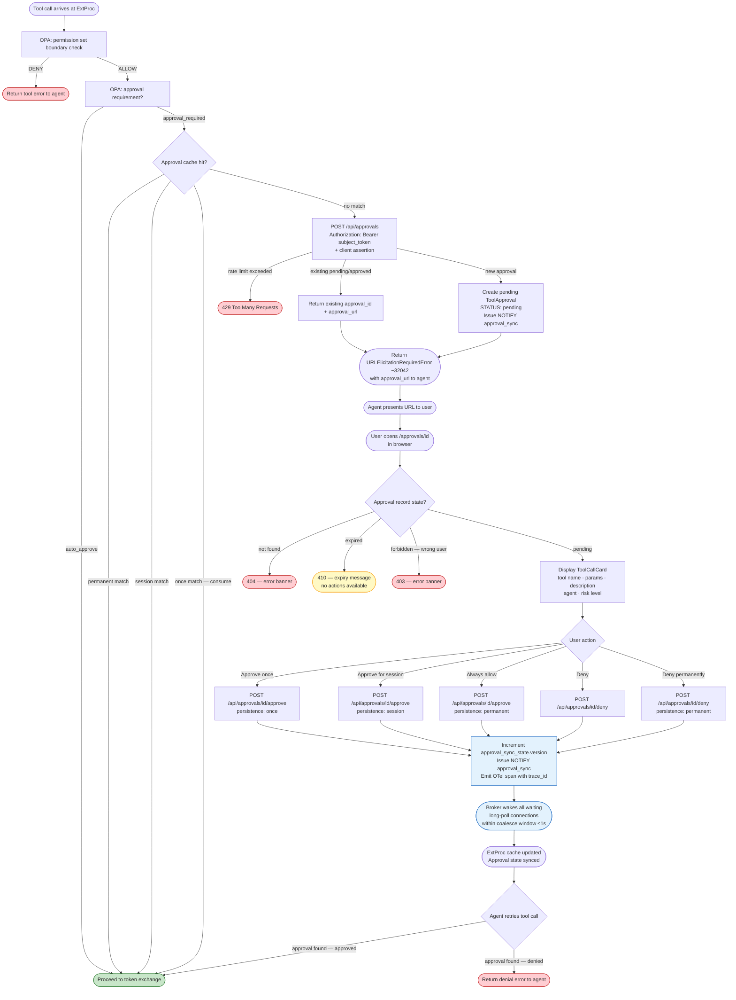

# Feature Specification: Tool Approval API & UI

**Feature Branch**: `024-approval-api-ui`
**Created**: 2026-03-27
**Status**: Draft
**Input**: User description: "I want to implement the approval API and UI in the identity broker, carved out from the design-permission-sets-tool-authorization design."

## User Scenarios & Testing *(mandatory)*

### User Story 1 — User Approves a Pending Tool Call (Priority: P1)

An agent calls a medium-risk tool on the user's behalf. The tool requires human approval before execution. The user receives an approval URL from the agent, opens it in the browser, sees the full tool call context (tool name, parameters, human-readable description, agent name, risk level), and approves it with a persistence scope of their choice. The next time the agent retries the tool call, the broker reports the approval to ExtProc and the call proceeds.

**Why this priority**: This is the core value proposition of the feature — turning a blocked tool call into a transparent, human-reviewable authorization decision. Without this flow, the approval infrastructure has no user-facing value.

**Independent Test**: Can be fully tested by creating a pending approval record via the API, navigating to the approval UI page, completing the approve action with each persistence choice, and verifying the approval status transitions to `approved` with the correct persistence mode.

**Acceptance Scenarios**:

1. **Given** a pending approval exists for tool `create_pull_request` with params `{repo: "acme/app", title: "Fix bug"}`, **When** a user opens `/approvals/{id}` in the browser, **Then** they see the tool name, all parameters with their values, a human-readable description rendered from the action context, the agent name, the risk level, and three persistence choices: "Approve once", "Approve for this session", and "Always allow".

2. **Given** the user is viewing a pending approval, **When** they select "Approve once" and click Approve, **Then** the approval transitions to `status: approved, persistence: once` and the page shows a success confirmation.

3. **Given** the user is viewing a pending approval, **When** they select "Approve for this session" and click Approve, **Then** the approval transitions to `status: approved, persistence: session` and the page shows a success confirmation.

4. **Given** the user is viewing a pending approval, **When** they select "Always allow" and click Approve, **Then** the approval transitions to `status: approved, persistence: permanent` and the page shows a success confirmation with a note that this can be revoked later from the consent management page.

5. **Given** a user is authenticated as `alice@example.com`, **When** they open an approval URL that belongs to `bob@example.com` and attempt to approve or deny it, **Then** a 403 Forbidden is returned and no state change occurs.

6. **Given** a pending approval has passed its expiry time, **When** a user opens the approval URL, **Then** the page shows an expiry message and no approve/deny actions are available.

7. **Given** a pending approval record was created from a request carrying `traceparent: 00-4bf92f3577b34da6a3ce929d0e0e4736-00f067aa0ba902b7-01`, **When** a user opens the approval page and clicks Approve, **Then** the `GET /api/approvals/{id}` handler emits an `approval.review` span and the `POST /api/approvals/{id}/approve` handler emits an `approval.approve` span, each linked to the originating tool-call span. (Both spans are backend-side; no frontend OTel SDK is required.)

---

### User Story 2 — User Denies a Pending Tool Call (Priority: P1)

An agent requests approval for a tool call the user does not want to authorize. The user opens the approval URL, reviews the action, and denies it. The denial is recorded so the broker can inform the agent on its next retry.

**Why this priority**: Denial is equally critical to approval — without it, the Approval UI is not a true authorization gate.

**Independent Test**: Can be fully tested by creating a pending approval, visiting the UI, clicking Deny, and verifying the approval transitions to `status: denied`. The agent-side retry behavior is tested separately.

**Acceptance Scenarios**:

1. **Given** a pending approval is displayed in the browser, **When** the user clicks "Deny", **Then** the approval transitions to `status: denied` and the page shows a denial confirmation.

2. **Given** a pending approval record originated from a request carrying a valid `traceparent` header, **When** the user denies the approval, **Then** an `approval.deny` span is emitted with a link to the originating tool-call span.

3. **Given** a previously denied approval exists, **When** ExtProc creates a new approval for the same tool and parameters, **Then** a new approval record is created (denied records are not deduplicated).

4. **Given** a user is viewing a pending approval, **When** they select "Deny permanently" and confirm, **Then** the approval transitions to `status: denied, persistence: permanent` and the agent is informed that this tool is permanently blocked. The permanent denial is visible and revocable from the consent management page alongside permanent approvals.

---

### User Story 3 — ExtProc Creates a Pending Approval (Priority: P1)

ExtProc intercepts a tool call that requires approval, calls the broker's approval API to register the pending action, and gets back an approval URL to embed in the MCP error returned to the agent.

**Why this priority**: This is the machine-to-machine entry point for the entire approval flow. Without it, no approval records are ever created.

**Independent Test**: Can be fully tested by sending `POST /api/approvals` with a valid subject token and a valid client assertion, then verifying a pending approval is persisted with an `approval_url` in the response.

**Acceptance Scenarios**:

1. **Given** a valid subject token for principal `alice@example.com`, agent `code-assistant`, and a valid client assertion from agentgateway, **When** `POST /api/approvals` is called with `traceparent: 00-4bf92f3577b34da6a3ce929d0e0e4736-00f067aa0ba902b7-01` and body `{metadata: {mcp_session_id: "mcp-123", agent_session_id: "sess-xyz", tool_invocation_id: "inv-abc", description: "Create a pull request in acme/app"}, tool_name: "create_pull_request", arguments: {repo: "acme/app", title: "Fix bug"}}`, **Then** a pending approval is created, the response includes `{id, status: "pending", approval_url}`, and an `approval.created` span is linked to the originating tool-call span.

2. **Given** a pending non-consumed approval already exists for `(alice@example.com, code-assistant, create_pull_request, {repo: "acme/app", title: "Fix bug"})`, **When** `POST /api/approvals` is called again with the same parameters, **Then** the existing approval's `{id, status: "pending", approval_url}` is returned without creating a duplicate.

3. **Given** a previously approved and consumed one-time approval exists for the same tool and params, **When** `POST /api/approvals` is called, **Then** a new pending approval is created.

4. **Given** a previously denied approval exists for the same tool and params, **When** `POST /api/approvals` is called, **Then** a new pending approval is created.

5. **Given** a request with no `Authorization` header, **When** `POST /api/approvals` is called, **Then** a 401 Unauthorized is returned.

6. **Given** a request with an invalid or missing client assertion, **When** `POST /api/approvals` is called, **Then** a 401 Unauthorized is returned.

7. **Given** a subject token whose principal cannot be extracted, **When** `POST /api/approvals` is called, **Then** a 401 Unauthorized is returned.

---

### User Story 4 — ExtProc Syncs Approval State via Long-Poll (Priority: P2)

ExtProc maintains a local in-memory approval cache to avoid per-request broker round-trips. It keeps the cache current by holding a long-poll connection to `GET /api/approvals`. When a user approves or denies a pending action, the broker wakes the waiting connection and delivers the updated state.

**Why this priority**: The long-poll endpoint is what makes the "agent retries and it just works" experience practical at scale.

**Independent Test**: Can be fully tested by seeding approvals, establishing a long-poll connection with `If-None-Match` and `X-Long-Poll-Timeout: 30`, mutating an approval, and verifying the connection returns `200` with updated data and a new ETag before the timeout.

**Acceptance Scenarios**:

1. **Given** a gateway client with a valid client assertion, **When** `GET /api/approvals` is called without `If-None-Match`, **Then** `200 OK` is returned with a JSON body containing `pairs` (all active principal-agent pairs with their approvals and granted permission sets) and an `ETag` header.

2. **Given** a gateway client holding a long-poll connection with `If-None-Match: "{etag}"` and `X-Long-Poll-Timeout: 30`, **When** no changes occur within 30 seconds, **Then** the broker returns `304 Not Modified`.

3. **Given** a gateway client holding a long-poll connection, **When** any approval transitions state, **Then** the broker wakes the connection and returns `200` with the updated pair data and a new ETag within 2 seconds.

4. **Given** a request with an invalid client assertion, **When** `GET /api/approvals` is called, **Then** a 401 Unauthorized is returned.

5. **Given** `?principal=alice@example.com` is provided, **When** `GET /api/approvals` is called, **Then** only pairs for `alice@example.com` are returned.

---

### User Story 5 — One-Time Approval Is Consumed After Use (Priority: P2)

ExtProc reports to the broker when a `once`-persistence approval has been used, preventing it from being matched again on a subsequent tool call.

**Why this priority**: The security model for one-time approvals depends on consumption tracking. Without it, a single user approval could authorize an unlimited number of tool invocations.

**Independent Test**: Can be fully tested by creating and approving a `once` approval, calling `POST /api/approvals/{id}/consume`, and verifying `consumed: true`. A subsequent `POST /api/approvals` for the same tool+params creates a fresh record.

**Acceptance Scenarios**:

1. **Given** an approved `once`-persistence approval, **When** `POST /api/approvals/{id}/consume` is called with a valid subject token matching the principal, **Then** the approval is marked `consumed: true` and `200 OK` is returned.

2. **Given** an already consumed approval, **When** `POST /api/approvals/{id}/consume` is called again, **Then** `200 OK` is returned idempotently.

3. **Given** an approved `session` or `permanent` approval, **When** `POST /api/approvals/{id}/consume` is called, **Then** `422 Unprocessable Entity` is returned (only `once`-persistence approvals are consumable).

---

### User Story 6 — Permanent Approvals Are Visible and Revocable (Priority: P3)

A user who has granted permanent approval for a tool invocation can view it alongside their regular grants and revoke it from the consent management UI.

**Why this priority**: Permanent approvals are long-lived authorizations. Without visibility and revocation, users cannot audit or correct their standing permissions.

**Independent Test**: Can be fully tested by creating a permanent approval record and verifying it appears in the grants/consent management page with a revoke action.

**Acceptance Scenarios**:

1. **Given** a permanent approval for tool `create_issue` exists for agent `code-assistant`, **When** the user visits their consent management page, **Then** the permanent approval is listed under the agent's active authorizations with the tool name, pattern, and a "Revoke" button.

2. **Given** a permanent approval is displayed on the consent management page, **When** the user clicks "Revoke", **Then** the approval transitions to `status: denied` and is removed from the active authorizations list.

---

### User Story 7 — User Scopes an Approval Decision (Priority: P2)

When approving for a session or permanently, a user can narrow or widen parameter coverage for
future calls to the reviewed tool. The broker validates and renders the scope so the UI cannot
diverge from enforcement.

**Acceptance Scenarios**:

1. **Given** a pending approval for `create_pull_request` with repository `acme/app`, **When** the
user approves without pattern fields, **Then** the stored patterns cover exactly the reviewed tool
and arguments.
2. **Given** that pending approval, **When** the user submits `params_pattern: {repo: "acme/*"}`,
**Then** the server derives `tool_pattern: "create_pull_request"`, persists the parameter pattern,
and returns both in the approval sync response.
3. **Given** that pending approval, **When** the user selects `session` or `permanent` and submits an explicit empty `params_pattern`, **Then** the server leaves every argument unconstrained for the reviewed tool.
4. **Given** that pending approval, **When** the user submits a malformed or non-covering parameter
pattern, **Then** the API returns `422 invalid_pattern` and the approval remains pending.
5. **Given** that pending approval, **When** the user supplies `tool_pattern`, **Then** the API
returns `400 invalid_request` with `tool_pattern is not allowed` and the approval remains pending.
6. **Given** a session or permanent scope editor, **When** the user edits a parameter pattern,
**Then** the broker validates it and the UI displays the latest server-rendered technical rule;
approval remains disabled until the current pattern validates successfully.
7. **Given** that pending approval, **When** the user selects `once` and supplies any `params_pattern`, including `{}`, **Then** the API returns `422 invalid_pattern` and the approval remains pending.

---

### Approval Flow Overview



### Edge Cases

- What happens when a user opens an expired approval URL? The page shows an expiration message; no approve/deny actions are available. The agent should retry the tool call to generate a fresh approval.
- What if the approval record does not exist (unknown ID in the URL)? The broker returns `404 Not Found` and the UI shows an appropriate error page.
- What if `POST /api/approvals` is called concurrently from two ExtProc instances for the same tool+params? The uniqueness constraint at the database level ensures only one record is created; the second call returns the existing record.
- What happens to session-scoped approvals when the session ends? Session-scoped approvals are scoped to the `agent_session_id` stored at creation time (not `mcp_session_id`, which is unstable across reconnects). ExtProc evicts session-scoped approvals from its local cache when the agent session with that `agent_session_id` ends. The broker retains them in the database for audit purposes but they are not re-delivered via long-poll for future sessions.
- What if the long-poll connection is dropped mid-poll? ExtProc reconnects immediately, sending the last known ETag. The broker responds with all changes since that ETag.
- What does the user see while the Approval UI page is loading? A skeleton placeholder is shown until the approval record is fetched. On fetch failure, an inline error banner renders with the specific reason; the page never redirects to a generic error page.
- What if the approve/deny API call fails (e.g. network error, approval already actioned by another session)? An inline error banner appears with a contextual message. The approve/deny buttons remain available for retriable errors (network); they are disabled with an explanatory message for terminal states (already actioned, expired, forbidden).

## Requirements *(mandatory)*

### Functional Requirements

- **FR-001**: The system MUST expose `POST /api/approvals` to create a pending approval, deriving principal and agent identity exclusively from the subject token. The request body MUST contain three top-level fields: `metadata` (containing `mcp_session_id`, `agent_session_id`, `tool_invocation_id`, and `description`), `tool_name` (string), and `arguments` (object). Both the user's subject token and the gateway's client assertion MUST be present and validated. When a valid W3C `traceparent` header is provided, the broker MUST persist it and link each approval lifecycle span to the originating tool-call span.
- **FR-002**: The `POST /api/approvals` response MUST include an `approval_url` pointing to the Approval UI page for that record.
- **FR-003**: The system MUST implement idempotent approval creation: a second `POST /api/approvals` for an existing pending record with the same `(principal, agent_id, tool_name, arguments_hash)` MUST return the existing record without creating a duplicate. Deduplication is enforced at the database level by DB-003 and applies to pending records only; approved, consumed, and denied records are not deduplicated.
- **FR-003a**: The system MUST enforce a rate limit on `POST /api/approvals` per `(principal, agent_id)` pair: a configurable maximum number of pending approvals per pair (default 50) and a configurable creation-rate cap (default 10 requests per minute per pair). Exceeding either limit MUST return `429 Too Many Requests`.
- **FR-004**: The system MUST expose `POST /api/approvals/{id}/approve` to transition a pending approval to `approved`, accepting a `persistence` field (`once`, `session`, or `permanent`) and an optional `params_pattern` field. A supplied `tool_pattern` MUST return `400 invalid_request` with `tool_pattern is not allowed`.
- **FR-005**: The system MUST expose `POST /api/approvals/{id}/deny` to transition a pending approval to `denied`, optionally accepting `persistence: "permanent"`. A permanent denial blocks the tool for that agent indefinitely and is visible and revocable from the consent management UI alongside permanent approvals.
- **FR-006**: The system MUST expose `POST /api/approvals/{id}/consume` to mark an approved `once`-persistence approval as consumed.
- **FR-007**: The system MUST expose `GET /api/approvals/{id}` to retrieve a single approval record.
- **FR-008**: The system MUST expose `GET /api/approvals` as a combined approval-and-permission-set sync endpoint with long-poll semantics activated by `If-None-Match` + `X-Long-Poll-Timeout` request headers.
- **FR-009**: The long-poll endpoint MUST return `304 Not Modified` when no changes occur within the requested timeout, and `200 OK` with updated data and a new `ETag` when any approval or permission set changes.
- **FR-010**: The system MUST coalesce approval mutations within a configurable window (default 1 second) before waking blocked long-poll connections, to prevent per-mutation connection churn. In a multi-instance broker deployment, cross-instance wake-up MUST be achieved via PostgreSQL `LISTEN/NOTIFY`: every mutation issues a `NOTIFY` on a shared channel; all broker instances subscribe and wake their local long-poll goroutines on receipt.
- **FR-011**: `POST /api/approvals` MUST be authenticated via both the user's `Authorization: Bearer {subject_token}` (principal derivation) and the gateway's client assertion (validated via CEL expression, same mechanism as token exchange). Both MUST be valid; either failure returns `401 Unauthorized`. Dual auth is REQUIRED here because approval creation establishes user-visible security state and must bind both the trusted gateway caller and the user-scoped subject context.
- **FR-012**: The long-poll `GET /api/approvals` endpoint MUST be authenticated via a client assertion validated through the existing CEL expression mechanism (same trust path as token exchange). No subject token is required because this is a gateway control-plane sync channel rather than a user-facing operation.
- **FR-013**: Browser-facing approval endpoints (`GET /api/approvals/{id}`, `POST /api/approvals/{id}/approve`, `POST /api/approvals/{id}/deny`, `POST /api/approvals/{id}/revoke`, `GET /api/approvals/permanent`, `GET /api/approvals/pending`) MUST be authenticated via the acting user's authenticated principal as propagated by the browser auth layer (for example `X-Remote-User` in pre-auth deployments), and the broker MUST verify the acting user matches the approval's stored principal. `POST /api/approvals/{id}/consume` is authenticated via the user's subject token only because it is a per-approval, principal-scoped machine mutation and does not expose cross-user state.
- **FR-014**: The system MUST serve an Approval UI page at `/approvals/{id}` within the existing React SPA, showing: tool name, all parameters with their values, a human-readable action description, agent name, risk level, and the three persistence choices. When the user selects `session` or `permanent`, the page MUST let them edit parameter patterns and show a live preview; `once` keeps exact coverage.
- **FR-015**: The Approval UI MUST allow the user to approve with persistence `once`, `session`, or `permanent`, or to deny the request. `session` and `permanent` decisions expose a parameter-pattern editor while the server derives exact tool coverage; `once` keeps exact coverage.
- **FR-016**: The Approval UI MUST display an unambiguous warning when the user selects `permanent`, explaining that this authorizes future invocations and can be revoked.
- **FR-017**: Permanent approvals and permanent denials MUST appear in the consent management UI alongside grants, each with a revocation action (reverting to the default non-permanent state).
- **FR-018**: Pending approvals MUST have a configurable TTL (default 10 minutes) after which they are expired and no longer actionable.
- **FR-019**: The `GET /api/approvals` response MUST be grouped by `(principal, agent)` pair and include both `approvals` and `granted_permission_sets` per pair.
- **FR-020**: The `GET /api/approvals` endpoint MUST support optional filtering via `?principal={p}` to limit the response to a specific principal.
- **FR-021**: The system MUST maintain a global monotonically increasing version counter incremented on every approval or permission-set mutation, used to generate ETags for the long-poll protocol.
- **FR-022**: Every approval record MUST carry a server-derived exact `tool_pattern` for its `tool_name` and a `params_pattern` object mapping argument names to globs. Argument names absent from `params_pattern` are unconstrained. `*` is the only metacharacter; `\` escapes it.
- **FR-023**: A concrete invocation `(tool_name, arguments)` matches a stored approval when the tool name matches its server-derived exact `tool_pattern` and every constrained argument matches its glob. When several approvals match, the most specific wins, ranked by exact tool name, then more constrained arguments, then fewer wildcards, then most recently decided.
- **FR-024**: `POST /api/approvals/{id}/approve` MUST accept optional `params_pattern` alongside `persistence`. The server derives `tool_pattern` from the approval's own tool name. Omitting `params_pattern` stores the exact coverage of the reviewed arguments. An explicit empty `params_pattern` leaves every argument unconstrained for `session` or `permanent`. With `once`, `params_pattern` MUST be omitted; every supplied value, including `{}`, MUST return `422 invalid_pattern` and leave the approval pending. A supplied `tool_pattern` MUST return `400 invalid_request` with `tool_pattern is not allowed`. A malformed or non-covering parameter pattern MUST be rejected with `422 invalid_pattern`.
- **FR-025**: `POST /api/approvals` MUST store the exact coverage of the reviewed call (`tool_pattern = tool_name`, every argument constrained to its literal value). Pending-record deduplication is unchanged and remains keyed on `(principal, agent_id, tool_name, arguments_hash)`.
- **FR-026**: `GET /api/approvals`, `GET /api/approvals/{id}`, `GET /api/approvals/pending`, and `GET /api/approvals/permanent` MUST expose `tool_pattern` and `params_pattern`. `arguments_hash` is retained on the sync summary.
- **FR-027**: Pattern grammar, canonicalization, matching, and precedence MUST have exactly one implementation, shared by the broker and ExtProc, pinned by a language-neutral vector fixture consumed by both test suites.

### Domain Model

**Entities**:

- **ToolApproval**: An authorization record for a specific tool invocation by an agent on behalf of a principal, with a pattern describing which future invocations the decision covers. Lifecycle: `pending` → `approved` or `denied`; approved `once` records may additionally be `consumed`. Key attributes: id (UUID), principal, agent_id, tool_name, arguments (structured), arguments_hash, tool_pattern, params_pattern, description, risk_level, status, persistence (nullable until approved), session_id (optional), approval_url, created_at, approved_at, denied_at, consumed_at, expires_at.
- **ApprovalSyncState**: A single shared row in the database holding a monotonically increasing `version` counter. Incremented atomically (via database-level atomic update) on any approval or permission-set mutation. Stored in the database rather than per-instance memory so that all broker instances in a multi-instance deployment see a consistent version, enabling correct ETag generation regardless of which instance handled the mutation.

**Aggregates**:

- **ToolApproval** is a self-contained aggregate root. Invariants: only `pending` approvals can be approved or denied; only `once`-persistence approved approvals can be consumed; approve/deny actions require the acting user to match the stored principal; expired approvals cannot be approved or denied.

**Value Objects**:

- **ApprovalPersistence**: Enumeration — `once`, `session`, `permanent`. Immutable once set at approval time.
- **ApprovalStatus**: Enumeration — `pending`, `approved`, `denied`. The `consumed` flag is a separate boolean on approved records, not a fourth status.

**Domain Events**:

- **ApprovalCreated**: When a pending approval is registered via `POST /api/approvals`.
- **ApprovalApproved**: When a user approves a pending approval.
- **ApprovalDenied**: When a user denies a pending approval.
- **ApprovalConsumed**: When a one-time approval is consumed by ExtProc.
- **ApprovalExpired**: When a pending approval's TTL elapses without user action.

*All terms to be added to ARCHITECTURE.md Glossary.*

### Configuration Requirements

**Configuration Parameters**:

- **APPROVAL_PENDING_TTL**: Duration, purpose: maximum lifetime of a pending approval before it auto-expires, default: `10m`, example: `15m`
- **APPROVAL_SYNC_COALESCE_WINDOW**: Duration, purpose: time window for batching approval mutations before waking long-poll connections, default: `1s`, example: `500ms`
- **APPROVAL_RATE_LIMIT_MAX_PENDING**: Integer, purpose: maximum number of pending approvals allowed per `(principal, agent_id)` pair at any time, default: `50`
- **APPROVAL_RATE_LIMIT_REQUESTS_PER_MINUTE**: Integer, purpose: maximum `POST /api/approvals` creation requests per `(principal, agent_id)` pair per minute, default: `10`

**Example YAML Configuration**:

```yaml
approvals:
  pending_ttl: "10m"
  sync_coalesce_window: "1s"
  rate_limit:
    max_pending_per_pair: 50
    max_requests_per_minute: 10
```

**Configuration Location**: Added to `internal/ports/config.go` and documented in `examples/config/`.

### API Requirements

- **API-001**: All Approval APIs MUST be documented in `/api/enduser/openapi.yaml`.
- **API-002**: APIs MUST follow Zalando RESTful API and Event Guidelines.
- **API-003**: `POST /api/approvals` — create pending approval. Auth: `Authorization: Bearer {subject_token}` (user context) + client assertion (gateway, CEL-validated). The gateway identity and the subject context are both required because this endpoint creates user-visible approval state. Optional header: W3C `traceparent`. Request body: `{metadata: {mcp_session_id, agent_session_id, tool_invocation_id, description}, tool_name, arguments}`. Response: `{id, status: "pending", approval_url, created_at}`.
- **API-004**: `GET /api/approvals/{id}` — retrieve single approval. Auth: acting user principal from the browser auth layer (for example `X-Remote-User` in pre-auth deployments). Response: full approval record.
- **API-005**: `POST /api/approvals/{id}/approve` — approve pending approval. Auth: acting user principal from the browser auth layer. Request: `{persistence: "once"|"session"|"permanent", params_pattern?}`. A supplied `tool_pattern` returns `400 invalid_request` with `tool_pattern is not allowed`. Response: `{id, status: "approved", persistence, approved_at}`.
- **API-006**: `POST /api/approvals/{id}/deny` — deny pending approval. Auth: acting user principal from the browser auth layer. Optional request body: `{persistence: "permanent"}`. Response: `{id, status: "denied", persistence?, denied_at}`.
- **API-007**: `POST /api/approvals/{id}/consume` — consume a one-time approval. Auth: `Authorization: Bearer {subject_token}` only. Response: `{id, consumed: true, consumed_at}`.
- **API-008**: `GET /api/approvals` — sync/long-poll endpoint. Auth: client assertion only (`Authorization: Bearer {client_assertion}`, CEL-validated). Optional `?principal={p}`. Long-poll activated by `If-None-Match` + `X-Long-Poll-Timeout` headers. Response: `{pairs: {...}}` with `ETag`. Returns `304 Not Modified` when no changes occur within timeout.
- **API-009**: All API design decisions MUST be confirmed before implementation begins.

### Database Requirements

- **DB-001**: Schema changes MUST be in `/migrations/` using go-migrate naming conventions (`NNN_description.up.sql` / `NNN_description.down.sql`).
- **DB-002**: A migration MUST create a `tool_approvals` table with columns: `id UUID PK`, `principal VARCHAR NOT NULL`, `agent_id UUID NOT NULL`, `gateway_client_id VARCHAR NOT NULL` (identifies the gateway instance that created the approval), `tool_name VARCHAR NOT NULL`, `arguments JSONB NOT NULL`, `arguments_hash VARCHAR NOT NULL`, `description TEXT`, `risk_level VARCHAR`, `mcp_session_id VARCHAR NULL`, `agent_session_id VARCHAR NULL`, `tool_invocation_id VARCHAR NULL`, `opentelemetry_traceparent VARCHAR NULL`, `status VARCHAR NOT NULL DEFAULT 'pending'`, `persistence VARCHAR NULL`, `consumed BOOLEAN NOT NULL DEFAULT FALSE`, `approval_url TEXT NOT NULL`, `created_at TIMESTAMPTZ NOT NULL`, `approved_at TIMESTAMPTZ NULL`, `denied_at TIMESTAMPTZ NULL`, `consumed_at TIMESTAMPTZ NULL`, `expires_at TIMESTAMPTZ NOT NULL.
- **DB-003**: A partial unique index MUST enforce deduplication: `UNIQUE (principal, agent_id, tool_name, arguments_hash) WHERE status = 'pending' AND consumed = FALSE`.
- **DB-004**: A GIN index MUST be created on `arguments` to support pattern-based queries.
- **DB-005**: A migration MUST create an `approval_sync_state` table with a single row: `version BIGINT NOT NULL DEFAULT 0`. The version MUST be incremented using a single atomic database statement (e.g. `UPDATE approval_sync_state SET version = version + 1 RETURNING version`) so that concurrent broker instances never produce duplicate ETags. The mutation transaction MUST also issue `NOTIFY approval_sync` so that all broker instances subscribed to that channel wake their waiting long-poll goroutines without polling.
- **DB-006**: Both `down.sql` rollback scripts MUST be provided for all migrations.
- **DB-007**: All migrations MUST be tested in PostgreSQL integration tests (apply → rollback → re-apply).
- **DB-008**: Both in-memory and PostgreSQL storage adapters MUST be implemented for the approval repository.

### Security Requirements

- **SR-001**: All approval mutations (approve, deny, consume) MUST verify the acting identity matches the approval's stored principal. Mismatches MUST return `403 Forbidden` with no state change.
- **SR-002**: The long-poll endpoint MUST validate the client assertion via CEL expression. Invalid or missing assertions MUST return `401 Unauthorized`.
- **SR-003**: Principal MUST always be derived from the subject token or `X-Remote-User` header. Principal MUST NOT be accepted from URL parameters or request body fields.
- **SR-004**: Pending approval TTL MUST be enforced server-side. Expired approvals MUST NOT be transitioned by user actions; attempts return `410 Gone`.
- **SR-005**: All approval lifecycle transitions MUST emit structured audit log entries containing: principal, agent_id, tool_name, action (approved/denied/consumed/expired), persistence (if applicable), and timestamp.
- **SR-006**: The Approval UI MUST prominently display what action the agent is requesting and what data it will act on, so the user can make an informed decision.
- **SR-007**: The system MUST fail closed: if principal extraction from the subject token fails at any point, the request MUST be rejected with `401 Unauthorized`.
- **SR-008**: The approval service MUST emit the following observability signals:
  - **RED metrics** (rate, error rate, duration) for each approval endpoint — these are provided by existing OTel/chi HTTP middleware and require no per-handler instrumentation.
  - **`approvals_pending_total`** gauge — count of currently pending (non-expired) approvals, labelled by `agent_id`.
  - **`long_poll_connections_active`** gauge — count of currently open long-poll connections on this broker instance.
  - **Distributed tracing**: when a valid W3C `traceparent` header is provided to approval creation, the broker MUST persist that context and emit lifecycle spans (`approval.created`, `approval.review`, `approval.approve`, `approval.deny`, `approval.consume`, `approval.expired`) linked to the originating tool-call span, enabling end-to-end visibility while preserving each request's local trace hierarchy.

### Frontend/Design System Requirements

> **Historical visual scope**: The palette and token names below record this feature's original design, not a current constitutional aesthetic mandate. Current visual work follows [Principle XI](../../.specify/memory/constitution.md#xi-design-system-compliance--consistency) and [DESIGN_PRINCIPLES.md](../../web/src/design-system/docs/DESIGN_PRINCIPLES.md); changing that direction requires an accepted ADR.

**Design System Compliance**:

- All frontend components MUST use the design system at `web/src/design-system/`.
- Before implementation, review: `DECISION_TREES.md`, `COMPONENT_PAIRING_GUIDE.md`, and `COMMON_MISTAKES.md`.

**Component Classification**:

- **Application-Specific Components** (location: `web/src/components/approvals/`):
  - `ApprovalReviewPage` — full approval review page: tool details, persistence selector, action buttons
  - `ToolCallCard` — displays tool name, parameters with values, human-readable description, risk badge
  - `PersistenceSelector` — radio group for choosing once / session / permanent, with descriptive labels and warning for permanent
  - `ApprovalConfirmation` — post-action confirmation screen with appropriate messaging per action
  - `ApprovalLoadingSkeleton` — skeleton placeholder shown while the approval record is being fetched
  - `ApprovalErrorBanner` — inline error banner displayed within the page (no redirect) for the following states: `expired` ("This approval request has expired — the agent should retry"), `already_actioned` ("This request was already approved or denied"), `forbidden` ("You do not have permission to act on this request"), `not_found` ("Approval request not found"), `network_error` ("Something went wrong — please try again")

**Design Tokens Usage**:

- Use semantic tokens: `trust-deep`, `success-primary`, `error-primary`, `warning-primary`, `neutral-*`.
- Risk level badges: `low` → `success-primary`, `medium` → `warning-primary`, `critical` → `error-primary`.
- DO NOT bypass design tokens with custom CSS.

**Accessibility Requirements**:

- WCAG 2.1 AA compliance mandatory (4.5:1 text contrast, 3:1 UI component contrast).
- Risk level MUST be communicated via both color and text/icon (not color alone).
- All action buttons MUST have descriptive accessible labels.
- The full approve/deny flow MUST be operable via keyboard alone (no mouse required).

### Key Entities

- **ToolApproval**: Represents a user's authorization decision (or pending request) for a specific tool invocation by an agent. Has a unique identity, lifecycle state, persistence scope, expiry time, and a pattern describing which future invocations the decision covers.
- **ApprovalSyncState**: The broker's global monotonically increasing version counter used by the long-poll ETag protocol to enable efficient cache invalidation across gateway instances.

## Success Criteria *(mandatory)*

### Measurable Outcomes

- **SC-001**: A user can review and act on (approve or deny) a pending tool call within 30 seconds of opening the approval URL, completing the end-to-end flow.
- **SC-002**: After a user approves a pending approval, a waiting long-poll connection in ExtProc receives the updated state within 2 seconds.
- **SC-003**: Duplicate `POST /api/approvals` calls for the same pending action (idempotency) return the existing record with no new record created and no observable side effects.
- **SC-004**: Permanent approvals are visible and revocable from the consent management UI without navigating to a separate admin interface.
- **SC-005**: All approval lifecycle transitions are captured in the audit log within the same request that triggered them, with zero silent failures.
- **SC-006**: The Approval UI page is fully operable via keyboard alone (no mouse) for the complete approve/deny flow.
- **SC-007**: Principal isolation is enforced with 100% reliability: attempts to approve, deny, or view another user's approval result in `403 Forbidden`.
- **SC-008**: The long-poll endpoint supports at least 100 concurrent gateway connections without degrading broker response times for other API calls.
- **SC-009**: A user approving `create_pull_request` with `permanent` and an edited `repo` pattern of `acme/*` produces a stored approval whose `GET /api/approvals` summary carries `tool_pattern="create_pull_request"` and `params_pattern={"repo":"acme/*"}`, and a later `create_pull_request(repo=acme/app, …)` matches it.

## Assumptions

- Permission sets (PermissionSet entities) are managed by a separate feature. This spec's `granted_permission_sets` field in the long-poll response will be populated by that feature; initially it may be an empty map.
- Subject token format and principal/agent extraction logic are already implemented in the broker (token exchange middleware). This feature reuses them without modification.
- The CEL expression validation for client assertions (gateway authentication) is already operational from the token exchange feature (specs/015).
- The `agent_session_id` on the approval record is provided by ExtProc at creation time and is the stable session identifier used to scope `persistence: session` approvals. It remains constant across MCP reconnects within the same agent session. The broker does not derive or validate it. `mcp_session_id` is stored for observability only and is not used for session scoping.
- The MCP server endpoint (`POST /mcp`) exposing `list_pending_approvals`, `list_granted_approvals`, and `get_approval_status` tools is related but scoped to a separate feature.
- CIBA approval orchestration (Tier 3) shares the same `tool_approvals` table via a `type` discriminator, but the backchannel authentication relay logic is out of scope for this spec.
- The risk scoring and auto-approval logic described in the design document is an optimization; this spec's acceptance tests assume all `approval_required` decisions create pending records (no auto-approve path is required for the initial implementation).

## Clarifications

### Session 2026-03-27

- Q: How should long-poll connections on non-mutating broker instances be woken when another instance commits a change? → A: PostgreSQL `LISTEN/NOTIFY` — mutations issue `NOTIFY approval_sync`; all broker instances subscribe and wake their local goroutines on receipt.
- Q: Should `POST /api/approvals` be rate-limited, and at what granularity? → A: Per `(principal, agent_id)` pair — configurable max pending count (default 50) and max creation rate (default 10/min); exceeding either returns `429 Too Many Requests`.
- Q: Which observability signals should the approval service emit? → A: RED metrics per endpoint + `approvals_pending_total` gauge (labelled by agent_id) + `long_poll_connections_active` gauge.
- Q: How should the Approval UI handle loading and error states? → A: Inline states — skeleton loader while fetching; inline error banner with specific reason (expired, already actioned, forbidden, not found, network error) on failure; no full-page redirect.
- Q: FR-004a and FR-005 both defined `POST /api/approvals/{id}/deny` — which is authoritative? → A: Remove FR-004a; consolidate into FR-005 with the optional `persistence: "permanent"` field.

### Session 2026-09-04

- The pattern is carried as a decomposed `(tool_pattern, params_pattern)` pair rather than the combined grammar string. The server derives the exact `tool_pattern` from the reviewed tool name.
- There is no coverage-mode enum. The user edits only `params_pattern`; a supplied `tool_pattern` returns `400 invalid_request` with `tool_pattern is not allowed`.
- An omitted `params_pattern` means exact coverage while an explicit `{}` means no constrained arguments.
- Permanent denials are unchanged.

## Dependencies

- **specs/015-extproc-token-exchange**: Defines the subject token format and the CEL expression client assertion mechanism reused here.
- **specs/023-extproc-mcp-elicitation**: Defines the MCP URLElicitationRequiredError contract that ExtProc sends to agents, which carries the `approval_url` produced by this feature.
