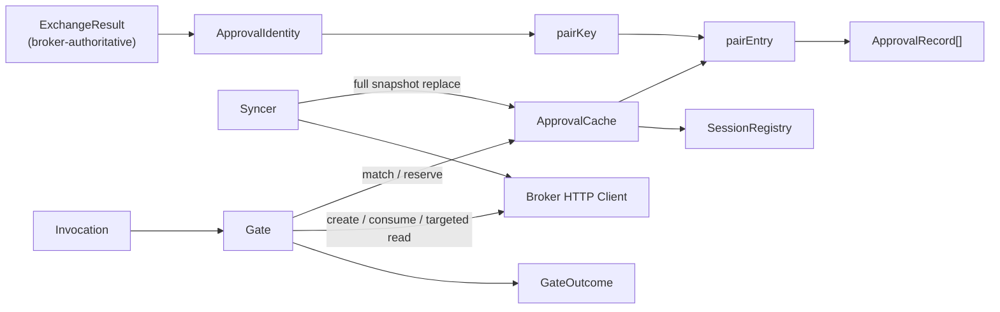

# Phase 1 Data Model: ExtProc Approval Cache Sync & OPA Integration

**Feature**: `026-extproc-approval-sync` | **Spec**: [spec.md](spec.md) | **Research**: [research.md](research.md)

This feature introduces **no persistent entities and no database schema changes**. Every entity below
is an in-memory value or aggregate inside the ExtProc process, or a wire type on an existing broker
endpoint. The authoritative persistent model is the broker's `storage.ToolApproval`
(`internal/domain/storage/tool_approval.go:70-94`), owned by feature 024 and unchanged here.

All new types live in the new package `internal/extproc/approval/`, except where noted.

---

## 1. In-memory entities

### 1.1 `ApprovalCache`

The per-process store of approval records synced from the broker.

| Field | Type | Notes |
|---|---|---|
| `mu` | `sync.RWMutex` | ADR 012 pattern; not `sync.Map` (research R-004) |
| `pairs` | `map[pairKey]*pairEntry` | Keyed by the verified identity pair |
| `sessions` | `map[string]time.Time` | Active `agent_session_id` → last-seen; drives FR-004 query params and FR-009 eviction |
| `etag` | `string` | Last ETag returned by the broker; `""` before bootstrap |
| `idleTTL` | `time.Duration` | `tool_approvals.approval_cache_idle_ttl` |

**Invariants**

- A `200` sync response **replaces** the full state of every pair it returns; it is never merged
  (research R-005 — the broker sends snapshots, not deltas).
- A pair absent from a filtered (`?principal=`) response is left untouched: the response scope is the
  filter, not the whole cache.
- `lastSeen` is updated on every request that consults the pair, not on sync delivery — otherwise
  background polling would keep idle pairs alive forever and defeat FR-010.

### 1.2 `pairKey` (value object)

```go
type pairKey struct {
	principal string
	agentID   string
}
```

A comparable struct, deliberately **not** a concatenated string — the same separator-injection
reasoning ADR 012 applies to `tokenCacheKey` (`internal/extproc/server/exchanger.go:31-35`).

**Provenance (security-critical)**: both fields come exclusively from the broker's token-exchange
response (research R-000). They are never parsed from a caller-supplied token. When either is absent,
no `pairKey` is constructed and the request fails closed.

### 1.3 `pairEntry`

| Field | Type | Notes |
|---|---|---|
| `records` | `[]ApprovalRecord` | All active approvals for this pair, as delivered by the broker |
| `lastSeen` | `time.Time` | FR-010 idle eviction |

### 1.4 `ApprovalRecord`

One approval as delivered by `GET /api/approvals`, plus one local-only field.

| Field | Type | Source | Notes |
|---|---|---|---|
| `ID` | `string` | `id` | Broker approval UUID; used for consume and as `toolpattern.Candidate.ID` |
| `ToolName` | `string` | `tool_name` | Concrete tool of the originating invocation |
| `ToolPattern` | `string` | `tool_pattern` | Glob; matched via `toolpattern.Matches` |
| `ParamsPattern` | `map[string]string` | `params_pattern` | Param → canonical glob; absent keys unconstrained |
| `Status` | `string` | `status` | `pending` \| `approved` \| `denied` |
| `Persistence` | `*string` | `persistence` | `once` \| `session` \| `permanent`; nil while pending |
| `Consumed` | `bool` | `consumed` | Broker-reported |
| `AgentSessionID` | `*string` | `agent_session_id` | Scope key for `session` persistence |
| `DecidedAt` | `time.Time` | `approved_at` | **Requires broker change 2** — see [contracts/broker-api-changes.yaml](contracts/broker-api-changes.yaml). Becomes `toolpattern.Candidate.DecidedAt` for FR-015 tie-breaks |
| `reserved` | `bool` | **local only** | FR-008 compare-and-swap reservation; never serialized |

**Matchability rule** — a record is a matching candidate only when **all** hold:

1. `Status == "approved"`;
2. `Consumed == false` and `reserved == false`;
3. persistence scope is satisfied — `permanent` always; `session` only when `*AgentSessionID` equals
   the request's active agent session id; `once` only when unreserved and unconsumed;
4. `toolpattern.Matches(ToolPattern, ParamsPattern, toolName, arguments)` is true.

Candidates surviving (1)–(4) are ranked by `toolpattern.SelectBest`; the winner is used.
A `pending` or `denied` record never matches — a `denied` record does **not** short-circuit to a hard
deny either, because OPA owns the deny decision (FR-002/FR-014).

**Missing `approved_at` is fail-closed.** A record with `Status == "approved"` but no `approved_at`
is treated as **unmatchable** and logged as a broker-contract warning. It is never ranked with a zero
`DecidedAt`: doing so would silently demote a recent user decision beneath the ID tie-breaker and
violate FR-015's "ties broken by later decision time".

**State transitions of the local `reserved` flag (FR-008)**

```
unreserved --Reserve() under write lock--> reserved
reserved   --consume 200 OK-------------> Consumed=true (permanently unmatchable)
reserved   --consume failure-----------> unreserved (retryable on a later request)
```

`Reserve` is the compare-and-swap: it succeeds only if the record is currently unreserved, giving
best-effort at-most-once **within one instance**. Cross-replica at-most-once is explicitly not
guaranteed (spec FR-008 item 3).

### 1.5 `SessionRegistry` (embedded in the cache)

Tracks live `agent_session_id` values so the syncer can supply them as repeated query parameters
(FR-004) and so session-scoped records can be evicted (FR-009).

- An id is registered/refreshed whenever a request carrying it is processed.
- An id is dropped once absent from live traffic for the FR-010 idle window; dropping it removes every
  `session`-persistence record scoped to it (FR-009).
- ExtProc receives no explicit session-close signal from agentgateway; SC-008's 1-second window
  applies only if such a signal becomes available.

---

## 2. Per-request value objects

### 2.1 `ApprovalIdentity`

The broker-bound identity for the in-flight request. Produced by the token exchange, never by parsing
a caller token.

| Field | Type | Source |
|---|---|---|
| `Principal` | `string` | `server.ExchangeResult.Principal` |
| `AgentID` | `string` | `server.ExchangeResult.AgentID` |

**Validity**: complete only when both fields are non-empty. An incomplete identity is a fail-closed
condition (research R-000): no cache lookup, no `?principal=` read, no approval creation.

### 2.2 `Invocation`

The concrete tool call being gated.

| Field | Type | Source |
|---|---|---|
| `ToolName` | `string` | `input.mcp.tool_name` (parsed by `authorization.ParseMCPMessage`) |
| `Arguments` | `map[string]any` | `input.mcp.arguments` |
| `AgentSessionID` | `string` | Request header named by `sessions.extraction.http_header` |
| `MCPSessionID` | `string` | Fixed `Mcp-Session-Id` header (`extractSessionID`) |
| `SubjectToken` | `string` | `requestState.bearerToken` — used for create and consume auth |
| `RequestID` | `json.RawMessage` | JSON-RPC id, for the elicitation response (research R-007) |

### 2.3 `GateOutcome`

The result of the approval gate, consumed by the server's decision branch.

| Variant | Server action |
|---|---|
| `OutcomeProceed` | Echo the buffered body; the exchanged token was already set on the header |
| `OutcomeElicit{URL, Message}` | HTTP 200 JSON-RPC `-32042` `URLElicitationRequiredError` |
| `OutcomeDeny{Reasons}` | HTTP 403 `{"error":"access_denied","error_description":...}` |

---

## 3. Broker wire types (client-side mirrors)

ExtProc mirrors only the fields it consumes. The authoritative shapes are the broker's unexported
handler DTOs.

### 3.1 Sync response — `GET /api/approvals`

Mirrors `syncResponse` (`internal/adapters/http/handlers/approval/sync_handler.go:24-50`):

```json
{
  "data": {
    "pairs": [
      {
        "principal": "alice@example.com",
        "agent_id": "0f8d...",
        "approvals": [
          {
            "id": "…", "tool_name": "create_pull_request", "arguments_hash": "…",
            "tool_pattern": "create_pull_request", "params_pattern": {"repo": "acme/*"},
            "status": "approved", "persistence": "session",
            "consumed": false, "agent_session_id": "sess-abc",
            "approved_at": "2026-09-04T10:11:12Z"
          }
        ],
        "granted_permission_sets": {}
      }
    ]
  }
}
```

`granted_permission_sets` is a broker-side placeholder always serialized as `{}`
(`sync_handler.go:180-187`). ExtProc **ignores it** — permission sets come from the token-exchange
snapshot (spec FR-001, Clarification 2026-09-03).

`ETag` is returned on `200` only, as `"v{version}"` (`sync_handler.go:190-194`). `304` carries no body
and no ETag.

`approved_at` is **added by this feature** (broker change 2). It is projected from
`storage.ToolApproval.ApprovedAt` and is absent while pending or when denied. It is the sole source
of `ApprovalRecord.DecidedAt` and therefore of FR-015's decision-time tie-break; today's summary
carries no timestamp at all (`sync_handler.go:40-73`).

### 3.2 Create request/response — `POST /api/approvals`

Mirrors `createRequest` / `createResponse` (`create_handler.go:19-41`):

```json
{
  "metadata": {
    "mcp_session_id": "…", "agent_session_id": "…",
    "tool_invocation_id": "…", "description": "…"
  },
  "tool_name": "create_pull_request",
  "arguments": {"repo": "acme/app", "title": "…"},
  "risk_level": "medium"
}
```

`metadata`, `metadata.description`, non-empty `tool_name`, and non-nil `arguments` are required by
handler validation (`create_handler.go:75-91`). `description` is sourced from OPA's optional
`approval_context`; ExtProc supplies a deterministic fallback (`"Approval required for <tool>"`) when
the policy omits it, since the broker rejects the request without it.

Response: `{"data": {"id", "status", "approval_url", "created_at"}}` — `201` for a new record, `200`
for an existing pending one (`create_handler.go:124-141`). ExtProc treats both identically and uses
`approval_url`.

### 3.3 Consume response — `POST /api/approvals/{id}/consume`

No request body. Response `{"data": {"id", "consumed", "consumed_at"}}`
(`consume_handler.go:45-51`). ExtProc keys only on the status code: `200` → proceed; anything else →
release the reservation and deny.

### 3.4 Broker API changes (**new**)

Two additive, optional-valued fields, confirmed and in scope as spec **FR-017** and **FR-018** with
acceptance scenarios under User Story 5. Full schemas, rationale, and rejected alternatives:
[contracts/broker-api-changes.yaml](contracts/broker-api-changes.yaml). Together they constitute the
entire broker-side surface of this feature.

**Change 1 — token-exchange response identity.** Extends the RFC 8693 response ExtProc already
parses (`internal/extproc/server/exchanger.go:82-87`):

| Field | Type | Required | Meaning |
|---|---|---|---|
| `principal` | `string` | optional | The principal the broker extracted from the verified subject token |
| `agent_id` | `string` | optional | The agent id the broker extracted from the verified subject token |

**Change 2 — approval sync summary decision time.** Extends `toolApprovalSummary`
(`sync_handler.go:40-50`):

| Field | Type | Required | Meaning |
|---|---|---|---|
| `approved_at` | `string` (RFC 3339) | optional | When the user approved the record; absent while pending or denied |

---

## 4. Configuration entities

New sections on the ExtProc config root (`internal/extproc/config/config.go:9-17`):

```go
type ToolApprovalsConfig struct {
	Enabled                bool          `mapstructure:"enabled"`
	URL                    string        `mapstructure:"url"`
	LongPollTimeoutSeconds int           `mapstructure:"long_poll_timeout_seconds"`
	ApprovalCacheIdleTTL   time.Duration `mapstructure:"approval_cache_idle_ttl"`
	RequestTimeout         time.Duration `mapstructure:"request_timeout"`
}

type SessionsConfig struct {
	Extraction SessionExtractionConfig `mapstructure:"extraction"`
}

type SessionExtractionConfig struct {
	HTTPHeader string `mapstructure:"http_header"`
}
```

Defaults, validation rules, and rationale: [contracts/extproc-approval-config.yaml](contracts/extproc-approval-config.yaml)
and research R-010.

---

## 5. OPA input additions

One new field on `ContextInput` (`internal/extproc/authorization/input.go:31-38`):

| Field | JSON | Source |
|---|---|---|
| `AgentSessionID` | `context.agent_session_id` | Header named by `sessions.extraction.http_header` |

`input.mcp.session_id` is unchanged and remains the MCP protocol session from the fixed
`Mcp-Session-Id` header. Full contract: [contracts/opa-input-approval.md](contracts/opa-input-approval.md).

---

## 6. Relationships



**Ownership**: the `Gate` owns the `ApprovalCache`; the `Syncer` writes to it; the broker HTTP `Client`
is stateless and shared. The `Server` holds only the `Gate` and never touches the cache directly.

---

## 7. Explicit non-entities

- **No new persisted entity, table, or migration.** Migrations 024–026 and 030 already provide
  everything the broker side needs.
- **No new typed entity ID.** ADR 013 requires typed IDs for UUID primary keys of broker domain
  entities. ExtProc holds approval ids as opaque strings and cannot import `internal/domain/id`
  (ADR 035 permits `internal/toolpattern` only).
- **No approval data in the OPA input.** FR-001 forbids it; approval matching happens outside the
  policy.
- **No permission-set cache.** Permission sets ride the token-exchange snapshot on the token's own TTL.
