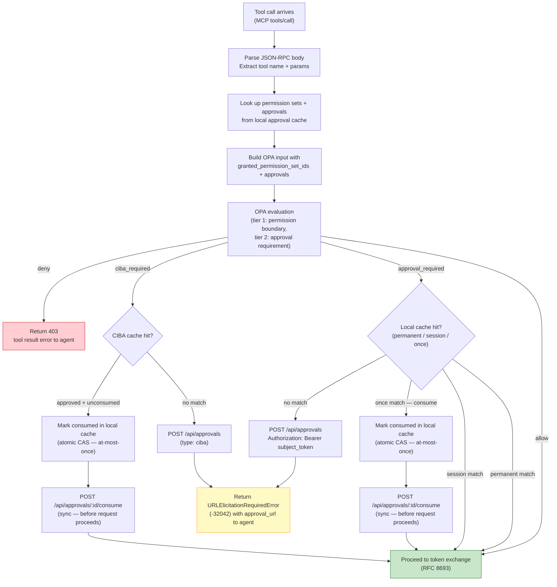
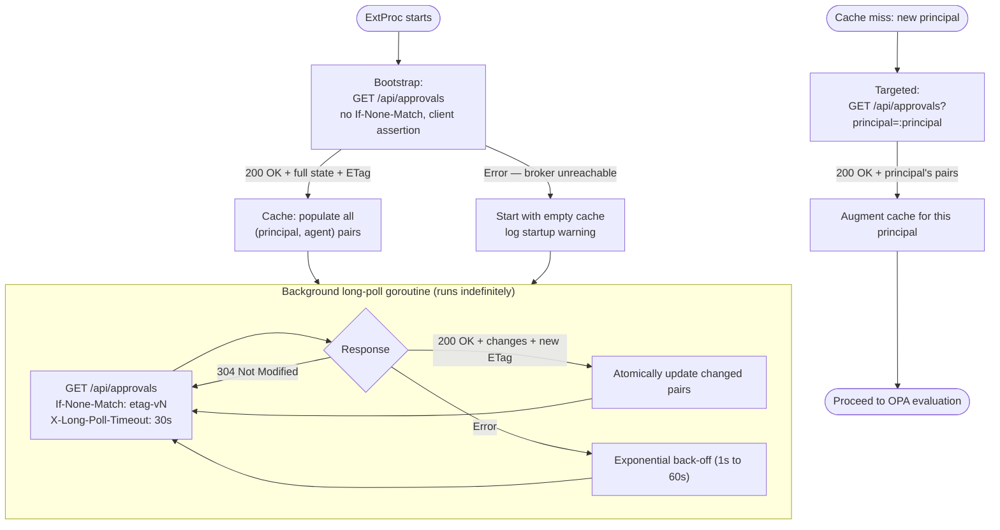
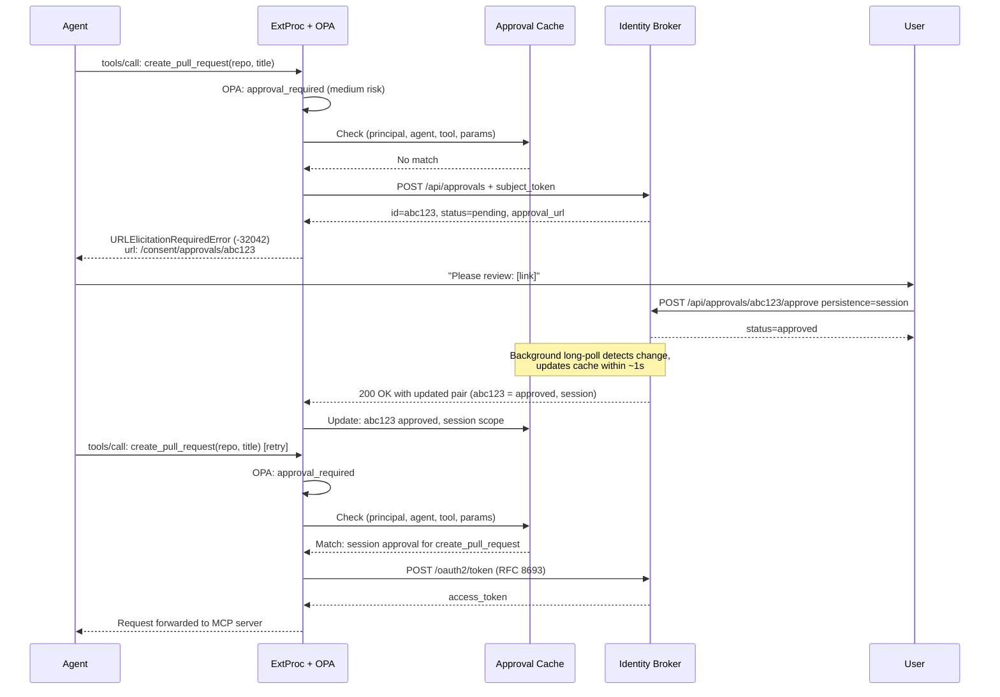

# Feature Specification: ExtProc Approval Cache Sync & OPA Integration

**Feature Branch**: `026-extproc-approval-sync`
**Created**: 2026-04-10
**Status**: Draft
**Input**: User description: "I want the extproc application to actually use the approvals granted by the identity broker in the Open Policy Agent instance and keep the approvals current so that users of MCP Servers can continue in their agentic sessions. The changes to the broker have already been done on branch 024-approval-api-ui."
**Related**: [Design: Permission Sets & Tool Authorization](../.../design-tool-authorization/specs/design-permission-sets-tool-authorization.md), [Feature 020: OPA-Based Authorization in ExtProc](../020-extproc-opa-authorization/spec.md), [Feature 024: Tool Approval API & UI](../024-approval-api-ui/spec.md)

## Clarifications

### Session 2026-04-10

- Q: When OPA signals `approval_required`, should ExtProc fall back to a synchronous approval check against the broker if the local cache has no match, or create a new pending approval immediately? → A: Per the design (Section 5.1), ExtProc creates a new pending approval synchronously via `POST /api/approvals`, then returns a `URLElicitationRequiredError`. A targeted `GET /api/approvals/{id}` is used on the agent retry to resolve freshly created approvals before the long-poll cycle catches up.
- Q: Should this feature include risk-based auto-approval (Section 4.6 of the design), or limit scope to the core cache sync and OPA approval-gating flow? → A: Limit scope to the core four-valued OPA decision flow (allow / approval_required / ciba_required / deny) and the approval cache sync. Risk scoring is out of scope for this feature.
- Q: Should CIBA (Tier 3) approval handling be included? → A: The OPA `ciba_required` decision path is included in the four-valued decision model, but broker-side CIBA relay and elevated CIBA token storage are out of scope. ExtProc must handle `ciba_required` with the same `URLElicitationRequiredError` response pattern as `approval_required`, delegating CIBA orchestration entirely to the broker.
- Q: How should tool call parameters be matched against a cached `params_pattern`? → A: Glob/wildcard patterns — `tool_pattern` and `params_pattern` support glob syntax (e.g. `create_*`, `{"repo":"*"}`) for flexible matching. Wildcard parameter pattern matching is in scope for this feature (Section 4.8 of the design).
- Q: When multiple ExtProc replicas are deployed, how should long-poll connections be coordinated? → A: Each replica maintains its own independent long-poll connection; no coordination mechanism. The broker must support N concurrent waiters. ExtProc replicas are stateless with respect to each other's approval caches.
- Q: Is `GET /api/approvals/{id}` confirmed available in feature 024, or must this feature implement it? → A: Confirmed in feature 024 — verified present in `internal/adapters/http/routing/enduser.go` line 68 and `internal/adapters/http/handlers/approval/get_handler.go`. This feature consumes it without additional broker-side work.
- Q: Should `X-Long-Poll-Timeout: 30` be a fixed constant or configurable? → A: Configurable — added to the `tool_approvals.*` config section as `tool_approvals.long_poll_timeout_seconds` with a default of 30.
- Q: What observability is required beyond the two explicit log events (FR-003 startup warning, FR-012 undefined OPA decision warning)? → A: Structured logs only. No Prometheus metrics or OpenTelemetry traces are required for this feature.

## Overview

This feature wires the OPA authorization engine (introduced in feature 020) to the identity broker's approval service (built in feature 024), completing the Tier 2 runtime authorization loop described in the overarching tool authorization design.

Today, the OPA pipeline in ExtProc evaluates policies against a fixed `context.granted_permission_sets` (currently an empty placeholder) and produces binary allow/deny decisions. This feature:

1. **Populates OPA's input with live approval and permission set data** from the broker via a long-poll cache backed by `GET /api/approvals`.
2. **Extends OPA to a four-valued decision model** (`allow`, `approval_required`, `ciba_required`, `deny`), teaching ExtProc to act on each outcome: auto-allow, create a pending approval and return a `URLElicitationRequiredError`, or hard-deny.
3. **Keeps the approval cache current** via a background long-poll goroutine with ETag-based incremental updates, so that when a user approves a tool call in the broker UI, the agent's next retry succeeds without a broker round-trip.

Together, these changes mean that MCP server users can: (a) have tool calls evaluated against their actual consent-granted permission sets, (b) be prompted via a URL when a tool requires explicit approval, and (c) resume their agentic session immediately after granting approval — without restarting the session or manually re-issuing the tool call.

## Activity Diagrams

### Four-Valued OPA Decision Flow

### Approval Cache Lifecycle

### Agent Retry After User Approval

## User Scenarios & Testing *(mandatory)*

### User Story 1 — Agent Retries Tool Call After User Approves (Priority: P1)

An agent calls a medium-risk tool that requires human approval. ExtProc detects the requirement via OPA, creates a pending approval in the broker, and returns a `URLElicitationRequiredError` to the agent with the approval URL. The user clicks the link, approves in the broker UI, and the agent retries. On the second attempt, ExtProc finds the approval in its local cache (synced from the broker's long-poll endpoint) and the tool call proceeds without a broker round-trip.

**Why this priority**: This is the central value proposition of the feature — closing the loop between OPA authorization, user approval, and agent continuation. All other stories depend on this flow being correct.

**Independent Test**: Can be fully tested by seeding an agent session, triggering a `tools/call` that OPA classifies as `approval_required`, verifying that a `URLElicitationRequiredError` is returned, calling the broker to approve, waiting for the cache sync, and verifying the agent retry succeeds.

**Acceptance Scenarios**:

1. **Given** OPA policy classifies `create_pull_request` as `approval_required` and no matching approval exists in the cache, **When** ExtProc processes a `tools/call: create_pull_request`, **Then** ExtProc calls `POST /api/approvals` with the subject token and tool details, and returns a `URLElicitationRequiredError` (MCP error code `-32042`) containing the `approval_url` from the broker response.

2. **Given** a pending approval was just created and the background long-poll goroutine has not yet delivered the state change, **When** the agent retries the same `tools/call` before the cache has been updated, **Then** ExtProc performs a targeted `GET /api/approvals/{approval_id}` to check the specific approval and finds it approved, allowing the tool call to proceed without waiting for the next long-poll cycle.

3. **Given** the background long-poll goroutine has synced a session-scoped approval for `(principal, agent, create_pull_request)`, **When** the agent calls `create_pull_request` a second time in the same session, **Then** ExtProc finds the session approval in its local cache and proceeds directly to token exchange — no broker call for approval is made.

4. **Given** a permanent approval exists in the cache for `(principal, agent, create_pull_request)`, **When** the agent calls `create_pull_request` in any session (sessions identified by the value of `sessions.extraction.http_header`, default `Mcp-Session-Id`), **Then** the tool call proceeds without any approval creation or broker round-trip.

5. **Given** a one-time (`once`) approval exists in the cache, **When** the agent calls the matching tool, **Then** ExtProc atomically marks the approval consumed in the local cache via compare-and-swap (at-most-once within this instance), calls `POST /api/approvals/:id/consume` on the broker synchronously with the subject token in the `Authorization` header and the current session ID in the request body (the broker verifies the consuming principal and session match the approval's owner, and marks it consumed), then allows the request to continue. In a multi-replica deployment, if the broker returns "already consumed" (e.g. 409), ExtProc invalidates the local cache entry and falls through to approval creation — the agent that lost the race receives a new `URLElicitationRequiredError` rather than proceeding with a consumed approval. On the agent's next call for the same tool, the consumed approval is not matched, and a new approval request is issued.

6. **Given** a `session`-scoped approval has been granted for `create_pull_request` in session `sess-abc`, **When** the MCP session `sess-abc` ends, **Then** ExtProc evicts the session-scoped approval from its local cache and the next `create_pull_request` call in a new session requires fresh approval.

---

### User Story 2 — Permission Set Boundary Enforced Before Approval Check (Priority: P1)

A tool call is blocked at the Tier 1 permission set boundary (the user never granted the required permission set), without ever creating a pending approval. This ensures that approval requests only reach users for tools they've actually consented to at the grant level.

**Why this priority**: Without this ordering, a denied tool at the permission set level would generate spurious approval requests visible to users, creating confusion and approval fatigue.

**Independent Test**: Can be fully tested by configuring OPA policy mapping a tool to a permission set that the test principal has not granted, sending the tool call, and verifying ExtProc returns a hard deny (403) without calling `POST /api/approvals`.

**Acceptance Scenarios**:

1. **Given** the user has not granted `github-full` permission set and OPA policy requires it for `delete_repository`, **When** the agent calls `tools/call: delete_repository`, **Then** OPA returns `deny` (insufficient permission set) and ExtProc returns a tool result error without calling `POST /api/approvals`.

2. **Given** the user has granted `github-readonly` permission set and OPA classifies `list_repositories` as `allow` for that set at low risk, **When** the agent calls `tools/call: list_repositories`, **Then** the tool call proceeds directly to token exchange without any approval check or broker call.

3. **Given** OPA policy requires `github-issues` permission set for `create_issue` and the user has granted that set, **When** the agent calls `tools/call: create_issue` and the tool is classified as `approval_required` (medium risk), **Then** the permission boundary passes (Tier 1 allow) and the approval check proceeds (Tier 2).

---

### User Story 3 — Approval Cache Bootstraps on ExtProc Startup (Priority: P1)

When ExtProc starts, it performs a non-conditional `GET /api/approvals` using its client assertion. The broker determines what data to return — the response may be empty, partial, or full depending on the broker's implementation; ExtProc accepts whatever is provided and populates its local approval cache accordingly. Subsequent requests are served from cache. The long-poll background goroutine keeps the cache current for the lifetime of the process.

**Why this priority**: Without bootstrap, the first tool call from every user would miss the cache and generate spurious approval requests even for tools the user has already permanently approved.

**Independent Test**: Can be fully tested by configuring ExtProc with broker credentials, seeding permanent approvals in the broker before startup, starting ExtProc, and verifying that the first tool call for a pre-approved tool proceeds without creating a new approval.

**Acceptance Scenarios**:

1. **Given** the broker contains a permanent approval for `(alice@example.com, code-assistant, create_issue)`, **When** ExtProc starts and bootstraps its cache, **Then** the first `tools/call: create_issue` from `alice` proceeds directly to token exchange without any approval creation.

2. **Given** the broker is unreachable at ExtProc startup, **When** the bootstrap request fails, **Then** ExtProc starts successfully (approval cache is empty); for each subsequent approval-required tool call, ExtProc first attempts a targeted `GET /api/approvals?principal={principal}` to augment the cache (FR-005) — if that also fails (broker still unreachable), only then does ExtProc create a new pending approval — rather than refusing to start. A startup warning is logged indicating that the cache could not be pre-populated.

3. **Given** the broker returns a valid ETag in the bootstrap response, **When** the background long-poll goroutine begins, **Then** it uses the bootstrap ETag in the `If-None-Match` header and only receives incremental updates going forward.

4. **Given** a new `(principal, agent)` pair not present in the initial bootstrap arrives, **When** ExtProc receives the first tool call for that pair, **Then** ExtProc makes a targeted `GET /api/approvals?principal={principal}` to augment the cache for that principal before evaluating the OPA approval check.

---

### User Story 4 — Long-Poll Goroutine Keeps Cache Current (Priority: P2)

The background long-poll goroutine maintains a single persistent `GET /api/approvals` connection per ExtProc instance. When any approval state changes in the broker (user approves, denies, or revokes), the broker wakes the waiting connection and delivers the updated state. ExtProc atomically updates only the affected `(principal, agent)` pairs. The "within 2 seconds" propagation SLA is a broker-side implementation requirement — the broker is responsible for notifying waiting long-poll connections promptly. This is not enforced by ExtProc but is validated end-to-end by SC-002.

**Why this priority**: Cache staleness determines the maximum delay between user approval and agent continuation. Without long-polling, agents would always wait for a full polling interval, degrading the user experience.

**Independent Test**: Can be fully tested by establishing an ExtProc instance with a long-poll connection, mutating an approval in the broker, and verifying the cache updates within 2 seconds — observable through a subsequent tool call that would have required a new approval with a stale cache but succeeds with the updated one.

**Acceptance Scenarios**:

1. **Given** the long-poll goroutine holds a connection with `If-None-Match: "etag-v1"` and `X-Long-Poll-Timeout: 30`, **When** no state changes occur within 30 seconds, **Then** the broker returns `304 Not Modified` and the goroutine immediately re-polls with the same ETag.

2. **Given** the long-poll goroutine is waiting, **When** a user approves an approval in the broker UI, **Then** the broker wakes the goroutine within 2 seconds, returns `200 OK` with the updated pair state and a new ETag, and the goroutine atomically updates the affected cache entries.

3. **Given** the long-poll connection drops due to network interruption, **When** the goroutine reconnects, **Then** it replays the last-known ETag and the broker returns all changes since that ETag (or the full state if the ETag is stale beyond a server-side retention window).

4. **Given** the broker restarts and loses in-memory ETag state, **When** ExtProc reconnects with a stale ETag, **Then** the broker returns the full current state (treating the ETag as unknown) and ExtProc refreshes the full cache.

---

### User Story 5 — CIBA-Required Tool Returns Elicitation URL (Priority: P2)

When OPA classifies a tool as `ciba_required`, ExtProc creates a CIBA-type approval in the broker and returns a `URLElicitationRequiredError` to the agent — identical in shape to a Tier 2 approval. The agent presents the URL to the user; the broker handles CIBA orchestration internally. When the CIBA flow completes (broker side), the approval cache sync delivers the approved state to ExtProc, and the agent's retry succeeds.

**Why this priority**: The agent-facing behavior for CIBA must be uniform with Tier 2 approval. Without this story, `ciba_required` decisions in OPA would cause unhandled states in ExtProc.

**Independent Test**: Can be fully tested by configuring OPA policy to return `ciba_required` for a specific tool, sending the tool call, verifying a `URLElicitationRequiredError` is returned with a URL, manually approving the CIBA approval in the broker, and verifying the retry succeeds.

**Acceptance Scenarios**:

1. **Given** OPA policy classifies `delete_repository` as `ciba_required` and no CIBA approval exists in the cache, **When** the agent calls `tools/call: delete_repository`, **Then** ExtProc calls `POST /api/approvals` with `type: ciba` in the metadata, and returns a `URLElicitationRequiredError` containing the approval URL.

2. **Given** a CIBA approval has been approved by the broker (user completed device authentication), **When** the long-poll goroutine syncs the approved state and the agent retries `delete_repository`, **Then** ExtProc finds the approved CIBA approval in its local cache and proceeds to token exchange.

3. **Given** a CIBA approval was used once, **When** the agent calls `delete_repository` a second time, **Then** the consumed CIBA approval is not matched and a new CIBA approval flow is triggered — CIBA approvals are always single-use.

---

### User Story 6 — Token Exchange Receives Correct Scope from Permission Set Context (Priority: P2)

After OPA allows a tool call (Tier 1 + Tier 2 pass), ExtProc proceeds to the RFC 8693 token exchange. The token exchange request must identify the correct service and scope context derived from the permission set that covered the tool, ensuring the narrowed access token returned is appropriate for the tool being executed.

**Why this priority**: Without passing permission set context to the token exchange, the broker cannot issue a narrowed-scope token matched to what the user actually consented to for this specific tool.

**Independent Test**: Can be fully tested by configuring a tool → permission set → service mapping in OPA, triggering a tool call that passes the approval check, and verifying the token exchange request to the broker includes the correct service identifier and scopes that correspond to the matched permission set.

**Acceptance Scenarios**:

1. **Given** OPA policy maps `create_issue` to the `github-issues` permission set (service: `github`, scopes: `repo:read`, `issues:write`), **When** the tool call is allowed and ExtProc initiates token exchange, **Then** the RFC 8693 request includes the `github` resource URI and the broker issues a token scoped to `repo:read issues:write`.

2. **Given** the user has been granted both `github-readonly` and `github-issues` permission sets, **When** OPA determines that `create_issue` is covered by `github-issues` (the first matching set), **Then** ExtProc uses the `github` service from the matched permission set for token exchange, not an unrelated service.

---

### Edge Cases

- **Broker unavailable during approval creation**: When `POST /api/approvals` fails (broker unreachable), ExtProc returns a `URLElicitationRequiredError` with a synthetic "broker unavailable" error message rather than an unrelated 503, so the agent can surface the degraded state to the user.
- **Duplicate approval creation (stale cache)**: When ExtProc's cache is stale and calls `POST /api/approvals` for a tool+params combination that already has a pending approval in the broker, the broker returns the existing approval's URL (idempotent). ExtProc uses the returned URL in the `URLElicitationRequiredError` without creating a duplicate.
- **OPA returns undefined decision**: When OPA evaluation returns an undefined `decision` (policy author forgot the default rule), ExtProc treats it as `deny` — fail closed. This is logged as a policy misconfiguration warning to distinguish from an intentional deny.
- **Subject token missing or invalid for approval creation**: When ExtProc cannot extract a valid subject token from the request context, the approval creation call to the broker will return 401, and ExtProc logs the error and returns a hard deny to the agent.
- **Cache eviction and re-augmentation**: When a `(principal, agent)` pair is evicted from the cache after the idle timeout, the next request triggers a targeted `GET /api/approvals?principal={p}` augmentation before the OPA check proceeds — not a full cache rebuild.
- **Concurrent one-time approval consumption (same instance)**: When two concurrent requests on the same ExtProc instance match the same `once` approval, the local CAS guarantees only one proceeds. The other falls through to approval creation.
- **Concurrent one-time approval consumption (multiple replicas)**: When two ExtProc replicas independently match the same `once` approval before the broker's long-poll stream delivers the consumed state, both call `POST /api/approvals/:id/consume`. The first caller receives `200 OK`; the second caller receives `409 Conflict` (already consumed). The race-loser ExtProc invalidates its local cache entry and falls through to approval creation, issuing a new `URLElicitationRequiredError` to its agent. **Requires feature 024 extension**: the consume endpoint must return `409 Conflict` instead of idempotent `200 OK` when already consumed.

## Functional Requirements

### FR-001: OPA Input Populated with Approval Cache Data
When OPA evaluates a `tools/call`, the input document MUST include:
- `input.context.granted_permission_set_ids`: The list of permission set IDs granted to `(principal, agent)` from the local cache.
- `input.context.approvals`: The list of cached approval records for `(principal, agent)`, including `tool_pattern`, `persistence`, `status`, `consumed`, and `session_id`.

### FR-002: Four-Valued OPA Decision Handling
ExtProc MUST handle all four OPA `result.action` values:
- `"allow"`: Proceed to token exchange.
- `"deny"`: Return tool result error. No approval is created.
- `"approval_required"`: Check local cache; if no match, create a pending approval in the broker and return `URLElicitationRequiredError` (-32042).
- `"ciba_required"`: Check local cache for CIBA approval; if no match, create CIBA-type pending approval and return `URLElicitationRequiredError` (-32042).

### FR-003: Approval Cache Bootstrap on Startup
On startup, ExtProc MUST call `GET /api/approvals` with the configured client assertion (no `If-None-Match`) to pre-populate the local approval cache. The bootstrap call MUST complete before ExtProc accepts requests, OR ExtProc accepts requests with an empty cache and treats every approval-required call as a cache miss.

### FR-004: Background Long-Poll Goroutine
ExtProc MUST run exactly one background goroutine that continuously polls `GET /api/approvals` using the client assertion. It MUST:
- Use the last-known ETag in `If-None-Match` on each poll.
- Pass `X-Long-Poll-Timeout: {tool_approvals.long_poll_timeout_seconds}` (default: 30) to enable server-side hold.
- On `200 OK`: atomically update all changed `(principal, agent)` pairs and store the new ETag.
- On `304 Not Modified`: immediately re-poll with the same ETag.
- On error: apply exponential back-off (initial 1s, max 60s) before retrying.

### FR-005: Cache Miss Augmentation
When a `(principal, agent)` pair is not found in the local cache (cache miss or eviction), ExtProc MUST call `GET /api/approvals?principal={principal}` synchronously before completing OPA evaluation for that request. The augmentation response MUST update the cache for the principal before the OPA check.

### FR-006: Approval Creation on Cache Miss
When OPA returns `approval_required` or `ciba_required` and no matching approval exists in the local cache, ExtProc MUST:
1. Call `POST /api/approvals` with the subject token in the `Authorization` header and the tool name, arguments, agent session ID, and MCP session ID in the request body.
2. Return a `URLElicitationRequiredError` (MCP error code `-32042`) to the agent containing the `approval_url` from the broker response.

### FR-007: Freshly-Created Approval Fall-Through
After creating a pending approval via `POST /api/approvals`, ExtProc MUST store the returned `approval_id` in the per-request context. On the agent's next retry, if the long-poll cache does not yet have the approval, ExtProc MUST perform a targeted `GET /api/approvals/{approval_id}` to check its status before falling through to a new approval creation.

### FR-008: One-Time Approval Consumption
When a `once`-persistence approval is matched:
1. The approval MUST be marked consumed in the local cache via compare-and-swap before the request continues (preventing concurrent double-use within this instance).
2. `POST /api/approvals/:id/consume` MUST be called synchronously before the request proceeds, with the per-request subject token in the `Authorization` header and the current session ID (extracted via `sessions.extraction.http_header`) in the request body. The broker validates that the subject token's principal matches the approval's owner and rejects with 403 if not. **Note**: the session ID body field requires a corresponding extension to feature 024's consume endpoint.
3. The broker's consume endpoint MUST return `409 Conflict` when the approval has already been consumed, so ExtProc can distinguish first-consumer from race-loser. Within a single instance the local CAS prevents double-use; across replicas, if the broker returns `409 Conflict`, ExtProc invalidates the local cache entry and falls through to approval creation — the agent that lost the race receives a new `URLElicitationRequiredError` rather than proceeding with a consumed approval. **Requires feature 024 extension**: the consume endpoint currently returns `200 OK` idempotently; it must be changed to return `409 Conflict` with an `already_consumed` indicator when the approval was previously consumed.

### FR-009: Session-Scoped Approval Expiry
When an MCP session ends (session close event or session timeout), all `session`-scoped approvals keyed to that session MUST be removed from the local cache.

### FR-010: Approval Cache Idle Eviction
Cache entries for `(principal, agent)` pairs that have had no requests for longer than the configured idle timeout (default: 5 minutes) MUST be evicted. The next request for the pair triggers FR-005 augmentation.

### FR-011: Long-Poll Authentication
The long-poll `GET /api/approvals` request MUST authenticate using the ExtProc client assertion (configured credential), not a per-user subject token.

### FR-012: Fail-Closed on Undefined OPA Result
When OPA evaluation returns an undefined `decision` (no rule matched), ExtProc MUST treat it as `deny`. This event MUST be logged as a warning distinguishing it from an intentional `deny`.

### FR-013: Per-Request OPA Input Includes Session Context
The OPA input MUST include the `session_id` extracted from the configured session header (config key: `sessions.extraction.http_header`, default: `Mcp-Session-Id`) so that policies can reason about session-scoped approvals. The header name is configurable because the `Mcp-Session-Id` header identifies an MCP protocol session, which may not correspond 1:1 with an agent session — operators may need to map a different header to scope session approvals appropriately.

### FR-014: No Approval Created for Permission Set Deny
When OPA returns `deny` due to an insufficient permission set (Tier 1), ExtProc MUST NOT call `POST /api/approvals`. The hard deny is returned immediately.

### FR-015: Glob/Wildcard Approval Matching
When matching an incoming tool call against cached approval records, ExtProc MUST evaluate `tool_pattern` and `params_pattern` as glob expressions. An approval record matches a tool call when:
1. The tool name matches `tool_pattern` (glob evaluation), AND
2. The request params match `params_pattern` (glob evaluation against the canonicalized JSON params).
An exact string with no wildcard characters (e.g. `create_issue`) matches only itself. Approval records with the most specific (least wildcard) pattern take precedence when multiple records match.

## Key Entities

- **Approval Cache**: In-memory per-ExtProc-process store keyed by `(principal, agent_id)` pairs. Contains: granted permission set IDs per service, and approval records with `(tool_pattern, params_pattern, persistence, status, consumed, session_id)`. Both `tool_pattern` and `params_pattern` are glob expressions (e.g. `create_*`, `{"repo":"*","branch":"main"}`); an exact string with no wildcard characters matches only itself.
- **Long-Poll Goroutine**: Single background goroutine per ExtProc process that maintains one persistent HTTP connection to `GET /api/approvals`. Carries the broker's `ETag` across calls. Updates the approval cache atomically on change delivery.
- **Four-Valued OPA Decision**: The `result.action` field in the OPA output document: `allow` | `deny` | `approval_required` | `ciba_required`. Paired with optional `approval_context` (tool description, risk level, default persistence) and `reasons` (for deny).
- **Subject Token**: The per-request Bearer token from the request's `Authorization` header, bound to both the principal (user) and agent. Used for approval creation calls so the broker can extract both identities without explicit parameters.
- **Client Assertion**: The ExtProc's own credential, validated by the broker via a CEL expression (same mechanism as token exchange). Used for the long-poll goroutine's authentication.
- **URLElicitationRequiredError**: MCP error code `-32042` with `data.elicitations[0].mode: "url"` and `data.elicitations[0].url: "{approval_url}"`. The standard elicitation mechanism per the MCP Elicitation specification (2025-11-25).

## Assumptions

- The broker's `GET /api/approvals`, `POST /api/approvals`, `GET /api/approvals/{id}`, and `POST /api/approvals/{id}/consume` endpoints are implemented as specified in feature 024 (`024-approval-api-ui`), and those changes are available on the `024-approval-api-ui` branch. `GET /api/approvals/{id}` is confirmed present in `internal/adapters/http/routing/enduser.go` and `internal/adapters/http/handlers/approval/get_handler.go`.
- The OPA policy used in this feature follows the four-valued decision model described in Section 4.2 of the design (`result.action` = allow / deny / approval_required / ciba_required). The OPA evaluation pipeline from feature 020 is present and operational.
- The `context.granted_permission_sets` placeholder in the OPA input (currently an empty object, added in feature 020) is replaced in this feature with live data from the approval cache.
- Permission sets are identified by stable UUIDs in both the broker database and OPA policy data. No permission set name-to-ID resolution is required at the ExtProc layer.
- The broker-side CIBA relay (initiating backchannel authentication with an upstream IdP) is out of scope. ExtProc creates CIBA-type approvals and returns elicitation URLs; the broker handles CIBA orchestration internally and the approval cache sync delivers the result when CIBA completes.
- This feature introduces two new ExtProc config sections. `tool_approvals.*`: `tool_approvals.url` (required — the identity broker base URL), `tool_approvals.long_poll_timeout_seconds` (int, default: 30), `tool_approvals.approval_cache_idle_ttl` (duration, default: `5m`). The `tool_approvals` name was chosen over `broker` to avoid confusion with the broker service already referenced implicitly via the token endpoint config. `sessions.extraction.*`: `sessions.extraction.http_header` (string, default: `"Mcp-Session-Id"`) — the HTTP request header whose value is used as the session identifier for scoping session-scoped approvals. The `sessions.extraction` namespace is designed to accommodate future extraction strategies (e.g. JWT claim, cookie) without breaking the config schema.
- When ExtProc is deployed with multiple replicas, each instance independently maintains its own approval cache and long-poll connection. The broker must support N concurrent long-poll waiters. Replicas do not share cache state or coordinate approval decisions.
- Tool-to-permission-set mapping is defined in OPA Rego data (the `tool_permissions` map), not in the broker database. ExtProc does not query the broker for this mapping.
- Risk scoring and auto-approval based on behavioral signals (Section 4.6 of the design) are out of scope. OPA policy data alone determines the approval requirement level.
- The `Mcp-Session-Id` header is forwarded by agentgateway and available in `RequestHeaders` (per feature 020 context).

## Success Criteria *(mandatory)*

### Measurable Outcomes

- **SC-001**: A tool call classified as `approval_required` by OPA results in a `URLElicitationRequiredError` (-32042) containing a valid approval URL being returned to the agent within 500ms of the ExtProc receiving the request (measured from request arrival to response, excluding broker round-trip latency).
- **SC-002**: After a user approves a pending tool call in the broker UI, the agent's retry succeeds without a new approval prompt within 2 seconds of the user clicking Approve (measured from approval write in broker to cache sync propagation to ExtProc).
- **SC-003**: 100% of tool calls for which OPA returns `deny` (Tier 1 or Tier 2) result in no approval record being created in the broker.
- **SC-004**: A permanently approved tool call for `(principal, agent, tool_pattern)` never generates a broker round-trip on the hot path — it is served entirely from the local cache after the initial bootstrap.
- **SC-005**: ExtProc startup with a reachable broker completes cache bootstrap and is ready to serve requests within 5 seconds.
- **SC-006**: A one-time (`once`) approval is consumed after a single use — the second call for the same tool by the same agent triggers a new approval prompt.
- **SC-007**: The long-poll goroutine reconnects automatically within 5 seconds of a broker restart or network interruption, with no manual intervention or ExtProc restart required.
- **SC-008**: Session-scoped approvals are evicted from the cache within 1 second of the MCP session closing, ensuring they cannot be matched by a new session.

## Out of Scope

- Risk-based automatic approval (Section 4.6 of the design) — risk signals, scoring functions, and auto-approve thresholds.
- Broker-side CIBA relay — the broker's internal interaction with the upstream IdP's backchannel authentication endpoint.
- CIBA elevated token handling in the token exchange path — ExtProc using a CIBA-returned elevated token instead of the standard RFC 8693 exchange is deferred.
- Permission set management, CRUD APIs, and consent UI updates for permission sets (feature 019 territory).
- The MCP server endpoint on the broker (`/mcp`) for programmatic approval status polling by agents (Section 5.3 of the design).
- A2A protocol approval gating — A2A requests remain `type: unknown` and bypass the approval flow.
- OPA decision log export to external sinks.
- Changes to the consent UI or the broker's permission set management pages.
- Permanent approval visibility and revocation in the consent management UI (feature 024 territory).
