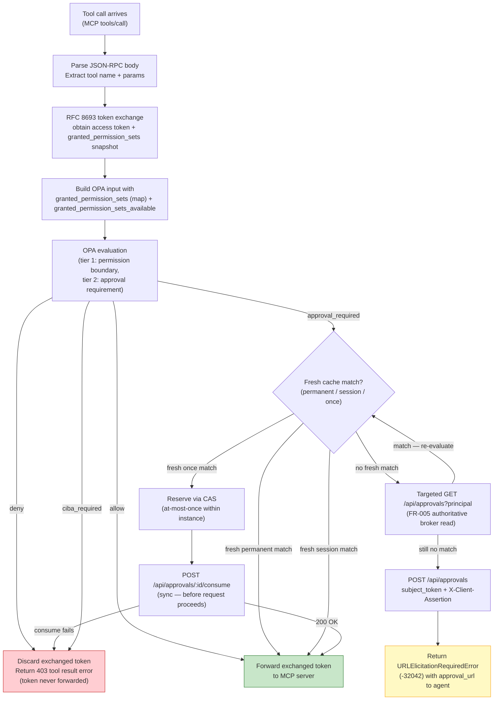
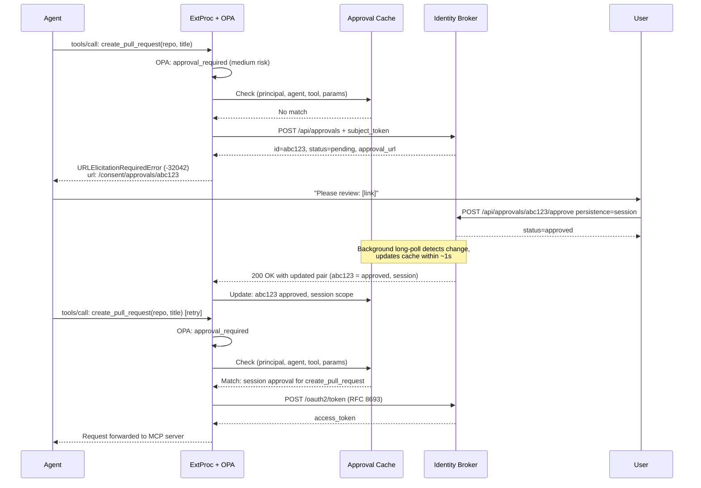

# Feature Specification: ExtProc Approval Cache Sync & OPA Integration

**Feature Branch**: `026-extproc-approval-sync`
**Created**: 2026-04-10
**Status**: Draft
**Input**: User description: "I want the extproc application to actually use the approvals granted by the identity broker in the Open Policy Agent instance and keep the approvals current so that users of MCP Servers can continue in their agentic sessions. The changes to the broker have already been done on branch 024-approval-api-ui."
**Related**: [Design: Permission Sets & Tool Authorization](../.../design-tool-authorization/specs/design-permission-sets-tool-authorization.md), [Feature 020: OPA-Based Authorization in ExtProc](../020-extproc-opa-authorization/spec.md), [Feature 024: Tool Approval API & UI](../024-approval-api-ui/spec.md)

## Clarifications

### Session 2026-04-10

- Q: When OPA signals `approval_required`, should ExtProc fall back to a synchronous approval check against the broker if the local cache has no match, or create a new pending approval immediately? → A: Per the design (Section 5.1), ExtProc creates a new pending approval synchronously via `POST /api/approvals`, then returns a `URLElicitationRequiredError`. A targeted read on the agent retry resolves freshly created approvals before the long-poll cycle catches up. **[Superseded 2026-09-03: that targeted read uses the client-assertion `GET /api/approvals?principal=…&agent_session_id=…`, not `GET /api/approvals/{id}`.]**
- Q: Should this feature include risk-based auto-approval (Section 4.6 of the design), or limit scope to the core cache sync and OPA approval-gating flow? → A: Limit scope to the core OPA decision flow and the approval cache sync. Risk scoring is out of scope for this feature. **[Superseded 2026-09-03: this feature actively handles `allow` / `deny` / `approval_required` only; `ciba_required` is recognized but treated as deny (deferred) — see Q33.]**
- Q: Should CIBA (Tier 3) approval handling be included? → A: The OPA `ciba_required` decision path is included in the four-valued decision model, but broker-side CIBA relay and elevated CIBA token storage are out of scope. ExtProc must handle `ciba_required` with the same `URLElicitationRequiredError` response pattern as `approval_required`, delegating CIBA orchestration entirely to the broker. **[Superseded 2026-09-03: `ciba_required` is deferred — this feature implements `approval_required` only and treats `ciba_required` as deny (020 FR-016).]**
- Q: How should tool call parameters be matched against a cached `params_pattern`? → A: Glob/wildcard patterns — `tool_pattern` and `params_pattern` support glob syntax (e.g. `create_*`, `{"repo":"*"}`) for flexible matching. Wildcard parameter pattern matching is in scope for this feature (Section 4.8 of the design).
- Q: When multiple ExtProc replicas are deployed, how should long-poll connections be coordinated? → A: Each replica maintains its own independent long-poll connection; no coordination mechanism. The broker must support N concurrent waiters. ExtProc replicas are stateless with respect to each other's approval caches.
- Q: Is `GET /api/approvals/{id}` confirmed available in feature 024, or must this feature implement it? → A: Confirmed present in `internal/adapters/http/routing/enduser.go` and `internal/adapters/http/handlers/approval/get_handler.go`. **[Superseded 2026-09-03: `GET /api/approvals/{id}` is browser-only (`X-Remote-User` principal) and is NOT machine-callable by ExtProc; ExtProc reads approval state via the client-assertion `GET /api/approvals?principal=…&agent_session_id=…` instead. No broker-side work is required either way.]**
- Q: Should `X-Long-Poll-Timeout: 30` be a fixed constant or configurable? → A: Configurable — added to the `tool_approvals.*` config section as `tool_approvals.long_poll_timeout_seconds` with a default of 30.
- Q: What observability is required beyond the two explicit log events (FR-003 startup warning, FR-012 undefined OPA decision warning)? → A: Structured logs only. No Prometheus metrics or OpenTelemetry traces are required for this feature.

### Session 2026-09-03

- Q: Does OPA's Tier-1 permission-set input come from the approval cache or the token-exchange response? → A: From the token-exchange response snapshot. ExtProc reuses the `granted_permission_sets` already produced by the RFC 8693 exchange (feature 020); the approval cache carries approval records only, not permission sets. The `granted_permission_sets` placeholder returned by `GET /api/approvals` is not consumed by OPA in this feature.
- Q: Which OPA input field and shape represent granted permission sets? → A: Keep the shipped feature-020 contract — `input.context.granted_permission_sets` (a map of permission-set-ID → [service-IDs]) plus `input.context.granted_permission_sets_available` (bool). The `granted_permission_set_ids` list is not introduced; when the availability flag is false OPA fails closed (deny).
- Q: What is the ordering invariant between OPA evaluation and token exchange, given permission sets come from the exchange response? → A: Permit exchange-before-OPA **for body-bearing `tools/call` requests** (the only requests this feature gates): ExtProc performs the RFC 8693 exchange first, then OPA evaluates Tier-1/Tier-2 from the exchange snapshot. The design's "no token exchange on a Tier-1 deny" premise is revised for these requests: on deny the exchanged token (already scope-bounded to the user's consent) is simply never forwarded to the MCP server. A Tier-1 deny still creates no approval (SC-003 preserved). Header-only `mcp_headers_only` requests (SSE stream setup) retain feature 020's OPA-before-exchange ordering with `granted_permission_sets_available = false` and are not approval-gated.
- Q: Should the consume flow add a 409-Conflict or session_id-body extension to feature 024? → A: No. Align to feature 024's implemented and intended contract: `POST /api/approvals/{id}/consume` is subject-token-only, takes no request body, returns idempotent `200 OK` when already consumed, and `422` for non-`once` approvals. Session-scoped approvals are keyed by the stable `agent_session_id` captured at creation, not the MCP session header. Cross-replica at-most-once is explicitly relaxed: local per-instance CAS is best-effort and the create-time unique index dedups pending creation (not concurrent consume), so a brief cross-replica double-use window is accepted (design §4.7).
- Q: How should `ciba_required` create an approval, given no CIBA type exists and broker CIBA relay is out of scope? → A: ExtProc creates an ordinary approval via the standard `POST /api/approvals` — identical to an `approval_required` creation, with no `type` discriminator. Feature 024's create request has no `persistence` field: persistence (`once`/`session`/`permanent`) is chosen by the user at approve time, so ExtProc cannot and does not force single-use at creation. **[Superseded 2026-09-03: `ciba_required` handling is deferred entirely; ExtProc treats it as deny and creates no CIBA approval in this feature.]**
- Q: Can ExtProc use `GET /api/approvals/{id}` on retry to resolve a freshly-created approval (superseding the 2026-04-10 answers)? → A: No. Per feature 024 (API-004 / routing `requirePrincipal`), `GET /api/approvals/{id}` is authenticated by the browser `X-Remote-User` principal and is not callable with ExtProc's subject token or client assertion. This supersedes the 2026-04-10 clarifications on the targeted GET: the freshly-created-approval fast path instead uses the machine-authenticated, client-assertion `GET /api/approvals?principal={principal}` (the same endpoint as FR-005 cache-miss augmentation), which returns the approval's current status without waiting for the long-poll cycle. No browser-auth path or broker-side extension is required.
- Q: How do session-persistence approvals reach ExtProc's cache, given the sync endpoint re-delivers them only when a matching `agent_session_id` is supplied? → A: Every ExtProc read of `GET /api/approvals` (long-poll FR-004, augmentation FR-005, freshly-created fall-through FR-007) MUST include the currently-active `agent_session_id` query parameter(s) — the endpoint accepts repeatable `agent_session_id` values (`sync_handler.go`). Feature 024 returns session-scoped approvals only for supplied `agent_session_id`s; permanent-persistence approvals are returned unconditionally. Bootstrap (FR-003) precedes any active session, so session approvals populate the cache later via augmentation/polling once a session is active.
- Q: How is the exchanged token scoped to the right permission set, given exchange-before-OPA and that `OPADecision` exposes no matched set/service? → A: Scope narrowing is broker-owned. The RFC 8693 exchange is scoped to the request-derived resource URI (`buildResourceURI(:scheme, :authority, :path)`); the broker narrows the token to the union of the user's granted permission sets for that resource. ExtProc passes no permission-set context to the exchange and there is no OPA→exchange coupling; OPA independently enforces the per-tool boundary from `granted_permission_sets`. This is broker-owned and needs no dedicated feature-026 user story — no new OPA output contract or per-tool service selection is introduced.
- Q: Should the session identifier for approval scoping live under `mcp` (like 020's `mcp.session_id`) or under `context`? → A: Add a distinct `input.context.agent_session_id` (from the configurable `sessions.extraction.http_header`) for approval scoping, and leave feature 020's `input.mcp.session_id` (MCP protocol session, fixed `Mcp-Session-Id`) unchanged. Folding 020's field into `context` was considered for tidiness but rejected: `input.mcp.session_id` is already asserted by shipped ExtProc code and tests (`input_builder_test.go`) plus 020's contract/tasks, so moving it would create a spec-vs-code contradiction for no functional gain. The MCP protocol session is semantically an `mcp.*` attribute; the agent session is an authorization-context attribute — keeping each in its natural namespace is both consistent and lower-risk.
- Q: Should this feature implement both `approval_required` and `ciba_required`? → A: Start small — implement `approval_required` (Tier 2) only. `ciba_required` (Tier 3) is deferred to a later feature: ExtProc recognizes the action but treats it as `deny` (fail-closed) and logs it, retaining feature 020 FR-016's behavior for that action. This feature activates only `approval_required`, superseding 020 FR-016 for that single action. This supersedes the 2026-04-10 CIBA-inclusion clarification and the 2026-09-03 `ciba_required`-create clarification; CIBA is out of scope accordingly (no dedicated user story in this feature).
- Q: How do batched JSON-RPC `tools/call` requests interact with approval? → A: Elicitation is a single-tool-call interaction, so ExtProc does not create approvals or return `URLElicitationRequiredError` inside a batch. Per feature 020 FR-023 (independent per-message evaluation, deny-wins), if any message in a batch evaluates to `approval_required`, ExtProc denies the entire batch with a reason instructing the agent to re-issue that specific tool call as a standalone (non-batch) request to obtain the approval URL. Elicitation is returned only for standalone `tools/call` requests.

### Session 2026-09-04

- Q: Planning found that ExtProc has no verified source for the `(principal, agent_id)` cache key — it holds only the opaque caller bearer token, has no JWKS client, and has no claim-extraction config. Parsing the subject token unverified would let a forged claim select another user's cached approval (Constitution Principle I); the exchanged token is no safer, since RFC 8693 permits opaque tokens and broker local-token claims are CEL-policy owned. How is the identity obtained? → A: The broker returns it. `POST /oauth2/token` gains additive optional `principal` and `agent_id` fields carrying the values the broker already extracted from the signature-verified subject token, mirroring feature 020's `granted_permission_sets` extension. ExtProc treats these as the sole source and fails closed when absent. This is in scope for this feature (FR-017) and supersedes the earlier assumption that no broker-side work is required.
- Q: Planning also found that FR-015's "ties broken by later decision time" has no data source — the `GET /api/approvals` summary carries no timestamp, so every candidate would rank with a zero `DecidedAt` and ties would silently fall through to approval-ID ordering. How is decision time obtained? → A: The broker projects the existing `ToolApproval.ApprovedAt` into the sync summary as an additive optional `approved_at` (RFC 3339), absent for pending and denied records. ExtProc treats an `approved` record without it as unmatchable rather than ranking it with a zero timestamp. This is in scope for this feature (FR-018).
- Q: Should these two broker changes be deferred to a separate feature, or implemented alongside the ExtProc work? → A: Implemented with this feature. Both are additive projections of values the broker already computes, neither needs a migration or new configuration, and deferring them would leave feature 026 unimplementable. Stakeholder confirmation for the API change is recorded here per Constitution Principle X.

### Session 2026-09-09

- Q: What observability does approval gating require? → A: ExtProc increments `extproc.approval.gate.decisions` for every gate outcome. The counter has an `outcome` attribute. ExtProc creates an `extproc.approval.gate` span for every gate evaluation and records the same outcome. The `extproc.approval.sync_age` gauge reports elapsed seconds since the last successful approval synchronization. These signals supersede the structured-logs-only answer from 2026-04-10.

## Overview

This feature wires the OPA authorization engine (introduced in feature 020) to the identity broker's approval service (built in feature 024), completing the Tier 2 runtime authorization loop described in the overarching tool authorization design.

Today, the OPA pipeline in ExtProc already receives `context.granted_permission_sets` from the token-exchange response (feature 020) but produces only binary allow/deny decisions and has no approval data. This feature:

1. **Populates OPA's input with granted permission sets** from the RFC 8693 token-exchange response snapshot (feature 020's existing `granted_permission_sets`). Approval records are **not** passed into OPA — the local approval cache (synced from `GET /api/approvals`) is matched by ExtProc *outside* the policy (glob `tool_pattern`/`params_pattern`, per the OPA Decision Flow and design §4.7–4.8), so policies stay approval-agnostic and only decide the *requirement* (`allow` / `deny` / `approval_required`).
2. **Activates the `approval_required` decision** in the OPA model (`allow` / `deny` / `approval_required`), teaching ExtProc to act on each: forward the exchanged token on `allow`, create a pending approval and return a `URLElicitationRequiredError` on `approval_required`, or hard-deny. `ciba_required` (Tier 3) is recognized but treated as `deny` in this feature and deferred (see Clarifications).
3. **Keeps the approval cache current** via a background long-poll goroutine with ETag-based incremental updates. ExtProc authorizes cached approvals only while their state is fresh (FR-019).

Together, these changes mean that MCP server users can: (a) have tool calls evaluated against their actual consent-granted permission sets, (b) be prompted via a URL when a tool requires explicit approval, and (c) resume their agentic session immediately after granting approval — without restarting the session or manually re-issuing the tool call.

## Activity Diagrams

### OPA Decision Flow

### Approval Cache Lifecycle

### Agent Retry After User Approval

> **Ordering note**: For readability this sequence shows the RFC 8693 token exchange after the approval match. Per the exchange-before-OPA clarification (Session 2026-09-03), for body-bearing `tools/call` requests the exchange actually precedes OPA evaluation on every attempt; on an elicitation or deny the exchanged token is discarded and never forwarded. (Header-only `mcp_headers_only` requests keep feature 020's OPA-before-exchange ordering and are not approval-gated.)

## User Scenarios & Testing *(mandatory)*

### User Story 1 — Agent Retries Tool Call After User Approves (Priority: P1)

An agent calls a medium-risk tool that requires human approval. ExtProc detects the requirement via OPA, creates a pending approval in the broker, and returns a `URLElicitationRequiredError` to the agent with the approval URL. The user clicks the link, approves in the broker UI, and the agent retries. On the second attempt, ExtProc finds the approval in its local cache (synced from the broker's long-poll endpoint) and the tool call proceeds without a broker round-trip.

**Why this priority**: This is the central value proposition of the feature — closing the loop between OPA authorization, user approval, and agent continuation. All other stories depend on this flow being correct.

**Independent Test**: Can be fully tested by seeding an agent session, triggering a `tools/call` that OPA classifies as `approval_required`, verifying that a `URLElicitationRequiredError` is returned, calling the broker to approve, waiting for the cache sync, and verifying the agent retry succeeds.

**Acceptance Scenarios**:

1. **Given** OPA policy classifies `create_pull_request` as `approval_required` and no matching approval exists in the cache, **When** ExtProc processes a `tools/call: create_pull_request`, **Then** ExtProc calls `POST /api/approvals` with dual auth (subject token in `Authorization: Bearer` + client assertion in `X-Client-Assertion`) and the tool details, and returns a `URLElicitationRequiredError` (MCP error code `-32042`) containing the `approval_url` from the broker response.

2. **Given** a pending approval was just created and the background long-poll goroutine has not yet delivered the state change, **When** the agent retries the same `tools/call` before the cache has been updated, **Then** ExtProc performs a targeted client-assertion `GET /api/approvals?principal={principal}&agent_session_id={agent_session_id}` and matches the retried concrete `(tool_name, arguments)` invocation against the returned records (FR-015); finding the just-created approval now approved, it proceeds without waiting for the next long-poll cycle.

3. **Given** the background long-poll goroutine has synced a session-scoped approval for `(principal, agent, create_pull_request)`, **When** the agent calls `create_pull_request` a second time in the same session, **Then** ExtProc finds the session approval in its local cache and forwards the (already-exchanged) token to the MCP server — no broker call for approval is made.

4. **Given** a permanent approval for `(principal, agent, create_pull_request)` was synchronized within `tool_approvals.max_staleness`, **When** the agent calls `create_pull_request` in any session, **Then** the tool call proceeds without approval creation or a broker round-trip.

5. **Given** a one-time (`once`) approval exists in the cache, **When** the agent calls the matching tool, **Then** ExtProc reserves the approval in the local cache via compare-and-swap (best-effort at-most-once within this instance), calls `POST /api/approvals/:id/consume` synchronously with the subject token in the `Authorization` header and no request body, and forwards the token **only** after a confirmed `200 OK` (the broker verifies the consuming principal matches the approval owner and marks it consumed idempotently). On the agent's next call for the same tool, the consumed approval is not matched and a new approval request is issued. In a multi-replica deployment the consume is idempotent (`200 OK`); cross-replica at-most-once is not guaranteed, and a failed consume is not forwarded (FR-008).

6. **Given** a `session`-scoped approval has been granted for `create_pull_request` in agent session `sess-abc`, **When** that agent session (its `agent_session_id`) ends, **Then** ExtProc evicts the session-scoped approval from its local cache and the next `create_pull_request` call in a new session requires fresh approval.

---

### User Story 2 — No Spurious Approval When the Policy Denies (Priority: P1)

When OPA denies a tool call — for example because the user never granted the permission set the policy requires — ExtProc MUST return a hard deny **without** creating a pending approval. The permission-set boundary itself is enforced by the OPA policy (feature 020); what is net-new in this feature is the **ordering guarantee**: a `deny` decision never reaches the approval-creation path, so users are never prompted to approve a tool they are not even permitted to invoke.

**Why this priority**: Without this guarantee, a tool denied at the policy level could still generate a pending approval, producing confusing, unactionable prompts and approval fatigue. This story does not re-verify OPA's permission-set evaluation (owned by feature 020) — it verifies that `deny` suppresses approval creation.

**Independent Test**: Configure the policy to `deny` a tool (e.g. map it to a permission set the test principal has not granted), send the tool call, and verify ExtProc returns a hard deny (403) and makes **no** `POST /api/approvals` call.

**Acceptance Scenarios**:

1. **Given** the user has not granted `github-full` permission set and OPA policy requires it for `delete_repository`, **When** the agent calls `tools/call: delete_repository`, **Then** OPA returns `deny` (insufficient permission set) and ExtProc returns a tool result error without calling `POST /api/approvals`.

2. **Given** the user has granted `github-readonly` permission set and OPA classifies `list_repositories` as `allow` for that set at low risk, **When** the agent calls `tools/call: list_repositories`, **Then** the tool call is forwarded with the exchanged token without any approval check or broker approval call.

3. **Given** OPA policy requires `github-issues` permission set for `create_issue` and the user has granted that set, **When** the agent calls `tools/call: create_issue` and the tool is classified as `approval_required` (medium risk), **Then** the permission boundary passes (Tier 1 allow) and the approval check proceeds (Tier 2).

---

### User Story 3 — Approval Cache Bootstraps on ExtProc Startup (Priority: P1)

When ExtProc starts, it performs a non-conditional `GET /api/approvals` using its client assertion. The broker determines what data to return — the response may be empty, partial, or full depending on the broker's implementation; ExtProc accepts whatever is provided and populates its local approval cache accordingly. The cache is therefore **pre-warmed**, never guaranteed complete: subsequent requests are served from it where a matching entry exists, and cache misses are augmented on demand (FR-005). The long-poll background goroutine keeps the cache current for the lifetime of the process.

**Why this priority**: Bootstrap *pre-warms* the cache with whatever the broker returns up front, then long-poll and cache-miss augmentation keep it current. Without any bootstrap, the first tool call for a tool the user has already permanently approved would still miss the cache and generate a spurious approval request; pre-warming avoids that for the pre-approved records the broker delivers at startup.

**Independent Test**: Can be fully tested by configuring ExtProc with broker credentials, seeding permanent approvals in the broker before startup, starting ExtProc, and verifying that the first tool call for a pre-approved tool proceeds without creating a new approval.

**Acceptance Scenarios**:

1. **Given** the broker contains a permanent approval for `(alice@example.com, code-assistant, create_issue)`, **When** ExtProc starts and bootstraps its cache, **Then** the first `tools/call: create_issue` from `alice` is forwarded with the exchanged token without any approval creation.

2. **Given** the broker is unreachable at ExtProc startup, **When** the bootstrap request fails, **Then** ExtProc starts successfully with an empty approval cache and logs a startup warning. For each subsequent approval-required tool call, ExtProc attempts the targeted `GET /api/approvals?principal={principal}` required by FR-005; if that read fails, ExtProc returns a hard deny and creates no approval. When the broker recovers, a successful targeted read may establish a confirmed miss and allow approval creation.

3. **Given** the broker returns a valid ETag in the bootstrap response, **When** the background long-poll goroutine begins, **Then** it uses the bootstrap ETag in the `If-None-Match` header and only receives incremental updates going forward.

4. **Given** a new `(principal, agent)` pair not present in the initial bootstrap arrives, **When** ExtProc receives the first tool call for that pair, **Then** ExtProc makes a targeted `GET /api/approvals?principal={principal}` to augment the cache for that principal before evaluating the OPA approval check.

---

### User Story 4 — Long-Poll Goroutine Keeps Cache Current (Priority: P2)

The background long-poll goroutine maintains a single persistent `GET /api/approvals` connection per ExtProc instance. When any approval state changes in the broker (user approves, denies, or revokes), the broker wakes the waiting connection and delivers the updated state. ExtProc atomically updates only the affected `(principal, agent)` pairs. The "within 2 seconds" propagation SLA is a broker-side implementation requirement — the broker is responsible for notifying waiting long-poll connections promptly. This is not enforced by ExtProc but is validated end-to-end by SC-002.

**Why this priority**: Cache staleness determines the maximum delay between user approval and agent continuation. Without long-polling, agents would always wait for a full polling interval, degrading the user experience.

**Independent Test**: Can be fully tested by establishing an ExtProc instance with a long-poll connection, mutating an approval in the broker, and verifying the cache updates within 2 seconds — observable through a subsequent tool call that would have required a new approval with a stale cache but succeeds with the updated one.

**Acceptance Scenarios**:

1. **Given** the long-poll goroutine holds a connection with `If-None-Match: "etag-v1"` and `X-Long-Poll-Timeout: 30`, **When** no state changes occur within 30 seconds, **Then** the broker returns `304 Not Modified` and the goroutine immediately re-polls with the same ETag.

2. **Given** the long-poll goroutine is waiting, **When** a user approves an approval in the broker UI, **Then** the broker wakes the goroutine within 2 seconds, returns `200 OK` with the updated pair state and a new ETag, and the goroutine atomically updates the affected cache entries.

3. **Given** the long-poll connection drops due to network interruption, **When** the goroutine reconnects, **Then** it replays the last-known ETag and the broker returns all changes since that ETag (or the full state if the ETag is stale beyond a server-side retention window).

4. **Given** the broker restarts and loses in-memory ETag state, **When** ExtProc reconnects with a stale ETag, **Then** the broker returns the full current state (treating the ETag as unknown) and ExtProc refreshes the full cache.

5. **Given** a permanent approval authorized a matching call and the last successful cache synchronization occurred at time `T`, **When** the broker revokes that approval and ExtProc receives no newer accepted snapshot, **Then** a call after `T + tool_approvals.max_staleness` does not authorize from cache. ExtProc performs FR-005. A confirmed miss elicits approval. A failed read or an older targeted ETag returns a hard deny.

---

### User Story 5 — Broker Publishes Approval-Scoping Identity and Decision Time (Priority: P1)

ExtProc cannot scope or rank approvals from data it currently receives. It keys its cache by
`(principal, agent_id)` but holds only the caller's opaque bearer token — it has no JWKS client, no
claim-extraction configuration, and therefore no verified way to learn either value. Separately,
FR-015 ranks equally-specific matches by "later decision time", but the sync summary carries no
timestamp at all. This story adds the two broker-side fields that make the rest of the feature
implementable, each sourced from a value the broker has already computed and verified.

**Why this priority**: FR-005, FR-007, FR-010, and FR-015 are unimplementable without these fields.
Substituting an unverified value for either one is a security defect, not a shortcut: an identity
parsed from a caller-supplied token would let a forged claim select another user's cached approval,
and a zero decision time would silently resolve ties by UUID ordering instead of user intent.

**Independent Test**: Perform an RFC 8693 exchange with a valid subject token and assert the response
carries the same `principal` and `agent_id` the broker used internally. Separately, approve a tool
approval and assert `GET /api/approvals` returns its `approved_at`.

**Acceptance Scenarios**:

1. **Given** a valid RFC 8693 token-exchange request, **When** the broker issues the response, **Then** it includes `principal` and `agent_id` carrying the principal and the resolved canonical agent UUID the broker extracted from the signature-verified subject token — the same values it used for grant lookup and audit.
2. **Given** a token-exchange request the broker cannot resolve to a principal or agent, **When** the exchange nevertheless succeeds, **Then** the corresponding field is omitted rather than emitted empty, and no consumer-visible placeholder is substituted.
3. **Given** an approval that a user has approved, **When** it is returned by `GET /api/approvals`, **Then** its summary includes `approved_at` as an RFC 3339 timestamp equal to the recorded approval time.
4. **Given** an approval that is pending or denied, **When** it is returned by `GET /api/approvals`, **Then** `approved_at` is absent rather than zero-valued.
5. **Given** two approvals with identical tool and params patterns approved one hour apart, **When** ExtProc matches a tool call against both, **Then** the later-approved record wins regardless of which approval ID sorts first lexicographically.
---

### Edge Cases

- **Broker unavailable during approval creation**: When `POST /api/approvals` fails (broker unreachable), ExtProc cannot obtain an `approval_url`, so it MUST NOT fabricate a `URLElicitationRequiredError` (which requires a real URL). It fails closed, returning a tool-result error whose message states that approval could not be initiated because the broker is unavailable, so the agent surfaces the degraded state and can retry later.
- **Duplicate approval creation (stale cache)**: When ExtProc's cache is stale and calls `POST /api/approvals` for a tool+params combination that already has a pending approval in the broker, the broker returns the existing approval's URL (idempotent). ExtProc uses the returned URL in the `URLElicitationRequiredError` without creating a duplicate.
- **OPA returns undefined decision**: When OPA evaluation returns an undefined `decision` (policy author forgot the default rule), ExtProc treats it as `deny` — fail closed. This is logged as a policy misconfiguration warning to distinguish from an intentional deny.
- **Subject token missing or invalid for approval creation**: When ExtProc cannot extract a valid subject token from the request context, the approval creation call to the broker will return 401, and ExtProc logs the error and returns a hard deny to the agent.
- **Cache eviction and re-augmentation**: When a `(principal, agent)` pair is evicted from the cache after the idle timeout, the next `approval_required` match-miss for that pair triggers a targeted `GET /api/approvals?principal={p}` (FR-005) before any approval creation — not a full cache rebuild.
- **Concurrent one-time approval consumption (same instance)**: When two concurrent requests on the same ExtProc instance match the same `once` approval, the local CAS guarantees only one proceeds. The other falls through to approval creation.
- **Concurrent one-time approval consumption (multiple replicas)**: When two ExtProc replicas independently match the same `once` approval before the broker's long-poll stream delivers the consumed state, both call `POST /api/approvals/:id/consume` and both receive idempotent `200 OK`. Feature 024's consume endpoint is idempotent, and its create-time unique index dedups pending *creation*, not concurrent *consume*. Cross-replica at-most-once is therefore **not** guaranteed and this brief double-use window is accepted (design §4.7). This feature adds **no** `409 Conflict` extension to feature 024.

## Functional Requirements

### FR-001: OPA Input Populated with Exchange-Snapshot Permission Sets
When OPA evaluates a `tools/call`, the input document MUST include:
- `input.context.granted_permission_sets`: The map of permission-set-ID → [service-IDs] for the current token-exchange context, sourced from the RFC 8693 exchange response (feature 020), together with `input.context.granted_permission_sets_available` (bool). These come from the token-exchange snapshot, **not** the approval cache. When the availability flag is false, OPA MUST fail closed (deny).

Approval records MUST NOT be placed in the OPA input. Per the design's ExtProc check order (§4.7) and the OPA Decision Flow, the local approval cache is matched by ExtProc *outside* the policy after OPA returns `approval_required` (see FR-002 and FR-015); OPA decides only the approval *requirement* from the permission-set boundary, keeping policies approval-agnostic.

### FR-002: OPA Decision Handling
ExtProc MUST handle the OPA `result.action` values as follows:
- `"allow"`: Forward the already-exchanged token to the MCP server (for body-bearing `tools/call`, the RFC 8693 exchange precedes OPA — see Clarifications).
- `"deny"`: Return tool result error. No approval is created.
- `"approval_required"`: Check local cache; if no match, create a pending approval in the broker and return `URLElicitationRequiredError` (-32042).
- `"ciba_required"`: Recognized but treated as `deny` (fail-closed) and logged; active Tier 3 handling is deferred (retains feature 020 FR-016 behavior — see Clarifications). No approval is created.

### FR-003: Approval Cache Bootstrap on Startup
ExtProc MUST initiate a non-conditional `GET /api/approvals` with the configured client assertion (no `If-None-Match`) during startup, with a maximum request duration of 5 seconds. ExtProc MUST accept requests immediately with an empty cache while bootstrap is in progress or unavailable; every approval-required request still follows FR-005 before creation. Session-persistence approvals are not returned by bootstrap (no active `agent_session_id` exists yet); they populate the cache later via FR-005 augmentation and FR-004 polling once sessions are active.

### FR-004: Background Long-Poll Goroutine
ExtProc MUST run exactly one background goroutine that continuously polls `GET /api/approvals` using the client assertion. It MUST:
- Use the last-known ETag in `If-None-Match` on each poll.
- Pass `X-Long-Poll-Timeout: {tool_approvals.long_poll_timeout_seconds}` (default: 30) to enable server-side hold.
- On `200 OK`: atomically replace the complete response scope, store the new ETag, and record the synchronization time for each returned pair.
- On `304 Not Modified`: refresh `lastSync`. Then immediately re-poll with the same ETag.
- On error: apply exponential back-off (initial 1s, max 60s) before retrying.
- Include the currently-active `agent_session_id` query parameter(s) so the broker re-delivers session-persistence approvals for live sessions; permanent approvals are returned unconditionally (feature 024 returns session-scoped approvals only when their `agent_session_id` is supplied).

### FR-005: Authoritative Broker Read on an Approval Match-Miss
When OPA returns `approval_required` and no fresh cached approval matches the invocation — because the `(principal, agent)` pair is absent, no record matches the concrete `(tool_name, arguments)`, or its state is stale under FR-019 — ExtProc MUST perform a synchronous, client-assertion `GET /api/approvals?principal={principal}`. It includes active `agent_session_id` query parameters and re-runs FR-015 before creation. A failed, malformed, or older-ETag read is a hard deny. ExtProc MUST NOT create an approval from an unconfirmed miss. Only a successful current read without a match proceeds to FR-006.

### FR-006: Approval Creation on a Confirmed Miss
When OPA returns `approval_required` and, after the FR-005 authoritative broker read, still no matching approval exists, ExtProc MUST:
1. Call `POST /api/approvals` with **both** credentials required by feature 024's dual-auth create contract — the subject token in the `Authorization: Bearer` header and the ExtProc client assertion in the `X-Client-Assertion` header — plus the tool name, arguments, `agent_session_id`, and `mcp_session_id` in the request body metadata.
2. Return a `URLElicitationRequiredError` (MCP error code `-32042`) to the agent containing the `approval_url` from the broker response.

The create is idempotent (feature 024 dedups pending records by `(principal, agent_id, tool_name, arguments_hash)`): if a matching pending approval was created concurrently between the FR-005 read and this call, the broker returns it without duplicating — a safe final backstop for the residual create race.

### FR-007: Freshly-Created Approval Fall-Through
The agent's retry is a **separate** request, so ExtProc keeps no per-request state across attempts. On the retry, ExtProc matches the concrete `(tool_name, arguments)` invocation against its synced approval records (FR-015). If the long-poll cache has not yet delivered the freshly-created approval, ExtProc MUST perform a targeted, client-assertion-authenticated `GET /api/approvals?principal={principal}` — including the current `agent_session_id` query parameter so a session-approved record is re-delivered — and re-run the FR-015 match against the returned records before falling through to a new approval creation. ExtProc MUST NOT call `GET /api/approvals/{id}`, which feature 024 authenticates via the browser `X-Remote-User` principal and is therefore not machine-callable.

### FR-008: One-Time Approval Consumption
When a `once`-persistence approval is matched:
1. The approval MUST be reserved in the local cache via compare-and-swap before the consume call, giving best-effort at-most-once **within a single ExtProc instance** (a concurrent same-instance request cannot also reserve it). The reservation is confirmed as consumed on a successful consume (item 4) and released on consume failure so a later retry can re-attempt it.
2. `POST /api/approvals/:id/consume` MUST be called synchronously before the request proceeds, authenticated with the per-request subject token in the `Authorization` header and **no request body** (feature 024's contract). The broker verifies the subject token's principal matches the approval owner (rejecting otherwise) and marks the approval consumed. Consuming an already-consumed approval returns idempotent `200 OK`; consuming a non-`once` approval returns `422`.
3. Cross-replica at-most-once is **not** guaranteed: the consume endpoint is idempotent (`200 OK`), and feature 024's create-time unique index dedups pending *creation*, not concurrent *consume*. Two replicas that each obtain a **successful** `200 OK` consume before the consumed state syncs may both proceed. This brief double-use window is bounded to that concurrent-success case and accepted (design §4.7: a one-time approval used twice in a race is acceptable because the underlying action was already authorized). This feature adds **no** `409 Conflict` extension to feature 024's consume endpoint.
4. **Fail closed on consume failure**: the request MAY proceed **only** after a confirmed `200 OK` from `POST /api/approvals/:id/consume`. If the consume call fails (broker unreachable, timeout, or non-2xx), ExtProc MUST NOT forward the token; it returns a deny tool-result error (the diagram's `consume fails → discard token / 403` path) and MUST NOT mark the approval consumed — it releases the reservation so a later retry can re-attempt the consume once the broker recovers. A broker that never records the consume keeps the `once` approval `approved` and re-delivers it to every replica indefinitely, which would turn a one-time grant into unbounded fleet-wide reuse — a fail-closed violation (Constitution Principle I). **Availability tradeoff**: while the broker's consume path is unavailable, one-time-approved calls are blocked (deny) rather than allowed to reuse a single grant — a deliberate fail-closed choice.

**Why idempotent `200 OK` (not `409 Conflict`)**: feature 024's consume endpoint is idempotent by contract (024 US5/AS2), and this feature deliberately introduces no broker-side change to it. True cross-replica at-most-once would require a broker-side *atomic* consume (approved→consumed) returning a distinct conflict signal (e.g. `409 Conflict`) to the losing replica so it re-elicits; that broker extension is **not** adopted here. The residual double-use window is therefore bounded to two replicas each obtaining a **successful** consume concurrently before the consumed state syncs, and is accepted because the underlying action was already user-authorized (design §4.7). A *failed* consume never forwards (item 4) — only a confirmed success proceeds.

### FR-009: Session-Scoped Approval Expiry
When an agent session ends, all `session`-scoped approvals keyed by that session's `agent_session_id` MUST be removed from the local cache. Session scoping uses the stable `agent_session_id` captured at approval creation (per feature 024), not the MCP-protocol `Mcp-Session-Id` header, which is unstable across reconnects. ExtProc has no explicit session-close callback from agentgateway: when a close signal is available it evicts within SC-008's window; otherwise a session's `session`-scoped approvals are evicted once its `agent_session_id` is absent from live request traffic for the FR-010 idle-timeout window.

### FR-010: Approval Cache Idle Eviction
Cache entries for `(principal, agent)` pairs that have had no requests for longer than the configured idle timeout (default: 5 minutes) MUST be evicted. The next `approval_required` match-miss for the pair re-populates it via the FR-005 authoritative broker read before any approval creation.

### FR-011: Long-Poll Authentication
The long-poll `GET /api/approvals` request MUST authenticate using the ExtProc client assertion (configured credential), not a per-user subject token.

### FR-012: Fail-Closed on Undefined OPA Result
When OPA evaluation returns an undefined `decision` (no rule matched), ExtProc MUST treat it as `deny`. This event MUST be logged as a warning distinguishing it from an intentional `deny`.

### FR-013: Per-Request OPA Input Includes Agent-Session Context
The OPA input MUST include, under `context`, the agent-session identifier `input.context.agent_session_id` extracted from the configured session header (config key: `sessions.extraction.http_header`, default: `Mcp-Session-Id`) so that policies can reason about session-scoped approvals. This is the value ExtProc also sends to the broker as `agent_session_id` at approval creation (FR-006) and uses to scope session approvals (FR-009). It is distinct from feature 020's `input.mcp.session_id` (the MCP protocol session, always from the `Mcp-Session-Id` header, left unchanged): the two coincide by default but diverge when an operator maps a different header, because the MCP protocol session may not correspond 1:1 with an agent session.

### FR-014: No Approval Created on a Policy Deny
ExtProc MUST NOT call `POST /api/approvals` when OPA returns `action: "deny"`. ExtProc does **not** inspect *why* the policy denied: a Tier-1 permission-set boundary violation surfaces as an ordinary `deny` (the policy maps an ungranted permission set to `deny`, per feature 020) and is indistinguishable at the ExtProc layer from any other `deny`. Detection is therefore purely `action == "deny"` → return the hard deny immediately and create nothing. Only `approval_required` reaches the approval-creation path.

### FR-015: Glob/Wildcard Approval Matching
When matching an incoming tool call against cached approval records, ExtProc MUST use the shared `internal/domain/approval/toolpattern` package for `tool_pattern` and `params_pattern` matching. ADR 035 permits this precise domain import. An approval record matches a tool call when:
1. `tool_name` matches `tool_pattern` (`*` glob with `\*` as a literal asterisk; e.g. `create_pull_request`, `issues.*`, `*`), AND
2. every constrained key in `params_pattern` glob-matches the canonicalized argument value (`toolpattern.Canonical`); unconstrained params are implicitly `*`.

`Cache.Match` owns candidate ranking and selection in `internal/extproc/approval`. It uses the ExtProc-local `selectBest` ranker after the shared package performs individual pattern matches. The ranker selects the most specific record (exact tool, more constrained parameters, fewer wildcards, then later decision time). Shared match and canonicalization vectors are in `internal/domain/approval/toolpattern/vectors.json`. ExtProc maintains its precedence vectors beside `Cache.Match`.

> **Broker dependency**: Glob matching consumes `tool_pattern` and `params_pattern` from the `GET /api/approvals` summary. The `approval-glob-patterns` branch adds these fields. Its dependencies are ADR 035, `specs/024-approval-api-ui/glob-approval-matching.md`, migration `030_add_approval_patterns`, and `internal/domain/approval/toolpattern`. Until that branch ships, `params_pattern` contains exact canonical arguments and matching is exact by tool name and arguments.

### FR-016: Batch Request Approval Handling
Elicitation is a single-tool-call interaction; ExtProc MUST NOT create approvals or return `URLElicitationRequiredError` inside a batched (JSON array) request. Per feature 020 FR-023 (each message evaluated independently, deny-wins), if any message in a batch evaluates to `approval_required` (or `ciba_required`, which is treated as `deny`), ExtProc MUST deny the entire batch with a 403 whose reasons instruct the agent to re-issue that specific tool call as a standalone (non-batch) request to obtain the approval URL.

### FR-017: Broker Publishes Approval Identity on the Token-Exchange Response
The broker MUST include `principal` and `agent_id` on the RFC 8693 token-exchange response, carrying
the principal and the resolved canonical agent UUID it extracted from the signature-verified subject
token during that exchange. Both fields are additive and omitted when the broker cannot determine a
value; neither is ever emitted empty or placeholder-valued.

ExtProc MUST treat this response as the **sole** source of the request's `(principal, agent_id)` and
MUST NOT infer either value by parsing the subject token or the issued access token. When either
field is absent, ExtProc MUST fail closed on an `approval_required` decision: it consults no cache,
issues no `?principal=` read, creates no approval, and returns a deny tool-result error naming the
missing identity. It MUST NOT degrade to always-eliciting, which would mask a deployment fault.

### FR-018: Broker Publishes Approval Decision Time on the Sync Summary
The broker MUST include `approved_at` on each approval summary returned by `GET /api/approvals`, as
an RFC 3339 timestamp projected from the approval's recorded approval time. It is omitted for pending
and denied records.

This field is the sole source of FR-015's decision-time tie-break. ExtProc MUST treat an `approved`
record delivered without `approved_at` as **unmatchable** and log it as a broker-contract violation;
it MUST NOT rank such a record with a zero timestamp, which would silently resolve ties by approval
ID ordering instead of user intent.

### FR-019: Bounded Approval Cache Freshness
ExtProc MUST authorize a cached approval only when the more recent of `lastSync` and the `(principal, agent)` pair's `syncedAt` is nonzero and within `tool_approvals.max_staleness`. The cache or pair is stale when this value is zero or older than this duration.

When the cache or pair is stale, ExtProc MUST perform the FR-005 authoritative read before it authorizes or creates an approval. If that read fails or is malformed, ExtProc MUST deny and MUST NOT create an approval.

ExtProc MUST reject a targeted-read ETag that is older than the cache's known ETag. It leaves the cache unchanged and returns a hard deny. It MUST NOT create an approval from that response.

For every gate outcome, ExtProc MUST increment `extproc.approval.gate.decisions` with an `outcome` attribute and create an `extproc.approval.gate` span with the same attribute. ExtProc MUST publish the `extproc.approval.sync_age` gauge as elapsed seconds from `Cache.lastSync`.

## Key Entities

- **Approval Cache**: In-memory per-ExtProc-process store keyed by `(principal, agent_id)` pairs. It stores records and their per-pair synchronization times. ExtProc authorizes records only when the pair is fresh under `tool_approvals.max_staleness` (FR-019). Granted permission sets are not cached. The shared `internal/domain/approval/toolpattern` package performs single-pattern matching. `Cache.Match` in `internal/extproc/approval` owns candidate selection (ADR 035).
- **Long-Poll Goroutine**: Single background goroutine per ExtProc process that maintains one persistent HTTP connection to `GET /api/approvals`. Carries the broker's `ETag` across calls. Updates the approval cache atomically on change delivery.
- **OPA Decision**: The `result.action` field: `allow` | `deny` | `approval_required` (Tier 2, active in this feature) | `ciba_required` (Tier 3, recognized but treated as `deny` — deferred). Paired with optional `approval_context` (tool description, risk level, default persistence) and `reasons` (for deny).
- **Subject Token**: The per-request Bearer token from the request's `Authorization` header, bound to both the principal (user) and agent. Sent in `Authorization: Bearer` on both approval creation and consume so the broker can extract both identities without explicit parameters.
- **Client Assertion**: The ExtProc's own gateway credential, validated by the broker via a CEL expression (same mechanism as token exchange). Sent in `Authorization: Bearer` on the long-poll sync request, and additionally in the `X-Client-Assertion` header (alongside the subject token) on approval creation — feature 024 requires **both** credentials to create. It is not used for consume.
- **URLElicitationRequiredError**: MCP error code `-32042` with `data.elicitations[0].mode: "url"` and `data.elicitations[0].url: "{approval_url}"`. The standard elicitation mechanism per the MCP Elicitation specification (2025-11-25).

## Assumptions

- The broker's `GET /api/approvals`, `POST /api/approvals`, and `POST /api/approvals/{id}/consume` endpoints are implemented as specified in feature 024 (`024-approval-api-ui`). `POST /api/approvals` requires dual auth (subject token in `Authorization: Bearer` + client assertion in `X-Client-Assertion`); `GET /api/approvals` (optionally `?principal={p}`, with repeatable `agent_session_id`) provides ETag long-poll and immediate reads with client-assertion (CEL) authentication and exposes each approval's `tool_pattern` + `params_pattern`; `POST /api/approvals/{id}/consume` is subject-token-only, takes no body, and returns idempotent `200 OK` (and `422` for non-`once`). `GET /api/approvals/{id}` is browser-only (`X-Remote-User` principal) and is NOT consumed by ExtProc. The approval **pattern** fields, shared matcher, and migration are provided by the `approval-glob-patterns` broker work (ADR 035, `specs/024-approval-api-ui/glob-approval-matching.md`, migration `030_add_approval_patterns`, `internal/toolpattern`) and are treated as a prerequisite, not implemented here.
- **This feature makes exactly two broker-side changes**, both additive, optional-valued, and specified in FR-017 and FR-018: `principal` + `agent_id` on the RFC 8693 token-exchange response, and `approved_at` on the `GET /api/approvals` summary. Both project values the broker has already computed — the CEL-extracted principal and resolved agent UUID, and `ToolApproval.ApprovedAt` — so neither adds extraction logic, configuration, storage, or a migration. No other broker behavior changes: the create, consume, and single-get endpoints, their authentication boundaries, and the sync long-poll protocol are all untouched (no `409` on consume, no consume-body session field, no delta protocol).
- The OPA policy used in this feature emits `allow` / `deny` / `approval_required`; `ciba_required` MAY appear but is treated as `deny` (deferred). The OPA evaluation pipeline from feature 020 is present and operational.
- The source of granted permission sets for OPA evaluation is feature 020's `input.context.granted_permission_sets` (populated from the RFC 8693 token-exchange response, with `granted_permission_sets_available`). The approval cache is consulted by ExtProc **outside** OPA (after an `approval_required` decision — FR-002/FR-015); approval records are **not** placed in the OPA input. The `granted_permission_sets` placeholder returned by `GET /api/approvals` is not consumed by OPA.
- Permission sets are identified by stable UUIDs in both the broker database and OPA policy data. No permission set name-to-ID resolution is required at the ExtProc layer.
- Tier 3 / CIBA is out of scope for this feature: ExtProc treats `ciba_required` as `deny` (deferred) and creates no CIBA approval. Broker-side CIBA relay (backchannel authentication with an upstream IdP) also remains out of scope.
- This feature introduces two new ExtProc config sections. `tool_approvals.*` contains `enabled`, `url`, `long_poll_timeout_seconds` (default: 30), `max_staleness` (default: `60s`), `approval_cache_idle_ttl` (default: `5m`), and `request_timeout` (default: `5s`). The `max_staleness` value must cover the long-poll timeout plus the request timeout. `sessions.extraction.http_header` defaults to `Mcp-Session-Id` and identifies agent sessions. The configuration contract defines all fields and validation.
- When ExtProc is deployed with multiple replicas, each instance independently maintains its own approval cache and long-poll connection. The broker must support N concurrent long-poll waiters. Replicas do not share cache state or coordinate approval decisions.
- Tool-to-permission-set mapping is defined in OPA Rego data (the `tool_permissions` map), not in the broker database. ExtProc does not query the broker for this mapping.
- Risk scoring and auto-approval based on behavioral signals (Section 4.6 of the design) are out of scope. OPA policy data alone determines the approval requirement level.
- The `Mcp-Session-Id` header is forwarded by agentgateway and available in `RequestHeaders` (per feature 020 context).

## Success Criteria *(mandatory)*

### Measurable Outcomes

- **SC-001**: In a deterministic gate test using a controllable broker client, the measured ExtProc processing interval — request receipt to response minus the client call's recorded duration — returns a `URLElicitationRequiredError` (-32042) containing a valid approval URL within 500ms.
- **SC-002**: After a user approves a pending tool call in the broker UI, the agent's retry succeeds without a new approval prompt within 2 seconds of the user clicking Approve (measured from approval write in broker to cache sync propagation to ExtProc).
- **SC-003**: 100% of tool calls for which OPA returns `deny` (Tier 1 or Tier 2) result in no approval record being created in the broker.
- **SC-004**: A permanently approved tool call for `(principal, agent, tool_pattern)` generates no broker round-trip while its cache pair remains fresh within `tool_approvals.max_staleness`.
- **SC-005**: ExtProc startup with a reachable broker completes cache bootstrap and is ready to serve requests within 5 seconds.
- **SC-006**: A one-time (`once`) approval is consumed after a single use — the second call for the same tool by the same agent triggers a new approval prompt.
- **SC-007**: The long-poll goroutine reconnects automatically within 5 seconds of a broker restart or network interruption, with no manual intervention or ExtProc restart required.
- **SC-008**: When an explicit session-close signal is available, session-scoped approvals are evicted from the cache within 1 second of the MCP session closing, ensuring they cannot be matched by a new session; absent an explicit signal, eviction occurs within the configured idle-timeout window (FR-010).
- **SC-009**: 100% of successful RFC 8693 token exchanges that resolve a principal and agent return both `principal` and `agent_id`, matching the values the broker used internally for grant lookup; 100% of `approval_required` decisions reached without them are denied without a cache lookup or approval creation.
- **SC-010**: 100% of `approved` records returned by `GET /api/approvals` carry `approved_at`, and when two equally-specific records match one tool call the later-approved record wins regardless of approval-ID ordering.
- **SC-011**: If a permanent approval is revoked after the last successful synchronization, ExtProc stops authorizing it no later than `tool_approvals.max_staleness` after that synchronization.

## Out of Scope

- Risk-based automatic approval (Section 4.6 of the design) — risk signals, scoring functions, and auto-approve thresholds.
- Broker-side CIBA relay — the broker's internal interaction with the upstream IdP's backchannel authentication endpoint.
- CIBA elevated token handling in the token exchange path — ExtProc using a CIBA-returned elevated token instead of the standard RFC 8693 exchange is deferred.
- Active `ciba_required` (Tier 3) handling in ExtProc — recognized but treated as `deny` in this feature; approval creation and elicitation for `ciba_required` are deferred to a later feature.
- Permission set management, CRUD APIs, and consent UI updates for permission sets (feature 019 territory).
- The MCP server endpoint on the broker (`/mcp`) for programmatic approval status polling by agents (Section 5.3 of the design).
- A2A protocol approval gating — A2A requests remain `type: unknown` and bypass the approval flow.
- OPA decision log export to external sinks.
- Changes to the consent UI or the broker's permission set management pages.
- Permanent approval visibility and revocation in the consent management UI (feature 024 territory).
