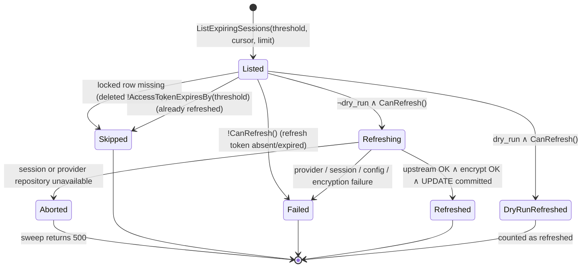
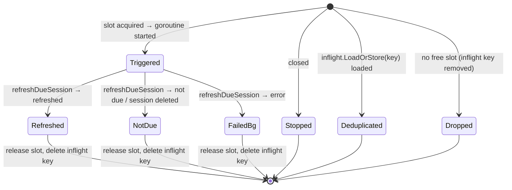

# Data Model: Proactive Token Refresh

**Feature**: `029-proactive-token-refresh` | **Date**: 2026-10-08 | **Research**: [research.md](research.md)

The feature adds no table, no column, and no new persisted entity. It adds:
- one index,
- one predicate on the existing `UserSession` aggregate,
- request and result value objects for the sweep,
- one trigger enumeration,
- one in-memory, process-scoped component, `backgroundRefresher`.

Interface signatures are in [contracts/ports.md](contracts/ports.md).

## Existing entity: `UserSession` (aggregate root)

**Location**: `internal/domain/storage/user_session.go:15-46` | **Table**: `user_sessions` (`migrations/004_create_user_sessions.up.sql`)

The fields this feature reads and writes are unchanged (spec "Key Entities"):

| Field | Type | Read by | Written by |
|---|---|---|---|
| `ID` | `id.SessionID` (UUID v4) | sweep cursor, logs | — |
| `Principal` | `id.Principal` | lock key, singleflight key | — (never logged) |
| `ServiceID` | `id.ServiceID` | provider lookup, encryption context, logs | — |
| `EncryptedAccessToken` | `[]byte` | `DecryptAccessToken` | `setSessionTokens` (all triggers) |
| `EncryptedRefreshToken` | `[]byte` | `DecryptRefreshToken`, `CanRefresh` | `setSessionTokens` when the provider rotates it |
| `AccessTokenExpiresAt` | `*time.Time` | `AccessTokenExpiresBy`, sweep query | `setSessionTokens` |
| `RefreshTokenExpiresAt` | `*time.Time` | `CanRefresh` | — (unchanged; current behavior, out of scope) |
| `UpdatedAt` | `time.Time` | — | `setSessionTokens` |

### New predicate

```go
// AccessTokenExpiresBy reports whether the access token's recorded expiry is at or before t.
// A session without an access-token expiry never expires and is never due (FR-013).
func (s *UserSession) AccessTokenExpiresBy(t time.Time) bool
```

| `AccessTokenExpiresAt` | `t` | Result |
|---|---|---|
| `nil` | any | `false` |
| `2026-10-08T12:00Z` | `11:59:59Z` | `false` |
| `2026-10-08T12:00Z` | `12:00:00Z` | `true` (boundary inclusive, matches `HasValidAccessToken` = `now.Before(exp)`) |
| `2026-10-08T12:00Z` | `12:00:01Z` | `true` |

Invariant: `AccessTokenExpiresBy(now) == !HasValidAccessToken()` for every session evaluated at the
same `now`. The unit test asserts this equivalence so the on-demand path's behavior does not change
when the lock callback switches predicates.

### New index

`idx_user_sessions_access_token_expires_at` is a plain B-tree index on
`user_sessions (access_token_expires_at)`. It serves `ListExpiringSessions` (DB-003, SC-006).
ADR 039 accepts a named non-atomic exception for the concurrent index. The guarded migration `036` and its PostgreSQL recovery tests pass (research R4).

## New enumeration: `RefreshTrigger`

**Location**: `internal/domain/oauth2session/refresh_trigger.go`

```go
type RefreshTrigger string

const (
    RefreshTriggerOnDemand   RefreshTrigger = "on-demand"   // read path, expired token; also ForceRefreshSession
    RefreshTriggerBackground RefreshTrigger = "background"  // read path, token inside lookahead window
    RefreshTriggerSweep      RefreshTrigger = "sweep"       // admin sweep
)
```

These are the exact `triggered_by` values for logs and metric attributes (NFR-001, NFR-004). The
string values follow the spec text literally.

## New value object: `SweepRequest`

**Location**: `internal/domain/oauth2session/sweep.go`

| Field | Type | Zero value means | Validation (domain) |
|---|---|---|---|
| `Lookahead` | `time.Duration` | use `token_refresh.lookahead_duration` | after defaulting: `> 0` |
| `DryRun` | `bool` | real sweep | — |
| `PageSize` | `int` | use `token_refresh.sweep.default_page_size` | after defaulting: `1 ≤ n ≤ 1000` |

The handler sends `Lookahead = 0` only when the field is absent. An explicit `PT0S` is rejected at
the HTTP boundary, because the parser requires a value `> 0`, so the two cases stay distinct.
A violation returns an error that wraps `ErrInvalidSweepRequest`, and the handler maps it to `400`.

## New value object: `SweepResult`

**Location**: `internal/domain/oauth2session/sweep.go` | **Wire form**: `SessionSweepResult` in [contracts/admin-session-sweep.openapi.yaml](contracts/admin-session-sweep.openapi.yaml)

| Field | Type | Meaning |
|---|---|---|
| `Refreshed` | `int` | Candidates refreshed. In dry-run mode: candidates that would be refreshed (lock-free evaluation shows them due and `CanRefresh`). |
| `Skipped` | `int` | Candidates that no longer required action when evaluated: not due under the lock (refreshed concurrently by another trigger or replica), or deleted mid-sweep. |
| `Failed` | `int` | Candidates that required action but could not be refreshed: no usable refresh token, upstream error, provider misconfiguration, or encryption failure. |
| `TotalEvaluated` | `int` | Candidates returned by `ListExpiringSessions` and evaluated. |
| `DryRun` | `bool` | Echo of the effective `DryRun`. |
| `EffectiveLookahead` | `time.Duration` | Resolved lookahead after configuration defaults; used only in the operator audit. |
| `EffectivePageSize` | `int` | Resolved page size after configuration defaults; used only in the operator audit. |

Only the first five fields appear in the HTTP `SessionSweepResult` response. The two effective controls remain internal metadata.

**Invariant** (SC-004): `Refreshed + Skipped + Failed == TotalEvaluated`. Each listed candidate is
classified exactly once. Sessions that `ListExpiringSessions` never returns (healthy, `NULL` expiry,
or past the cursor) contribute to no count.

## Sweep candidate classification (state transitions)

Each candidate goes through one evaluation. The real sweep evaluates under the row lock
(`WithLockedSession`). The dry run evaluates the listed snapshot without a lock and without upstream
calls.



The full outcome table, with log levels, is in research R11. A `Failed` candidate leaves the stored
row byte-for-byte unchanged, because the locked callback returns `false` and there is no partial
write (US2-S3, US3-S2).

**Sweep threshold**: `threshold = sweepStart + effectiveLookahead`, computed once. It is used for
both the query and the locked re-check, so a candidate's classification never depends on how long
the sweep has run.

**Cursor progression**: `cursor₀ = id.SessionID{}` (zero UUID). `cursorₙ₊₁ = page[len(page)-1].ID`.
The sweep stops when `len(page) < limit`, or when it is aborted or cancelled. The cursor strictly
increases, so the sweep terminates (research R3).

## New process-scoped component: `backgroundRefresher`

**Location**: `internal/domain/oauth2session/background_refresh.go` (unexported, owned by `OAuth2SessionService`)

| State | Type | Purpose |
|---|---|---|
| `slots` | `chan struct{}` (cap = `background_workers`) | Concurrency bound. Non-blocking acquire. |
| `inflight` | `sync.Map[string]struct{}` | Per-process dedup by `principal|serviceID`, checked before slot acquisition. |
| `baseCtx`, `cancel` | `context.Context`, `context.CancelFunc` | Parent of every flight. Cancelled only after the drain deadline. |
| `wg` | `sync.WaitGroup` | Join point for `Close`. |
| `closed` | `atomic.Bool` | Rejects submissions after `Close` begins. |
| `closeOnce` | `sync.Once` | Makes `Close` idempotent. |

**Submission outcomes** (one per `submit` call):



| Outcome | Counter | Log |
|---|---|---|
| `Triggered` | `proactive_refresh_triggered_total{triggered_by=background}` +1 | DEBUG |
| `Dropped` | `proactive_refresh_dropped_total{triggered_by=background}` +1 | WARN (NFR-002): `service_id`, `session_id` |
| `Deduplicated` | — | DEBUG |
| `Stopped` | — | DEBUG |
| `Refreshed` | — | INFO `session.oauth2.token_refreshed` with `triggered_by=background` (NFR-001) |
| `NotDue` | — | DEBUG |
| `FailedBg` | `proactive_refresh_failed_total{triggered_by=background}` +1 | Per research R11 (WARN or ERROR) |

**Lifecycle**: Constructed in `NewOAuth2SessionService`. It has no long-lived goroutines. Goroutines
exist only while a flight runs. `Close(ctx)`: set `closed` → `wg.Wait()` racing `ctx.Done()` →
`cancel()` → return `nil` or `ctx.Err()` (research R7).

**Plaintext scope** (SR-003): flights return `*storage.UserSession` (ciphertext only). The plaintext
refresh token lives only in `refreshSessionTokens` locals. A background flight never decrypts the
access token.

## Domain event: `SessionTokensRefreshed`

The broker records this domain event as the structured `session.oauth2.token_refreshed` log.
There is no event bus. After a locked update commits, the log contains:

| Attribute | Value |
|---|---|
| `event` | `session.oauth2.token_refreshed` (unchanged) |
| `session_id` | `UserSession.ID` (new) |
| `service_id` | unchanged |
| `triggered_by` | `RefreshTrigger` (new) |
| `public_client` | unchanged |

The log does not contain `principal` (NFR-001). The existing
`service_refresh_concurrency_test.go:235-275` test checks that success is logged after commit.
Extend that test to cover all three triggers.

## Configuration entity: `TokenRefreshConfig`

**Location**: `internal/ports/config.go` (new top-level section `token_refresh`).
The complete file, environment, CLI, and Helm contract is in [contracts/configuration.md](contracts/configuration.md).

```go
type TokenRefreshConfig struct {
    LookaheadDuration time.Duration           `mapstructure:"lookahead_duration"`
    BackgroundWorkers int                     `mapstructure:"background_workers"`
    Sweep             TokenRefreshSweepConfig `mapstructure:"sweep"`
}

type TokenRefreshSweepConfig struct {
    DefaultPageSize int `mapstructure:"default_page_size"`
}
```

It flows to `oauth2session.Config` as `RefreshLookahead`, `BackgroundRefreshWorkers`, and
`SweepDefaultPageSize` through `NewConfigFromPorts`. That function gains a `ports.TokenRefreshConfig`
parameter, and every caller must be updated, confirmed with `lsp references` during implementation.

## Glossary additions (ARCHITECTURE.md, Principle V)

| Term | Definition | Relationships |
|---|---|---|
| **Refresh Lookahead Window** | The interval before access-token expiry, `token_refresh.lookahead_duration`, in which a token is still served but is refreshed proactively. | Evaluated on `UserSession.AccessTokenExpiresAt`; drives Proactive Refresh and the default Session Sweep window. |
| **Proactive Refresh** | A non-blocking background refresh of a `UserSession`, triggered when token exchange serves a token inside the Refresh Lookahead Window. It is bounded per replica and dropped on saturation. | Shares per-replica deduplication with on-demand refresh; persists through the locked session update. |
| **Session Sweep** | An admin-triggered, externally scheduled pass that refreshes every `UserSession` whose access token expires within a lookahead window, in keyset pages. | Produces a `SweepResult`; scheduled by an operator CronJob. |
| **SweepRequest** | The input value object for a Session Sweep: lookahead, dry-run flag, and page size. | Applies the configured defaults and validation before the sweep evaluates a `UserSession`. |
| **SweepResult** | The value object summarizing a Session Sweep: `refreshed`, `skipped`, `failed`, `total_evaluated`, `dry_run`. | `refreshed + skipped + failed = total_evaluated`. |
| **RefreshTrigger** | The origin of a token refresh: `on-demand`, `background`, or `sweep`. Recorded as `triggered_by`. | Attribute of `SessionTokensRefreshed` and the refresh counters. |
| **SessionTokensRefreshed** | The structured event recorded after a token refresh commits. | Records the `UserSession` ID, service ID, and `RefreshTrigger` without a user principal. |
