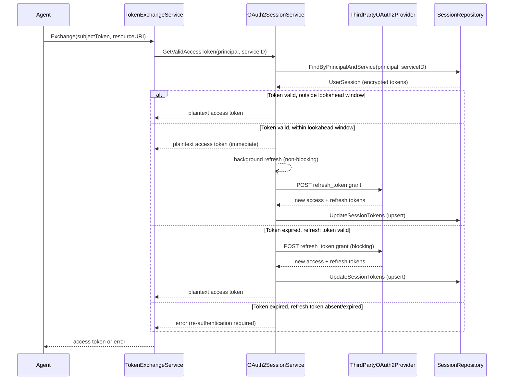
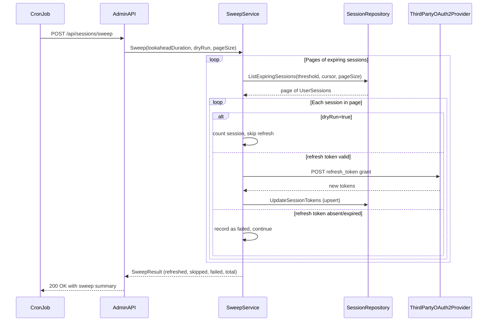

# Feature Specification: Proactive Token Refresh

**Feature Branch**: `029-proactive-token-refresh`  
**Created**: 2026-05-07  
**Status**: Draft  
**Input**: User description: "Refresh and access token from the third-party services per user never refreshed. The refresh of these tokens happens only on the read path when its are loaded / inspected. As a problem it causes extra latency for latency sensitive token exchange operation. It is required to solve the problem for (a) active ongoing sessions in stateless, no-coordination mode; (b) inactive sessions within the admin process (refresh process has to be scoped)"

## Clarifications

### Session 2026-05-07

- Q: What is the deduplication scope for background refresh — per-replica or cross-replica? → A: Per-replica (`singleflight` within each process); cross-replica concurrent refreshes for the same session are safe due to idempotent upsert semantics, consistent with the stateless no-coordination constraint.
- Q: Should background refresh goroutines be bounded or unbounded? → A: Bounded worker pool with configurable concurrency limit (default: 10); excess proactive refresh requests are dropped silently — the caller already received a valid token, so a dropped refresh is safe.
- Q: What observability signals are required? → A: Structured log events (INFO on success, WARN on dropped/failed, ERROR on infrastructure failures) plus OpenTelemetry `Int64` counters emitted through the existing telemetry pipeline — no Prometheus registry, no `/metrics` endpoint, and no `/health` counter surface: `proactive_refresh_triggered_total`, `proactive_refresh_dropped_total`, `proactive_refresh_failed_total`, `session_sweep_refreshed_total`, `session_sweep_failed_total`.
- Q: Is `lookahead_duration` required or optional in the sweep request body? → A: Optional — omitting it uses the server-configured `token_refresh.lookahead_duration` default; callers may override it for wider ad-hoc sweeps.
- Q: What HTTP status code should the sweep return when all per-session refreshes fail? → A: `200 OK` always when the sweep itself completed (even if every session failed); `5xx` is reserved for infrastructure failures such as database unavailability or handler panics.

## User Scenarios & Testing *(mandatory)*

### User Story 1 - Zero-Latency Token Exchange for Active Users (Priority: P1)

An AI agent performs a token exchange during an active user session. The user's third-party access token was recently issued and is well within its validity window, so the exchange completes immediately without any upstream OAuth2 refresh round-trip.

When the token is approaching expiry (within a configurable lookahead window), the system proactively refreshes it in the background while still returning the current valid token to the caller. The next exchange request after the background refresh finds a fresh token ready in storage with no blocking wait.

**Why this priority**: This is the primary latency-sensitive hot path. An AI agent token exchange must complete quickly. Any synchronous upstream OAuth2 call on the critical path causes user-visible delay. Solving this first delivers the core value of the feature.

**Independent Test**: Can be fully tested by performing a token exchange request when the stored access token is valid but within the lookahead window, and verifying that: (1) the exchange response completes before the mocked background refresh is allowed to finish, and (2) the stored session is eventually updated with fresh tokens without a second request triggering the refresh.

**Acceptance Scenarios**:

1. **Given** a user session whose access token expires in more than the lookahead threshold, **When** an agent requests a token exchange, **Then** the exchange completes without calling the upstream OAuth2 provider and the request returns without waiting on any refresh attempt.
2. **Given** a user session whose access token expires within the lookahead threshold but has not yet expired, **When** an agent requests a token exchange, **Then** the exchange returns the current valid token in the same request AND a background refresh is triggered that updates the stored session before the original token expires.
3. **Given** a background refresh is already in progress for a session, **When** a second token exchange request arrives for the same session, **Then** the second request returns without waiting for that refresh to finish and without triggering a duplicate upstream refresh call.

---

### User Story 2 - Expired Session Refresh Without User Interruption (Priority: P1)

An AI agent attempts a token exchange for a user whose access token has already expired but whose refresh token is still valid. Rather than failing the request or prompting user re-authentication, the system transparently refreshes the session using the stored refresh token and returns the newly issued access token.

**Why this priority**: Tied in priority with Story 1 — this is the other half of the on-demand path. Without it, agents silently fail when tokens expire between requests. The feature description explicitly requires this to work on the read path as the baseline.

**Independent Test**: Can be fully tested by directly expiring a stored session's access token (leaving the refresh token valid) and verifying that a token exchange request succeeds and returns a fresh access token.

**Acceptance Scenarios**:

1. **Given** a user session whose access token has expired and whose refresh token is valid, **When** an agent requests a token exchange, **Then** the system refreshes the session using the refresh token and returns a fresh access token without error.
2. **Given** a user session whose access token and refresh token have both expired, **When** an agent requests a token exchange, **Then** the system returns an error indicating re-authentication is required (no silent failure or partial token returned).
3. **Given** the upstream OAuth2 provider returns an error during refresh (e.g., refresh token revoked), **When** an agent requests a token exchange, **Then** the system returns a clear error and does not store any partial state.

---

### User Story 3 - Admin-Triggered Sweep of Expiring Sessions (Priority: P2)

An operator (or a Kubernetes CronJob acting on behalf of operations) calls an administrative endpoint to proactively refresh all sessions whose access tokens are expiring within a configurable time window. The sweep operates across all principals and services in the system. The process is scoped: it processes only sessions below the expiry threshold and skips healthy sessions.

The endpoint is stateless from the broker's perspective — no internal scheduler or distributed lock is required. The coordination responsibility is delegated to the external trigger (the CronJob). Concurrent invocations from multiple broker replicas are safe because session upserts are idempotent.

**Why this priority**: This covers the inactive session population that Story 1 and 2 cannot reach (no agent is actively requesting tokens for those users). It requires an admin API addition, which has higher coordination cost (API-first requirement) and more operational setup.

**Independent Test**: Can be fully tested by seeding the database with sessions at various expiry states, calling the sweep endpoint, and verifying that only sessions within the threshold were refreshed and others were left unchanged.

**Acceptance Scenarios**:

1. **Given** the admin sweep endpoint is called with a lookahead window, **When** there are sessions expiring within the window and sessions not expiring within the window, **Then** only the expiring sessions are candidates for the sweep and sessions outside the window do not contribute to `refreshed`, `skipped`, or `failed` counts.
2. **Given** a session's refresh token has expired (cannot be refreshed), **When** the sweep processes that session, **Then** the sweep does not refresh the session and records it as a failure — distinct from skipped candidates that no longer require work at evaluation time — in the response summary, and continues processing remaining sessions.
3. **Given** multiple broker replicas simultaneously receive the sweep request (e.g., CronJob hits a load balancer), **When** both replicas process the same session concurrently, **Then** the final stored session is valid and no data corruption occurs (idempotent upsert).
4. **Given** the sweep endpoint is called with `dry_run: true` in the request body, **When** there are sessions that would be refreshed, **Then** the response returns the count of sessions that would be refreshed but no actual refresh calls are made to upstream providers.

---

### Edge Cases

- What happens when the upstream OAuth2 provider is unavailable during a background proactive refresh? The background refresh MUST fail silently (log the error), leave the existing token in place, and not affect the current exchange response which already returned a valid token.
- What happens when all refresh tokens for a given third-party service have expired (e.g., service revoked all tokens)? The sweep MUST report this as a recoverable per-session failure, not abort the entire sweep. Sessions requiring re-authentication are left intact.
- What happens when a session is deleted (user revoked consent) while a background refresh is in progress? The refresh MUST detect the missing session on upsert and discard the result without error.
- What happens if the sweep lookahead window is set to a very large value covering all sessions? The sweep MUST paginate its database queries to avoid loading the entire `user_sessions` table into memory at once.
- What happens if an access token has no expiry set (`access_token_expires_at IS NULL`)? The system treats it as perpetually valid — neither background refresh nor sweep will act on it.

## Requirements *(mandatory)*

### Functional Requirements

- **FR-001**: When a token exchange is requested, the system MUST return the current valid access token without blocking if the token is not within the proactive refresh lookahead window.
- **FR-002**: When a token exchange is requested and the access token is within the configurable lookahead window but not yet expired, the system MUST return the current valid token immediately AND submit the session for background refresh via a bounded worker pool without the caller waiting. If the pool is at capacity, the proactive refresh for that session is silently dropped; the caller still receives the valid token.
- **FR-003**: Background refresh MUST use per-replica deduplication (`singleflight` within each broker process) — if a refresh is already in progress for a given session within the same process, subsequent requests for that session MUST NOT trigger additional upstream refresh calls. Cross-replica concurrent refreshes for the same session are permitted and are safe due to idempotent upsert semantics.
- **FR-004**: When a token exchange is requested and the access token has already expired, the system MUST attempt an on-demand synchronous refresh using the stored refresh token before returning a result.
- **FR-005**: When a refresh token is absent or expired, the system MUST return an error indicating re-authentication is required rather than attempting a refresh.
- **FR-006**: The admin server MUST expose an endpoint to trigger a sweep of sessions with access tokens expiring within a caller-specified lookahead duration.
- **FR-007**: The sweep endpoint MUST accept a `dry_run` request body parameter. When `dry_run: true`, it MUST report how many sessions would be refreshed without performing any upstream calls.
- **FR-008**: The sweep MUST process sessions in pages to prevent loading the entire session table into memory.
- **FR-009**: The sweep MUST be safe to invoke concurrently from multiple broker replicas — idempotent upsert semantics MUST ensure no data corruption from concurrent refreshes of the same session.
- **FR-010**: The sweep MUST report a per-sweep summary in its response: sessions refreshed, candidate sessions skipped because they no longer require action at evaluation time, sessions failed (refresh token expired or upstream error), and total sessions evaluated.
- **FR-011**: A failed refresh for one session during a sweep MUST NOT abort the sweep — the sweep MUST continue processing remaining sessions.
- **FR-012**: The proactive refresh lookahead window MUST be configurable via the standard configuration port. The default value is `5m`.
- **FR-013**: Sessions with no expiry set (`access_token_expires_at IS NULL`) MUST be excluded from both background proactive refresh and admin sweep processing.
- **FR-014**: The database MUST have an index on `access_token_expires_at` to support efficient sweep range queries.

### Domain Model

**Activity / Flow Diagram — On-Demand Path with Lookahead Refresh**:



**Activity / Flow Diagram — Admin Sweep Path**:



**Domain Events** (state changes of business significance):
- **SessionTokensRefreshed**: Emitted when a session's access and refresh tokens are successfully updated, whether triggered proactively, on-demand, or by sweep. Contains `sessionID`, `principal`, `serviceID`, `triggeredBy` (background, on-demand, sweep).

### Configuration Requirements

**Configuration Parameters**:
- **`token_refresh.lookahead_duration`**: Duration, the time before access token expiry at which proactive background refresh is triggered. Default: `5m`.
- **`token_refresh.background_workers`**: Integer, maximum number of concurrent background refresh goroutines per broker replica. Excess proactive refresh requests are dropped silently. Default: `10`.
- **`token_refresh.sweep.default_page_size`**: Integer, number of sessions processed per page during an admin sweep. Default: `100`.

**Example YAML Configuration**:
```yaml
token_refresh:
  lookahead_duration: 5m
  background_workers: 10
  sweep:
    default_page_size: 100
```

**Configuration Location**: Will be added to `internal/ports/config.go` and `examples/config/third-party-oauth2.yaml`.

### API Requirements

- **API-001**: The admin sweep endpoint MUST be documented in `/api/admin/openapi.yaml`.
- **API-002**: `POST /api/sessions/sweep` — triggers the session sweep. Request body parameters are all optional: `lookahead_duration` (ISO 8601 duration string, e.g. `"PT5M"`; defaults to the server-configured `token_refresh.lookahead_duration` when omitted), `dry_run` (boolean, default `false`), and `page_size` (integer, default from `token_refresh.sweep.default_page_size`).
- **API-003**: The sweep response body MUST include: `refreshed` (integer), `skipped` (integer), `failed` (integer), `total_evaluated` (integer), and `dry_run` (boolean). When `dry_run=true`, sessions that would be refreshed MUST still be counted in `refreshed`; the broker simply skips upstream calls and persistence. `skipped` counts only evaluated candidates that no longer require action, not healthy sessions excluded by the repository query.
- **API-004**: The endpoint MUST return `200 OK` whenever the sweep process itself completes, regardless of per-session refresh outcomes — including the case where every session fails to refresh. The response body counts (`refreshed`, `failed`, `total_evaluated`) convey outcome to the caller. `500` is reserved for infrastructure failures (database unreachable, handler panic).
- **API-005**: The endpoint MUST be on the admin server (port 14000) and require administrative access enforced at the proxy level.

### Database Requirements

- **DB-001**: A new migration MUST add an index on `user_sessions(access_token_expires_at)` for efficient sweep range queries, using `CREATE INDEX CONCURRENTLY` with a `no-transaction` directive per AGENTS.md guidance.
- **DB-002**: The existing `user_sessions` table structure MUST NOT change. The initial session-creation path continues to use the existing upsert (`ON CONFLICT (principal, service_id) DO UPDATE`); the proactive/on-demand/sweep refresh paths persist new token material via an update-only operation (`UpdateTokensIfExists`) that is a no-op when the session row no longer exists, so a session deleted mid-refresh is never resurrected.
- **DB-003**: A new repository method `ListExpiringSessions(ctx, threshold time.Time, cursor id.SessionID, limit int) ([]*storage.UserSession, error)` MUST be added to `UserSessionRepository` port and implemented in both the in-memory and PostgreSQL adapters.

### Non-Functional Requirements

- **NFR-001**: The system MUST emit a structured log line at `INFO` level each time a session's tokens are successfully refreshed, including fields: `triggered_by` (background, on-demand, sweep), `service_id`, and session ID. Principal MUST be omitted or hashed to protect privacy.
- **NFR-002**: The system MUST emit a structured log line at `WARN` level when a proactive background refresh is dropped because the worker pool is at capacity, including `service_id` and session ID.
- **NFR-003**: The system MUST emit a structured log line at `WARN` level for each per-session failure during a sweep (refresh token expired, upstream error), and at `ERROR` level for infrastructure failures (database unreachable).
- **NFR-004**: The system MUST emit OpenTelemetry `Int64` counters through the existing telemetry pipeline (no Prometheus registry, no `/metrics` endpoint, and no `/health` counter surface): `proactive_refresh_triggered_total`, `proactive_refresh_dropped_total`, `proactive_refresh_failed_total`, `session_sweep_refreshed_total`, `session_sweep_failed_total`. Counters MUST be labeled with `triggered_by` where applicable.

### Security Requirements

- **SR-001**: Background refresh operations MUST encrypt newly issued tokens using the same encryption context (`{"service_id": "..."}`) before persisting. Plaintext tokens MUST never be written to storage.
- **SR-002**: The sweep endpoint MUST NOT expose token plaintext in its response. The response MUST contain only counts and status summaries.
- **SR-003**: Background goroutines performing token refresh MUST respect context cancellation (server shutdown) and MUST NOT hold references to decrypted tokens beyond the scope of a single refresh operation.
- **SR-004**: Upstream refresh calls MUST use the service's encrypted client secret, decrypted only at call time and not cached in memory.

### Key Entities

- **UserSession**: Existing entity. The refresh feature reads and updates `EncryptedAccessToken`, `EncryptedRefreshToken`, `AccessTokenExpiresAt`, `RefreshTokenExpiresAt`. No new fields required.
- **SweepResult**: Value object representing the outcome of a sweep operation: `{Refreshed int, Skipped int, Failed int, TotalEvaluated int, DryRun bool}`.

## Success Criteria *(mandatory)*

### Measurable Outcomes

- **SC-001**: Token exchange requests for sessions with valid, non-expiring access tokens complete with no upstream OAuth2 calls — measurable by observing zero upstream refresh calls in traces for healthy sessions.
- **SC-002**: Token exchange requests for sessions whose access token is near expiry (within the lookahead window) return the current token on the non-blocking fast path — measurable by asserting that the response is returned before the mocked background refresh completes, and that the request path makes zero blocking upstream OAuth2 calls.
- **SC-003**: No duplicate upstream refresh calls occur for the same session under concurrent token exchange load — measurable by verifying at most one refresh call per session per lookahead window.
- **SC-004**: The admin sweep endpoint processes all sessions expiring within the configured window and returns a correct summary — measurable by asserting that `refreshed + skipped + failed = total_evaluated` and that healthy sessions excluded by the repository query do not appear in those counts.
- **SC-005**: The admin sweep can be invoked concurrently from multiple broker replicas without producing corrupted session state — the final stored tokens are always consistent.
- **SC-006**: An infra-backed PostgreSQL verification of `ListExpiringSessions(...)` shows that the sweep query uses the `access_token_expires_at` index under normal operation.

## Assumptions

- The upstream OAuth2 provider supports the `refresh_token` grant type (RFC 6749 §6). Sessions for providers that do not issue refresh tokens will not benefit from this feature and will continue to require re-authentication on expiry.
- The Kubernetes CronJob is responsible for scheduling and coordinating the admin sweep. The broker provides the endpoint but does not manage scheduling internally.
- The default lookahead window of 5 minutes is sufficient for typical access token lifetimes (usually 1 hour). Operators can adjust via configuration if upstream providers issue short-lived tokens.
- The `page_size` default of 100 sessions per sweep page is conservative. Operators can increase it via the request body if their session volume warrants it.
