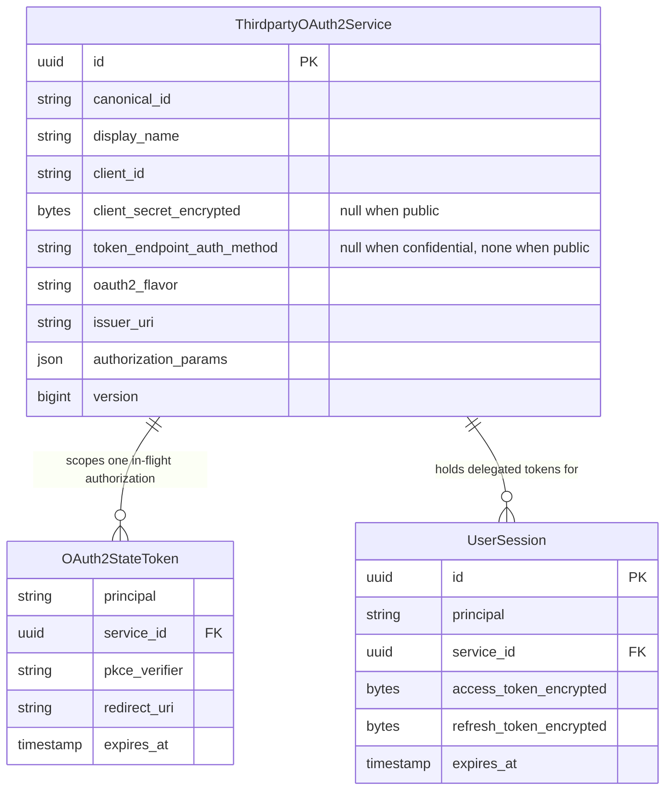
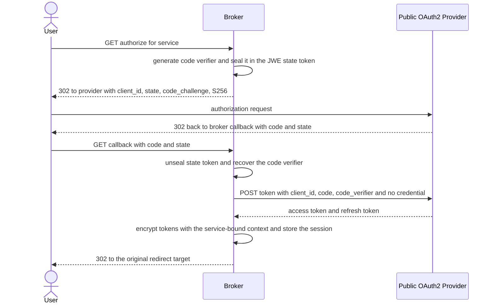
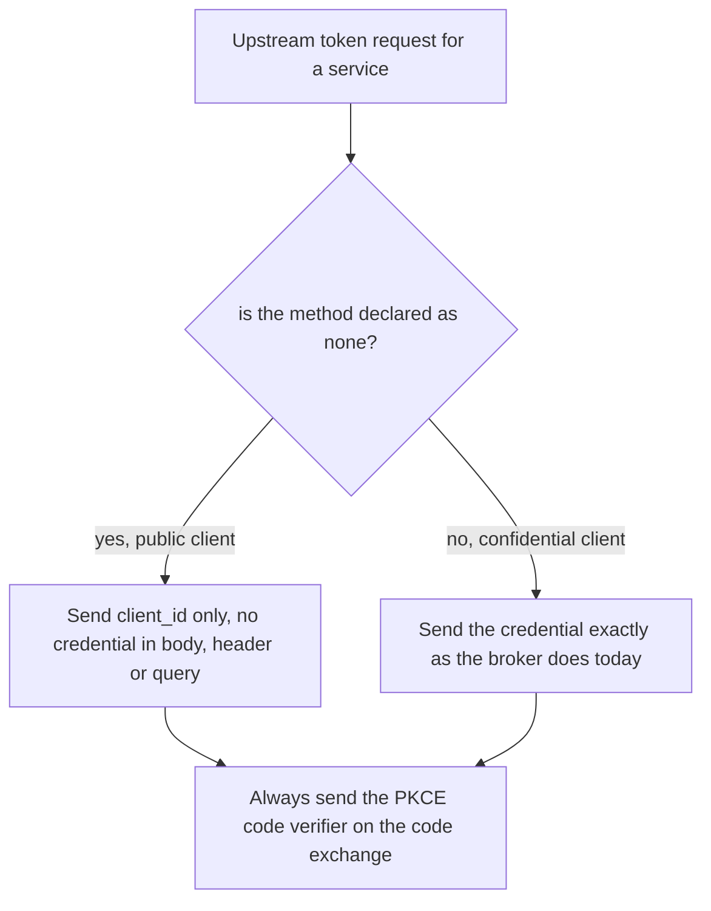

# Feature Specification: Public Client Support for Third-Party OAuth2 Services

**Feature Branch**: `042-thirdparty-public-pkce`

**Created**: 2026-09-10

**Status**: Draft

**Input**: User description: "thirdparty services currently only support confidential upstream clients. however there is upstream/ vendor-specific auth providers that only support creating public PKCE clients and dont issue client secrets. The AIB thirdparty service model needs to be extended to also support public client configuration with `token_endpoint_auth_method: "none"` and Authorization Code Flow with PKCE (Proof Key for Code Exchange) to securely authenticate and acquire access tokens for thirdparty services that dont support confidential client creations."

## Context: What Already Exists

The broker **already** performs Authorization Code Flow with PKCE against every third-party
provider. On flow initiation it generates a code verifier, seals it inside the JWE state token,
and sends `code_challenge` with `code_challenge_method=S256` on the upstream authorization
request; on callback it sends `code_verifier` on the token request.

The gap is **client authentication at the upstream token endpoint**, not PKCE. Today a
third-party service cannot exist without a client secret: registration rejects an empty
`client_secret`, the secret column is non-nullable, and every upstream token request
(authorization-code exchange and refresh) transmits a client credential. A provider that issues
public clients only — no secret at all — cannot be onboarded.

This feature adds one optional attribute to a third-party service, `token_endpoint_auth_method`,
whose only value is `none`. Declaring it makes the service a public client: no credential is stored
and none is ever sent upstream. Leaving it absent keeps the service confidential and its upstream
requests byte-identical to today's. The already-present PKCE behavior becomes a hard, non-optional
invariant rather than an incidental one.

## Clarifications

### Session 2026-09-10

- Q: When updating an existing public service, should omitting `token_endpoint_auth_method` reject the request or preserve the stored public status? → A: Full replacement — omission makes the updated service confidential, so the request is rejected unless it re-declares `none` or supplies a client secret. The stored value is never carried over implicitly.
- Q: Should an explicit `null` for `token_endpoint_auth_method` be rejected on create and update? → A: No. Accept it as equivalent to omission. The read representation reports `null` for a confidential service, so rejecting it would break the ordinary read-modify-write round trip while buying no disambiguation: `null` and absence are the only two spellings of "confidential" and neither can mean anything else. Decided during `/speckit-plan`, amending API-003.

## User Scenarios & Testing *(mandatory)*

### User Story 1 - Register a public third-party service without a client secret (Priority: P1)

An operator onboards an upstream provider that only supports public clients. The provider issued
a client identifier but no secret. The operator registers the service through the administrative
API, declaring that the upstream token endpoint expects no client authentication, and supplies no
credential at all. The registration succeeds and the service appears in the service catalogue,
clearly marked as a public client.

**Why this priority**: Without this, an operator cannot represent the provider at all. Every other
capability in this feature depends on the service record existing. This story alone is a viable
increment: it unblocks configuration and makes the previously impossible provider representable.

**Independent Test**: Register a service declaring the token endpoint authentication method `none`
and no credential, then read it back from the service catalogue and confirm it is stored, marked
public, and reports no credential. Delivers a durable, reviewable configuration record even before
any user authorizes against it.

**Acceptance Scenarios**:

1. **Given** an operator with administrative access, **When** they register a third-party service
   declaring the token endpoint authentication method `none`, providing a client identifier and no
   client secret, **Then** the service is created and returned with the method `none` and no
   credential value.
2. **Given** an operator registering a service with the token endpoint authentication method
   `none`, **When** they also supply a client secret, **Then** the registration is rejected with a
   validation error identifying the contradiction, and no service is created.
3. **Given** an operator registering a service, **When** they omit the token endpoint
   authentication method entirely, **Then** the service is created as a confidential client whose
   upstream client authentication is negotiated exactly as it is today, and the existing
   client-secret requirement still applies.
4. **Given** an operator registering a confidential service, **When** they supply an empty or
   missing client secret, **Then** the registration is rejected exactly as it is today.
5. **Given** an operator registering a service whose provider variant derives its identity from the
   credential itself, **When** they declare the token endpoint authentication method `none`,
   **Then** the registration is rejected with an error naming the incompatible provider variant.
6. **Given** a catalogue containing both public and confidential services, **When** an operator
   lists services, **Then** each entry reports its token endpoint authentication method, and
   public entries report no credential rather than a redacted placeholder.

---

### User Story 2 - Authorize a user against a public-client provider (Priority: P2)

A user connects their account at a public-client provider. The broker redirects them to the
provider with a PKCE challenge, the user approves, and the broker exchanges the returned
authorization code for tokens by proving possession of the code verifier only — sending no client
secret in the request body and no credential in an authorization header. The provider, which
rejects any request carrying client credentials, accepts the exchange and the broker stores an
encrypted session.

**Why this priority**: This is the value delivery of the feature — a user actually obtaining
upstream access through a provider that cannot issue secrets. It depends only on Story 1.

**Independent Test**: With a public service registered, run the full connect journey against an
upstream that rejects requests carrying client credentials and requires a valid code verifier.
Confirm a usable session is created and that the captured token request carried the client
identifier and code verifier but no credential of any kind.

**Acceptance Scenarios**:

1. **Given** a registered public-client service, **When** a user initiates the connect flow,
   **Then** the upstream authorization redirect carries `code_challenge` and
   `code_challenge_method=S256`.
2. **Given** a user returning from a public-client provider with a valid authorization code,
   **When** the broker exchanges the code, **Then** the token request carries the client
   identifier and the code verifier and carries no client secret in the request body.
3. **Given** a user returning from a public-client provider with a valid authorization code,
   **When** the broker exchanges the code, **Then** the token request carries no credential in an
   authorization header, including no header with an empty password.
4. **Given** a successful public-client code exchange, **When** the flow completes, **Then** an
   encrypted session is stored for the user and service exactly as for a confidential service.
5. **Given** a public-client provider that rejects the exchange, **When** the broker retries,
   **Then** no retry attempt adds a client credential, and the flow fails closed with an error to
   the user.
6. **Given** a registered confidential service, **When** a user completes the connect flow, **Then**
   the token request carries the client credential exactly as it does today and the flow succeeds
   unchanged.

---

### User Story 3 - Keep a public-client session alive (Priority: P3)

A user's access token for a public-client provider expires. The broker refreshes it using the
stored refresh token, again presenting only the client identifier and no credential. The refreshed
tokens replace the stored ones and the user's agent continues working without re-authorization.

**Why this priority**: Sessions are short-lived; without refresh, a public-client integration
degrades into repeated re-authorization. It is lower priority than Stories 1 and 2 because a
usable, if shorter-lived, session already exists after Story 2.

**Independent Test**: Force expiry of a stored public-client session, trigger a refresh, and
confirm new tokens are obtained and persisted while the captured refresh request carried no
client credential.

**Acceptance Scenarios**:

1. **Given** an expired access token on a public-client service session, **When** the broker
   refreshes it, **Then** the refresh request carries the client identifier and refresh token and
   carries no client secret.
2. **Given** a successful public-client refresh, **When** the response is processed, **Then** the
   new tokens are encrypted and persisted, replacing the previous ones.
3. **Given** an expired access token on a confidential service session, **When** the broker
   refreshes it, **Then** the request carries the client credential exactly as it does today and
   succeeds unchanged.
4. **Given** a public-client provider that rejects a refresh, **When** the refresh fails, **Then**
   the broker does not retry with a credential and surfaces the failure without silently
   downgrading the session.

---

### User Story 4 - Change an existing service between public and confidential (Priority: P4)

A provider changes what it supports, or an operator corrects a misconfiguration. The operator
switches an existing service from confidential to public, or back. When a service becomes public,
its stored credential is removed rather than left dormant. When a service becomes confidential, a
credential must be supplied in the same request.

**Why this priority**: A correction path, not a primary journey. Operators can otherwise delete and
re-register. It matters because a dormant stored credential on a service the broker now treats as
public is a latent secret with no owner.

**Independent Test**: Update a confidential service to declare `none` with no credential,
confirm the stored credential is gone, then update it back and confirm the update is rejected
unless a credential is supplied.

**Acceptance Scenarios**:

1. **Given** an existing confidential service with a stored credential, **When** an operator
   updates it declaring `none` and supplying no credential, **Then** the update succeeds and the
   stored credential is removed.
2. **Given** an existing public service, **When** an operator updates it without declaring `none`
   and without supplying a credential, **Then** the update is rejected and the service remains
   public with its previous configuration intact.
3. **Given** an existing public service, **When** an operator updates it without declaring `none`
   and supplies a credential, **Then** the update succeeds, the service becomes confidential, and
   subsequent upstream token requests carry that credential.
4. **Given** an existing public service, **When** an operator updates it declaring `none` and
   changing only its display name, **Then** the update succeeds and the service remains public with
   no credential.
5. **Given** an existing service with active user sessions, **When** it changes between public and
   confidential, **Then** stored sessions remain valid and the next refresh uses the new setting.
6. **Given** an operator who reads a confidential service and submits the representation back with
   one field changed, **When** the request carries `token_endpoint_auth_method` as the `null` the
   read returned, **Then** the update succeeds and the service remains confidential, identically to
   omitting the property.

---

### Edge Cases

- An operator supplies a client secret together with `none`: rejected at validation,
  never silently ignored, so a credential can never be stored under a service the broker treats as
  public.
- An operator supplies an unrecognized token endpoint authentication method value: rejected with
  the accepted value named, rather than ignored or defaulted.
- A public-client provider still returns an error demanding client authentication: the flow fails
  with the upstream error surfaced; the broker never opportunistically re-sends with a credential.
- A confidential provider that accepts credentials only in an authorization header: it keeps
  working untouched, because a service that declares no method keeps today's negotiation behavior.
- An operator updates a public service's display name and forgets to re-declare `none`: the update
  is rejected for a missing client secret rather than silently converting the service, matching how
  the update operation already requires the credential to be re-sent on every change.
- An existing service predating this feature is read after upgrade: it behaves exactly as before,
  with no operator action required.
- A public service exists and an operator attempts to roll the schema back: the rollback refuses
  rather than deleting services or fabricating credentials.
- A public service is registered with a provider variant that derives client identity from the
  credential document: rejected, because there is no credential to derive identity from.
- A public service is registered without a client identifier: rejected, because the client
  identifier is the only identity the broker presents upstream.
- Two services share the same upstream provider, one public and one confidential: each
  authenticates according to its own setting; neither influences the other.

## Requirements *(mandatory)*

### Functional Requirements

**Service model**

- **FR-001**: A third-party OAuth2 service MUST carry an optional token endpoint authentication
  method attribute. Its only accepted value is `none`, declaring the service a public client whose
  upstream token endpoint expects no client authentication.
- **FR-002**: Any value other than `none` MUST be rejected with an error naming the accepted value.
- **FR-003**: The attribute MUST have no default. When it is absent — or explicitly `null`, which
  means the same thing — the service is a confidential client and the broker MUST authenticate to
  the upstream token endpoint exactly as it does today, including today's negotiation of the
  credential channel. A value is never inferred, assigned, or persisted on the operator's behalf,
  and `null` is stored as absence rather than as a value.
- **FR-004**: A service declaring `none` MUST be registrable and updatable without a `client_secret`.
      Omitting `client_secret`, sending `null`, and sending an empty string each convey no credential
      and MUST be accepted.
- **FR-005**: A service declaring `none` MUST be rejected if a client secret is supplied, rather
  than storing or ignoring it. "Supplied" means a non-empty credential value; an empty string is not
  a credential and is treated as no credential, consistently with how an absent property is treated.
- **FR-006**: A confidential service — one declaring no method — MUST continue to require a
  non-empty client secret on registration and on update, unchanged from current behavior.
- **FR-007**: `none` MUST be rejected for a provider variant that derives the client identifier
  from the credential itself, because such a service would have no identity to present upstream.
  The error MUST name the variant.
- **FR-008**: A service declaring `none` MUST still require a client identifier.
- **FR-009**: Reading, listing, or resolving a service declaring `none` MUST succeed and MUST NOT
  report an error, warning, or degraded state on account of the absent credential.

**Upstream authorization and token acquisition**

- **FR-010**: Every third-party authorization request MUST include `code_challenge` and
  `code_challenge_method=S256`, for public and confidential services alike. This MUST NOT be
  configurable or disableable.
- **FR-011**: Every third-party authorization-code exchange MUST include the code verifier bound to
  that flow through the sealed state token.
- **FR-012**: For a service declaring `none`, the authorization-code exchange MUST carry the client
  identifier and code verifier and MUST NOT carry a client secret in the request body.
- **FR-013**: For a service declaring `none`, the authorization-code exchange MUST NOT carry any
  credential in an authorization header, including a header conveying an empty password.
- **FR-014**: For a service declaring `none`, the refresh request MUST carry the client identifier
  and refresh token and MUST NOT carry a client secret in the request body or an authorization
  header.
- **FR-015**: For a service declaring `none`, the broker MUST NOT probe, auto-detect, or fall back
  to any credentialed request after an upstream failure.
- **FR-016**: Retries of a failed token request MUST preserve the request's authentication
  behavior. A retry MUST NOT add, remove, or alter client credentials.
- **FR-017**: For a confidential service, upstream authorization, code exchange, and refresh
  requests MUST be byte-identical to those the broker sends today.
- **FR-018**: Provider authorization parameters configured on a service MUST continue to be applied
  to the authorization request, the code exchange, and the refresh request, unchanged for public
  and confidential services alike.

**Lifecycle and compatibility**

- **FR-019**: The administrative update operation replaces the service representation in full, as
  it does today. The token endpoint authentication method is therefore evaluated from the request
  alone: `none` means the updated service is public, while absent or `null` means it is
  confidential. The stored value MUST NOT be carried over implicitly.
- **FR-020**: Updating a confidential service to `none` MUST remove the stored credential, leaving
  no dormant secret associated with the service.
- **FR-021**: Updating a public service without declaring `none` — whether by omitting the
  property or sending `null` — MUST be treated as a request to make it confidential and MUST
  therefore be rejected unless the request also supplies a client secret. A public service can never
  silently acquire or lose its public status through omission.
- **FR-022**: Changing whether a service is public MUST NOT invalidate stored user sessions for
  that service; the next upstream token request MUST use the new setting.
- **FR-023**: Services registered before this feature MUST continue to authorize and refresh with
  no operator action, because the migration leaves their method absent rather than assigning one.
- **FR-024**: The administrative service representation MUST report the token endpoint
  authentication method on read and list operations: `none` for a public service, and null for a
  confidential service, which declares no method.
- **FR-025**: The administrative service representation MUST report no credential value for a
  public service, rather than the redacted placeholder that implies a stored secret.

**Auditability**

- **FR-026**: Registering, updating, authorizing, exchanging a code for, or refreshing tokens for a
  public service MUST emit structured audit log entries following the existing `event` key
  convention used by third-party session logging, identifying the service and that it is public.
- **FR-027**: Audit log entries and error messages MUST NOT contain client secrets, code verifiers,
  code challenges, authorization codes, access tokens, or refresh tokens.

**Encryption lifecycle and credential scope**

- **FR-028**: Registering or updating a public service MUST provision the service's encryption
  branch key exactly as it does for a confidential service. Only the encryption of the client
  secret is skipped. Branch-key provisioning is a distinct step that already precedes secret
  encryption in the service lifecycle, and the user session tokens for that service are encrypted
  under the same service-scoped key, so a public service whose branch key was never provisioned
  would fail to encrypt the tokens of its first user session.
- **FR-029**: The authorization-code exchange and the refresh request are the only operations that
  transmit a third-party service's client credential upstream. Both MUST honor the service's
  setting, and no other component may send that credential to a third-party token endpoint.

### Domain Model

**Domain Entity Diagram**:

**Activity / Flow Diagram** — public-client authorization, showing where client authentication is
omitted:

**Client authentication decision** applied identically to the code exchange and the refresh
request:

**Entities** (things with unique identity):

- **ThirdpartyOAuth2Service**: An external OAuth2 provider the broker can obtain user-delegated
  tokens from. Gains an optional token endpoint authentication method. Its credential becomes
  optional. Invariant: the credential is absent if and only if the method is `none`.
- **UserSession**: Unchanged. Holds encrypted upstream tokens for one user and one service. Its
  lifecycle is independent of how the broker authenticated to obtain those tokens.

**Value Objects** (things without identity):

- **Secret**: Currently a two-state value object — plaintext or encrypted. It gains a third
  explicit state meaning "this service has no credential", distinct from today's accidental
  uninitialized zero value. Absent must be an assertable state, not a validation failure.
- **TokenEndpointAuthMethod**: An optional attribute whose only value is `none`. Absent means the
  service is confidential and authenticates as it does today; `none` means it is public and sends
  no credential at all.

*This feature introduces no domain event subsystem. The state changes above are observable through
the structured audit log entries required by FR-026, following the `event` key convention already
used by third-party session logging.*

*All domain terms should be added to ARCHITECTURE.md Glossary section*

### API Requirements

- **API-001**: All administrative APIs MUST be documented in `/api/admin/openapi.yaml`
  (OpenAPI 3.0+ format).
- **API-002**: The service read representation MUST expose the token endpoint authentication
  method: `none` for a public service, and null for a confidential service, which declares no
  method. It MUST omit the credential field for public services.
- **API-003**: The service create and update requests MUST accept an optional token endpoint
  authentication method whose only permitted value is `none`, with no schema default. An explicit
  `null` MUST be accepted and MUST mean exactly what omission means: the service is a confidential
  client. `null` and absence are the only two spellings of that state and neither can mean anything
  else, so accepting both introduces no ambiguity while letting a client submit back the
  representation a read returned.
- **API-004**: The client secret MUST become conditionally required in the create and update
  requests: required when the method is absent or `null`, and a non-empty client secret is
  forbidden when it is `none`. The condition and its error behavior MUST be documented in the
  schema description, since the constraint cannot be expressed in the schema's `required` list.
- **API-005**: The update request MUST retain full-replacement semantics. The schema description
  MUST state that omitting the method — or sending `null` — makes the updated service confidential
  regardless of its stored value, mirroring how the client secret must already be re-sent on every
  update.
- **API-006**: Relaxing the client secret from unconditionally required MUST NOT break existing
  callers: a request that omits the method and supplies a secret MUST behave exactly as today.
- **API-007**: Validation failures MUST use the existing administrative error response format and
  MUST identify the offending field.
- **API-008**: End-user third-party authorization and callback endpoints in
  `/api/enduser/openapi.yaml` MUST remain unchanged in path, parameters, and responses. Their
  descriptions MUST be updated where they state that a client secret is used.
- **API-009**: APIs MUST follow Zalando RESTful API and Event Guidelines.
- **API-010**: These administrative API changes MUST be confirmed by the user/stakeholder before
  implementation begins, per Constitution Principles IV and X.

### Database Requirements

- **DB-001**: All schema changes MUST be in `/migrations/` using go-migrate naming conventions.
- **DB-002**: The migration pair MUST be numbered `031` (the highest existing migration is `030`)
  as `031_[description].up.sql` and `031_[description].down.sql`.
- **DB-003**: The migration MUST make the encrypted client secret column nullable and MUST add a
  nullable token endpoint authentication method column.
- **DB-004**: The migration MUST leave the method column null for every existing row. It MUST NOT
  backfill a value, because a non-null method means public and every existing service is
  confidential.
- **DB-005**: The schema MUST enforce, at the database level, that a credential is present unless
  the method is `none`, and absent when it is, so no code path can persist a contradictory row.
- **DB-006**: The down migration MUST refuse to run when any public service exists, rather than
  deleting services or fabricating credentials. The refusal MUST name the blocking services.
- **DB-007**: Migrations MUST be tested in PostgreSQL integration tests, verifying apply, refusal
  behavior on rollback with public services present, and successful rollback when none exist.
- **DB-008**: Both the in-memory and PostgreSQL repositories MUST persist and return services with
  no credential, and MUST have tests covering that state.

### Security Requirements

- **SR-001**: PKCE with `S256` MUST be applied to every third-party authorization flow and MUST NOT
  be configurable, weakenable, or disableable. `plain` MUST never be used.
- **SR-002**: The code verifier MUST remain confined to the sealed, short-lived state token and MUST
  NOT be logged, returned, or persisted beyond that token's lifetime.
- **SR-003**: A public-client token request MUST transmit no credential material by any channel:
  no body parameter, no authorization header, no query parameter — including empty-valued forms of
  each.
- **SR-004**: Configuration that is ambiguous about client authentication MUST fail closed at
  registration or update time, before any upstream request is made.
- **SR-005**: The broker MUST NOT downgrade or fall back at runtime between sending a credential
  and not sending one. A failure MUST surface, not trigger a differently authenticated retry.
- **SR-006**: Switching a service to public MUST remove its stored credential so that no secret
  survives without an owner.
- **SR-007**: Redirect URI validation, state token sealing, principal binding, and session token
  encryption MUST remain unchanged and MUST apply identically to public services. For a public
  client these are the only remaining client-side controls, so none may be relaxed.
- **SR-008**: Security-critical operations MUST emit structured audit log entries, and those
  entries MUST be free of credentials, verifiers, codes, and tokens.
- **SR-009**: Cryptographic operations MUST continue to use vetted libraries per Constitution
  Principle III. No new cryptographic primitive is introduced by this feature.

### Key Entities

- **ThirdpartyOAuth2Service**: External OAuth2 provider registration. Gains an optional token
  endpoint authentication method; its credential becomes optional and is absent exactly when the
  method is `none`.
- **TokenEndpointAuthMethod**: Optional attribute whose only value is `none`; absent means
  confidential with today's authentication behavior.
- **Secret**: Credential value object, extended with an explicit absent state distinct from
  plaintext and encrypted.
- **OAuth2StateToken**: Sealed per-flow context already carrying the PKCE verifier; unchanged, and
  now the sole binding between an authorization request and its code exchange for public clients.

*Domain concepts should be added to ARCHITECTURE.md Glossary (per Constitution Principle V)*

## Success Criteria *(mandatory)*

### Measurable Outcomes

- **SC-001**: An operator can register a provider that issues no client secret in a single
  administrative request, with zero fields requiring a credential value.
- **SC-002**: The full connect journey MUST pass US2-S1 through US2-S6 E2E scenarios against a
  conformant provider that rejects requests carrying client credentials and requires valid PKCE.
- **SC-003**: Across all upstream token and refresh requests made for a public service, the count of
  requests carrying client credential material in any channel is zero.
- **SC-004**: Every existing third-party service continues to authorize and refresh after upgrade
  with zero configuration changes, evidenced by 100% of pre-existing acceptance scenarios passing
  unmodified.
- **SC-005**: 100% of contradictory configurations — a credential supplied with `none`, a
  confidential service with no credential, an unrecognized method value, or `none` on a provider
  variant that derives identity from the credential — are rejected at registration or update time,
  before any upstream request is issued.
- **SC-006**: The focused E2E suite MUST pass US3-S1 through US3-S4 when the provider honors the
  refresh token.
- **SC-007**: An operator can determine whether any service is public or confidential from a single
  service listing read, with no additional request.
- **SC-008**: No audit event or error message emitted by any path in this feature contains a
  credential, code verifier, authorization code, or token, verified by inspection of captured
  output.

## Assumptions

- **PKCE is already implemented for third-party flows.** The broker already sends `code_challenge`
  with `S256` on authorization and `code_verifier` on exchange for every service. This feature
  makes that behavior a hard invariant and adds the credential-free mode around it; it does not
  introduce PKCE.
- **Only variants that carry an independent client identifier support `none`.** The Google variant
  derives the client identifier from its credential document, so a public Google service would have
  no identity to present upstream and is rejected. No other variant is restricted.
- **No new configuration parameters.** Third-party services are registered through the
  administrative API, not through startup configuration. Consequently there are no changes to the
  configuration schema, `docs/configuration.md`, `examples/config/`, or the Helm chart.
- **No frontend work.** No administrative UI exists for registering or editing third-party
  services; registration is API-only. The end-user session pages are unaffected because the flow
  they trigger is unchanged from the user's perspective.
- **Absence is a distinct, permanent state, not a default.** Assigning any concrete method to
  existing services would change the requests they send upstream, so the migration assigns nothing.
  Absence means "confidential, authenticated exactly as today", and it stays that way unless an
  operator declares `none`.
- **The client identifier remains mandatory for public clients.** It is the only identity the broker
  presents upstream.
- **Provider discovery metadata is not consulted** to choose the method; the operator declares it.

## Dependencies

- **Feature 018 (OAuth2 provider flavors)**: the variant compatibility rule in FR-007 builds on the
  existing flavor model and its credential semantics.
- **Feature 034 (Provider authorization parameters)**: FR-018 preserves the existing behavior of
  applying stored parameters to authorization, exchange, and refresh requests.
- **Feature 033 (Offline access and refresh)**: the refresh path extended by FR-014 is the one that
  feature established. Refresh is on-demand rather than scheduled, so RFC 8693 token exchange —
  which refreshes an expired third-party token through that same path — inherits the public-client
  behavior automatically and needs no separate work.
- **ADR 009 (Envelope encryption) and ADR 008 (Encryption context)**: the credential encryption path
  is unchanged; this feature only makes the credential optional.
- **E2E upstream test double**: the existing mock upstream provider accepts any request and does not
  inspect PKCE parameters or client credentials. It must be extended so public-client scenarios can
  assert the absence of credentials and the presence of a valid code verifier. Without this,
  Stories 2 and 3 cannot be verified.

## Out of Scope

- Any token endpoint authentication method other than `none`. In particular, values that pin how a
  confidential service transmits its credential (`client_secret_basic`, `client_secret_post`) are
  deliberately excluded: confidential services keep today's behavior untouched, so no such value is
  needed to avoid a regression. `client_secret_jwt` and `private_key_jwt` are likewise excluded.
- Dynamic client registration of public clients (RFC 7591) or client metadata document driven
  registration of third-party services.
- Reading `token_endpoint_auth_methods_supported` from provider discovery metadata to select or
  validate the method automatically.
- The broker's own OAuth2 authorization server behavior, which implements PKCE separately and is
  unaffected.
- Sender-constrained tokens (DPoP, mTLS).
- An administrative user interface for third-party service registration, which does not exist today.
- Changing how upstream tokens are encrypted, stored, or exchanged under RFC 8693.
