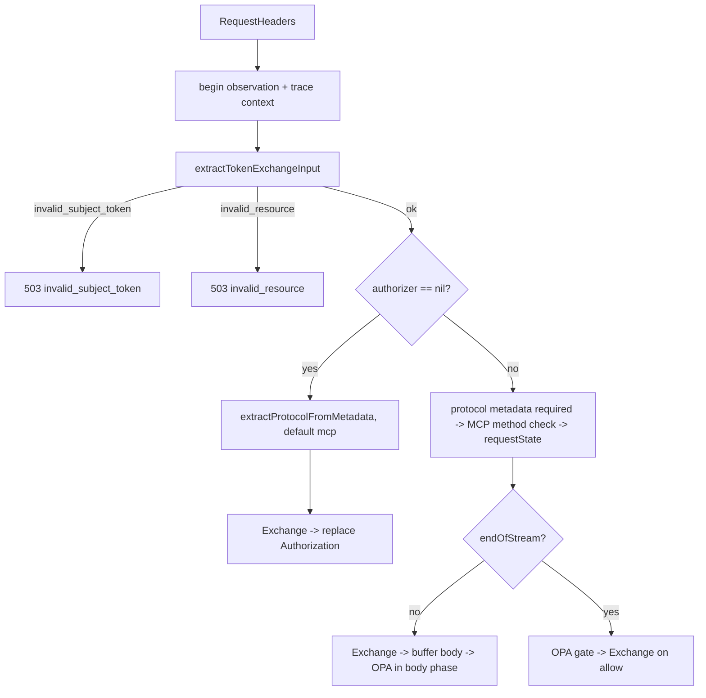

# Data Model: ExtProc Metadata Input

**Feature**: 043-extproc-metadata-input | **Date**: 2026-09-14

## Overview

This feature introduces no domain entities, no persisted state, and no identifiers. The ExtProc
service is a standalone stateless gRPC process (`internal/extproc/`, ADR 011) that never imports
`internal/domain`. The "model" here is a **wire contract** between agentgateway and ExtProc, plus
the in-process types that read and validate it.

Three entities from the spec map onto that contract:

| Spec entity | Realization |
|---|---|
| Subject Token Metadata | `MetadataContext.FilterMetadata["aib.tokenexchange"].Fields["subject_token"]` |
| Resource URI Metadata | `MetadataContext.FilterMetadata["aib.tokenexchange"].Fields["resource_uri"]` |
| Agentgateway Instance | The gateway's global `extProc.metadataContext` policy; no ExtProc-side representation |

## Wire Contract

Namespace and field names are fixed constants in `internal/extproc/server/server.go`, alongside the
existing `agentgatewayProtocolMetadataKey` pair:

| Constant | Value | Meaning |
|---|---|---|
| `tokenExchangeMetadataNamespace` | `aib.tokenexchange` | `FilterMetadata` key holding both inputs |
| `subjectTokenFieldKey` | `subject_token` | Raw bearer credential, no scheme prefix |
| `resourceURIFieldKey` | `resource_uri` | Absolute HTTP(S) URL of the protected MCP resource |

Both fields are `*structpb.Value` entries of kind `StringValue`. Any other kind — and any absent
field or absent namespace — is invalid. See `contracts/extproc-metadata-input.md` for the full
contract including gateway-side production rules.

## Types

### `tokenExchangeInput` (new, unexported)

```go
type tokenExchangeInput struct {
    subjectToken string
    resourceURI  string
}
```

Carries the two validated inputs from extraction to `Exchanger.Exchange`. `subjectToken` holds the
metadata value **verbatim** — FR-004 forbids parsing, trimming, or normalizing it. Validation
inspects the value but never rewrites it.

### `inputRejection` (new, unexported)

```go
type inputRejection struct {
    code   string // "invalid_subject_token" | "invalid_resource"
    reason string // credential-free diagnostic, e.g. "field is not a string"
}
```

One rejection type covers both failures because their response shape is identical: a 503
`ImmediateResponse` with body `{"error":"<code>","error_description":"..."}`. `code` doubles as the
telemetry `outcome` and `error.type` value (SC-002, SC-005). `reason` is logged, never returned, and
never contains a credential (SR-003).

### `extractTokenExchangeInput` (new, unexported)

```go
func extractTokenExchangeInput(req *extprocv3.ProcessingRequest) (tokenExchangeInput, *inputRejection)
```

The single entry point for both header paths. Validation order is fixed by FR-015:

1. `subject_token` — namespace present, field present, kind `StringValue`, value not blank after
   `strings.TrimSpace`, value not prefixed with an ASCII case-insensitive `bearer ` scheme.
   Failure → `invalid_subject_token`.
2. `resource_uri` — field present, kind `StringValue`, value not blank, then `validateResourceURI`.
   Failure → `invalid_resource`.

Because subject validation runs to completion first, a request whose *both* values are invalid
yields `invalid_subject_token` (FR-015, SC-002).

### `requestState` (modified)

`internal/extproc/server/server.go:83-91`. The field `bearerToken` is renamed `subjectToken` to
match the spec's ubiquitous language; it is now populated from metadata rather than from the
Authorization header. No other field changes.

```go
type requestState struct {
    subjectToken          string // was: bearerToken
    resourceURI           string
    headers               map[string]string
    protocol              string
    grantedPermissionSets map[string][]string
    requestContext        context.Context
    finishObservation     func(outcome, resourceURI, errorType string)
}
```

`headers` is unchanged and still sourced from raw HTTP headers — it feeds OPA input and the MCP
transport check (`:method`), neither of which is a token-exchange input. FR-010 constrains
token-exchange inputs only.

### Removed types and functions

| Symbol | Location | Reason |
|---|---|---|
| `extractBearerToken` | `server.go:897-907` | FR-010: Authorization header is no longer an input source |
| `buildResourceURI` | `server.go:937-948` | FR-010: `:scheme`/`:authority`/`:path` are no longer input sources |

`extractHeader` survives — it is still used by `headerCarrier.Get` for W3C trace propagation
(`server.go:988`). `extractAllHeaders` survives — it builds the OPA input header map.
`validateResourceURI` survives with reworded, source-neutral error strings (R10).

## Interface Changes

`Exchanger.Exchange(ctx, subjectToken, resourceURI string)` is unchanged. Its first parameter is
already named `subjectToken` (`server.go:61`); only the provenance of the argument changes. No
adapter, config, or port signature moves.

## Control Flow

Both header paths converge on one validation step. `req` is already available in both signatures, so
no signature changes are required.



Three properties of this flow are load-bearing:

- **The observation starts before validation** in both paths, so invalid-input rejections are counted
  and traced (SC-005). In the OPA path this moves `beginTokenExchangeObservation` ahead of the former
  Bearer check, which no longer exists. Traffic that previously passed through OPA mode silently —
  emitting no span, metric, or outcome — now emits an `invalid_subject_token` observation.
- **Protocol extraction is retained in the non-OPA path.** `extractProtocolFromMetadata` with its
  `"mcp"` default still runs after input validation, because `exchangeErrorResponse` uses protocol to choose between MCP URL elicitation and a 503 on broker re-authentication. The [Feature 043 response matrix](spec.md#exchangeerrorresponse-matrix) retains that behavior.

- **Header-only OPA requests validate early and exchange late.** Validation completes in
  `processRequestHeadersOPA`; the validated values live in `requestState` until
  `processHeadersOnlyOPA` exchanges them after an OPA allow. Missing or invalid metadata therefore
  produces the spec-mandated 503 and never an OPA 403 or an allow.

## Telemetry Vocabulary

| Value | `outcome` | `error.type` | Change |
|---|---|---|---|
| `invalid_subject_token` | yes | yes | **added** |
| `invalid_resource` | yes | yes | retained; now reachable from metadata validation |
| `passthrough` | — | — | **removed** — unreachable once absent input is a rejection (R6) |
| `success`, `authorization_denied`, `invalid_request`, `exchange_failure`, `assertion_expired`, `circuit_open` | yes | partial | unchanged |
| `missing_protocol_metadata`, `invalid_method`, `missing_body`, `evaluation_error`, `access_denied` | — | yes | unchanged |

The `resource.uri` span attribute is set from the validated metadata value and remains passed
through `sanitizeURIForTelemetry`. When the resource is rejected or unavailable the attribute is the
empty string.

## Relationships

```text
agentgateway JWT policy  ──validates──▶ bearer token
         │                                   │
         │ jwt.rawToken.unredacted()         │ (header stripped: preserveToken=false)
         ▼                                   ▼
extProc.metadataContext.aib.tokenexchange   (nothing left in Authorization)
         │
         │ MetadataContext.FilterMetadata["aib.tokenexchange"]
         ▼
extractTokenExchangeInput ──▶ tokenExchangeInput ──▶ Exchanger.Exchange ──▶ Authorization mutation
         │
         └──▶ inputRejection ──▶ 503 ImmediateResponse
```
