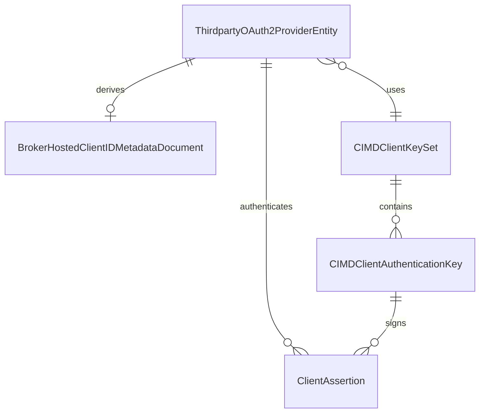

# Data Model: CIMD Upstream Client Authentication

## Glossary additions

Add these terms to `ARCHITECTURE.md` during implementation:

- **CIMD confidential service:** A third-party OAuth2 service that uses `private_key_jwt`. It has a broker-hosted client ID URL and no shared secret.
- **CIMD client-authentication key:** A broker-global ES256 key in the `cimd_client_authentication` key domain. It signs outbound client assertions only.
- **Broker-hosted Client ID Metadata Document:** The public document at a CIMD confidential service's client ID URL.
- **Client assertion:** A short-lived ES256 JWT that authenticates the broker to one configured third-party token endpoint.
- **Key domain:** A persisted purpose boundary for asymmetric broker keys. The two values are `token_signing` and `cimd_client_authentication`.

## Persistent entities

### ThirdpartyOAuth2ProviderEntity

This existing entity remains the third-party service aggregate.

| Field | Type | Private-key-JWT rule |
|---|---|---|
| `ID` | `id.ServiceID` | Immutable service UUID. It identifies the hosted document path. |
| `DisplayName` | string | Required existing service name. |
| `ClientID` | `id.ClientID` | The broker writes `<enduser-public-url>/.well-known/oauth-client/<service-id>`. The operator cannot supply or replace it. |
| `TokenEndpointAuthMethod` | optional enum | `private_key_jwt` identifies this mode. |
| `Secret` | `model.Secret` | Must be absent. The broker must not encrypt, persist, decrypt, or return a shared secret. |
| `Flavor` | `model.OAuth2Flavor` | Credential-derived variants, including Google, reject `private_key_jwt`. |
| `Endpoints.TokenEndpoint` | HTTPS URI | The exact assertion audience. |
| `Endpoints.AuthorizeEndpoint` | HTTPS URI | Existing authorization-code endpoint. |
| `Version` | integer | Existing optimistic-concurrency value. |

The existing `client_id` database column stores the generated URL. No separate CIMD identity column is necessary.

### Authentication state matrix

| Authentication method | Client ID input | Secret input | Stored client ID | Stored secret | Token authentication |
|---|---|---|---|---|---|
| Omitted or `null` | Required | Non-empty and required | Operator value | Encrypted | Existing static confidential behavior |
| `none` | Required | Absent, `null`, or empty | Operator value | Absent | Existing public-client behavior |
| `private_key_jwt` | Forbidden | Absent, `null`, or empty | Broker URL | Absent | ES256 client assertion |

The service model must not infer one state from another field.

### CIMD client-authentication key

CIMD keys reuse the existing asymmetric key record and lifecycle mechanics. They add a required `key_domain` field.

| Field | Type | Rule |
|---|---|---|
| `ID` | `id.SigningKeyID` | Existing key record identity. No new entity ID is needed. |
| `KeyDomain` | enum | `cimd_client_authentication` for CIMD keys. Existing rows become `token_signing`. |
| `KID` | `id.KeyID` | Globally unique across the shared key table and both published key sets. |
| `Algorithm` | string | Exactly `ES256`. |
| `PrivateKeyEncrypted` | bytes | Private PKCS#8 PEM. Never serialized or returned. |
| `IsCurrent` | boolean | At most one active CIMD key is current. |
| `ActivatesAt` | timestamp | Earliest time that the current key can sign an assertion. |
| `CreatedAt` | timestamp | Key creation time. |
| `RemovedAt` | optional timestamp | Explicit removal time. A removed key is not published or selected. |

A CIMD key uses a distinct branch-key subject and encryption context namespace. The context contains exactly one `kid` subject. It contains no service ID, key domain, or second subject.

### Broker-hosted Client ID Metadata Document

This is a derived public value. It has no database row.

| Field | Value |
|---|---|
| `client_id` | Stored broker-hosted client ID URL. |
| `redirect_uris` | One URL: `<enduser-public-url>/api/third-party/<service-id>/oauth2/callback`. |
| `grant_types` | `authorization_code` and `refresh_token`. |
| `response_types` | `code`. |
| `token_endpoint_auth_method` | `private_key_jwt`. |
| `token_endpoint_auth_signing_alg` | `ES256`. |
| `jwks_uri` | `<client-id>/jwks.json`. |

The document exists only for an existing, non-deleted service whose method is `private_key_jwt` and whose CIMD publication prerequisite is usable. This feature adds no inactive service state. All other document requests return the same JSON `404` response.

### Client assertion

A client assertion is an ephemeral value. The broker does not persist it.

| Claim or header | Rule |
|---|---|
| Protected `alg` header | `ES256`. |
| Protected `kid` header | A key in the public CIMD JWK Set. |
| `iss` | Exact service client ID URL. |
| `sub` | Exact service client ID URL. |
| `aud` | One element. It equals the configured token endpoint URL. |
| `iat` | Assertion issue time. |
| `exp` | No more than five minutes after `iat`. |
| `jti` | New and unique for every outbound request attempt. |

## Relationships

All CIMD confidential services share one CIMD key set. A key set never shares keys with the token-signing domain.

## Lifecycle transitions

### Service authentication

| From | Request | To | Required result |
|---|---|---|---|
| Static confidential | Valid `private_key_jwt` request | CIMD confidential | Validate all replacement fields first. Then remove the encrypted shared secret and assign the stable URL. |
| Public | Valid `private_key_jwt` request | CIMD confidential | Keep no secret. Replace the operator client ID with the broker URL. |
| CIMD confidential | Valid static request with a non-empty secret | Static confidential | Store the new encrypted secret in the same completed update. |
| CIMD confidential | Valid `none` request | Public | Keep no secret. Stop private assertion use. |
| CIMD confidential | Caller client ID or non-empty secret | Unchanged | Reject before endpoint discovery or another third-party request. |
| Any | Delete service | Deleted | Return 404 from both CIMD public routes. |

### CIMD key lifecycle

| State | Trigger | Next state | Public JWK Set behavior |
|---|---|---|---|
| No usable key with persisted CIMD services at Builder startup | Bootstrap first key | Current and active | Publish the key immediately. |
| No usable key with no persisted CIMD service | Operator generates the first key through `POST /api/cimd-client-keys` | Current and active | Publish the key immediately. |
| Current key | Generate a new current key | Pending activation | Publish the new key. Continue signing with the previous usable key. |
| Pending activation | `activates_at` passes | Current and active | Continue publication. Sign new assertions with this key. |
| Active key | Promote existing key | Current and active | Sign immediately. Keep the prior key for verification. |
| Non-current active key | Explicit removal | Removed | Remove it from publication. Reject removal of the last, current, or effectively signing key. |

## Invariants

- At most one active current key exists in each key domain.
- CIMD keys use ES256 only.
- A CIMD key never signs broker-issued access tokens.
- A token-signing key never signs a CIMD client assertion.
- The two public JWK Sets have no common `kid`.
- A public metadata or JWK response contains no secret, private key, code, token, assertion, or user data.
- A `private_key_jwt` service has no stored shared secret.
- A service cannot use the CIMD mode until its key set can publish a usable verification key.
- When persisted CIMD services exist at startup, Builder bootstraps the first usable published CIMD key. When none exist, Builder creates no key. Registration never creates a key.

## Persistence changes

Use two sequential migrations after `031`.

### `032_add_cimd_key_domain`

The up migration adds non-null `key_domain` to `signing_keys` and backfills `token_signing` for existing rows. It adds a closed domain check, retains global `kid` uniqueness, and replaces the global current-key partial index with a per-domain active-current index.

The down migration first refuses rollback when a row has `key_domain = cimd_client_authentication`. When no CIMD key exists, it restores the token-only domain check and global current-key index.

### `033_add_cimd_private_key_jwt_authentication`

The up migration replaces `chk_thirdparty_oauth2_services_client_auth`. It permits `private_key_jwt` only when `client_secret_encrypted` is NULL.

The down migration first refuses rollback when a service has `token_endpoint_auth_method = private_key_jwt`. When no CIMD service exists, it restores the migration 031 check without fabricating a secret.

## Audit data

Audit records identify the service ID, key ID when relevant, operation, and outcome. They must not contain private keys, secrets, client assertions, codes, access tokens, refresh tokens, or user data.
