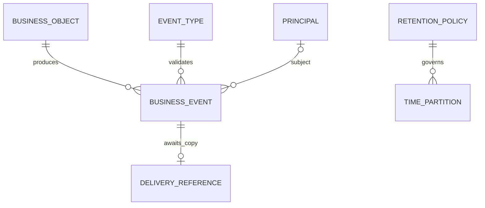
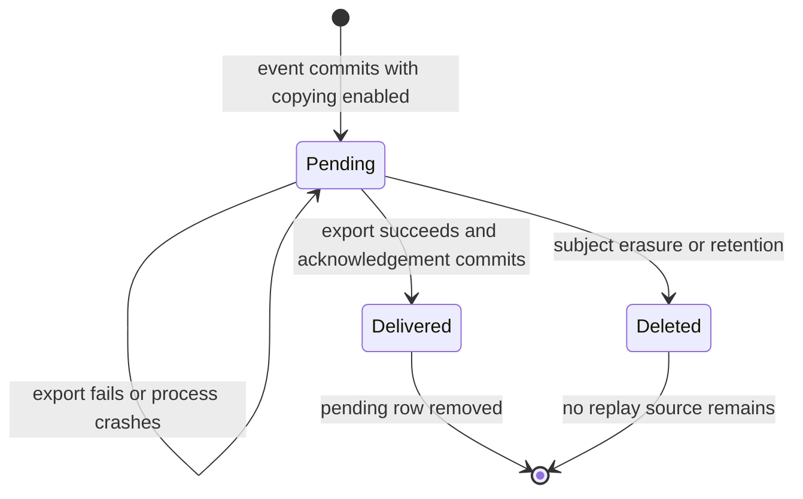

# Business Event Ledger — Data Model

**Design status**: Proposed implementation contract for [spec.md](spec.md); not an implemented database schema.

## Domain boundary

The ledger is an independent bounded context for validated historical facts, investigation, and lifecycle deletion. It does not own grants, sessions, approvals, agents, credentials, or signing keys. Those domain services determine whether a fact occurred. Put shared immutable event value types in `internal/domain/model/business_event.go`, the recorder/validation/query service in `internal/domain/ledger/`, and repository/transaction contracts in `internal/ports/storage.go`. This prevents a ports-to-service import cycle. No domain type imports SQL, HTTP routing, the app, or an adapter.

Relationships to business objects and principals are logical, not cascading foreign keys. The only authority for a retained event's attribution is the immutable event, never a join to a current business row.

## Business Event

| Field | Domain representation | Rules |
|---|---|---|
| id | `id.BusinessEventID` | Generated UUIDv7; immutable; not accepted from requests; no global causal-order claim |
| type | Registered event type | Fixed functional name `agentic-identity-broker` plus the catalogue event name; never configurable |
| source | Fixed producer identifier | `urn:agentic-identity-broker:broker` |
| occurred_at | UTC instant | Actual business fact time; effective expiry for expiration; current-key selection time for promotion |
| recorded_at | UTC instant | Assigned by storage at append; database clock for PostgreSQL; retention clock |
| subject | Optional `id.Principal` | Required nullable JSON field; affected principal, never an agent substitute |
| actor | ActorContext | Required object, fields below |
| agent_id | Optional `id.AgentID` | Required for successful exchange, agent/credential events, grants and approvals |
| gateway_client_id | Optional `id.ClientID` | Verified gateway caller only |
| service_id | Optional `id.ServiceID` | Required on successful third-party session transitions; preserve when known on failure |
| permission_set_ids | Optional set of `id.PermissionSetID` | Deduplicate and sort for deterministic output |
| grant_id | Optional `id.GrantID` | Required on every grant event, including deletion |
| session_id | Optional `id.SessionID` | Third-party session ID, required when the event concerns an existing session |
| approval_id | Optional `id.ApprovalID` | Required on every approval event |
| mcp_session_id, agent_session_id | Optional trusted correlation values | Omit when absent or unsafe; never forward arbitrary credential-bearing strings |
| outcome | Closed enum | success, failure, denied, pending; fixed by event type |
| reason_user | Controlled sentence | Fixed safe template, no operational secrets or interpolated request text |
| reason_admin | Controlled sentence | Fixed operational template, not a raw error |
| trace_id, span_id | Optional validated hex values | Reuse authoritative request correlation; span must belong to the same trace |
| client.ip | Optional parsed IP | Existing trusted-proxy decision, not reparsed untrusted headers |
| client.user_agent | Optional normalized family enum | Chrome, Firefox, Safari, Edge, curl, Go-http-client; no raw versions/comments |
| data | Type-specific value object | Closed schemas; no generic struct serialization |

`ActorContext.kind` is one of user/admin/agent/gateway/system/policy. Its `id` and `on_behalf_of` fields are required and nullable. Automated maintenance recognition uses `kind=system`, `id=broker-lifecycle`. An unauthenticated token attempt has `kind=agent` and null `id`; this is the expected caller category, not an authenticated identity. Administrative requests without an established operator have `kind=admin`, null `id`, and null subject when acting on non-user resources. Kind must come from the authenticated route/workflow, not a user claim.

`EventType` owns the schema, fixed outcome, required references, and reason templates. New type registration extends the embedded registry, not the database schema. The full envelope and per-type contracts are in [contracts/events.md](contracts/events.md) and [contracts/schemas/](contracts/schemas/).

### Validation sequence

1. Producer establishes the actual outcome and trusted identity/resource context.
2. Select the registered event recipe; populate only its permitted fields.
3. Parse semantic IDs/times/IPs, sanitize optional context, check type/outcome/reference invariants, and select fixed reason templates.
4. Validate the typed value with the precompiled schema. No JSON stringify/unmarshal round trip is needed solely for validation.
5. In the owning transaction, storage assigns `recorded_at`, validates the final envelope, serializes once, and inserts event plus optional delivery reference.
6. Commit before reporting success or releasing tokens. Never include event values in validation error diagnostics.

## Persistence records

### `business_events`

Range-partitioned by `recorded_at` in fixed six-hour UTC intervals. Planned columns:

| Column | PostgreSQL type | Purpose |
|---|---|---|
| recorded_at | timestamptz NOT NULL | Partition key; microsecond precision from database clock |
| id | uuid NOT NULL | UUIDv7 event ID |
| occurred_at | timestamptz NOT NULL | Investigation ordering/filtering |
| type | text NOT NULL | Registered full type |
| outcome | text NOT NULL | Fixed four-value CHECK |
| subject | text NULL | Exact principal investigation and erasure |
| envelope | jsonb NOT NULL | Complete immutable contract, including the projected columns |

Primary key `(recorded_at, id)`. CHECKs require JSON object shape and equality between envelope values and projected columns, including JSON null versus SQL NULL for subject. Domain registry supplies the type-specific validation; the database does not duplicate 28 schemas as CHECKs. All timestamps written into the envelope use the same normalized microsecond value as SQL columns. Enforce an UPDATE-rejection trigger and runtime privileges limited to SELECT/INSERT on event parents; operator deletion and maintenance are separate capabilities.

Indexes on the partitioned parent:

- `(subject, type, outcome, occurred_at, id)` for the motivating incident query.
- `(subject, occurred_at, id)` for subject-range queries and erasure.
- `(occurred_at, id)` for deterministic operational scans.

Queries filter occurrence time, not retention time. They cannot assume occurred_at selects the recorded_at partition: lazy expiry may be recorded much later. Do not add a large JSONB GIN index without a query requirement. Partition count at the default duration is approximately 360 retained six-hour windows plus 28 future windows and a boundary window. Actual event volume is measured, not assumed by that count.

UUID generation supplies globally unique identities; the composite primary key respects PostgreSQL's partition restriction. Retry of a prepared append must preserve both ID and recorded_at within that operation. Do not use a new partition/recorded_at to retry the same append. The domain transition's CAS or occurrence marker, not an event-type uniqueness index, decides whether an occurrence is new.

### `business_event_delivery_pending`

Paired six-hour partitions on `recorded_at` with `(recorded_at,event_id)` primary key. Columns: recorded_at, event_id, next_attempt_at (timestamptz). A pending row contains no envelope, principal, credential, or diagnostic payload. Index `(next_attempt_at,recorded_at,event_id)` supports bounded scanning. References are checked against the retained event while holding lifecycle barriers; there is no FK to mutable business objects. Paired deletion and paired partition drops are one transaction; no cross-partition FK is required.

States:

Delivered is not a mutable state on the event. It is represented by absence of a pending reference. An export success followed by rollback/crash leaves Pending and can produce a same-ID duplicate. No general request-idempotency contract is added.

### `business_event_policy`

Singleton row: `singleton` boolean primary key constrained true, `retention_microseconds` bigint constrained positive. Migration seeds 90 days. Startup sets the validated common configuration through DML while holding the exclusive lifecycle lock. PostgreSQL and memory normalize positive sub-microsecond configuration to one microsecond, never zero, so no event is deleted early. Larger durations round upward to microseconds; overflow is a startup error. No second maintenance config parser exists.

### Expiration recognition markers

Add nullable `expiration_recorded_for timestamptz` to `user_grants` and `tool_approvals`; memory carries the equivalent field. Access goes through two separate ISP ports, `UserGrantExpirationRepository` and `ToolApprovalExpirationRepository` in `internal/ports/storage.go`, implemented by the existing grant and approval adapters in both backends, so the existing repositories do not grow. Conditional update succeeds only when the object is expired under existing lifecycle rules and the marker differs from the current effective expiry. It returns the affected object for event construction. Set the marker and append the expiration event in one transaction. Changing grant validity must not reuse an old marker for a different expiry. Markers have no retained envelope or extra principal data and survive ledger erasure/retention. Physical deletion of the business object removes the possibility of rediscovery.

Do not add an `expired` approval status: existing approval status constraints and consumed/persistence semantics remain authoritative. Existing expiry-filtered reads must expose recognition candidates internally before filtering, without changing public query results. No new expiration scheduler is introduced.

## Consistency, isolation, and lifecycle

The exact storage and operational interfaces, lock order, SQL erasure call, maintenance command, and privilege matrix are defined in [contracts/storage.md](contracts/storage.md).

- Owning business transition and event append share one transaction. Nested Fosite and repository scopes cannot commit the owner early.
- A non-mutating outcome uses its own short transaction. Failure events are recorded after the unsuccessful transaction is rolled back, not inside it.
- A separate successful side effect, such as a session refresh, stays recorded even when the later token exchange fails.
- Memory holds its visibility gate throughout each transaction and journals only changed records; all reads and writes participate.
- Lifecycle shared lock precedes subject shared/exclusive lock, which precedes business row locks and delivery-row locks. Retention takes lifecycle exclusive only.
- Erasure deletes all events ordered before its committed completion boundary and no other subjects. Post-boundary occurrences remain legitimate; erasure is not an identity ban.
- No copied event may wait in a payload buffer after releasing the deletion barrier. External already-dispatched copies are not subject to ledger erasure.

## Migration and rollback

Plan `035_business_event_ledger.{up,down}.sql`, verifying that 035 remains free before implementation (the unmerged `046-cimd-upstream-client` branch holds 033 and 034). Up creates policy/event/delivery parents, indexes, immutable-row protection, the partition-pair and maintenance functions, the erasure function, current/future partitions, and object recognition markers. Foundation work provides partition provisioning; the erasure function, retention drops and privilege restrictions join the same unreleased migration during the retention/erasure story, after their tests. Partition names derive only from internal UTC boundaries; dynamic SQL identifiers are quoted, never user supplied. Down removes only feature-owned functions/tables/markers and leaves existing business records intact. Dropping the feature necessarily deletes ledger history; backup/export and operator acknowledgement are required before production rollback, and the old binary must be deployed together with down migration. Real PostgreSQL tests cover up/down/up, business-data survival, permission boundaries, and populated partition deletion. Schema changes ship in the migration image; the broker image remains DML-only.
