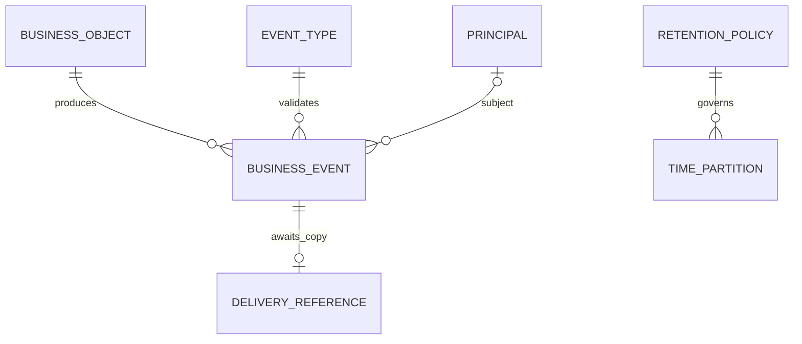
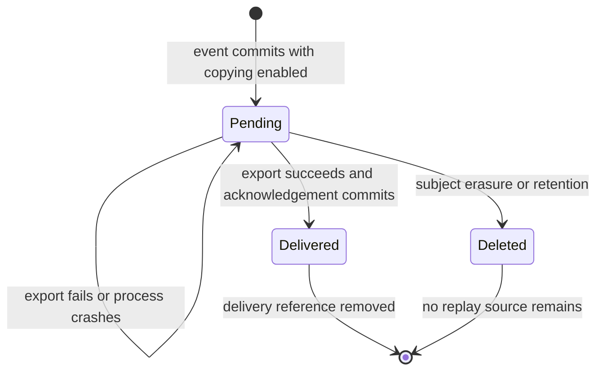

# Business Event Ledger — Data Model

**Implementation status**: The broker implements this model under accepted ADR 039 and the approved event/storage contracts. The [validation evidence](quickstart.md) records actual results. The [specification](spec.md) and [plan](plan.md) record retirement of the performance gate, profile, and feature-specific diagnostic tools. All 20 functional scenarios remain required in shared lanes. The 5 ms p99 goal remains unverified and non-blocking. The storage/security design is unchanged.

## Domain boundary

The ledger is an independent bounded context for validated historical facts, investigation, and lifecycle deletion. It does not own grants, sessions, approvals, agents, credentials, or signing keys. Those domain services determine whether a fact occurred.

Put shared immutable event value types in `internal/domain/model/business_event.go`. Put the recorder/validation/query service in `internal/domain/ledger/`. Put repository/transaction contracts in `internal/ports/storage.go`.

This separation prevents a ports-to-service import cycle. No domain type imports SQL, HTTP routing, the app, or an adapter.

```mermaid
erDiagram
    BUSINESS_OBJECT ||--o{ BUSINESS_EVENT : produces
    BUSINESS_EVENT ||--o| DELIVERY_REFERENCE : awaits_copy
    EVENT_TYPE ||--o{ BUSINESS_EVENT : validates
    PRINCIPAL o|--o{ BUSINESS_EVENT : subject
    RETENTION_POLICY ||--o{ TIME_PARTITION : governs
```

Relationships to business objects and principals are logical, not cascading foreign keys. The immutable event is the only authority for the attribution of a retained event. A join to a current business row is never authoritative.

## Business Event

| Field | Domain representation | Rules |
|---|---|---|
| id | `id.BusinessEventID` | A generated, immutable UUIDv7. The broker does not accept it from requests. It gives no global causal-order guarantee. |
| type | Registered event type | The fixed functional name `agentic-identity-broker` plus the catalogue event name. It is never configurable. |
| source | Fixed producer identifier | `urn:agentic-identity-broker:broker` |
| occurred_at | UTC instant | The actual time of the business fact. For expiration, the effective expiry. For promotion, the time of current-key selection. |
| recorded_at | UTC instant | Storage assigns it at append. PostgreSQL uses the database clock. Retention uses this time. |
| subject | Optional `id.Principal` | A required nullable JSON field for the affected principal. An agent is never a substitute. |
| actor | ActorContext | A required object. The actor rules follow this table. |
| agent_id | Optional `id.AgentID` | Required for successful exchange, agent/credential events, grants and approvals |
| gateway_client_id | Optional `id.ClientID` | Verified gateway caller only |
| service_id | Optional `id.ServiceID` | Required on successful third-party session transitions. If known, preserve it on failure. |
| permission_set_ids | Optional set of `id.PermissionSetID` | Remove duplicates. Sort the set for deterministic output. |
| grant_id | Optional `id.GrantID` | Required on every grant event, including deletion |
| session_id | Optional `id.SessionID` | For an event about an existing session, this third-party session ID is required. |
| approval_id | Optional `id.ApprovalID` | Required on every approval event |
| mcp_session_id, agent_session_id | Optional trusted correlation values | If absent or unsafe, omit them. Never forward arbitrary credential-bearing strings. |
| outcome | Closed enum | The event type fixes the value: success, failure, denied, or pending. |
| reason_user | Controlled sentence | A fixed safe template. It contains no operational secrets or interpolated request text. |
| reason_admin | Controlled sentence | A fixed operational template, not a raw error. |
| trace_id, span_id | Optional validated hex values | Reuse authoritative request correlation. The span must belong to the same trace. |
| client.ip | Optional parsed IP | The existing trusted-proxy decision. The broker does not reparse untrusted headers. |
| client.user_agent | Optional normalized family enum | Chrome, Firefox, Safari, Edge, curl, Go-http-client. No raw versions or comments. |
| data | Type-specific value object | Closed schemas. No generic struct serialization. |

`ActorContext.kind` is one of user/admin/agent/gateway/system/policy. Its `id` and `on_behalf_of` fields are required and nullable. Automated maintenance recognition uses `kind=system`, `id=broker-lifecycle`.

An unauthenticated token attempt has `kind=agent` and null `id`. This kind identifies the expected caller category, not an authenticated identity.

Administrative requests without an established operator have `kind=admin` and null `id`. For actions on non-user resources, these requests also have a null subject. Kind must come from the authenticated route/workflow, not a user claim.

`EventType` owns the schema, fixed outcome, required references, and reason templates. New type registration extends the embedded registry, not the database schema. The full envelope and per-type contracts are in [contracts/events.md](contracts/events.md) and [contracts/schemas/](contracts/schemas/).

### Validation sequence

1. Establish the actual outcome and trusted identity/resource context in the producer.
2. Select the registered event recipe. Populate only its permitted fields.
3. Parse semantic IDs/times/IPs. Sanitize optional context. Verify type/outcome/reference invariants. Select fixed reason templates.
4. Validate the typed value with the precompiled schema. Validation alone does not require a JSON stringify/unmarshal round trip.
5. Append in the owning transaction. Storage assigns `recorded_at` and validates the final envelope. It serializes once and inserts the event plus the optional delivery reference.
6. Before you report success or release tokens, commit the transaction. Never include event values in validation error diagnostics.

## Persistence records

### `business_events`

The table uses range partitions on `recorded_at` in fixed six-hour UTC intervals. Planned columns:

| Column | PostgreSQL type | Purpose |
|---|---|---|
| recorded_at | timestamptz NOT NULL | The partition key. The database clock supplies microsecond precision. |
| id | uuid NOT NULL | UUIDv7 event ID |
| occurred_at | timestamptz NOT NULL | Investigation ordering/filtering |
| type | text NOT NULL | Registered full type |
| outcome | text NOT NULL | Fixed four-value CHECK |
| subject | text NULL | Exact principal investigation and erasure |
| envelope | jsonb NOT NULL | The full immutable contract, including the projected columns. |

The primary key is `(recorded_at, id)`. CHECKs require JSON object shape and equality between envelope values and projected columns. These constraints include JSON null versus SQL NULL for subject. The domain registry supplies type-specific validation. The database does not duplicate 28 schemas as CHECKs. All envelope timestamps use the same normalized microsecond value as SQL columns.

Enforce an UPDATE-rejection trigger. Limit runtime privileges to SELECT/INSERT on event parents.

Operator deletion and maintenance are separate capabilities.

Indexes on the partitioned parent:

- `(subject, type, outcome, occurred_at, id)` supports the motivating incident query.
- `(subject, occurred_at, id)` supports subject-range queries and erasure.
- `(occurred_at, id)` supports deterministic operational scans.

Queries filter occurrence time, not retention time. They cannot assume that occurred_at selects the recorded_at partition. The broker can record lazy expiry much later.

Without a query requirement, do not add a large JSONB GIN index.

The default duration retains approximately 360 six-hour windows plus 28 future windows and a boundary window. We measure actual event volume. The partition count does not establish event volume.

UUID generation supplies globally unique identities. The composite primary key respects the PostgreSQL partition restriction. A retry of a prepared append must preserve both ID and recorded_at within that operation.

Do not use a new partition/recorded_at to retry the same append.

The CAS or occurrence marker of the domain transition determines whether an occurrence is new. An event-type uniqueness index does not make that decision.

### `business_event_delivery_pending`

This table has paired six-hour partitions on `recorded_at` with the primary key `(recorded_at,event_id)`. The columns are recorded_at, event_id, and next_attempt_at (timestamptz). A delivery-reference row contains no envelope, principal, credential, or diagnostic payload. The index `(next_attempt_at,recorded_at,event_id)` supports bounded scanning.

Storage verifies references against the retained event under lifecycle barriers. There is no FK to mutable business objects. Paired deletion and paired partition drops use one transaction. No cross-partition FK is required.

States:

```mermaid
stateDiagram-v2
    [*] --> Pending: event commits with copying enabled
    Pending --> Pending: export fails or process crashes
    Pending --> Delivered: export succeeds and acknowledgement commits
    Pending --> Deleted: subject erasure or retention
    Delivered --> [*]: delivery reference removed
    Deleted --> [*]: no replay source remains
```

Delivered is not a mutable state on the event. The absence of a delivery reference represents Delivered. A successful export followed by a rollback/crash leaves Pending and can produce a same-ID duplicate. This model adds no general request-idempotency contract.

### `business_event_policy`

The singleton row has a `singleton` boolean primary key constrained true and a `retention_microseconds` bigint constrained positive. The migration seeds 90 days. At startup, the broker sets the validated common configuration through DML under the exclusive lifecycle lock.

PostgreSQL and memory normalize positive sub-microsecond configuration to one microsecond, never zero. This normalization prevents early event deletion. Larger durations round upward to microseconds. Overflow is a startup error. No second parser for maintenance configuration exists.

### Expiration recognition markers

Add nullable `expiration_recorded_for timestamptz` to `user_grants` and `tool_approvals`.

Memory carries the equivalent field. Access uses two separate ISP ports in `internal/ports/storage.go`: `UserGrantExpirationRepository` and `ToolApprovalExpirationRepository`. The existing grant and approval adapters implement these ports in both backends. The existing repositories do not grow.

If the object is expired under existing lifecycle rules and its marker differs from the current effective expiry, a conditional update succeeds. It returns the affected object for event construction.

Set the marker and append the expiration event in one transaction. For a different expiry after a grant validity change, do not reuse an old marker.

Markers contain no retained envelope or extra principal data. They survive ledger erasure/retention. Physical deletion of the business object prevents rediscovery.

Do not add an `expired` approval status.

Existing approval status constraints and consumed/persistence semantics remain authoritative. Before their unchanged public filtering, approval pending-list reads recognize one exact-principal batch of at most 200 expired objects. Creation and object reads recognize only affected objects. Gateway sync polling never discovers expiry globally. Cleanup retains marker/event atomicity. This model introduces no new expiration scheduler.

## Consistency, isolation, and lifecycle

[contracts/storage.md](contracts/storage.md) defines the exact storage and operational interfaces, lock order, SQL erasure call, maintenance command, and privilege matrix.

- The owning business transition and event append share one transaction. Nested Fosite and repository scopes cannot commit the owner early.
- A non-mutating outcome uses its own short transaction. The broker records failure events after rollback of the unsuccessful transaction, not inside it.
- If the later token exchange fails, a separate successful side effect, such as a session refresh, stays recorded.
- Memory holds its visibility gate throughout each transaction and journals only changed records. All reads and writes participate.
- The lifecycle shared lock precedes the subject shared/exclusive lock. Business row locks and delivery-row locks follow. Retention takes only the lifecycle exclusive lock.
- Erasure deletes all events ordered before its committed completion boundary and no other subjects. Post-boundary occurrences remain legitimate. Erasure is not an identity ban.
- No copied event can wait in a payload buffer after release of the deletion barrier. Ledger erasure does not cover external, already-dispatched copies.

## Migration and rollback

After rebase onto main, use `036_business_event_ledger.{up,down}.sql`.

Main uses 033–035 for signing-key and CIMD changes. Up creates policy/event/delivery parents, indexes, and immutable-row protection. It also creates the partition-pair, provisioning and maintenance functions, and the erasure function. Up creates current/future partitions and object recognition markers.

Foundation work provides partition provisioning. The migration and pre-upgrade job call provisioning, which never drops partitions. The erasure function, retention drops (scheduled maintenance only), and privilege restrictions join the same unreleased migration during the retention/erasure story. These additions follow their tests.

Partition names derive only from internal UTC boundaries. Dynamic SQL identifiers are quoted, never user supplied. Down removes only feature-owned functions/tables/markers and leaves existing business records intact.

Removal of the feature necessarily deletes ledger history. Production rollback requires backup/export and operator acknowledgement. The old binary must accompany the down migration. Real PostgreSQL tests cover up/down/up, business-data survival, permission boundaries, and populated partition deletion.

Schema changes ship in the migration image. The broker image remains DML-only.

**T013 review (2026-09-27)**: Migration 035 was available at review time. The rebase allocation is 036. The design is unchanged.

The review retains paired six-hour partitions, immutable projected envelopes, microsecond policy precision, independent expiry markers, ordered barriers, and separate operational privileges.
Provisioning never drops history. Scheduled maintenance owns retention drops, and authorized exact-subject erasure owns row deletion.
The design has no event cascade foreign keys or default partition.

Production rollback still requires a backup, explicit operator acknowledgement of history loss, and deployment of the matching old binary.
This design review does not authorize a production rollback or claim an applied migration.
