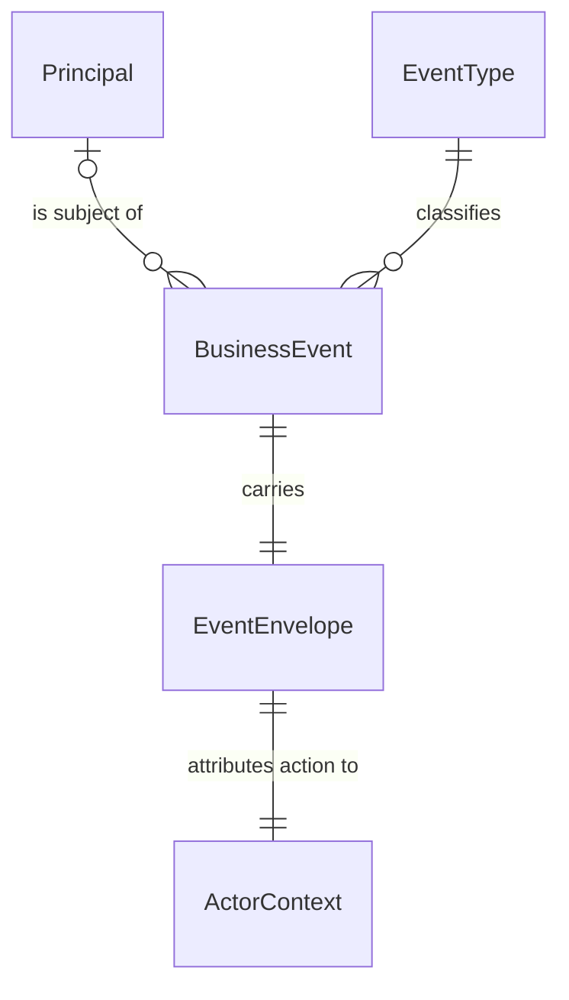
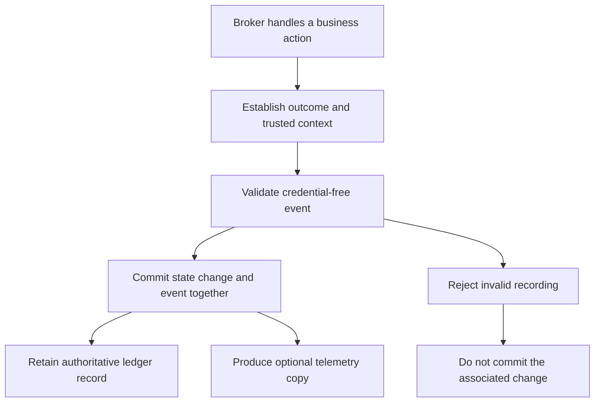

# Feature Specification: Business Event Ledger

**Feature Branch**: `048-business-event-ledger`

**Created**: 2026-09-25

**Status**: Draft

**Input**: User description: "A durable business event ledger for broker-produced security events, recorded atomically with state changes, queryable by principal, credential-free, subject to retention and principal erasure, and mirrored to existing telemetry without replacing existing logs."

## Clarifications

### Session 2026-09-25

- Q: If the broker crashes after committing a ledger event but before emitting its telemetry copy, must it emit that missing copy after restarting? → A: Yes. Recover missing copies after restart while the event remains retained and telemetry copying remains enabled. Retries may produce duplicates with the same event ID; erased or retention-deleted events must never be emitted.

### Session 2026-09-26

- Q: Should the full event type name be organization-specific or configurable per deployment? → A: Neither. Every type is the fixed functional name `agentic-identity-broker`, a dot, and a hyphenated event name, following Zalando event type naming (Rule 213). The name identifies the product, not its hosting organization or a deployment, and no setting changes it.

## User Scenarios & Testing *(mandatory)*

### User Story 1 - Trust the Record of Security Changes (Priority: P1)

As a platform operator, I can rely on every grant revocation, session termination, and approval decision being recorded even if the broker crashes immediately after committing the change.

**Why this priority**: An incident record is trustworthy only if committed changes cannot escape recording and rolled-back changes cannot appear as completed actions.

**Independent Test**: Complete security workflows, interrupt them before and after commit, and compare the resulting business state with the retained events after restart.

**Acceptance Scenarios**:

1. **US1-AS1 — Catalogue coverage**: **Given** the broker can perform each of the 28 catalogued actions, **When** each action occurs through its business workflow, **Then** exactly one event of the corresponding type records that occurrence with the required envelope and a valid type-specific data object.
2. **US1-AS2 — Crash after commit**: **Given** a grant revocation, session termination, or approval decision, **When** the change commits and the broker crashes before sending a response or writing its existing log line, **Then** both the change and exactly one corresponding ledger event are present after restart.
3. **US1-AS3 — Rollback**: **Given** a catalogued mutation, **When** its transaction rolls back, including because the event cannot be validated or recorded, **Then** neither the mutation nor its success event is committed, and the caller does not receive a successful result.
4. **US1-AS4 — Decision without mutation**: **Given** an exchange denial, impersonation denial, token request failure, or third-party refresh failure that changes no stored business state, **When** the broker completes that decision or failure outcome, **Then** it records exactly one corresponding denial or failure event independently of any rolled-back mutation, without implying that an unsuccessful action succeeded.
5. **US1-AS5 — Competing transitions**: **Given** concurrent attempts to revoke the same grant, terminate the same session, or decide the same pending approval, **When** only one transition takes effect, **Then** only that transition produces its state-change event; an unchanged result does not produce a duplicate success event.
6. **US1-AS6 — Expiration**: **Given** a grant or approval becomes expired, **When** the broker recognizes the expiration through its existing lifecycle behavior, **Then** it records one expiration event and repeated access or cleanup does not record that expiration again.
7. **US1-AS7 — Storage parity**: **Given** the in-memory backend, **When** the same catalogue workflows, rollbacks, and competing transitions run, **Then** their observable event contents and atomicity match the persistent backend for the lifetime of that process.

---

### User Story 2 - Investigate a Principal's Token Activity Safely (Priority: P1)

As a security engineer, I can query which agents received exchanged tokens for a given user during a time range, distinguish the affected user from the caller, and investigate without grepping logs or accessing credentials.

**Why this priority**: The ledger must answer the incident question that motivates its creation without becoming a new credential store.

**Independent Test**: Perform exchanges for multiple users and agents, including delegated and denied requests, then query the retained records using authorized operational database access.

**Acceptance Scenarios**:

1. **US2-AS1 — Scoped investigation**: **Given** successful and denied exchanges for multiple principals before, within, and after a selected time range, **When** an investigator selects one principal's successful `token-exchanged` events in that range, **Then** the results identify exactly the agents that received tokens for that principal, exclude other principals and denied exchanges, and contain no credentials.
2. **US2-AS2 — Attribution and correlation**: **Given** a validated delegated exchange with a request SecurityContext, **When** its event is recorded, **Then** the subject identifies the affected principal, the actor identifies the authenticated caller, `on_behalf_of` preserves delegation, and the event's trace, span when available, IP, and user agent match the authoritative request context rather than unverified identity claims.
3. **US2-AS3 — Credential exclusion**: **Given** representative inputs and failures for every catalogued type containing distinct access-token, refresh-token, client-secret, client-assertion, raw-JWT, authorization-code, and PKCE-verifier values, **When** those workflows record events and emit ledger telemetry, **Then** none of those values or credential-bearing payloads appears anywhere in the envelope, reasons, data, or telemetry copy. This includes credentials embedded in arbitrary strings such as user agents and upstream error text.
4. **US2-AS4 — Unavailable identities**: **Given** an unauthenticated failure, a background expiration, or an administrative action with no affected user, **When** the broker records the event, **Then** it explicitly represents unavailable subject or actor identity, does not invent a user or trust a supplied identity claim, and retains the known resource and source context.
5. **US2-AS5 — Stable extensible contract**: **Given** previously recorded catalogue events, **When** a further type and its published schema are registered without changing the ledger database structure, **Then** valid events of the new type can be recorded and earlier events retain their original type and meaning; unknown types or invalid payloads are rejected before storage or ledger telemetry emission.

---

### User Story 3 - Enforce Retention and Principal Erasure (Priority: P2)

As a compliance owner, I can delete all events about one principal in one operation and have time-based retention enforced automatically.

**Why this priority**: Durable security records contain personal information and need an explicit, testable lifecycle.

**Independent Test**: Record events for several principals across retention boundaries, erase one principal, and exercise retention with the default and a changed duration.

**Acceptance Scenarios**:

1. **US3-AS1 — Principal erasure**: **Given** one principal has events across multiple time partitions and event families, including events performed by other actors on that principal's behalf, **When** an authorized operator completes one principal-erasure operation, **Then** no ledger event whose subject equals that principal remains, other subjects' events remain unchanged, and repeating the operation succeeds with no matching records.
2. **US3-AS2 — Automatic retention**: **Given** events on both sides of the configured retention boundary, **When** retention maintenance runs with its default 90-day duration or a configured positive duration, **Then** eligible time partitions are dropped automatically, no event younger than the retention duration is removed, and expired events are removed within the documented retention grace period.
3. **US3-AS3 — Erasure during recording**: **Given** event recording and principal erasure overlap, **When** erasure succeeds, **Then** all matching events ordered before the erasure's completion boundary are absent; a later legitimate event is a new occurrence, not a replay of an erased record.
4. **US3-AS4 — No resurrection**: **Given** a principal's records have been erased or a partition has expired, **When** the broker restarts or resumes deferred telemetry work, **Then** deleted events are not recreated in the ledger or newly emitted from deferred ledger copies, and maintenance resumes without manual cleanup.
5. **US3-AS5 — Invalid retention configuration**: **Given** a non-positive or malformed retention duration, **When** the operator starts the broker with it, **Then** startup rejects the setting rather than silently disabling retention or deleting all history.

---

### User Story 4 - Preserve Monitoring While Adding Ledger Events (Priority: P2)

As an SRE, I continue to see the existing structured logs and telemetry signals, and receive a separate OpenTelemetry log record for each ledger event without having to reconfigure my telemetry destination.

**Why this priority**: Introducing durable records must not break existing dashboards or SIEM integrations.

**Independent Test**: Complete representative workflows with ledger telemetry enabled and disabled, interrupt processing after commit but before telemetry emission, restart the broker, and compare existing logs and signals while correlating recovered ledger copies by event ID.

**Acceptance Scenarios**:

1. **US4-AS1 — Compatible additional signal**: **Given** working telemetry export, **When** a catalogued event commits, **Then** existing slog event lines retain their names, levels, messages, and fields, existing telemetry remains available, and one additional logical OpenTelemetry log record has EventName equal to the event type and the credential-free envelope as flat attributes.
2. **US4-AS2 — Independent disablement**: **Given** only the ledger telemetry copy is disabled, **When** a catalogued action occurs, **Then** its ledger event and existing logs and telemetry remain, but no additional ledger log record is emitted.
3. **US4-AS3 — Export failure, rollback, and crash recovery**: **Given** the telemetry destination is unavailable, a business transaction rolls back, or the broker crashes after commit but before telemetry emission, **When** the broker processes the action or restarts with working telemetry and copying still enabled, **Then** destination failure cannot remove a committed ledger event or undo its business change, rolled-back events are never emitted as committed ledger events, and missing copies of retained events are automatically emitted after restart. Retries may produce duplicate copies with the same event ID; erased or retention-deleted events are never emitted by recovery.
4. **US4-AS4 — Performance**: **Given** a recorded baseline representing the deployment's current workload, **When** the same workload runs with ledger recording enabled under equivalent conditions, **Then** the p99 added transaction time attributable to recording is at most 5 ms while all atomicity and credential-exclusion guarantees remain satisfied.

### Edge Cases

- A transaction commits but its response is lost: the retained event remains authoritative; re-reading unchanged state must not create another state-change event. A genuinely new token issuance is a distinct occurrence, even if a caller retries a request.
- A request produces several distinct facts, such as an impersonation decision and a token exchange: each catalogued fact has its own event. The same exchanged-token fact is not also labeled `token-issued`.
- An upstream provider may complete an action before a local commit fails. The atomicity promise covers broker-controlled state and the broker's recorded outcome, not a distributed transaction with that provider.
- A failure outcome can occur without a domain-state mutation. Its event is not a success event rescued from a rolled-back transaction.
- When ledger storage is unavailable, the broker fails closed rather than releasing a newly issued token or reporting a successful mutation without its record. A storage outage cannot itself be promised a durable failure event in that unavailable store.
- An expired object may be discovered lazily. `occurred_at` represents its effective expiry instant; `recorded_at` represents when the broker records that fact. Repeated discovery must not duplicate it.
- Missing request or span context is represented as absent, not as fabricated correlation. Scheduled actions use a system actor.
- A user-agent string, upstream message, tool arguments, or URLs can contain credentials. Such untrusted content must not bypass the credential-free contract merely because its destination field is normally harmless.
- Principal erasure is subject-based, not an actor-ID search. An administrator acting on another principal's behalf does not become that event's subject.
- Retention and erasure are permitted deletions from an otherwise immutable ledger. Event records must not cascade away merely because an agent, grant, session, or approval is deleted.

## Requirements *(mandatory)*

### Functional Requirements

The first eight requirements preserve the numbering and intent of the user's FR-1 through FR-8.

- **FR-001 — Atomic recording**: Every catalogued broker state transition MUST write exactly one corresponding event in the same database transaction as the transition. Event validation or persistence failure MUST prevent commit; rollback MUST leave neither the transition nor its success event. The event MUST remain after a crash immediately following commit.
- **FR-002 — Existing logs**: Existing slog `event` lines MUST continue unchanged during the deprecation period. This feature MUST NOT rename, replace, suppress, or remove them or establish a removal date.
- **FR-003 — Credential-free records**: Events and ledger telemetry copies MUST NOT contain an access token, refresh token, client secret, client assertion, raw JWT, authorization code, or PKCE verifier, including in nested data, reasons, or client context. Automated behavioral coverage MUST prove this for every one of the 28 catalogued types, including applicable error paths.
- **FR-004 — Telemetry copy**: With the copy enabled, each committed ledger event MUST produce one logical OpenTelemetry log record using existing telemetry configuration, with EventName equal to its full event type and its envelope represented as flat attributes. The copy MUST be independently disableable. It MUST NOT precede commit, change ledger authority, or make business commit depend on collector availability. If the broker crashes after commit but before emission, it MUST automatically recover and emit the missing copy after restart while the event remains retained and copying remains enabled. Retries MAY produce duplicate copies, but MUST preserve the original event ID. Recovery MUST NOT emit erased or retention-deleted events. This requirement does not promise exactly-once delivery by external collectors.
- **FR-005 — Retention**: Ledger retention MUST default to 90 days, accept a configurable positive duration, and automatically remove expired time partitions by partition drop rather than row-by-row retention deletes. Age MUST be measured from `recorded_at`. No event may be removed early; removal MUST occur within 24 hours after its retention deadline during normal operation. After downtime, overdue maintenance MUST resume automatically. This grace-period default is an explicit assumption below.
- **FR-006 — Principal erasure**: One authorized operation MUST remove all ledger events whose `subject` equals the selected principal across all retained partitions. It MUST be idempotent, leave other subjects unchanged, and provide a completion boundary relative to concurrent event recording. It MUST NOT create a replacement subject event that immediately defeats erasure. This operation is distinct from time-based partition retention.
- **FR-007 — In-memory support**: The in-memory storage backend MUST support recording, validation, scoped querying, subject erasure, and logical retention with the same observable business and atomicity semantics as PostgreSQL. It MUST support unit and end-to-end workflows without PostgreSQL; persistence across process restart and physical partition dropping apply only to PostgreSQL.
- **FR-008 — Recording overhead**: Recording MUST add at most 5 ms p99 to transaction time at current load. Acceptance MUST compare equivalent workloads and conditions with and without recording, capture both baseline and enabled latency distributions, and document workload mix, concurrency, event sizes, retained history, and telemetry settings. No existing load measurement is assumed by this specification.
- **FR-009 — Catalogue**: The initial catalogue MUST include all 28 types below. Full names MUST be the fixed functional name `agentic-identity-broker`, a dot, and the listed event name, following Zalando event type naming (Rule 213). Names MUST NOT depend on the hosting organization or deployment and MUST NOT be configurable. Adding an event type MUST NOT require a ledger database migration. Published names and meanings MUST not be reassigned.
- **FR-010 — Envelope**: Every event MUST conform to the envelope contract below, preserving subject, actor, source, business references, and authoritative correlation without reconstructing identities from unverified credentials.
- **FR-011 — Per-type schemas**: Each event's `data` MUST be validated against its registered per-type JSON schema published under `api/`. Unknown types and schema-invalid data MUST be rejected before recording or ledger telemetry emission. Schemas MUST define allowed fields and forbid unspecified data fields; new optional data must not invalidate existing records.
- **FR-012 — Investigation**: Authorized operational queries MUST support exact subject, event type, outcome, and occurrence-time filtering, with a half-open time interval `[start, end)` and deterministic ordering by `occurred_at` then event ID. Events whose subject is null are selected with an explicit no-subject selector; no query spans all subjects implicitly. Successful exchange records MUST identify their receiving agent. No user-facing or new HTTP read API is introduced.
- **FR-013 — Non-mutating outcomes**: Catalogued requests, denials, failures, and token issuance without another persisted mutation MUST still be durable ledger occurrences. Where there is no committing business transaction, the event MUST commit as its own recorded outcome before the broker completes the request; a rolled-back state change MUST NOT be represented as successful. Unavailable storage MUST never cause a denied action to become allowed.
- **FR-014 — Exactly one occurrence**: Duplicate observations of the same effective state transition MUST NOT create multiple events. Concurrent losing transitions and no-op mutations MUST NOT create success events. Distinct business facts within one request MAY each produce their own corresponding type; this does not introduce general request-idempotency behavior.
- **FR-015 — Source boundary**: Only broker-produced events are recorded in this feature. Broker state changes invoked by a gateway, such as requesting or consuming an approval through the broker, remain broker-produced. No external producer ingestion capability is introduced.
- **FR-016 — Immutable authority**: Committed events MUST be immutable except for retention and subject erasure. Later activity views, signal transmission, and exports MUST be able to use these records without reconstructing history from existing logs. This feature does not implement those projections or backfill historical logs.
- **FR-017 — Deletion and deferred work**: Retention or erasure MUST NOT allow pending ledger-derived work to resurrect deleted records or newly emit an erased record. Copies already delivered to external observability systems are outside ledger erasure; their retention and erasure remain those systems' responsibility.

#### Broker Event Catalogue

The following are event names, not complete type names. Each full type is `agentic-identity-broker.<event name>`, for example `agentic-identity-broker.grant-created`. The precise schema registry layout is a planning decision, not permission to vary names per producer or deployment.

| Family | Event name | Recorded business fact | Outcome |
|--------|-------------|------------------------|---------|
| Consent | `grant-created` | A new user-to-agent delegation is committed. | success |
| Consent | `grant-updated` | An existing delegation's effective permissions or validity changes. | success |
| Consent | `grant-revoked` | A delegation is explicitly revoked. | success |
| Consent | `grant-expired` | A delegation reaches expiry and the broker recognizes it. | success |
| Third-party sessions | `session-established` | A usable third-party session is established. | success |
| Third-party sessions | `session-refreshed` | Refreshed session state is accepted and committed. | success |
| Third-party sessions | `session-refresh-failed` | A third-party session refresh attempt fails. | failure |
| Third-party sessions | `session-terminated` | A third-party session is ended. | success |
| OAuth2 | `authorization-requested` | The broker accepts an authorization request for processing. | pending |
| OAuth2 | `token-issued` | The broker completes a non-exchange token issuance. | success |
| OAuth2 | `token-request-failed` | A token request fails without a more specific exchange-denial classification. | failure |
| OAuth2 | `token-exchanged` | The broker completes a token exchange for a receiving agent. | success |
| OAuth2 | `token-exchange-denied` | An exchange is refused by authentication or authorization controls. | denied |
| OAuth2 | `impersonation-granted` | The broker permits an impersonation decision. | success |
| OAuth2 | `impersonation-denied` | The broker refuses an impersonation decision. | denied |
| Approvals | `approval-requested` | A new pending approval is created. | pending |
| Approvals | `approval-approved` | A pending approval is approved. | success |
| Approvals | `approval-denied` | A pending approval is denied. | denied |
| Approvals | `approval-consumed` | A single-use approval is consumed. | success |
| Approvals | `approval-revoked` | An existing approval is revoked. | success |
| Approvals | `approval-expired` | An approval reaches expiry and the broker recognizes it. | success |
| Administration | `agent-registered` | An agent is registered. | success |
| Administration | `agent-updated` | An agent's effective configuration changes. | success |
| Administration | `agent-deleted` | An agent is deleted. | success |
| Administration | `credential-generated` | An agent credential is generated. | success |
| Administration | `credential-rotated` | An agent credential is rotated. | success |
| Administration | `credential-revoked` | An agent credential is revoked. | success |
| Administration | `signing-key-promoted` | A signing key becomes the active signing key. | success |

`success` denotes successful completion of the named action; for example, successful revocation does not mean access was granted. A recorded impersonation permission decision does not itself claim that subsequent token issuance succeeded.

#### Event Envelope Contract

All fields below belong to one common envelope. Nullable identity and missing-context rules are explicit assumptions, so system and early-failure events do not fabricate attribution.

| Field | Meaning and presence rule |
|-------|---------------------------|
| `id` | Required, immutable, time-ordered unique event identifier. Identifier order is not a guarantee of global causal order. |
| `type` | Required, full registered event type `agentic-identity-broker.<event name>`. |
| `source` | Required, stable identification of the producing broker, not the calling actor or a credential-bearing request URL. |
| `occurred_at` | Required UTC instant at which the business fact occurred; effective expiry time for expiration events. |
| `recorded_at` | Required UTC instant assigned when the ledger records the event; retention age uses this value. |
| `subject` | Required field containing the principal the event is about, or null when no principal applies or can be established safely. Never replaced by an agent ID merely to fill the field. |
| `actor.kind` | Required; one of `user`, `admin`, `agent`, `gateway`, `system`, or `policy`. |
| `actor.id` | Required field identifying the initiating actor, or null when its identity is not established. Automated work has a stable system identity. |
| `actor.on_behalf_of` | Principal represented by a delegated action; null when no established delegation applies. |
| `agent_id` | Optional generally; required for a successful token exchange to identify the receiving agent and for agent-specific events where known. |
| `gateway_client_id` | Optional authenticated gateway client reference when known. Its presence does not make the gateway the event producer. |
| `service_id` | Optional third-party service reference; populated for session events when known. |
| `permission_set_ids` | Optional collection of relevant permission-set identifiers. |
| `grant_id`, `session_id`, `approval_id` | Optional generally; the corresponding reference is required for an event about that existing object, including after its deletion. `session_id` refers to the third-party session. |
| `mcp_session_id`, `agent_session_id` | Optional session correlation identifiers when already available to the broker. |
| `outcome` | Required; `success`, `failure`, `denied`, or `pending`, according to the catalogue. |
| `reason_user` | Required, one credential-free sentence safe for the affected user; must not expose administrator-only details. |
| `reason_admin` | Required, one credential-free sentence explaining the operational reason; not raw errors or payload dumps. |
| `trace_id`, `span_id` | Request SecurityContext correlation values when available; absent when unavailable. Do not invent a span or substitute an unrelated trace. |
| Client context: `ip`, `user_agent` | Captured request client information when available and safe to retain, respecting established trusted-proxy rules. Omit or sanitize credential-bearing content; background actions have no fabricated client. |
| `data` | Required object containing only the allowed, credential-free fields for the event's registered schema; an empty object is valid only where that schema permits it. |

The OpenTelemetry copy MUST preserve the distinction between absent and supplied values and flatten nested field paths deterministically without collisions, including actor, client context, and type-specific data. Attribute encoding and limits are contract-design work for planning; silent loss of required envelope fields is not acceptable.

### Domain Model *(if applicable - document before API or database design)*

**Domain Entity Diagram**:

**Activity / Flow Diagram**:

For an outcome without a persisted state change, the event itself is the committed fact. Telemetry is a projection, not part of the authority for business state.

**Entities**:
- **Business Event**: One uniquely identified occurrence of a catalogued business fact, immutable after commit until authorized lifecycle deletion.
- **Event Type**: A stable named meaning and its allowed data contract; a catalogue entry does not require a database structure change.

**Aggregates**:
- **Business transition and its event**: One consistency boundary for a broker-owned mutation. Both commit or neither does; the ledger does not replace the grant, session, approval, agent, credential, or signing-key model.

**Value Objects**:
- **Event Envelope**: Immutable identification, time, attribution, references, outcome, reasons, correlation, and type-specific data.
- **Actor Context**: Initiator kind and identity plus an optional represented principal, distinct from the affected subject.
- **Retention Policy**: Positive duration and bounded deletion grace for recorded events.

**Domain Events**: The 28 facts in the Broker Event Catalogue are the scope of this feature. Operational access logs and unlisted security observations remain outside this initial catalogue.

### Configuration Requirements *(if applicable - document before implementation)*

- **CFG-001 — Retention duration**: Operator-configurable positive duration, default 90 days; for example, 30 days shortens retained history without requiring manual cleanup. Invalid values MUST fail startup.
- **CFG-002 — Ledger telemetry copy**: Boolean control, default enabled, independently disableable without disabling ledger persistence, existing slog output, tracing, or other telemetry. For example, disabling this control suppresses only the additional ledger log records.
- **CFG-003 — Existing configuration system**: These controls MUST follow the broker's existing file, environment, and command-line configuration conventions and precedence. Deployment configuration, configuration reference, and examples MUST expose and document the same settings before implementation is complete.

Exact configuration keys and example YAML belong to the plan's configuration contract; this specification adds no second configuration mechanism or separate telemetry destination.

### API Requirements *(if applicable - design before database)*

- **API-001**: Publish the common event envelope contract and every per-type JSON schema under `api/` before producer implementation. These are event contracts, not new HTTP endpoints.
- **API-002**: No user activity read API, external event ingestion API, signal transmission API, or export API is added in this feature. Operational database investigation and authorized principal erasure MUST be usable without a new public HTTP interface.
- **API-003**: Any later proposal to change an existing HTTP contract requires stakeholder agreement and the appropriate OpenAPI updates before implementation; this specification does not implicitly approve one.

### Database Requirements *(if applicable)*

- **DB-001**: The durable ledger MUST live in the broker's PostgreSQL and share the committing transaction of each corresponding broker-owned state change.
- **DB-002**: Initial ledger and partition support changes MUST use repository-standard reversible migrations under `migrations/`, with real PostgreSQL coverage for application, rollback, and repeated application.
- **DB-003**: Retention MUST use partition drops; principal-specific erasure MUST still work across those partitions without removing other principals' records.
- **DB-004**: Stored events MUST remain independently queryable after the referenced business objects are updated or deleted. The design MUST not depend on joining a still-existing session or grant to discover an event's subject.
- **DB-005**: PostgreSQL integration coverage MUST prove atomicity, crash durability, partition retention, subject erasure, and occurrence uniqueness under competing transitions; in-memory coverage MUST prove the corresponding logical semantics.

### Security Requirements *(mandatory for security-critical features)*

- **SR-001**: Ledger persistence MUST be mandatory for catalogued actions. Validation and persistence failures MUST fail closed; disabling the telemetry copy MUST NOT disable this requirement.
- **SR-002**: Attribution MUST come from established broker identity and request context. Unverified token claims or caller-supplied forwarding metadata MUST NOT become authoritative event identity or client IP.
- **SR-003**: Type schemas and event construction MUST allow only intentional fields. Generic serialization of credential objects, request bodies, headers, token responses, upstream errors, or approval arguments MUST NOT bypass the credential-free rule.
- **SR-004**: User-facing reasons MUST not reveal administrative details. Neither reason field is a channel for raw untrusted text or secret-bearing diagnostic output.
- **SR-005**: Operational querying and erasure MUST remain restricted to authorized operational access. Erasure MUST be selected by exact subject, not by loosely matching actor, email text in data, or trace attributes.
- **SR-006**: Previously emitted external logs and telemetry are not erased by deleting a ledger principal. Operators MUST be told this limit; no claim of system-wide erasure is made.

### Key Entities *(include if feature involves data)*

- **Business Event / Event Envelope**: The retained, credential-free historical record defined above.
- **Principal**: The affected identity used for investigation and erasure; independent of the actor who performed the action.
- **Event Type and Schema**: The stable catalogue meaning and validated data contract.
- **Existing Business Objects**: Agents, grants, third-party sessions, approvals, credentials, and signing keys remain their existing concepts; events retain safe references rather than credential material or mutable object snapshots.

New domain vocabulary and architectural implications MUST be incorporated into `ARCHITECTURE.md` when implementation changes those boundaries, as required by the constitution.

## Success Criteria *(mandatory)*

### Measurable Outcomes

- **SC-001 — Complete history**: All 28 catalogued business facts have acceptance coverage, with exactly one retained event per occurrence, zero missing events for committed changes, and zero success events for rolled-back changes, including post-commit crash cases.
- **SC-002 — Incident investigation**: For a known multi-user, multi-agent incident dataset, an investigator identifies 100% of agents that received exchanged tokens for the selected principal and time range, with zero unrelated users or unsuccessful exchanges included and without consulting application logs.
- **SC-003 — Credential safety**: Across every catalogued type and applicable failure path, verification finds zero prohibited credential values or credential-bearing payloads in retained events or their additional monitoring copies.
- **SC-004 — Erasure completeness**: One completed subject-erasure operation leaves zero matching retained events across the ledger and removes zero events with other subjects; repeating it and restarting the broker do not recreate records.
- **SC-005 — Retention compliance**: With default settings, no event is removed before 90 days of recorded age and all expired records are removed within the following 24 hours during normal operation, without manual cleanup. A changed positive duration obeys the same boundary rules.
- **SC-006 — Monitoring continuity**: In supported normal operation, every committed event has one correlated additional logical monitoring record when enabled and none when disabled; existing log and monitoring signals remain unchanged in both modes. After a crash between commit and telemetry emission, restart with working telemetry and copying still enabled automatically produces the missing copies for 100% of still-retained events, with retries retaining the original event IDs and zero erased or retention-deleted events emitted by recovery. Collector failure does not compromise the durable history.
- **SC-007 — Responsiveness**: At the documented current-load baseline, the p99 added time to complete the recording portion of a business transaction is no more than 5 ms, without weakening completeness, atomicity, or credential safety.
- **SC-008 — Backend consistency**: The same business acceptance journeys produce equivalent event contents, query results, erasure results, and logical retention behavior with either supported storage backend; only restart durability and physical partition operations differ.

## Assumptions

- **Scope boundary**: The 28 supplied types define “every security-relevant state change” for this feature. Unlisted audit observations are not silently added. Existing logs are not backfilled.
- **Feature numbering**: This feature uses `048-business-event-ledger`, the next number after the live remote and local allocations inspected during specification. The originally supplied numbers for external ingestion, user activity, SSF, and export identify separate planned work, not allocations made here; future features must obtain non-conflicting numbers independently.
- **Operational users**: Investigation and principal erasure use authorized operational access rather than new end-user interfaces. Deleting a principal means completing its ledger-subject erasure; this feature does not introduce a broker-wide identity-deletion workflow or a permanent ban on future events for that identity.
- **Subject availability**: Administrative actions can be about an agent or signing key rather than a user; early denials can precede authenticated identity. `subject` and `actor.id` are explicitly nullable in those cases. Authenticated affected principals must never be omitted merely because the caller is different.
- **Non-mutating outcomes**: Denials, failures, accepted authorization requests, and token issuance may have no existing business-state transaction. Their committed ledger record is still required; external providers are not participants in broker database atomicity.
- **Expiration semantics**: This feature records expiration at the broker's existing recognition point, including lazy recognition. It does not introduce a new grant or approval expiration scheduler solely to make the event occur at wall-clock expiry.
- **Retention clock and grace**: Retention uses recording time so delayed discovery does not immediately discard history. The assumed maximum grace is 24 hours after the configured age, with no early deletion. Physical partition granularity and maintenance scheduling must satisfy that bound rather than extend it cumulatively.
- **Telemetry boundary**: “One log record” means one logical ledger-derived record identified by event ID, not a promise of exactly-once transport or collector storage. Missing copies MUST survive a post-commit, pre-emission crash through automatic recovery after restart while their events remain retained and copying remains enabled; retries may duplicate copies with the original event IDs. Planning selects the recovery mechanism, not whether crash-related gaps are acceptable, and MUST preserve FR-017 deletion guarantees. The durable ledger cannot depend on telemetry delivery.
- **SecurityContext dependency**: Request attribution and correlation reuse feature 033's SecurityContext semantics. [ADR 033](../../adrs/033-request-security-context-propagation.md) is currently marked **Proposed**, not Accepted. Planning must verify the implemented identity, trace, and span contract rather than treating the proposal as proof that every requested field is available.
- **Governance dependencies**: The [constitution](../../.specify/memory/constitution.md) and [architecture](../../ARCHITECTURE.md) govern implementation. Each acceptance scenario requires its corresponding end-to-end scenario, written before implementation, with focused integration checks for database-specific guarantees.
- **Performance dependency**: The repository has not supplied a numeric “current load” baseline in this request. Planning must capture a representative workload and measurement procedure before implementation acceptance; the 5 ms p99 ceiling is fixed, not deferred.
- **Explicit delivery constraints**: PostgreSQL, in-memory parity, same-transaction recording, slog compatibility, OpenTelemetry EventName and attributes, JSON schemas under `api/`, and partition-drop retention are user-mandated constraints, not implementation choices introduced by this specification.

### Out of Scope

- Events produced by ExtProc, OPA, or agentgateway and any external-producer ingestion interface.
- A user-facing activity API or activity UI.
- Shared Signals Framework transmission.
- Audit export formats or an export service.
- Replacement or removal of legacy slog events, historical log import, and cleanup of copies already delivered to external systems.

### Decisions Reserved for Planning

- The crash-safe telemetry handoff and recovery mechanism, preserving ledger atomicity, automatic recovery of missing copies, stable event IDs on retries, and suppression of erased or retention-deleted events. Best-effort after-commit publication without recovery does not satisfy FR-004.
- Compatible schema evolution rules and the schema registry location within `api/`.
- Partition granularity and retention ownership, including pg_partman versus broker-scheduled maintenance, subject-erasure concurrency, and the 24-hour grace bound.
- The recorder port and transaction boundary, injected through the existing builder rather than a parallel wiring mechanism.

These are ADR candidates for the plan step, not selected designs. No implementation or public API change is authorized by their mention here.
