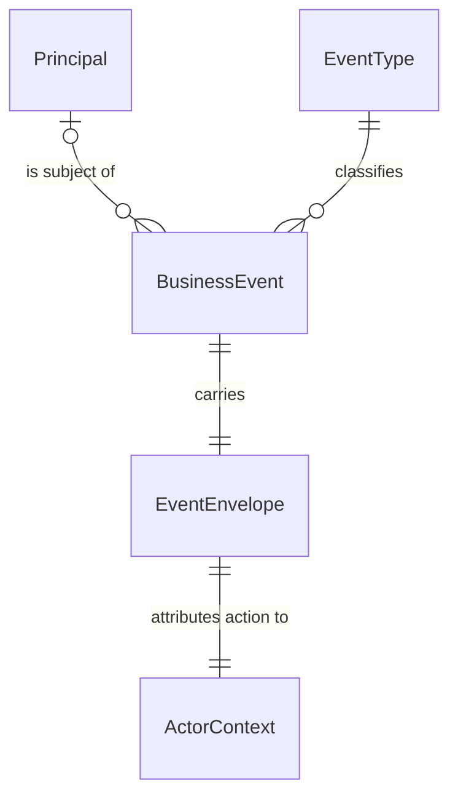
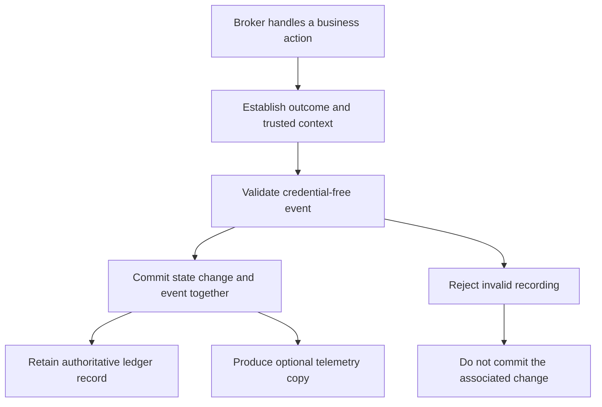

# Feature Specification: Business Event Ledger

**Feature Branch**: `048-business-event-ledger`

**Created**: 2026-09-25

**Status**: Draft

**Input**: User description: "A durable business event ledger for broker-produced security events, recorded atomically with state changes, queryable by principal, credential-free, subject to retention and principal erasure, and mirrored to existing telemetry without replacing existing logs."

## Clarifications

### Session 2026-09-25

- Q: After a crash between ledger commit and telemetry emission, must the broker emit the missing copy after restart? → A: Yes. The broker recovers missing copies after restart while the event remains retained and telemetry copying remains enabled. Retries can produce duplicates with the same event ID. The broker must never emit erased or retention-deleted events.

### Session 2026-09-26

- Q: Is the full event type name organization-specific or configurable per deployment? → A: Neither. Every type is the fixed functional name `agentic-identity-broker`, a dot, and a hyphenated event name. This format follows Zalando event type naming (Rule 213). The name identifies the product, not its hosting organization or deployment. No configuration changes it.

### Session 2026-10-04

- Q: Must the ledger pass a performance release gate or use a deployment performance profile? → A: `we dont need that gate and neither a performance profile` (user, 2026-10-04). This decision approves removal of the performance requirement and profile. It does not change recording safety or the accepted storage design.
- The active inventory contains 20 acceptance scenarios. US4-AS4, FR-008, and SC-007 keep their identifiers as retired criteria. No identifier is reassigned. The 5 ms p99 figure remains an unverified, non-blocking diagnostic goal.
- Scope decisions belong in this specification and `plan.md`. Retirement of the performance criteria requires no dedicated ADR. This feature excludes unrelated dependency updates, Docusaurus maintenance, and security-scanner exceptions.
- Feature security verification covers production broker code and vulnerabilities reachable through its runtime dependencies. This feature security scan excludes documentation tooling, CDK, mocks, and standalone ExtProc test infrastructure. Relevant findings still block acceptance. This feature introduces no blanket advisory exception.
- Focused security verification is local. This feature adds no CI security gate. Existing scheduled security scans on main remain unchanged.
- The ledger is part of the existing broker, not a standalone CLI. PostgreSQL-backed acceptance runs in the existing backend E2E CI job. No ledger-specific job is required.

### Session 2026-10-06

- The user removed feature-specific diagnostic suites, runner commands, and setup. No replacement performance suite is required. Historical measurements remain evidence only.
- All 20 active scenarios remain required in the existing backend E2E and integration lanes. `just test-e2e-backend 'business-event-ledger && !performance'` uses the `integration` tag by default. An explicit empty build-tag argument selects memory only.
- Use `just security broker` for production broker security and normal `just verify` for the shared verification gate. Accepted ADR 039's storage/security design remains unchanged.

## User Scenarios & Testing *(mandatory)*

### User Story 1 - Trust the Record of Security Changes (Priority: P1)

As a platform operator, I can rely on a record of every grant revocation, session termination, and approval decision. This record survives a broker crash immediately after commit of the change.

**Why this priority**: An incident record is trustworthy only if it records every committed change. Rolled-back changes cannot appear as completed actions.

**Independent Test**: Complete security workflows. Interrupt them before and after commit. After restart, compare the resulting business state with the retained events.

**Acceptance Scenarios**:

1. **US1-AS1 — Catalogue coverage**: **Given** the broker can run each of the 28 catalogued actions. **When** each action occurs through its business workflow. **Then** exactly one event of the corresponding type records that occurrence. The event has the required envelope and a valid type-specific data object.
2. **US1-AS2 — Crash after commit**: **Given** a grant revocation, session termination, or approval decision. **When** the change commits and the broker crashes before it sends a response or writes its existing log line. **Then** after restart, both the change and exactly one corresponding ledger event are present.
3. **US1-AS3 — Rollback**: **Given** a catalogued mutation. **When** its transaction rolls back, including because event validation or recording fails. **Then** neither the mutation nor its success event commits. The caller does not receive a successful result.
4. **US1-AS4 — Decision without mutation**: **Given** an exchange denial, impersonation denial, token request failure, or third-party refresh failure that changes no stored business state. **When** the broker completes that decision or failure outcome. **Then** it records exactly one corresponding denial or failure event independently of a rolled-back mutation. The event does not imply that an unsuccessful action succeeded.
5. **US1-AS5 — Competing transitions**: **Given** concurrent attempts to revoke the same grant, terminate the same session, or decide the same pending approval. **When** only one transition takes effect. **Then** only that transition produces its state-change event. An unchanged result does not produce a duplicate success event.
6. **US1-AS6 — Expiration**: **Given** a grant or approval becomes expired. **When** the broker recognizes the expiration through its existing lifecycle behavior. **Then** it records one expiration event. Further access or cleanup does not record that expiration again.
7. **US1-AS7 — Storage parity**: **Given** the in-memory backend. **When** the same catalogue workflows, rollbacks, and competing transitions run. **Then** their observable event contents and atomicity match the persistent backend for the lifetime of that process.

---

### User Story 2 - Investigate a Principal's Token Activity Safely (Priority: P1)

As a security engineer, I can find the agents that received exchanged tokens for a given user during a time range. I can distinguish the affected user from the caller. I can investigate without a log search or access to credentials.

**Why this priority**: The ledger must answer the incident question that motivates its creation. It must not become a new credential store.

**Independent Test**: Run exchanges for multiple users and agents, including delegated and denied requests. Then query the retained records with authorized operational database access.

**Acceptance Scenarios**:

1. **US2-AS1 — Scoped investigation**: **Given** successful and denied exchanges for multiple principals before, within, and after a selected time range. **When** an investigator selects one principal's successful `token-exchanged` events in that range. **Then** the results identify exactly the agents that received tokens for that principal. They exclude other principals and denied exchanges. They contain no credentials.
2. **US2-AS2 — Attribution and correlation**: **Given** a validated delegated exchange with a request SecurityContext. **When** the broker records its event. **Then** the subject identifies the affected principal. The actor identifies the authenticated caller, and `on_behalf_of` preserves delegation. The trace, IP, and normalized user-agent family match the authoritative request context, not unverified identity claims. If a span is available, it also matches that context.
3. **US2-AS3 — Credential exclusion**: **Given** representative inputs and failures for every catalogued type. These contain distinct access-token, refresh-token, client-secret, client-assertion, raw-JWT, authorization-code, and PKCE-verifier values. **When** those workflows record events and emit ledger telemetry. **Then** none of those values or credential-bearing payloads appears anywhere in the envelope, reasons, data, or telemetry copy. This exclusion includes credentials in arbitrary strings, such as user agents and upstream error text.
4. **US2-AS4 — Unavailable identities**: **Given** an unauthenticated failure, a background expiration, or an administrative action with no affected user. **When** the broker records the event. **Then** it explicitly represents unavailable subject or actor identity. It does not invent a user or trust a supplied identity claim. It retains the known resource and source context.
5. **US2-AS5 — Stable extensible contract**: **Given** previously recorded catalogue events. **When** the registry adds a further type and its published schema without a change to the ledger database structure. **Then** the broker can record valid events of the new type. Earlier events retain their original type and meaning. The broker rejects unknown types or invalid payloads before storage or ledger telemetry emission.

---

### User Story 3 - Enforce Retention and Principal Erasure (Priority: P2)

As a compliance owner, I can delete all events about one principal in one operation. Automatic time-based retention also applies.

**Why this priority**: Durable security records contain personal information and require an explicit, testable lifecycle.

**Independent Test**: Record events for several principals across retention boundaries. Erase one principal. Run retention with the default and a changed duration.

**Acceptance Scenarios**:

1. **US3-AS1 — Principal erasure**: **Given** one principal has events across multiple time partitions and event families. These include events that other actors performed on behalf of that principal. **When** an authorized operator completes one principal-erasure operation. **Then** no ledger event whose subject equals that principal remains. Events for other subjects remain unchanged. The same operation succeeds again with no matching records.
2. **US3-AS2 — Automatic retention**: **Given** events on both sides of the configured retention boundary. **When** retention maintenance runs with its default 90-day duration or a configured positive duration. **Then** maintenance drops eligible time partitions automatically. It removes no event younger than the retention duration. It removes expired events within the documented retention grace period.
3. **US3-AS3 — Erasure during recording**: **Given** event recording and principal erasure overlap. **When** erasure succeeds. **Then** all matching events ordered before the completion boundary of erasure are absent. A later legitimate event is a new occurrence, not a replay of an erased record.
4. **US3-AS4 — No resurrection**: **Given** erasure removed a principal's records or a partition expired. **When** the broker restarts or resumes deferred telemetry work. **Then** the broker does not recreate deleted events in the ledger or newly emit them from deferred ledger copies. Maintenance resumes without manual cleanup.
5. **US3-AS5 — Invalid retention configuration**: **Given** a non-positive or malformed retention duration. **When** the operator starts the broker with it. **Then** startup rejects the configuration. It does not silently disable retention or delete all history.

---

### User Story 4 - Preserve Monitoring While Adding Ledger Events (Priority: P2)

As an SRE, I continue to see the existing structured logs and telemetry signals. I receive a separate OpenTelemetry log record for each ledger event without a change to my telemetry destination configuration.

**Why this priority**: Durable records must not break existing dashboards or SIEM integrations.

**Independent Test**: Complete representative workflows with ledger telemetry enabled and disabled. Interrupt processing after commit but before telemetry emission. Restart the broker. Compare existing logs and signals. Correlate recovered ledger copies by event ID.

**Acceptance Scenarios**:

1. **US4-AS1 — Compatible additional signal**: **Given** working telemetry export. **When** a catalogued event commits. **Then** existing slog event lines retain their names, levels, messages, and fields. Existing telemetry remains available. One additional logical OpenTelemetry log record has EventName equal to the event type and the credential-free envelope as flat attributes.
2. **US4-AS2 — Independent disablement**: **Given** only the ledger telemetry copy is disabled. **When** a catalogued action occurs. **Then** its ledger event and existing logs and telemetry remain. The broker emits no additional ledger log record.
3. **US4-AS3 — Export failure, rollback, and crash recovery**: **Given** an unavailable telemetry destination, a business transaction rollback, or a broker crash after commit but before telemetry emission. **When** the broker processes the action or restarts with working telemetry and copying still enabled. **Then** destination failure cannot remove a committed ledger event or undo its business change. The broker never emits rolled-back events as committed ledger events. After restart, it automatically emits missing copies of retained events with the retry and deletion guarantees of FR-004.

**Retired scenario — US4-AS4 — Performance (not an active acceptance scenario):** The 2026-10-04 user decision retires the former deployment-baseline/5 ms gate. The 2026-10-06 decision also removes feature-specific diagnostic tools. Neither decision reduces the 20 active functional scenarios.

### Edge Cases

- A transaction commits but its response is lost. The retained event remains authoritative. A read of unchanged state must not create another state-change event. A genuinely new token issuance is a distinct occurrence, even after a caller retries a request.
- A request produces several distinct facts, such as an impersonation decision and a token exchange. Each catalogued fact has its own event. The same exchanged-token fact does not also have the label `token-issued`.
- An upstream provider can complete an action before a local commit fails. The atomicity promise covers broker-controlled state and the recorded broker outcome. It does not cover a distributed transaction with that provider.
- A failure outcome can occur without a domain-state mutation. Its event is not a success event rescued from a rolled-back transaction.
- When ledger storage is unavailable, the broker fails closed. It does not release a newly issued token or report a successful mutation without its record. The broker cannot promise a durable failure event for a storage outage in that unavailable store.
- The broker can discover an expired object lazily. `occurred_at` represents its effective expiry instant. `recorded_at` represents the time that the broker records that fact. Further discovery must not duplicate it.
- Missing request or span context remains absent. The broker does not fabricate correlation. Scheduled actions use a system actor.
- A user-agent string, upstream message, tool arguments, or URLs can contain credentials. Such untrusted content must not bypass the credential-free contract because its destination field is normally harmless.
- Principal erasure is subject-based, not an actor-ID search. An administrator who acts on behalf of another principal does not become the event subject.
- Retention and erasure are permitted deletions from an otherwise immutable ledger. Deletion of an agent, grant, session, or approval must not cause cascading deletion of event records.

## Requirements *(mandatory)*

### Functional Requirements

This specification preserves the original FR-1 through FR-8 identifiers. The 2026-10-04 user decision retires FR-008. FR-001 through FR-007 remain active.

- **FR-001 — Atomic recording**: Every catalogued broker state transition MUST write exactly one corresponding event in the same database transaction as the transition. Event validation or persistence failure MUST prevent commit. Rollback MUST leave neither the transition nor its success event. The event MUST remain after a crash immediately after commit.
- **FR-002 — Existing logs**: Existing slog `event` lines MUST continue unchanged during the deprecation period. This feature MUST NOT rename, replace, suppress, or remove them. It MUST NOT establish a removal date.
- **FR-003 — Credential-free records**: Events and ledger telemetry copies MUST NOT contain the following credentials. This prohibition applies to envelope fields, nested data, reasons, and client context. The credentials are access tokens, refresh tokens, client secrets, client assertions, raw JWTs, authorization codes, and PKCE verifiers. Automated behavioral coverage MUST prove this for every one of the 28 catalogued types, including applicable error paths.
- **FR-004 — Ledger telemetry copy**: With copying enabled, each committed ledger event MUST produce one ledger telemetry copy through existing telemetry configuration. The copy MUST be one logical OpenTelemetry log record. Its EventName MUST equal the full event type. Its envelope MUST use flat attributes. The copy MUST be independently disableable. It MUST NOT precede commit, change ledger authority, or make business commit depend on collector availability.

  If the broker crashes after commit but before emission, it MUST automatically recover the missing copy after restart. It MUST emit that copy while the event remains retained and copying remains enabled. Retries MAY produce duplicate copies, but MUST preserve the original event ID. Recovery MUST NOT emit erased or retention-deleted events. This requirement does not promise exactly-once delivery by external collectors.
- **FR-005 — Retention**: Ledger retention MUST default to 90 days and accept a configurable positive duration. It MUST automatically remove expired time partitions by partition drop, not row-by-row retention deletes. Retention MUST measure age from `recorded_at`. Retention must not remove an event early.

  During normal operation, removal MUST occur within 24 hours after the retention deadline. After downtime, overdue maintenance MUST resume automatically. The Retention clock and grace assumption states this default.
- **FR-006 — Principal erasure**: One authorized operation MUST remove all ledger events whose `subject` equals the selected principal across all retained partitions. It MUST be idempotent and leave other subjects unchanged. It MUST provide a completion boundary relative to concurrent event recording. It MUST NOT create a replacement subject event that immediately defeats erasure. This operation is distinct from time-based partition retention.
- **FR-007 — In-memory support**: The in-memory storage backend MUST support recording, validation, scoped querying, subject erasure, and logical retention. It MUST provide the same observable business and atomicity semantics as PostgreSQL. It MUST support unit and end-to-end workflows without PostgreSQL. Persistence across process restart and physical partition drops apply only to PostgreSQL.
- **FR-008 — Retired recording-overhead gate (non-binding)**: The former 5 ms p99 release requirement and deployment-profile approval are retired. The 5 ms figure remains unverified and non-blocking. The user removed the feature-specific diagnostic tools. Historical distributions do not establish deployment-load acceptance.

  Active E2E scenarios continue to prove event completeness, atomicity, and credential safety. Recording remains mandatory and has no measurement bypass.
- **FR-009 — Catalogue**: The initial catalogue MUST include all 28 types in the Broker Event Catalogue. Full names MUST use the fixed functional name `agentic-identity-broker`, a dot, and the listed event name. This format follows Zalando event type naming (Rule 213).

  Names MUST NOT depend on the hosting organization or deployment. They MUST NOT be configurable. A new event type MUST NOT require a ledger database migration. Published names and meanings MUST NOT be reassigned.
- **FR-010 — Envelope**: Every event MUST conform to the Event Envelope Contract. It MUST preserve subject, actor, source, business references, and authoritative correlation. It MUST NOT reconstruct identities from unverified credentials.
- **FR-011 — Per-type schemas**: Each event's `data` MUST pass validation against its registered per-type JSON schema under `api/`. The broker MUST reject unknown types and schema-invalid data before recording or ledger telemetry emission. Schemas MUST define allowed fields and forbid unspecified data fields. New optional data must not invalidate existing records.
- **FR-012 — Investigation**: Authorized operational queries MUST support exact subject, event type, outcome, and occurrence-time filtering. They MUST use the half-open time interval `[start, end)`. They MUST order results deterministically by `occurred_at` then event ID.

  Queries select null subjects with an explicit no-subject selector. No query spans all subjects implicitly. Successful exchange records MUST identify their receiving agent. This feature introduces no user-facing or new HTTP read API.
- **FR-013 — Non-mutating outcomes**: Catalogued requests, denials, failures, and token issuance without another persisted mutation MUST still be durable ledger occurrences. Without a committing business transaction, the event MUST commit as its own recorded outcome before the broker completes the request. A rolled-back state change MUST NOT appear as successful. Unavailable storage MUST never cause a denied action to become allowed.
- **FR-014 — Exactly one occurrence**: Duplicate observations of the same effective state transition MUST NOT create multiple events. Concurrent losing transitions and no-op mutations MUST NOT create success events. Distinct business facts within one request MAY each produce their own corresponding type. This requirement does not introduce general request-idempotency behavior.
- **FR-015 — Source boundary**: This feature records only broker-produced events. Broker state changes that a gateway requests remain broker-produced, including broker approval requests and consumption. This feature introduces no external producer ingestion capability.
- **FR-016 — Immutable authority**: Committed events MUST be immutable except for retention and subject erasure. Later activity views, signal transmission, and exports MUST be able to use these records without reconstruction of history from existing logs. This feature does not implement those projections or backfill historical logs.
- **FR-017 — Deletion and deferred work**: Retention or erasure MUST NOT let pending ledger-derived work resurrect deleted records or newly emit an erased record. Copies already delivered to external observability systems are outside ledger erasure. Those systems remain responsible for retention and erasure of their copies.

#### Broker Event Catalogue

The following are event names, not complete type names. Each full type is `agentic-identity-broker.<event name>`, for example `agentic-identity-broker.grant-created`. The precise schema registry layout is a planning decision, not permission to vary names per producer or deployment.

| Family | Event name | Recorded business fact | Outcome |
|--------|-------------|------------------------|---------|
| Consent | `grant-created` | The broker commits a new user-to-agent delegation. | success |
| Consent | `grant-updated` | An existing delegation's effective permissions or validity changes. | success |
| Consent | `grant-revoked` | The broker explicitly revokes a delegation. | success |
| Consent | `grant-expired` | A delegation reaches expiry and the broker recognizes it. | success |
| Third-party sessions | `session-established` | The broker establishes a usable third-party session. | success |
| Third-party sessions | `session-refreshed` | The broker accepts and commits refreshed session state. | success |
| Third-party sessions | `session-refresh-failed` | A third-party session refresh attempt fails. | failure |
| Third-party sessions | `session-terminated` | The broker ends a third-party session. | success |
| OAuth2 | `authorization-requested` | The broker accepts an authorization request for processing. | pending |
| OAuth2 | `token-issued` | The broker completes a non-exchange token issuance. | success |
| OAuth2 | `token-request-failed` | A token request fails without a more specific exchange-denial classification. | failure |
| OAuth2 | `token-exchanged` | The broker completes a token exchange for a receiving agent. | success |
| OAuth2 | `token-exchange-denied` | Authentication or authorization controls refuse an exchange. | denied |
| OAuth2 | `impersonation-granted` | The broker permits an impersonation decision. | success |
| OAuth2 | `impersonation-denied` | The broker refuses an impersonation decision. | denied |
| Approvals | `approval-requested` | The broker creates a new pending approval. | pending |
| Approvals | `approval-approved` | The broker approves a pending approval. | success |
| Approvals | `approval-denied` | The broker denies a pending approval. | denied |
| Approvals | `approval-consumed` | The broker consumes a single-use approval. | success |
| Approvals | `approval-revoked` | The broker revokes an existing approval. | success |
| Approvals | `approval-expired` | An approval reaches expiry and the broker recognizes it. | success |
| Administration | `agent-registered` | The broker registers an agent. | success |
| Administration | `agent-updated` | An agent's effective configuration changes. | success |
| Administration | `agent-deleted` | The broker deletes an agent. | success |
| Administration | `credential-generated` | The broker generates an agent credential. | success |
| Administration | `credential-rotated` | The broker rotates an agent credential. | success |
| Administration | `credential-revoked` | The broker revokes an agent credential. | success |
| Administration | `signing-key-promoted` | A signing key becomes the active signing key. | success |

`success` means successful completion of the named action. For example, successful revocation does not mean that access was granted. A recorded impersonation permission decision does not claim that later token issuance succeeded.

#### Event Envelope Contract

All fields in this table belong to one common envelope. Nullable identity and missing-context rules are explicit assumptions. These rules prevent fabricated attribution for system and early-failure events.

| Field | Meaning and presence rule |
|-------|---------------------------|
| `id` | Required, immutable, time-ordered unique event identifier. Identifier order is not a guarantee of global causal order. |
| `type` | Required, full registered event type `agentic-identity-broker.<event name>`. |
| `source` | Required, stable identification of the producing broker, not the calling actor or a credential-bearing request URL. |
| `occurred_at` | Required UTC instant of the business fact. For expiration events, the effective expiry time. |
| `recorded_at` | Required UTC instant that the ledger assigns at recording. Retention age uses this value. |
| `subject` | A required field for the affected principal. If no principal applies or the broker cannot establish one safely, the value is null. An agent ID never substitutes for a principal to fill the field. |
| `actor.kind` | Required. One of `user`, `admin`, `agent`, `gateway`, `system`, or `policy`. |
| `actor.id` | A required field for the initiating actor. If the broker does not establish its identity, the value is null. Automated work has a stable system identity. |
| `actor.on_behalf_of` | The principal represented by a delegated action. If no established delegation applies, the value is null. |
| `agent_id` | Generally optional. Required for a successful token exchange to identify the receiving agent. Also required for agent-specific events where known. |
| `gateway_client_id` | Optional authenticated gateway client reference when known. Its presence does not make the gateway the event producer. |
| `service_id` | An optional third-party service reference. If known for a session event, the broker supplies it. |
| `permission_set_ids` | Optional collection of relevant permission-set identifiers. |
| `grant_id`, `session_id`, `approval_id` | Generally optional. The corresponding reference is required for an event about that existing object, including after its deletion. `session_id` refers to the third-party session. |
| `mcp_session_id`, `agent_session_id` | Optional session correlation identifiers when already available to the broker. |
| `outcome` | Required. One of `success`, `failure`, `denied`, or `pending`, according to the catalogue. |
| `reason_user` | One required credential-free sentence safe for the affected user. It must not expose administrator-only details. |
| `reason_admin` | One required credential-free sentence that explains the operational reason. It is not raw errors or payload dumps. |
| `trace_id`, `span_id` | If available, request SecurityContext correlation values. If unavailable, absent values. Never invent a span. Never substitute an unrelated trace. |
| Client context: `ip`, `user_agent` | If available and safe to retain, request client information under established trusted-proxy rules. Omit or sanitize credential-bearing content. Background actions have no fabricated client. |
| `data` | A required object with only the allowed, credential-free fields for the registered event schema. An empty object is valid only where that schema permits it. |

The OpenTelemetry copy MUST preserve the distinction between absent and supplied values. It MUST flatten nested field paths deterministically without collisions, including actor, client context, and type-specific data. Planning defines attribute encoding and limits in the contract design. Silent loss of required envelope fields is not permitted.

### Domain Model *(if applicable - document before API or database design)*

**Domain Entity Diagram**:

```mermaid
erDiagram
    Principal o|--o{ BusinessEvent : "is subject of"
    EventType ||--o{ BusinessEvent : "classifies"
    BusinessEvent ||--|| EventEnvelope : "carries"
    EventEnvelope ||--|| ActorContext : "attributes action to"
```

**Activity / Flow Diagram**:

```mermaid
flowchart TD
    A["Broker handles a business action"] --> B["Establish outcome and trusted context"]
    B --> C["Validate credential-free event"]
    C --> D["Commit state change and event together"]
    D --> E["Retain authoritative ledger record"]
    D --> F["Produce optional telemetry copy"]
    C --> G["Reject invalid recording"]
    G --> H["Do not commit the associated change"]
```

For an outcome without a persisted state change, the event itself is the committed fact. Telemetry is a projection, not part of the authority for business state.

**Entities**:
- **Business Event**: One uniquely identified occurrence of a catalogued business fact, immutable after commit until authorized lifecycle deletion.
- **Event Type**: A stable named meaning and its allowed data contract. A catalogue entry does not require a database structure change.

**Aggregates**:
- **Business transition and its event**: One consistency boundary for a broker-owned mutation. Both commit or neither does. The ledger does not replace the grant, session, approval, agent, credential, or signing-key model.

**Value Objects**:
- **Event Envelope**: Immutable identification, time, attribution, references, outcome, reasons, correlation, and type-specific data.
- **Actor Context**: Initiator kind and identity plus an optional represented principal, distinct from the affected subject.
- **Retention Policy**: Positive duration and bounded deletion grace for recorded events.

**Domain Events**: The 28 facts in the Broker Event Catalogue are the scope of this feature. Operational access logs and unlisted security observations remain outside this initial catalogue.

### Configuration Requirements *(if applicable - document before implementation)*

- **CFG-001 — Retention duration**: An operator-configurable positive duration, default 90 days. For example, 30 days shortens retained history without manual cleanup. Invalid values MUST fail startup.
- **CFG-002 — Ledger telemetry copy**: A boolean control, default enabled. Operators can disable it independently of ledger persistence, existing slog output, tracing, and other telemetry. For example, a disabled control suppresses only the additional ledger log records.
- **CFG-003 — Existing configuration system**: These controls MUST follow the existing broker conventions and precedence for file, environment, and command-line configuration. Deployment configuration, the configuration reference, and examples MUST expose and document the same configuration before implementation completion.

Exact configuration keys and example YAML belong to the configuration contract in the plan. This specification adds no second configuration mechanism or separate telemetry destination.

### API Requirements *(if applicable - design before database)*

- **API-001**: Publish the common event envelope contract and every per-type JSON schema under `api/` before producer implementation. These are event contracts, not new HTTP endpoints.
- **API-002**: This feature adds no user activity read API, external event ingestion API, signal transmission API, or export API. Operational database investigation and authorized principal erasure MUST work without a new public HTTP interface.
- **API-003**: Before implementation, a later proposal to change an existing HTTP contract requires stakeholder agreement and the appropriate OpenAPI updates. This specification does not implicitly approve a change.

### Database Requirements *(if applicable)*

- **DB-001**: The durable ledger MUST live in the broker's PostgreSQL and share the committing transaction of each corresponding broker-owned state change.
- **DB-002**: Initial ledger and partition support changes MUST use repository-standard reversible migrations under `migrations/`. Real PostgreSQL coverage MUST verify application, rollback, and application again.
- **DB-003**: FR-005 partition-drop retention and FR-006 principal erasure operate on the same partitioned ledger tables. Erasure MUST cover every retained partition.
- **DB-004**: Stored events MUST remain independently queryable after updates or deletion of the referenced business objects. The design MUST NOT depend on a join to a still-existing session or grant to find the event subject.
- **DB-005**: PostgreSQL integration coverage MUST prove FR-001 atomicity and crash durability, FR-005 partition retention, and FR-006 subject erasure. It MUST also prove FR-014 occurrence uniqueness under competing transitions. In-memory coverage MUST prove the corresponding FR-007 logical semantics.

### Security Requirements *(mandatory for security-critical features)*

- **SR-001**: Ledger persistence is mandatory for catalogued actions and fails closed as FR-001 and FR-013 require. A disabled ledger telemetry copy (CFG-002) MUST NOT disable persistence.
- **SR-002**: Attribution MUST come from established broker identity and request context. Unverified token claims or caller-supplied forwarding metadata MUST NOT become authoritative event identity or client IP.
- **SR-003**: Type schemas and event construction MUST allow only intentional fields. Generic serialization MUST NOT bypass the credential-free rule for credential objects, request bodies, headers, token responses, upstream errors, or approval arguments.
- **SR-004**: User-facing reasons MUST NOT reveal administrative details. Neither reason field is a channel for raw untrusted text or secret-bearing diagnostic output.
- **SR-005**: Operational querying and erasure MUST remain restricted to authorized operational access. Erasure MUST use an exact subject, not loose matches on actor, email text in data, or trace attributes.
- **SR-006**: Ledger principal deletion does not erase previously emitted external logs and telemetry. Operators MUST receive this information. This feature makes no claim of system-wide erasure.

### Key Entities *(include if feature involves data)*

- **Business Event / Event Envelope**: The retained, credential-free historical record in the Event Envelope Contract.
- **Principal**: The affected identity for investigation and erasure. It is independent of the actor who ran the action.
- **Event Type and Schema**: The stable catalogue meaning and validated data contract.
- **Existing Business Objects**: Agents, grants, third-party sessions, approvals, credentials, and signing keys remain their existing concepts. Events retain safe references, not credential material or mutable object snapshots.

When implementation changes those boundaries, the constitution requires new domain vocabulary and architectural implications in `ARCHITECTURE.md`. Implementation MUST incorporate this information.

## Success Criteria *(mandatory)*

### Measurable Outcomes

- **SC-001 — Complete history**: All 28 catalogued business facts have acceptance coverage, with exactly one retained event per occurrence. Committed changes have zero missing events. Rolled-back changes have zero success events. This coverage includes post-commit crash cases.
- **SC-002 — Incident investigation**: The investigator uses a known multi-user, multi-agent incident dataset. They identify 100% of agents that received exchanged tokens for the selected principal and time range. Results include zero unrelated users or unsuccessful exchanges. The investigator does not consult application logs.
- **SC-003 — Credential safety**: Verification covers every catalogued type and applicable failure path. It finds zero prohibited credential values or credential-bearing payloads in retained events or their ledger telemetry copies.
- **SC-004 — Erasure completeness**: One completed subject-erasure operation leaves zero matching retained events across the ledger. It removes zero events with other subjects. If the operation runs again or the broker restarts, neither recreates records.
- **SC-005 — Retention compliance**: With default configuration, retention removes no event before 90 days of recorded age. During normal operation, it removes all expired records within the next 24 hours without manual cleanup. A changed positive duration obeys the same boundary rules.
- **SC-006 — Monitoring continuity**: In supported normal operation, every committed event has one correlated ledger telemetry copy with copying enabled and none with copying disabled. Existing log and monitoring signals remain unchanged in both modes.

  After a crash between commit and telemetry emission, the broker restarts with working telemetry and copying still enabled. It automatically produces missing copies for 100% of still-retained events, with the retry and deletion guarantees of FR-004. Collector failure does not compromise the durable history.
- **SC-007 — Retired responsiveness criterion (non-binding)**: The former deployment-load 5 ms p99 success criterion is retired. Historical measurements do not prove achievement of that goal. No numeric performance result or deployment profile blocks functional acceptance. Completeness, atomicity, and credential safety remain required by the active criteria.
- **SC-008 — Backend consistency**: The same business acceptance journeys produce equivalent event contents, query results, erasure results, and logical retention behavior with either supported storage backend. Only restart durability and physical partition operations differ.

## Assumptions

- **Scope boundary**: The 28 supplied types define “every security-relevant state change” for this feature. This specification does not silently add unlisted audit observations. This feature does not backfill existing logs.
- **Feature numbering**: This feature uses `048-business-event-ledger`. This is the next number after the live remote and local allocations inspected during specification. The originally supplied numbers for external ingestion, user activity, SSF, and export identify separate planned work. This specification does not allocate those numbers. Future features must obtain non-conflicting numbers independently.
- **Operational users**: Investigation and principal erasure use authorized operational access, not new end-user interfaces. Principal deletion means completion of its ledger-subject erasure. This feature introduces no broker-wide identity-deletion workflow or permanent ban on future events for that identity.
- **Subject availability**: Administrative actions can concern an agent or signing key instead of a user. Early denials can precede authenticated identity. In those cases, `subject` and `actor.id` are explicitly nullable. The broker must never omit authenticated affected principals because the caller is different.
- **Non-mutating outcomes**: Denials, failures, accepted authorization requests, and token issuance can have no existing business-state transaction. Their committed ledger record remains required. External providers do not participate in broker database atomicity.
- **Expiration semantics**: This feature records expiration at the existing broker recognition point, including lazy recognition. It introduces no new grant or approval expiration scheduler solely to make the event occur at wall-clock expiry.
- **Retention clock and grace**: Retention uses recording time so delayed discovery does not immediately discard history. The assumed maximum grace is 24 hours after the configured age, with no early deletion. Physical partition granularity and the maintenance schedule must satisfy that bound. They must not extend it cumulatively.
- **Telemetry boundary**: “One log record” means one logical ledger-derived record identified by event ID. It does not promise exactly-once transport or collector storage. FR-004 specifies crash recovery of missing copies. Planning selects the recovery mechanism, not permission for crash-related gaps. It MUST preserve FR-017 deletion guarantees. The durable ledger cannot depend on telemetry delivery.
- **SecurityContext dependency**: Request attribution and correlation reuse feature 033's SecurityContext semantics. [ADR 033](../../adrs/033-request-security-context-propagation.md) has status **Proposed**, not Accepted. Planning must verify the implemented identity, trace, and span contract. The proposal does not prove that every requested field is available.
- **Governance dependencies**: The [constitution](../../.specify/memory/constitution.md) and [architecture](../../ARCHITECTURE.md) govern implementation. Each acceptance scenario requires its corresponding end-to-end scenario before implementation. Focused integration checks cover database-specific guarantees.
- **Performance scope**: No deployment performance profile, approval, performance release gate, or feature-specific diagnostic suite is required. Historical measurements do not establish the unverified 5 ms p99 goal.
- **Explicit delivery constraints**: PostgreSQL, in-memory parity, and same-transaction recording are user-mandated constraints. So are slog compatibility, OpenTelemetry EventName and attributes, JSON schemas under `api/`, and partition-drop retention. They are not implementation choices introduced by this specification.

### Out of Scope

- Events produced by ExtProc, OPA, or agentgateway and any external-producer ingestion interface.
- A user-facing activity API or activity UI.
- Shared Signals Framework transmission.
- Audit export formats or an export service.
- Replacement or removal of legacy slog events, historical log import, and cleanup of copies already delivered to external systems.

### Decisions Reserved for Planning

- The crash-safe telemetry handoff and recovery mechanism preserves ledger atomicity and automatic recovery of missing copies. It preserves stable event IDs on retries and suppresses erased or retention-deleted events. Best-effort after-commit publication without recovery does not satisfy FR-004.
- Compatible schema evolution rules and the schema registry location within `api/`.
- Partition granularity and retention ownership, including pg_partman versus broker-scheduled maintenance, subject-erasure concurrency, and the 24-hour grace bound.
- The recorder port and transaction boundary use the existing builder for injection, not a parallel wiring mechanism.

These are ADR candidates for the plan step, not selected designs. Their inclusion here authorizes no implementation or public API change.
