# Tasks: Business Event Ledger

**Input**: Design documents from `specs/048-business-event-ledger/`: `spec.md`, `plan.md`, `research.md`, `data-model.md`, `quickstart.md`, and `contracts/`.

**Prerequisites**: Follow `.specify/memory/constitution.md`, `ARCHITECTURE.md`, relevant accepted ADRs, and the nearest agent context before changing an area. ADR 037 is Accepted (maintainer approval, 2026-09-26) and binding; any deviation requires a superseding ADR. ADR 033 remains Proposed unless maintainers explicitly accept it. Planning checkmarks are not implementation evidence.

**Tests**: Required explicitly by FR-003, DB-002/005, the acceptance scenarios, and Constitution VIII/XIII. Write compiling, semantically failing tests before the corresponding implementation; retain red/green evidence. No skipped scenarios, placeholder failures, source-text assertions, test-only production APIs, or weakened expectations. Phase 2f establishes all 21 acceptance journeys before feature behavior; each story then adds focused tests before its implementation.

**Organization**: Shared prerequisites precede four user-story phases in specification priority order. Phase 0 is the plan-required, separately reviewed behavior-preserving refactor, and it starts by capturing the legacy slog baseline. Phase 2.7 is intentionally omitted: no empty CRUD handlers, public ledger endpoint, or separately delivered scaffold is needed.

## Format: `[ID] [P?] [Story] Description`

- `[P]` marks tasks that can run concurrently in the explicitly listed ready wave, with disjoint file ownership. It never bypasses prerequisite tests or gates.
- `[US1]` through `[US4]` identify tasks in story phases only. Shared acceptance setup is in Phase 2f, as required by the template.
- Paths are repository-relative. New filenames below are planned deliverables, not claims that those files already exist. Existing source integration targets come from `contracts/producers.md` and `research.md`.
- One integration owner handles shared ports, factory, builder, migration, and shared E2E files. Every exported-symbol change starts with reference discovery and migrates all callers; no compatibility aliases or second transaction stack.
- Each ledger operation has exactly one implementing task, which follows its tests. See "Ledger operation ownership" under Dependencies.

## Phase 0: Pre-implementation Refactoring [REQUIRED FOR THIS FEATURE]

**Purpose**: Isolate necessary structural changes in a separate PR before feature behavior. Preserve HTTP responses, security side effects, and all existing slog names, levels, messages, and fields. Real memory rollback, nested ownership behavior, and ledger recording belong to later red/green tasks, not this refactor.

- [ ] T001 Before any refactor, record the pre-feature revision (the current `main` commit) and capture the legacy slog contract for every catalogued workflow: run the existing E2E journeys that exercise those workflows with JSON log output through the existing bootstrap log capture in `tests/e2e/bootstrap/logger.go`, and commit the reviewed event name, level, message, and field keys (never values) per workflow as `tests/e2e/fixtures/business_event_ledger_legacy_slog.go`. Mark workflows that emit no existing event line explicitly. This fixture is the FR-002 baseline for T005 and US4-AS1; keep no capture tooling in production code.
- [ ] T002 Generalize the existing transaction names/context/executor seams in `internal/ports/storage.go`, `internal/adapters/storage/postgres/oauth2_transaction.go`, `internal/adapters/storage/factory.go`, and `internal/domain/oauth2server/fosite_storage.go`; use reference discovery to migrate all existing callers to the shared names without changing transaction behavior, and document the pinned Fosite failure-side revocation boundaries in `specs/048-business-event-ledger/contracts/producers.md`.
- [ ] T003 Extract credential generation, rotation, and revocation policy from `internal/adapters/http/handlers/admin/client_credentials_handler.go` into `internal/domain/oauth2server/credential_service.go`, inject it through `internal/app/builder.go`, and retain the handler's response/log behavior without adding ledger calls yet.
- [ ] T004 Extract the proxy transport/domain completion seam through `internal/ports/oauth2_token_proxy.go` and `internal/domain/oauth2/token_outcome_service.go`, adapting `internal/adapters/http/enduser/token_grant_strategy.go`, `internal/adapters/http/enduser/oauth2_token.go`, and `internal/app/builder.go` without adding recording or changing response behavior yet.
- [ ] T005 Run `just check`, the smallest affected existing test commands, and the existing credential/local/proxy/hybrid OAuth2 HTTP journeys after T002–T004; compare their slog output with the T001 fixture, record unchanged behavior, and submit the isolated refactor PR with evidence linked from `specs/048-business-event-ledger/quickstart.md` before feature work proceeds.

**Checkpoint**: Refactor reviewed independently; no new ledger behavior, no remaining obsolete transaction names, and slog output identical to the T001 baseline.

## Phase 1: Setup (Shared Infrastructure) [CUSTOMIZABLE]

**Purpose**: Project initialization and basic structure

- [ ] T006 Promote the existing pinned `github.com/google/jsonschema-go v0.4.2` dependency to direct in `go.mod` and update `go.sum` only if dependency tooling requires it; retain existing Go, UUID, sqlx, pgx, Fosite, and OTel versions without introducing a second validator.
- [ ] T007 Confirm migration number 035 remains free (the unmerged `origin/046-cimd-upstream-client` branch holds 033 and 034), reuse the T001 pre-feature revision as the performance comparison baseline, and record exact validation commands and the revision in `specs/048-business-event-ledger/quickstart.md`. Request the operator-approved deployment profile for US4-AS4 from the operations owner of the target deployment, with the fields listed in quickstart section 6, and record the approver, approval date/reference and profile location in its deployment-profile table; if no approved profile can be obtained, record it there as an open release blocker for T095. If 035 is occupied, choose the next number that is free on `main` and all open branches, and update migration paths in `specs/048-business-event-ledger/plan.md`, `specs/048-business-event-ledger/data-model.md`, `specs/048-business-event-ledger/research.md`, and this task list before implementation.

## 🔒 Phase 2: Design Preconditions (Blocking Prerequisites) [MANDATORY]

**Purpose**: Domain model, configuration, API, and database design MUST all be complete before implementation

**⚠️ CRITICAL**: No code implementation can begin until this entire phase is complete

**🔒 CONSTITUTION REQUIREMENT**: This phase maps directly to the constitution PRECONDITIONS checklist. All sub-phases (2a-2f) MUST be included in every tasks.md, though specific task details should be adapted to the feature.

**Feature note**: The behavior-preserving Phase 0 exception does not authorize feature production code. The compile-only contract surface in T014 is the constitution-permitted minimal structure for compiling acceptance tests; it has no ledger behavior and cannot be delivered or marked as a finished implementation.

### Phase 2a: Domain Model & Glossary [MANDATORY]

**Constitution Reference**: Principles II (Architecture Documentation), V (Domain-Driven Design & Glossary Management)

**Required Tasks** (adapt descriptions to your feature):

- [ ] T008 Update `ARCHITECTURE.md` with Business Event, Event Type, Event Envelope, Actor Context, Delivery Reference, Ledger Telemetry Copy, and Retention Policy glossary entries and the bounded-context/transaction/lifecycle design from accepted ADR 037 and `specs/048-business-event-ledger/data-model.md`, described as accepted design that is not yet deployed; distinguish ledger caller from SecurityContext Actor and document the 5 ms p99 and retention guarantees. Mirror the new glossary terms in the root `AGENTS.md` Domain Glossary and add ADR 037 to its ADR Decision Index (Principles II, V).

**Checkpoint**: Domain model complete and documented

### Phase 2b: Configuration Design [MANDATORY]

**Constitution Reference**: Principle VII (Configuration-Driven Design)

**Required Tasks** (adapt descriptions to your feature):

- [ ] T009 [P] Publish runnable default and shorter-retention/disabled-copy examples in `examples/config/business-event-ledger.yaml` and `examples/config/README.md`, and document both settings, exact environment/CLI mappings, precedence, coordinated retention rollout, and the absence of a persistence-disable switch in `docs/configuration.md` using `specs/048-business-event-ledger/contracts/configuration.md` (Principle VII).
- [ ] T010 [P] Add documented `broker.businessEvents.retention` and `broker.businessEvents.telemetryCopyEnabled` values to `charts/agentic-identity-broker/values.yaml` and render them in `charts/agentic-identity-broker/templates/configmap.yaml`. Add the optional `migration.grants.businessEvents.readerRole` and `migration.grants.businessEvents.erasureRole` values from `specs/048-business-event-ledger/contracts/configuration.md`; their empty defaults grant nothing, and T081 renders them. Document all four values, the PostgreSQL-only migration-owned maintenance design, and the responsibility of a custom `migration.grants.sql` to apply ledger restrictions in `charts/agentic-identity-broker/README.md`; preserve explicit false and keep all ExtProc settings out (Principle VII).

**Checkpoint**: Configuration requirements designed with YAML examples and the applicable deployment contract documented

### Phase 2c: API Design [MANDATORY]

**Constitution Reference**: Principles IV (API Documentation & OpenAPI Transparency), X (API-First Development)

**Required Tasks** (adapt descriptions to your feature):

- [ ] T011 Record the ADR 037 acceptance reference (maintainer approval, 2026-09-26) and obtain and record stakeholder review references for `specs/048-business-event-ledger/contracts/events.md` and `specs/048-business-event-ledger/contracts/storage.md`; check `api/enduser/openapi.yaml` and `api/admin/openapi.yaml` for the existing fail-closed response forms, record that no new HTTP/CLI read/erase API is intended, and gate any additional public behavior change on separate confirmation, because ADR acceptance does not approve public API changes (Principles II, IV, X).
- [ ] T012 Publish all 30 reviewed schema files from `specs/048-business-event-ledger/contracts/schemas/` under `api/events/v1/` and synthetic examples from `specs/048-business-event-ledger/contracts/examples.json` under `api/events/v1/examples.json` before producers; retain the URN schema IDs, the fixed type names and source, closed fields, and compatible-evolution rules (Principles IV, X).

**Checkpoint**: APIs designed and confirmed by user/stakeholder

### Phase 2d: Database Design [MANDATORY]

**Constitution Reference**: Principle IX (Persistence Pattern Consistency & Database Migration Management)

**Required Tasks** (adapt descriptions to your feature):

- [ ] T013 Confirm the numbered up/down migration design in `specs/048-business-event-ledger/data-model.md` and `specs/048-business-event-ledger/contracts/storage.md`, including paired six-hour partitions, the partition-pair, drop-free provisioning, and maintenance functions, immutable row protection, policy precision, business-row expiry markers and their separate ISP ports, lock ordering, privilege separation and operational roles, no event cascade FKs/default partition, and destructive-history rollback acknowledgement. Foundation implementation is T036; the erasure function, retention drops, and privileges follow their US3 tests in T076, T077, and T081 (Principle IX).

**Checkpoint**: Database schema designed, migrations documented

### Phase 2e: Frontend/Design System Review [MANDATORY IF FRONTEND]

**Constitution Reference**: Principle XI (Design System Compliance & Consistency)

**Required Tasks** (if feature includes frontend components):

Not applicable: no frontend, UI route, styling, Playwright scenario, or screenshot changes are authorized by this feature. Preserve this boundary; do not add frontend work merely to fill the template (Principle XI).

**Checkpoint**: Design system usage planned (if applicable)

### Phase 2f: E2E Acceptance Test Design [MANDATORY]

**Constitution Reference**: Principle XIII (End-to-End Acceptance Testing & Spec Traceability)

**Required Tasks** (adapt descriptions to your feature):

**Execution**: T014 declares the compile-only contract surface. T015–T016 prepare the harness and lanes. T017–T020 then author all scenario tests before T021 closes the semantic-red gate. Shared E2E files are edited serially. Use real HTTP workflows through app.Builder, exact expected facts, existing fixtures/bootstrap, hierarchical Ginkgo Describe/Context/It, the Ginkgo label `business-event-ledger` on every ledger spec, and one scenario-reference comment per It. Backend/workflow variants belong inside that scenario, not duplicate scenario IDs. Each backend iteration inside an It bootstraps its own server and storage and releases them with `DeferCleanup`; iterations share no state (Principle XIII isolation).

- [ ] T014 Declare the compile-only contract surface that the acceptance harness calls, with no ledger behavior. Add `BusinessEventID` to `internal/domain/id/gen_ids.go` and regenerate; it keeps the generator's default constructor until T023. Declare the envelope, subject-selector, and query value types in `internal/domain/model/business_event.go` and the ledger repository and lifecycle port signatures in `internal/ports/storage.go`. Add inert memory and PostgreSQL accessors in `internal/adapters/storage/factory.go`, whose reads return empty results and whose writes nothing calls yet. In `internal/app/builder.go`, expose the ledger service on `app.App` next to the existing domain services, with lifecycle operations that change nothing, and add `Builder.WithBusinessEventSchemas(fs.FS)` accepting offline schema sources. Scenarios must then fail on absent ledger behavior, not on compilation. Add no TODO markers; T031, T039–T042, T068, and T075 replace every inert part.
- [ ] T015 Extend `tests/e2e/bootstrap/test_server.go` and add the ledger harness. In `tests/e2e/bootstrap/`: `business_event_ledger.go` for the builder wrapper, a per-backend-iteration bootstrap that returns a fresh server and storage (new memory adapter or new template-database clone) registered with `DeferCleanup`, fault-wrapped ports, and child-process coordination; `business_event_ledger_backends.go` (`//go:build !integration`, memory) and `business_event_ledger_backends_integration.go` (`//go:build integration`, memory and PostgreSQL) for backend selection. In `tests/e2e/helpers/`: `business_event_ledger.go` for repository and authorized SQL inspection, operational erase/maintain calls, and migration-owner seeding of historical partitions and envelopes through `public.business_event_create_partition_pair`; `otlp_receiver.go` for local OTLP capture. In `tests/e2e/matchers/business_event_ledger.go`: envelope and seven-class credential-canary matchers. In `tests/e2e/fixtures/business_event_ledger.go`: isolated catalogue workflows, trusted identities, canaries, and a test-only fixture schema that is never published under `api/`. Reuse shared PostgreSQL template clones and keep all fault controls out of production APIs.
- [ ] T016 Wire the three ledger lanes in `justfile` and `.github/workflows/ci.yml` and document them in `specs/048-business-event-ledger/quickstart.md`. Memory: the existing `test-e2e-backend` recipe already runs the untagged ledger scenarios; add nothing. PostgreSQL: add one `test-e2e-ledger-postgres` recipe running `ginkgo --tags=integration --procs=1 --label-filter='business-event-ledger && !performance' ./tests/e2e/`, add it to the `verify` recipe's dependencies, and add a matching CI lane; it runs every shared scenario against both backends plus the PostgreSQL-only scenarios. Performance: reuse the existing `test-e2e-performance` recipe by adding optional label-filter and build-tag parameters whose defaults keep its current invocation, so `just test-e2e-performance 'performance && business-event-ledger' integration` runs US4-AS4 alone; add no second performance recipe. Build required frontend assets for production bootstrap, fail on empty scenario selection, and never count absent tagged tests as passing.
- [ ] T017 Write US1-AS1/AS3/AS4/AS5/AS6 in `tests/e2e/business_event_ledger_test.go`, iterating the bootstrap backend list inside each It, and US1-AS2 and US1-AS7 in `tests/e2e/business_event_ledger_postgres_test.go`. Exercise all 28 catalogue workflows, forced rollback, independent failures, competing transitions, lazy expiry, a memory-versus-PostgreSQL comparison of normalized event contents and atomicity, and a PostgreSQL child-process crash after an externally observed commit but before response/log release.
- [ ] T018 Write US2-AS1–US2-AS5 in `tests/e2e/business_event_ledger_test.go`, iterating the backend list. Assert the exact receiving-agent set for a subject/time query; authenticated caller versus subject, delegation, and correlation; full-envelope and OTLP credential exclusion for every type; and null unavailable identities selected through the explicit no-subject selector. Register a fixture type through `WithBusinessEventSchemas` and assert that it records without a database migration, earlier events keep their meaning, and unknown types or invalid payloads are rejected.
- [ ] T019 Write US3-AS1/AS5 in `tests/e2e/business_event_ledger_test.go` and US3-AS2/AS3/AS4 in `tests/e2e/business_event_ledger_postgres_test.go`: exact-subject multi-partition erasure, default/changed retention and no early deletion using migration-owner historical seeding plus live workflow events, concurrent recording boundary, restart/deferred-copy non-resurrection, and malformed/non-positive startup rejection. Add no production time-travel controls.
- [ ] T020 Write US4-AS1/AS2 in `tests/e2e/business_event_ledger_test.go`, US4-AS3 in `tests/e2e/business_event_ledger_postgres_test.go`, and US4-AS4 in `tests/e2e/business_event_ledger_performance_test.go`. Compare legacy slog output with the T001 fixture, validate the ledger telemetry copy and its disablement, exercise export failure/rollback/post-commit crash recovery, and establish the performance-labelled baseline-versus-feature harness described in `specs/048-business-event-ledger/quickstart.md` without a production recording bypass. US4-AS4 also asserts one retained event of the expected type per completed catalogued action and no credential canaries, so it is red before recording exists.
- [ ] T021 Run all 21 compiling acceptance scenarios in their declared lanes, record observable semantic-red results and the 1:1 scenario map in `specs/048-business-event-ledger/quickstart.md`, and confirm T008–T020 prerequisites and contract review before ledger implementation. Failures must come from absent ledger behavior, such as zero retained events, missing SQL functions, or an absent ledger telemetry copy. Skipped tests, compilation errors, unconditional failure assertions, and fabricated current-load evidence do not count as red (Principles VIII, XIII).

**Checkpoint**: E2E acceptance tests written and verified to fail semantically before implementation;
frontend Playwright tests added/amended and screenshots configured (if applicable)

An unavailable operator-approved deployment profile remains an explicit release acceptance gate, not a substituted synthetic claim.

## Phase 2.5: Foundational Infrastructure [CUSTOMIZABLE]

**Purpose**: Core infrastructure that MUST be complete before ANY user story can be implemented

**⚠️ CRITICAL**: No user story work can begin until this phase is complete

**Feature note**: Supply one safe recording/transaction/storage foundation for all stories. Each behavior task follows its matching red tests and is the single owner of its operation. Foundations own append, get, scoped query, delivery-reference insert, and partition provisioning; erasure, retention drops, policy application, privileges, and dispatch belong to their stories. Basic trust validation and append-side barriers are foundations, not safety deferred until a later story. Do not mark a foundation complete with no-op storage or a missing repository method.

- [ ] T022 Write boundary tests in `internal/domain/ledger/event_test.go` and `internal/domain/id/business_event_id_test.go` for UUIDv7 generation of the T014-declared ID versus existing UUIDv4 IDs, registry-selected outcomes/references, nullable identities, UTC/IP/trace parsing, deterministic sets, safe fixed reasons, and rejection of unknown/additional fields; record semantic failures before implementing the event types.
- [ ] T023 Add per-type UUIDv7 generation for `id.BusinessEventID` to `internal/domain/id/gen_ids.go`, regenerate using the repository's existing generator, and update the ID catalogue in `internal/domain/id/AGENTS.md`; enforce the data-model rule "Generated UUIDv7; immutable; not accepted from requests; no global causal-order claim" without changing existing ID constructors.
- [ ] T024 Implement immutable envelope/actor/time values in `internal/domain/model/business_event.go`: type is "Fixed functional name `agentic-identity-broker` plus the catalogue event name; never configurable"; source is `urn:agentic-identity-broker:broker`; occurred_at is "Actual business fact time; effective expiry for expiration; current-key selection time for promotion"; recorded_at is "Assigned by storage at append; database clock for PostgreSQL; retention clock"; subject is "Required nullable JSON field; affected principal, never an agent substitute"; actor is "Required object, fields below" and kind is "user/admin/agent/gateway/system/policy", with id/on_behalf_of "required and nullable"; maintenance uses `system`/`broker-lifecycle`, unauthenticated agent attempts have null actor ID, and unauthenticated operator identity is never invented.
- [ ] T025 Implement typed reference fields and their invariants in `internal/domain/model/business_event.go`: agent_id is "Required for successful exchange, agent/credential events, grants and approvals"; gateway_client_id is "Verified gateway caller only"; service_id is "Required on successful third-party session transitions; preserve when known on failure"; permission_set_ids must "Deduplicate and sort for deterministic output"; grant_id is "Required on every grant event, including deletion"; session_id is "Third-party session ID, required when the event concerns an existing session"; approval_id is "Required on every approval event"; mcp_session_id/agent_session_id must "Omit when absent or unsafe; never forward arbitrary credential-bearing strings".
- [ ] T026 Implement outcome, reason, and safe context validation in `internal/domain/ledger/event.go` and `internal/domain/model/business_event.go`: outcome is "success, failure, denied, pending; fixed by event type"; reason_user is "Fixed safe template, no operational secrets or interpolated request text"; reason_admin is "Fixed operational template, not a raw error"; trace_id/span_id must "Reuse authoritative request correlation; span must belong to the same trace"; client.ip uses "Existing trusted-proxy decision, not reparsed untrusted headers"; client.user_agent is "Chrome, Firefox, Safari, Edge, curl, Go-http-client; no raw versions/comments"; data uses "Closed schemas; no generic struct serialization"; validate nonzero IDs and actual UTC/IP values in addition to schema patterns.
- [ ] T027 [P] Write offline schema/registry behavioral tests in `api/events/schemas_test.go` and `internal/domain/ledger/registry_test.go` for all published examples, unknown types, extra/nested fields, type/outcome/reference mismatches, reserved or colliding flattened keys, invalid semantic times/IDs, compatible new-type registration, and schema-source composition: additional offline sources, redefinition of an existing type, and functional-name or source changes. Network resolution and silent field loss must fail.
- [ ] T028 [P] Write configuration precedence/startup tests in `internal/config/business_events_test.go` and `cmd/agentic-identity-broker/root_test.go` for explicit false, CLI > environment > file > default, malformed/zero/negative/overflow duration rejection, and positive sub-microsecond upward normalization; test behavior rather than merely copying default constants.
- [ ] T029 Embed schemas in `api/events/schemas.go` and implement the precompiled per-type registry and fixed safe recipes in `internal/domain/ledger/registry.go`, compiled from offline `fs.FS` sources whose production default is the embedded catalogue. Enforce every per-type reason-code/credential-ID/signing-key-ID/activates_at constraint from `specs/048-business-event-ledger/contracts/events.md`. At registration, reject `.` and `_ledger` prefixes, flattened collisions, and redefinition of existing types. Validate one explicit wire view reused for serialization without a marshal/unmarshal validation round trip.
- [ ] T030 Implement the two settings in `internal/ports/config.go`, `internal/config/loader.go`, `internal/config/validator.go`, and `cmd/agentic-identity-broker/root.go`: retention `2160h`, telemetry-copy true, exact bindings/key enumeration, strictly positive Go durations rounded upward to microseconds with overflow rejection, and effective copying only when all three switches in `specs/048-business-event-ledger/contracts/configuration.md` are true; no parallel parser or recording-disable flag.
- [ ] T031 Complete the owning/joined shared transaction protocol and the ledger ISP repositories declared in T014 in `internal/ports/storage.go`, with query/reference values in `internal/domain/model/business_event.go`. Provide Append/Query/Get with a required subject selector (exact principal or explicit no-subject), EraseSubject/ApplyRetention/SetRetentionPolicy, ListDue/DispatchOne, and the separate `UserGrantExpirationRepository` and `ToolApprovalExpirationRepository` interfaces for expiration markers. Keep each repository under seven methods, use existing StorageError categories without event values, and specify synchronous barrier-held dispatch without introducing a telemetry port.
- [ ] T032 [P] Write transaction/isolation/rollback/notification tests in `internal/adapters/storage/memory/transaction_test.go` covering all affected stores, secondary indexes, nested rollback-only ownership, uncommitted-reader exclusion, independent returned values, and commit-only broadcasts; include collector waits that must not hold the business visibility gate.
- [ ] T033 [P] Write memory event and delivery-reference repository tests in `internal/adapters/storage/memory/business_event_test.go` and `internal/adapters/storage/memory/business_event_delivery_test.go`. Cover append/get, storage-assigned `recorded_at`, absence of an update path, delivery-reference insert only under effective copying, rollback removing event and reference, and independent returned values. Cover scoped queries: `[start,end)`, deterministic `(occurred_at,id)` ties, strict tuple continuation, default 200 and maximum 1000 limits, exact-subject and explicit no-subject selection, invalid ranges, and survival after referenced business objects are deleted.
- [ ] T034 [P] Write real PostgreSQL tests in `tests/integration/storage/infra/business_event_ledger_test.go`, `tests/integration/storage/infra/business_event_query_test.go`, and the integration-tagged `internal/adapters/storage/postgres/business_event_test.go`, plus untagged unit tests in `internal/adapters/storage/postgres/business_event_unit_test.go` for nil-database and deadline failures mapped to `StorageError` without event values, following the existing `*_unit_test.go` convention. Cover up/down/up and existing business-data survival, parent/envelope column consistency, immutable UPDATE protection, ambient executor participation, nested ownership, stronger-isolation rejection, lifecycle/subject locking on append, rollback of event plus delivery reference, provisioning of the current plus seven future days, idempotent `business_event_create_partition_pair`, and the same query contract as T033. Use the existing testcontainers/bootstrap infrastructure.
- [ ] T035 [P] Write ledger service and query-validation tests in `internal/domain/ledger/service_test.go` and `internal/domain/ledger/query_test.go`: fail-closed validation and append errors, independent-outcome recording only after the owning scope rolled back, success reported only after owner commit, no automatic retry of external operations, no event values in errors, and query validation (subject selector required, registered type/outcome, UTC start < end, bounded limits).
- [ ] T036 Implement the foundation of `migrations/035_business_event_ledger.up.sql` and `migrations/035_business_event_ledger.down.sql` from the reviewed storage contract: paired six-hour recorded_at partitions, event PK `(recorded_at,id)`, delivery-reference PK `(recorded_at,event_id)` and due index, the three investigation indexes, projected-column/envelope equality including JSON null and normalized microseconds, fixed outcome CHECK, immutable UPDATE trigger, policy singleton "constrained true" with retention_microseconds "constrained positive", seeded 90-day policy, and nullable `expiration_recorded_for timestamptz` markers. Add `public.business_event_create_partition_pair`, a drop-free `public.business_event_provision_partitions` that creates the current and seven future days under the lifecycle-exclusive lock, and a `public.business_event_maintain_partitions` that at this stage only calls provisioning, all with PUBLIC execution revoked; the up migration invokes provisioning, and the down migration is feature-only. Never add mutable-object FKs or a DEFAULT partition. The erasure function, retention drops, and privilege restrictions are added only by T076, T077, and T081.
- [ ] T037 Implement shared owner/join transaction behavior in `internal/adapters/storage/postgres/transaction.go` and migrate every affected grant/session/approval/sync/agent/provider/permission-set/credential/signing-key/Fosite repository caller under `internal/adapters/storage/postgres/` to its ambient executor; joined commit cannot physically commit, joined rollback poisons the owner, stronger isolation cannot be weakened, lifecycle precedes sorted subject gates and business locks, and multi-subject discovery changes restart before acquiring out-of-order locks.
- [ ] T038 Implement the real memory transaction manager in `internal/adapters/storage/memory/transaction.go` and migrate all involved stores under `internal/adapters/storage/memory/` to one visibility gate plus touched-record/index undo journal; every read/write participates, ambient helpers avoid reentrant locking, no whole-store snapshots/goroutine identity are used, and notifications/cache invalidations wait for owner commit; replace and remove the factory's obsolete no-op manager in `internal/adapters/storage/factory.go`.
- [ ] T039 Implement PostgreSQL append, get, and scoped query in `internal/adapters/storage/postgres/business_event.go` and the delivery-reference insert in `internal/adapters/storage/postgres/business_event_delivery.go`. Acquire lifecycle-shared then subject-shared gates on append, assign database recorded_at once, preserve the prepared append ID/time on retry, validate the final envelope and serialize once, atomically insert optional payload-free delivery references, and enforce storage deadlines. Implement the exact filtered `(occurred_at ASC,id ASC)` strict-cursor query with bounded limits, no OFFSET, and no join to current business rows. ListDue/DispatchOne belong to T090 and lifecycle operations to T075.
- [ ] T040 Implement equivalent memory append, get, scoped query, and delivery-reference insert in `internal/adapters/storage/memory/business_event.go` and `internal/adapters/storage/memory/business_event_delivery.go`: hold lifecycle shared before the visibility gate, keep delivery-reference rows to recorded_at/event_id/next_attempt_at, and return independent values. Dispatch claims belong to T090 and erasure/retention to T075.
- [ ] T041 Implement `internal/domain/ledger/service.go` and `internal/domain/ledger/query.go` with registered typed recording recipes, independent-outcome transactions only after failed owner rollback, fail-closed append/validation behavior, investigator query validation, and no raw event values in errors; return a committed success only after the owning transaction and never retry an entire external business operation automatically.
- [ ] T042 Replace the T014 inert accessors with the real ledger repositories and transaction manager in `internal/adapters/storage/factory.go`, wire registry/recorder/config in `internal/app/builder.go` with the embedded catalogue as the default schema source, and verify ledger-related startup failure prevents serving. Retention-policy startup application belongs to T078. Add no runtime DDL, handler repository access, adapter-to-adapter dependency, or second config/telemetry abstraction.
- [ ] T043 Run `just check`, focused ledger/ID/schema/config tests, memory race tests, and real PostgreSQL foundational integration tests; exercise append/query/rollback through a throwaway production-builder smoke and record results in `specs/048-business-event-ledger/quickstart.md`, removing the smoke scaffolding after proof.

**Checkpoint**: Both backends support real atomic recording, safe immutable envelopes, exact scoped queries, payload-free delivery-reference inserts, and append-side lifecycle/subject barriers. Schema and storage safety are ready before any producer is enabled.

## Phase 3: User Story 1 - Trust the Record of Security Changes (Priority: P1) 🎯 MVP [CUSTOMIZABLE]

**Goal**: Record every one of the 28 facts once at its actual business boundary, with durable atomicity, independent failures, and memory parity.

**Independent Test**: Complete the catalogue workflows through production HTTP bootstrap; force append/validation rollback, race transitions, recognize expiry repeatedly, and crash/restart PostgreSQL after commit. Assert exact state and occurrence counts for US1-AS1–US1-AS7. No telemetry delivery is required for this story's independent demonstration.

### Tests for User Story 1 [MANDATORY - Principle VIII] ⚠️

> **Constitution Requirement (Principle VIII)**: Tests MUST be written FIRST using TDD. Ensure they FAIL before implementation begins.

- [ ] T044 [US1] Add semantic-red mutation tests in `internal/domain/consent/service_test.go`, `internal/domain/approval/service_test.go`, and `internal/domain/agents/service_test.go` for changed versus unchanged results, CAS losers, pending dedup/consumed repeats, complete cascades, expiry marker renewal, and transaction rollback; retain the Phase 2f acceptance tests without weakening their expected facts.
- [ ] T045 [US1] Add semantic-red issuance/session/credential/signing tests in `internal/domain/oauth2server/provider_test.go`, `internal/domain/oauth2server/credential_service_test.go`, `internal/domain/oauth2server/signing_key_service_test.go`, and `internal/domain/oauth2session/service_test.go` for no token/secret bytes before commit, failure-side security revocation survival, committed refresh despite later exchange failure, rotation classification, and once-only bootstrap/current-key selection.
- [ ] T046 [US1] Add typed outcome/transport tests in `internal/domain/oauth2/token_outcome_service_test.go`, `internal/domain/tokenexchange/service_test.go`, `internal/domain/impersonation/service_test.go`, and `internal/adapters/http/enduser/token_grant_strategy_test.go` proving exchange-denial precedence, decision-versus-mint separation, local/proxy/hybrid parity, and staged response release only after recording.
- [ ] T047 [US1] Write expiration-recognition repository tests in `internal/adapters/storage/memory/user_grants_test.go`, `internal/adapters/storage/memory/tool_approval_repository_test.go`, `tests/integration/storage/infra/business_event_expiration_marker_test.go`, the integration-tagged `internal/adapters/storage/postgres/user_grants_test.go` and `internal/adapters/storage/postgres/tool_approval_repository_test.go`, and untagged PostgreSQL unit tests in `internal/adapters/storage/postgres/user_grants_expiration_unit_test.go` and `internal/adapters/storage/postgres/tool_approval_expiration_unit_test.go` for `StorageError` mapping. Candidates are expired objects whose marker differs from the effective expiry. The conditional marker update succeeds once per effective expiry and joins the ambient transaction, concurrent recognizers produce one winner, a changed validity reopens recognition, and rollback leaves the marker unset.

### Implementation for User Story 1

- [ ] T048 [US1] Implement `UserGrantExpirationRepository` and `ToolApprovalExpirationRepository` on the existing grant and approval adapters in `internal/adapters/storage/memory/user_grants.go`, `internal/adapters/storage/memory/tool_approval_repository.go`, `internal/adapters/storage/postgres/user_grants.go`, and `internal/adapters/storage/postgres/tool_approval_repository.go`, and expose them through `internal/adapters/storage/factory.go` without growing the existing repository interfaces.
- [ ] T049 [US1] Implement `grant-created`, `grant-updated`, and `grant-revoked` in `internal/domain/consent/service.go` using owning transactions and locked effective-state comparisons/affected-row results; retain both revoke endpoints' distinct absent-object semantics and capture grant/subject/agent/permission references before deletion.
- [ ] T050 [US1] Implement `grant-expired` recognition across `internal/domain/consent/service.go` and `internal/domain/oauth2/service.go` through the T048 repository, including delegation and filtered reads; atomically compare/update `expiration_recorded_for` plus append, use effective expiry as occurred_at, allow a genuinely changed validity to establish a different expiry, and preserve public filtering without a new scheduler.
- [ ] T051 [US1] Implement `session-established`, `session-refreshed`, `session-refresh-failed`, and `session-terminated` in `internal/domain/oauth2session/service.go`; include callback reauthorization upserts and all direct refresh orchestration callers, prepare upstream/encryption work outside write locks where possible, commit accepted refresh independently, emit one terminal failure after rollback rather than per retry, and retain known service/session/subject references.
- [ ] T052 [US1] Implement `authorization-requested` at the accepted validated request boundary in `internal/domain/oauth2/service.go`; commit once before consent/proceed output and do not infer this fact from later authorization-code writes or duplicate it in dispatch.
- [ ] T053 [US1] Implement local non-exchange `token-issued` and applicable `token-request-failed` in `internal/domain/oauth2server/provider.go` and `internal/domain/oauth2server/fosite_storage.go`; keep replay-detection revocations outside the issuance-success scope, join Fosite inner scopes, include response-population mutations and success append in the owner transaction, and release constructed token responses only after commit.
- [ ] T054 [US1] Complete staged proxy/local/hybrid outcome handling in `internal/domain/oauth2/token_outcome_service.go`, `internal/adapters/http/enduser/token_grant_strategy.go`, and `internal/adapters/http/enduser/oauth2_token.go`; report typed parse/transport outcomes to the domain, preserve permitted upstream headers/status/body after commit, never stream credential bytes early or infer subject from unverified upstream JWT claims, and avoid an additional hybrid recorder.
- [ ] T055 [US1] Implement `token-exchanged` and `token-exchange-denied` in `internal/domain/tokenexchange/service.go`; require receiving-agent attribution on success, select specific authentication/authorization denial before generic token failure, commit non-mutating outcomes independently after rollback, and emit no duplicate `token-issued` or `token-request-failed` for the same exchange denial.
- [ ] T056 [US1] Implement `impersonation-granted`, `impersonation-denied`, and successful impersonation `token-exchanged` in `internal/domain/impersonation/service.go`; record one final permission decision after authorization/delegation, before minting, retain a granted decision if minting fails with token-request-failed, and never turn rule-evaluation/internal errors into false permission denials.
- [ ] T057 [US1] Implement `approval-requested`, `approval-approved`, `approval-denied`, `approval-consumed`, and `approval-revoked` in `internal/domain/approval/service.go` using winning IsNew/CAS/actual terminal transitions and transactional sync-state updates; existing pending returns, losing transitions and already-consumed 200s are silent, revocation is not an extra user denial, and local notifications occur only after commit.
- [ ] T058 [US1] Implement `approval-expired` recognition in `internal/domain/approval/service.go` through the T048 repository, including reads, mutation races, filtered results, pending-dedup retirement and cleanup; atomically persist the marker/event, retain existing consumed/persistence rules, and introduce neither an expired status enum nor a new expiry scheduler.
- [ ] T059 [US1] Implement `agent-registered`, `agent-updated`, and `agent-deleted` in `internal/domain/agents/service.go`; use locked effective-configuration comparisons and actual deletion results, keep event data credential-free rather than serializing configurations, and make unchanged updates/deletes silent.
- [ ] T060 [US1] Implement `credential-generated`, `credential-rotated`, and `credential-revoked` in `internal/domain/oauth2server/credential_service.go`; atomically store/remove the actual credential record and event, record only its safe credential ID and owning agent, classify replacement as rotation alone, and preserve existing handler logs/status while withholding plaintext secret response until commit.
- [ ] T061 [US1] Implement `signing-key-promoted` in `internal/domain/oauth2server/signing_key_service.go` for explicit promotion, makeCurrent generation and initial-key bootstrap; record actual current-key selection time, keep `data.activates_at` separate, preserve bootstrap-lock ordering/recovery and existing JWKS grace, and suppress same-key/losing selection events.
- [ ] T062 [US1] Complete dependent terminal-fact orchestration in `internal/domain/agents/service.go` and `internal/domain/thirdparty/service.go`, using the shared repositories in `internal/ports/storage.go`; enumerate actual grants/sessions/approvals/credentials before cascades, acquire sorted subject gates before business locks and recheck discovery, append only real catalogued terminal facts in the owner transaction, and retain all historical ledger rows after business deletion.
- [ ] T063 [US1] Finish producer injection in `internal/app/builder.go`. Run US1-AS1–US1-AS6 in the memory lane and US1-AS1–US1-AS7 in the tagged lane from `tests/e2e/business_event_ledger_test.go` and `tests/e2e/business_event_ledger_postgres_test.go`, and record catalogue/rollback/race/expiry/parity/crash evidence in `specs/048-business-event-ledger/quickstart.md`. Prove all 28 types rather than representative families, and execute an actual grant-revoke/approval/session-termination crash smoke through the production builder.

**Checkpoint**: US1 is the first independently demonstrable increment, not authorization to release without privacy, telemetry, or performance requirements.

## Phase 4: User Story 2 - Investigate a Principal's Token Activity Safely (Priority: P1) [CUSTOMIZABLE]

**Goal**: Answer the exact subject/time incident question without credentials or false attribution, using stable contracts and authorized operational access.

**Independent Test**: Generate a known multi-principal/agent dataset through real workflows and query `[start,end)`; assert exact receiving agents, trusted caller/subject/delegation, and explicit null/missing context. US2-AS3's OTLP portion closes in T093 after US4 delivery is integrated; stored-envelope safety must pass before that.

### Tests for User Story 2 [MANDATORY - Principle VIII] ⚠️

> **Constitution Requirement (Principle VIII)**: Tests MUST be written FIRST using TDD. Ensure they FAIL before implementation begins.

- [ ] T064 [P] [US2] Add provenance and hostile-input tests in `internal/domain/ledger/context_test.go` for SecurityContext Actor versus verified CallingPeer, valid matching span only, gateway association, background/admin/unauthenticated null identities, ADR 031's established-policy boundary, unsafe opaque session strings, user-agent credentials, and fixed reason templates.
- [ ] T065 [P] [US2] Write schema-source seam tests in `internal/app/business_event_schemas_test.go`. The default builder uses only the embedded catalogue. `WithBusinessEventSchemas` adds an offline fixture type that records without DDL while existing records keep their type and meaning. Redefining an existing type, a different functional name or source, remote references, and flattened collisions fail `Build`. Unknown types and invalid payloads are rejected before storage or dispatch.

### Implementation for User Story 2

- [ ] T066 [US2] Implement the trusted event-context constructor in `internal/domain/ledger/context.go` and adapter capture in `internal/adapters/http/business_event_context.go`; reuse authoritative IP and request trace, include span only with the same trace, retain the initiating verified caller separately from subject/on_behalf_of, map unavailable identities to null rather than the anonymous sentinel, and omit untrusted correlations/raw user agents without changing existing slog semantics.
- [ ] T067 [US2] Apply the trusted context constructor to every producer in `internal/domain/consent/service.go`, `internal/domain/approval/service.go`, `internal/domain/oauth2session/service.go`, `internal/domain/oauth2/service.go`, `internal/domain/oauth2server/provider.go`, `internal/domain/oauth2server/credential_service.go`, `internal/domain/oauth2server/signing_key_service.go`, `internal/domain/agents/service.go`, `internal/domain/thirdparty/service.go`, `internal/domain/tokenexchange/service.go`, and `internal/domain/impersonation/service.go`; verify all 28 types preserve known resource references and never serialize audit/request/credential/configuration structs wholesale.
- [ ] T068 [US2] Implement `Builder.WithBusinessEventSchemas(fs.FS)` in `internal/app/builder.go`, replacing the T014 declaration and following the existing `WithCIMDFetcher` injection pattern; pass additional offline sources to the registry after the embedded catalogue, prove a new reviewed type appends without DB DDL while old records retain meaning, and reject unknown/invalid events before storage or dispatch rather than relaxing closed schemas.
- [ ] T069 [US2] Publish authorized investigation SQL in `docs/api/business-event-ledger.md`, including the no-subject selector for system, administrative, and pre-authentication events, exact receiving-agent-set interpretation, the operational reader role, stable type names/schema evolution, and credential-free envelope examples. Explicitly retain `api/admin/openapi.yaml` and `api/enduser/openapi.yaml` unchanged unless a separately approved contract delta is discovered, and introduce no read/export/ingestion endpoint.
- [ ] T070 [US2] Run US2-AS1–US2-AS5 from `tests/e2e/business_event_ledger_test.go` in the memory lane and against both backends in the tagged lane, and query a real workflow dataset via operational SQL. Record exact agent-set/provenance/schema and all-type stored credential-canary evidence in `specs/048-business-event-ledger/quickstart.md`. The OTLP portion of US2-AS3 is closed by T093, not marked passed here.

## Phase 5: User Story 3 - Enforce Retention and Principal Erasure (Priority: P2) [CUSTOMIZABLE]

**Goal**: Provide authorized exact-subject erasure and automatic retention, with a concurrent completion boundary and no replay of deleted history.

**Independent Test**: Erase one subject across families/partitions while another subject remains unchanged; race record/dispatch against erasure; run actual maintenance at default and changed retention boundaries over seeded history; restart and confirm no retained/deferred deleted event returns. Exercise logical equivalents in memory without claiming restart durability.

### Tests for User Story 3 [MANDATORY - Principle VIII] ⚠️

> **Constitution Requirement (Principle VIII)**: Tests MUST be written FIRST using TDD. Ensure they FAIL before implementation begins.

- [ ] T071 [P] [US3] Add real PostgreSQL lifecycle tests in `tests/integration/storage/infra/business_event_lifecycle_test.go`, plus untagged unit tests in `internal/adapters/storage/postgres/business_event_lifecycle_unit_test.go` for empty/null selector rejection before SQL and `StorageError` mapping without event values. Cover erasure after waiting on predecessors, exact predicates/null rejection/idempotence, paired partition drops over migration-owner-seeded historical windows, six-hour/no-early-deletion boundaries, 90-day and short positive durations, `business_event_provision_partitions` never dropping even under a shorter stored policy, a retention increase (720h to 2160h) that keeps 30–90-day history when provisioning runs before the new policy is stored, lifecycle/subject/row ordering, future-partition repair, policy-change serialization, reader/erasure-role grants and runtime privilege denial, expiry markers surviving ledger deletion, and readiness that fails while the current partition is missing and recovers after maintenance.
- [ ] T072 [P] [US3] Add memory lifecycle/race tests in `internal/adapters/storage/memory/business_event_lifecycle_test.go` for logical six-hour retention driven by the adapter clock from package tests, exact subject deletion, collector attempts outside the visibility gate but inside lifecycle protection, cancellation/claims, unchanged other subjects, and recognition-marker non-resurrection.
- [ ] T073 [P] [US3] Extend the existing Helm tests in `tests/integration/helm_chart_test.go` for PostgreSQL-only five-minute scheduling, a CronJob that calls maintenance and renders no `spec.suspend`, a pre-install/pre-upgrade migration job that calls provisioning and never maintenance, explicit false rendering, no migration Secret mounted in the broker, restricted parent/child/function grants, reader/erasure role grants rendered only when their values are set, and maintenance even when optional grants initialization is off.
- [ ] T074 [P] [US3] Write lifecycle-service and memory-retention-worker tests in `internal/domain/ledger/lifecycle_test.go` and `internal/app/business_event_retention_test.go`. Erasure requires an exact nonempty subject and returns committed counts without tombstones or replacement events. The worker applies the normalized startup policy under the exclusive lifecycle barrier, sweeps at startup and every five minutes, stays independent of every telemetry switch, stops on shutdown, and never invokes PostgreSQL DDL.

### Implementation for User Story 3

- [ ] T075 [US3] Implement the authorized lifecycle service in `internal/domain/ledger/lifecycle.go` and the lifecycle repositories in `internal/adapters/storage/postgres/business_event_lifecycle.go` and `internal/adapters/storage/memory/business_event_lifecycle.go`, replacing the T014 inert lifecycle operations. Reject empty/null selectors, erase by exact subject rather than actor, remove delivery references with events, leave business expiry markers untouched, return committed deletion counts, preserve legitimate post-boundary occurrences, and add neither permanent identity tombstones nor replacement erasure events.
- [ ] T076 [US3] Add `public.business_event_erase_subject` to `migrations/035_business_event_ledger.up.sql` and its down migration after T071 is red: VOLATILE fresh reads after lifecycle-shared/subject-exclusive locks, fixed search_path and qualified names, parameterized predicates, narrowly scoped SECURITY DEFINER, PUBLIC/runtime execution revoked, and deletion across every retained partition in one transaction.
- [ ] T077 [US3] Add retention drops to `public.business_event_maintain_partitions` in `migrations/035_business_event_ledger.up.sql` after T071 is red, keeping its call to T036's provisioning and keeping `business_event_provision_partitions` drop-free, so maintenance is the only function that drops: SECURITY INVOKER under migration ownership, lifecycle-exclusive policy read, one database-now per sweep, paired transactional drops only when upper_bound <= now - retention, bounded lock/statement deadlines, and fail-closed abort on corrupt metadata/policy/privileges.
- [ ] T078 [US3] Implement the memory maintenance worker in `internal/app/business_event_retention.go` and startup retention-policy application for both backends in `internal/app/builder.go`; run startup/five-minute logical sweeps under lifecycle protection, share normalized policy, keep maintenance independent of all telemetry switches, and never invoke PostgreSQL partition DDL from the broker.
- [ ] T079 [US3] Add current-partition availability to the existing PostgreSQL storage health path in `internal/adapters/storage/postgres/business_event_lifecycle.go` and wire it through `internal/app/builder.go`; missing partitions must fail readiness/recording and recover after scheduler catch-up without an indefinite DEFAULT partition or a runtime-privilege escape.
- [ ] T080 [US3] Implement `charts/agentic-identity-broker/templates/cronjob-business-events.yaml` with `*/5 * * * *`, Forbid concurrency, bounded resources/retries/security context, established migration service account/Secret/SSL connectivity and `migration.grants.image`; run `psql -v ON_ERROR_STOP=1 -c 'SELECT public.business_event_maintain_partitions();'`, render only for PostgreSQL, and render no `spec.suspend` so an operator suspension survives `helm upgrade`. Update `charts/agentic-identity-broker/templates/job-migrate.yaml` to run `SELECT public.business_event_provision_partitions();` before broker startup even with grants initialization disabled; the migration job never runs maintenance or drops partitions.
- [ ] T081 [US3] Restrict ledger privileges after existing broad DML grants in `charts/agentic-identity-broker/templates/configmap-grants.yaml` and `migrations/035_business_event_ledger.up.sql`. Deny runtime event UPDATE/DELETE, child direct writes, DDL, and maintenance/erasure execution, and retain needed pending/policy DML. Grant SELECT on the ledger parents to `migration.grants.businessEvents.readerRole` and erasure execution to `migration.grants.businessEvents.erasureRole` only when those values are set. Preserve existing business-table permissions and future-partition protections.
- [ ] T082 [US3] Document PostgreSQL and bare-process scheduler installation, operational reader/erasure role setup including equivalent GRANT statements for non-Helm deployments, authorized erasure SQL/commit boundary, partition health alerts before 24 hours, default/changed retention and sub-microsecond normalization, the coordinated rollout (suspend the CronJob, upgrade so every new replica stores the policy, confirm the stored value, resume; retention increases are the destructive direction; pre-upgrade provisioning never drops), external telemetry/backup limits, and backup/acknowledgement plus matching old-binary rollback in `docs/operations/business-event-ledger.md` and `charts/agentic-identity-broker/README.md`.
- [ ] T083 [US3] Run US3-AS1–US3-AS5 in `tests/e2e/business_event_ledger_test.go` and `tests/e2e/business_event_ledger_postgres_test.go`, T071–T074, `just helm-lint`, and `just helm-template`; perform real operational erase/maintain calls under their designated roles and record no-early-deletion, concurrency, privileges, memory parity and schedule evidence in `specs/048-business-event-ledger/quickstart.md`. Record the SC-008 evidence for US3 by source: tagged shared-scenario runs for erasure results, and T072/T074 for the memory equivalence of logical retention, erasure during recording and non-resurrection.
- [ ] T084 [US3] After US4 delivery integration (T092), run US3-AS4 and dispatch-versus-erase/retention races again through `tests/e2e/business_event_ledger_postgres_test.go`; prove restart, deferred retries, and repeated lazy expiry cannot emit or recreate deleted history, and record the cross-story result in `specs/048-business-event-ledger/quickstart.md` without claiming control over already-dispatched external copies.

## Phase 6: User Story 4 - Preserve Monitoring While Adding Ledger Events (Priority: P2) [CUSTOMIZABLE]

**Goal**: Add complete recoverable ledger telemetry copies using the existing destination while preserving old logs/signals, independent disablement, deletion guarantees, and the measured 5 ms p99 ceiling.

**Independent Test**: Capture existing slog and local OTLP during real workflows with copying on/off; stop/restart the collector and PostgreSQL-backed broker around commit/dispatch/acknowledgement; correlate stable IDs and verify no rollback/deleted record is exported. Run baseline/enabled profiles separately for US4-AS4.

### Tests for User Story 4 [MANDATORY - Principle VIII] ⚠️

> **Constitution Requirement (Principle VIII)**: Tests MUST be written FIRST using TDD. Ensure they FAIL before implementation begins.

- [ ] T085 [P] [US4] Write encoding/export-result tests in `internal/adapters/telemetry/business_event_test.go` for EventName/full flat attributes, null/absent/empty values and arrays, collision rejection, timestamp and matching native correlation, empty body, disabled SDK truncation, dropped attributes, missing callback, export error and cancellation; no Emit return alone may count as delivery.
- [ ] T086 [P] [US4] Write worker lifecycle tests in `internal/app/business_event_delivery_test.go` for startup scan, bounded candidate batches/deadlines, failed initialization recovery, no collector wait in business commits, stable-ID retry/acknowledgement failure, copy-switch pause/resume without backfill, and ordered shutdown leaving unfinished work pending.
- [ ] T087 [P] [US4] Write dispatch tests in `tests/integration/storage/infra/business_event_delivery_test.go`, untagged PostgreSQL unit tests in `internal/adapters/storage/postgres/business_event_delivery_unit_test.go` for candidate-limit validation and `StorageError` mapping, and extend `internal/adapters/storage/memory/business_event_delivery_test.go`. For PostgreSQL, cover SKIP LOCKED competing workers, fresh existence checks after barriers, export-success/ack-rollback duplicate IDs, deletion ordering, and no payload surviving the barrier, using actual transactions and a controlled synchronous receiver. For memory, cover one claim per reference, the visibility gate released during synchronous export while lifecycle stays shared, claim release on failure/cancellation, and 30-second rescheduling.

### Implementation for User Story 4

- [ ] T088 [US4] Implement deterministic flattening in `internal/adapters/telemetry/business_event.go`: scope `agentic-identity-broker.ledger`, EventName full type, occurred_at timestamp and emission observed time, entire envelope as primitive/typed-array flat attributes, sorted `_ledger.null_fields` and `_ledger.empty_objects`, no map/body payload, no fabricated worker correlation, and explicit ledger-provider unlimited attribute count/value limits with zero dropped attributes required.
- [ ] T089 [US4] Implement a separate non-global synchronous ledger SDK provider/result-capturing processor in `internal/adapters/telemetry/business_event_provider.go`, reusing the existing Resource and endpoint/protocol/headers/timeout/TLS/compression configuration from `internal/adapters/telemetry/provider.go`; retain the existing slog batch pipeline unchanged, treat export/init failure as pending work, and introduce no second destination or telemetry port.
- [ ] T090 [US4] Implement ListDue and synchronous barrier-held DispatchOne in `internal/adapters/storage/postgres/business_event_delivery.go` and `internal/adapters/storage/memory/business_event_delivery.go` as the sole dispatch owner. Re-read the retained event/delivery reference after lifecycle/subject gates, claim one reference safely, and in memory release the visibility gate during export while holding lifecycle shared. Acknowledge only actual successful export plus commit, retry failures after 30 seconds with the original ID, and never return a payload for later buffering outside the deletion barrier.
- [ ] T091 [US4] Implement the builder-owned delivery worker in `internal/app/business_event_delivery.go`: initialize/retry the ledger provider, scan retained reference IDs at startup and each second with at most 100 candidates, honor existing exporter/storage deadlines, pause under any disabled effective-copy switch, and resume only retained pre-existing pending work; new disabled-period events have no references and are not backfilled.
- [ ] T092 [US4] Wire delivery and ordered lifecycle shutdown in `internal/app/builder.go` and `cmd/agentic-identity-broker/root.go`: drain HTTP, cancel/wait for ledger delivery and memory maintenance, close ledger provider, complete existing telemetry shutdown, then close storage; timed-out work remains pending and the existing log/signal lifecycle is preserved.
- [ ] T093 [US4] Run US4-AS1–US4-AS3 in `tests/e2e/business_event_ledger_test.go` and `tests/e2e/business_event_ledger_postgres_test.go`, and close the OTLP portion of US2-AS3. Capture actual receiver output for all 28 types, compare legacy slog names/levels/messages/field keys with the T001 fixture, prove all switches and outage/rollback/crash recovery behavior, and record evidence in `specs/048-business-event-ledger/quickstart.md`.
- [ ] T094 [US4] Complete the performance harness in `tests/e2e/business_event_ledger_performance_test.go` and supporting test-only code in `tests/e2e/bootstrap/business_event_ledger_performance.go`. Build the baseline worktree at the T001/T007 pre-feature revision and the feature worktree separately. Use identical conditions, two-minute warmups, at least 100000 actions, three alternating repetitions, the exact reference profile in `specs/048-business-event-ledger/quickstart.md`, and the operator-approved deployment profile recorded by T007, with no production ledger-disable switch. Keep the completeness assertion of one retained event per completed catalogued action.
- [ ] T095 [US4] Execute US4-AS4 alone with one Ginkgo process and store actual profile details/distributions and interpretation in `specs/048-business-event-ledger/performance-results.md`: action mix, throughput/concurrency, event sizes/history, hardware/database/network/pool/telemetry conditions, baseline/enabled p50/p95/p99, recording-duration p99, allocations and error/rollback counts; require both p99 overhead measures <=5 ms and retain atomicity/completeness/credential checks, explicitly blocking release if the T007 deployment-profile record is still pending or marked unavailable, or if either threshold fails.
- [ ] T096 [US4] If T095 exposes overhead above target, profile and remove measured avoidable validation/serialization/storage work in `internal/domain/ledger/service.go`, `internal/adapters/storage/postgres/business_event.go`, or `internal/adapters/storage/memory/business_event.go` without weakening safety; rerun the same paired measurement and update `specs/048-business-event-ledger/performance-results.md`, or record a measured pass without speculative optimization.
- [ ] T097 [US4] Run an actual broker/local-collector stop/restart smoke plus the cross-story T070/T084 checks, then document effective-copy precedence, retained-reference recovery, stable-ID duplicates, missing-copy limits during explicit disablement, and external deletion boundaries in `docs/api/business-event-ledger.md` and `docs/operations/business-event-ledger.md`.

## 🔒 Phase N: Constitution Compliance & Polish [MANDATORY COMPLIANCE SECTION]

**Purpose**: Verify constitution requirements and final polish

**🔒 CONSTITUTION REQUIREMENT**: This entire section MUST be included in every tasks.md file. The compliance tasks map directly to the constitution Implementation Phase checklist and MUST be completed before considering the feature done.

**Feature note**: US1-only demonstration is not feature completion. No frontend tasks apply, and no new HTTP API is introduced.

### 🔒 Constitution Compliance Verification [MANDATORY]

**These tasks MUST be included in every generated tasks.md file. They verify that all constitution principles have been followed.**

#### Design Phase Verification [MANDATORY]

**Constitution Reference**: PRECONDITIONS checklist - verify Phase 2 tasks were completed correctly

- [ ] T098 Verify Phase 2 approval and design evidence in `ARCHITECTURE.md`, `adrs/037-business-event-ledger.md`, `specs/048-business-event-ledger/contracts/events.md`, `specs/048-business-event-ledger/contracts/storage.md`, `api/events/v1/catalogue.schema.json`, `tests/e2e/fixtures/business_event_ledger_legacy_slog.go`, and `specs/048-business-event-ledger/quickstart.md`; confirm ADR 037's recorded acceptance, ADR 033's actual status, actual contract review references, published schemas, domain/glossary, migration design, the legacy slog baseline, and semantic-red evidence rather than treating plan checkmarks as approval (Principles II, IV, V, VIII, IX, X, XIII).
- [ ] T099 Verify `examples/config/business-event-ledger.yaml`, `examples/config/README.md`, `docs/configuration.md`, `charts/agentic-identity-broker/values.yaml`, `charts/agentic-identity-broker/templates/configmap.yaml`, and `charts/agentic-identity-broker/README.md` agree on both broker settings, the two `migration.grants.businessEvents` role values, precedence, startup validation, and deployment ownership; record frontend/design-system/Playwright/screenshots as not applicable (Principles VII, XI).

#### Implementation Phase Verification [MANDATORY]

**Constitution Reference**: Implementation Phase checklist - verify all principles followed during implementation

**API & Documentation** (Principles IV, X):

- [ ] T100 Check actual fail-closed success/error behavior against `api/enduser/openapi.yaml` and `api/admin/openapi.yaml`, document intentional unchanged HTTP contracts and reviewed event contracts in `docs/api/business-event-ledger.md`, and require separate stakeholder approval plus OpenAPI updates for any additional discovered public delta; verify no read/erase/export/ingestion API was added.

**Architecture & Documentation** (Principle II):

- [ ] T101 Reconcile `ARCHITECTURE.md` and `adrs/037-business-event-ledger.md` with the finished model, transaction/retention/delivery implementation, glossary, and measured non-functional evidence. Accepted ADR 037 is binding: record any implementation deviation from it as a superseding ADR rather than editing the accepted decision, and do not promote ADR 033 (Principles II, V).

**Configuration** (Principle VII):

- [ ] T102 Verify `internal/ports/config.go`, `internal/config/loader.go`, `internal/config/validator.go`, `cmd/agentic-identity-broker/root.go`, `charts/agentic-identity-broker/templates/cronjob-business-events.yaml`, `charts/agentic-identity-broker/templates/configmap-grants.yaml`, and `charts/agentic-identity-broker/templates/job-migrate.yaml` implement one broker configuration path, no runtime DDL, false-preserving switches, optional role grants, PostgreSQL scheduling independent of telemetry/grants initialization, a drop-free pre-upgrade provisioning step, a CronJob without rendered `spec.suspend`, and the documented coordinated policy rollout.

**Database & Persistence** (Principle IX):

- [ ] T103 Run and review migration/repository coverage in `tests/integration/storage/infra/business_event_ledger_test.go`, `tests/integration/storage/infra/business_event_query_test.go`, `tests/integration/storage/infra/business_event_expiration_marker_test.go`, `tests/integration/storage/infra/business_event_lifecycle_test.go`, `tests/integration/storage/infra/business_event_delivery_test.go`, the PostgreSQL adapter unit and package tests from T034, T047, T071, and T087 (`internal/adapters/storage/postgres/business_event*_test.go` and the expiration-marker tests), and the memory adapter tests from T032, T033, T047, T072, and T087; verify numbered up/down/up, original business-data survival, immutable retained rows, unit and integration tests for both adapter implementations, storage error/deadline conventions, query/erasure/retention/dispatch permissions, and all transaction concurrency invariants.

**Security** (Principles I, III):

- [ ] T104 Review all-type credential-canary and fail-closed results in `tests/e2e/business_event_ledger_test.go`, trusted provenance in `internal/domain/ledger/context.go`, fixed recipes in `internal/domain/ledger/registry.go`, and migration/grant controls in `migrations/035_business_event_ledger.up.sql`; verify vetted UUID/crypto use, no event-value diagnostics, no persistence bypass, security-critical structured signals, and unchanged existing slog contracts.

**Architecture Patterns** (Principle VI):

- [ ] T105 Verify domain-to-ports boundaries, no adapter cross-imports, no custom telemetry port, no handler-to-repository bypass, complete caller migration from the Phase 0 rename, no remaining inert T014 accessors or operations, builder-only composition in `internal/app/builder.go`, and thin unchanged routing ownership (Principles VI, XII).

**Testing** (Principle VIII - Unit & Integration Tests):

- [ ] T106 Audit unit and integration red/green evidence for T022, T027–T028, T032–T035, T044–T047, T064–T065, T071–T074, and T085–T087, then run `just check`, the smallest matching package tests, memory race tests, and `just test-integration-infra`; retain exact command results in `specs/048-business-event-ledger/quickstart.md` (Principles VIII, IX).

**E2E Acceptance Testing** (Principle XIII):

- [ ] T107 Audit `tests/e2e/business_event_ledger_test.go`, `tests/e2e/business_event_ledger_postgres_test.go`, and `tests/e2e/business_event_ledger_performance_test.go` against all 21 scenario IDs in `specs/048-business-event-ledger/spec.md`: one It per scenario, realistic assertions/fixtures/Ginkgo hierarchy, helpers and matchers in `tests/e2e/helpers/` and `tests/e2e/matchers/`, initial semantic-red and final green evidence, minimal expectation changes, no skipped/placeholder cases, no shell correctness tests, and no invented current-load pass. Then run the memory and tagged ledger lanes, `just helm-lint`, `just helm-template`, the isolated performance lane, and final `just verify`; ensure `just verify` depends on `test-e2e-ledger-postgres` and `.github/workflows/ci.yml` executes the tagged lane explicitly and retain exact command/scenario results in `specs/048-business-event-ledger/quickstart.md` (Principles VIII, IX, XIII).

**Frontend** (Principle XI - if applicable): Not applicable; no frontend, UI, Playwright, or screenshot changes.

### Additional Polish [CUSTOMIZABLE]

- [ ] T108 Finish `docs/api/business-event-ledger.md`, `docs/operations/business-event-ledger.md`, and `docs/configuration.md` with mandatory recording/failure behavior, operator SQL/scheduler installation and roles, no-early-deletion and grace guarantees, coordinated policy changes, migration rollback/data-loss warning, telemetry duplicate/deletion limits, measured performance references, and compatibility with existing logs. Update the section agent context files for the finished structure: the port catalogue in `internal/ports/AGENTS.md`, the adapter map in `internal/adapters/AGENTS.md`, the ledger bounded context in `internal/domain/AGENTS.md`, and the ledger lanes, build tag and label in `tests/e2e/AGENTS.md`.
- [ ] T109 Execute the documented production-builder workflow, operational query/erase/maintenance and local OTLP recovery procedures in `specs/048-business-event-ledger/quickstart.md`; remove temporary smoke scaffolding, obsolete renamed code, and misleading implementation placeholders, and verify all 28 event types, 21 scenarios, documentation links, and acceptance evidence before marking the feature complete.

## Dependencies & Execution Order

### Phase dependencies

This order is binding. The completion graph and ready waves below refine it and never contradict it.

```text
Phase 0 refactor PR with legacy slog baseline (T001–T005)
  -> Phase 1 setup (T006–T007)
  -> Phase 2 reviewed design, compile-only contract surface and all 21 semantic-red acceptance tests (T008–T021)
  -> Phase 2.5 real shared foundation (T022–T043)
  -> US1 catalogue/atomicity (T044–T063)
  -> US2 investigation/provenance (T064–T070, OTLP portion closed by T093)
  -> US3 lifecycle/deployment (T071–T083, T084 waits for US4)
  -> US4 delivery/compatibility/performance (T085–T097)
  -> close the US2-AS3 OTLP portion (T093) and the US3 cross-story check (T084)
  -> Phase N full compliance and release gate (T098–T109)
```

- T001 precedes T002–T005; T005 compares against the T001 fixture. T007 reuses the T001 pre-feature revision for the performance baseline.
- T011 review precedes T012 publication. T014 precedes T015; T015/T016 precede acceptance authoring T017–T020, and T021 blocks all feature behavior.
- T022 precedes T023–T026; T023 replaces the default constructor of the T014-declared ID with UUIDv7 generation. T027 precedes T029; T028 precedes T030. T031 completes and freezes the interfaces declared by T014 before adapter work. T032–T035 must be semantically red before T036–T041. T042 integrates the completed implementations; T043 closes the foundation.
- Each story's focused tests precede its implementation. T047 precedes T048, which precedes T050 and T058. T050 follows grant transition semantics (T049); T058 follows approval transition semantics (T057). T062 follows all affected terminal producers; T063 owns shared builder integration.
- T066 follows T064 and existing safe envelope foundations; T067 follows T066 and US1. T068 follows T065. T070's stored-record/query checks run before US3; its OTLP portion of US2-AS3 is closed by T093.
- T071–T074 precede US3 behavior. T076 and T077 add their functions to the migration only after T071 is red; T080 follows T077; T081 follows both SQL and chart changes. T084 waits for T092, not merely for US4 to start.
- T085–T087 precede US4 implementation; T088 -> T089 -> T090 -> T091 -> T092 -> T093. T094 follows the baseline harness from T020; T095/T096 require completed recording/delivery and actual profiles. T097 closes cross-story runtime safety.
- Final compliance requires all four stories, cross-story checks and measured results, not merely an MVP or a synthetic reference benchmark.

### Ledger operation ownership

Each operation has exactly one implementing task, after its tests:

| Operation | Tests | Sole implementer |
|---|---|---|
| Append, get, scoped query, delivery-reference insert | T033, T034, T035 | T039 (PostgreSQL), T040 (memory), T041 (domain) |
| Partition-pair creation, drop-free provisioning, and the provisioning-only initial maintenance function | T034 | T036 |
| Expiration-marker recognition | T047 | T048 |
| Schema-source seam | T027, T065 | T029 (registry), T068 (builder) |
| Lifecycle service and repositories | T071, T072, T074 | T075 |
| Erasure SQL function | T071 | T076 |
| Retention drops | T071 | T077 |
| Startup policy application and memory maintenance | T072, T074 | T078 |
| Privileges and operational role grants | T071, T073 | T081 |
| ListDue and DispatchOne | T085, T086, T087 | T090 |

### User-story dependencies and completion graph

```mermaid
flowchart LR
  F[Reviewed design and shared foundation] --> U1[US1: complete catalogue and atomicity]
  U1 --> U2[US2: stored investigation and provenance]
  U2 -->|T066-T067 subject and on_behalf_of attribution for US3-AS1| U3[US3: erasure and retention]
  U3 -->|T075-T077 erasure and retention for dispatch deletion-ordering tests| U4[US4: telemetry and performance]
  U4 -->|T093 closes the US2-AS3 OTLP portion| C[Combined safety acceptance]
  U4 -->|T084 and T097 close US3-AS4| C
  C --> N[All-story completion and compliance]
```



Each story's green closure needs the previous story. US3-AS1 asserts events recorded by other actors on the principal's behalf, so it needs the trusted subject and `on_behalf_of` attribution from T066–T067. US4's dispatch deletion-ordering tests (T087) and their implementation (T090) need the erasure and retention operations from T075–T077. US4 relies on foundational deletion barriers, not on an unsafe interim payload queue. Focused tests for a story may be written once its ready wave below is met, because the T014 compile-only surface lets them compile. US2-AS3 and US3-AS4 require US4's real delivery path for final completion; T093, T084, and T097 explicitly close those checks. US1 alone is not production-ready.

### Parallel opportunities

Ready waves with disjoint ownership:

| Ready condition | Tasks that may run together | Ownership boundary |
|---|---|---|
| T008 complete | T009, T010 | Documentation/examples versus chart values/ConfigMap/README |
| T026 complete | T027, T028 | Schema/registry tests versus configuration/CLI tests |
| T031 complete | T032, T033, T034, T035 | Memory transaction tests, memory event/delivery-reference repository tests, PostgreSQL integration/unit tests, ledger service/query tests |
| US1 complete | T064, T065 | Context tests versus schema-source seam tests |
| US2 stored checks complete (T070) | T071, T072, T073, T074 | PostgreSQL lifecycle tests, memory lifecycle tests, Helm chart tests, lifecycle service/retention worker tests |
| US3 core complete (T075–T077) | T085, T086, T087 | Telemetry tests, app worker tests, dispatch tests |

US1 producer tasks are intentionally not marked `[P]`: transaction/context interfaces, nested workflows and cascade ownership overlap. T002–T004, schema/model mutations, shared E2E scenarios, migration refinements, factory/builder changes, and producer provenance integration remain serial under one owner. The conservative markers avoid presenting merely different event families as dependency-free.

## Parallel Example: User Story 1

After producer integration is complete, verify disjoint isolated scenario environments concurrently if resources permit:

```text
Lane A: T063 memory lane — catalogue/rollback/expiry cases from business_event_ledger_test.go
Lane B: T063 tagged lane — both-backend variants, US1-AS7 parity and post-commit crash cases from business_event_ledger_postgres_test.go
```

This is a verification opportunity, not permission to concurrently edit the shared test files or weaken deterministic crash coordination. Producer implementation stays serial because of the shared transaction and cascade dependencies.

## Parallel Example: User Story 2

After US1 and the shared interfaces are stable:

```text
Lane A: T064 — trusted-context and hostile-input tests in internal/domain/ledger/context_test.go
Lane B: T065 — schema-source seam tests in internal/app/business_event_schemas_test.go
```

Join before T066–T070; do not let the context owner and producer migration owner edit the same producer files concurrently.

## Parallel Example: User Story 3

After US2 stored checks (T070) complete:

```text
Lane A: T071 — PostgreSQL lifecycle/race/privilege/readiness tests
Lane B: T072 — memory lifecycle and visibility tests
Lane C: T073 — Helm chart tests
Lane D: T074 — lifecycle service and retention worker tests
```

Join before changing the shared migration, then serialize T076, T077, and T081. T084 waits for the real delivery worker.

## Parallel Example: User Story 4

After US3 core (T075–T077) completes, so storage delivery interfaces and deletion barriers are stable:

```text
Lane A: T085 — complete flat OTLP encoding/export-result tests
Lane B: T086 — delivery worker lifecycle tests
Lane C: T087 — PostgreSQL and memory dispatch tests
```

Join before adapter/worker integration. Run performance separately with one Ginkgo process; concurrent load would invalidate its comparison.

## Coverage Map

### Acceptance scenarios

| Story | Scenarios | Red authoring | Green/closure |
|---|---|---|---|
| US1 | AS1 catalogue, AS2 crash, AS3 rollback, AS4 independent outcomes, AS5 competition, AS6 expiry, AS7 parity | T017, T021 | T063 |
| US2 | AS1 scoped query, AS2 attribution, AS3 all-type credential exclusion, AS4 unavailable identity, AS5 schema evolution | T018, T021 | T070; OTLP portion T093 |
| US3 | AS1 erasure, AS2 retention, AS3 concurrent boundary, AS4 no resurrection, AS5 invalid config | T019, T021 | T083; delivery/restart closure T084, T097 |
| US4 | AS1 monitoring compatibility, AS2 disablement, AS3 failure/rollback/recovery, AS4 performance | T020, T021 | T093, T095–T097 |

### All 28 producers

| Producer types | Implementation tasks |
|---|---|
| grant-created, grant-updated, grant-revoked | T049; cascades T062 |
| grant-expired | T048, T050 |
| session-established, session-refreshed, session-refresh-failed, session-terminated | T051; cascades T062 |
| authorization-requested | T052 |
| token-issued, token-request-failed | T053–T054; classification T055–T056 |
| token-exchanged, token-exchange-denied | T055–T056 |
| impersonation-granted, impersonation-denied | T056 |
| approval-requested, approval-approved, approval-denied, approval-consumed, approval-revoked | T057; cascades T062 |
| approval-expired | T048, T058 |
| agent-registered, agent-updated, agent-deleted | T059 |
| credential-generated, credential-rotated, credential-revoked | T060; cascades T062 |
| signing-key-promoted | T061 |

### Functional requirements

| Requirements | Primary task coverage |
|---|---|
| FR-001, FR-007, FR-013, FR-014 | T031–T043, T044–T063 |
| FR-002 | T001–T005, T020, T085, T093, T100, T104 |
| FR-003, FR-010 | T022–T029, T064–T067, T070, T093 |
| FR-004, FR-017 | T039–T040, T071–T084, T085–T093, T097 |
| FR-005, FR-006 | T028, T030, T036, T071–T084 |
| FR-008 | T007, T020, T094–T096 |
| FR-009, FR-011 | T011–T012, T027, T029, T049–T061, T065, T068 |
| FR-012 | T033–T035, T039–T041, T069–T070 |
| FR-015, FR-016 | T024–T026, T036–T042, T062, T069, T075–T081, T100–T105 |

### Success criteria, configuration, API, database, and security requirements

| Requirements | Primary task coverage |
|---|---|
| SC-001 | T017, T021, T063 |
| SC-002 | T018, T069–T070 |
| SC-003 | T018, T070, T093 |
| SC-004 | T019, T071–T076, T083–T084 |
| SC-005 | T019, T071, T077–T080, T083 |
| SC-006 | T020, T093, T097 |
| SC-007 | T007, T094–T096 |
| SC-008 | T015–T017, T063, T070 (tagged shared scenarios, US1-AS7); T072, T074, T083 (memory lifecycle equivalence) |
| CFG-001–CFG-003 | T009–T010, T028, T030, T099, T102 |
| API-001–API-003 | T011–T012, T069, T100 |
| DB-001, DB-004 | T031, T033–T034, T036–T039 |
| DB-002 | T034, T036, T103 |
| DB-003 | T071, T076–T077 |
| DB-005 | T034, T047, T071, T087, T103 |
| SR-001 | T035, T041–T042 |
| SR-002 | T064, T066–T067 |
| SR-003 | T026–T027, T029, T064 |
| SR-004 | T026, T064 |
| SR-005 | T071, T076, T081 |
| SR-006 | T082, T097, T108 |

## Implementation Strategy

### MVP First (User Story 1 Only)

1. Complete the separate behavior-preserving refactor PR with its legacy slog baseline, setup, all reviewed design preconditions, the compile-only contract surface, and all 21 semantic-red acceptance scenarios.
2. Deliver and verify the complete shared foundation, including safe schemas, real memory/PG transactions, exact scoped queries and deletion-safe delivery-reference inserts.
3. Deliver US1's entire 28-type catalogue, atomicity, failures, expiry, competition and restart proof. Demonstrate this internally as the MVP; do not replace catalogue completeness with representative families.
4. Do not release the whole feature on this checkpoint: operational privacy lifecycle, complete OTLP safety/compatibility and measured deployment-load overhead remain mandatory.

### Incremental Delivery

1. US1 establishes trustworthy history.
2. US2 adds provenance, the schema-source seam and comprehensive security proof; retain an explicit OTLP closure dependency.
3. US3 completes authorized erasure, automated deployment retention and lifecycle evidence; retain the explicit delivery-restart closure dependency.
4. US4 completes recoverable monitoring, closes US2/US3 telemetry assertions, and establishes actual performance evidence.
5. Complete every Constitution Compliance task and run the final gate. Update task checkboxes only for exercised, completed behavior; unavailable review, infrastructure or deployment-profile inputs remain visible blockers, not fabricated passes.

### Parallel Team Strategy

Use only the ready waves listed above. Assign one integration owner for ports, migrations, factory, builder and shared acceptance files; agents own disjoint test/adapter slices and communicate contract changes before editing callers. Do not run partial builds/formatters against concurrently changing shared files; integrate each ready wave before its required red/green verification. Preserve exact 28-type/21-scenario coverage and the full release scope regardless of staffing.
