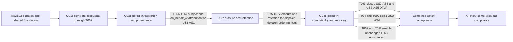

# Tasks: Business Event Ledger

**Input**: Design documents from `specs/048-business-event-ledger/`: `spec.md`, `plan.md`, `research.md`, `data-model.md`, `quickstart.md`, and `contracts/`.

**Prerequisites**: Before you change an area, obey `.specify/memory/constitution.md`, `ARCHITECTURE.md`, relevant accepted ADRs, and the nearest agent context. ADR 039 is Accepted (maintainer approval, 2026-09-26) and binding. A deviation requires a superseding ADR. ADR 033 remains Proposed unless maintainers explicitly accept it. Planning checkmarks are not implementation evidence.

**Performance scope decision (user-approved, 2026-10-04)**: The user directed, `we dont need that gate and neither a performance profile`. US4-AS4, mandatory FR-008/SC-007 performance criteria, and deployment-profile approval are retired. There are 20 active functional scenarios. The 5 ms goal remains unverified and non-blocking. T095/T096/T112/T113/T118 are closed as retired, not measured passes.

The specification and plan record the criteria change. Accepted ADR 039's design and the production 25-open/5-idle pool remain unchanged. Unrelated dependency and documentation-tooling repairs are outside this feature.

**Current shared-lane scope (2026-10-06)**: The user removed feature-specific diagnostic suites, runner commands, and setup. No replacement performance suite is required. All 20 active scenarios remain required in existing backend E2E and integration lanes. Use `just test-e2e-backend 'business-event-ledger && !performance'` with its default `integration` tag. For memory only, supply an explicit empty build-tag argument: `just test-e2e-backend 'business-event-ledger && !performance' ''`. Use `just test-integration-infra`, `just check`, `just security broker`, and normal `just verify` for shared verification. Historical measurements remain evidence only.

**Historical status**: Dated execution snapshots retain the requirements and blockers that applied at each checkpoint. They are not current instructions or release conditions. The 2026-10-04 decision supersedes their performance/profile blockers. The 2026-10-06 decision removes their feature-specific diagnostic tools and recipes. Ledger ADR citations use its current number, 039 (formerly 037). This number change preserves the original approval and evidence.

**Tests**: FR-003, DB-002/005, the active acceptance scenarios, and Constitution VIII/XIII explicitly require tests. Before each implementation, write tests that compile and fail semantically. Retain red/green evidence. Do not skip scenarios or add placeholder failures, source-text assertions, or test-only production APIs. Do not weaken functional expectations.

Phase 2f historically established 21 journeys. Retirement of US4-AS4 leaves 20 active functional journeys.

**Organization**: Shared prerequisites precede four user-story phases in specification priority order. Phase 0 is the plan-required refactor that preserves behavior and receives separate review. It starts with the legacy slog baseline. Phase 2.7 is intentionally absent. This feature needs no empty CRUD handlers, public ledger endpoint, or separately delivered structure without behavior.

## Format: `[ID] [P?] [Story] Description`

- `[P]` marks tasks that can run concurrently in the explicitly listed ready wave. Their file ownership is disjoint. This marker never bypasses prerequisite tests or gates.
- `[US1]` through `[US4]` identify tasks in story phases only. Phase 2f contains shared acceptance setup, as the template requires.
- Paths are repository-relative. Planned new filenames do not imply that the files exist. Existing source integration targets come from `contracts/producers.md` and `research.md`.
- One integration owner handles shared ports, factory, builder, migration, and shared E2E files. Each exported-symbol change starts with reference discovery. Migrate all callers. Add no compatibility aliases or second transaction stack.
- Each ledger operation has exactly one implementation task, after its tests. See "Ledger operation ownership" under Dependencies.

## Phase 0: Pre-implementation Refactoring [REQUIRED FOR THIS FEATURE]

**Purpose**: Isolate necessary structural changes in a separate PR before feature behavior. Preserve HTTP responses, security side effects, and all existing slog names, levels, messages, and fields. Later red/green tasks own real memory rollback, nested ownership behavior, and ledger recording. This refactor excludes those behaviors.

- [X] T001 Before any refactor, record the pre-feature revision (the current `main` commit). Capture the legacy slog contract for every catalogued workflow. Run the existing E2E journeys for those workflows with JSON log output. Use the existing bootstrap log capture in `tests/e2e/bootstrap/logger.go`. Commit reviewed event names, levels, messages, and field keys (never values) per workflow as `tests/e2e/fixtures/business_event_ledger_legacy_slog.go`.

  Explicitly mark workflows that emit no existing event line. This fixture is the FR-002 baseline for T005 and US4-AS1. Keep no capture tooling in production code.
- [X] T002 Generalize the existing transaction names, context, and executor seams in `internal/ports/storage.go`, `internal/adapters/storage/postgres/oauth2_transaction.go`, `internal/adapters/storage/factory.go`, and `internal/domain/oauth2server/fosite_storage.go`. Discover references. Migrate all existing callers to the shared names without transaction behavior changes. Document the pinned Fosite boundaries for failure-side revocation in `specs/048-business-event-ledger/contracts/producers.md`.
- [X] T003 Extract credential generation, rotation, and revocation policy from `internal/adapters/http/handlers/admin/client_credentials_handler.go` into `internal/domain/oauth2server/credential_service.go`. Inject the service through `internal/app/builder.go`. Preserve the handler's response/log behavior. Do not add ledger calls yet.
- [X] T004 Extract the proxy transport/domain completion seam through `internal/ports/oauth2_token_proxy.go` and `internal/domain/oauth2/token_outcome_service.go`. Adapt `internal/adapters/http/enduser/token_grant_strategy.go`, `internal/adapters/http/enduser/oauth2_token.go`, and `internal/app/builder.go`. Do not add recording or change response behavior yet.
- [X] T005 After T002–T004, run `just check`, the smallest affected existing test commands, and existing credential/local/proxy/hybrid OAuth2 HTTP journeys. Compare their slog output with the T001 fixture. Record unchanged behavior. Before feature work, submit the isolated refactor PR. Link its evidence from `specs/048-business-event-ledger/quickstart.md`.

**Checkpoint**: The refactor received independent review. It adds no ledger behavior and leaves no obsolete transaction names. Its slog output matches the T001 baseline exactly.

## Phase 1: Setup (Shared Infrastructure) [CUSTOMIZABLE]

**Purpose**: Project initialization and basic structure

- [X] T006 Promote the existing pinned `github.com/google/jsonschema-go v0.4.2` dependency to direct in `go.mod`. If dependency tooling requires it, update `go.sum`. Retain existing Go, UUID, sqlx, pgx, Fosite, and OTel versions. Do not introduce a second validator.

- [X] T007 Historical allocation and baseline preparation. Initial review verified that migration number 035 was free while `origin/046-cimd-upstream-client` held 033 and 034. The former performance protocol reused the T001 pre-feature revision and requested an operator-approved deployment profile. Its quickstart table required the approver, approval date/reference, and profile location. No approved profile was available, which blocked T095 at that time. The 2026-10-04 decision retires that requirement. Historical commands and revisions remain in `specs/048-business-event-ledger/quickstart.md`.

  Migration allocation still requires the next free number across `main` and open branches. If an allocation changes, update the plan, data model, research, and task paths before implementation.

**Migration allocation after rebase**: T007 correctly verified 035 availability at initial review. Main uses 035 for CIMD authentication. The completed ledger migration and the following tasks use 036.

## 🔒 Phase 2: Design Preconditions (Blocking Prerequisites) [MANDATORY]

**Purpose**: Domain model, configuration, API, and database design MUST all be completed before implementation.

**⚠️ CRITICAL**: No code implementation can begin until this entire phase is completed.

**🔒 CONSTITUTION REQUIREMENT**: This phase maps directly to the constitution PRECONDITIONS checklist. Every tasks.md MUST include all sub-phases (2a-2f). Adaptation of specific task details to the feature is recommended.

**Feature note**: The Phase 0 exception preserves behavior and does not authorize feature production code. T014 declares the constitution-permitted minimal contract structure that compiles acceptance tests. This structure has no ledger behavior. Do not deliver it or mark it as a finished implementation.

### Phase 2a: Domain Model & Glossary [MANDATORY]

**Constitution Reference**: Principles II (Architecture Documentation), V (Domain-Driven Design & Glossary Management)

**Required Tasks** (adapt descriptions to your feature):

- [X] T008 Update `ARCHITECTURE.md` with the new glossary entries. Include Business Event, Event Type, Event Envelope, Actor Context, Delivery Reference, Ledger Telemetry Copy, and Retention Policy. Include the bounded-context, transaction, and lifecycle design from accepted ADR 039 and `specs/048-business-event-ledger/data-model.md`. Describe this design as accepted but not yet deployed. Distinguish the ledger caller from SecurityContext Actor. Document the 5 ms p99 and retention guarantees.

  Add ADR 039 to the root `AGENTS.md` ADR Decision Index (Principles II, V).
  The initial task also mirrored the new glossary terms in that file.
  The user removed this duplication from the PR. The glossary definitions remain in the architecture document.

**Checkpoint**: The domain model is completed and documented.

### Phase 2b: Configuration Design [MANDATORY]

**Constitution Reference**: Principle VII (Configuration-Driven Design)

**Required Tasks** (adapt descriptions to your feature):

- [X] T009 [P] Publish runnable default and shorter-retention/disabled-copy examples in `examples/config/business-event-ledger.yaml` and `examples/config/README.md`. Document both configuration values, exact environment/CLI mappings, precedence, and coordinated retention rollout in `docs/configuration.md`. Document the absence of a persistence-disable switch. Use `specs/048-business-event-ledger/contracts/configuration.md` (Principle VII).
- [X] T010 [P] Add documented `broker.businessEvents.retention` and `broker.businessEvents.telemetryCopyEnabled` values to `charts/agentic-identity-broker/values.yaml`. Render them in `charts/agentic-identity-broker/templates/configmap.yaml`. Add the optional `migration.grants.businessEvents.readerRole` and `migration.grants.businessEvents.erasureRole` values from `specs/048-business-event-ledger/contracts/configuration.md`. Their empty defaults grant nothing. T081 renders them.

  Document all four values and the PostgreSQL-only, migration-owned maintenance design in `charts/agentic-identity-broker/README.md`. Document the responsibility of custom `migration.grants.sql` to apply ledger restrictions. Preserve explicit false. Exclude all ExtProc configuration (Principle VII).

**Checkpoint**: Configuration design includes requirements, YAML examples, and the applicable deployment contract.

### Phase 2c: API Design [MANDATORY]

**Constitution Reference**: Principles IV (API Documentation & OpenAPI Transparency), X (API-First Development)

**Required Tasks** (adapt descriptions to your feature):

- [X] T011 Record the ADR 039 acceptance reference (maintainer approval, 2026-09-26). Obtain stakeholder review references for `specs/048-business-event-ledger/contracts/events.md` and `specs/048-business-event-ledger/contracts/storage.md`. Record these references. Verify the existing fail-closed response forms in `api/enduser/openapi.yaml` and `api/admin/openapi.yaml`. Record that no new HTTP/CLI read/erase API is intended.

  Require separate approval for each additional public behavior change. ADR acceptance does not approve public API changes (Principles II, IV, X).
- [X] T012 Before producers, publish all 30 reviewed schema files from `specs/048-business-event-ledger/contracts/schemas/` under `api/events/v1/`. Publish synthetic examples from `specs/048-business-event-ledger/contracts/examples.json` under `api/events/v1/examples.json`. Retain URN schema IDs, fixed type names and source, closed fields, and compatible-evolution rules (Principles IV, X).

**Checkpoint**: The user/stakeholder approved the API design.

### Phase 2d: Database Design [MANDATORY]

**Constitution Reference**: Principle IX (Persistence Pattern Consistency & Database Migration Management)

**Required Tasks** (adapt descriptions to your feature):

- [X] T013 Verify the numbered up/down migration design in `specs/048-business-event-ledger/data-model.md` and `specs/048-business-event-ledger/contracts/storage.md`. Include paired six-hour partitions, partition-pair functions, drop-free provisioning functions, and maintenance functions. Include immutable row protection, policy precision, business-row expiry markers, and their separate ISP ports. Include lock ordering, privilege separation, and operational roles. Include the absence of event cascade FKs/default partition and destructive-history rollback acknowledgement.

  T036 implements the foundation. T076, T077, and T081 implement the erasure function, retention drops, and privileges after their US3 tests (Principle IX).

**Checkpoint**: The database schema design and migration documentation are completed.

### Phase 2e: Frontend/Design System Review [MANDATORY IF FRONTEND]

**Constitution Reference**: Principle XI (Design System Compliance & Consistency)

**Required Tasks** (if feature includes frontend components):

Not applicable: this feature authorizes no frontend, UI route, styling, Playwright scenario, or screenshot changes. Preserve this boundary. Do not add frontend work to fill the template (Principle XI).

**Checkpoint**: Design system usage planned (if applicable)

### Phase 2f: E2E Acceptance Test Design [MANDATORY]

**Constitution Reference**: Principle XIII (End-to-End Acceptance Testing & Spec Traceability)

**Required Tasks** (adapt descriptions to your feature):

**Execution**: T014 declares the compile-only contract surface. T015–T016 prepare the harness and lanes. T017–T020 write all scenario tests before T021 closes the semantic-red gate.

Edit shared E2E files serially.

Use real HTTP workflows through app.Builder. Assert exact expected facts. Reuse existing fixtures/bootstrap. Use hierarchical Ginkgo Describe/Context/It. Add the Ginkgo label `business-event-ledger` to every ledger spec. Add one scenario-reference comment per It.

Keep backend/workflow variants inside their scenario, without duplicate scenario IDs. Bootstrap a separate server and storage for each backend iteration inside an It. Release them with `DeferCleanup`. Iterations share no state (Principle XIII isolation).

- [X] T014 Declare the compile-only contract surface for the acceptance harness, without ledger behavior. Add `BusinessEventID` to `internal/domain/id/gen_ids.go`. Regenerate the IDs. This ID retains the generator's default constructor until T023. Declare envelope, subject-selector, and query value types in `internal/domain/model/business_event.go`. Declare ledger repository and lifecycle port signatures in `internal/ports/storage.go`.

  Add inert memory and PostgreSQL accessors in `internal/adapters/storage/factory.go`. Their reads return empty results. No code calls their writes yet. In `internal/app/builder.go`, expose the ledger service on `app.App` beside the existing domain services. Its lifecycle operations change nothing. Add `Builder.WithBusinessEventSchemas(fs.FS)` for offline schema sources.

  Scenarios must fail on absent ledger behavior, not compilation. Add no TODO markers. T031, T039–T042, T068, and T075 replace every inert part.
- [X] T015 Extend `tests/e2e/bootstrap/test_server.go`. Add the ledger harness in `tests/e2e/bootstrap/`. Add `business_event_ledger.go` for the builder wrapper, per-backend-iteration bootstrap, fault-wrapped ports, and child-process coordination. The bootstrap returns a fresh server and storage (new memory adapter or new template-database clone). Register them with `DeferCleanup`. Add backend selection through `business_event_ledger_backends.go` (`//go:build !integration`, memory) and `business_event_ledger_backends_integration.go` (`//go:build integration`, memory and PostgreSQL).

  In `tests/e2e/helpers/`, add `business_event_ledger.go` for repository inspection, authorized SQL inspection, operational erase/maintain calls, and historical seeding. The migration owner seeds historical partitions and envelopes through `public.business_event_create_partition_pair`. Add `otlp_receiver.go` for local OTLP capture. In `tests/e2e/matchers/business_event_ledger.go`, add envelope and seven-class credential-canary matchers.

  In `tests/e2e/fixtures/business_event_ledger.go`, add isolated catalogue workflows, trusted identities, canaries, and a test-only fixture schema. Never publish this fixture schema under `api/`. Reuse shared PostgreSQL template clones. Keep all fault controls out of production APIs.
- [X] T016 Include ledger coverage in existing `justfile` and backend CI verification. Document shared commands in `specs/048-business-event-ledger/quickstart.md`. `just test-e2e-backend 'business-event-ledger && !performance'` uses `integration` by default and retains configured parallelism. It runs shared scenarios on both backends plus PostgreSQL-only acceptance. An explicit empty build-tag argument selects memory only. Normal `just verify` includes this coverage without a duplicate feature run.

  CI runs the full integration-tagged backend suite through the existing `verify-e2e-backend-junit` invocation. Retain configured parallelism, existing `Serial` declarations, and backend reports. Add no ledger-specific job or step, or CI security gate. Scheduled scans on main remain unchanged. No replacement diagnostic suite is required.

  Build required frontend assets. Fail on empty selections. Never count absent tagged tests as passes.
- [X] T017 Write US1-AS1/AS3/AS4/AS5/AS6 in `tests/e2e/business_event_ledger_test.go`. Iterate the bootstrap backend list inside each It. Write US1-AS2 and US1-AS7 in `tests/e2e/business_event_ledger_postgres_test.go`. Exercise all 28 catalogue workflows, forced rollback, independent failures, competing transitions, and lazy expiry. Compare normalized event contents and atomicity between memory and PostgreSQL.

  Exercise a PostgreSQL child-process crash after an externally observed commit, before response/log release.
- [X] T018 Write US2-AS1–US2-AS5 in `tests/e2e/business_event_ledger_test.go`. Iterate the backend list. Assert the exact receiving-agent set for a subject/time query. Assert authenticated caller versus subject, delegation, and correlation. Assert full-envelope and OTLP credential exclusion for every type. Assert null unavailable identities through the explicit no-subject selector.

  Register a fixture type through `WithBusinessEventSchemas`. Assert that it records without a database migration. Assert that earlier events keep their meaning. Assert that the system rejects unknown types and invalid payloads.
- [X] T019 Write US3-AS1/AS5 in `tests/e2e/business_event_ledger_test.go` and US3-AS2/AS3/AS4 in `tests/e2e/business_event_ledger_postgres_test.go`. Cover exact-subject erasure across multiple partitions. Cover default/changed retention and no early deletion with migration-owner historical seeding and live workflow events. Cover the concurrent recording boundary and no resurrection after restart/deferred copy. Cover rejection of malformed/non-positive startup values. Add no production time-travel controls.
- [X] T020 Write US4-AS1/AS2 in `tests/e2e/business_event_ledger_test.go` and US4-AS3 in `tests/e2e/business_event_ledger_postgres_test.go`. Compare legacy slog output with the T001 fixture. Verify the ledger telemetry copy and its disablement. Exercise export failure, rollback, and post-commit crash recovery.

  Historically, this task also established US4-AS4 in a performance-labelled baseline-versus-feature harness without a production recording bypass. It asserted one retained event of the expected type per completed action and no credential canaries. US4-AS4 is retired, and its diagnostic tools are removed. Its semantic-red evidence remains historical.
- [X] T021 Run all 20 active acceptance scenarios in their shared lanes. Preserve the original semantic-red results for 21 scenarios and the 1:1 map in `specs/048-business-event-ledger/quickstart.md`. Before ledger implementation, verify T008–T020 prerequisites and contract review. Failures must result from absent ledger behavior. Examples include zero retained events, missing SQL functions, and an absent ledger telemetry copy.

  Skipped tests, compilation errors, unconditional failure assertions, and fabricated current-load evidence do not count as red (Principles VIII, XIII).

**Checkpoint**: E2E acceptance tests exist and fail semantically before implementation. Frontend Playwright tests and screenshot configuration exist, if applicable.

The original missing-profile release blocker is retired. Historical evidence does not establish a 5 ms pass.

## Phase 2.5: Foundational Infrastructure [CUSTOMIZABLE]

**Purpose**: Core infrastructure MUST be completed before implementation of ANY user story.

**⚠️ CRITICAL**: No user story work can begin until this phase is completed.

**Feature note**: Supply one safe foundation for recording, transactions, and storage across all stories. Each behavior task follows its matching red tests and owns its operation exclusively. Foundations own append, get, scoped query, delivery-reference insert, and partition provisioning. Stories own erasure, retention drops, policy application, privileges, and dispatch.

Basic trust validation and append-side barriers belong in foundations, not a later story. Do not mark a foundation completed with no-op storage or a missing repository method.

- [X] T022 Write boundary tests in `internal/domain/ledger/event_test.go` and `internal/domain/id/business_event_id_test.go`. Compare UUIDv7 generation for the T014-declared ID with existing UUIDv4 IDs. Cover registry-selected outcomes/references, nullable identities, UTC/IP/trace parsing, deterministic sets, and safe fixed reasons. Cover rejection of unknown/additional fields. Before event-type implementation, record semantic failures.
- [X] T023 Add per-type UUIDv7 generation for `id.BusinessEventID` to `internal/domain/id/gen_ids.go`. Regenerate IDs with the existing repository generator. Update the ID catalogue in `internal/domain/id/AGENTS.md`. Enforce the data-model rule "Generated UUIDv7; immutable; not accepted from requests; no global causal-order claim". Do not change existing ID constructors.
- [X] T024 Implement immutable envelope/actor/time values in `internal/domain/model/business_event.go`. The type is "Fixed functional name `agentic-identity-broker` plus the catalogue event name; never configurable". The source is `urn:agentic-identity-broker:broker`. The occurred_at rule is "Actual business fact time; effective expiry for expiration; current-key selection time for promotion". The recorded_at rule is "Assigned by storage at append; database clock for PostgreSQL; retention clock".

  The subject rule is "Required nullable JSON field; affected principal, never an agent substitute". The actor rule is "Required object, fields below". The kind is "user/admin/agent/gateway/system/policy". The id/on_behalf_of rule is "required and nullable". Maintenance uses `system`/`broker-lifecycle`. Unauthenticated agent attempts have a null actor ID.

  Never invent an unauthenticated operator identity.
- [X] T025 Implement typed reference fields and their invariants in `internal/domain/model/business_event.go`. The agent_id rule is "Required for successful exchange, agent/credential events, grants and approvals". The gateway_client_id rule is "Verified gateway caller only". The service_id rule is "Required on successful third-party session transitions; preserve when known on failure". For permission_set_ids, enforce "Deduplicate and sort for deterministic output".

  The grant_id rule is "Required on every grant event, including deletion". The session_id rule is "Third-party session ID, required when the event concerns an existing session". The approval_id rule is "Required on every approval event". For mcp_session_id/agent_session_id, enforce "Omit when absent or unsafe; never forward arbitrary credential-bearing strings".
- [X] T026 Implement outcome, reason, and safe context validation in `internal/domain/ledger/event.go` and `internal/domain/model/business_event.go`. The outcome rule is "success, failure, denied, pending; fixed by event type". The reason_user rule is "Fixed safe template, no operational secrets or interpolated request text". The reason_admin rule is "Fixed operational template, not a raw error". For trace_id/span_id, enforce "Reuse authoritative request correlation; span must belong to the same trace".

  The client.ip rule is "Existing trusted-proxy decision, not reparsed untrusted headers". The client.user_agent rule is "Chrome, Firefox, Safari, Edge, curl, Go-http-client; no raw versions/comments". For data, enforce "Closed schemas; no generic struct serialization". Validate nonzero IDs and actual UTC/IP values in addition to schema patterns.
- [X] T027 [P] Write offline schema/registry behavioral tests in `api/events/schemas_test.go` and `internal/domain/ledger/registry_test.go`. Cover all published examples, unknown types, extra/nested fields, and type/outcome/reference mismatches. Cover reserved or colliding flattened keys, invalid semantic times/IDs, and compatible new-type registration. Cover schema-source composition: additional offline sources, existing-type redefinition, and functional-name or source changes. Network resolution and silent field loss must fail.
- [X] T028 [P] Write configuration precedence/startup tests in `internal/config/business_events_test.go` and `cmd/agentic-identity-broker/root_test.go`. Cover explicit false and CLI > environment > file > default. Cover rejection of malformed/zero/negative/overflow durations and upward normalization of positive sub-microsecond durations. Verify behavior, not copies of default constants.
- [X] T029 Embed schemas in `api/events/schemas.go`. Implement the precompiled per-type registry and fixed safe recipes in `internal/domain/ledger/registry.go`. Compile them from offline `fs.FS` sources. The production default is the embedded catalogue. Enforce every per-type reason-code/credential-ID/signing-key-ID/activates_at constraint from `specs/048-business-event-ledger/contracts/events.md`.

  At registration, reject `.` and `_ledger` prefixes, flattened collisions, and existing-type redefinition. Validate one explicit wire view. Reuse this view for serialization without a marshal/unmarshal validation round trip.
- [X] T030 Implement the two configuration values in `internal/ports/config.go`, `internal/config/loader.go`, `internal/config/validator.go`, and `cmd/agentic-identity-broker/root.go`. Set retention to `2160h` and telemetry-copy to true. Implement exact bindings/key enumeration. Accept strictly positive Go durations. Round them upward to microseconds, with overflow rejection. Effective copying requires all three switches in `specs/048-business-event-ledger/contracts/configuration.md` to be true.

  Add no parallel parser or recording-disable flag.
- [X] T031 Complete the owning/joined shared transaction protocol and T014 ledger ISP repositories in `internal/ports/storage.go`. Put query/reference values in `internal/domain/model/business_event.go`. Provide Append/Query/Get with a required subject selector (exact principal or explicit no-subject). Provide EraseSubject/ApplyRetention/SetRetentionPolicy and ListDue/DispatchOne. Provide separate `UserGrantExpirationRepository` and `ToolApprovalExpirationRepository` interfaces for expiration markers.

  Keep each repository under seven methods. Use existing StorageError categories without event values. Specify synchronous barrier-held dispatch. Do not introduce a telemetry port.
- [X] T032 [P] Write transaction/isolation/rollback/notification tests in `internal/adapters/storage/memory/transaction_test.go`. Cover all affected stores, secondary indexes, nested rollback-only ownership, and exclusion of uncommitted readers. Cover independent returned values and commit-only broadcasts. Include collector waits that must not hold the business visibility gate.
- [X] T033 [P] Write memory event and delivery-reference repository tests in `internal/adapters/storage/memory/business_event_test.go` and `internal/adapters/storage/memory/business_event_delivery_test.go`. Cover append/get, storage-assigned `recorded_at`, and absence of an update path. Cover delivery-reference insert only under effective copying. Cover rollback that removes the event and reference, and independent returned values.

  Cover scoped queries: `[start,end)`, deterministic `(occurred_at,id)` ties, strict tuple continuation, and default 200/maximum 1000 limits. Cover exact-subject and explicit no-subject selection, invalid ranges, and survival after deletion of referenced business objects.
- [X] T034 [P] Write real PostgreSQL tests in `tests/integration/storage/infra/business_event_ledger_test.go`, `tests/integration/storage/infra/business_event_query_test.go`, and integration-tagged `internal/adapters/storage/postgres/business_event_test.go`. Add untagged unit tests in `internal/adapters/storage/postgres/business_event_unit_test.go` for nil-database and deadline failures. Cover mapping to `StorageError` without event values. Use the existing `*_unit_test.go` convention.

  Cover up/down/up, existing business-data survival, parent/envelope column consistency, and immutable UPDATE protection. Cover ambient executor participation, nested ownership, stronger-isolation rejection, and lifecycle/subject locking on append. Cover rollback of the event plus delivery reference. Cover provisioning of the current plus seven future days and idempotent `business_event_create_partition_pair`. Cover the same query contract as T033. Use the existing testcontainers/bootstrap infrastructure.
- [X] T035 [P] Write ledger service and query-validation tests in `internal/domain/ledger/service_test.go` and `internal/domain/ledger/query_test.go`. Cover fail-closed validation and append errors. Cover independent-outcome recording only after rollback of the owning scope, and success only after owner commit. Cover no automatic retry of external operations and no event values in errors. Cover query validation (subject selector required, registered type/outcome, UTC start < end, bounded limits).
- [X] T036 Implement the foundation of `migrations/036_business_event_ledger.up.sql` and `migrations/036_business_event_ledger.down.sql` from the reviewed storage contract. Include paired six-hour recorded_at partitions. Include event PK `(recorded_at,id)`, delivery-reference PK `(recorded_at,event_id)`, the due index, and three investigation indexes. Enforce projected-column/envelope equality, including JSON null and normalized microseconds. Add the fixed outcome CHECK and immutable UPDATE trigger.

  Add the policy singleton "constrained true", with retention_microseconds "constrained positive". Seed a 90-day policy. Add nullable `expiration_recorded_for timestamptz` markers. Add `public.business_event_create_partition_pair`. Add drop-free `public.business_event_provision_partitions` for the current and seven future days under the lifecycle-exclusive lock. Add `public.business_event_maintain_partitions`, which only calls provisioning at this stage.

  Revoke PUBLIC execution for all three functions. The up migration calls provisioning. The down migration changes only this feature. Never add mutable-object FKs or a DEFAULT partition. Only T076, T077, and T081 add the erasure function, retention drops, and privilege restrictions.
- [X] T037 Implement shared owner/join transaction behavior in `internal/adapters/storage/postgres/transaction.go`. Migrate every affected grant/session/approval/sync/agent/provider/permission-set/credential/signing-key/Fosite repository caller under `internal/adapters/storage/postgres/` to its ambient executor. Joined commit cannot physically commit. Joined rollback poisons the owner. Do not weaken stronger isolation.

  Acquire lifecycle protection before sorted subject gates and business locks. If multi-subject discovery changes, restart before acquisition of out-of-order locks.
- [X] T038 Implement the real memory transaction manager in `internal/adapters/storage/memory/transaction.go`. Migrate all involved stores under `internal/adapters/storage/memory/` to one visibility gate and a touched-record/index undo journal. Include every read/write. Prevent reentrant locking in ambient helpers. Use no whole-store snapshots or goroutine identity. Defer notifications/cache invalidations until owner commit.

  Replace and remove the obsolete no-op factory manager in `internal/adapters/storage/factory.go`.
- [X] T039 Implement PostgreSQL append, get, and scoped query in `internal/adapters/storage/postgres/business_event.go`. Implement delivery-reference insert in `internal/adapters/storage/postgres/business_event_delivery.go`. On append, acquire lifecycle-shared gates before subject-shared gates. Assign database recorded_at once. On retry, preserve the prepared append ID/time. Validate the final envelope.

  Serialize it once. Atomically insert optional payload-free delivery references. Enforce storage deadlines. Implement the exact filtered `(occurred_at ASC,id ASC)` query with strict cursors and bounded limits. Use no OFFSET or join to current business rows. ListDue/DispatchOne belong to T090, and lifecycle operations belong to T075.
- [X] T040 Implement equivalent memory append, get, scoped query, and delivery-reference insert in `internal/adapters/storage/memory/business_event.go` and `internal/adapters/storage/memory/business_event_delivery.go`. Hold lifecycle shared before the visibility gate. Limit delivery-reference rows to recorded_at/event_id/next_attempt_at. Return independent values. Dispatch claims belong to T090, and erasure/retention belong to T075.
- [X] T041 Implement `internal/domain/ledger/service.go` and `internal/domain/ledger/query.go` with registered typed recording recipes. Use independent-outcome transactions only after failed owner rollback. Implement fail-closed append/validation behavior and investigator query validation. Include no raw event values in errors. Return committed success only after the owning transaction. Never automatically retry an entire external business operation.
- [X] T042 Replace the T014 inert accessors with real ledger repositories and the transaction manager in `internal/adapters/storage/factory.go`. Connect the registry, recorder, and configuration in `internal/app/builder.go`. Use the embedded catalogue as the default schema source. Verify that ledger-related startup failure prevents serving. T078 applies the retention policy at startup. Add no runtime DDL, handler repository access, adapter-to-adapter dependency, or second configuration/telemetry abstraction.
- [X] T043 Run `just check`, focused ledger/ID/schema/configuration tests, memory race tests, and real PostgreSQL foundational integration tests. Exercise append/query/rollback through a temporary production-builder smoke. Record results in `specs/048-business-event-ledger/quickstart.md`. After proof, remove the smoke scaffolding.

**Checkpoint**: Both backends support real atomic recording, safe immutable envelopes, exact scoped queries, and payload-free delivery-reference inserts. They also support append-side lifecycle/subject barriers. Schema and storage safety precede every producer.

**Gate clarification (user approval, 2026-10-01)**: Keep all foundation test assertions unchanged. Tests that require `ListDue` or `DispatchOne` are deferred to T090 because those operations belong to US4. T043 verifies append/get/query/rollback, direct delivery-reference inserts, and transaction races without a dispatch claim. T090 must close the deferred delivery-only tests before US4 completion.


## Phase 3: User Story 1 - Trust the Record of Security Changes (Priority: P1) 🎯 MVP [CUSTOMIZABLE]

**Goal**: Record each of the 28 facts once at its actual business boundary. Preserve durable atomicity, independent failures, and memory parity.

**Independent Test**: Complete the catalogue workflows through production HTTP bootstrap. Force append/validation rollback. Race transitions. Recognize expiry repeatedly. Crash/restart PostgreSQL after commit. Assert exact state and occurrence counts for US1-AS1–US1-AS7.

This story's independent demonstration requires no telemetry delivery.

### Tests for User Story 1 [MANDATORY - Principle VIII] ⚠️

> **Constitution Requirement (Principle VIII)**: Write tests FIRST with TDD. Tests MUST exist before implementation. Verify that they FAIL before implementation begins.

- [X] T044 [US1] Add semantic-red mutation tests beside existing service tests in `internal/domain/consent/business_event_test.go`, `internal/domain/approval/business_event_test.go`, and `internal/domain/agents/business_event_test.go`. Cover changed versus unchanged results, CAS losers, pending dedup/consumed repeats, and full cascades. Cover expiry marker renewal and transaction rollback. Retain the Phase 2f acceptance tests without weaker expected facts.
- [X] T045 [US1] Add semantic-red issuance/session/credential/signing tests beside existing tests in `internal/domain/oauth2server/provider_business_event_test.go`, `internal/domain/oauth2server/credential_service_test.go`, `internal/domain/oauth2server/signing_key_business_event_test.go`, and `internal/domain/oauth2session/business_event_test.go`. Cover no token/secret bytes before commit and survival of failure-side security revocations. Cover committed refresh despite later exchange failure, rotation classification, and once-only bootstrap/current-key selection.
- [X] T046 [US1] Add typed outcome/transport tests in `internal/domain/oauth2/token_outcome_service_test.go`, `internal/domain/tokenexchange/business_event_test.go`, `internal/domain/impersonation/business_event_test.go`, and `internal/adapters/http/enduser/token_grant_strategy_test.go`. Prove exchange-denial precedence, decision-versus-mint separation, local/proxy/hybrid parity, and staged response release only after recording.
- [X] T047 [US1] Write expiration-recognition repository tests beside existing memory tests in `internal/adapters/storage/memory/user_grants_expiration_test.go` and `internal/adapters/storage/memory/tool_approval_expiration_test.go`. Add tests in `tests/integration/storage/infra/business_event_expiration_marker_test.go` and integration-tagged `internal/adapters/storage/postgres/user_grants_test.go` and `internal/adapters/storage/postgres/tool_approval_repository_test.go`. Add untagged PostgreSQL unit tests in `internal/adapters/storage/postgres/user_grants_expiration_unit_test.go` and `internal/adapters/storage/postgres/tool_approval_expiration_unit_test.go` for `StorageError` mapping.

  Candidates are expired objects with a marker that differs from effective expiry. The conditional marker update succeeds once per effective expiry and joins the ambient transaction. Concurrent recognizers produce one winner. A changed validity permits recognition again. Rollback leaves the marker unset.

### Implementation for User Story 1

- [X] T048 [US1] Implement `UserGrantExpirationRepository` and `ToolApprovalExpirationRepository` on the existing grant and approval adapters. Use `internal/adapters/storage/memory/user_grants.go`, `internal/adapters/storage/memory/tool_approval_repository.go`, `internal/adapters/storage/postgres/user_grants.go`, and `internal/adapters/storage/postgres/tool_approval_repository.go`. Expose them through `internal/adapters/storage/factory.go`. Do not expand the existing repository interfaces.
- [X] T049 [US1] Implement `grant-created`, `grant-updated`, and `grant-revoked` in `internal/domain/consent/service.go` with owning transactions. Use locked effective-state comparisons/affected-row results. Retain the distinct absent-object semantics of both revoke endpoints. Before deletion, capture grant/subject/agent/permission references.
- [X] T050 [US1] Implement `grant-expired` recognition across `internal/domain/consent/service.go` and `internal/domain/oauth2/service.go` through the T048 repository. Include delegation and filtered reads. Atomically compare/update `expiration_recorded_for` and append the event. Use effective expiry as occurred_at. Permit a genuinely changed validity to establish a different expiry. Preserve public filtering without a new scheduler.
- [X] T051 [US1] Implement `session-established`, `session-refreshed`, `session-refresh-failed`, and `session-terminated` in `internal/domain/oauth2session/service.go`. Include callback reauthorization upserts, `GetValidAccessToken`, and `ForceRefreshSession` through `refreshLockedSession`. Prepare upstream/encryption work outside write locks. Commit accepted refresh and its event through `persistRefreshedSession` with `UpdateRefreshedSession`. After successful rollback, emit one known terminal failure, not one per retry. Indeterminate commit or rollback emits no contradictory failure fact. Retain known service/session/subject references.
- [X] T052 [US1] Implement `authorization-requested` at the accepted validated request boundary in `internal/domain/oauth2/service.go`. Commit once before consent/proceed output. Do not infer this fact from later authorization-code writes. Do not duplicate it in dispatch.
- [X] T053 [US1] Implement local non-exchange `token-issued` and applicable `token-request-failed` in `internal/domain/oauth2server/provider.go` and `internal/domain/oauth2server/fosite_storage.go`. Keep replay-detection revocations outside the issuance-success scope. Join Fosite inner scopes. Include response-population mutations and success append in the owner transaction. Release constructed token responses only after commit.
- [X] T054 [US1] Complete staged proxy/local/hybrid outcome handling in `internal/domain/oauth2/token_outcome_service.go`, `internal/adapters/http/enduser/token_grant_strategy.go`, and `internal/adapters/http/enduser/oauth2_token.go`. Report typed parse/transport outcomes to the domain. After commit, preserve permitted upstream headers/status/body. Never stream credential bytes early. Never infer subject from unverified upstream JWT claims. Add no additional hybrid recorder.
- [X] T055 [US1] Implement `token-exchanged` and `token-exchange-denied` in `internal/domain/tokenexchange/service.go`. Require receiving-agent attribution on success. Select specific authentication/authorization denial before generic token failure. After rollback, commit non-mutating outcomes independently. Emit no duplicate `token-issued` or `token-request-failed` for the same exchange denial.
- [X] T056 [US1] Implement `impersonation-granted`, `impersonation-denied`, and successful impersonation `token-exchanged` in `internal/domain/impersonation/service.go`. After authorization/delegation, record one final permission decision before minting. If minting fails with token-request-failed, retain the granted decision. Never turn rule-evaluation/internal errors into false permission denials.
- [X] T057 [US1] Implement `approval-requested`, `approval-approved`, `approval-denied`, `approval-consumed`, and `approval-revoked` in `internal/domain/approval/service.go`. Use winning IsNew/CAS/actual terminal transitions and transactional sync-state updates. Existing pending returns, losing transitions, and already-consumed 200s emit no events. Revocation is not an extra user denial. Send local notifications only after commit.
- [X] T058 [US1] Implement `approval-expired` recognition in `internal/domain/approval/service.go` through the T048 repository. Include reads, mutation races, filtered results, pending-dedup retirement, and cleanup. Atomically persist the marker/event. Retain existing consumed/persistence rules. Introduce no expired status enum or new expiry scheduler.
- [X] T059 [US1] Implement `agent-registered`, `agent-updated`, and `agent-deleted` in `internal/domain/agents/service.go`. Use locked effective-configuration comparisons and actual deletion results. Keep event data credential-free. Do not serialize configurations. Unchanged updates/deletes emit no events.
- [X] T060 [US1] Implement `credential-generated`, `credential-rotated`, and `credential-revoked` in `internal/domain/oauth2server/credential_service.go`. Atomically store/remove the actual credential record and event. Record only its safe credential ID and owning agent. Classify replacement as rotation alone. Preserve existing handler logs/status. Withhold plaintext secret responses until commit.
- [X] T061 [US1] Implement `signing-key-promoted` in `internal/domain/oauth2server/signing_key_service.go` for explicit promotion, makeCurrent generation, and initial-key bootstrap. Record actual current-key selection time. Keep `data.activates_at` separate. Preserve bootstrap-lock ordering/recovery and existing JWKS grace. Emit no same-key/losing selection events.
- [X] T062 [US1] Complete agent-deletion terminal-fact orchestration in `internal/domain/agents/service.go` with the shared repositories in `internal/ports/storage.go`. Before cascades, enumerate actual grants/approvals/credentials. Acquire sorted subject gates before business locks. Verify discovery again. Append only real catalogued terminal facts in the owner transaction. Retain all historical ledger rows after business deletion. Preserve provider session deletion protection (`ON DELETE RESTRICT`), without session enumeration or termination.
- [X] T063 [US1] Finish producer injection in `internal/app/builder.go`. Run US1-AS1–US1-AS6 in the memory lane and US1-AS1–US1-AS7 in the tagged lane. Use `tests/e2e/business_event_ledger_test.go` and `tests/e2e/business_event_ledger_postgres_test.go`. Record catalogue/rollback/race/expiry/parity/crash evidence in `specs/048-business-event-ledger/quickstart.md`. Prove all 28 types, not representative families. Run an actual grant-revoke/approval/session-termination crash smoke through the production builder.

**Checkpoint**: US1 is the first increment that you can demonstrate independently. It does not authorize release without the remaining privacy, lifecycle, and telemetry requirements.

## Phase 4: User Story 2 - Investigate a Principal's Token Activity Safely (Priority: P1) [CUSTOMIZABLE]

**Goal**: Answer the exact subject/time incident question without credentials or false attribution, using stable contracts and authorized operational access.

**Independent Test**: Generate a known multi-principal/agent dataset through real workflows. Query `[start,end)`. Assert exact receiving agents, trusted caller/subject/delegation, and explicit null/missing context. T093 closes the OTLP portions of US2-AS3 and US2-AS5 after US4 delivery integration. Stored-envelope safety must pass first.

### Tests for User Story 2 [MANDATORY - Principle VIII] ⚠️

> **Constitution Requirement (Principle VIII)**: Write tests FIRST with TDD. Tests MUST exist before implementation. Verify that they FAIL before implementation begins.

- [X] T064 [P] [US2] Add provenance and hostile-input tests in `internal/domain/ledger/context_test.go`. Cover SecurityContext Actor versus verified CallingPeer, valid matching span only, and gateway association. Cover background/admin/unauthenticated null identities and ADR 031's established-policy boundary. Cover unsafe opaque session strings, user-agent credentials, and fixed reason templates.
- [X] T065 [P] [US2] Write schema-source seam tests in `internal/app/business_event_schemas_test.go`. The default builder uses only the embedded catalogue. `WithBusinessEventSchemas` adds an offline fixture type that records without DDL. Existing records keep their type and meaning. Existing-type redefinition, different functional names or sources, remote references, and flattened collisions fail `Build`. Reject unknown types and invalid payloads before storage or dispatch.

### Implementation for User Story 2

- [X] T066 [US2] Implement the trusted event-context constructor in `internal/domain/ledger/context.go`. Implement adapter capture in `internal/adapters/http/business_event_context.go`. Reuse the authoritative IP and request trace. Include a span only with the same trace. Retain the initiating verified caller separately from subject/on_behalf_of.

  Map unavailable identities to null, not the anonymous sentinel. Omit untrusted correlations/raw user agents. Preserve existing slog semantics.
- [X] T067 [US2] Apply the trusted context constructor to every producer. Use these files: `internal/domain/consent/service.go`, `internal/domain/approval/service.go`, `internal/domain/oauth2session/service.go`, `internal/domain/oauth2/service.go`, `internal/domain/oauth2server/provider.go`, `internal/domain/oauth2server/credential_service.go`, `internal/domain/oauth2server/signing_key_service.go`, `internal/domain/agents/service.go`, `internal/domain/tokenexchange/service.go`, and `internal/domain/impersonation/service.go`. Verify that all 28 types preserve known resource references. Never serialize whole audit/request/credential/configuration structs.
- [X] T068 [US2] Implement `Builder.WithBusinessEventSchemas(fs.FS)` in `internal/app/builder.go`. Replace the T014 declaration. Use the existing `WithCIMDFetcher` injection pattern. Pass additional offline sources to the registry after the embedded catalogue. Prove that a new reviewed type appends without DB DDL and old records retain their meaning. Reject unknown/invalid events before storage or dispatch, without weaker closed schemas.
- [X] T069 [US2] Publish authorized investigation SQL in `docs/api/business-event-ledger.md`. Include the no-subject selector for system, administrative, and pre-authentication events. Include exact receiving-agent-set interpretation and the operational reader role. Include stable type names/schema evolution and credential-free envelope examples. Unless you discover a separately approved contract change, retain `api/admin/openapi.yaml` and `api/enduser/openapi.yaml` unchanged. Introduce no read/export/ingestion endpoint.
- [X] T070 [US2] Run US2-AS1–US2-AS5 from `tests/e2e/business_event_ledger_test.go` in the memory lane and on both backends in the tagged lane. Query a real workflow dataset through operational SQL. Record exact agent-set/provenance/schema and all-type stored credential-canary evidence in `specs/048-business-event-ledger/quickstart.md`. T093 closes the OTLP portions of US2-AS3 and US2-AS5. Do not mark them passed here. Stored checks permit US3 work under the approved ordering correction.

## Phase 5: User Story 3 - Enforce Retention and Principal Erasure (Priority: P2) [CUSTOMIZABLE]

**Goal**: Provide authorized exact-subject erasure and automatic retention, with a concurrent completion boundary and no replay of deleted history.

**Independent Test**: Erase one subject across families/partitions without changes to another subject. Race record/dispatch against erasure. Run actual maintenance at default and changed retention boundaries over seeded history. Restart the broker. Verify that no retained/deferred deleted event returns. Exercise logical equivalents in memory without a restart-durability claim.

### Tests for User Story 3 [MANDATORY - Principle VIII] ⚠️

> **Constitution Requirement (Principle VIII)**: Write tests FIRST with TDD. Tests MUST exist before implementation. Verify that they FAIL before implementation begins.

- [X] T071 [P] [US3] Add real PostgreSQL lifecycle tests in `tests/integration/storage/infra/business_event_lifecycle_test.go`. Add untagged unit tests in `internal/adapters/storage/postgres/business_event_lifecycle_unit_test.go` for empty/null selector rejection before SQL. Cover `StorageError` mapping without event values. Cover erasure that waits for predecessors, exact predicates/null rejection/idempotence, and paired partition drops over migration-owner-seeded historical windows. Cover six-hour/no-early-deletion boundaries, 90-day durations, and short positive durations.

  Verify that `business_event_provision_partitions` never drops partitions, even under a shorter stored policy. Cover a retention increase (720h to 2160h). Before storage of the new policy, provisioning must keep 30–90-day history. Cover lifecycle/subject/row ordering, future-partition repair, and policy-change serialization. Cover reader/erasure-role grants, runtime privilege denial, and expiry-marker survival after ledger deletion. Cover readiness failure during current-partition absence and recovery after maintenance.
- [X] T072 [P] [US3] Add memory lifecycle/race tests in `internal/adapters/storage/memory/business_event_lifecycle_test.go`. Cover logical six-hour retention through the adapter clock in package tests and exact subject deletion. Cover collector attempts outside the visibility gate but inside lifecycle protection. Cover cancellation/claims, unchanged other subjects, and no recognition-marker resurrection.
- [X] T073 [P] [US3] Extend existing Helm tests in `tests/integration/helm_chart_test.go` for PostgreSQL-only five-minute scheduling. Cover a CronJob that calls maintenance and renders no `spec.suspend`. Cover a pre-install/pre-upgrade migration job that calls provisioning, never maintenance. Cover explicit false, no migration Secret mount in the broker, and restricted parent/child/function grants. Cover reader/erasure role grants only for configured values, and maintenance with optional grants initialization off.
- [X] T074 [P] [US3] Write lifecycle-service and memory-retention-worker tests in `internal/domain/ledger/lifecycle_test.go` and `internal/app/business_event_retention_test.go`. Erasure requires an exact nonempty subject. It returns committed counts without tombstones or replacement events. The worker applies the normalized startup policy under the exclusive lifecycle barrier. It sweeps at startup and every five minutes. It stays independent of every telemetry switch.

  The worker stops on shutdown. It never calls PostgreSQL DDL.

### Implementation for User Story 3

- [X] T075 [US3] Implement the authorized lifecycle service in `internal/domain/ledger/lifecycle.go`. Implement lifecycle repositories in `internal/adapters/storage/postgres/business_event_lifecycle.go` and `internal/adapters/storage/memory/business_event_lifecycle.go`. Replace the T014 inert lifecycle operations. Reject empty/null selectors. Erase by exact subject, not actor. Remove delivery references with events.

  Leave business expiry markers unchanged. Return committed deletion counts. Preserve legitimate post-boundary occurrences. Add no permanent identity tombstones or replacement erasure events.
- [X] T076 [US3] After T071 is red, add `public.business_event_erase_subject` to `migrations/036_business_event_ledger.up.sql` and its down migration. Use VOLATILE fresh reads after lifecycle-shared/subject-exclusive locks. Use fixed search_path, qualified names, parameterized predicates, and narrowly scoped SECURITY DEFINER. Revoke PUBLIC/runtime execution. Delete across every retained partition in one transaction.
- [X] T077 [US3] After T071 is red, add retention drops to `public.business_event_maintain_partitions` in `migrations/036_business_event_ledger.up.sql`. Retain its call to T036 provisioning. Keep `business_event_provision_partitions` drop-free. Maintenance is the only function that drops partitions. Use SECURITY INVOKER under migration ownership. Read the policy under lifecycle-exclusive protection.

  Use one database-now per sweep. Drop partition pairs transactionally only under upper_bound <= now - retention. Bound lock/statement deadlines. Abort fail-closed on corrupt metadata/policy/privileges.
- [X] T078 [US3] Implement the memory maintenance worker in `internal/app/business_event_retention.go`. Apply startup retention policy for both backends in `internal/app/builder.go`. Run logical sweeps at startup and every five minutes under lifecycle protection. Share the normalized policy. Keep maintenance independent of all telemetry switches. Never call PostgreSQL partition DDL from the broker.
- [X] T079 [US3] Add current-partition availability to the existing PostgreSQL storage health path in `internal/adapters/storage/postgres/business_event_lifecycle.go`. Connect it through `internal/app/builder.go`. Missing partitions must fail readiness/recording. They must recover after scheduler catch-up, without an indefinite DEFAULT partition or runtime-privilege escape.
- [X] T080 [US3] Implement `charts/agentic-identity-broker/templates/cronjob-business-events.yaml` with `*/5 * * * *` and Forbid concurrency. Bound resources/retries/security context. Use the established migration service account/Secret/SSL connectivity and `migration.grants.image`. Run `psql -v ON_ERROR_STOP=1 -c 'SELECT public.business_event_maintain_partitions();'`. Render only for PostgreSQL. Render no `spec.suspend`, so an operator suspension survives `helm upgrade`.

  Update `charts/agentic-identity-broker/templates/job-migrate.yaml` to run `SELECT public.business_event_provision_partitions();` before broker startup, even with grants initialization disabled. The migration job never runs maintenance or drops partitions.
- [X] T081 [US3] Restrict ledger privileges after existing broad DML grants in `charts/agentic-identity-broker/templates/configmap-grants.yaml` and `migrations/036_business_event_ledger.up.sql`. Deny runtime event UPDATE/DELETE, child direct writes, DDL, and maintenance/erasure execution. Retain necessary pending/policy DML. For configured role values only, grant parent SELECT to `migration.grants.businessEvents.readerRole` and erasure execution to `migration.grants.businessEvents.erasureRole`. Preserve existing business-table permissions and future-partition protections.
- [X] T082 [US3] Document PostgreSQL and bare-process scheduler installation, and operational reader/erasure role configuration. Include equivalent GRANT statements for non-Helm deployments. Document authorized erasure SQL/commit boundary and partition health alerts before 24 hours. Document default/changed retention and sub-microsecond normalization.

  Document the coordinated rollout: suspend the CronJob, then upgrade so every new replica stores the policy. Verify the stored value, then resume. Retention increases are the destructive direction. Pre-upgrade provisioning never drops partitions.

  Document external telemetry/backup limits, backup/acknowledgement, and rollback with the matching old binary. Put this documentation in `docs/operations/business-event-ledger.md` and `charts/agentic-identity-broker/README.md`.
- [X] T083 [US3] Run US3-AS1–US3-AS5 in `tests/e2e/business_event_ledger_test.go` and `tests/e2e/business_event_ledger_postgres_test.go`, T071–T074, `just helm-lint`, and `just helm-template`. Make real operational erase/maintain calls under their designated roles. Record no-early-deletion, concurrency, privileges, memory parity, and schedule evidence in `specs/048-business-event-ledger/quickstart.md`. Record SC-008 evidence for US3 by source. Tagged shared-scenario runs establish erasure results. T072/T074 establish memory equivalence for logical retention, erasure during recording, and non-resurrection.
- [X] T084 [US3] After US4 delivery integration (T092), run US3-AS4 and dispatch-versus-erase/retention races again through `tests/e2e/business_event_ledger_postgres_test.go`. Prove that restart, deferred retries, and repeated lazy expiry cannot emit or recreate deleted history. Record the cross-story result in `specs/048-business-event-ledger/quickstart.md`. Do not claim control over external copies that already left the broker.

## Phase 6: User Story 4 - Preserve Monitoring While Adding Ledger Events (Priority: P2) [CUSTOMIZABLE]

**Goal**: Add full recoverable ledger telemetry copies through the existing destination. Preserve old logs/signals, independent disablement, and deletion guarantees. No feature-specific performance suite is required.

**Independent Test**: Capture existing slog and local OTLP during real workflows with copying on/off. Stop/restart the collector and PostgreSQL-backed broker around commit/dispatch/acknowledgement. Correlate stable IDs. Verify that the broker exports no rolled-back or deleted record. The retired US4-AS4 performance/profile gate is not required.

### Tests for User Story 4 [MANDATORY - Principle VIII] ⚠️

> **Constitution Requirement (Principle VIII)**: Write tests FIRST with TDD. Tests MUST exist before implementation. Verify that they FAIL before implementation begins.

- [X] T085 [P] [US4] Write encoding/export-result tests in `internal/adapters/telemetry/business_event_test.go`. Cover EventName/full flat attributes, null/absent/empty values and arrays, collision rejection, timestamp, and matching native correlation. Cover empty body, disabled SDK truncation, dropped attributes, missing callback, export error, and cancellation. An Emit return alone does not count as delivery.
- [X] T086 [P] [US4] Write worker lifecycle tests in `internal/app/business_event_delivery_test.go`. Cover startup scan, bounded candidate batches/deadlines, and recovery from initialization failure. Cover no collector wait in business commits, stable-ID retry/acknowledgement failure, and copy-switch pause/resume without backfill. Cover ordered shutdown that leaves unfinished work pending.
- [X] T087 [P] [US4] Write dispatch tests in `tests/integration/storage/infra/business_event_delivery_test.go`. Add untagged PostgreSQL unit tests in `internal/adapters/storage/postgres/business_event_delivery_unit_test.go` for candidate-limit validation and `StorageError` mapping. Extend `internal/adapters/storage/memory/business_event_delivery_test.go`. For PostgreSQL, cover SKIP LOCKED competing workers and fresh existence verification after barriers. Cover export-success/ack-rollback duplicate IDs, deletion ordering, and no payload survival outside the barrier. Use actual transactions and a controlled synchronous receiver.

  For memory, cover one claim per reference. Cover visibility-gate release during synchronous export, with lifecycle protection shared. Cover claim release on failure/cancellation and 30-second rescheduling.

### Implementation for User Story 4

- [X] T088 [US4] Implement deterministic flattening in `internal/adapters/telemetry/business_event.go`. Use scope `agentic-identity-broker.ledger` and the full type as EventName. Use occurred_at as the timestamp and emission time as observed time. Encode the entire envelope as primitive/typed-array flat attributes. Sort `_ledger.null_fields` and `_ledger.empty_objects`.

  Use no map/body payload or fabricated worker correlation. Explicitly give the ledger provider unlimited attribute count/value limits. Require zero dropped attributes.
- [X] T089 [US4] Implement a separate non-global synchronous ledger SDK provider/result-capturing processor in `internal/adapters/telemetry/business_event_provider.go`. Reuse the existing Resource and endpoint/protocol/headers/timeout/TLS/compression configuration from `internal/adapters/telemetry/provider.go`. Preserve the existing slog batch pipeline. Treat export/init failure as pending work. Introduce no second destination or telemetry port.
- [X] T090 [US4] Implement ListDue and synchronous barrier-held DispatchOne in `internal/adapters/storage/postgres/business_event_delivery.go` and `internal/adapters/storage/memory/business_event_delivery.go`. This task exclusively owns dispatch. After lifecycle/subject gates, read the retained event/delivery reference again. Claim one reference safely. In memory, release the visibility gate during export, but hold lifecycle shared.

  Acknowledge only actual successful export plus commit. After failures, retry after 30 seconds with the original ID. Never return a payload for later buffering outside the deletion barrier.
- [X] T091 [US4] Implement the builder-owned delivery worker in `internal/app/business_event_delivery.go`. Initialize/retry the ledger provider. Scan retained reference IDs at startup and each second, with at most 100 candidates. Obey existing exporter/storage deadlines. Pause under each disabled effective-copy switch. Resume only retained pre-existing pending work.

  New disabled-period events have no references. Do not backfill them.
- [X] T092 [US4] Connect delivery and ordered lifecycle shutdown in `internal/app/builder.go` and `cmd/agentic-identity-broker/root.go`. Drain HTTP. Cancel ledger delivery and memory maintenance. Wait for both. Close the ledger provider. Complete existing telemetry shutdown.

  Then close storage. Timed-out work remains pending. Preserve the existing log/signal lifecycle.
- [X] T093 [US4] Run US4-AS1–US4-AS3 in `tests/e2e/business_event_ledger_test.go` and `tests/e2e/business_event_ledger_postgres_test.go`. Close the OTLP portions of US2-AS3 and US2-AS5. Capture actual receiver output for all 28 types and the reviewed offline fixture type. Compare legacy slog names/levels/messages/field keys with the T001 fixture. Prove all switches and outage/rollback/crash recovery behavior. Record evidence in `specs/048-business-event-ledger/quickstart.md`.
- [X] T094 [US4] Historical performance-harness implementation, removed by the 2026-10-06 scope decision. The former protocol built separate baseline and feature binaries. It required identical conditions, two-minute warmups, at least 100000 actions, and three alternating repetitions. It used the fixed reference and the former operator-approved deployment profile requirement from T007. Historical measurements and protocol limits remain in `specs/048-business-event-ledger/performance-results.md`.

  The historical harness added no production recording bypass and asserted one retained event per completed action. Active functional scenarios retain completeness and credential-safety coverage. No replacement harness is required.
- [X] T095 [US4] The user's 2026-10-04 scope decision retired this task. No US4-AS4 performance release gate or deployment-profile requirement remains. Preserve historical distributions in `specs/048-business-event-ledger/performance-results.md`. This task claims no new measurement or 5 ms pass.
- [X] T096 [US4] The user's 2026-10-04 scope decision retired this task with T095. No further tuning or mandatory performance re-measurement is required. Existing verified fixes and safety checks remain.
- [X] T097 [US4] Run an actual broker/local-collector stop/restart smoke and the cross-story T070/T084 checks. Then document effective-copy precedence, retained-reference recovery, stable-ID duplicates, missing-copy limits during explicit disablement, and external deletion boundaries. Put this documentation in `docs/api/business-event-ledger.md` and `docs/operations/business-event-ledger.md`.

## 🔒 Phase N: Constitution Compliance & Polish [MANDATORY COMPLIANCE SECTION]

**Purpose**: Verify constitution requirements and final polish

**🔒 CONSTITUTION REQUIREMENT**: Every tasks.md file MUST include this entire section. The compliance tasks map directly to the constitution Implementation Phase checklist. You MUST complete them before feature completion.

**Feature note**: A US1-only demonstration is not feature completion. No frontend tasks apply. This feature introduces no new HTTP API.

### 🔒 Constitution Compliance Verification [MANDATORY]

**Every generated tasks.md file MUST include these tasks. They verify compliance with all constitution principles.**

#### Design Phase Verification [MANDATORY]

**Constitution Reference**: PRECONDITIONS checklist - verify correct completion of Phase 2 tasks.

- [X] T098 Verify Phase 2 approval and design evidence in `ARCHITECTURE.md`, `adrs/039-business-event-ledger.md`, `specs/048-business-event-ledger/contracts/events.md`, `specs/048-business-event-ledger/contracts/storage.md`, `api/events/v1/catalogue.schema.json`, `tests/e2e/fixtures/business_event_ledger_legacy_slog.go`, and `specs/048-business-event-ledger/quickstart.md`. Verify ADR 039's recorded acceptance, ADR 033's actual status, and actual contract review references. Verify published schemas, domain/glossary, migration design, the legacy slog baseline, and semantic-red evidence. Do not treat plan checkmarks as approval (Principles II, IV, V, VIII, IX, X, XIII).
- [X] T099 Verify agreement between `examples/config/business-event-ledger.yaml`, `examples/config/README.md`, `docs/configuration.md`, `charts/agentic-identity-broker/values.yaml`, `charts/agentic-identity-broker/templates/configmap.yaml`, and `charts/agentic-identity-broker/README.md`. Verify both broker configuration values, the two `migration.grants.businessEvents` role values, precedence, startup validation, and deployment ownership. Record frontend/design-system/Playwright/screenshots as not applicable (Principles VII, XI).

#### Implementation Phase Verification [MANDATORY]

**Constitution Reference**: Implementation Phase checklist - verify compliance with all principles during implementation.

**API & Documentation** (Principles IV, X):

- [X] T100 Verify actual fail-closed success/error behavior against `api/enduser/openapi.yaml` and `api/admin/openapi.yaml`. Document intentional unchanged HTTP contracts and reviewed event contracts in `docs/api/business-event-ledger.md`. For each additional public change you discover, require separate stakeholder approval and OpenAPI updates. Verify that the feature adds no read/erase/export/ingestion API.

**Architecture & Documentation** (Principle II):

- [X] T101 Reconcile `ARCHITECTURE.md` and `adrs/039-business-event-ledger.md` with the finished model, transaction/retention/delivery implementation, glossary, and measured non-functional evidence. Accepted ADR 039 is binding. Record each implementation deviation in a superseding ADR, not the accepted decision. Do not promote ADR 033 (Principles II, V).

**Configuration** (Principle VII):

- [X] T102 Verify `internal/ports/config.go`, `internal/config/loader.go`, `internal/config/validator.go`, `cmd/agentic-identity-broker/root.go`, `charts/agentic-identity-broker/templates/cronjob-business-events.yaml`, `charts/agentic-identity-broker/templates/configmap-grants.yaml`, and `charts/agentic-identity-broker/templates/job-migrate.yaml`. Verify one broker configuration path, no runtime DDL, false-preserving switches, and optional role grants. Verify PostgreSQL scheduling independent of telemetry/grants initialization and drop-free pre-upgrade provisioning. Verify a CronJob without rendered `spec.suspend` and the documented coordinated policy rollout.

**Database & Persistence** (Principle IX):

- [X] T103 Run migration/repository coverage in `tests/integration/storage/infra/business_event_ledger_test.go`, `tests/integration/storage/infra/business_event_query_test.go`, `tests/integration/storage/infra/business_event_expiration_marker_test.go`, `tests/integration/storage/infra/business_event_lifecycle_test.go`, and `tests/integration/storage/infra/business_event_delivery_test.go`. Run the PostgreSQL adapter unit and package tests from T034, T047, T071, and T087 (`internal/adapters/storage/postgres/business_event*_test.go` and the expiration-marker tests). Run the memory adapter tests from T032, T033, T047, T072, and T087. Review the coverage. Verify numbered up/down/up, original business-data survival, immutable retained rows, and unit/integration tests for both adapters. Verify storage error/deadline conventions, query/erasure/retention/dispatch permissions, and all transaction concurrency invariants.

**Security** (Principles I, III):

- [X] T104 Review all-type credential-canary and fail-closed results in `tests/e2e/business_event_ledger_test.go`. Review trusted provenance in `internal/domain/ledger/context.go` and fixed recipes in `internal/domain/ledger/registry.go`. Review migration/grant controls in `migrations/036_business_event_ledger.up.sql`. Verify vetted UUID/crypto use, no event-value diagnostics, and no persistence bypass. Verify security-critical structured signals and unchanged existing slog contracts.

**Architecture Patterns** (Principle VI):

- [X] T105 Verify domain-to-ports boundaries, no adapter cross-imports, no custom telemetry port, and no handler-to-repository bypass. Verify full caller migration from the Phase 0 rename and no inert T014 accessors or operations. Verify builder-only composition in `internal/app/builder.go` and thin unchanged routing ownership (Principles VI, XII).

**Testing** (Principle VIII - Unit & Integration Tests):

- [X] T106 Audit unit/integration red/green evidence for T022, T027–T028, T032–T035, T044–T047, T064–T065, T071–T074, and T085–T087. Then run `just check`, the smallest matching package tests, memory race tests, and `just test-integration-infra`. Retain exact command results in `specs/048-business-event-ledger/quickstart.md` (Principles VIII, IX).

**E2E Acceptance Testing** (Principle XIII):

- [X] T107 Audit `tests/e2e/business_event_ledger_test.go` and `tests/e2e/business_event_ledger_postgres_test.go` against all 20 active scenario IDs in `specs/048-business-event-ledger/spec.md`. Verify one It per scenario, realistic assertions/fixtures/Ginkgo hierarchy, initial semantic-red evidence, and final green evidence. Verify no skipped or placeholder cases and unchanged functional contracts. Run the shared memory-only and integration-tagged backend commands, then normal `just verify`, including existing Helm checks. Retain exact results in `specs/048-business-event-ledger/quickstart.md`. Verify that normal `just verify` and CI still include PostgreSQL acceptance.

  Historical performance measurements establish no release pass. Removed diagnostic tools do not reduce acceptance (Principles VIII, IX, XIII).

**Frontend** (Principle XI - if applicable): Not applicable. This feature has no frontend, UI, Playwright, or screenshot changes.

### Additional Polish [CUSTOMIZABLE]

- [X] T108 Finish `docs/api/business-event-ledger.md`, `docs/operations/business-event-ledger.md`, and `docs/configuration.md`. Include mandatory recording/failure behavior, operator SQL/scheduler installation, and roles. Include no-early-deletion and grace guarantees, coordinated policy changes, and migration rollback/data-loss warnings. Include telemetry duplicate/deletion limits, measured performance references, and compatibility with existing logs.

  Update section agent context files for the finished structure. Update the port catalogue in `internal/ports/AGENTS.md` and adapter map in `internal/adapters/AGENTS.md`. Update the ledger bounded context in `internal/domain/AGENTS.md`. Update the ledger lanes, build tag, and label in `tests/e2e/AGENTS.md`.
- [X] T109 Run the documented production-builder workflow, operational query/erase/maintenance, and local OTLP recovery procedures in `specs/048-business-event-ledger/quickstart.md`. Remove temporary smoke scaffolding and obsolete renamed code. Before completion, verify all 28 event types, 20 active scenarios, documentation links, and functional acceptance evidence. The retired performance gate and deployment profile are not required.

## Dependencies & Execution Order

### Phase dependencies

This order is binding. The completion graph and ready waves refine it without contradictions.

**Execution correction (user-approved, 2026-10-01)**: T063 remains open until T067 supplies trusted attribution and T092 supplies the real delivery path asserted by US1-AS3. T064–T065 can begin after the full producer implementation T062. Later story implementation obeys the existing prerequisite chain. Deferred acceptance gates remain open. After T092, run every original US1 scenario again before final cross-story closure. This correction changes order only, not scope, expectations, or release criteria.

**Additional correction (user-approved, 2026-10-01)**: Defer US2-AS5's OTLP export assertion to T093 alongside US2-AS3. The stored checks passed against both backends, so T071–T074 can proceed. T070 remains unchecked until both full delivery scenarios pass. Preserve every acceptance assertion. After T092, run both full scenarios again.

```text
Phase 0 refactor PR with legacy slog baseline (T001–T005)
  -> Phase 1 setup (T006–T007)
  -> Phase 2 reviewed design, compile-only contract surface and semantic-red acceptance (T008–T021; historically 21 scenarios, 20 active)
  -> Phase 2.5 real shared foundation (T022–T043)
  -> US1 catalogue/atomicity implementation (T044–T062; T063 acceptance remains open)
  -> US2 investigation/provenance (T064–T070, OTLP portion closed by T093)
  -> US3 lifecycle/deployment (T071–T083, T084 waits for US4)
  -> US4 delivery/compatibility (T085–T097; T094 records the removed historical harness)
  -> close US1 acceptance (T063 after T067/T092), US2-AS3/US2-AS5 OTLP (T093), and US3 cross-story checks (T084)
  -> Phase N full compliance and release gate (T098–T109)
```

- T001 precedes T002–T005. T005 compares against the T001 fixture. Historically, T007 reused the T001 pre-feature revision for performance comparisons.
- T011 review precedes T012 publication. T014 precedes T015. T015/T016 precede acceptance tests T017–T020. T021 blocks all feature behavior.
- T022 precedes T023–T026. T023 replaces the default constructor of the T014-declared ID with UUIDv7 generation. T027 precedes T029. T028 precedes T030. T031 completes and freezes the T014 interfaces before adapter work.

  T032–T035 must be semantically red before T036–T041. T042 integrates the completed implementations. T043 closes the foundation.
- Each story's focused tests precede its implementation. T047 precedes T048, which precedes T050 and T058. T050 follows grant transition semantics (T049). T058 follows approval transition semantics (T057). T062 follows all affected terminal producers. T063 owns shared builder integration and closes its unchanged acceptance scenarios after T067 and T092.
- T066 follows T064 and existing safe envelope foundations. T067 follows T066 and full US1 producers through T062, not deferred T063 closure. T068 follows T065. T070's stored-record/query checks run before US3. T093 closes the OTLP portions of US2-AS3 and US2-AS5.
- T071–T074 precede US3 behavior. T076 and T077 add their migration functions only after T071 is red. T080 follows T077. T081 follows SQL and chart changes. T084 waits for T092, not merely the start of US4.
- T085–T087 precede US4 implementation: T088 -> T089 -> T090 -> T091 -> T092 -> T093. T094 records the removed historical harness. T095/T096 are retired. T097 closes cross-story runtime safety.
- Final compliance requires all four functional stories and cross-story checks, not merely an MVP. The retired performance/profile gate does not block release.

### Ledger operation ownership

Each operation has exactly one implementation task, after its tests:

| Operation | Tests | Sole implementer |
|---|---|---|
| Append, get, scoped query, delivery-reference insert | T033, T034, T035 | T039 (PostgreSQL), T040 (memory), T041 (domain) |
| Partition-pair creation, drop-free provisioning, and initial maintenance that only provisions | T034 | T036 |
| Expiration-marker recognition | T047 | T048 |
| Schema-source seam | T027, T065 | T029 (registry), T068 (builder) |
| Lifecycle service and repositories | T071, T072, T074 | T075 |
| Erasure SQL function | T071 | T076 |
| Retention drops | T071 | T077 |
| Policy application at startup and memory maintenance | T072, T074 | T078 |
| Privileges and operational role grants | T071, T073 | T081 |
| ListDue and DispatchOne | T085, T086, T087 | T090 |

### User-story dependencies and completion graph


```mermaid
flowchart LR
  F[Reviewed design and shared foundation] --> U1[US1: complete producers through T062]
  U1 --> U2[US2: stored investigation and provenance]
  U2 -->|T066-T067 subject and on_behalf_of attribution for US3-AS1| U3[US3: erasure and retention]
  U3 -->|T075-T077 erasure and retention for dispatch deletion-ordering tests| U4[US4: telemetry compatibility and recovery]
  U4 -->|T093 closes US2-AS3 and US2-AS5 OTLP| C[Combined safety acceptance]
  U4 -->|T084 and T097 close US3-AS4| C
  U4 -->|T067 and T092 enable unchanged T063 acceptance| C
  C --> N[All-story completion and compliance]
```

Story implementation obeys the prerequisite chain. Acceptance gates that need later implementation remain explicitly open. T063 requires trusted attribution from T067 and actual ledger dispatch from T092. Existing producers alone do not pass this gate.

US3-AS1 needs trusted subject and `on_behalf_of` attribution from T066–T067. US4 dispatch deletion-ordering tests and implementation require erasure and retention from T075–T077. An unsafe interim payload queue does not replace these requirements.

After a ready wave is satisfied, you can write its focused tests. T063, T093, T084, and T097 close cross-story assertions before final compliance. US1 alone is not production-ready.

### Parallel opportunities

Ready waves with disjoint ownership:

| Ready condition | Tasks that can run together | Ownership boundary |
|---|---|---|
| T008 completed | T009, T010 | Documentation/examples versus chart values/ConfigMap/README |
| T026 completed | T027, T028 | Schema/registry tests versus configuration/CLI tests |
| T031 completed | T032, T033, T034, T035 | Memory transaction tests, memory event/delivery-reference repository tests, PostgreSQL integration/unit tests, ledger service/query tests |
| US1 producers completed (T062, T063 remains open) | T064, T065 | Context tests versus schema-source seam tests |
| US2 stored checks completed (T070) | T071, T072, T073, T074 | PostgreSQL lifecycle tests, memory lifecycle tests, Helm chart tests, lifecycle service/retention worker tests |
| US3 core completed (T075–T077) | T085, T086, T087 | Telemetry tests, app worker tests, dispatch tests |

US1 producer tasks intentionally lack `[P]` markers. Transaction/context interfaces, nested workflows, and cascade ownership overlap. T002–T004, schema/model changes, shared E2E scenarios, and migration refinements remain serial under one owner. Factory/builder changes and producer provenance integration also remain serial. These conservative markers prevent false independence between different event families.

## Parallel Example: User Story 1

If resources permit after producer integration, verify disjoint isolated scenario environments concurrently:

```text
Lane A: T063 memory lane — catalogue/rollback/expiry cases from business_event_ledger_test.go
Lane B: T063 tagged lane — both-backend variants, US1-AS7 parity and post-commit crash cases from business_event_ledger_postgres_test.go
```

This example permits concurrent verification, not concurrent edits to shared test files or weaker deterministic crash coordination. Shared transaction and cascade dependencies keep producer implementation serial.

## Parallel Example: User Story 2

After US1 and the shared interfaces are stable:

```text
Lane A: T064 — trusted-context and hostile-input tests in internal/domain/ledger/context_test.go
Lane B: T065 — schema-source seam tests in internal/app/business_event_schemas_test.go
```

Join before T066–T070. Do not let the context owner and producer migration owner edit the same producer files concurrently.

## Parallel Example: User Story 3

After US2 stored checks (T070) are completed:

```text
Lane A: T071 — PostgreSQL lifecycle/race/privilege/readiness tests
Lane B: T072 — memory lifecycle and visibility tests
Lane C: T073 — Helm chart tests
Lane D: T074 — lifecycle service and retention worker tests
```

Join before changes to the shared migration. Then run T076, T077, and T081 serially. T084 waits for the real delivery worker.

## Parallel Example: User Story 4

After US3 core (T075–T077) is completed, storage delivery interfaces and deletion barriers are stable:

```text
Lane A: T085 — complete flat OTLP encoding/export-result tests
Lane B: T086 — delivery worker lifecycle tests
Lane C: T087 — PostgreSQL and memory dispatch tests
```

Join before adapter/worker integration. Use the existing backend E2E and integration lanes for functional verification.

## Coverage Map

### Acceptance scenarios

| Story | Scenarios | Red authoring | Green/closure |
|---|---|---|---|
| US1 | AS1 catalogue, AS2 crash, AS3 rollback, AS4 independent outcomes, AS5 competition, AS6 expiry, AS7 parity | T017, T021 | T063 |
| US2 | AS1 scoped query, AS2 attribution, AS3 all-type credential exclusion, AS4 unavailable identity, AS5 schema evolution | T018, T021 | T070. OTLP portion: T093 |
| US3 | AS1 erasure, AS2 retention, AS3 concurrent boundary, AS4 no resurrection, AS5 invalid configuration | T019, T021 | T083. Delivery/restart closure: T084, T097 |
| US4 | AS1 monitoring compatibility, AS2 disablement, AS3 failure/rollback/recovery | T020, T021 | T093, T097. AS4 retired without identifier reuse |

### All 28 producers

| Producer types | Implementation tasks |
|---|---|
| grant-created, grant-updated, grant-revoked | T049. Cascades: T062 |
| grant-expired | T048, T050 |
| session-established, session-refreshed, session-refresh-failed, session-terminated | T051 |
| authorization-requested | T052 |
| token-issued, token-request-failed | T053–T054. Classification: T055–T056 |
| token-exchanged, token-exchange-denied | T055–T056 |
| impersonation-granted, impersonation-denied | T056 |
| approval-requested, approval-approved, approval-denied, approval-consumed, approval-revoked | T057. Cascades: T062 |
| approval-expired | T048, T058 |
| agent-registered, agent-updated, agent-deleted | T059 |
| credential-generated, credential-rotated, credential-revoked | T060. Cascades: T062 |
| signing-key-promoted | T061 |

### Functional requirements

| Requirements | Primary task coverage |
|---|---|
| FR-001, FR-007, FR-013, FR-014 | T031–T043, T044–T063 |
| FR-002 | T001–T005, T020, T085, T093, T100, T104 |
| FR-003, FR-010 | T022–T029, T064–T067, T070, T093 |
| FR-004, FR-017 | T039–T040, T071–T084, T085–T093, T097 |
| FR-005, FR-006 | T028, T030, T036, T071–T084 |
| FR-008 (retired as a gate) | Historical T094 measurements retained. Diagnostic tools removed. T095/T096/T112/T113/T118 closed as retired |
| FR-009, FR-011 | T011–T012, T027, T029, T049–T061, T065, T068 |
| FR-012 | T033–T035, T039–T041, T069–T070 |
| FR-015, FR-016 | T024–T026, T036–T042, T062, T069, T075–T081, T100–T105 |

### Success criteria, configuration, API, database, and security requirements

| Requirements | Primary task coverage |
|---|---|
| SC-001 | T017, T021, T063 |
| SC-002 | T018, T069–T070 |
| SC-003 | T018, T070, T093 |
| SC-004 | T019, T071–T076, T083–T084 |
| SC-005 | T019, T071, T077–T080, T083 |
| SC-006 | T020, T093, T097 |
| SC-007 (retired as a criterion) | Unverified non-blocking goal. No required profile, numeric pass, or feature-specific performance suite |
| SC-008 | T015–T017, T063, T070 (tagged shared scenarios, US1-AS7). T072, T074, T083 (memory lifecycle equivalence) |
| CFG-001–CFG-003 | T009–T010, T028, T030, T099, T102 |
| API-001–API-003 | T011–T012, T069, T100 |
| DB-001, DB-004 | T031, T033–T034, T036–T039 |
| DB-002 | T034, T036, T103 |
| DB-003 | T071, T076–T077 |
| DB-005 | T034, T047, T071, T087, T103 |
| SR-001 | T035, T041–T042 |
| SR-002 | T064, T066–T067 |
| SR-003 | T026–T027, T029, T064 |
| SR-004 | T026, T064 |
| SR-005 | T071, T076, T081 |
| SR-006 | T082, T097, T108 |

## Implementation Strategy

### MVP First (User Story 1 Only)

1. Complete the separately reviewed behavior-preserving refactor and design prerequisites. Preserve their historical red evidence and the 20 active functional scenarios.
2. Deliver the full shared foundation. Verify safe schemas, real memory/PG transactions, exact scoped queries, and deletion-safe delivery-reference inserts.
3. Deliver US1's entire 28-type catalogue, atomicity, failures, expiry, competition, and restart proof. Demonstrate this internally as the MVP. Do not replace catalogue completeness with representative families.
4. Do not release at the US1 checkpoint. Operational privacy lifecycle and full OTLP safety/compatibility remain mandatory. Historical performance measurements do not replace these functional gates.

### Incremental Delivery

1. US1 establishes trustworthy history.
2. US2 adds provenance, the schema-source seam, and full security proof. Retain an explicit OTLP closure dependency.
3. US3 completes authorized erasure, automated deployment retention, and lifecycle evidence. Retain the explicit delivery-restart closure dependency.
4. US4 completes recoverable monitoring and closes US2/US3 telemetry assertions. Retain historical performance evidence without a numeric-pass claim.
5. Complete every active Constitution Compliance task. Run the final gate. Mark checkboxes only for exercised completed behavior or explicitly labelled user-approved retirement. Do not fabricate review, infrastructure, or measurement evidence.

### Parallel Team Strategy

Use the listed ready waves and one integration owner for shared files. Integrate edits before builds/formatters and verification. Preserve exact 28-type/20-active-scenario coverage and all functional release requirements. Record user-approved performance/profile retirement separately from exercised passes.

## Historical pre-convergence implementation status (2026-10-02)

104 of 109 tasks are completed. T094, T095, T096, T107, and T109 remain unchecked because performance acceptance is incomplete. The operator-approved deployment profile is unavailable. The latest first pair measured 9.371083 ms added transaction p99 and 22.370709 ms recording p99. Both exceed the 5 ms limit.

The user selected `Stop tuning and report the blocked gate`. The implementation and verified fixes remain. Further tuning stopped without weaker acceptance. [performance-results.md](performance-results.md) lists actual results and retained raw distributions.

At the 2026-10-02 checkpoint, this feature was not release-accepted. Functional verification did not replace the performance requirement then in force. The user retired that requirement on 2026-10-04.

## Phase 7: Convergence

- [X] T110 Before deferred outcome recording, classify insufficient third-party session scopes as an authorization refusal in `internal/domain/tokenexchange/service.go:409-416`. Preserve the existing `invalid_grant` HTTP response. Record exactly one `token-exchange-denied` with denied outcome and `authorization_failed`. Never record a companion `token-request-failed`. Add failing-before/passing-after coverage in `internal/domain/tokenexchange/business_event_test.go`. Extend US1-AS4 within `tests/e2e/business_event_ledger_test.go` to exercise this refusal through both backend lanes.

  Preserve FR-009, FR-013, US1-AS4, and T046/T055.
- [X] T111 Historical test-only deployment-profile input implementation. The former protocol required an operator-approved mix, concurrency, history, event sizes, and database/network/pool/telemetry conditions alongside the fixed reference. It specified equivalent binaries, two-minute warmups, at least 100000 actions, three alternating repetitions, and completeness/credential checks. The approved profile remained unavailable, so implementation did not establish deployment-load acceptance. The 2026-10-04 decision retired the profile requirement. The 2026-10-06 decision removes the remaining diagnostic tools. No production recording bypass was added.
- [X] T112 The user's 2026-10-04 scope decision retired this task and removed mandatory recording-overhead acceptance. Historical measurements in `specs/048-business-event-ledger/performance-results.md` remain diagnostics. They do not prove a 5 ms pass or failure.
- [X] T113 The user's 2026-10-04 scope decision retired this task. Operations-owner approval and a deployment performance profile are no longer required. This task invents no approval, profile, or deployment-load measurement.
- [X] T114 After T110 and the approved scope revision, close integrated functional acceptance. Audit all 20 active scenario mappings and semantic red/final green evidence. Run the shared memory-only and integration-tagged backend commands, then normal `just verify` with its Helm checks. Run the documented production-builder, operational query/erase/maintenance, and local OTLP recovery procedures. Record actual final results in `specs/048-business-event-ledger/quickstart.md`. Reconcile runtime documentation.

  Historical diagnostic measurements do not block completion. No replacement performance suite is required.


## Historical convergence execution status (2026-10-02)

107 of 114 tasks are completed. T094, T110, and T111 completed in this execution. The checklist gate passed without changes to checklist markers.

T095, T096, T107, T109, T112, T113, and T114 remain unchecked. The approved deployment profile is unavailable. Historical reference trials recorded numbers greater than 5 ms. Pool contention, commit-inclusive recording spans, asymmetric delivery load, and baseline variability prevent an attributable overhead decision.

Treat the gate as **not proven**, not failed or passed. The trial code and its trial-only expectation were reverted. This checkpoint records no release acceptance.

The corrected functional gate passed before the trial reversion. The final post-reversion `just verify` stopped at standalone ExtProc agentgateway MCP Initialize with HTTP EOF. The cause is not established. [quickstart.md](quickstart.md) records ledger-specific final results. [performance-results.md](performance-results.md) lists the locations of all raw measurement distributions.

The remaining prerequisites include real operations-owner approval and a profile, plus passing recording measurements on the required profiles. They also include a successful final full-suite gate. The optional post-implementation commit hook was offered but did not run. No commit was created.

After further diagnosis, the user chose to preserve both the 25-open/5-idle pool and the accepted storage design.
The SQL diagnostic and rollback-only cold/warm probe passed their data-integrity checks.
They did not pass or replace performance acceptance. `performance-results.md` retains their evidence.
This work added no new optimization, storage privilege change, or ADR deviation.

## Historical review correction (2026-10-03)

The branch was rebased onto current main without replay of the already-merged prerequisite refactor. Main's refresh coordination, verification and signing-key caches, and CIMD support remain. The ledger migration moved to 036 because main uses 035 for CIMD authentication. `contracts/events.md` defines the settled actor and pre-authentication parsing rules. Corrected performance evidence supersedes the prior target-failure interpretation without a target change. The approved deployment profile remains required.

## Phase 8: Convergence

- [X] T115 CRITICAL: Resolve an explicitly supplied `--config` path before YAML loading in `internal/config/loader.go`. Do not set `IDENTITY_BROKER_CONFIG_PATH` after `loadYAML` reads another file. Add failing-before/passing-after behavioral coverage in `internal/config/business_events_test.go` and `cmd/agentic-identity-broker/root_test.go`. Distinguish the CLI-selected ledger file from both the environment-selected file and working-directory default. Preserve ledger value precedence and explicit false. Verify the selected source path.

  Run the documented `examples/config/business-event-ledger.yaml` invocation without an environment-path workaround. Record its actual result per CFG-003, Constitution VII, and T009/T028/T030/T099 (contradicts).
- [X] T116 Restore one mapped acceptance It per active specification scenario. Historically, unmapped recording/delivery diagnostics moved to a separate suite and shared runner. Verification covered the original 21-case inventory before the 2026-10-04 scope revision. Retirement of US4-AS4 leaves 20 active functional cases. The 2026-10-06 decision removes the separate diagnostic suite and runner, without a replacement or acceptance reduction. Preserve historical correctness results.

  Update commands and inventory evidence in `specs/048-business-event-ledger/quickstart.md` and `performance-results.md` (Principle XIII).
- [X] T117 Complete US4-AS1 legacy-log compatibility coverage in `tests/e2e/business_event_ledger_test.go` against `tests/e2e/fixtures/business_event_ledger_legacy_slog.go`. Exercise all 32 reviewed workflow variants. Compare descriptor multiplicities for equivalent captured setup/action sequences with `LegacySlogRecord.Count`. Preserve event names, levels, messages, and field keys without a new fixture baseline. Distinguish existing fact logs from ordinary request logs and the ledger signal.

  The full scenario passed on memory and PostgreSQL. Record actual compatibility evidence in `specs/048-business-event-ledger/quickstart.md` per FR-002 and T001/T107.
- [X] T118 The user's 2026-10-04 scope decision retired this task with T095/T096/T112/T113. Full recording-overhead acceptance and a deployment profile are no longer release prerequisites. Preserve historical measurements and their limits, production pool defaults, accepted storage design, and every functional safety assertion. The 2026-10-06 decision removes the remaining diagnostic tools.
- [X] T119 After T115/T116/T117 and removal of obsolete performance/profile paths, close T107/T109/T114. Run the shared memory-only and integration-tagged backend commands, then normal `just verify` with its Helm checks. Run production-builder, authorized operational query/erase/maintenance, and local OTLP recovery procedures. Before another final-gate attempt, investigate the recorded ExtProc MCP Initialize EOF. Add no retries or weaker assertions.

  Reconcile actual scenario inventory, command results, operational evidence, and functional release status in `specs/048-business-event-ledger/quickstart.md` and runtime documentation. Explicit user approval retires performance/profile acceptance.

## Phase 9: Convergence

- [X] T120 HIGH: Preserve exact numeric payload values through retained-event decoding in `internal/domain/model/business_event.go`. Preserve them through PostgreSQL query/get/dispatch paths in `internal/adapters/storage/postgres/business_event.go`. Keep the registry and memory wire representation consistent. Do not convert every JSON number to `float64`. First reproduce the loss of `int64(9007199254740993)` with a registered closed numeric fixture schema.

  Add failing-before/passing-after scalar and array coverage in the existing model, registry, memory, and PostgreSQL ledger tests. Extend US2-AS5 inside its existing It. Compare raw stored JSON, scoped query results, and actual OTLP values across both backends. Preserve exact values, stable event IDs, closed-schema validation, and the no-migration extension contract. Preserve FR-007, FR-010, SC-008, US2-AS5, and the plan's stable extensible schemas and full telemetry encoding (partial).
- [X] T121 HIGH: Align numeric payload acceptance in `internal/domain/ledger/registry.go` with `internal/adapters/telemetry/business_event.go`. Every accepted, representable scalar and typed-array number must reach the synchronous exporter without unsupported-Go-type failure or silent rounding. First reproduce a committed numeric fixture with `int32(7)`, finite `float32` values, and corresponding arrays. These values validate, but the current memory path cannot emit them.

  Add behavioral regression coverage through real storage dispatch and the actual SDK/OTLP receiver on both backends. Include the lossless numeric representation from T120. Verify successful export and acknowledgement with the original event ID. Do not hide the gap with discarded fields, acknowledged failed exports, or weaker registered contracts. Preserve FR-004, FR-011, US2-AS5, and T085/T088 (partial).
- [X] T122 LOW: Reconcile active ledger release-status statements in `docs/configuration.md:118`, `charts/agentic-identity-broker/README.md:178`, and `ARCHITECTURE.md:1765`. Match the specification's approved retirement of the performance gate and deployment profile. State that the 20 functional scenarios remain required. State that the unverified 5 ms goal is diagnostic only. Preserve dated historical evidence, accepted ADR 039's storage/security design, and all existing task text.

  Historical constraint at T122: Preserve the 2026-10-04 scope decision, then-optional diagnostic evidence, and T101/T108/T119. The 2026-10-06 consolidation removes diagnostic tools, not historical evidence or active functional criteria.
