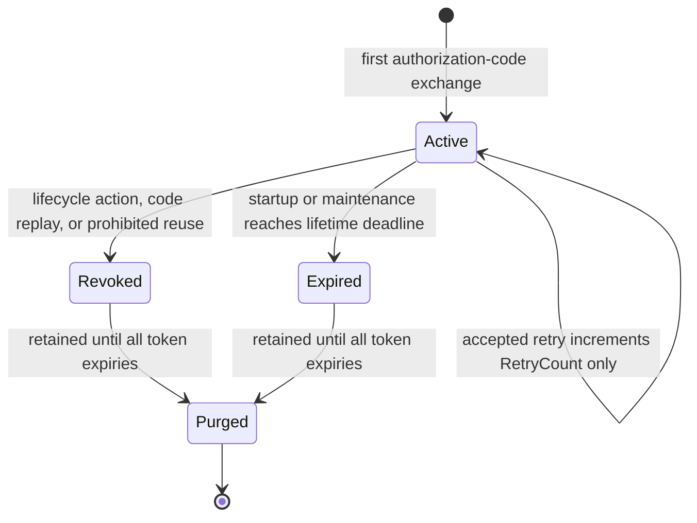

# Data Model: Consent-Bound Refresh Sessions

**Specification**: [spec.md](spec.md)  
**Decisions**: [research.md](research.md)  
**Storage contract**: [contracts/storage.md](contracts/storage.md)

## 1. RefreshSession aggregate root

One root represents the first refresh-token issuance from one successful authorization-code exchange. Its UUID is the authorization-code UUID already used as Fosite's request ID, not a foreign key to the expiring code row. Generate `id.RefreshSessionID` through `internal/domain/id/gen_ids.go`. Rotations keep this root and its original authorization evidence.

| Field | Domain type | Constraint / purpose |
|-------|-------------|----------------------|
| ID | `id.RefreshSessionID` | Nonzero UUID primary key, equal to the original authorization-code request UUID. Immutable. |
| OriginalGrantID | `id.GrantID` | Nonzero ID from the active `UserDelegationDecision` at first issuance. Immutable origin binding; later refresh requires the same currently active grant ID. |
| OriginalTokenSignature | `string` | Lowercase 64-character SHA-256 hex digest of the first issued refresh token. Must identify a persisted token in this root with `IssuedAt == StartedAt`. Immutable. |
| AgentID | `id.AgentID` | Nonzero original registered agent. SQL foreign key with delete cascade. Immutable. |
| Principal | `id.Principal` | Nonempty original user identity. Immutable, byte-for-byte. |
| ClientID | `id.ClientID` | Nonempty original OAuth client identifier, including CIMD URL identifiers. Immutable. |
| Scope | `string` | Immutable, space-delimited, sorted, duplicate-free set of originally granted scopes. A later narrower request limits only its returned access token. |
| Email | `*string` | Nullable profile email from original authorization; a refresh does not fetch a replacement upstream profile. |
| DisplayName | `string` | Original authorization display name; empty is permitted, and refresh keeps that value. |
| StartedAt | UTC `time.Time` | Exact first refresh-token issuance time from the shared clock. Must equal the first token's `IssuedAt`. Immutable. |
| LastFreshAt | UTC `time.Time` | Initially `StartedAt`; advances only on a fresh successful rotation to the successor's `IssuedAt`. |
| AbsoluteExpiresAt | Nullable UTC `time.Time` | Persisted effective absolute deadline. Null means no absolute deadline. |
| InactivityExpiresAt | UTC `time.Time` | Persisted effective inactivity deadline, initially `StartedAt + InactivityLifetime`. |
| RetainUntil | UTC `time.Time` | Maximum finite `ExpiresAt` of all recorded root tokens, including matching legacy descendants discovered during revocation. Initialized from the first token, greater than `StartedAt`, and never decreases. Terminal state stays through this bound. |
| BranchKeyID | `string` | Nonempty immutable deterministic ID `refresh_<UUID>_branch_key`, where UUID is `ID`. This is the refresh-session encryption namespace, not `service_id` or `kid`. |
| CurrentSignature | `string` | Lowercase 64-character SHA-256 hex digest of exactly one unconsumed token in this root. |
| PreviousSignature | Nullable `string` | Digest of the immediately preceding consumed token; differs from `CurrentSignature`. Retain classification metadata after ciphertext erasure. |
| PreviousConsumedAt | Nullable UTC `time.Time` | First successful use of `PreviousSignature`; never changes on retry. |
| ReuseUntil | Nullable UTC `time.Time` | `PreviousConsumedAt + ReuseInterval` at consumption. Fixed; never moves on retry. |
| OriginalRequestedScope | Nullable `string` | Canonical requested scope of the refresh that consumed `PreviousSignature`. Non-null when a predecessor exists, including the empty request scope. Changes only on a fresh rotation. |
| OriginalRequestContextFingerprint | Nullable `string` | Lowercase 64-character SHA-256 hex digest of the canonical, redacted client-host/user-agent pair on first consumption. Non-null with a predecessor; compare with retry context for audit only. |
| RetryCiphertext | Nullable opaque `[]byte` | Original response encrypted through `EncryptionPort` with authenticated refresh-session AAD. Never store plaintext credentials. |
| RetryAccessExpiresAt | Nullable UTC `time.Time` | Actual signed expiry of the original access token; set with predecessor metadata, retained after ciphertext erasure. |
| RetryExpiresAt | Nullable UTC `time.Time` | `min(ReuseUntil, RetryAccessExpiresAt)`; erased ciphertext cannot extend past this instant. |
| RetryCount | `int` | Integer `0..3`, initialized/reset to 0 on initial issuance/fresh rotation. Increments once per committed stored-result authorization, even if its response or commit acknowledgement is lost. Confirmed rollback leaves it unchanged. |
| RevokedAt | Nullable UTC `time.Time` | Terminal revocation; never cleared. |
| ExpiredAt | Nullable UTC `time.Time` | Terminal lifetime expiry committed by startup/maintenance, not a denied request. Never cleared. |
| TerminalReason | Nullable bounded enum | Null iff active. Terminal value is one of `grant_deleted`, `expired_grant_renewal`, `agent_deleted`, `credential_revoked`, `code_replay`, `prohibited_reuse`, `absolute_expiry`, or `inactivity_expiry`; never credential replacement. |

The root lives in `internal/domain/storage/refresh_session.go`. Policy stays in `internal/domain/oauth2server/refresh_policy.go`. Storage sees opaque retry ciphertext only.

### Invariants

- A root exists only after the first token, original code identity, and an active `UserDelegationDecision` are recorded atomically. Store the decision's `GrantID` as `OriginalGrantID` and `StartedAt` from the first token's shared-clock issuance. Never reconstruct these from a later rotation.
- Original ownership, `Scope`, `BranchKeyID`, and `StartedAt` never change. `LastFreshAt >= StartedAt`, and `RetainUntil` never decreases.
- `CurrentSignature` identifies one unconsumed child token. `PreviousSignature` identifies its consumed immediate predecessor. Every child has the same `SessionID`.
- The previous signature, consumption time, fixed reuse deadline, normalized requested scope, request-context fingerprint, and retry expiries are all present together or all absent. `RetryCiphertext` can be null after its expiry, successor rotation, or terminal revocation.
- At zero reuse, `ReuseUntil == PreviousConsumedAt` and no ciphertext is persisted. The consumed signature remains for prohibited-reuse detection.
- A fresh rotation stores an original response and resets `RetryCount` to 0. Each committed retry authorization increases only `RetryCount` and audit records. It changes no lifetime, consumption, or reuse clock. A lost response or commit acknowledgement does not refund the count. A fourth otherwise-eligible presentation is prohibited reuse.
- At most one of `RevokedAt` or `ExpiredAt` can be non-null. `TerminalReason` is null iff both are null. A terminal transition clears live ciphertext in the same transaction; no policy or later grant/credential restores it.
- Save rejects changed immutable fields, invalid signatures, retry count outside `0..3`, inconsistent recovery fields, and any transition from terminal to active.
- Lifecycle changes and session mutation use one agent-scoped unit of work. Only bound-client prohibited reuse commits an authorization rejection. Pre-commit errors and confirmed rollback preserve state. An indeterminate commit follows the recovery rules in section 5.

The request-context fingerprint hashes a length-prefixed UTF-8 pair: the resolved client host without a port and the truncated user agent. Use the existing trusted-proxy/security-context rules; an untrusted forwarded header never changes the host. Represent an unavailable member as an empty string. Exclude request IDs, timestamps, tokens, and credentials so independent retries have comparable context.

## 2. RefreshToken

| Field | Domain type | Constraint / purpose |
|-------|-------------|----------------------|
| Signature | `string` | Lowercase 64-character SHA-256 hex digest of the opaque token, unique primary key. Never store the raw refresh value. |
| SessionID | `id.RefreshSessionID` | Required nonzero parent root UUID. Immutable. |
| IssuedAt | UTC `time.Time` | Issuance time from the shared clock; first token equals root `StartedAt`. Immutable. |
| ExpiresAt | UTC `time.Time` | Finite issued refresh-token expiry, strictly later than `IssuedAt`, derived from the shared issuance time and inactivity lifetime. Immutable. |
| UsedAt | Nullable UTC `time.Time` | First successful consumption from the shared clock. A retry never overwrites it. |

`internal/domain/storage/refresh_token.go` replaces the source-level `RefreshTokenSession` model. `ExpiresAt` limits fresh consumption of an unused current token. Consumed tokens remain replay evidence after their individual expiry. Their eligibility follows predecessor metadata and FR-015, not a pre-classification token-expiry denial. No raw token or root ownership is duplicated per child.

A token is current only if its signature equals `CurrentSignature`, `UsedAt` is null, and its `ExpiresAt` is in the future. For an anchored PostgreSQL token, first lock and re-read its matching legacy current row before trusting this new-table state. A consumed token qualifies for retry only through the root's previous-token metadata. Older signatures remain replay evidence while the root is active.

Keep every child and consumed signature through the active root's entire life. After terminal state, keep root, token signatures, and revocation state through `RetainUntil` (the greatest recorded child expiry), except an agent deletion after durable revocation audit. A purge never creates a root or makes a token usable again.

## 3. RefreshSessionPolicy value object

| Field | Resolved type | Default |
|-------|---------------|---------|
| ReuseInterval | `time.Duration` | 30 seconds |
| AbsoluteLifetime | `time.Duration` | Zero, meaning no absolute deadline |
| InactivityLifetime | `time.Duration` | 720 hours |

The resolved policy receives the same values from configuration files, environment variables, three CLI flags, and the deployment chart. The existing `local.refresh_token_ttl` remains the inactivity lifetime; omitted or zero keeps its 720-hour default. An explicit zero reuse interval disables retries, while a zero absolute lifetime has no absolute deadline.

Place `RefreshSessionPolicy` in `internal/domain/storage/refresh_session.go`. It does not import Fosite or infrastructure. Policy validation and every deadline decision receive an explicit shared-clock `time.Time`.

For decision time T, supplied by `AuthorizationSessionCoordinator.Run` after the agent gate:

- A finite absolute candidate is `StartedAt + AbsoluteLifetime`. The effective inactivity deadline for the current activity interval is `min(InactivityExpiresAt, LastFreshAt + InactivityLifetime, current token ExpiresAt)`. Check elapsed stored deadlines before applying any policy increase.
- An applicable grant, session, refresh-token, access-token, or reuse deadline is expired at T equal to its deadline. The default reuse limit is **exactly 30 seconds**: a first consumption at T permits retries only at times strictly before T + 30 seconds.
- A fresh successful rotation sets `LastFreshAt` and its successor's `IssuedAt` to T. It sets both the successor's `ExpiresAt` and the new `InactivityExpiresAt` from T plus the current configured inactivity lifetime. A retry changes none of these times.
- Retry eligibility requires `T < ReuseUntil`, `T < RetryAccessExpiresAt`, a current unused successor, matching normalized requested scope, bound client, active consent, and valid lifetimes. At `RetryCount == 3`, any further eligible presentation is prohibited reuse.
- A narrower requested scope restricts **only the returned access token**. The session's immutable `Scope` stays the ceiling for all later refreshes. An empty requested scope stays distinct from an explicit scope set; normalize nonempty scope sets by splitting, deduplicating, and sorting scope tokens before comparison.

The same rules apply to public and confidential clients. Refresh access-token JWT expiry retains its existing `token_ttl` contract.

### Policy changes and terminal expiry

Startup maintenance stores effective deadlines. Before readiness, it scans active roots in bounded batches under each agent gate. It obtains fresh shared time and checks stored deadlines before policy increases.

For an active root, persist the shorter effective `InactivityExpiresAt` bounded by current policy and current token `ExpiresAt`. A later increase cannot extend that activity interval. Recompute and persist a nonterminal absolute deadline from `StartedAt` only after ruling out elapsed stored deadlines. If a stored or newly effective deadline elapsed, commit terminal expiry with legacy invalidation instead. Startup also clears overdue live retry ciphertext before readiness.

Runtime requests use the effective inactivity deadline and current absolute policy under the gate, then recheck before a successful commit. They deny expired sessions **without marking them terminal**; startup/maintenance owns terminal expiry and live retry cleanup. A shorter policy applies to old clocks. A longer inactivity policy cannot extend an already-issued token or the current activity interval. Schedule cleanup from `RetryExpiresAt` rather than relying only on the existing one-minute sweep.

`ReuseUntil` remains the first-consumption deadline. A smaller current interval can shorten eligibility; a larger one cannot extend an existing predecessor's window or stored result. Later rotations use the new interval. All comparisons use `AuthorizationClock.Now(ctx)`, not an instance-local `time.Now()`.

## 4. RefreshRetryPayload and encryption

This issuer-internal payload is authenticated ciphertext through the existing `ports.EncryptionPort`. It is not a JWE, new network token type, or public endpoint. Serialization has exact `purpose = refresh_retry` and supported `version = 1`.

| Payload field | Constraint |
|---------------|------------|
| `session_id`, `original_grant_id`, `original_token_signature`, `started_at` | Exactly match the immutable root identity and origin evidence. |
| `principal`, `agent_id`, `client_id` | Exactly match immutable root ownership and the authenticated, bound client. |
| `predecessor_signature`, `successor_signature` | Match `PreviousSignature`, `CurrentSignature`, submitted digest, and the digest of the plaintext successor refresh token. |
| `original_requested_scope`, `scope` | Match the normalized request scope and exact original response scope. Do not reduce root `Scope`. |
| `original_request_context_fingerprint` | Match stored canonical redacted audit-context fingerprint. It does not authorize a retry. |
| `access_token`, `refresh_token`, `token_type` | Exact original successful response values; never minted or recalculated on retry. |
| `access_expires_at`, `retry_expires_at` | Match stored actual JWT expiry and fixed recovery expiry; both strictly later than the authorization decision for success. |

`BranchKeySubjectKindRefreshSession` uses one and only one AAD key: `{"refresh_session_id":"<session UUID>"}`. Its branch key ID is `refresh_<UUID>_branch_key`, recorded as root `BranchKeyID`. Extend the typed subject parser, validation, deterministic ID supplier, branch-key repository, and keyring routes. Do not encode this subject as `service_id` or `kid`. Accepted ADR 038 extends ADR 008's approved subject list. This model remains an implementation design, not implemented runtime support.

The issuer provisions a branch key through the existing `BranchKeyManager` when its configured adapter needs one. It prepares provisioning and request-local signing material outside the SQL lock when possible. Encryption and decryption use the existing vetted raw-key or KMS `EncryptionPort` adapter; no new crypto primitive, JWE key, or plaintext fallback exists. All subject-bound lookups inside the transaction use the ambient executor.

Decrypt only after authentication, client binding, revocation, grant, lifetime, current agent refresh-grant capability, and token-classification checks. Check response-scope eligibility only for a fresh or otherwise eligible retry success. Never decrypt a prohibited retry to inspect scope. Compare every payload field to authoritative root/token state after authenticated decryption. An invalid payload, missing key, failed decryption, or mismatched binding returns `server_error`, no tokens, and no request-state mutation.

Use the access-token strategy's existing mint timestamp for `RetryAccessExpiresAt`; do not parse the JWT to reconstruct expiry. Erase **live** ciphertext at the earlier of `ReuseUntil` and access expiry, when the successor rotates, or on terminal state. Keep predecessor metadata after ciphertext erasure so an expired original access token alone cannot revoke the still-valid successor.

Never include plaintext credentials in logs or backups. Encrypted backup copies of persisted retry bytes are allowed; physical erasure of those backups is not promised. A restored copy alone cannot authorize a return. If current revocation history cannot be proven after restoration, clear cached results **and require fresh authorization** for the affected roots. Otherwise check live consent, revocation, clocks, client binding, and lineage before decryption.

## 5. State transitions and decision order

A replacement credential or active-grant edit does not revoke the root. An expired-grant renewal revokes all older roots for that principal and agent. A new grant or credential cannot restore a revoked root; new authorization creates a new root. Authorization-code replay revokes the root created by that code.

For each refresh, apply this order inside the agent scope:

1. Authenticate the client and bind it to the token's immutable `ClientID`. Missing/invalid authentication, client mismatch, and unknown token have no mutation.
2. Check the root's terminal revocation state, then call `UserDelegationVerifier` at the supplied decision time. Require its `UserDelegationDecision` to be active with `GrantID == OriginalGrantID` and `ValidUntil` absent or later than decision time. Missing/expired grant or different grant ID is `invalid_grant`; unavailable grant state is `server_error`.
3. Check stored and effective session deadlines, including the current token's immutable expiry. Deny an expired session without changing the root or tokens.
4. Check the agent's current refresh-grant capability. A missing capability returns the existing `unauthorized_client` outcome without mutation. Consent and lifetime failures take precedence over this check.
5. Classify the signature as current, immediately previous, or prohibited reuse. Before treating an anchored current token as unused, lock and re-read its legacy mirror; hold that lock through rotation. If an older writer consumed the mirror without matching new-token/history evidence, return `invalid_grant` for the unsupported lineage without mutation or another successor. For predecessor recovery, enforce matching normalized requested scope, the fixed window, an unused successor, retry count, and access expiry. An older, out-of-window, scope-mismatched, or fourth otherwise-eligible presentation is prohibited reuse and commits revocation, even if the old response scope was withdrawn. An unused current token must remain individually unexpired before fresh consumption; individual expiry of a consumed signature cannot bypass prohibited-reuse revocation.
6. On the fresh-current path, use Fosite validation to prepare one successor and its candidate response. On an otherwise eligible retry, decrypt and compare all stored-result bindings. Never decrypt prohibited reuse just to inspect scope.
7. Only for a fresh or otherwise eligible retry result, check its response scope against current agent permissions. Keep the existing `invalid_scope`/`scope_not_granted` conventions and do not mutate on failure. For retry, check the exact original response scope, not a newly narrowed request.
8. On an allowed fresh path, atomically store the successor, updated root clocks, encrypted recovery result, and anchored legacy mirror. On an allowed retry, increment only `RetryCount`, audit the request-context fingerprint comparison, and return the original result with remaining `expires_in`.
9. Only bound-client prohibited reuse commits revocation and erases ciphertext. Other authorization denials, pre-commit errors, and confirmed rollback preserve state. Startup and maintenance commit terminal expiry separately.
10. Obtain `AuthorizationClock.Now(ctx)` again before a successful commit. Recheck all applicable FR-029 authorization and eligibility conditions at that shared time. Include client binding, revocation, consent, effective lifetimes, capability, token eligibility, and candidate response scope. Validate the staged outcome without treating this request's own consumption as replay or counting its retry increment twice. On failure, roll back request changes and return no tokens. Return success only after an acknowledged commit. An indeterminate commit returns token-free `server_error`, not a rollback claim.

Lifecycle updates, including idempotent deletion with no grant, commit with revocation as one outcome. A callback error rolls back grant/agent/credential changes. A prohibited-reuse denial commits revocation before returning `invalid_grant`; a rollback or commit failure returns `server_error` instead. A denial for unavailable consent does not consume a token.

An indeterminate commit can represent either committed or rolled-back work. A later request acquires the agent guard and reads authoritative durable state, including the locked legacy current row before treating an anchored new-table token as unused. An unused current token can rotate normally only if its mirror remains consistent. Old-writer consumption without matching new-token/history evidence makes that lineage unsupported; return `invalid_grant` without a new result. Committed consumption follows the ordinary predecessor and prohibited-reuse rules. An eligible predecessor returns only the committed original pair within its unchanged deadlines and retry limit. At zero reuse, committed consumption is prohibited reuse and requires fresh authorization. If durable state remains unavailable or inconsistent, return token-free `server_error`. Never mint a second successor, refund a committed retry count, or introduce an error-recovery bypass.

Test lost acknowledgements for both rotation and retry-count commits. Use a test-owned PostgreSQL connection fault around COMMIT and verify actual durable outcomes. Separate this from confirmed pre-commit rollback tests. For code replay, first prove a bounded identical-result predecessor retry succeeds; then replay the code and prove both current and still-retry-eligible predecessor tokens fail while an unrelated session remains usable. This positive recovery control belongs to US2-S10; complete that scenario only after US3/T050/T072.

### Revocation receipt

DB-008 uses a small immutable revocation-audit projection, not a new public audit endpoint. Each receipt stores SessionID, AgentID, Principal, ClientID, terminal Reason, shared At timestamp, and redacted request-context identifiers. Its key is `(session_id, reason)`. It has no foreign key that deletes it with the agent or root.

The revocation repository inserts the receipt in the same transaction before deleting an agent or its roots. A failed receipt write rolls back the lifecycle action. Post-commit logs report success from that receipt. Memory stages the same projection. This avoids treating a pre-commit success log as a durable audit record.

## 6. PostgreSQL schema, legacy bridge, and indexes

Migration `036_consent_bound_refresh_sessions.{up,down}.sql` adds:

- `refresh_sessions`: UUID root, immutable origin/ownership, clocks, `retain_until`, `branch_key_id`, signatures, request-context/scope metadata, `retry_count` with `CHECK (retry_count BETWEEN 0 AND 3)`, encrypted bytes, and terminal state.
- `refresh_tokens`: unique signature, required root UUID with `ON DELETE CASCADE`, `issued_at`, finite `expires_at`, and nullable `used_at`.
- Additive nullable `session_id UUID REFERENCES refresh_sessions(id) ON DELETE CASCADE` and `predecessor_signature TEXT` columns on the existing `refresh_token_sessions` table. A non-null predecessor signature is lowercase 64-character SHA-256 hex. An initial anchored row has a null predecessor; later anchored rows name the previous signature. Older binaries can insert both fields as null. New writes populate `session_id` and token ancestry atomically with root/token writes, so old binaries can read mirrors while rolling forward. The new issuer never creates an unanchored row.
- Indexes on root `(agent_id, principal)`, child `session_id`, legacy `session_id`/`request_id`, due deadlines and `retain_until`; one unconsumed child per root via a partial unique index. A legacy mirror of a current token also keeps the existing schema and predicates that older binaries require.
- `refresh_revocation_receipts`: immutable, non-credential audit projection keyed by `(session_id, reason)`, inserted transactionally before root/agent cascade deletion and retained independently.

New code uses only the root/token domain models and ports. Legacy rows are a schema-level interoperability bridge, not a source-code model alias or a fallback authorization path. No circular root-current-signature foreign key is needed; the guarded transaction enforces the relationship.

Treat a pre-existing or older-writer row as trustworthy only with independent durable evidence of its **first issued token**, original active grant ID and issuance time, principal, agent, client, complete rotation ancestry, last fresh rotation, and revocation history. Verify every link; do not infer origin from `request_id`, earliest surviving `created_at`, a token expiry, or deployment time. The old table has no trustworthy origin/ancestry evidence by itself, so unsupported rows and unanchored descendants written during a rolling deployment require fresh authorization under FR-025. An independently evidenced family keeps its original clocks.

Lifecycle, code-replay revocation, and terminal lifetime expiry update the root **and matching unconsumed legacy mirror/current and descendant rows in the same scoped transaction**, including rows reachable by the original request ID. Terminal expiry commits `ExpiredAt`, its absolute/inactivity reason, and ciphertext erasure with those legacy invalidations. Include matched legacy token expiries in `RetainUntil` conservatively without trusting them for authorization. An older `MarkUsed` with `WHERE used_at IS NULL` cannot succeed after committed revocation or expiry. A failed mirror update rolls back the entire terminal maintenance transition; startup reconciliation must block readiness. Lock and recheck legacy current rows after concurrent old-writer transactions so a successor does not escape revocation or expiry.

Before fresh consumption, lock and re-read the corresponding anchored legacy current row while holding the agent scope; hold that row lock through rotation. If an older writer consumed the mirror without matching new-token/history evidence, reject the original and its unsupported descendant as unsupported lineage: `invalid_grant`, no result, no new successor, and no request mutation. Recheck any old-writer descendants during revocation. The old-first interleaving exposes the consumed mirror; the new-first interleaving blocks the older writer's `MarkUsed` until the new transaction completes. Never invent a descendant start, consumption timestamp, or retry result.

Keep `refresh_token_sessions` throughout mixed-version rollout and rollback. Do not drop it on upgrade. A down migration must not reactivate a revoked/expired lineage; mark legacy rows unusable before removing new state, and require fresh authorization after rollback where origin cannot be proved. Binary-only rollback cannot restore sessions terminalized by expiry. Run outgoing-policy expiry reconciliation with token traffic and old writers quiesced before admitting old binaries, even without a down migration. Down/reapply remains protected. Preserve unrelated agents, grants, credentials, and third-party sessions.

## 7. Memory and retention

Memory uses the same root/token invariants, typed encryption subject, and shared coordinator clock. Its agent-scoped write-set contains only touched agent, grant, credential, code/PKCE, refresh, and legacy-bridge records. It validates before one non-failing publish; callback error discards all staged changes. A new memory-backed process loses its session history and rejects old tokens. Only shared PostgreSQL supports restart/replica recovery.

Deadline-driven maintenance erases due live retry ciphertext by `RetryExpiresAt` without erasing live-family signature history; startup clears overdue ciphertext before readiness. Under `AuthorizationSessionCoordinator.Run` and the shared clock, maintenance persists shortened inactivity deadlines on active roots and terminalizes due roots with ciphertext erasure and matching legacy current/descendant invalidation in one scoped transaction. A failed legacy update rolls back the transition and blocks startup readiness. Purge terminal root/token/legacy history only at or after `RetainUntil`. Agent deletion can cascade root removal only after the revocation audit record. A purged or unknown signature cannot recreate a root.
