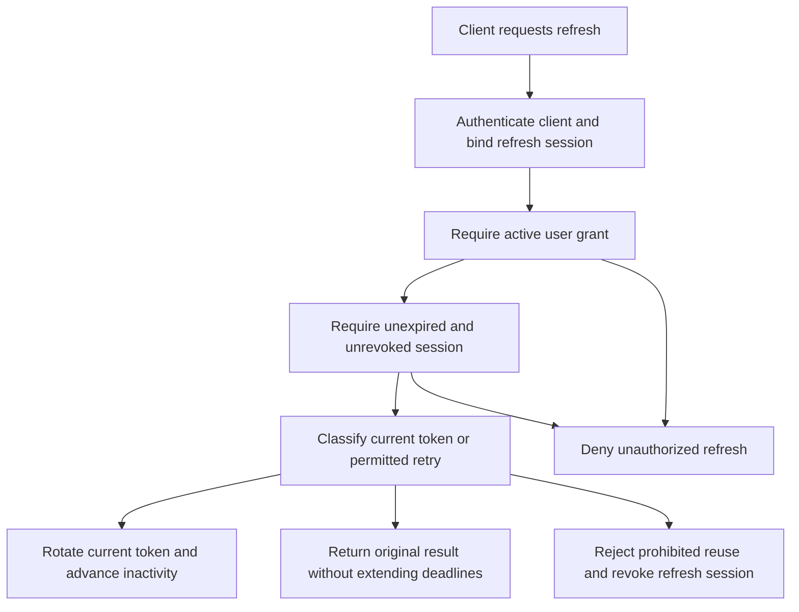

# Feature Specification: Consent-Bound Refresh Sessions

**Feature Branch**: `049-fix-refresh-consent`

**Created**: 2026-09-30

**Status**: Draft

**Input**: User description: "Refresh ignores consent. A client can continue rotating refresh tokens after the user revokes consent or the grant expires. Resource servers that trust broker-issued tokens directly remain exposed. Check active consent during refresh. Revoke refresh sessions on grant deletion, agent deletion, and credential revocation. Configure a reuse interval (default: 2 minutes), an absolute session lifetime (default: non-expiring), and a session inactivity lifetime, also called refresh token lifetime (default: 30 days)."

## User Scenarios & Testing *(mandatory)*

### User Story 1 - Stop Renewal After Consent Ends (Priority: P1)

A user delegates an agent and later revokes that delegation. The agent must stop obtaining new broker-issued tokens for that user. The same rule applies after a time-limited grant expires.

**Why this priority**: Consent must remain an authorization requirement throughout the session, not only during initial authorization.

**Independent Test**: Authorize an agent, obtain and rotate a refresh token, then revoke or expire its grant. Attempt renewal with the retained tokens.

**Acceptance Scenarios**:

1. **Given** an eligible client holds a valid refresh token and an active grant, **When** it refreshes, **Then** it receives replacement tokens for the same principal and agent.
2. **Given** a user authorized an agent and obtained refresh tokens, **When** the user revokes consent through the existing UI and the agent refreshes, **Then** renewal fails with an invalid-grant error and no tokens.
3. **Given** a grant has a finite validity deadline, **When** the agent refreshes at or after that deadline, **Then** renewal fails with an invalid-grant error and no tokens.
4. **Given** consent ends while the previous refresh token remains inside its reuse interval, **When** the agent retries that token, **Then** renewal fails without returning the earlier token result.
5. **Given** the broker cannot determine whether the grant remains active, **When** the agent refreshes, **Then** renewal fails with a server error and no tokens.
6. **Given** a token belongs to one principal and agent, **When** another client tries to refresh it using its own active grant, **Then** renewal fails without changing the token's owner.
7. **Given** a resource server accepts a broker access token through JWKS validation, **When** the user revokes consent, **Then** refresh cannot supply another token. The existing access token retains its original expiry.

---

### User Story 2 - End Sessions With Their Authorization (Priority: P1)

Users and administrators expect grant deletion, agent deletion, and credential revocation to end the related refresh sessions. A later grant or credential must not restore those sessions.

**Why this priority**: An active-grant check alone cannot prevent old tokens from becoming usable after the user grants consent again.

**Independent Test**: Create multiple sessions across principals and agents. Complete each existing lifecycle action and attempt renewal with affected and unaffected tokens.

**Acceptance Scenarios**:

1. **Given** two users delegated the same agent, **When** one user deletes their grant, **Then** all their refresh sessions for that agent become unusable. The other user's sessions remain usable.
2. **Given** a user delegated two agents, **When** either existing consent-deletion path deletes one grant, **Then** that agent's sessions become unusable. The other agent and connected third-party sessions remain unchanged.
3. **Given** several users hold refresh sessions for an agent, **When** an administrator deletes that agent, **Then** every refresh session for that agent becomes unusable. Other agents remain unaffected.
4. **Given** an agent has credentials and refresh sessions for several users, **When** an administrator revokes its credentials, **Then** every refresh session for that agent becomes unusable. Treating the agent as a public client does not restore those sessions.
5. **Given** a lifecycle action revoked a session, **When** the user grants consent again or an administrator creates replacement credentials, **Then** every token from the revoked session remains unusable. Fresh authorization can create a new session.
6. **Given** a lifecycle action overlaps a refresh request, **When** the lifecycle action reports success, **Then** all affected refresh tokens, including a concurrent replacement, become unusable on every broker instance.
7. **Given** a lifecycle action cannot complete session revocation, **When** it finishes, **Then** it reports failure rather than successful completion. It does not leave a partially completed authorization change.

---

### User Story 3 - Retry Rotation Within a Bounded Interval (Priority: P2)

An agent can lose a successful refresh response or send overlapping refresh requests. A short reuse interval lets it recover without triggering a false replay alarm.

**Why this priority**: Rotation must preserve replay protection without unnecessarily interrupting legitimate sessions after a lost response.

**Independent Test**: Authorize an agent, lose a refresh response, and retry the previous token before and after the configured interval.

**Acceptance Scenarios**:

1. **Given** the default configuration and a lost successful refresh response, **When** the same client retries the immediately previous token before 2 minutes elapse, **Then** it receives the same token result. The session remains usable.
2. **Given** two requests concurrently use the current refresh token, **When** both otherwise satisfy authorization and lifetime requirements, **Then** they converge on one replacement refresh token. They do not create independent session branches.
3. **Given** the previous token's first successful use occurred at time T, **When** the client retries at or after T plus the reuse interval, **Then** renewal fails. The remaining refresh tokens in that session become unusable.
4. **Given** the replacement token already rotated again, **When** the client presents its older predecessor within that predecessor's original interval, **Then** renewal fails and the session's remaining refresh tokens become unusable.
5. **Given** the operator configures a zero reuse interval, **When** a client repeats a successfully consumed token, **Then** renewal fails immediately and the session's remaining refresh tokens become unusable.
6. **Given** an eligible retry reaches a different broker instance or follows a restart, **When** the client retries within the interval, **Then** it receives the same token result under the same authorization rules.
7. **Given** a retry would occur inside the reuse interval but after a session lifetime deadline, **When** the client retries, **Then** renewal fails without returning tokens or extending either deadline.
8. **Given** the original access token expires before the reuse interval ends, **When** the client retries its predecessor, **Then** retry returns no tokens. The still-valid current refresh token remains usable and its deadlines do not change.

---

### User Story 4 - Bound Total Session Duration (Priority: P2)

An operator can limit the total lifetime of a refresh session. Continuous activity cannot extend that lifetime.

**Why this priority**: Operators need a fixed reauthorization interval independent of an agent's refresh frequency.

**Independent Test**: Configure a finite absolute lifetime, authorize an agent, refresh repeatedly, and attempt renewal at the original deadline.

**Acceptance Scenarios**:

1. **Given** a finite absolute lifetime and an active grant, **When** the client refreshes before the absolute deadline, **Then** renewal succeeds without changing the session's original start time or absolute deadline.
2. **Given** the client refreshes frequently enough to avoid inactivity expiry, **When** the absolute deadline arrives, **Then** every further refresh fails until fresh authorization creates a new session.
3. **Given** the default non-expiring absolute lifetime, **When** the client remains active beyond 30 days with an active grant, **Then** elapsed total duration alone does not prevent renewal.
4. **Given** a broker restart or a refresh on another instance, **When** the client attempts renewal, **Then** the same original absolute deadline applies.

---

### User Story 5 - Expire Inactive Sessions (Priority: P2)

An operator can limit how long an agent can leave a refresh session inactive. Successful rotation renews this interval, but ordinary resource access and repeated retries do not.

**Why this priority**: Unused refresh credentials must not remain redeemable indefinitely under the default configuration.

**Independent Test**: Authorize an agent, configure a short inactivity lifetime, and compare fresh rotations, duplicate retries, and periods without refresh activity.

**Acceptance Scenarios**:

1. **Given** the default configuration, **When** 30 days pass without a fresh successful refresh, **Then** the client cannot renew that session.
2. **Given** a finite inactivity lifetime and an active grant, **When** the current token rotates successfully before expiry, **Then** the inactivity deadline advances by that lifetime from the rotation time.
3. **Given** a finite inactivity lifetime, **When** the client accesses resources but does not refresh before the deadline, **Then** the session expires despite that resource activity.
4. **Given** the client repeats a permitted previous-token retry, **When** the broker returns the original token result, **Then** neither the inactivity deadline nor the reuse interval advances.
5. **Given** an operator configures a non-default inactivity lifetime, **When** a session remains inactive for that duration, **Then** renewal fails at the configured deadline, not the 30-day default.

---

### User Story 6 - Deploy the Policy Without Changing Upstream Sessions (Priority: P2)

Operators can configure these controls through existing deployment mechanisms. Existing clients retain the refresh-token lifetime configuration they already use.

**Why this priority**: Security configuration must have consistent behavior across deployment methods and must not change upstream provider contracts.

**Independent Test**: Deploy local and hybrid configurations with explicit durations. Exercise pre-existing local sessions and a proxied client.

**Acceptance Scenarios**:

1. **Given** equivalent configuration through a file, environment variables, command-line flags, or the broker deployment chart, **When** a client refreshes, **Then** the same reuse and lifetime limits apply.
2. **Given** an existing deployment specifies `local.refresh_token_ttl`, **When** it deploys this feature, **Then** that value remains the session inactivity lifetime without requiring a renamed configuration key.
3. **Given** malformed or disallowed duration values, **When** the operator starts the broker, **Then** startup fails with a message that identifies the invalid configuration.
4. **Given** a pre-existing refresh session lacks trustworthy lifetime or authorization-lineage information, **When** the client attempts renewal after deployment, **Then** renewal fails and fresh authorization is required. The broker does not invent a new start time.
5. **Given** a client uses upstream passthrough in proxy mode or hybrid mode, **When** it refreshes, **Then** the upstream server continues to control its rotation and lifetime behavior.
6. **Given** an existing session, **When** the operator shortens a lifetime and restarts the broker, **Then** the new limit applies to the original clocks. Increasing a limit cannot restore an expired or revoked session.

### Edge Cases

- At a deadline, the grant, session, or reuse interval is expired. A request immediately before the deadline remains eligible under the other controls.
- Missing consent is different from unavailable consent data. Both prevent issuance, but only unavailable data produces a server error.
- A reuse interval never overrides grant expiry, lifecycle revocation, inactivity expiry, or absolute expiry.
- Public clients require active consent and client binding just as confidential clients do.
- Multiple sessions for one principal and agent all end on grant deletion, including unused tokens and tokens still eligible for retry.
- A successful lifecycle action does not allow a racing refresh to leave a usable replacement session behind.
- A failed refresh, invalid client request, or allowed duplicate retry does not count as session activity.
- Existing broker access tokens can remain valid until their own expiry at resource servers that only validate signatures and token claims.

## Requirements *(mandatory)*

### Functional Requirements

- **FR-001**: Every local refresh MUST require an active `UserGrant` for the principal and agent bound to the refresh session. This includes permitted retries.
- **FR-002**: A grant MUST be active only while it exists and its `ValidUntil` is absent or strictly later than the authorization decision.
- **FR-003**: Missing or expired consent MUST prevent all token returns. Unknown consent state MUST fail closed without a token result.
- **FR-004**: Refresh MUST preserve the original principal, agent, client binding, and scope ceiling. Caller-provided identity MUST NOT replace session-bound identity.
- **FR-005**: Every grant-deletion path MUST revoke all local refresh sessions for that principal and agent, across all request chains.
- **FR-006**: Agent deletion MUST revoke all local refresh sessions for that agent across all principals.
- **FR-007**: Credential revocation MUST revoke all local refresh sessions for that agent across all principals. Public-client fallback MUST NOT restore those sessions.
- **FR-008**: Revocation MUST be permanent for affected sessions. A replacement grant, recreated agent, or replacement credential MUST NOT reactivate their tokens.
- **FR-009**: Lifecycle changes and session revocation MUST complete as one consistent outcome. Success MUST mean no affected refresh token remains usable across broker instances.
- **FR-010**: Revocation MUST include current tokens, retry-eligible predecessors, and replacements from overlapping refresh requests. Unrelated principals and agents MUST remain unaffected.
- **FR-011**: Fresh successful refresh MUST rotate the current token. Concurrent requests MUST produce one successor rather than independent branches.
- **FR-012**: The reuse interval MUST start at the predecessor's first successful consumption. It MUST NOT slide on subsequent requests.
- **FR-013**: Only the immediately previous token is retry-eligible while its successor remains current and unused. Its original access token must remain unexpired.
- **FR-014**: An eligible retry MUST return the original access token and replacement refresh token, not mint another pair. Remaining access-token validity MUST NOT exceed its original expiry.
- **FR-015**: A zero reuse interval MUST disable retry eligibility. Older-predecessor reuse or reuse at or after the interval MUST revoke remaining refresh tokens in that session.
- **FR-016**: Retry eligibility MUST preserve client authentication, client binding, active consent, and both session lifetime checks. It MUST work across instances and restarts.
- **FR-017**: Session start MUST be the first refresh-token issuance from a successful authorization-code exchange. Rotations and retries MUST retain that start.
- **FR-018**: A finite absolute lifetime MUST expire a session at its original start plus that lifetime, regardless of activity. The default MUST impose no absolute deadline.
- **FR-019**: Inactivity MUST start at initial issuance and reset only after a fresh successful rotation. The default inactivity lifetime MUST be 30 days.
- **FR-020**: Resource access, rejected requests, and permitted duplicate retries MUST NOT renew inactivity. Retry responses MUST NOT renew absolute or reuse deadlines.
- **FR-021**: Refresh MUST fail at or after either configured session deadline. A reuse interval MUST NOT permit a response after either deadline.
- **FR-022**: Operators MUST configure the reuse interval and both session lifetimes through the existing broker configuration mechanisms and deployment chart.
- **FR-023**: The existing `local.refresh_token_ttl` configuration MUST remain the single configuration value for session inactivity lifetime.
- **FR-024**: The broker MUST preserve trustworthy session start, last fresh activity, ownership, and revocation history across restart and instance changes.
- **FR-025**: Pre-existing sessions without trustworthy information required by this policy MUST require fresh authorization. Deployment MUST NOT reset their lifetime clocks.
- **FR-026**: These controls MUST apply to local issuance in local and hybrid modes. Upstream passthrough and vaulted third-party token behavior MUST remain unchanged.
- **FR-027**: Existing access tokens MUST retain their existing expiry contract. This feature MUST NOT claim immediate invalidation at signature-only resource servers.
- **FR-028**: An expired original access token MUST prevent retry success without extending deadlines. Expiry alone MUST NOT revoke a still-valid current refresh token.

### Domain Model

**Activity / Flow Diagram**:



**Entities**:

- **UserGrant**: A principal's delegation to an agent. Its presence and optional validity deadline govern every refresh decision.
- **Refresh Session**: One authorization lineage for a principal, agent, and client. It owns an original start, last fresh activity, and revocation state.
- **Refresh Token**: A credential in that session's rotation chain. It is current, a retry-eligible predecessor, consumed, expired, or revoked.
- **Agent Credential**: A client credential whose revocation ends the agent's existing local refresh sessions.

**Aggregates**:

- **Refresh Session**: Its tokens share ownership, lifetime limits, and permanent revocation. Rotation cannot create an independently authorized branch.
- **UserGrant**: Its deletion ends all refresh sessions for the grant's principal and agent, not only the latest session.

**Value Objects**:

- **Reuse Interval**: A fixed interval after first consumption that permits recovery with the immediately previous token.
- **Absolute Session Lifetime**: A maximum total duration from original issuance. Zero means no absolute duration limit.
- **Session Inactivity Lifetime**: The maximum interval between fresh successful rotations, also called Refresh Token Lifetime.

**Domain Events**:

- **RefreshSessionRevoked**: Related authorization ended or prohibited token reuse occurred. The event identifies the affected principal and agent without credentials.
- **RefreshRejected**: The broker denied renewal because authorization, lifetime, or session state did not permit it.
- **RefreshRetryAccepted**: The broker returned an existing token result within the fixed reuse interval without creating a new rotation.

### Configuration Requirements

Configuration applies under `oauth2_authorization_server.local` in local and hybrid deployments:

| Parameter | Default | Meaning | Valid values |
|-----------|---------|---------|--------------|
| `refresh_token_reuse_interval` | `2m` | Fixed previous-token retry interval | Non-negative duration. `0s` disables reuse. |
| `absolute_session_lifetime` | `0s` | Maximum total refresh-session duration | Non-negative duration. `0s` means non-expiring absolute lifetime. |
| `refresh_token_ttl` | `720h` | Session inactivity lifetime / Refresh Token Lifetime | Positive duration. Omission or `0s` retains the existing 30-day default. |

- **CR-001**: Negative or malformed durations MUST fail startup. Explicit zero values MUST have exactly the meanings in the table.
- **CR-002**: The reuse interval MUST NOT enlarge either session lifetime. The earliest authorization or lifetime deadline always takes precedence.
- **CR-003**: Files, environment variables, command-line flags, and the deployment chart MUST expose all three parameters with the existing precedence rules.
- **CR-004**: Configuration documentation and deployment examples MUST explain default values, zero-value semantics, retry behavior, and required reauthorization of unsupported legacy sessions.
- **CR-005**: Configuration changes MUST apply to new and existing sessions without resetting original clocks. Increasing a limit MUST NOT restore expired or revoked sessions.

**Example YAML Configuration**:

```yaml
oauth2_authorization_server:
  mode: local
  local:
    refresh_token_reuse_interval: 2m
    absolute_session_lifetime: 0s
    refresh_token_ttl: 720h
```

**Configuration Location**: Existing local and hybrid examples, the broker configuration reference, and the broker deployment chart.

### API Requirements

- **API-001**: Existing refresh requests MUST retain their request and successful response contracts. No separate refresh-token revocation endpoint is required by this feature.
- **API-002**: Missing or expired consent, revoked sessions, expired lifetimes, and prohibited token reuse MUST return `invalid_grant` without tokens.
- **API-003**: Unavailable authorization data or failed session-state operations MUST return `server_error` without tokens, not an authorization success or fallback.
- **API-004**: Existing consent-deletion, agent-deletion, and credential-revocation actions MUST keep their authentication, ownership, and unrelated not-found behavior.
- **API-005**: An eligible retry MUST retain the successful refresh response shape. Its `expires_in` MUST reflect remaining validity, not restart the returned access token's lifetime.
- **API-006**: Changed refresh, lifecycle, and retry semantics MUST be documented in the existing API contracts before implementation, with stakeholder review under the constitution.

### Database Requirements

- **DB-001**: Durable session state MUST preserve original start, last fresh activity, terminal expiry, authorization ownership, and rotation lineage.
- **DB-002**: Grant-scoped and agent-scoped revocation MUST cover every affected session, including predecessors retained for allowed retries.
- **DB-003**: Lifecycle success, rotation, and revocation MUST have consistent outcomes across concurrent requests, broker instances, and restart.
- **DB-004**: State migration MUST retain trustworthy lifetime and revocation history. Sessions that cannot satisfy this policy MUST require fresh authorization.
- **DB-005**: Persisted retry results MUST receive protection appropriate for credentials. Revocation MUST make those results unavailable to subsequent retry requests.

### Security Requirements

- **SR-001**: Active consent MUST be mandatory for every local refresh. Configuration MUST NOT disable the consent check.
- **SR-002**: A retry interval MUST NOT become an authorization bypass. Revocation and expired consent always take precedence.
- **SR-003**: Credential revocation MUST end existing sessions even if client classification later changes. Old sessions MUST NOT acquire new authorization through fallback.
- **SR-004**: Unknown or inconsistent authorization or session state MUST fail closed. Infrastructure errors MUST NOT appear as successful lifecycle completion.
- **SR-005**: Rejected requests MUST NOT return stored retry credentials. Logs and errors MUST NOT expose access tokens, refresh tokens, or client secrets.
- **SR-006**: Consent denial, lifecycle revocation, prohibited reuse, lifetime expiry, and accepted retries MUST be auditable with principal, agent, reason, and request context.
- **SR-007**: Local token exchange MUST retain its existing active-grant check. This feature MUST NOT weaken that separate authorization boundary.
- **SR-008**: Revocation MUST prevent renewal without changing JWKS publication or signature-validation requirements for existing access tokens.

### Key Entities

- **Principal**: The user identity bound to a refresh session and its required grant.
- **UserGrant**: The continuing authorization for that principal and agent, with an optional expiry.
- **Agent**: The client actor whose deletion or credential revocation ends its local refresh sessions.
- **Refresh Session**: The authorization lineage and lifetime boundary shared by all rotated tokens.
- **Refresh Token**: The current or former credential whose use follows rotation and bounded retry rules.

## Success Criteria *(mandatory)*

### Measurable Outcomes

- **SC-001**: In every acceptance journey, revoked or expired consent produces zero new or returned token results, including retries inside the reuse interval.
- **SC-002**: After each successful lifecycle action, 100% of affected refresh tokens fail renewal. All unrelated sessions in those journeys remain usable.
- **SC-003**: In every lost-response or overlapping-request journey, eligible clients recover one usable successor within the configured interval without session branching.
- **SC-004**: In every prohibited-reuse journey, renewal fails and zero remaining refresh tokens from that session remain usable.
- **SC-005**: In every finite-lifetime journey, refresh fails at the first applicable deadline. Repeated refresh or retry cannot extend the original absolute deadline.
- **SC-006**: In every default-policy journey, two-minute retry eligibility, a 30-day inactivity lifetime, and no absolute deadline apply consistently.
- **SC-007**: Every restart and multi-instance journey preserves authorization, revocation, and lifetime outcomes without granting additional time.
- **SC-008**: Users can end future renewal through the existing consent-revocation flow without an additional action. Fresh authorization restores access without restoring old tokens.
- **SC-009**: All existing upstream passthrough journeys retain their provider-controlled refresh behavior after deployment.

## Assumptions

- This feature covers locally issued user refresh sessions, not upstream passthrough, vaulted third-party tokens, or client-credentials grants without refresh sessions.
- A reuse interval means recovery of a lost response, not permission to create multiple successor tokens from one predecessor.
- Only the immediately previous token qualifies for recovery while its successor remains current and unused. Older consumed-token reuse keeps the existing session-revocation behavior.
- The initial successful authorization-code exchange establishes a refresh session. Fresh authorization creates a distinct session with new lifetime clocks.
- Session inactivity measures fresh successful refresh, not browser activity or calls to downstream resource servers.
- Configuration changes apply to existing sessions from their original clocks. Operators deploy one consistent policy across broker instances.
- Credential replacement that revokes an existing credential has the same session-revocation effect as explicit credential revocation.
- Existing stateless access tokens can remain accepted until their own expiry. Immediate downstream access-token revocation, introspection, and a new public revocation endpoint are outside this feature.
- This specification intentionally changes strict single-use behavior from feature 033 only for bounded, authorized retries. Consent and lifecycle revocation remain unconditional.
- Dependencies include existing offline-access issuance, consent management, lifecycle administration, and configuration delivery. Accepted ADR 032 supplies the existing active-delegation boundary.
