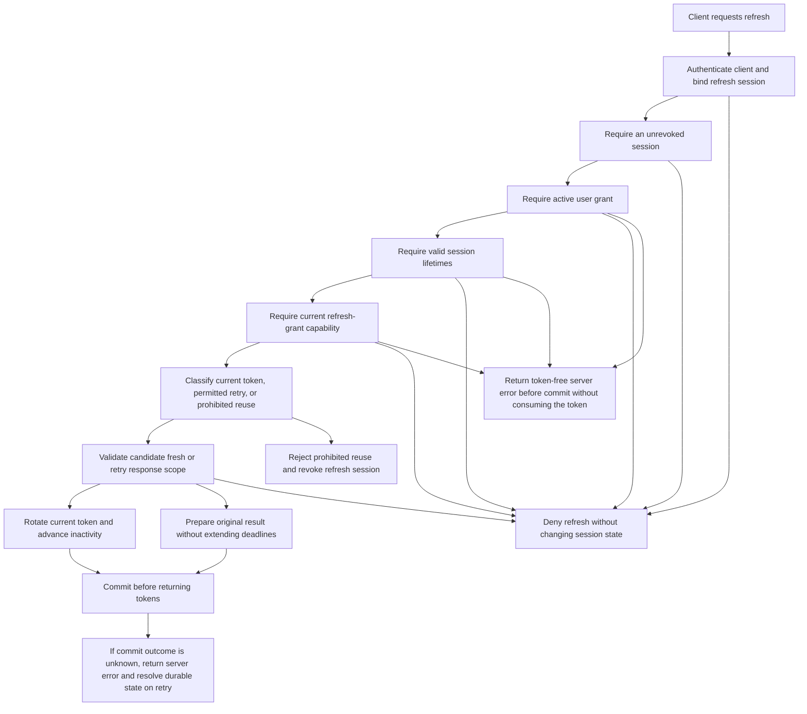

# Feature Specification: Consent-Bound Refresh Sessions

**Feature Branch**: `049-fix-refresh-consent`

**Created**: 2026-09-30

**Status**: Draft

**Input (original request)**: User description: "Refresh ignores consent. A client can continue rotating refresh tokens after the user revokes consent or the grant expires. Resource servers that trust broker-issued tokens directly remain exposed. Check active consent during refresh. Revoke refresh sessions on grant deletion, agent deletion, and credential revocation. Configure a reuse interval (default: 30 seconds), an absolute session lifetime (default: non-expiring), and a session inactivity lifetime, also called refresh token lifetime (default: 30 days)."

**Retry policy revision**: The default reuse interval is 30 seconds. It permits a bounded, idempotent retry of the last refresh, not another rotation.

**Task-generation decisions**: The feature owner selected constitution-compliant CLI support for all three settings and permitted encrypted backup copies of retry results. Live retry results still expire under DB-006. Logs must not contain retry results.

**Analysis remediation decisions**: The constitution remains unchanged. Every primary acceptance journey must first fail on a genuine feature assertion. Confirmed rollback and an indeterminate commit have different recovery guarantees under FR-031.

## User Scenarios & Testing *(mandatory)*

### User Story 1 - Stop Renewal After Consent Ends (Priority: P1)

A user delegates an agent and later revokes that delegation. The agent must stop obtaining new broker-issued tokens for that user. The same rule applies after a time-limited grant expires.

**Why this priority**: Consent must remain an authorization requirement throughout the session, not only during initial authorization.

**Independent Test**: Authorize an agent, obtain and rotate a refresh token, then revoke or expire its grant. Attempt renewal with the retained tokens.

**Acceptance Scenarios**:

1. **Given** a valid token, active grant, and eligible client, **When** the client refreshes, **Then** replacement tokens retain the principal and agent. Rotation preserves the first-issued token, original session start, and scope ceiling. It advances only last fresh activity and inactivity.
2. **Given** a user authorized an agent and obtained refresh tokens, **When** the user revokes consent through the existing UI and the agent refreshes, **Then** renewal fails with an invalid-grant error and no tokens.
3. **Given** a grant has a finite validity deadline, **When** the agent refreshes at or after that deadline, **Then** renewal fails with an invalid-grant error and no tokens.
4. **Given** consent ends while the previous refresh token remains inside its reuse interval, **When** the agent retries that token, **Then** renewal fails without returning the earlier token result.
5. **Given** the broker cannot determine whether the grant remains active, **When** the agent refreshes, **Then** renewal fails with a server error and no tokens. The presented token remains unconsumed, and the client can refresh with it once the broker can determine the grant state.
6. **Given** a token belongs to one principal and agent, **When** another client tries to refresh it using its own active grant, **Then** renewal fails without changing the token's owner. The request neither revokes nor otherwise changes the session.
7. **Given** a resource server accepts a broker access token through JWKS validation, **When** the user revokes consent, **Then** refresh cannot supply another token. The existing access token retains its original expiry.
8. **Given** a time-limited grant expired while an agent held refresh tokens, **When** the user renews that grant and the agent refreshes with a token issued before the expiry, **Then** renewal fails with an invalid-grant error. Fresh authorization can create a new session.
9. **Given** a user changes an active grant's permission sets or extends its validity before the deadline, **When** the agent refreshes, **Then** renewal succeeds under the current grant. The session keeps its original clocks.

---

### User Story 2 - End Sessions With Their Authorization (Priority: P1)

Users and administrators expect grant deletion, agent deletion, and credential revocation to end the related refresh sessions. A later grant or credential must not restore those sessions.

**Why this priority**: An active-grant check alone cannot prevent old tokens from becoming usable after the user grants consent again.

**Independent Test**: Create multiple sessions across principals and agents. Complete each existing lifecycle action and attempt renewal with affected and unaffected tokens.

**Acceptance Scenarios**:

1. **Given** two users delegated the same agent, **When** one user deletes their grant, **Then** all their refresh sessions for that agent become unusable. The other user's sessions remain usable.
2. **Given** a user delegated two agents, **When** either existing consent-deletion path deletes one grant, **Then** that agent's sessions become unusable. The other agent and connected third-party sessions remain unchanged.
3. **Given** several users hold refresh sessions for an agent, **When** an administrator deletes that agent, **Then** every refresh session for that agent becomes unusable. Other agents remain unaffected.
4. **Given** an agent has credentials and refresh sessions for several users, **When** an administrator revokes its credentials, **Then** every refresh session for that agent becomes unusable. Treating the agent as a public client does not restore those sessions.
5. **Given** a lifecycle action revoked a session, **When** the user grants consent again or an administrator creates replacement credentials, **Then** every token from the revoked session remains unusable. Fresh authorization can create a new session.
6. **Given** a lifecycle action overlaps a refresh request, **When** the lifecycle action reports success, **Then** all affected refresh tokens, including a concurrent replacement, become unusable on every broker instance.
7. **Given** a lifecycle action cannot complete session revocation, **When** it finishes, **Then** it reports failure rather than successful completion. It does not leave a partially completed authorization change.
8. **Given** retry-eligible sessions and agent credentials, **When** an administrator replaces those credentials, **Then** refresh requires the replacement credential. The administrator uses the existing generation action. An eligible predecessor returns its original token pair with the replacement credential. Replacement does not reset session clocks or retry counts. The replaced credential cannot refresh the sessions.
9. **Given** a grant is already absent, **When** the idempotent consent-deletion path runs again for that principal and agent, **Then** any remaining refresh session for that pair becomes unusable and the action reports success.
10. **Given** an authorization code produced a session with a current token and retry-eligible predecessor. The bound client already recovered the identical pair with that predecessor. **When** any party replays the code, **Then** both tokens fail renewal without returning the stored result. An unrelated session remains usable. Successful recovery before replay is a required positive control.

---

### User Story 3 - Retry Rotation Within a Bounded Interval (Priority: P2)

An agent can lose a successful refresh response or send overlapping refresh requests. A short reuse interval lets it recover without triggering a false replay alarm.

**Why this priority**: Rotation must preserve replay protection without unnecessarily interrupting legitimate sessions after a lost response.

**Independent Test**: Authorize an agent, lose a refresh response, and retry the previous token before and after the configured interval.

**Acceptance Scenarios**:

1. **Given** the default configuration and a lost successful refresh response, **When** the same client retries the immediately previous token before 30 seconds elapse, **Then** it receives the same token result. The session remains usable.
2. **Given** two requests concurrently use the current refresh token, **When** both otherwise satisfy authorization and lifetime requirements, **Then** they converge on one replacement refresh token. They do not create independent session branches.
3. **Given** the previous token's first successful use occurred at time T, **When** the client retries at or after T plus the reuse interval, **Then** renewal fails. The remaining refresh tokens in that session become unusable.
4. **Given** valid consent, valid session lifetimes, and an expired older predecessor. Its original reuse interval remains open, but its successor already rotated. **When** the bound client presents that predecessor, **Then** renewal fails and the broker revokes the session's remaining refresh tokens.
5. **Given** the operator configures a zero reuse interval, **When** a client repeats a successfully consumed token, **Then** renewal fails immediately and the session's remaining refresh tokens become unusable.
6. **Given** an eligible retry reaches a different broker instance or follows a restart, **When** the client retries within the interval, **Then** it receives the same token result under the same authorization rules.
7. **Given** a retry would occur inside the reuse interval but after a session lifetime deadline, **When** the client retries, **Then** renewal fails without returning tokens or extending either deadline.
8. **Given** the original access token expires before the reuse interval ends, **When** the client retries its predecessor, **Then** retry returns no tokens. The still-valid current refresh token remains usable and its deadlines do not change.
9. **Given** a client retries the previous token inside the reuse interval, **When** the retry requests a different scope than the original request, **Then** the broker treats the request as prohibited reuse. It returns no stored result.
10. **Given** a client already received the maximum number of retry results for one consumed token, **When** it presents that token again inside the reuse interval, **Then** renewal fails and the session's remaining refresh tokens become unusable.
11. **Given** an indeterminate refresh commit, **When** the client receives `server_error`, **Then** the response contains no tokens or rollback claim. A later retry resolves durable state under the normal authorization rules. A rolled-back rotation can proceed normally. A committed rotation returns only its existing result when retry remains eligible. At zero reuse, committed consumption is prohibited reuse and requires fresh authorization. An unresolved outcome returns a server error without tokens. No outcome creates a second successor or refunds a committed retry count.

---

### User Story 4 - Bound Total Session Duration (Priority: P2)

An operator can limit the total lifetime of a refresh session. Continuous activity cannot extend that lifetime.

**Why this priority**: Operators need a fixed reauthorization interval independent of an agent's refresh frequency.

**Independent Test**: Configure a finite absolute lifetime, authorize an agent, refresh repeatedly, and attempt renewal at the original deadline.

**Acceptance Scenarios**:

1. **Given** a finite absolute lifetime and an active grant, **When** the client refreshes before the absolute deadline, **Then** renewal succeeds without changing the session's original start time or absolute deadline.
2. **Given** the client refreshes frequently enough to avoid inactivity expiry, **When** the absolute deadline arrives, **Then** every further refresh fails until fresh authorization creates a new session.
3. **Given** the default non-expiring absolute lifetime and an active session older than 30 days. **When** the client refreshes, **Then** total duration alone does not prevent renewal. Rotation retains the original session start and no absolute deadline. Inactivity advances from the fresh rotation.
4. **Given** a broker restart or a refresh on another instance, **When** the client attempts renewal, **Then** the same original absolute deadline applies.

---

### User Story 5 - Expire Inactive Sessions (Priority: P2)

An operator can limit how long an agent can leave a refresh session inactive. Successful rotation renews this interval, but ordinary resource access and repeated retries do not.

**Why this priority**: Unused refresh credentials must not remain redeemable indefinitely under the default configuration.

**Independent Test**: Authorize an agent, configure a short inactivity lifetime, and compare fresh rotations, duplicate retries, and periods without refresh activity.

**Acceptance Scenarios**:

1. **Given** the default configuration, **When** 30 days pass without a fresh successful refresh, **Then** the client cannot renew that session.
2. **Given** a finite inactivity lifetime and an active grant, **When** the current token rotates successfully before expiry, **Then** the inactivity deadline advances by that lifetime from the rotation time.
3. **Given** a finite inactivity lifetime, **When** the client accesses resources but does not refresh before the deadline, **Then** the session expires despite that resource activity.
4. **Given** the client repeats a permitted previous-token retry, **When** the broker returns the original token result, **Then** neither the inactivity deadline nor the reuse interval advances.
5. **Given** an operator configures a non-default inactivity lifetime, **When** a session remains inactive for that duration, **Then** renewal fails at the configured deadline, not the 30-day default.

---

### User Story 6 - Deploy the Policy Without Changing Upstream Sessions (Priority: P2)

Operators can configure these controls through existing deployment mechanisms. Existing deployments retain the refresh-token lifetime configuration they already use. Sessions issued before this feature can require fresh authorization once.

**Why this priority**: Security configuration must have consistent behavior across deployment methods and must not change upstream provider contracts.

**Independent Test**: Deploy local and hybrid configurations with explicit durations. Exercise pre-existing local sessions and a proxied client.

**Acceptance Scenarios**:

1. **Given** equivalent configuration through a file, environment variables, command-line flags, or the broker deployment chart, **When** a client refreshes, **Then** the same reuse and lifetime limits apply.
2. **Given** an existing `local.refresh_token_ttl` value, **When** the client rotates then retries after deployment, **Then** the configured inactivity deadline advances on rotation only. The configuration key stays unchanged.
3. **Given** malformed or disallowed duration values, **When** the operator starts the broker, **Then** startup fails with a message that identifies the invalid configuration.
4. **Given** a pre-existing refresh session does not meet the FR-025 criteria for trustworthy lifetime and authorization-lineage information, **When** the client attempts renewal after deployment, **Then** renewal fails and fresh authorization is required. The broker does not invent a new start time.
5. **Given** upstream and local sessions in hybrid mode, **When** a user revokes local consent, **Then** local renewal fails. Local reuse and lifetime limits apply only to local issuance. Upstream refresh retains provider-controlled rotation and lifetimes in both hybrid and proxy modes.
6. **Given** an existing session, **When** the operator changes a lifetime and restarts the broker, **Then** shorter limits use the original clocks and persist shorter deadlines. A longer inactivity limit does not extend the current token or activity interval. A fresh rotation before the effective deadline applies that longer limit to its successor and next interval. No increase restores an expired or revoked session. After terminal expiry, binary-only rollback without a schema rollback cannot restore its tokens, including legacy tokens.
7. **Given** old and new instances share an anchored current token, **When** the old instance consumes it, **Then** new instances reject that original. They also reject its unsupported successor without another successor or request mutation. If the new instance rotates first, the old writer's conditional consumption fails. No token skips consent after rollout completes.
8. **Given** successful bounded recovery on memory storage, **When** the broker restarts, **Then** the current token and predecessor both fail renewal. The configuration reference states that restart ends all refresh sessions. It states that multi-instance guarantees require durable shared storage.

### Edge Cases

- At a deadline, the grant, session, or reuse interval is expired. A request immediately before the deadline remains eligible under the other controls.
- Missing consent is different from unavailable consent data. Both prevent issuance, but only unavailable data produces a server error.
- A reuse interval never overrides grant expiry, lifecycle revocation, inactivity expiry, or absolute expiry.
- Public clients require active consent and client binding just as confidential clients do.
- Multiple sessions for one principal and agent all end on grant deletion, including unused tokens and tokens still eligible for retry.
- A successful lifecycle action does not allow a racing refresh to leave a usable replacement session behind.
- A failed refresh, invalid client request, or allowed duplicate retry does not count as session activity.
- Existing broker access tokens can remain valid until their own expiry at resource servers that only validate signatures and token claims.
- Only prohibited reuse by the bound client revokes a session. A failed client authentication, a client mismatch, or an unknown token changes no session state, so a third party cannot end another client's session.
- A confirmed pre-commit failure or rollback leaves the presented token unconsumed and its deadlines unchanged. An indeterminate commit follows FR-031 instead.
- With a zero reuse interval, the slower of two concurrent requests counts as prohibited reuse and ends the session. This keeps the strict single-use behavior of feature 033.
- A renewed grant does not revive sessions that existed while the grant was expired. An extension before the deadline keeps them.
- An agent that no longer permits the refresh grant or a session scope cannot obtain tokens that exceed its current permissions.
- A retry inside the reuse interval lets a holder of a stolen predecessor obtain the current token. The retry limit, the short interval, and retry auditing bound that exposure. They do not remove it.
- A previously public agent that receives credentials must authenticate on every later refresh of its existing sessions.

## Requirements *(mandatory)*

### Functional Requirements

- **FR-001**: Every local refresh MUST require an active `UserGrant` for the principal and agent bound to the refresh session. This includes permitted retries.
- **FR-002**: A grant MUST be active only while it exists and its `ValidUntil` is absent or strictly later than the authorization decision.
- **FR-003**: Missing or expired consent MUST prevent all token returns. Unknown consent state MUST fail closed without a token result.
- **FR-004**: Refresh MUST preserve the original principal, agent, client binding, and scope ceiling. Caller-provided identity MUST NOT replace session-bound identity.
- **FR-005**: Every grant-deletion path MUST revoke all local refresh sessions for that principal and agent, across all request chains. The paths are the user-facing revocation (`DELETE /api/consent/agents/{agent-id}/grants`) and the idempotent empty-submission revocation (`POST /api/consent/agents/{agent-id}/grants`). The idempotent path MUST revoke remaining sessions even when the grant is already absent.
- **FR-006**: Agent deletion MUST revoke all local refresh sessions for that agent across all principals.
- **FR-007**: Credential revocation (`DELETE /api/agents/{agent-id}/client-credentials`) MUST revoke all local refresh sessions for that agent across all principals. Public-client fallback MUST NOT restore those sessions.
- **FR-008**: Revocation MUST be permanent for affected sessions. A replacement grant, recreated agent, or replacement credential MUST NOT reactivate their tokens.
- **FR-009**: Lifecycle changes and session revocation MUST complete as one consistent outcome. Success MUST mean no affected refresh token remains usable across broker instances.
- **FR-010**: Revocation MUST include current tokens, retry-eligible predecessors, and replacements from overlapping refresh requests. Unrelated principals and agents MUST remain unaffected.
- **FR-011**: Fresh successful refresh MUST rotate the current token. Concurrent requests MUST produce one successor rather than independent branches. New instances MUST recognize old-writer consumption before fresh issuance during mixed-version operation. Consumption without trustworthy matching lineage MUST cause `invalid_grant` without request mutation or another successor.
- **FR-012**: The reuse interval MUST start at the predecessor's first successful consumption. It MUST NOT slide on subsequent requests.
- **FR-013**: Only the immediately previous token is retry-eligible while its successor remains current and unused. Its original access token must remain unexpired.
- **FR-014**: An eligible retry MUST return the original access token and replacement refresh token, not mint another pair. Remaining access-token validity MUST NOT exceed its original expiry.
- **FR-015**: A zero reuse interval MUST disable retry eligibility. Older-predecessor reuse or reuse at or after the interval MUST revoke remaining refresh tokens in that session. After client, consent, session, and refresh-capability checks pass, an expired consumed token MUST still count as replay evidence. Its individual expiry MUST NOT bypass prohibited-reuse revocation.
- **FR-016**: Retry eligibility MUST preserve client authentication, client binding, active consent, and both session lifetime checks. It MUST work across instances and restarts.
- **FR-017**: Session start MUST be the first refresh-token issuance from a successful authorization-code exchange. Rotations and retries MUST retain that start.
- **FR-018**: A finite absolute lifetime MUST expire a session at its original start plus that lifetime, regardless of activity. The default MUST impose no absolute deadline.
- **FR-019**: Inactivity MUST start at initial issuance and reset only after a fresh successful rotation. The default inactivity lifetime MUST be 30 days.
- **FR-020**: Resource access, rejected requests, and permitted duplicate retries MUST NOT renew inactivity. Retry responses MUST NOT renew absolute or reuse deadlines.
- **FR-021**: Refresh MUST fail at or after either configured session deadline. A reuse interval MUST NOT permit a response after either deadline.
- **FR-022**: Operators MUST configure the reuse interval and both session lifetimes through the configuration file, environment variables, command-line flags, and the deployment chart.
- **FR-023**: The existing `local.refresh_token_ttl` configuration MUST remain the single configuration value for session inactivity lifetime.
- **FR-024**: The broker MUST preserve trustworthy session start, last fresh activity, ownership, and revocation history across restart and instance changes.
- **FR-025**: A pre-existing session is trustworthy only if the broker retains its principal, agent, client, rotation lineage, last fresh rotation time, and the record of its first issued token. Every other pre-existing session MUST require fresh authorization. Deployment MUST NOT reset lifetime clocks or derive a session start from a later token.
- **FR-026**: These controls MUST apply to local issuance in local and hybrid modes. Upstream passthrough and vaulted third-party token behavior MUST remain unchanged.
- **FR-027**: Existing access tokens MUST retain their existing expiry contract. This feature MUST NOT claim immediate invalidation at signature-only resource servers.
- **FR-028**: An expired original access token MUST prevent retry success without extending deadlines. Expiry alone MUST NOT revoke a still-valid current refresh token.
- **FR-029**: Refresh MUST check client authentication/binding, revocation, consent, lifetimes, refresh capability, token classification, then candidate response scopes, in that order. The first failing check MUST determine the response and audit reason. Capability failure MUST precede replay revocation and preserve existing `unauthorized_client` behavior without mutation. Response-scope checks MUST apply only to fresh or otherwise eligible retry results and preserve existing scope-error contracts without mutation. With refresh capability allowed, prohibited reuse MUST revoke before response-scope checks, even when an original response scope is no longer permitted.
- **FR-030**: Only prohibited reuse presented by the bound client MUST revoke a session. Every other authorization rejection, including failed client authentication and client mismatch, MUST leave session and token state unchanged. Server errors MUST follow FR-031.
- **FR-031**: A confirmed pre-commit failure or rollback MUST NOT consume the presented token, rotate the session, or advance a deadline. An indeterminate commit MUST return a token-free `server_error` without claiming rollback. A later request MUST resolve durable state and apply the normal authorization, classification, and retry rules. Unresolved state MUST fail closed. A committed rotation permits only its existing bounded retry result. With zero reuse, committed consumption remains prohibited reuse and requires fresh authorization. Committed retry counts MUST NOT be refunded after a lost acknowledgement. No error recovery may create a second successor or extend a retry deadline.
- **FR-032**: Renewing or re-creating a grant after its validity deadline passed MUST revoke all local refresh sessions for that principal and agent that predate the renewal.
- **FR-033**: Changing an active grant, including its permission sets or an extension before the deadline, MUST NOT revoke refresh sessions. Every refresh MUST evaluate the grant's current state.
- **FR-034**: Refresh MUST fail when the agent's current registration no longer permits the refresh grant. Returned tokens MUST NOT carry a scope the agent can no longer request. A fresh result MUST use its requested scope, or the session ceiling when omitted. An eligible retry MUST validate the exact original response scope, not narrow it or mint another result. Capability and scope failures MUST follow FR-029.
- **FR-035**: A narrower scope requested during refresh MUST limit only the returned access token. It MUST NOT lower the session's scope ceiling.
- **FR-036**: A retry from the bound client is eligible only if its requested scope equals that of the original request. A retry with a different scope MUST count as prohibited reuse.
- **FR-037**: The broker MUST authorize a stored-result return at most 3 times per consumed token. A committed retry authorization counts even if its response or commit acknowledgement is lost. A further otherwise eligible presentation inside the reuse interval MUST count as prohibited reuse.
- **FR-038**: Credential replacement MUST keep the agent's refresh sessions. Later refreshes MUST authenticate with the replacement credential.
- **FR-039**: A session created by a public client MUST require client authentication on refresh once the agent has credentials.
- **FR-040**: Authorization-code replay MUST revoke the refresh session that the code created.
- **FR-041**: All broker instances MUST evaluate grant, session, and reuse deadlines against one shared time source.

### Domain Model

**Activity / Flow Diagram**:



**Entities**:

- **UserGrant**: A principal's delegation to an agent. Its presence and optional validity deadline govern every refresh decision.
- **Refresh Session**: One authorization lineage for a principal, agent, and client. It owns an original start, last fresh activity, and revocation state.
- **Refresh Token**: A credential in that session's rotation chain. It is current, a retry-eligible predecessor, consumed, expired, or revoked.
- **Agent Credential**: A client credential whose revocation ends the agent's existing local refresh sessions. Its replacement keeps them.

**Aggregates**:

- **Refresh Session**: Its tokens share ownership, lifetime limits, and permanent revocation. Rotation cannot create an independently authorized branch.
- **UserGrant**: Its deletion ends all refresh sessions for the grant's principal and agent, not only the latest session.

**Value Objects**:

- **Reuse Interval**: A fixed interval after first consumption that permits recovery with the immediately previous token, up to the retry limit.
- **Absolute Session Lifetime**: A maximum total duration from original issuance. Zero means no absolute duration limit.
- **Session Inactivity Lifetime**: The maximum interval between fresh successful rotations, also called Refresh Token Lifetime.

**Domain Events**:

- **RefreshSessionRevoked**: Related authorization ended or prohibited token reuse occurred. The event identifies the affected principal, agent, session, and reason without credentials.
- **RefreshRejected**: The broker denied renewal because authorization, lifetime, or session state did not permit it.
- **RefreshRetryAccepted**: The broker returned an existing token result within the fixed reuse interval without creating a new rotation.
- **RefreshRotated**: The broker rotated the current token and advanced the inactivity deadline.

### Configuration Requirements

Configuration applies under `oauth2_authorization_server.local` in local and hybrid deployments:

| Parameter | Default | Meaning | Valid values |
|-----------|---------|---------|--------------|
| `refresh_token_reuse_interval` | `30s` | Bounded, idempotent retry of the last refresh | Non-negative duration shorter than `token_ttl` and `refresh_token_ttl`. `0s` disables reuse. |
| `absolute_session_lifetime` | `0s` | Maximum total refresh-session duration | `0s` or a duration longer than the reuse interval. `0s` means non-expiring absolute lifetime. |
| `refresh_token_ttl` | `720h` | Session inactivity lifetime / Refresh Token Lifetime | Positive duration. Omission or `0s` retains the existing 30-day default. |

- **CR-001**: Negative or malformed durations MUST fail startup. Explicit zero values MUST have exactly the meanings in the table.
- **CR-002**: The reuse interval MUST NOT enlarge either session lifetime. The earliest authorization or lifetime deadline always takes precedence.
- **CR-003**: The configuration file, environment variables, command-line flags, and the deployment chart MUST expose all three parameters with the existing precedence rules. The environment variables are `IDENTITY_BROKER_OAUTH2_AUTH_SERVER_LOCAL_REFRESH_TOKEN_REUSE_INTERVAL`, `IDENTITY_BROKER_OAUTH2_AUTH_SERVER_LOCAL_ABSOLUTE_SESSION_LIFETIME`, and the existing `IDENTITY_BROKER_OAUTH2_AUTH_SERVER_LOCAL_REFRESH_TOKEN_TTL`. The flags are `--oauth2_authorization_server.local.refresh_token_reuse_interval`, `--oauth2_authorization_server.local.absolute_session_lifetime`, and `--oauth2_authorization_server.local.refresh_token_ttl`. The chart adds `refreshTokenReuseInterval`, `absoluteSessionLifetime`, and `refreshTokenTtl` under `broker.oauth2AuthorizationServer.local`.
- **CR-004**: Configuration documentation and deployment examples MUST explain default values, zero-value semantics, retry behavior, and required reauthorization of unsupported legacy sessions. They MUST state that an issued access token stays valid for up to `token_ttl` after revocation and that a shorter `token_ttl` reduces this exposure. They MUST state that the default non-expiring absolute lifetime never returns the user to the identity provider.
- **CR-005**: Configuration changes MUST use original clocks for new and existing sessions. Shorter limits MUST persist shorter effective deadlines. Increasing a limit MUST NOT restore expired or revoked sessions. Increasing inactivity MUST NOT extend an issued token or its current activity interval. A fresh valid rotation MUST apply the configured inactivity lifetime to its successor and next interval. Absolute changes MUST use `StartedAt` after ruling out elapsed stored deadlines.
- **CR-006**: Startup MUST fail when the reuse interval is not shorter than `token_ttl` and `refresh_token_ttl`, or when a finite absolute lifetime is not longer than the reuse interval. Startup MUST log a warning when a finite absolute lifetime is shorter than `refresh_token_ttl`.
- **CR-007**: Cross-instance and restart guarantees MUST apply to durable shared storage. The configuration reference MUST state that non-durable storage loses all refresh sessions on restart and supports one instance.
- **CR-008**: Release documentation MUST describe reauthorization for unsupported legacy sessions, rolling deployment, and rollback. Before binary-only rollback, operators MUST quiesce token traffic and old writers, then reconcile expiry under the outgoing policy. Old binaries MUST NOT accept traffic if reconciliation fails. Rollback MUST NOT restore terminally expired or revoked sessions.

**Example YAML Configuration**:

```yaml
oauth2_authorization_server:
  mode: local
  local:
    refresh_token_reuse_interval: 30s
    absolute_session_lifetime: 0s
    refresh_token_ttl: 720h
```

**Configuration Location**: Existing local and hybrid examples, the broker configuration reference, and the broker deployment chart.

### API Requirements

- **API-001**: Existing refresh requests MUST retain their request and successful response contracts. No separate refresh-token revocation endpoint is required by this feature.
- **API-002**: Missing or expired consent, revoked sessions, expired lifetimes, and prohibited token reuse MUST return `invalid_grant` without tokens. The error response MUST NOT reveal which of these conditions applied.
- **API-003**: Unavailable authorization data or failed session-state operations MUST return `server_error` without tokens. The response MUST use a 5xx status. Confirmed rollback preserves the presented token. An indeterminate commit makes no rollback guarantee. A later request MUST follow FR-031 and the configured retry policy, not an authorization fallback.
- **API-004**: Existing consent-deletion, agent-deletion, and credential-revocation actions MUST keep their authentication, ownership, and unrelated not-found behavior.
- **API-005**: An eligible retry MUST retain the successful refresh response shape. Its `expires_in` MUST reflect remaining validity, not restart the returned access token's lifetime.
- **API-006**: Changed refresh, lifecycle, and retry semantics MUST be documented in the existing API contracts before implementation, with stakeholder review under the constitution.
- **API-007**: Refresh denial for missing consent MUST use `invalid_grant` without `error_uri`. ADR 032 uses `access_denied` with a consent `error_uri` for impersonation. Refresh differs because consent alone cannot restore a session and the client must restart authorization.
- **API-008**: Authorization-server metadata MUST remain unchanged. It MUST NOT advertise a revocation or introspection endpoint.

### Database Requirements

- **DB-001**: Durable session state MUST preserve original start, last fresh activity, terminal expiry, authorization ownership, and rotation lineage.
- **DB-002**: Grant-scoped and agent-scoped revocation MUST cover every affected session, including predecessors retained for allowed retries.
- **DB-003**: Lifecycle success, rotation, revocation, and terminal expiry MUST have consistent outcomes across concurrent requests, broker instances, and restart. Terminal expiry MUST end all matching legacy token authority in the same outcome. A failed legacy update MUST roll back the expiry transition and block startup readiness. Binary-only rollback MUST NOT restore terminally expired sessions.
- **DB-004**: State migration MUST retain trustworthy lifetime and revocation history. Sessions that cannot satisfy this policy MUST require fresh authorization.
- **DB-005**: Persisted retry results MUST use the broker's existing encryption at rest for credentials. Revocation MUST make those results unavailable to subsequent retry requests.
- **DB-006**: The broker MUST erase a persisted retry result when its reuse interval ends, when its successor rotates, or when its session ends, whichever comes first. A zero reuse interval MUST persist no retry results.
- **DB-007**: Consumed-token records MUST remain until their session can no longer be refreshed, so that reuse stays detectable. Cleanup MUST NOT remove a session's revocation state before every token of that session has expired.
- **DB-008**: Agent deletion can remove the agent's session records. The revocation audit record MUST precede that removal.

### Security Requirements

- **SR-001**: Active consent MUST be mandatory for every local refresh. Configuration MUST NOT disable the consent check.
- **SR-002**: A retry interval MUST NOT become an authorization bypass. Revocation and expired consent always take precedence.
- **SR-003**: Credential revocation MUST end existing sessions even if client classification later changes. Old sessions MUST NOT acquire new authorization through fallback.
- **SR-004**: Unknown or inconsistent authorization or session state MUST fail closed. Infrastructure errors MUST NOT appear as successful lifecycle completion.
- **SR-005**: Rejected requests MUST NOT return stored retry credentials. Logs and errors MUST NOT expose access tokens, refresh tokens, or client secrets.
- **SR-006**: Consent denial, lifecycle revocation, prohibited reuse, lifetime expiry, rotations, and accepted retries MUST be auditable with principal, agent, client, a non-credential session identifier, reason, and request context.
- **SR-007**: Local token exchange MUST retain its existing active-grant check. This feature MUST NOT weaken that separate authorization boundary.
- **SR-008**: Revocation MUST prevent renewal without changing JWKS publication or signature-validation requirements for existing access tokens.
- **SR-009**: A request that fails client authentication or client binding MUST NOT revoke a session. A party without the bound client's identity MUST NOT be able to end that client's sessions.
- **SR-010**: The audit record of an accepted retry MUST show whether its request context differs from the original request. Operators MUST be able to count accepted retries and refresh rejections by reason through the existing telemetry.
- **SR-011**: Persisted live retry results MUST NOT outlive the conditions in DB-006. Backup copies MAY retain encrypted retry results but MUST NOT contain plaintext token results. Logs MUST NOT contain retry results. A backup copy MUST NOT establish live retry eligibility or bypass current authorization, revocation, or expiry checks.

### Key Entities

- **Principal**: The user identity bound to a refresh session and its required grant.
- **UserGrant**: The continuing authorization for that principal and agent, with an optional expiry.
- **Agent**: The client actor whose deletion or credential revocation ends its local refresh sessions.
- **Refresh Session**: The authorization lineage and lifetime boundary shared by all rotated tokens.
- **Refresh Token**: The current or former credential whose use follows rotation and bounded retry rules.

## Success Criteria *(mandatory)*

### Measurable Outcomes

- **SC-001**: In every acceptance journey, revoked or expired consent produces zero new or returned token results, including retries inside the reuse interval.
- **SC-002**: After each successful lifecycle action, 100% of affected refresh tokens fail renewal. All unrelated sessions in those journeys remain usable.
- **SC-003**: In every lost-response or overlapping-request journey, eligible clients recover one usable successor within the configured interval without session branching.
- **SC-004**: In every prohibited-reuse journey, renewal fails and zero remaining refresh tokens from that session remain usable.
- **SC-005**: In every finite-lifetime journey, refresh fails at the first applicable deadline. Repeated refresh or retry cannot extend the original absolute deadline.
- **SC-006**: In every default-policy journey, 30-second retry eligibility, a 30-day inactivity lifetime, and no absolute deadline apply consistently.
- **SC-007**: Every restart and multi-instance journey preserves authorization, revocation, and lifetime outcomes without granting additional time. After absolute or shortened inactivity expiry, binary-only rollback returns no tokens from that session while unrelated eligible sessions remain usable.
- **SC-008**: Users can end future renewal through the existing consent-revocation flow without an additional action. Fresh authorization restores access without restoring old tokens.
- **SC-009**: All existing upstream passthrough journeys retain their provider-controlled refresh behavior after deployment.
- **SC-010**: In every confirmed-rollback server-error journey, the presented token stays usable after recovery and no deadline changes. In every indeterminate-commit journey, durable resolution produces only the normal fresh rotation, eligible original retry result, or token-free error. Zero reuse never recovers a committed result. Recovery never creates a second successor, refunds a committed retry count, or grants additional retry time.
- **SC-011**: In every journey where an unauthenticated or mismatched client presents a token, zero sessions change state.
- **SC-012**: After deployment, 100% of pre-existing sessions either meet the FR-025 criteria or require fresh authorization. No session gains lifetime from the deployment.
- **SC-013**: In every expired-grant renewal journey, zero tokens issued before the renewal succeed.

## Assumptions

- This feature covers locally issued user refresh sessions, not upstream passthrough, vaulted third-party tokens, or client-credentials grants without refresh sessions.
- A reuse interval means recovery of a lost response, not permission to create multiple successor tokens from one predecessor.
- Only the immediately previous token qualifies for recovery while its successor remains current and unused. Older consumed-token reuse keeps the existing session-revocation behavior.
- The initial successful authorization-code exchange establishes a refresh session. Fresh authorization creates a distinct session with new lifetime clocks.
- Session inactivity measures fresh successful refresh, not browser activity or calls to downstream resource servers.
- Configuration changes use original clocks. Longer inactivity limits apply on the next fresh rotation, not to issued tokens or the current interval. Operators deploy one consistent policy across broker instances.
- Credential replacement keeps refresh sessions because a confidential client's refresh token is unusable without the current credential. Operators who suspect token theft revoke the credential instead.
- Existing stateless access tokens can remain accepted until their own expiry. Immediate downstream access-token revocation, introspection, and a new public revocation endpoint are outside this feature. So are administrator revocation of a single session or of all sessions of one user, sender-constrained refresh tokens, and revocation triggered by identity-provider deprovisioning.
- This specification intentionally changes strict single-use behavior from feature 033 only for bounded, authorized retries. Consent and lifecycle revocation remain unconditional.
- Dependencies include existing offline-access issuance, consent management, lifecycle administration, and configuration delivery. Accepted ADR 032 supplies the existing active-delegation boundary.
- Cross-instance and restart guarantees assume durable shared storage. The in-memory storage backend supports one instance and loses sessions on restart.
- Profile claims in refreshed tokens come from the original authorization. A session with a non-expiring absolute lifetime never refreshes them from the identity provider.

## Open Decisions

The requirements above follow the recommended option for each decision. The feature owner confirms or changes them before planning.

| Decision | Recommended option in this specification | Alternative |
|----------|------------------------------------------|-------------|
| Expired grant renewed later (FR-032) | Renewal revokes sessions that predate it. | Sessions resume after renewal. This contradicts the rationale of User Story 2. |
| Credential replacement (FR-038) | Replacement keeps sessions and requires the new credential. | Replacement revokes all sessions of the agent. Every routine rotation then forces all users to reauthorize. |
| Retry limit (FR-037) | 3 stored results per consumed token, not configurable. | No limit. A holder of a stolen predecessor can then follow every rotation unnoticed. |
| Pre-existing sessions (FR-025) | Sessions that meet the listed criteria continue. All others reauthorize. | All pre-existing sessions reauthorize once. This is simpler and forces every user through authorization at deployment. |
| Default absolute lifetime (FR-018) | Non-expiring, as requested, with the documented risk in CR-004. | A finite default, for example 90 days, that returns users to the identity provider. |
