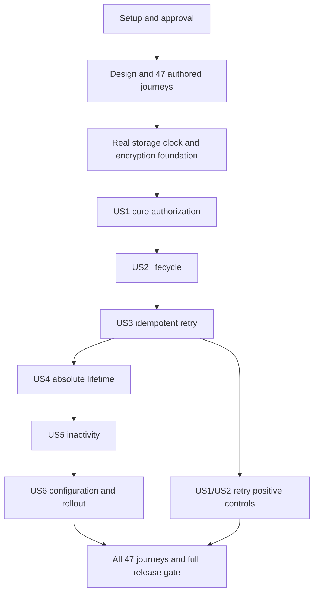

# Tasks: Consent-Bound Refresh Sessions

**Feature**: `049-fix-refresh-consent`  
**Input**: [spec.md](spec.md), [plan.md](plan.md), [research.md](research.md), [data-model.md](data-model.md), [contracts/](contracts/)  
**Status**: All tasks are pending. This file does not claim runtime implementation or test execution.

**Authority**: Use the current specification, including the owner's decisions to keep constitution-compliant CLI support and allow encrypted backup copies. The default retry interval is **30 seconds**, absolute lifetime is unlimited, inactivity is 720h, and at most three stored results return per consumed token. Credential replacement retains sessions; explicit credential revocation does not.

**Tests**: Required by constitution VIII/XIII. Author all 47 primary E2E journeys in Phase 2f before runtime edits. Every primary It must compile and fail on a genuine acceptance-linked feature assertion. Existing baseline regressions remain separate from those 47 red-evidence entries. Never force failures with placeholders or unrelated assertions. Minimal compilation declarations are temporary, not delivered scaffolds.

**Format**: Every task uses `- [ ] TNNN [P?] [USn?] Description`. `[P]` means a disjoint-file task can run with a ready peer after the listed dependencies. Paths are repository-relative. Story labels appear only in their story phases. Each line lists dependencies and requirement IDs where applicable.

**Approval gate**: ADR 038 was accepted on 2026-10-01. T001 still requires final Open Decisions and API/release approval. ADR acceptance does not complete those separate gates or any implementation task.

## Phase 1: Setup and approval

**Purpose**: Record approval and the complete caller inventory. No new project or runtime dependency is needed.

- [ ] T001 Confirm the specification's five recommended Open Decisions and record stakeholder API/release approval in specs/049-fix-refresh-consent/plan.md before runtime implementation. Reference the user's recorded acceptance of adrs/038-consent-bound-refresh-sessions.md on 2026-10-01, including its narrow ADR 008 subject supersession. Do not request that acceptance again or treat it as API/release approval. Preserve the already confirmed CLI and encrypted-backup choices. Planning is provisional until these Open Decisions are confirmed. If a choice changes, reconcile spec.md, plan.md, contracts/, examples, scenario mappings, and tasks.md before T002 or other dependent work. Validate traceability again and record the revised decision. Dependencies: none.

- [ ] T002 Inventory exported-signature changes with LSP references and exact production/test callers in specs/049-fix-refresh-consent/research.md for UserDelegationVerifier, consent.Service.VerifyAgentAccess, UserGrant.IsActive, Provider constructors, storage factory accessors, and encryption subjects; use current Go/module/migration versions and no unrelated dependency upgrade. Dependencies: T001.

## Phase 2: Design preconditions and acceptance-test authoring

**Purpose**: Complete all blocking domain/config/API/schema/UI/test preconditions. Test authors may work in the disjoint file groups below after T008. No runtime behavior changes precede complete acceptance authoring and red evidence.

### Phase 2a: Domain model and glossary

- [ ] T003 [P] Document refresh root/token lineage, shared time, retry payload, immutable revocation receipt, scope ceiling, credential replacement versus revoke, effective retry deadlines, the restore-invalidation command, and aggregate consistency in ARCHITECTURE.md using specs/049-fix-refresh-consent/data-model.md and adrs/038-consent-bound-refresh-sessions.md. Dependencies: T002. Requirements: FR-004, FR-024, FR-038, FR-041, DB-008.

### Phase 2b: Configuration design

- [ ] T004 [P] Publish approved configuration examples in examples/config/oauth2-server-mode.yaml, examples/config/oauth2-hybrid-mode.yaml, examples/config/README.md, and docs/configuration.md. Document YAML/env/CLI/Helm names, zero values, duration relations, warnings, residual token_ttl exposure, and memory limits. Update the chart contract before runtime implementation in charts/agentic-identity-broker/values.yaml, charts/agentic-identity-broker/values.schema.json, charts/agentic-identity-broker/templates/configmap.yaml, and charts/agentic-identity-broker/README.md. Add documented string defaults 30s/0s/720h, duration schema rules, and mode-gated quoted ConfigMap rendering. Verify Helm rendering without claiming broker-loader parity until T062. Dependencies: T002. Requirements: FR-022, FR-023, CR-001, CR-002, CR-003, CR-004, CR-006, CR-007, CR-008. Principles: VII.

### Phase 2c: API design and confirmation

- [ ] T005 [P] During implementation, document approved refresh behavior in api/enduser/openapi.yaml and align existing lifecycle actions in api/admin/openapi.yaml before runtime edits. Until then, keep proposed behavior only in feature Markdown, not the canonical API. Keep the existing POST /oauth2/token route and tokenExchange operation ID. Do not create a separate refresh operation or duplicate OpenAPI document. Preserve generic invalid_grant without error_uri, 5xx server_error, wire shapes, metadata, and lifecycle boundaries. Include FR-031 recovery, zero-reuse limits, and response-only narrowed access scope. Add docs/api/oauth2-refresh-sessions.md with request/response examples for consent denial, bounded retries, confirmed rollback, and indeterminate commits. Explain fresh authorization without restoring old sessions. Document the approved release/version decision in docs/changelog.md. Dependencies: T002. Requirements: API-001, API-002, API-003, API-004, API-005, API-006, API-007, API-008. Principles: IV, X.

### Phase 2d: Database design and migration red coverage

- [ ] T006 [P] Write real PostgreSQL invariant and apply/down/reapply tests before DDL in tests/integration/migrations/refresh_sessions_test.go: preserve old inserts, validate root/token lineage and retry count bounds, retain unrelated data, roll back without restoring revoked authority, and require transactional audit receipt before cascade deletion. Use the existing shared template-database harness. Dependencies: T002. Requirements: DB-001, DB-002, DB-003, DB-004, DB-007, DB-008, CR-008.

### Phase 2e: Existing frontend/design-system review

- [ ] T007 Review and reuse the existing revoke action/page objects in tests/e2e/pages/consent_page.go and tests/e2e/frontend/revoke_grant_flow_test.go for the new browser journey; document in specs/049-fix-refresh-consent/plan.md that no React component/style changes are required and name the maintained before/after screenshots. Dependencies: T003. Requirements: FR-005, SC-008.

### Phase 2f: Complete E2E acceptance design

- [ ] T008 Prepare production-bootstrap HTTP/PKCE, dual-server, PostgreSQL clone/restart, locked old-writer SQL, encryption, and age/clock fixtures in tests/e2e/bootstrap/refresh_sessions.go, tests/e2e/fixtures/refresh_sessions.go, and tests/e2e/helpers/refresh_sessions.go. Before runtime edits, capture the pre-feature broker binary outside tracked source files for mixed-version and binary-only rollback journeys. Record its source revision and checksum in specs/049-fix-refresh-consent/plan.md so later runs can reproduce the fixture. Use real repositories and no test-only production APIs. Keep plaintext credentials out of captured logs/backups. Dependencies: T007, T004, T005, T006. Requirements: FR-024, FR-026, FR-041, SR-005, SR-011.

- [ ] T009 [P] Author 9 complete production-bootstrap acceptance It blocks for US1 in tests/e2e/frontend/refresh_consent_revocation_test.go, tests/e2e/oauth2_refresh_consent_e2e_test.go, tests/e2e/oauth2_refresh_consent_postgres_e2e_test.go with nearby exact spec identifiers and observable HTTP/token/state outcomes: US1-S1: active consent permits bound rotation while retaining first-token evidence, original start, and scope ceiling; US1-S2: UI revocation prevents renewal; US1-S3: expired grant prevents renewal; US1-S4: consent overrides retry grace; US1-S5: unavailable consent preserves token state; US1-S6: another client cannot mutate the session; US1-S7: JWKS token keeps expiry but cannot renew; US1-S8: expired-grant renewal invalidates old sessions; US1-S9: active-grant changes preserve session clocks. Use one primary It per scenario, isolation, and concrete positive controls; no source-text, forwarding-echo, pending, or always-fail tests. Dependencies: T008.

- [ ] T010 [P] Author 10 complete production-bootstrap acceptance It blocks for US2 in tests/e2e/oauth2_refresh_lifecycle_e2e_test.go, tests/e2e/oauth2_refresh_lifecycle_postgres_e2e_test.go with nearby exact spec identifiers and observable HTTP/token/state outcomes: US2-S1: principal-scoped revocation; US2-S2: both grant-delete paths preserve other sessions; US2-S3: agent-wide deletion; US2-S4: credential revoke blocks public fallback; US2-S5: regrant cannot restore revoked tokens; US2-S6: lifecycle commit defeats racing descendants; US2-S7: lifecycle failure rolls back; US2-S8: replacement credentials retain sessions, eligible original retry results, clocks, and retry counts; US2-S9: idempotent missing-grant deletion revokes leftovers; US2-S10: identical predecessor recovery succeeds before another client authenticates as itself and replays the code, rejecting both current and predecessor tokens while an unrelated session survives under FR-040. Use one primary It per scenario, isolation, and concrete positive controls; no source-text, forwarding-echo, pending, or always-fail tests. Dependencies: T008.

- [ ] T011 [P] Author 11 complete production-bootstrap acceptance It blocks for US3 in tests/e2e/oauth2_refresh_retry_e2e_test.go, tests/e2e/oauth2_refresh_retry_postgres_e2e_test.go with nearby exact spec identifiers and observable HTTP/token/state outcomes: US3-S1: lost response returns identical pair; US3-S2: concurrent refresh has one successor; US3-S3: fixed deadline rejects and revokes; US3-S4: expired older predecessor rejects and revokes a live family; US3-S5: zero interval enforces strict use; US3-S6: replica/restart returns identical pair; US3-S7: session expiry overrides grace; US3-S8: expired cached access preserves valid current token; US3-S9: retry scope mismatch is prohibited reuse; US3-S10: fourth stored-result request is prohibited reuse; US3-S11: lost commit acknowledgement resolves through ordinary durable-state and retry rules, including zero reuse and committed counts. Use a test-owned PostgreSQL protocol fault around COMMIT, not a mock production repository. Use one primary It per scenario, isolation, and concrete positive controls; no source-text, forwarding-echo, pending, or always-fail tests. Dependencies: T008.

- [ ] T012 [P] Author 4 complete production-bootstrap acceptance It blocks for US4 in tests/e2e/oauth2_refresh_absolute_e2e_test.go, tests/e2e/oauth2_refresh_absolute_postgres_e2e_test.go with nearby exact spec identifiers and observable HTTP/token/state outcomes: US4-S1: absolute deadline does not slide; US4-S2: activity cannot pass absolute deadline; US4-S3: default absolute lifetime is unlimited; US4-S4: restart and shared time preserve deadline. Use one primary It per scenario, isolation, and concrete positive controls; no source-text, forwarding-echo, pending, or always-fail tests. Dependencies: T008.

- [ ] T013 [P] Author 5 complete production-bootstrap acceptance It blocks for US5 in tests/e2e/oauth2_refresh_inactivity_e2e_test.go with nearby exact spec identifiers and observable HTTP/token/state outcomes: US5-S1: default idle expiry is 30 days; US5-S2: fresh rotation renews inactivity; US5-S3: resource access does not renew inactivity; US5-S4: retry advances no clocks; US5-S5: custom inactivity controls expiry. Use one primary It per scenario, isolation, and concrete positive controls; no source-text, forwarding-echo, pending, or always-fail tests. Dependencies: T008.

- [ ] T014 [P] Author 8 complete production-bootstrap acceptance It blocks for US6 in tests/e2e/oauth2_refresh_policy_e2e_test.go, tests/e2e/oauth2_refresh_policy_postgres_e2e_test.go with nearby exact spec identifiers and observable HTTP/token/state outcomes: US6-S1: file/env/CLI/chart govern real behavior; US6-S2: existing inactivity key governs fresh rotation without retry activity; US6-S3: invalid combinations fail startup; US6-S4: every pre-feature unanchored session requires reauthorization while a completely evidenced anchored family from a new issuer continues; US6-S5: local consent enforcement and upstream independence coexist in hybrid mode, with proxy parity; US6-S6: shorter deadlines persist, inactivity increases affect the next rotation only, and terminal sessions remain blocked after binary-only rollback; US6-S7: old-writer consumption of an anchored predecessor rejects new rotation, unsupported descendants reauthorize, and old-first/new-first requests cannot branch; US6-S8: successful bounded memory recovery precedes restart rejection of current and previous tokens, with documented limits. Use one primary It per scenario, isolation, and concrete positive controls; no source-text, forwarding-echo, pending, or always-fail tests. Dependencies: T008.

- [ ] T015 Run all 47 authored primary journeys from specs/049-fix-refresh-consent/quickstart.md against the pre-implementation runtime. Record each scenario ID, its acceptance-linked failing assertion, and observed semantic failure in specs/049-fix-refresh-consent/plan.md. US2-S10 must first fail on its specified identical-result recovery control, not on unchanged code-replay rejection. Keep baseline regressions outside this red-evidence count. If a primary case passes unchanged, reconcile its feature criterion with the specification before changing assertions. Never use artificial failures or assertions unrelated to the scenario. Verify the Phase 2b chart contract before runtime work. Dependencies: T009, T010, T011, T012, T013, T014. Principles: VII, VIII, XIII.

**Checkpoint**: Approvals, Phase 2a–2f deliverables, the updated Helm contract, and all 47 primary journeys exist. T015 records a semantic failure for every primary scenario. Runtime implementation remains blocked until this checkpoint.

## Phase 2.5: Foundational storage, models, time, and encryption

**Purpose**: Implement real storage, shared time, native models, at-rest encryption and Fosite transaction participation. Any temporary declarations used to compile red tests are removed or implemented before this checkpoint. No 501 handlers, empty repository release, or fake fallback is allowed.

- [ ] T016 Generate RefreshSessionID by extending internal/domain/id/gen_ids.go, regenerating internal/domain/id/uuid_ids_gen.go, and updating internal/domain/id/AGENTS.md under ADR 013; define only the minimal compilation declarations needed by the following behavioral tests, with no shipped stubs or fake fallbacks. Dependencies: T015. Requirements: FR-017, FR-024.

- [ ] T017 Write model/transition boundary tests in internal/domain/storage/refresh_session_test.go and internal/domain/storage/refresh_token_test.go before validation behavior: immutable ownership/origin/ceiling, complete predecessor metadata, 0..3 retries, nondecreasing retention, equality expiry, terminal-state monotonicity, finite token expiry, non-increasing effective RetryExpiresAt for one predecessor, and restore_invalidation without terminal-state reversal. Minimum compilation shapes do not complete this phase. Dependencies: T016. Requirements: FR-004, FR-008, FR-012, FR-014, FR-017, FR-020, FR-024, FR-025, DB-001, DB-006, DB-007.

- [ ] T018 Implement RefreshSession and its invariants in internal/domain/storage/refresh_session.go and the non-credential receipt projection in internal/domain/storage/refresh_revocation_receipt.go; quote-enforced field constraints: ID: “Nonzero UUID primary key, equal to the original authorization-code request UUID. Immutable.”; OriginalGrantID: “Nonzero ID from the active `UserDelegationDecision` at first issuance. Immutable origin binding; later refresh requires the same currently active grant ID.”; OriginalTokenSignature: “Lowercase 64-character SHA-256 hex digest of the first issued refresh token. Must identify a persisted token in this root with `IssuedAt == StartedAt`. Immutable.”; AgentID: “Nonzero original registered agent. SQL foreign key with delete cascade. Immutable.”; Principal: “Nonempty original user identity. Immutable, byte-for-byte.”; ClientID: “Nonempty original OAuth client identifier, including CIMD URL identifiers. Immutable.”; Scope: “Immutable, space-delimited, sorted, duplicate-free set of originally granted scopes. A later narrower request limits only its returned access token.”; Email: “Nullable profile email from original authorization; a refresh does not fetch a replacement upstream profile.”; DisplayName: “Original authorization display name; empty is permitted, and refresh keeps that value.”; StartedAt: “Exact first refresh-token issuance time from the shared clock. Must equal the first token's `IssuedAt`. Immutable.”; LastFreshAt: “Initially `StartedAt`; advances only on a fresh successful rotation to the successor's `IssuedAt`.”; AbsoluteExpiresAt: “Persisted effective absolute deadline. Null means no absolute deadline.”; InactivityExpiresAt: “Persisted effective inactivity deadline, initially `StartedAt + InactivityLifetime`.”; RetainUntil: “Maximum finite `ExpiresAt` of all recorded root tokens, including matching legacy descendants discovered during revocation. Initialized from the first token, greater than `StartedAt`, and never decreases. Terminal state stays through this bound.”; BranchKeyID: “Nonempty immutable deterministic ID `refresh_<UUID>_branch_key`, where UUID is `ID`. This is the refresh-session encryption namespace, not `service_id` or `kid`.”; CurrentSignature: “Lowercase 64-character SHA-256 hex digest of exactly one unconsumed token in this root.”; PreviousSignature: “Digest of the immediately preceding consumed token; differs from `CurrentSignature`. Retain classification metadata after ciphertext erasure.”; PreviousConsumedAt: “First successful use of `PreviousSignature`; never changes on retry.”; ReuseUntil: “`PreviousConsumedAt + ReuseInterval` at consumption. Fixed; never moves on retry.”; OriginalRequestedScope: “Canonical requested scope of the refresh that consumed `PreviousSignature`. Non-null when a predecessor exists, including the empty request scope. Changes only on a fresh rotation.”; OriginalRequestContextFingerprint: “Lowercase 64-character SHA-256 hex digest of the canonical, redacted client-host/user-agent pair on first consumption. Non-null with a predecessor; compare with retry context for audit only.”; RetryCiphertext: “Original response encrypted through `EncryptionPort` with authenticated refresh-session AAD. Never store plaintext credentials.”; RetryAccessExpiresAt: “Actual signed expiry of the original access token; set with predecessor metadata, retained after ciphertext erasure.”; RetryExpiresAt: “Persisted effective retry deadline, initially the earliest reuse, original access-token, or session deadline. Can only decrease for the same predecessor.”; RetryCount: “Integer `0..3`, initialized/reset to 0 on initial issuance/fresh rotation. Increments once per committed stored-result authorization, even if its response or commit acknowledgement is lost. Confirmed rollback leaves it unchanged.”; RevokedAt: “Terminal revocation; never cleared.”; ExpiredAt: “Terminal lifetime expiry committed by startup/maintenance, not a denied request. Never cleared.”; TerminalReason: “Null iff active. Terminal value is one of `grant_deleted`, `expired_grant_renewal`, `agent_deleted`, `credential_revoked`, `code_replay`, `prohibited_reuse`, `absolute_expiry`, `inactivity_expiry`, or `restore_invalidation`; never credential replacement.”. The receipt key is `(session_id, reason)`, has no deleting parent FK, and contains no credential material. Receipt constraint: “Each receipt stores SessionID, AgentID, Principal, ClientID, terminal Reason, shared At timestamp, and redacted request-context identifiers.” Dependencies: T017. Requirements: FR-004, FR-008, FR-017, FR-024, FR-025, DB-001, DB-006, DB-007, DB-008, SR-011.

- [ ] T019 Implement RefreshToken and finite-issued-expiry validation in internal/domain/storage/refresh_token.go; quote-enforced field constraints: Signature: “Lowercase 64-character SHA-256 hex digest of the opaque token, unique primary key. Never store the raw refresh value.”; SessionID: “Required nonzero parent root UUID. Immutable.”; IssuedAt: “Issuance time from the shared clock; first token equals root `StartedAt`. Immutable.”; ExpiresAt: “Finite issued refresh-token expiry, strictly later than `IssuedAt`, derived from the shared issuance time and inactivity lifetime. Immutable.”; UsedAt: “First successful consumption from the shared clock. A retry never overwrites it.”. Keep historical signatures until root retention permits purge, not just until a predecessor’s own expiry. Apply individual expiry only to fresh consumption of an unused current token. Retained consumed signatures must still trigger prohibited-reuse classification after individual expiry. Verify that longer policy never restores an elapsed session deadline. Dependencies: T018. Requirements: FR-011, FR-015, FR-024, DB-001, DB-007.

- [ ] T020 Define the new coordinator/shared-clock and focused root/token/revocation/maintenance facets from contracts/storage.md in internal/ports/storage.go, using native ID/time types and <=7 methods per facet. Defer changing the existing delegation signature until the explicit all-caller migration task so unrelated packages do not gain compatibility shims. Dependencies: T019. Requirements: FR-009, FR-010, FR-024, FR-041, DB-002, DB-003.

- [ ] T021 Write backend behavior tests in tests/integration/refresh_storage_contract_test.go and internal/adapters/storage/postgres/refresh_sessions_test.go before implementation. Add core policy decoding/default/zero/relation tests in internal/config/refresh_policy_test.go. Cover confirmed rollback, indeterminate commits, one successor, shared time, isolation, receipts, retention, and one-connection safety. Control old-first/new-first legacy-row lock interleavings. Old-only mirror consumption must prevent a new successor without request mutation; new-first rotation must defeat the old writer's conditional MarkUsed. Run new behavior tests red before T022–T025. Dependencies: T020. Requirements: FR-008, FR-009, FR-010, FR-011, FR-024, FR-031, FR-041, DB-002, DB-003, DB-007, DB-008.

- [ ] T022 [P] Implement root/token/mirror/receipt stores and an agent-scoped touched-row write-set with one memory clock in internal/adapters/storage/memory/refresh_session_store.go and internal/adapters/storage/memory/authorization_session_coordinator.go; stage relevant agent/grant/credential/code/PKCE changes and publish only after validation, never clone whole stores or use no-op rollback. Dependencies: T021. Requirements: FR-009, FR-010, FR-024, FR-031, FR-041, DB-001, DB-002, DB-003, DB-007, DB-008.

- [ ] T023 [P] Implement sqlx root/token/legacy/receipt facets and agent-row FOR UPDATE coordination/shared clock in internal/adapters/storage/postgres/refresh_session_repo.go, internal/adapters/storage/postgres/authorization_session_coordinator.go, and internal/adapters/storage/postgres/transaction.go. Make participating grant/agent/credential/code/PKCE reads and writes use the ambient executor. Lock anchored legacy current rows before trusting unused new-table state, then retain those locks through consumption/rotation. Preserve agent-before-child lock order. Owned transactions commit once and insert receipts before cascade deletion. Distinguish confirmed rollback from lost commit acknowledgement without retrying COMMIT or claiming unchanged state. Dependencies: T021. Requirements: FR-009, FR-010, FR-011, FR-024, FR-031, FR-041, DB-001, DB-002, DB-003, DB-007, DB-008.

- [ ] T024 Create migrations/036_consent_bound_refresh_sessions.up.sql and migrations/036_consent_bound_refresh_sessions.down.sql after numbering confirmation. Add roots, hashed tokens, independent receipts, indexes and nullable legacy anchors without dropping refresh_token_sessions; enforce `retry_count BETWEEN 0 AND 3`, one unconsumed child, valid FKs, the restore_invalidation terminal reason, and safe down/reapply behavior. Do not fabricate origins from surviving timestamps. Dependencies: T023, T006. Requirements: FR-024, FR-025, DB-001, DB-003, DB-004, DB-007, DB-008, CR-008.

- [ ] T025 Wire backend facets, coordinator, shared clock, and receipts in internal/adapters/storage/factory.go. Make participating stores context-aware. Own the complete core policy implementation in internal/ports/config.go, internal/ports/oauth2_mode_config.go, and internal/config/loader.go. Implement presence-aware YAML/environment durations, concrete local/hybrid resolution, 30s/0s/720h defaults, zero/relation validation, and the shorter-absolute warning. Proxy mode receives no local defaults. Initialize deadlines from shared original issuance in internal/domain/oauth2server/refresh_policy.go. T060 verifies this core without reimplementing it. T061 adds CLI delivery and T062 proves the already updated chart contract. Keep the SQL mirror private without old-model aliases. Dependencies: T022, T023, T024. Requirements: FR-009, FR-022, FR-023, FR-024, FR-041, CR-001, CR-002, CR-003, CR-006, DB-001, DB-003.

- [ ] T026 Write authenticated context/namespace and real encrypt/decrypt/tamper regression tests before routing changes in internal/domain/encryption/subject_test.go, internal/adapters/encryption/branchkey/id_test.go, and internal/adapters/encryption/aws/branchkeysupplier_test.go; preserve service/kid IDs and reject malformed, mixed, or cross-root refresh subjects. Do not implement another crypto algorithm. Dependencies: T025, T001. Requirements: DB-005, SR-004, SR-005, SR-011.

- [ ] T027 Add BranchKeySubjectKindRefreshSession with exactly `refresh_session_id` AAD and deterministic `refresh_<UUID>_branch_key` in internal/domain/encryption/subject.go and internal/adapters/encryption/branchkey/id.go; integrate existing raw-key/KMS EncryptionPort routing and BranchKeyManager in internal/adapters/encryption/aws/branchkeysupplier.go and internal/adapters/encryption/aws/branchkeymanager.go. Persist/provision the deterministic ID for raw and KMS modes without a plaintext or JWE fallback. Dependencies: T026. Requirements: DB-005, SR-004, SR-005, SR-011.

- [ ] T028 Atomically migrate UserDelegationVerifier to explicit decisionTime and UserDelegationDecision in internal/ports/oauth2.go and internal/app/impersonation_delegation.go; propagate shared time through internal/domain/consent/service.go, internal/domain/storage/user_grant.go, internal/domain/oauth2/service.go, internal/domain/impersonation/service.go, and internal/domain/tokenexchange/service.go. Migrate all LSP-found production and test callers, including memory active-grant queries, with no node-local authorization fallback. Dependencies: T025, T027. Requirements: FR-001, FR-002, FR-024, FR-041, SR-001, SR-007.

- [ ] T029 Implement explicit borrowed-owner participation in internal/domain/oauth2server/fosite_storage.go so Fosite BeginTX/Commit/Rollback cannot end the coordinator transaction; hydrate native root/token state, preserve authorization-code request IDs and replay revocation, and write anchored legacy mirrors. Keep signing/CIMD preparation out of transaction-unaware pool reads and require bound-client identity before refresh-token replay side effects. Preserve FR-040 code replay as a separate exception, including a different client authenticated as itself. Dependencies: T028. Requirements: FR-004, FR-009, FR-011, FR-030, FR-031, FR-040, DB-003.

- [ ] T030 Run the model/storage/migration/subject/shared-clock behavioral tests and targeted signing/PKCE regressions after the complete foundational edit wave; record results in specs/049-fix-refresh-consent/plan.md. Proceed only with real memory and PostgreSQL implementations, working rollback, accepted ADR, and no placeholder production methods. Dependencies: T029. Requirements: DB-003, DB-004, DB-005, DB-007, DB-008. Principles: III, VIII, IX.

**Checkpoint**: Both backends implement real semantics, the shared clock/verifier migration compiles, crypto routing is approved and tested, and no provisional production body remains.

## Phase 3: User Story 1 — Stop renewal after consent ends

**Priority**: P1  
**Goal / Independent Test**: Authorize a real local client, exercise current-token refresh, revoke/expire/renew/change its grant and observe bound identity, safe failures and unchanged access-JWT expiry. US1-S4 needs the positive retry control implemented in US3; its final acceptance remains part of the cross-story gate.

**Tests first**: The primary journeys were authored by T009. Write the focused story regression tests before the implementation tasks below.

- [ ] T031 [US1] Write provider authorization/error-order tests in internal/domain/oauth2server/provider_refresh_test.go and client tests in internal/domain/oauth2server/fosite_client_test.go before implementation. Retain the planned grant identity, wrong-client, unknown-consent, shared-time, renewal, and JWT-expiry cases in internal/domain/consent/service_test.go and provider tests. Add fresh-refresh cases for removed refresh capability, withdrawn response scope, narrow-then-full-ceiling refresh, and public-session promotion to credentials. Assert exact errors, unchanged state on denial, current-credential authentication, and retained origin/clocks/ceiling. Add overlapping consent/lifetime/capability failures under FR-029. Run the new behavior tests and record semantic-red evidence in specs/049-fix-refresh-consent/plan.md before T032–T034. Dependencies: T030. Requirements: FR-001, FR-002, FR-003, FR-004, FR-029, FR-030, FR-031, FR-032, FR-033, FR-034, FR-035, FR-039, FR-041, API-002, API-003, API-007, SR-009.

- [ ] T032 [US1] Implement continuing-consent initial issuance and refresh gating in internal/domain/oauth2server/provider.go and wire required verifier/clock/coordinator/encryption/facets in internal/app/builder.go. Re-read current credential and original grant identity inside the scope, preserve the FR-029 check order, and roll back every non-replay authorization denial and pre-commit failure. Return token-free server_error for an indeterminate commit without a rollback claim. No token result can escape before successful commit. Dependencies: T031. Requirements: FR-001, FR-002, FR-003, FR-004, FR-029, FR-030, FR-031, SR-001, SR-004, SC-001, SC-010, SC-011.

- [ ] T033 [US1] Implement expired-grant renewal and active-grant update behavior in internal/domain/consent/service.go under the shared scope: revoke all pre-renewal roots if the old deadline passed, keep existing roots for active edits/extensions, preserve OriginalGrantID binding, and retain the existing consent request/response contract. Dependencies: T032. Requirements: FR-032, FR-033, SC-013.

- [ ] T034 [US1] Enforce current local/CIMD registration and public-session credential authentication in internal/domain/oauth2server/fosite_storage.go, internal/domain/oauth2server/fosite_client.go, and internal/domain/oauth2server/provider.go. Check refresh-grant capability after session lifetimes but before token classification. Check response scopes only for fresh or otherwise eligible retry results after classification, following FR-029. Narrow only the access response and restore the root ceiling for later refreshes. Capability/scope denial must not mutate state. Require T031's semantic-red evidence before changes and run its tests green afterward. Retry-specific behavior requires T043's red tests before T044–T047. Dependencies: T033, T031. Requirements: FR-034, FR-035, FR-039, FR-004, FR-029, FR-030.

- [ ] T035 [US1] Map consent, session, lifetime, and prohibited-reuse denials to safe invalid_grant without error_uri in internal/domain/oauth2server/errors.go and internal/adapters/http/enduser/token_grant_strategy.go. Map infrastructure faults to 5xx server_error. Preserve unauthorized_client and existing scope-error contracts at their FR-029 stages, plus other grant/header/status conventions. Keep reason distinctions only in safe audit metadata. Dependencies: T034. Requirements: FR-029, API-001, API-002, API-003, API-005, API-007, SR-005, SC-001, SC-010.

- [ ] T036 [US1] Exercise the US1 core current-token, renewal, client, and JWKS journeys in tests/e2e/oauth2_refresh_consent_e2e_test.go and tests/e2e/frontend/refresh_consent_revocation_test.go; capture maintained before/after revoke screenshots. Record core results in specs/049-fix-refresh-consent/plan.md; the positive retry control for US1-S4 completes at the cross-story gate after US3. Dependencies: T035. Requirements: FR-027, SC-001, SC-008, SC-011, SC-013, SR-008. Principles: I, IV, VIII, XIII.

**Checkpoint**: US1 implementation and its ready journeys can be evaluated independently against its prerequisite slice. Full cross-story controls are verified by T072; do not mark unsupported or unexecuted scenarios passed.

## Phase 4: User Story 2 — End sessions with their authorization

**Priority**: P1  
**Goal / Independent Test**: Create multiple principals/agents and complete real grant/agent/credential lifecycle actions. All affected current/previous/legacy tokens stop after revocation, replacements retain sessions, unrelated roots survive, rollback is complete, and code replay revokes only its original root.

**Tests first**: The primary journeys were authored by T010. Write the focused story regression tests before the implementation tasks below.

- [ ] T037 [US2] Write lifecycle tests before implementations in internal/domain/consent/service_revoke_test.go, internal/domain/agents/service_delete_test.go, and internal/domain/oauth2server/credential_service_test.go: both grant paths, absent-grant idempotency, principal isolation, explicit revoke versus replacement, public fallback, receipt-write failure, and scope rollback. Dependencies: T036. Requirements: FR-005, FR-006, FR-007, FR-008, FR-009, FR-010, FR-038, FR-039, DB-008.

- [ ] T038 [US2] Atomically revoke all principal/agent roots and legacy current rows in both RevokeConsent and RevokeConsentForPrincipal in internal/domain/consent/service.go; even idempotent absent-grant deletion must revoke leftovers, while the DELETE path retains 404 when appropriate. Preserve connected provider sessions and unrelated authority. Dependencies: T037. Requirements: FR-005, FR-008, FR-009, FR-010, DB-002, SC-002, SC-008.

- [ ] T039 [P] [US2] Guard agent deletion in internal/domain/agents/service.go and both backend agent repositories; write immutable revocation receipts before cascade removal, stage equivalent memory authorization cleanup, roll back if receipt/revocation/delete fails, and emit success only after commit. Dependencies: T038. Requirements: FR-006, FR-008, FR-009, FR-010, DB-008, SC-002.

- [ ] T040 [P] [US2] Guard CredentialService.Revoke and Generate in internal/domain/oauth2server/credential_service.go: explicit DELETE ends all agent roots; replacing or first-generating credentials retains roots but requires current credentials on later refresh. Borrow the owner transaction, do not return a replacement secret on failure, and never revive already revoked roots. Dependencies: T038. Requirements: FR-007, FR-008, FR-009, FR-038, FR-039, SC-002, SR-003.

- [ ] T041 [US2] Preserve authorization-code replay revocation in internal/domain/oauth2server/provider.go and internal/domain/oauth2server/fosite_storage.go by mapping the consumed code’s original request UUID to its root under the guard. Preserve FR-040 replay by another client authenticated as itself. Scope FR-030/SR-009 protections to refresh-token presentations. Do not let refresh client-binding/consent gates suppress the code-replay effect; affect only that code’s session and return no new authority. Dependencies: T039, T040. Requirements: FR-040, FR-008, DB-003.

- [ ] T042 [US2] Run ready US2 lifecycle/race/rollback/replacement/idempotent journeys in tests/e2e/oauth2_refresh_lifecycle_e2e_test.go and tests/e2e/oauth2_refresh_lifecycle_postgres_e2e_test.go, plus shared backend parity tests. Verify receipts survive agent deletion and failed operations report no successful lifecycle outcome. Preserve the standalone code-replay regression. Full US2-S8 and US2-S10 require positive predecessor recovery from US3 and complete at T050/T072. Dependencies: T041. Requirements: FR-005, FR-006, FR-007, FR-008, FR-009, FR-010, FR-038, FR-040, DB-008, SC-002. Principles: I, VIII, IX, XIII.

**Checkpoint**: US2 implementation and its ready journeys can be evaluated independently against its prerequisite slice. Full cross-story controls are verified by T072; do not mark unsupported or unexecuted scenarios passed.

## Phase 5: User Story 3 — Retry rotation within a bounded interval

**Priority**: P2  
**Goal / Independent Test**: Perform a real rotation, retry the previous token under the exact 30s boundary, then vary scope, count, consent, access expiry and instance. Token strings remain identical on eligible returns, only RetryCount changes, prohibited bound-client reuse revokes, and confirmed pre-commit errors and non-replay authorization denials preserve state. Indeterminate commits resolve through FR-031 without another successor or a count refund.

**Tests first**: The primary journeys were authored by T011. Write the focused story regression tests before the implementation tasks below.

- [ ] T043 [US3] Write retry tests in internal/domain/oauth2server/refresh_retry_test.go before implementation. Cover transitions, payload/AAD tamper, scope equivalence/mismatch, three-return limits, expired cached access, expired consumed ancestors, confirmed rollback, lost acknowledgements, and audit context. Add removed refresh capability, withdrawn original response scope, current-credential authentication after public-session promotion, and overlapping consent/lifetime/capability/replay/scope failures under FR-029. Assert exact errors and whether session, ciphertext, counter, and deadlines remain unchanged or revoked. Use real encryption adapters for positive payload cases. Write focused cleanup tests in internal/domain/oauth2server/session_cleanup_test.go for immediate deadline denial, ciphertext erasure by deadline plus 1 second, and readiness loss/recovery on overdue cleanup or storage faults. Cover shorter and zero reuse at startup, non-increasing effective RetryExpiresAt, preserved sealed payload expiry, and an eligible retry after a nonzero shortening. Use a controlled shared clock and real stored state, not arbitrary sleeps. Run these tests and record semantic-red evidence in specs/049-fix-refresh-consent/plan.md before T044–T049. Dependencies: T042. Requirements: FR-011, FR-031, FR-012, FR-013, FR-014, FR-015, FR-016, FR-028, FR-029, FR-030, FR-034, FR-035, FR-036, FR-037, FR-039, DB-006, SR-005, SR-010, SR-011.

- [ ] T044 [US3] Implement the issuer-internal payload in internal/domain/oauth2server/refresh_retry.go with exact purpose `refresh_retry` and version 1; field constraints quoted from data-model.md: `session_id`, `original_grant_id`, `original_token_signature`, `started_at`: “Exactly match the immutable root identity and origin evidence.”; `principal`, `agent_id`, `client_id`: “Exactly match immutable root ownership and the authenticated, bound client.”; `predecessor_signature`, `successor_signature`: “Match `PreviousSignature`, `CurrentSignature`, submitted digest, and the digest of the plaintext successor refresh token.”; `original_requested_scope`, `scope`: “Match the normalized request scope and exact original response scope. Do not reduce root `Scope`.”; `original_request_context_fingerprint`: “Match stored canonical redacted audit-context fingerprint. It does not authorize a retry.”; `access_token`, `refresh_token`, `token_type`: “Exact original successful response values; never minted or recalculated on retry.”; `access_expires_at`: “Matches `RetryAccessExpiresAt` and is strictly later than the authorization decision for success.”; `retry_expires_at`: “Matches the original `min(ReuseUntil, RetryAccessExpiresAt)`. Effective `RetryExpiresAt` cannot exceed it. Both must be strictly later than the authorization decision.”. Serialize through standard JSON and protect it with EncryptionPort refresh-session AAD; compare all bindings after decrypt, never create a JWE or custom crypto scheme. Dependencies: T043. Requirements: FR-014, FR-016, DB-005, SR-004, SR-005, SR-011.

- [ ] T045 [US3] Persist exactly one successor and its encrypted retry result under the borrowed transaction in internal/domain/oauth2server/provider.go and internal/domain/oauth2server/fosite_storage.go. Fix consumption/reuse timestamps, reset RetryCount to 0, preserve the root ceiling, and persist no ciphertext at zero interval. Initialize effective RetryExpiresAt from the earliest reuse, access, and session deadline while sealing the original reuse/access bound in the payload. Record the actual minted access expiry in internal/domain/oauth2server/strategies.go without decoding the JWT again. Dependencies: T044. Requirements: FR-011, FR-012, FR-014, FR-017, FR-020, DB-005, DB-006, SC-003, SC-006.

- [ ] T046 [US3] Implement immediate-predecessor classification and atomic result return in internal/domain/oauth2server/refresh_retry.go. Require a current unused successor, matching normalized requested scope, unexpired original access, RetryCount < 3, and shared time before both the stored effective RetryExpiresAt and current-policy deadline. Validate the payload against its fixed original expiry, allowing a shorter effective root deadline without rewriting ciphertext. Apply FR-029 capability checks before classification. After eligible classification and authenticated decryption, check the exact original response scope against current permissions. Scope denial changes no state and never substitutes a narrower or newly minted result. Increment only the accepted-retry counter, retain token strings, and recompute remaining expires_in. Dependencies: T045. Requirements: FR-013, FR-014, FR-016, FR-020, FR-028, FR-029, FR-034, FR-036, FR-037, API-005, DB-006, SC-003, SC-006.

- [ ] T047 [US3] Commit root/legacy revocation for bound-client older/out-of-window/scope-mismatched/fourth-result reuse in internal/domain/oauth2server/provider.go and the revocation facets. Earlier FR-029 checks, including refresh capability, must pass first. With capability allowed, prohibited reuse revokes before candidate response-scope checks. Zero-interval concurrent second use retains strict revocation. Individual consumed-token expiry never bypasses classification. Expired cached access alone, wrong clients, capability denial, candidate scope denial, and confirmed rollback preserve a valid successor. Resolve indeterminate commits through durable state under FR-031. Never retry COMMIT, mint another successor, refund a committed retry count, or bypass zero reuse. Dependencies: T046. Requirements: FR-015, FR-028, FR-029, FR-030, FR-031, FR-036, FR-037, SR-002, SR-009, SC-004, SC-010, SC-011.

- [ ] T048 [US3] Implement safe rotation/retry/rejection auditing in internal/domain/oauth2server/refresh_audit.go and existing telemetry integration in internal/app/builder.go: emit principal/agent/client/non-credential session ID, reason and context, compare trusted ClientIP/truncated UserAgent fingerprints, and make accepted retry/rejection counts available through the existing OTel/log pipeline. No token/result/ciphertext logging or high-cardinality identity metric labels. Dependencies: T047. Requirements: SR-005, SR-006, SR-010, SR-011.

- [ ] T049 [US3] Add deadline-driven live retry-result erasure and startup overdue sweep in internal/domain/oauth2server/session_cleanup.go, using shared time and the maintenance facet. Meet DB-006's 1-second erasure bound with reachable storage. Wire readiness failure/recovery through internal/app/builder.go when cleanup storage is unavailable or the bound is missed. Persist only shorter effective RetryExpiresAt for the same predecessor. Erase all cached results at zero reuse before readiness, without changing sealed original payload expiry. Run T043's focused cleanup regressions green. Clear on expiry/rotation/revocation, retain predecessor classification and live-family hashes, and do not let denied requests perform stateful cleanup. Coordinate with later absolute/inactivity maintenance. Dependencies: T048. Requirements: DB-006, DB-007, FR-020, FR-028, SR-011.
- [ ] T050 [US3] Run ready US3 retry/replay/replica/restart journeys in tests/e2e/oauth2_refresh_retry_e2e_test.go and tests/e2e/oauth2_refresh_retry_postgres_e2e_test.go. Model delayed consumption with a genuine earlier access expiry for US3-S8, not invalid configuration. Complete US1-S4's consent, US2-S8's replacement-credential, and US2-S10's retry-before-code-replay controls in their story-owned files. Verify identical recovery before replay, rejection of current and predecessor afterward, and unrelated-session usability. Observe audit/counters. Exercise US3-S11 rotation and retry-count acknowledgement loss at nonzero and zero reuse, including committed, rolled-back, and unresolved outcomes. US3-S7 and combined absolute/inactivity controls complete at T072 after US4/US5. Dependencies: T049. Requirements: FR-031, FR-038, FR-040, SC-001, SC-002, SC-003, SC-004, SC-006, SC-007, SC-010, SR-010. Principles: I, III, VIII, IX, XIII.

**Checkpoint**: US3 implementation and its ready journeys can be evaluated independently against its prerequisite slice. Full cross-story controls are verified by T072; do not mark unsupported or unexecuted scenarios passed.

## Phase 6: User Story 4 — Bound total session duration

**Priority**: P2  
**Goal / Independent Test**: Issue a root, keep refreshing, and show absolute expiry from its original start. Zero is unlimited. Restart and node skew do not change the deadline; longer policy cannot restore terminal authority.

**Tests first**: The primary journeys were authored by T012. Write the focused story regression tests before the implementation tasks below.

- [ ] T051 [US4] Write absolute-boundary, equality, unlimited-zero, policy-change, and non-resurrection tests in internal/domain/oauth2server/refresh_policy_absolute_test.go. Cover shorter absolute/inactivity deadlines persisted before expiry, then restart with longer limits. Confirm issued-token expiry and the current inactivity interval never increase. Add maintenance cases to tests/integration/refresh_rollout_test.go. Absolute and shortened inactivity expiry must block old-binary renewal with the new schema retained. A failed legacy-mirror update must preserve root/legacy state and block startup readiness. Run new behavior tests red before T052–T053 and record evidence in specs/049-fix-refresh-consent/plan.md. Also exercise startup after shorter and zero reuse, asserting clamped RetryExpiresAt, preserved original payload expiry, and complete overdue erasure before readiness. Use explicit shared times, not node-clock overrides or day-scale waits. Dependencies: T050. Requirements: FR-017, FR-018, FR-021, FR-024, CR-005, CR-008, DB-003, DB-006, FR-041.

- [ ] T052 [US4] Implement original-start absolute expiry evaluation in internal/domain/oauth2server/refresh_policy.go and refresh integration in internal/domain/oauth2server/provider.go. A finite deadline is StartedAt plus AbsoluteLifetime; zero is unlimited. Recheck at shared commit time, never reset the origin, never clip existing access JWT expiry, and keep deadline denials non-mutating. Dependencies: T051. Requirements: FR-017, FR-018, FR-021, FR-027, FR-041, SC-005, SC-006.

- [ ] T053 [US4] Implement bounded startup reconciliation in internal/domain/oauth2server/session_cleanup.go and readiness wiring in internal/app/builder.go. Check stored deadlines for elapsed expiry before considering longer limits. Persist shorter effective deadlines for active roots. Bound inactivity by the stored deadline, LastFreshAt plus current policy, and current token ExpiresAt. Recompute an unexpired absolute deadline from StartedAt. Commit ExpiredAt/reason, ciphertext erasure, and all matching legacy current/descendant invalidation in one maintenance transaction. A mirror-write failure rolls back the whole transition and blocks startup readiness. Clamp each predecessor's effective RetryExpiresAt to current shorter reuse and session bounds, without changing ReuseUntil or the sealed original expiry. Erase overdue results, and every cached result at zero reuse, before readiness. Require successful shared-time reconciliation before traffic admission. Dependencies: T052, T051. Requirements: FR-008, FR-024, CR-005, CR-008, DB-003, DB-006, FR-041, SC-005, SC-007.

- [ ] T054 [US4] Run US4 absolute/continuous-refresh/unlimited-default/restart journeys in tests/e2e/oauth2_refresh_absolute_e2e_test.go and tests/e2e/oauth2_refresh_absolute_postgres_e2e_test.go; prove shared-clock outcomes despite deliberately skewed instance clocks and original deadline persistence. Dependencies: T053. Requirements: SC-005, SC-006, SC-007, FR-041. Principles: VII, VIII, IX, XIII.

**Checkpoint**: US4 implementation and its ready journeys can be evaluated independently against its prerequisite slice. Full cross-story controls are verified by T072; do not mark unsupported or unexecuted scenarios passed.

## Phase 7: User Story 5 — Expire inactive sessions

**Priority**: P2  
**Goal / Independent Test**: Observe expiry from initial/last fresh activity. Only fresh successful rotations renew it. Resource calls, retries and failures do not; retention and ciphertext clearing follow stored deadlines.

**Tests first**: The primary journeys were authored by T013. Write the focused story regression tests before the implementation tasks below.

- [ ] T055 [US5] Write inactivity tests in internal/domain/oauth2server/refresh_policy_inactivity_test.go before implementation. Cover initial issuance, fresh rotation only, resource traffic/duplicates/errors, shorter policy, terminal non-resurrection, and retention bounds. After an inactivity increase, assert unchanged issued-token expiry and current interval. A valid rotation before that effective deadline must give its successor the new lifetime. At the old deadline, the unrotated token must still fail. Run new behavior tests red before T056–T057 and record evidence in specs/049-fix-refresh-consent/plan.md. Dependencies: T054. Requirements: FR-019, FR-020, FR-021, CR-005, DB-007.

- [ ] T056 [US5] Implement inactivity evaluation in internal/domain/oauth2server/refresh_policy.go and internal/domain/oauth2server/provider.go. Use min(stored InactivityExpiresAt, LastFreshAt plus configured lifetime, current token ExpiresAt) for the current interval. Default 720h starts at issuance. Only fresh successful rotation advances LastFreshAt and sets the successor expiry and new interval from the configured lifetime. Policy increases do not extend issued tokens. Retries/errors/resource calls change no activity clock, and equality expiry denies without mutation. Dependencies: T055. Requirements: FR-019, FR-020, FR-021, FR-031, CR-005, SC-005, SC-006.

- [ ] T057 [US5] Finish lifetime maintenance in internal/domain/oauth2server/session_cleanup.go and both refresh repository implementations. Evaluate stored and current-policy deadlines under shared time and persist shorter active deadlines. Terminal expiry must atomically record ExpiredAt/reason, erase ciphertext, and invalidate matching legacy current/descendant rows. A mirror-write failure rolls back the transition. Retain active lineage and terminal history through RetainUntil, then purge eligible history while preserving independent receipts. Denied refresh requests do not perform this maintenance. Dependencies: T056, T055. Requirements: DB-003, DB-006, DB-007, DB-008, FR-024, CR-005, CR-008, SR-011.

- [ ] T058 [US5] Run US5 idle-default/custom/fresh-rotation/resource-access/duplicate journeys in tests/e2e/oauth2_refresh_inactivity_e2e_test.go, using aged verified fixture state for day-scale defaults and no successful-refresh polling while waiting for idle expiry. Dependencies: T057. Requirements: SC-005, SC-006, FR-019, FR-020. Principles: VII, VIII, IX, XIII.

**Checkpoint**: US5 implementation and its ready journeys can be evaluated independently against its prerequisite slice. Full cross-story controls are verified by T072; do not mark unsupported or unexecuted scenarios passed.

## Phase 8: User Story 6 — Deploy policy without changing upstream sessions

**Priority**: P2  
**Goal / Independent Test**: Start the actual broker from YAML/env/CLI and rendered Helm settings, verify valid/invalid/warning combinations, legacy provenance and old-writer behavior, policy restart, memory loss and stateful upstream independence.

**Tests first**: The primary journeys were authored by T014. Write the focused story regression tests before the implementation tasks below.

- [ ] T059 [US6] Extend integration coverage in cmd/agentic-identity-broker/root_test.go, tests/integration/refresh_policy_config_test.go, and tests/integration/refresh_rollout_test.go before CLI/rollout implementation. Reuse T021's decoder/relation and backend-lock tests. Cover source precedence, chart-to-loader behavior, complete anchored evidence from new issuers versus mandatory reauthorization of pre-feature unanchored rows, old-writer revocation, and local enforcement/upstream independence. Present an anchored original after old-only mirror consumption to a new issuer. Assert invalid_grant, no new successor, unchanged request state, and unsupported-descendant rejection. Exercise new-first locking as the opposite interleaving. Add command integration tests in tests/integration/refresh_restore_test.go using encrypted snapshots and the production maintenance bootstrap. Prove invalidation of active roots, retry ciphertext, and all unused legacy rows, including rows without a root. Fault receipt/mirror writes and COMMIT acknowledgements, assert nonzero command exit and no admission, then prove idempotent rerun success. Preserve existing terminal reasons, grants, credentials, signing keys, and third-party sessions. After invalidation, old tokens fail while fresh authorization succeeds. Run new behavior tests red before T061–T063. Dependencies: T058. Requirements: FR-011, FR-022, FR-023, FR-025, FR-026, CR-001, CR-002, CR-003, CR-006, CR-008, SR-011.

- [ ] T060 [US6] Run the T021 core policy tests and T059 configuration integrations against internal/config/loader.go and internal/ports/oauth2_mode_config.go. Verify presence, zero, defaults, local/hybrid resolution, warning behavior, and proxy isolation implemented by T025. Record observed results in specs/049-fix-refresh-consent/plan.md. This is a verification gate, not a second core policy implementation. Dependencies: T059. Requirements: FR-022, FR-023, CR-001, CR-002, CR-003, CR-006, SC-006. Principles: VII, VIII.

- [ ] T061 [US6] Register and bind the three exact dotted duration CLI flags from contracts/configuration.md in cmd/agentic-identity-broker/root.go and internal/config/loader.go, preserve CLI > env > YAML > defaults including explicit 0s, and exercise actual startup rather than testing only forwarding or copied values. Dependencies: T060. Requirements: FR-022, CR-003.

- [ ] T062 [US6] Validate the Phase 2b chart contract from T004 in tests/integration/refresh_policy_config_test.go. Render charts/agentic-identity-broker/ with default proxy, local, and hybrid values. Load the ConfigMap through the production loader and exercise real refresh behavior, including explicit zero and invalid relations. Verify values/schema/README parity without adding chart parameters again. Dependencies: T061. Requirements: FR-022, CR-003, CR-004, CR-006, CR-007. Principles: VII, VIII.

- [ ] T063 [US6] Implement legacy classification and mixed-version fencing in internal/domain/oauth2server/fosite_storage.go and internal/adapters/storage/postgres/refresh_session_repo.go. Continue only anchored root/token lineage written by new issuers with every FR-025 field. Reject every pre-feature unanchored row; do not add a speculative legacy evidence source. Reject unsupported NULL-anchor descendants. Before fresh consumption, lock and re-read the anchored legacy current row through rotation. If an old writer consumed it without matching new history, reject both original and unsupported successor without request mutation or another successor. Keep mirror inserts compatible. Lock/re-query old current and descendant rows after concurrent writer commits before revocation. Implement the one-shot refresh-sessions invalidate-restored command in cmd/agentic-identity-broker/refresh_sessions.go and register it in root.go. Wire its maintenance service through internal/app/builder.go without starting HTTP servers. In internal/domain/oauth2server/session_cleanup.go, use the existing coordinator/clock and the bounded ListAgentIDs maintenance facet to revoke roots with restore_invalidation and invalidate all legacy rows, including unanchored rows without roots. Follow data-model.md's restore procedure for terminal history, idempotence, acknowledged completion, final emptiness checks, and nonzero failure. Run T059's restore tests green. Dependencies: T062, T059. Requirements: FR-011, FR-025, FR-026, DB-004, FR-008, CR-008, SC-012, SR-011.

- [ ] T064 [US6] Update docs/configuration.md, docs/deployment/kubernetes.md, docs/changelog.md, examples/config/oauth2-server-mode.yaml, examples/config/oauth2-hybrid-mode.yaml, and examples/config/README.md. Document the 1-second live-result erasure bound versus encrypted backups, shortened/zero reuse reconciliation, the restore command and stopped-writer admission procedure, memory limits, mandatory reauthorization of every pre-feature unanchored session and continuation only for evidenced anchored new-issuer families, and residual JWT token_ttl exposure. Explain inactivity increases only after fresh rotation. Require token traffic and old writers to stop before outgoing-policy expiry reconciliation for binary-only rollback. Old binaries must not accept traffic after failed reconciliation or restore terminal sessions with the schema retained. Dependencies: T063. Requirements: CR-004, CR-005, CR-007, CR-008, SR-011, FR-027.

- [ ] T065 [US6] Run US6 configuration/rolling/restart/legacy/upstream/storage-limit journeys in tests/e2e/oauth2_refresh_policy_e2e_test.go and tests/e2e/oauth2_refresh_policy_postgres_e2e_test.go. Exercise old insert/update SQL and old-first/new-first token requests against the additive schema. After absolute and shortened inactivity expiry, reconcile with traffic/old writers quiesced, retain the schema, and start the captured old binary. Verify no ended-session token returns while unrelated eligible sessions survive. Exercise mirror-write failure and failed startup admission. Run T059's restore integrations separately from the 47 primary journeys. Restore encrypted snapshots in isolation, keep traffic and writers stopped, and run the supported invalidation command. Verify failure blocks admission, a successful idempotent rerun rejects every restored local token, and fresh authorization works without changing upstream sessions or credentials. Preserve stateful upstream policy. Dependencies: T064. Requirements: DB-003, SC-006, SC-007, SC-009, SC-012, CR-007, CR-008, SR-011. Principles: I, VII, VIII, IX, XIII.

**Checkpoint**: US6 implementation and its ready journeys can be evaluated independently against its prerequisite slice. Full cross-story controls are verified by T072; do not mark unsupported or unexecuted scenarios passed.

## Phase 9: Constitution Compliance Verification

**Purpose**: Complete constitution verification and the entire requested feature. A first-story checkpoint is not a reduced-scope release.

### Implementation Phase Verification — Principles VI, IX, XII

- [ ] T066 Remove obsolete token-only source models/ports/stores and migrate every factory/provider/cleanup/fixture/test caller identified in T002 across internal/domain/storage/refresh_token_session.go, internal/adapters/storage/factory.go, and both storage adapters. Preserve only the required SQL bridge, not source aliases. Retain strict replay assertions under explicit zero and delete incidental wording/wiring tests instead of re-pinning them. Dependencies: T065. Requirements: FR-024, FR-025, FR-026. Principles: VI, IX, XII.

### Design Phase Verification — Principles II, IV, V, VII, IX, X, XI, XIII

- [ ] T067 Verify recorded ADR 038 acceptance and the remaining approvals/deliverables in adrs/038-consent-bound-refresh-sessions.md, ARCHITECTURE.md, api/enduser/openapi.yaml, api/admin/openapi.yaml, docs/api/oauth2-refresh-sessions.md, examples/config/, charts/agentic-identity-broker/, and specs/049-fix-refresh-consent/plan.md. Require the early Helm update and all 47 acceptance-linked semantic-red records. ADR acceptance does not establish API/release approval or completed runtime work. Dependencies: T066. Requirements: API-006. Principles: II, IV, V, VII, IX, X, XI, XIII.

### Implementation Phase Verification — Principles I, III

- [ ] T068 Verify mandatory consent, fail-closed errors, safe structured audits, consumed-ancestor replay precedence, and indeterminate-commit recovery in internal/domain/oauth2server/ and internal/domain/encryption/subject.go. Verify existing library-backed encryption, approved AAD subjects, no plaintext token logs/backups, and no recovery bypass. Verify that refresh-token anti-DoS protections exclude FR-040 code replay, restore admission requires successful invalidation, and cleanup readiness fails until overdue ciphertext is erased. Dependencies: T067. Requirements: FR-015, FR-031, SR-001, SR-004, SR-005, SR-006, SR-009, SR-010, SR-011. Principles: I, III.

### Implementation Phase Verification — Principles II, V, VI, XII

- [ ] T069 Verify architecture/glossary parity in ARCHITECTURE.md, typed IDs in internal/domain/id/, focused interfaces in internal/ports/storage.go, and wiring in internal/app/builder.go. Verify domain/adapter boundaries and builder-only service construction. Dependencies: T068. Requirements: FR-004, FR-024, FR-041. Principles: II, V, VI, XII.

### Implementation Phase Verification — Principles IV, VII, X

- [ ] T070 Verify canonical API, rendered guide examples, release approval, and delivery-source parity in api/enduser/openapi.yaml, api/admin/openapi.yaml, docs/api/oauth2-refresh-sessions.md, docs/configuration.md, examples/config/, and charts/agentic-identity-broker/. Verify zero-reuse and indeterminate-commit examples against exercised outcomes. Dependencies: T069. Requirements: FR-022, FR-023, API-001, API-003, API-006, API-008, CR-003, CR-004, CR-006, CR-007, CR-008. Principles: IV, VII, X.

### Implementation Phase Verification — Principle IX

- [ ] T071 Verify model/schema parity, <=7-method facets, real PostgreSQL repository coverage, and migration apply/down/reapply in internal/ports/storage.go, internal/adapters/storage/postgres/, tests/integration/migrations/refresh_sessions_test.go, and migrations/036_consent_bound_refresh_sessions.up.sql. Include retention, independent receipts, legacy writer fencing, rollback, indeterminate commit outcomes, effective retry-deadline monotonicity, bounded ciphertext erasure, and restore invalidation of unanchored legacy rows. Dependencies: T070. Requirements: DB-001, DB-002, DB-003, DB-004, DB-005, DB-006, DB-007, DB-008. Principles: IX.

### Implementation Phase Verification — Principles VIII, XIII

- [ ] T072 Run and account for all 47 primary scenario IDs across the six story-owned backend files, starting with tests/e2e/oauth2_refresh_consent_e2e_test.go, their PostgreSQL counterparts, and tests/e2e/frontend/refresh_consent_revocation_test.go. Include cross-story positive controls, one-connection, node skew, root/legacy races, retries, and receipts. Verify one It per scenario, acceptance-linked semantic red evidence for every primary scenario, no skipped/pending/source-text tests, and original regressions. Dependencies: T071. Requirements: SC-001, SC-002, SC-003, SC-004, SC-005, SC-006, SC-007, SC-008, SC-009, SC-010, SC-011, SC-012, SC-013. Principles: VIII, XIII.

- [ ] T073 Run just check and the complete matching package, integration, PostgreSQL migration, backend/browser and just verify gates from specs/049-fix-refresh-consent/quickstart.md after the integrated edit wave; record only executed outcomes and missing-infrastructure blockers in specs/049-fix-refresh-consent/plan.md. Dependencies: T072. Principles: VIII, IX, XI, XIII.

- [ ] T074 Execute the manual lost-response/retry and actual UI revoke smoke in specs/049-fix-refresh-consent/quickstart.md plus direct-JWKS JWT verification, credential replacement/revoke and restored-snapshot checks through the supported invalidation command with failed-admission and idempotent-rerun controls. Capture maintained screenshot artifacts in tests/e2e/screenshots/ without exposing token strings in the report. Dependencies: T073. Requirements: SC-001, SC-002, SC-003, SC-008, SR-011. Principles: I, IV, X, VIII, XIII.

- [ ] T075 Finalize canonical contract/doc alignment and release evidence in api/enduser/openapi.yaml, api/admin/openapi.yaml, docs/api/oauth2-refresh-sessions.md, ARCHITECTURE.md, docs/changelog.md, and specs/049-fix-refresh-consent/plan.md; recheck every requirement/task/scenario, approved versioning, supported rolling schema, encrypted-backup restoration, and no unfinished scaffold before delivery. Dependencies: T074. Requirements: API-006, API-008, CR-004, CR-008, DB-004, SR-011. Principles: II, IV, V, VII, IX, X, XIII.

## Dependencies and execution order

### Blocking phase order

Setup/approval → Phase 2 design and all acceptance authoring → Phase 2.5 real foundation → story implementation in priority order → full compliance/acceptance/release gates.

The task list contains explicit predecessor IDs and no forward or cyclic dependency. Phase 2 test-authoring ownership is split by story so parallel workers do not edit one shared E2E file. New runtime interfaces and caller migrations have one integration owner.

### Story and cross-story dependencies

- US1 core depends on the foundation. It is the first meaningful validation increment, not a narrowed release.
- US2 integrates revocation with US1 core and the shared unit of work.
- US3 depends on bound authorization and lifecycle state. It completes the positive retry controls for US1-S4, US2-S8, and US2-S10.
- US4 and US5 use the same policy/provider/maintenance files, so their implementations are serialized rather than falsely marked parallel.
- US6 follows the real policy to prove configuration and rolling-upgrade behavior, not only copied values.
- The final acceptance gate verifies all 47 cases after retry and lifetime integrations. Complete US1-S4, US2-S8, US2-S10, and retry/lifetime interactions cannot be claimed before their prerequisites exist.

### Parallel opportunities

Ready design tasks T003–T006 touch different files. T009–T014 author story-owned acceptance files after T008. T022/T023 implement disjoint memory/PostgreSQL backends after T021. T039/T040 implement disjoint agent/credential services after T038. Do not parallelize same-file provider, policy, factory or contract edits.

### Parallel example: US1

During its ready acceptance-authoring task T009, workers can split these distinct files after shared fixtures are complete:

- `tests/e2e/oauth2_refresh_consent_e2e_test.go`

- `tests/e2e/oauth2_refresh_consent_postgres_e2e_test.go`

- `tests/e2e/frontend/refresh_consent_revocation_test.go`

A parent owns integration and runs the test barrier after the edit wave. Never interpret these examples as permission to run an unready implementation task.

### Parallel example: US2

During its ready acceptance-authoring task T010, workers can split these distinct files after shared fixtures are complete:

- `tests/e2e/oauth2_refresh_lifecycle_e2e_test.go`

- `tests/e2e/oauth2_refresh_lifecycle_postgres_e2e_test.go`

A parent owns integration and runs the test barrier after the edit wave. Never interpret these examples as permission to run an unready implementation task.

### Parallel example: US3

During its ready acceptance-authoring task T011, workers can split these distinct files after shared fixtures are complete:

- `tests/e2e/oauth2_refresh_retry_e2e_test.go`

- `tests/e2e/oauth2_refresh_retry_postgres_e2e_test.go`

A parent owns integration and runs the test barrier after the edit wave. Never interpret these examples as permission to run an unready implementation task.

### Parallel example: US4

During its ready acceptance-authoring task T012, workers can split these distinct files after shared fixtures are complete:

- `tests/e2e/oauth2_refresh_absolute_e2e_test.go`

- `tests/e2e/oauth2_refresh_absolute_postgres_e2e_test.go`

A parent owns integration and runs the test barrier after the edit wave. Never interpret these examples as permission to run an unready implementation task.

### Parallel example: US5

Its primary acceptance cases share one file, so use one writer. After fixtures are complete, pure policy regression work in `internal/domain/oauth2server/refresh_policy_inactivity_test.go` can be prepared independently from HTTP authoring in `tests/e2e/oauth2_refresh_inactivity_e2e_test.go`. The story implementation still waits for its explicit dependency gate.

A parent owns integration and runs the test barrier after the edit wave. Never interpret these examples as permission to run an unready implementation task.

### Parallel example: US6

During its ready acceptance-authoring task T014, workers can split these distinct files after shared fixtures are complete:

- `tests/e2e/oauth2_refresh_policy_e2e_test.go`

- `tests/e2e/oauth2_refresh_policy_postgres_e2e_test.go`

A parent owns integration and runs the test barrier after the edit wave. Never interpret these examples as permission to run an unready implementation task.

## Requirement coverage

Every normative FR/CR/API/DB/SR/SC requirement has explicit task coverage. The table maps requirements to work; it does not certify implementation.

| Requirement | Task IDs |
|-------------|----------|
| FR-001 | T028, T031, T032 |
| FR-002 | T028, T031, T032 |
| FR-003 | T031, T032 |
| FR-004 | T003, T017, T018, T029, T031, T032, T034, T069 |
| FR-005 | T007, T037, T038, T042 |
| FR-006 | T037, T039, T042 |
| FR-007 | T037, T040, T042 |
| FR-008 | T017, T018, T021, T037, T038, T039, T040, T041, T042, T053, T063 |
| FR-009 | T020, T021, T022, T023, T025, T029, T037, T038, T039, T040, T042 |
| FR-010 | T020, T021, T022, T023, T037, T038, T039, T042 |
| FR-011 | T019, T021, T023, T029, T043, T045, T059, T063 |
| FR-012 | T017, T043, T045 |
| FR-013 | T043, T046 |
| FR-014 | T017, T043, T044, T045, T046 |
| FR-015 | T019, T043, T047, T068 |
| FR-016 | T043, T044, T046 |
| FR-017 | T016, T017, T018, T045, T051, T052 |
| FR-018 | T051, T052 |
| FR-019 | T055, T056, T058 |
| FR-020 | T017, T045, T046, T049, T055, T056, T058 |
| FR-021 | T051, T052, T055, T056 |
| FR-022 | T004, T025, T059, T060, T061, T062, T070 |
| FR-023 | T004, T025, T059, T060, T070 |
| FR-024 | T003, T008, T016, T017, T018, T019, T020, T021, T022, T023, T024, T025, T028, T051, T053, T057, T066, T069 |
| FR-025 | T017, T018, T024, T059, T063, T066 |
| FR-026 | T008, T059, T063, T066 |
| FR-027 | T036, T052, T064 |
| FR-028 | T043, T046, T047, T049 |
| FR-029 | T031, T032, T034, T035, T043, T046, T047 |
| FR-030 | T029, T031, T032, T034, T043, T047 |
| FR-031 | T021, T022, T023, T029, T031, T032, T043, T047, T050, T056, T068 |
| FR-032 | T031, T033 |
| FR-033 | T031, T033 |
| FR-034 | T031, T034, T043, T046 |
| FR-035 | T031, T034, T043 |
| FR-036 | T043, T046, T047 |
| FR-037 | T043, T046, T047 |
| FR-038 | T003, T037, T040, T042, T050 |
| FR-039 | T031, T034, T037, T040, T043 |
| FR-040 | T029, T041, T042, T050 |
| FR-041 | T003, T008, T020, T021, T022, T023, T025, T028, T031, T051, T052, T053, T054, T069 |
| CR-001 | T004, T025, T059, T060 |
| CR-002 | T004, T025, T059, T060 |
| CR-003 | T004, T025, T059, T060, T061, T062, T070 |
| CR-004 | T004, T062, T064, T070, T075 |
| CR-005 | T051, T053, T055, T056, T057, T064 |
| CR-006 | T004, T025, T059, T060, T062, T070 |
| CR-007 | T004, T062, T064, T065, T070 |
| CR-008 | T004, T006, T024, T051, T053, T057, T059, T063, T064, T065, T070, T075 |
| API-001 | T005, T035, T070 |
| API-002 | T005, T031, T035 |
| API-003 | T005, T031, T035, T070 |
| API-004 | T005 |
| API-005 | T005, T035, T046 |
| API-006 | T005, T067, T070, T075 |
| API-007 | T005, T031, T035 |
| API-008 | T005, T070, T075 |
| DB-001 | T006, T017, T018, T019, T022, T023, T024, T025, T071 |
| DB-002 | T006, T020, T021, T022, T023, T038, T071 |
| DB-003 | T006, T020, T021, T022, T023, T024, T025, T029, T030, T041, T051, T053, T057, T065, T071 |
| DB-004 | T006, T024, T030, T063, T071, T075 |
| DB-005 | T026, T027, T030, T044, T045, T071 |
| DB-006 | T017, T018, T043, T045, T046, T049, T051, T053, T057, T071 |
| DB-007 | T006, T017, T018, T019, T021, T022, T023, T024, T030, T049, T055, T057, T071 |
| DB-008 | T003, T006, T018, T021, T022, T023, T024, T030, T037, T039, T042, T057, T071 |
| SR-001 | T028, T032, T068 |
| SR-002 | T047 |
| SR-003 | T040 |
| SR-004 | T026, T027, T032, T044, T068 |
| SR-005 | T008, T026, T027, T035, T043, T044, T048, T068 |
| SR-006 | T048, T068 |
| SR-007 | T028 |
| SR-008 | T036 |
| SR-009 | T031, T047, T068 |
| SR-010 | T043, T048, T050, T068 |
| SR-011 | T008, T018, T026, T027, T043, T044, T048, T049, T057, T059, T063, T064, T065, T068, T074, T075 |
| SC-001 | T032, T035, T036, T050, T072, T074 |
| SC-002 | T038, T039, T040, T042, T050, T072, T074 |
| SC-003 | T045, T046, T050, T072, T074 |
| SC-004 | T047, T050, T072 |
| SC-005 | T052, T053, T054, T056, T058, T072 |
| SC-006 | T045, T046, T050, T052, T054, T056, T058, T060, T065, T072 |
| SC-007 | T050, T053, T054, T065, T072 |
| SC-008 | T007, T036, T038, T072, T074 |
| SC-009 | T065, T072 |
| SC-010 | T032, T035, T047, T050, T072 |
| SC-011 | T032, T036, T047, T072 |
| SC-012 | T063, T065, T072 |
| SC-013 | T033, T036, T072 |

## Primary acceptance traceability

One primary It block per scenario. Additional unit/storage regressions protect boundaries without duplicating the primary journey.

| Scenario | Authoring task | Planned file |
|----------|----------------|--------------|
| US1-S1 | T009 | `tests/e2e/oauth2_refresh_consent_e2e_test.go` |
| US1-S2 | T009 | `tests/e2e/frontend/refresh_consent_revocation_test.go` |
| US1-S3 | T009 | `tests/e2e/oauth2_refresh_consent_e2e_test.go` |
| US1-S4 | T009 | `tests/e2e/oauth2_refresh_consent_e2e_test.go` |
| US1-S5 | T009 | `tests/e2e/oauth2_refresh_consent_postgres_e2e_test.go` |
| US1-S6 | T009 | `tests/e2e/oauth2_refresh_consent_e2e_test.go` |
| US1-S7 | T009 | `tests/e2e/oauth2_refresh_consent_e2e_test.go` |
| US1-S8 | T009 | `tests/e2e/oauth2_refresh_consent_e2e_test.go` |
| US1-S9 | T009 | `tests/e2e/oauth2_refresh_consent_e2e_test.go` |
| US2-S1 | T010 | `tests/e2e/oauth2_refresh_lifecycle_e2e_test.go` |
| US2-S2 | T010 | `tests/e2e/oauth2_refresh_lifecycle_e2e_test.go` |
| US2-S3 | T010 | `tests/e2e/oauth2_refresh_lifecycle_e2e_test.go` |
| US2-S4 | T010 | `tests/e2e/oauth2_refresh_lifecycle_e2e_test.go` |
| US2-S5 | T010 | `tests/e2e/oauth2_refresh_lifecycle_e2e_test.go` |
| US2-S6 | T010 | `tests/e2e/oauth2_refresh_lifecycle_postgres_e2e_test.go` |
| US2-S7 | T010 | `tests/e2e/oauth2_refresh_lifecycle_postgres_e2e_test.go` |
| US2-S8 | T010 | `tests/e2e/oauth2_refresh_lifecycle_e2e_test.go` |
| US2-S9 | T010 | `tests/e2e/oauth2_refresh_lifecycle_e2e_test.go` |
| US2-S10 | T010 | `tests/e2e/oauth2_refresh_lifecycle_e2e_test.go` |
| US3-S1 | T011 | `tests/e2e/oauth2_refresh_retry_e2e_test.go` |
| US3-S2 | T011 | `tests/e2e/oauth2_refresh_retry_e2e_test.go` |
| US3-S3 | T011 | `tests/e2e/oauth2_refresh_retry_e2e_test.go` |
| US3-S4 | T011 | `tests/e2e/oauth2_refresh_retry_e2e_test.go` |
| US3-S5 | T011 | `tests/e2e/oauth2_refresh_retry_e2e_test.go` |
| US3-S6 | T011 | `tests/e2e/oauth2_refresh_retry_postgres_e2e_test.go` |
| US3-S7 | T011 | `tests/e2e/oauth2_refresh_retry_e2e_test.go` |
| US3-S8 | T011 | `tests/e2e/oauth2_refresh_retry_e2e_test.go` |
| US3-S9 | T011 | `tests/e2e/oauth2_refresh_retry_e2e_test.go` |
| US3-S10 | T011 | `tests/e2e/oauth2_refresh_retry_e2e_test.go` |
| US3-S11 | T011 | `tests/e2e/oauth2_refresh_retry_postgres_e2e_test.go` |
| US4-S1 | T012 | `tests/e2e/oauth2_refresh_absolute_e2e_test.go` |
| US4-S2 | T012 | `tests/e2e/oauth2_refresh_absolute_e2e_test.go` |
| US4-S3 | T012 | `tests/e2e/oauth2_refresh_absolute_e2e_test.go` |
| US4-S4 | T012 | `tests/e2e/oauth2_refresh_absolute_postgres_e2e_test.go` |
| US5-S1 | T013 | `tests/e2e/oauth2_refresh_inactivity_e2e_test.go` |
| US5-S2 | T013 | `tests/e2e/oauth2_refresh_inactivity_e2e_test.go` |
| US5-S3 | T013 | `tests/e2e/oauth2_refresh_inactivity_e2e_test.go` |
| US5-S4 | T013 | `tests/e2e/oauth2_refresh_inactivity_e2e_test.go` |
| US5-S5 | T013 | `tests/e2e/oauth2_refresh_inactivity_e2e_test.go` |
| US6-S1 | T014 | `tests/e2e/oauth2_refresh_policy_e2e_test.go` |
| US6-S2 | T014 | `tests/e2e/oauth2_refresh_policy_e2e_test.go` |
| US6-S3 | T014 | `tests/e2e/oauth2_refresh_policy_e2e_test.go` |
| US6-S4 | T014 | `tests/e2e/oauth2_refresh_policy_postgres_e2e_test.go` |
| US6-S5 | T014 | `tests/e2e/oauth2_refresh_policy_e2e_test.go` |
| US6-S6 | T014 | `tests/e2e/oauth2_refresh_policy_postgres_e2e_test.go` |
| US6-S7 | T014 | `tests/e2e/oauth2_refresh_policy_postgres_e2e_test.go` |
| US6-S8 | T014 | `tests/e2e/oauth2_refresh_policy_e2e_test.go` |

## Implementation strategy

### First validation increment

Complete approval, design/test authoring and the real foundation, then US1 core. Demonstrate active-consent denial, bound identity, safe errors and the actual UI revoke path. Complete retry-dependent controls after US3. This is an internal validation checkpoint, not approval to ship an incomplete feature or omit later stories.

### Incremental review and complete delivery

Review coherent story slices in priority order. Every implementation wave starts from meaningful red tests and ends with observed behavior. Integrate all six stories before release, including old-writer fencing, shared time, deadline-driven result erasure, backup restore and unchanged external contracts.

### Execution discipline

- An unchecked task is not implemented merely because its document exists.
- No new public revocation/introspection endpoint, unrelated retry engine, generic transaction framework, telemetry subsystem, or crypto primitive is introduced.
- Preserve existing user changes. Migrate every affected caller and remove obsolete source aliases.
- Inspect nearest repository rules before changing production/test areas. Use LSP for exported-signature references and scoped changes.
- Test authors and implementation writers avoid concurrent edits to one file. The integration owner runs red/green barriers after each completed wave.
- Report only executed tests, migrations, UI observations and smoke outcomes. Missing infrastructure is a blocker, not a passing result.
