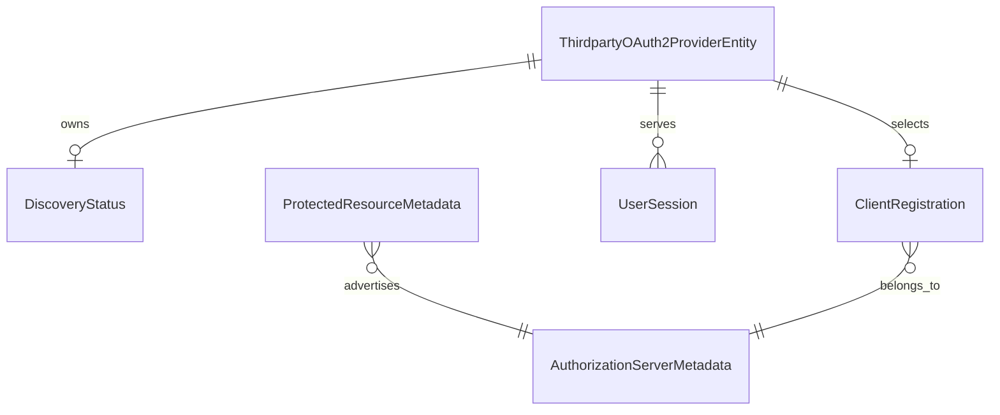

# Data Model: Third-Party Protected Resource Discovery

## Glossary additions

Add these terms to `ARCHITECTURE.md` before implementation:

- **Protected Resource Metadata:** A resource's RFC 9728 document. Its `resource` value must equal the configured URL. Its `authorization_servers` list identifies issuer choices.
- **Authorization Server Metadata:** The RFC 8414 or OpenID document for a selected issuer. It supplies endpoints and client capabilities.
- **Client bootstrap method:** The source of a discovery-backed client's identity. `cimd` uses the broker-hosted document. `dcr` uses an RFC 7591 registration.
- **DCR client identity:** The pair `(issuer_uri, client_id)`. One client ID can exist at two different issuers.
- **Effective resource:** The single persisted RFC 8707 `authorization_params.resource` value. It is derived from a verified resource URL or supplied by an administrator.
- **Broker client name:** The optional deployment-wide `third_party_oauth2.client_name` supplies DCR `client_name`. The configuration port supplies it at registration time. It has no service column or per-service override. Its absence blocks DCR only; the service display name is never a fallback.
- **Discovery status:** The latest attempt and latest successful configuration for one service. A failed refresh does not replace the active configuration.

The discovery resource, the effective token resource, and the service's `protected_resources` ownership set are distinct concepts. The last set supports RFC 8693 token exchange under [ADR 030](../../adrs/030-normalize-protected-resources.md).

## Persistent aggregate: ThirdpartyOAuth2ProviderEntity

The existing `model.ThirdpartyOAuth2ProviderEntity` remains the only service aggregate. Its `id.ServiceID` is the stable UUID primary key. No new UUID entity or generated ID type is required.

| Field | Type | Discovery-backed rule |
|---|---|---|
| `ID` | `id.ServiceID` | Assigned before hosted CIMD identity or DCR callback registration. |
| `Discovery.EnableDiscovery` | `bool` | Must be true when `ResourceURL` is present. |
| `Discovery.ResourceURL` | nullable string | The configured public HTTPS resource identifier. It must have no fragment. Metadata must report the exact same value. |
| `Discovery.MetadataURL` | nullable string | Must be absent with `ResourceURL`. It retains its direct AS-metadata meaning for existing services. |
| `IssuerURI` | string | Must exactly match one issuer advertised by the resource. A single issuer needs no administrator selection. |
| `Endpoints.AuthorizeEndpoint` | string | Required public HTTPS URL from the selected AS metadata. |
| `Endpoints.TokenEndpoint` | string | Required public HTTPS URL from the selected AS metadata. It cannot have a `resource` query parameter. |
| `Endpoints.JWKsURI` | string | Optional, but a non-empty discovered URL must be public HTTPS. |
| `ClientID` | `id.ClientID` | Hosted CIMD URL or returned DCR ID. Non-empty and scoped to `IssuerURI` for DCR. |
| `ClientMethod` | nullable enum `cimd` / `dcr` | Null for manual or direct AS-metadata services. Keep the selected method on every discovery-backed update, including an issuer change. |
| `TokenEndpointAuthMethod` | enum | `private_key_jwt` for hosted CIMD; `client_secret_basic` or `client_secret_post` for confidential DCR; `none` for public DCR. Keep the exact value on every discovery-backed update. Existing null/manual confidential behavior remains unchanged. |
| `Secret` | `model.Secret` | Absent for CIMD/public DCR. Confidential DCR has encrypted ciphertext at rest under the existing `service_id` encryption context. |
| `AuthorizationParams` | `map[string]string` | Contains exactly one effective `resource` entry for discovery-backed services. Other permitted provider parameters remain unchanged. |
| `ResourceExplicit` | boolean | True only when an administrator supplies `authorization_params.resource` for a discovery-backed service. False for manual services, even when an omitted parameter map retains a `resource` entry. |
| `DiscoveryStatus` | value object | Attempt time, success time, and a safe failure code occupy the same service row as the active configuration. |
| `Version` | integer | Existing optimistic-concurrency version. A failure-only status write guards this version but does not change it or the ETag. |

The existing `Scopes`, `ProtectedResources`, `ServiceRequirements`, canonical ID, and timestamps retain their meanings. A discovery URL does not add an entry to `ProtectedResources` automatically.

### Authentication states

| Service type | Client method | Token method | Stored secret | Code exchange and refresh |
|---|---|---|---|---|
| Manual confidential | null | null | Encrypted | Existing auto-detected code exchange and legacy refresh form. |
| Manual public | null | `none` | Absent | Existing public PKCE path. |
| Manual hosted CIMD | null | `private_key_jwt` | Absent | Existing hosted client assertion path. |
| Discovery hosted CIMD | `cimd` | `private_key_jwt` | Absent | ES256 assertion and PKCE. |
| Discovery confidential DCR | `dcr` | `client_secret_basic` or `client_secret_post` | Encrypted | The selected method only, with PKCE. |
| Discovery public DCR | `dcr` | `none` | Absent | Public token requests and PKCE. |

[ADR 038](../../adrs/038-protected-resource-discovery-and-dcr.md) supersedes [ADR 036](../../adrs/036-public-client-token-endpoint-auth.md) only for discovery-backed DCR authentication. Manual confidential clients keep automatic authentication. DCR pins its selected method for code exchange and refresh without probing alternatives. Only DCR rows participate in issuer/client-ID uniqueness. Manual services retain their present uniqueness rules.

## DiscoveryStatus value object

| Field | Type | Rule |
|---|---|---|
| `LastAttemptAt` | nullable timestamp | Set with each committed create or refresh result. Null for manual services; a failed create has no service row. |
| `LastSuccessAt` | nullable timestamp | Set with the active configuration on success. Retained on a failed refresh. Null only for manual services. |
| `FailureReason` | nullable safe code | Null after success and for manual services. Never store a provider body, credential, token, assertion, or URL query. |

The `status` response is derived from the service row, not a stored enum or a separate table:

- `not_applicable`: `resource_url` is null. All discovery timestamps, the client method, and the failure reason are null.
- `ready`: A discovery-backed row has equal attempt and success timestamps and no failure reason.
- `failed`: A discovery-backed row has an attempt after its last success and a safe failure code. Its active configuration remains usable.

The response reads the active `ResourceURL`, `IssuerURI`, and `ClientMethod`. It never returns a failed replacement URL. Missing fields serialize as JSON `null`.

## Ephemeral metadata and registration values

| Value | Required fields | Validation / use |
|---|---|---|
| Protected Resource Metadata | `resource`, `authorization_servers` | Exact resource match; at least one non-empty issuer; use only a selected advertised issuer. |
| Authorization Server Metadata | `issuer`, `authorization_endpoint`, `token_endpoint`; optional `registration_endpoint`, `jwks_uri`, `client_id_metadata_document_supported`, `token_endpoint_auth_methods_supported`, `token_endpoint_auth_signing_alg_values_supported` | Exact issuer match; safe public HTTPS endpoints; choose the first non-404 metadata location; no fallback after an invalid response. |
| DCR request | `redirect_uris`, `client_name`, `grant_types`, `response_types`, `token_endpoint_auth_method` | Exact existing callback, configured non-blank broker client name, authorization code, refresh token, code response, and one selected method. No DCR request occurs without the broker client name. |
| DCR result | `client_id`, returned redirect URIs, authentication method, optional client secret | Reject missing ID, incompatible callback, mismatched method, missing required secret, or any non-zero `client_secret_expires_at`. An optional `grant_types` response can omit `refresh_token`. Discard unused management credentials. |
| Hosted CIMD identity | `<server.enduser.public_url>/.well-known/oauth-client/<service-id>` | Reuse the existing ES256 key domain and public document. No DCR call after CIMD selection. |

Each remote fetch and registration response has a 256-KiB limit. The entire attempt has a 15-second deadline. The code rejects redirects, private resolved addresses, non-HTTPS origins, and invalid identity claims before it stores active state.

The service stores no credential-rotation state. It rejects DCR registrations with non-zero secret expiry before persisting a service. If the provider issues no refresh token or revokes the stored credential, renewal fails without re-registration.

## Relationships



`DiscoveryStatus` and `ClientRegistration` are owned values, not separate local tables. The service row holds its status beside its active client and issuer. A remote DCR registration can remain after a failed local transaction, but no usable local service or stored credential remains.

## State transitions

| From | Action | To | Stored result |
|---|---|---|---|
| No service | Successful resource discovery and bootstrap | Ready discovery-backed service | Commit active fields, encrypted secret if needed, and both timestamps together. |
| No service | Invalid metadata, unsafe URL, or failed bootstrap | No service | No local row or credential. An unused remote DCR registration can remain. |
| Ready service | Refresh with unchanged issuer and client method | Ready service | Update verified source, endpoints, and both timestamps on the service row. Clear the failure reason. Retain client ID, DCR secret, token authentication method, and user sessions. |
| Ready service | Failed refresh | Same active service plus failed status | Change only the attempt time and safe failure code on that row. Retain success time, version, ETag, endpoints, issuer, credential, resource, and sessions. |
| Ready service | New verified resource URL with derived resource | Ready service | Replace the derived `authorization_params.resource`. |
| Ready service | New verified resource URL with explicit override | Ready service | Keep the explicit `authorization_params.resource`. |
| Ready service | Replacement `authorization_params` without `resource` | Ready service | Clear the override and restore the current verified resource. |
| Ready service without user sessions | Explicit selection of a different advertised issuer | Ready service if the new issuer supports the stored client method and exact token authentication method | Validate the new issuer. Keep the hosted CIMD ID, or register a new DCR client and store its ID and required secret. Commit the issuer and client identity together. A failure changes only status. |
| Ready service with user sessions | Explicit selection of a different issuer | Active configuration unchanged; status failed | Return `409` before network access. Save only the safe failure code and attempt time. Do not send a credential or refresh token to the new issuer. |
| Discovery-backed service | Successful manual replacement without `resource_url` | Manual service | Clear the discovery source, client method, status timestamps, failure reason, and explicit marker. Replace the DCR identity and credential with the manual configuration. If `authorization_params` is omitted, keep the current map. If an empty map is supplied, clear it. |
| Discovery-backed service | Delete under existing reference guards | Absent service | Delete its local status and credential with the service row. Later status GET returns 404. |
| Manual service | Status GET | Unchanged manual service | Return `not_applicable` with null discovery fields. No network request occurs. |

For a discovery-backed update, omitting `authorization_params` retains its current map and source marker. A replacement object with `resource` sets an explicit override. A replacement object without `resource` restores a derived value. On a successful transition to manual configuration, an omitted map remains stored, but `resource_explicit` becomes false. An explicit empty map clears all parameters.

An issuer change checks for user sessions before network access and again when it commits. PostgreSQL uses a service-row lock, while memory uses a shared gate. Session insertion uses the matching lock or gate and checks the issuer sealed in OAuth2 state. An old callback cannot create a session after the issuer changes.

## Persistence design

Migration `036_add_protected_resource_discovery.{up,down}.sql` extends `thirdparty_oauth2_services`. These SQL predicates implement [accepted ADR 038](../../adrs/038-protected-resource-discovery-and-dcr.md). The existing `authorization_params` JSONB column stores the effective resource.

```sql
ALTER TABLE thirdparty_oauth2_services
    ADD COLUMN resource_url TEXT,
    ADD COLUMN client_method VARCHAR(4),
    ADD COLUMN resource_explicit BOOLEAN NOT NULL DEFAULT FALSE,
    ADD COLUMN discovery_last_attempt_at TIMESTAMPTZ,
    ADD COLUMN discovery_last_success_at TIMESTAMPTZ,
    ADD COLUMN discovery_failure_reason VARCHAR(64);

ALTER TABLE thirdparty_oauth2_services
    ADD CONSTRAINT chk_thirdparty_oauth2_services_discovery_fields CHECK (
        (
            resource_url IS NULL
            AND client_method IS NULL
            AND resource_explicit = FALSE
        ) OR (
            resource_url IS NOT NULL
            AND btrim(resource_url) <> ''
            AND enable_discovery IS TRUE
            AND metadata_url IS NULL
            AND client_method IS NOT NULL
            AND client_method IN ('cimd', 'dcr')
            AND authorization_params ? 'resource'
            AND jsonb_typeof(authorization_params -> 'resource') = 'string'
            AND NULLIF(btrim(authorization_params ->> 'resource'), '') IS NOT NULL
            AND (resource_explicit OR authorization_params ->> 'resource' = resource_url)
        )
    ),
    ADD CONSTRAINT chk_thirdparty_oauth2_services_discovery_status CHECK (
        (
            resource_url IS NULL
            AND discovery_last_attempt_at IS NULL
            AND discovery_last_success_at IS NULL
            AND discovery_failure_reason IS NULL
        ) OR (
            resource_url IS NOT NULL
            AND discovery_last_attempt_at IS NOT NULL
            AND discovery_last_success_at IS NOT NULL
            AND (
                (discovery_failure_reason IS NULL
                 AND discovery_last_attempt_at = discovery_last_success_at)
                OR (discovery_failure_reason IS NOT NULL
                    AND discovery_failure_reason ~ '^[a-z][a-z0-9_]*$'
                    AND discovery_last_attempt_at > discovery_last_success_at)
            )
        )
    );

ALTER TABLE thirdparty_oauth2_services
    DROP CONSTRAINT chk_thirdparty_oauth2_services_client_auth,
    ADD CONSTRAINT chk_thirdparty_oauth2_services_client_auth CHECK (
        CASE
            WHEN client_method IS NULL THEN
                (token_endpoint_auth_method IS NULL AND client_secret_encrypted IS NOT NULL)
                OR (token_endpoint_auth_method IS NOT DISTINCT FROM 'none' AND client_secret_encrypted IS NULL)
                OR (token_endpoint_auth_method IS NOT DISTINCT FROM 'private_key_jwt' AND client_secret_encrypted IS NULL)
            WHEN client_method = 'cimd' THEN
                token_endpoint_auth_method IS NOT DISTINCT FROM 'private_key_jwt'
                AND client_secret_encrypted IS NULL
            WHEN client_method = 'dcr' THEN
                (token_endpoint_auth_method IS NOT DISTINCT FROM 'none'
                 AND client_secret_encrypted IS NULL)
                OR (token_endpoint_auth_method IS NOT NULL
                    AND token_endpoint_auth_method IN ('client_secret_basic', 'client_secret_post')
                    AND client_secret_encrypted IS NOT NULL)
            ELSE FALSE
        END
    );

CREATE UNIQUE INDEX ux_thirdparty_oauth2_services_dcr_issuer_client_id
    ON thirdparty_oauth2_services (issuer_uri, client_id)
    WHERE client_method = 'dcr';
```

The field check accepts valid legacy manual and direct-metadata rows with their existing `enable_discovery`, `metadata_url`, and `authorization_params` values. It rejects a null method with a null secret instead of accepting an unknown SQL `CHECK` result. It limits discovered rows to one verified source and one stored effective resource. Domain validation checks HTTPS, exact metadata identity, the explicit resource URI, and the selected methods. The partial index does not apply to manual or CIMD rows. Keep existing manual-client uniqueness behavior.

On a successful create or refresh, the repository writes the active configuration and both equal status timestamps in one transaction. It clears `discovery_failure_reason`. An unsuccessful create stores no row. For a version-checked discovery-backed update, PostgreSQL applies these conditions to the successful write:

```sql
WHERE id = $1
  AND ($10::text IS NULL OR resource_url IS NULL OR discovery_last_attempt_at <= $13)
  AND version = $25;
```

Here `$10` is the incoming resource URL, `$13` is the completed attempt time, and `$25` is the supplied expected version. If no expected version is supplied, the repository omits the final condition. The repository places the attempt guard on the same `UPDATE` that writes active fields, status, and the next version. If a later failed attempt is already recorded, an earlier success changes no row, even when the version still matches. Equal attempt times remain valid. The memory adapter applies the same attempt guard under its lock.

On a failed refresh, the focused status writer changes only the attempt time and safe code:
```sql
UPDATE thirdparty_oauth2_services
SET discovery_last_attempt_at = $1,
    discovery_failure_reason = $2
WHERE id = $3
  AND version = $4
  AND resource_url IS NOT NULL
  AND discovery_last_attempt_at < $1
  AND discovery_last_success_at < $1;
```

Bind `$1` to the completed attempt time and `$2` to a safe failure code. Bind `$3` to the service ID and `$4` to the observed version. The attempt time must exceed the last stored attempt. A zero-row result is a stale or deleted service, not permission to overwrite it. Do not change `version`, `updated_at`, or active fields in this operation. The memory adapter applies the same failure guards under its lock. An issuer change requires explicit selection and zero user sessions before network access. Its new issuer and DCR identity commit together.

For an issuer change, PostgreSQL locks the service row `FOR UPDATE` in the success transaction. It then checks again for user sessions before replacing the issuer or client identity. The service lock conflicts with the foreign-key key-share lock that new session inserts take. The memory implementations must coordinate their service and session locks for this check.

The down migration first refuses to remove these columns while a discovery-backed row exists. This guard runs before any schema changes. The SQL then removes the partial index and discovery checks, restores the exact migration-035 authentication predicate, and removes the new columns:

```sql
LOCK TABLE thirdparty_oauth2_services IN ACCESS EXCLUSIVE MODE;

DO $$
BEGIN
    IF EXISTS (
        SELECT 1 FROM thirdparty_oauth2_services
        WHERE resource_url IS NOT NULL OR client_method IS NOT NULL
    ) THEN
        RAISE EXCEPTION 'cannot revert protected-resource discovery while discovery-backed services exist';
    END IF;
END
$$;

DROP INDEX ux_thirdparty_oauth2_services_dcr_issuer_client_id;

ALTER TABLE thirdparty_oauth2_services
    DROP CONSTRAINT chk_thirdparty_oauth2_services_discovery_fields,
    DROP CONSTRAINT chk_thirdparty_oauth2_services_discovery_status,
    DROP CONSTRAINT chk_thirdparty_oauth2_services_client_auth,
    ADD CONSTRAINT chk_thirdparty_oauth2_services_client_auth
        CHECK (
            (token_endpoint_auth_method IS NULL AND client_secret_encrypted IS NOT NULL)
            OR (token_endpoint_auth_method IS NOT DISTINCT FROM 'none' AND client_secret_encrypted IS NULL)
            OR (token_endpoint_auth_method = 'private_key_jwt' AND client_secret_encrypted IS NULL)
        ),
    DROP COLUMN resource_url,
    DROP COLUMN client_method,
    DROP COLUMN resource_explicit,
    DROP COLUMN discovery_last_attempt_at,
    DROP COLUMN discovery_last_success_at,
    DROP COLUMN discovery_failure_reason;
```

Migration 035 remains the rollback target. The down migration locks the service table before it checks for discovery-backed rows. This lock prevents a concurrent insert from passing the guard. If a discovery-backed row exists, rollback stops before schema changes. Otherwise, rollback keeps legacy manual rows and their authentication methods. PostgreSQL tests cover apply, guarded rollback, clean rollback, and replay.

The existing `client_secret_encrypted` column contains a DCR secret when required. The service domain encrypts before persistence and decrypts only for token requests. The repository never stores plaintext. The encryption context contains exactly one `service_id` key per [ADR 008](../../adrs/008-encryption-context-optimization.md).

## Invariants

- One discovery-backed service has one active issuer, one active client method, one exact token authentication method, one client ID, and one effective RFC 8707 resource.
- A discovered issuer comes only from validated metadata for the configured resource URL.
- A successful status and active configuration become visible together.
- A failed refresh cannot replace an active credential, endpoint, effective resource, session, or success timestamp.
- A discovery-backed code exchange or refresh sends exactly one `resource` value and never retries without it.
- A DCR confidential client sends only its selected secret authentication method. A public client sends no secret.
- Two DCR services can share a client ID only when their issuer URIs differ.
- No administrative response, status row, or audit record contains a DCR secret or remote response body.
