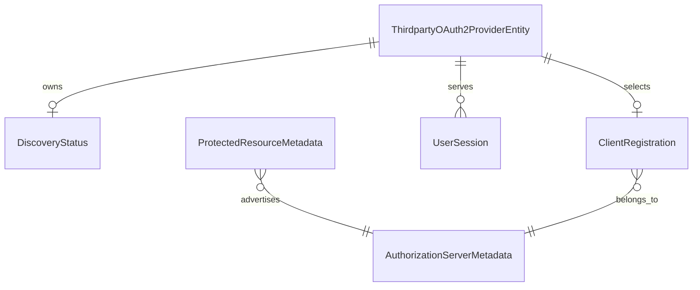

# Data Model: Third-Party Protected Resource Discovery

## Glossary additions

Add these terms to `ARCHITECTURE.md` before implementation:

- **Protected Resource Metadata:** A resource's RFC 9728 document. Its `resource` value must equal the configured URL. Its `authorization_servers` list identifies issuer choices.
- **Authorization Server Metadata:** The RFC 8414 or OpenID document for a selected issuer. It supplies endpoints and client capabilities.
- **Client bootstrap method:** The source of a discovery-backed client's identity. `cimd` uses the broker-hosted document. `dcr` uses an RFC 7591 registration.
- **DCR client identity:** The pair `(issuer_uri, client_id)`. One client ID can exist at two different issuers.
- **Effective resource:** The single persisted RFC 8707 `authorization_params.resource` value. It is derived from a verified resource URL or supplied by an administrator.
- **Discovery status:** The latest attempt and latest successful configuration for one service. A failed refresh does not replace the active configuration.

The discovery resource, the effective token resource, and the service's `protected_resources` ownership set are distinct concepts. The last set supports RFC 8693 token exchange under [ADR 030](../../adrs/030-normalize-protected-resources.md).

## Persistent aggregate: ThirdpartyOAuth2ProviderEntity

The existing `model.ThirdpartyOAuth2ProviderEntity` remains the only service aggregate. Its `id.ServiceID` is the stable UUID primary key. No new UUID entity or generated ID type is required.

| Field | Type | Discovery-backed rule |
|---|---|---|
| `ID` | `id.ServiceID` | Assigned before hosted CIMD identity or DCR callback registration. |
| `Discovery.EnableDiscovery` | `bool` | Must be true when `ResourceURL` is present. |
| `Discovery.ResourceURL` | nullable string | The configured public HTTPS resource identifier. It must have no fragment. Metadata must report the exact same value. |
| `Discovery.MetadataURL` | nullable string | Must be absent with `ResourceURL`. It retains its direct AS-metadata meaning for existing services. |
| `IssuerURI` | string | Must exactly match one issuer advertised by the resource. A single issuer needs no administrator selection. |
| `Endpoints.AuthorizeEndpoint` | string | Required public HTTPS URL from the selected AS metadata. |
| `Endpoints.TokenEndpoint` | string | Required public HTTPS URL from the selected AS metadata. It cannot have a `resource` query parameter. |
| `Endpoints.JWKsURI` | string | Optional, but a non-empty discovered URL must be public HTTPS. |
| `ClientID` | `id.ClientID` | Hosted CIMD URL or returned DCR ID. Non-empty and scoped to `IssuerURI` for DCR. |
| `ClientMethod` | nullable enum `cimd` / `dcr` | Null for manual or direct AS-metadata services. Stable on every discovery-backed update, including issuer change. |
| `TokenEndpointAuthMethod` | enum | `private_key_jwt` for hosted CIMD; `client_secret_basic` or `client_secret_post` for confidential DCR; `none` for public DCR. Keep the exact value on every discovery-backed update. Existing null/manual confidential behavior remains unchanged. |
| `Secret` | `model.Secret` | Absent for CIMD/public DCR. Confidential DCR has encrypted ciphertext at rest under the existing `service_id` encryption context. |
| `AuthorizationParams` | `map[string]string` | Contains exactly one effective `resource` entry for discovery-backed services. Other permitted provider parameters remain unchanged. |
| `ResourceExplicit` | boolean | True only when an administrator supplies `authorization_params.resource`. False when the value is derived from verified metadata. |
| `DiscoveryStatus` | value object | Contains attempt and success timestamps and a safe failure reason. It is stored with the service. |
| `Version` | integer | Existing optimistic-concurrency version. A failure-only status write does not change active configuration or this version. |

The existing `Scopes`, `ProtectedResources`, `ServiceRequirements`, canonical ID, and timestamps retain their meanings. A discovery URL does not add an entry to `ProtectedResources` automatically.

### Authentication states

| Service type | Client method | Token method | Stored secret | Code exchange and refresh |
|---|---|---|---|---|
| Manual confidential | null | null | Encrypted | Existing auto-detected code exchange and legacy refresh form. |
| Manual public | null | `none` | Absent | Existing public PKCE path. |
| Manual hosted CIMD | null | `private_key_jwt` | Absent | Existing hosted client assertion path. |
| Discovery hosted CIMD | `cimd` | `private_key_jwt` | Absent | ES256 assertion and PKCE. |
| Discovery confidential DCR | `dcr` | `client_secret_basic` or `client_secret_post` | Encrypted | The selected method only, with PKCE. |
| Discovery public DCR | `dcr` | `none` | Absent | Public token requests and PKCE. |

Only DCR rows participate in issuer/client-ID uniqueness. Manual services retain their present uniqueness rules. A DCR client must never use auto-detected authentication.

## DiscoveryStatus value object

| Field | Type | Rule |
|---|---|---|
| `LastAttemptAt` | nullable timestamp | Set when a create or refresh completes. Latest attempt wins. Null for manual services. |
| `LastSuccessAt` | nullable timestamp | Set after active discovery configuration commits. Failed refresh retains the prior value. Null before success or for manual services. |
| `FailureReason` | nullable safe category/string | Null after success. Failure has no raw provider body, credential, token, assertion, URL query, or secret. |

The `status` response is a derived value, not a separate stored enum. The domain derives it in this order:

- `not_applicable`: The service has no protected-resource discovery source.
- `ready`: The latest attempt succeeded and the active configuration is usable.
- `failed`: The latest attempt failed. The last successful active configuration remains usable.

The status response reads the active `ResourceURL`, `IssuerURI`, and `ClientMethod`. It does not return the URL of a failed attempted replacement. Missing fields serialize as JSON `null`.

## Ephemeral metadata and registration values

| Value | Required fields | Validation / use |
|---|---|---|
| Protected Resource Metadata | `resource`, `authorization_servers` | Exact resource match; at least one non-empty issuer; use only a selected advertised issuer. |
| Authorization Server Metadata | `issuer`, `authorization_endpoint`, `token_endpoint`; optional `registration_endpoint`, `jwks_uri`, `client_id_metadata_document_supported`, `token_endpoint_auth_methods_supported`, `token_endpoint_auth_signing_alg_values_supported` | Exact issuer match; safe public HTTPS endpoints; choose the first non-404 metadata location; no fallback after an invalid response. |
| DCR request | `redirect_uris`, `grant_types`, `response_types`, `token_endpoint_auth_method` | Exact existing callback, authorization code, refresh token, code response, and one selected method. |
| DCR result | `client_id`, returned redirect URIs, authentication method, optional client secret | Reject missing ID, incompatible callback, mismatched method, missing required secret, or any non-zero `client_secret_expires_at`. An optional `grant_types` response can omit `refresh_token`. Discard unused management credentials. |
| Hosted CIMD identity | `<server.enduser.public_url>/.well-known/oauth-client/<service-id>` | Reuse the existing ES256 key domain and public document. No DCR call after CIMD selection. |

Each remote fetch and registration response has a 256-KiB limit. The entire attempt has a 15-second deadline. The code rejects redirects, private resolved addresses, non-HTTPS origins, and invalid identity claims before it stores active state.

The service stores no credential-rotation state. It rejects DCR registrations with non-zero secret expiry before persisting a service. If the provider issues no refresh token or revokes the stored credential, renewal fails without re-registration.

## Relationships

`ClientRegistration` is an owned value, not a second local entity or table. A DCR registration can remain at the remote provider after a failed local transaction. No usable local service or stored credential remains after that failure.

## State transitions

| From | Action | To | Stored result |
|---|---|---|---|
| No service | Successful resource discovery and bootstrap | Ready discovery-backed service | Commit active fields, encrypted secret if needed, and both timestamps together. |
| No service | Invalid metadata, unsafe URL, or failed bootstrap | No service | No local row or credential. An unused remote DCR registration can remain. |
| Ready service | Refresh with unchanged issuer and client method | Ready service | Update endpoints and verified URL. Retain client identity, DCR secret, and user sessions. |
| Ready service | Failed refresh | Same active service plus failed status | Change attempt time and safe reason only. Retain success time, version, endpoints, credential, and sessions. |
| Ready service | New verified resource URL with derived resource | Ready service | Replace the derived `authorization_params.resource`. |
| Ready service | New verified resource URL with explicit override | Ready service | Keep the explicit `authorization_params.resource`. |
| Ready service | Replacement `authorization_params` without `resource` | Ready service | Clear the override and restore the current verified resource. |
| Ready service without user sessions | Explicit selection of a different advertised issuer | Ready service only if the new issuer supports the exact active client and token authentication methods. Keep the hosted CIMD ID or register a new DCR client with the stored auth method. Reject unavailable methods or a different DCR result without changing active state. Commit the new issuer and client identity together. |
| Ready service with user sessions | Explicit selection of a different issuer | Unchanged service | Return `409` before network access. Do not send an old-issuer refresh token to a new issuer. |
| Discovery-backed service | Delete under existing reference guards | Absent service | Delete its local status and credential with the service row. Later status GET returns 404. |
| Manual service | Status GET | Unchanged manual service | Return `not_applicable` with null discovery fields. No network request occurs. |

An update without `authorization_params` retains its current map and source marker. A replacement object with `resource` sets an explicit override. A replacement object without `resource` restores a derived value.

## Persistence design

Use `036_add_protected_resource_discovery.{up,down}.sql` after migration 035:

1. Add nullable `resource_url` and `client_method` to `thirdparty_oauth2_services`. Add `resource_explicit BOOLEAN NOT NULL DEFAULT FALSE`.
2. Add nullable `discovery_last_attempt_at`, `discovery_last_success_at`, and `discovery_failure_reason` to that same row.
3. Extend `chk_thirdparty_oauth2_services_client_auth` for explicit DCR `client_secret_basic` and `client_secret_post` only when `client_method = 'dcr'` and ciphertext is present. Keep the current static, public, and hosted-CIMD states valid.
4. Add a DCR-only unique index on `(issuer_uri, client_id)`. Scope it with `WHERE client_method = 'dcr'`. Do not change manual client-ID behavior.
5. Add a service-row check for the discovery field combination and basic status consistency. Domain validation remains authoritative for exact resource URI and method policy.

The PostgreSQL repository writes active fields and success status in one transaction. A narrow status-writer operation updates only attempt time and safe reason after failure. It guards against stale versions or a newer successful attempt. The memory adapter applies equivalent rules under its lock. The down migration refuses to remove discovery columns while discovery-backed rows exist. Then it drops the DCR index, restores the migration-035 authentication check, and removes the new columns. Test apply, guarded rollback, clean rollback, and replay with real PostgreSQL.

The existing `client_secret_encrypted` column contains a DCR secret when one is needed. The service domain encrypts before persistence and decrypts only for a token request. The repository never stores plaintext. The encryption context contains exactly one `service_id` key per [ADR 008](../../adrs/008-encryption-context-optimization.md).

## Invariants

- One service has one active issuer, one active client method, one exact token authentication method, one client ID, and one effective RFC 8707 resource.
- A discovered issuer comes only from validated metadata for the configured resource URL.
- A successful status and active configuration become visible together.
- A failed refresh cannot replace an active credential, endpoint, effective resource, session, or success timestamp.
- A discovery-backed code exchange or refresh sends exactly one `resource` value and never retries without it.
- A DCR confidential client sends only its selected secret authentication method. A public client sends no secret.
- Two DCR services can share a client ID only when their issuer URIs differ.
- No administrative response, status row, or audit record contains a DCR secret or remote response body.
