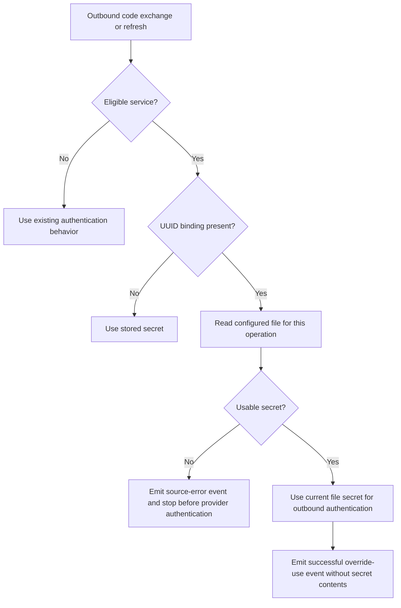

# Feature Specification: OAuth2 Client-Secret File Overrides

**Feature Branch**: `051-oauth2-secret-file-overrides`

**Created**: 2026-10-02

**Status**: Ready for planning — explicit deployment inputs required before target activation

**Input**: User description: "Operator-configured file overrides for third-party OAuth2 client secrets. Bind stable AIB service UUIDs to mounted files, observe rotation on each outbound authentication operation, and fail closed without changing registration or metadata."

## User Scenarios & Testing *(mandatory)*

AIB means Agentic Identity Broker. An eligible service is a registered confidential third-party OAuth2 service that authenticates with a shared client secret. Public clients, CIMD confidential clients, and Google-flavor services are excluded.

Each numbered acceptance scenario requires one corresponding end-to-end acceptance test. Tests use non-secret synthetic credentials and cover complete operator or user journeys.

### User Story 1 - Explicitly select a mounted secret (Priority: P1)

An operator binds an eligible service UUID to a mounted file. A user connects that service, and later renews access, without relying on the stored placeholder secret.

**Why this priority**: Explicit selection provides the core capability without coupling AIB to a credential provider.

**Independent Test**: Register an eligible service with a non-empty placeholder secret. Configure a file binding, complete a connection, and renew access. Observe the credential received by the provider.

**Acceptance Scenarios**:

1. **Given** an empty mapping and valid stored credentials. **When** a user connects a service and renews access. **Then** both operations use the stored secret. The broker reads no credential file, even if unrelated files exist.
2. **Given** an eligible service with a stored placeholder and a valid file binding. **When** a user completes authorization. **Then** authorization-code exchange uses the file secret. The provider never receives the placeholder.
3. **Given** an existing user session and a valid binding. **When** the broker refreshes access. **Then** provider authentication uses the current file secret.
4. **Given** an unbound service and other services with bindings. **When** a user connects the unbound service and renews access. **Then** both operations use its stored secret. Existing files do not change credential selection.
5. **Given** unrelated service UUID, canonical ID, display name, client ID, credential-set name, client label, and filename. **When** a user connects the bound service. **Then** its explicit UUID-to-file binding selects the credential. No name matching occurs.
6. **Given** two services bound to different files. **When** users connect both services and renew access. **Then** each service uses only its configured file. Neither service receives the other credential.

---

### User Story 2 - Observe rotation without operational updates (Priority: P1)

The credential provider changes the mounted secret. Users can connect and renew access with the new value without operator changes to AIB.

**Why this priority**: Reading the current value removes the manual registration update that causes the reported rotation outage.

**Independent Test**: Complete a connection with one synthetic secret. Replace the file value, then complete another connection and renew the existing session.

**Acceptance Scenarios**:

1. **Given** a successful override use. **When** the provider publishes a replacement file value. **Then** the next authorization-code exchange and token refresh use that value. No broker restart, registration update, or rotation-related database write occurs.
2. **Given** two independent bindings. **When** one file changes and both services authenticate again. **Then** only the associated service uses a different credential.
3. **Given** a projected-volume symlink to a valid secret. **When** the volume replaces the symlink target with a new generation. **Then** the next outbound operation uses the new value.
4. **Given** two replicas with different local file generations. **When** users authenticate through each replica. **Then** each uses its local current value. After each local update, that replica uses the replacement on its next operation. No simultaneous update or coordination is required.
5. **Given** surrounding spaces, tabs, or trailing newlines in a secret file. **When** a user connects the service and renews access. **Then** both operations use the value without surrounding whitespace. Internal characters remain unchanged.

---

### User Story 3 - Reject an unavailable mandatory secret (Priority: P1)

An operator can distinguish a credential-source problem from provider rejection. A configured file error stops the affected operation rather than selecting a different credential.

**Why this priority**: Fallback can send stale credentials and conceal a broken deployment. A mandatory source must remain mandatory across operations and replicas.

**Independent Test**: Configure a binding and attempt a complete connection or renewal with an unusable file. Observe the error, event, and absence of a provider authentication request.

**Acceptance Scenarios**:

1. **Given** a configured file that does not exist. **When** a user completes authorization or renews access. **Then** outbound authentication fails before a provider request. The broker does not use the stored secret.
2. **Given** a configured file that the broker process cannot read. **When** a user completes authorization or renews access. **Then** outbound authentication fails before a provider request. The broker does not use the stored secret.
3. **Given** an empty configured file. **When** a user completes authorization or renews access. **Then** outbound authentication fails before a provider request. The broker does not use the stored secret.
4. **Given** a whitespace-only configured file. **When** a user completes authorization or renews access. **Then** outbound authentication fails before a provider request. The broker does not use the stored secret.
5. **Given** a configured path with a broken symlink. **When** a user completes authorization or renews access. **Then** outbound authentication fails before a provider request. The broker does not use the stored secret.
6. **Given** a successful override use. **When** the file becomes unavailable. **Then** subsequent code exchange and refresh fail before provider authentication. Neither operation uses a previous file value or the stored secret.
7. **Given** an unavailable configured file. **When** a restarted broker or a replica with no successful read attempts authentication. **Then** the operation fails closed. Past successful reads are not necessary for this rule.
8. **Given** a failed file read. **When** the operator restores a valid file. **Then** the next operation uses its current value without a restart or registration update.
9. **Given** either an override-source failure or provider rejection of a usable file secret. **When** an operation fails. **Then** the errors identify different failure categories. Structured events identify the service UUID, operation, and non-secret outcome or reason.

---

### User Story 4 - Preserve excluded authentication modes (Priority: P1)

Operators can configure bindings without changing services that do not use an eligible shared secret.

**Why this priority**: Credential selection must preserve public-client, signed-assertion, and Google-flavor behavior.

**Independent Test**: Configure unavailable file paths for excluded services. Complete their existing connection and renewal journeys without file access.

**Acceptance Scenarios**:

1. **Given** a public client with `token_endpoint_auth_method: "none"` and a configured binding. **When** a user connects and renews access. **Then** existing public-client behavior remains unchanged. The broker does not read the file or send a shared secret.
2. **Given** a CIMD confidential client with `token_endpoint_auth_method: "private_key_jwt"` and a configured binding. **When** a user connects and renews access. **Then** existing signed-assertion authentication remains unchanged. The broker does not read the file.
3. **Given** a Google-flavor service with a configured binding. **When** a user connects and renews access. **Then** existing Google-flavor credential behavior remains unchanged. The broker does not read the file.

---

### User Story 5 - Keep registration and metadata independent (Priority: P1)

Administrators manage registered services and users view consent metadata regardless of override-file availability.

**Why this priority**: A deployment credential must not replace the managed service secret or make unrelated operations depend on the filesystem.

**Independent Test**: Use a distinctive synthetic override, complete a connection, and inspect stored service data and operator-visible outputs. Repeat metadata operations with an unavailable file.

**Acceptance Scenarios**:

1. **Given** a successful code exchange and refresh with an override. **When** an administrator reads the service and examines persisted service data. **Then** the managed secret remains unchanged. The override appears in neither the administrative response nor persisted data.
2. **Given** a bound service with an unavailable file. **When** an administrator reads and updates the service. **Then** existing operations remain available without file access. The update manages the stored secret normally and does not disable the binding.
3. **Given** a bound service with an unavailable file. **When** a user views consent or session metadata and starts authorization. **Then** these operations remain available without file access. Consent metadata exposes no override value or path. The outbound credential check occurs only during code exchange or refresh.
4. **Given** successful override use and source/provider errors. **When** an operator examines events, logs, errors, and configuration diagnostics. **Then** no file contents or secret values appear. Existing redaction remains effective.

---

### User Story 6 - Configure bindings through existing sources (Priority: P1)

An operator configures one or several bindings through the established configuration system. Invalid binding syntax stops startup before the broker serves requests.

**Why this priority**: The feature is a deployment concern and must use the same configuration contract as other broker capabilities.

**Independent Test**: Start the broker with each supported configuration source, then complete a connection with the selected binding. Exercise invalid startup input separately.

**Acceptance Scenarios**:

1. **Given** a configuration file with one valid binding. **When** the broker starts and a user connects that service. **Then** authentication uses the configured file.
2. **Given** environment-variable configuration with multiple valid bindings. **When** the broker starts and users connect those services. **Then** each uses its configured file.
3. **Given** CLI-flag configuration with valid bindings. **When** the broker starts and users connect those services. **Then** each uses its configured file.
4. **Given** conflicting bindings across supported sources. **When** the broker starts and a user connects a service. **Then** the existing precedence rules select the binding. An explicit empty mapping in the winning source disables overrides.
5. **Given** a binding key that is not a service UUID. **When** the operator starts the broker. **Then** startup rejects the configuration with a clear error before serving requests.
6. **Given** an empty, whitespace-only, or relative path in a binding. **When** the operator starts the broker. **Then** startup rejects the configuration before serving requests.
7. **Given** valid binding syntax and an unavailable file. **When** the broker starts. **Then** file availability does not block startup or metadata operations. The affected outbound operation fails at use.
8. **Given** a valid UUID binding for a service that is not registered. **When** the broker starts. **Then** configuration does not create that service. Existing registered services retain their normal behavior.

---

### User Story 7 - Deliver readable, rotating files through deployment (Priority: P2)

An operator supplies the binding and credential mount through supported deployment inputs. The operator understands the prerequisites for uninterrupted rotation.

**Why this priority**: A binding alone cannot supply a file. The immediate deployment needs both explicit selection and proven credential delivery.

**Independent Test**: Use the chart and deployment generation workflow to supply a synthetic secret directory. Run the broker with its non-root identity and exercise a connection before and after a local file update.

**Acceptance Scenarios**:

1. **Given** operator-supplied bindings and credential-volume inputs. **When** the chart renders a broker deployment. **Then** it supplies the mapping and a readable directory mount. No individual credential file uses `subPath`. Existing application-configuration and temporary-storage mounts remain intact.
2. **Given** a deployment with complete synthetic file updates and valid credential overlap. **When** a non-root broker connects a user before rotation and renews access after rotation. **Then** both operations succeed with the appropriate local file value.
3. **Given** a target environment with confirmed delivery and rotation prerequisites. **When** the operator updates chart/deployment source inputs and regenerates manifests. **Then** exactly one explicit service binding reaches the immediate deployment. The configuration does not derive the association from names or generated manifests alone.

### Edge Cases

- An absent binding permits the stored secret. An unavailable configured file does not.
- Empty and whitespace-only file values produce source errors. Surrounding whitespace does not change a usable secret.
- A file can disappear between operations or before its first successful read. Both cases fail closed.
- A valid symlink can change targets between operations. A broken symlink is a source error.
- Replacing the mounted file must affect the next operation. Keeping an old value or open file descriptor across operations is prohibited.
- Different services and replicas can observe different file values. Reads remain isolated by binding and local mount.
- Excluded authentication modes ignore bindings even if their paths are unavailable.
- A valid binding for an unknown UUID does not register a service.
- Request identifiers can select configured bindings but cannot supply or construct paths.
- An administrative update does not change the configured binding. Removing a binding requires an ordinary configuration update and restart.
- Partial file publication is outside the delivery contract. AIB cannot guarantee continuity without complete values and sufficient validity overlap.

## Requirements *(mandatory)*

### Functional Requirements

#### Selection and operation boundaries

- **FR-001**: The broker MUST disable file overrides when the mapping is absent or empty. It MUST read no override files in that state. (US1.1)
- **FR-002**: An operator MUST explicitly bind each eligible service by its stable AIB UUID to its client-secret file. (US1.2–3, US1.5)
- **FR-003**: The broker MUST NOT discover files or match credentials by canonical ID, display name, client ID, credential-set name, client label, or filename. (US1.4–5)
- **FR-004**: The broker MUST support one binding for the immediate deployment and multiple independent bindings for other deployments. (US1.6, US7.3)
- **FR-005**: For an eligible bound service, the broker MUST use the file secret only for outbound authentication during authorization-code exchange and token refresh. (US1.2–3, US5.3)
- **FR-006**: Only an absent binding MUST permit selection of the stored secret for an eligible service. An unusable bound source MUST stop the operation. (US1.4, US3.1–7)
- **FR-007**: Public clients, CIMD confidential clients, and Google-flavor services MUST ignore bindings and MUST NOT read override files. (US4.1–3)
- **FR-008**: Configuration MUST NOT create or modify registered services. It MUST NOT introduce automatic association between deployment credentials and service records. (US5.1–2, US6.8)

#### Fresh reads, rotation, and isolation

- **FR-009**: Each outbound authentication operation MUST read the file anew. The broker MUST NOT retain the value or an open file descriptor across operations. (US2.1, US2.3, US3.6)
- **FR-010**: The broker MUST ignore surrounding whitespace, including trailing newlines, and preserve internal secret characters. (US2.5, US3.3–4)
- **FR-011**: Missing, unreadable, empty, whitespace-only, and broken-symlink sources MUST fail before a provider authentication request. (US3.1–5)
- **FR-012**: A source error MUST NOT select the stored secret or a previous file value. This rule MUST apply after successful use, restart, and first use on another replica. (US3.6–7)
- **FR-013**: After a valid local update or source recovery, the next operation MUST use the current file without restart or registration update. (US2.1, US3.8)
- **FR-014**: Normal symlinks used by projected credential volumes MUST work, including target replacement. (US2.3, US3.5)
- **FR-015**: Each service MUST use only its binding. Each replica MUST use its local current file without coordinating reads or rotation. (US1.6, US2.2, US2.4)
- **FR-016**: File rotation MUST NOT cause a database write. Existing session/token persistence remains unchanged. (US2.1, US5.1)

#### Registration, metadata, and observability

- **FR-017**: Override use MUST NOT replace or persist the managed secret. Administrative responses and consent metadata MUST NOT expose override values. (US5.1, US5.3)
- **FR-018**: Administrative reads/updates, consent, session metadata, and authorization initiation MUST remain independent of file availability. (US5.2–3)
- **FR-019**: Each successful override use and failed source read MUST emit a structured log or audit event. Each event MUST include the service UUID, operation, and non-secret outcome or reason. (US3.9, US5.4)
- **FR-020**: Errors MUST distinguish override-source problems from provider authentication rejection without disclosing secret values. (US3.9, US5.4)

### Domain Model *(if applicable - document before API or database design)*

The existing service remains the managed entity. A file binding is deployment configuration, not a new field or persistent credential reference on that entity.

**Activity / Flow Diagram**:



**Entities**:

- **ThirdpartyOAuth2Service**: The existing registered service. Its stable UUID selects a binding. Its managed client ID and stored secret remain unchanged.

**Value Objects**:

- **Client-secret file binding**: An explicit association between one service UUID and one absolute file path, supplied by an operator.
- **Operation secret**: The current file value after surrounding-whitespace removal. Its use is limited to the affected outbound authentication operation.

**Events**:

- **Successful override use**: The broker uses a usable file secret for outbound authentication. This event does not assert that the provider accepts it.
- **Override-source failure**: The broker cannot obtain a usable file secret and stops the operation before provider authentication.

### Configuration Requirements *(if applicable - document before implementation)*

**Configuration Parameters**:

- **`third_party_oauth2.client_secret_files`**: Optional mapping from service UUIDs to absolute client-secret file paths. Default: `{}`.

**Example YAML Configuration**:

```yaml
third_party_oauth2:
  client_secret_files:
    "11111111-1111-4111-8111-111111111111": "/mounted/credentials/unrelated-client-secret"
    "22222222-2222-4222-8222-222222222222": "/mounted/credentials/second-secret"
```

The UUIDs and paths are synthetic examples, not deployment targets. The immediate deployment requires exactly one binding, not both examples.

- **CR-001**: The mapping MUST use the existing configuration system and support configuration files, environment variables, and CLI flags. Existing precedence MUST remain unchanged. (US6.1–4)
- **CR-002**: Operators MUST be able to express one binding, multiple bindings, and an explicit empty mapping through supported configuration sources. (US6.1–4)
- **CR-003**: Startup MUST validate UUID keys and non-empty absolute paths. Empty, whitespace-only, and relative paths MUST be rejected. (US6.5–6)
- **CR-004**: File existence and readability MUST be evaluated at outbound use, not required for startup or metadata operations. (US6.7, US5.2–3)
- **CR-005**: Paths MUST originate exclusively in operator configuration. Administrative input and request identifiers MUST NOT supply paths or determine path construction. (US1.5, US5.2–3)
- **CR-006**: Binding configuration does not require hot reload. File contents MUST take effect independently of configuration reload. (US2.1, US3.8)
- **CR-007**: The Helm chart MUST expose the mapping and sufficient volume and volumeMount configuration to supply credential files. Defaults MUST leave overrides disabled. (US1.1, US7.1)

**Configuration Location**: Operator examples belong in `examples/config/` and must be referenced from `examples/config/README.md`. The configuration reference must cover each supported source.

### Security Requirements *(mandatory for security-critical features)*

- **SR-001**: Configuring a binding MUST make its source mandatory for eligible outbound operations. There MUST be no stale-secret fallback. (US3.1–7)
- **SR-002**: File contents MUST never appear in logs, audit events, errors, configuration diagnostics, administrative responses, or consent metadata. Existing redaction MUST apply. (US5.1, US5.3–4)
- **SR-003**: The override MUST never be written to the database. Existing encryption and managed-secret behavior MUST remain unchanged. (US2.1, US5.1–2)
- **SR-004**: The feature MUST NOT expand the administrative interface, relax provider authentication, or change unrelated security controls. Default-off overrides do not disable existing authentication. (US1.1, US4.1–3, US5.2)
- **SR-005**: Credential mounts MUST permit reads by the broker's non-root process. Operator instructions MUST prefer read-only directory mounts without credential-file `subPath`. (US7.1–2)

### Documentation and Deployment Requirements

- **DR-001**: Operator documentation MUST explain all configuration sources, explicit UUID bindings, default-off behavior, and multiple independent bindings. (US6.1–4)
- **DR-002**: Documentation MUST distinguish no binding from an unavailable configured file. It MUST explain that names and filenames do not establish associations. (US1.4–5, US3.1–7)
- **DR-003**: Deployment guidance MUST cover directory mounts rather than individual-file `subPath`, non-root read permissions, and eventual propagation of projected-volume updates. (US2.3–4, US7.1–2)
- **DR-004**: Guidance MUST describe provider-specific prerequisites for automatic file rotation, complete file publication, stable client IDs, and sufficient old/new validity overlap. It MUST NOT promise simultaneous replica updates or uninterrupted rotation without evidence. (US2.4, US7.2–3)
- **DR-005**: Chart values, schema, templates, and operator documentation MUST change together. Deployment changes MUST update chart/values inputs and use the existing generation workflow. Generated-manifest-only changes are insufficient. (US7.1, US7.3)
- **DR-006**: Delivery MUST record the new boundary in an ADR and update `ARCHITECTURE.md`, its glossary, `docs/configuration.md`, configuration examples, and the changelog. This invocation defines requirements only.

### Key Entities *(include if feature involves data)*

- **Registered service**: An existing third-party OAuth2 service identified by its stable AIB UUID. Configuration does not register or mutate it.
- **Mounted client-secret file**: A plaintext secret delivered by an external provider. Its path has no implicit relationship to service identifiers.
- **Broker replica**: One broker instance with its own local file view. It observes updates independently from other replicas.
- **External credential provider**: The operator-selected system that owns credential rotation and file delivery. AIB consumes files and does not query that system.

## Success Criteria *(mandatory)*

### Measurable Outcomes

- **SC-001**: In 100% of acceptance operations for eligible bound services, users connect and renew access with the file credential, never the stored placeholder.
- **SC-002**: After each complete local file update, each replica uses the replacement on its first subsequent authentication operation. Required restarts, registration updates, and rotation-related database writes: zero.
- **SC-003**: Across all specified unavailable-source cases, failed operations send zero provider authentication requests and use zero fallback credentials.
- **SC-004**: In 100% of unbound and excluded-service acceptance journeys, users retain existing authentication behavior. Credential-file reads for those services: zero.
- **SC-005**: Across two independently bound services and two independently updated replicas, credential selection has zero cross-service substitutions and no coordination requirement.
- **SC-006**: During file outages, all administrative management and metadata acceptance journeys remain available. Override persistence and disclosure occurrences: zero.
- **SC-007**: Every successful override use and failed source read produces a credential-free event with service identity, operation, and outcome. Operators can distinguish source errors from provider rejection in every corresponding acceptance case.
- **SC-008**: Operators can configure the feature through all three supported sources. Invalid UUIDs and paths stop startup in 100% of configuration-validation acceptance cases.
- **SC-009**: An operator can use documented deployment inputs and the generation workflow to supply exactly one binding for the immediate deployment. No credential-name inference or generated-only edit is necessary.

## Assumptions

- The service already exists, has an operator-managed client ID, and uses an eligible shared-secret authentication mode.
- Registration continues to require a non-empty managed secret for an eligible confidential service. An override does not relax registration validation.
- The mounted file contains a plaintext client secret, not JSON, YAML, or another credential document.
- The client ID remains stable. Client-ID changes and continuity of existing authorization codes or refresh tokens are outside this feature.
- The credential provider owns rotation and delivery. It must publish complete file values rather than expose partial writes.
- Uninterrupted rotation depends on old/new validity overlap that covers delivery, replica propagation, and in-flight authentication operations.
- Normal token/session persistence can occur during authentication. The prohibition on database writes applies to rotation and override persistence, not existing session behavior.
- No real secret is necessary for specification or acceptance verification. Tests and verification use synthetic credentials.

### Scope Boundaries

This feature changes deployment configuration and outbound shared-secret selection only. It does not change administrative or OpenAPI contracts, the registered-service model, database schema, migrations, or consent UI.

The following capabilities are outside scope:

- Automatic matching by service name, canonical ID, client ID, credential label, or filename.
- Direct PlatformCredentialsSet, Kubernetes API, Vault, AWS Secrets Manager, or other remote-provider integration.
- A secret-reference field, rotation endpoint, or background reconciler that writes secrets into the database.
- Filesystem watches, a background credential cache, or hot reload of the binding mapping.
- Client-ID overrides, client-identity migration, or guarantees about existing code/token continuity during identity changes.
- Google-flavor overrides or overrides for the standalone extproc-token-exchange process's own `oauth2.client_secret`.
- A general credential-plugin framework or speculative provider adapters.

### Immediate Deployment Evidence and Prerequisites

The target deployment repository is `/Users/brennenstuhl/Projects/agentic-identity-broker-deployment`.

Its checked-in `test`, `prod`, and `sandbox` PlatformCredentialsSet resources declare the `employee` authorization-code client. Credential-set names and client labels are not service bindings.

The callback routes contain service UUIDs, but these routes do not define a mounted-file association. The chosen environment and registered service remain explicit deployment inputs.

The checked-in broker Deployments mount application configuration and temporary storage only. No checked-in credential mount or documented admission mechanism establishes `/meta/credentials`.

The existing deployment generation script consumes `deploy/values/<env>.yaml`, renders the upstream chart, and records its chart reference. Target deployment changes must use those source inputs and that workflow.

Source evidence: `deploy/kubernetes/{test,prod,sandbox}/platformcredentials/third-party-platform-iam.yaml`, the corresponding broker `templates/deployment.yaml`, `deploy/values/{test,prod,sandbox}.yaml`, `delivery.yaml`, and `scripts/update-k8s-manifests.sh` in the deployment repository.

User-provided Platform IAM Credentials documentation states that declared credentials are supplied in a Secret with the same resource name. For the checked-in resources, this name is `agentic-platform-credentials`. The documentation does not identify the client-secret data key or a broker mount.

Deployment readiness decisions:

1. **Stable identity**: The user confirms that the selected client's ID remains stable across secret rotations. Client-ID rotation remains outside scope.
2. **Credential delivery**: The user confirms that delivery inputs are verified. The Secret data key and mounted path remain deployment-owned inputs, by user decision. Before target activation, the operator must supply the environment, service UUID, Secret/key or other confirmed source, volume/admission mechanism, and absolute path. The deployment must establish a readable credential mount through its source inputs. No filename or UUID association is inferred from the client label.
3. **Rotation continuity**: The feature does not promise uninterrupted rotation. Provider rotation interval and old/new validity overlap remain unverified. Continuity claims require documented guarantees or measurements that cover delivery, replica propagation, and in-flight authentication operations.

These prerequisites do not expand feature scope to client-ID rotation, direct provider integration, or database reconciliation.
