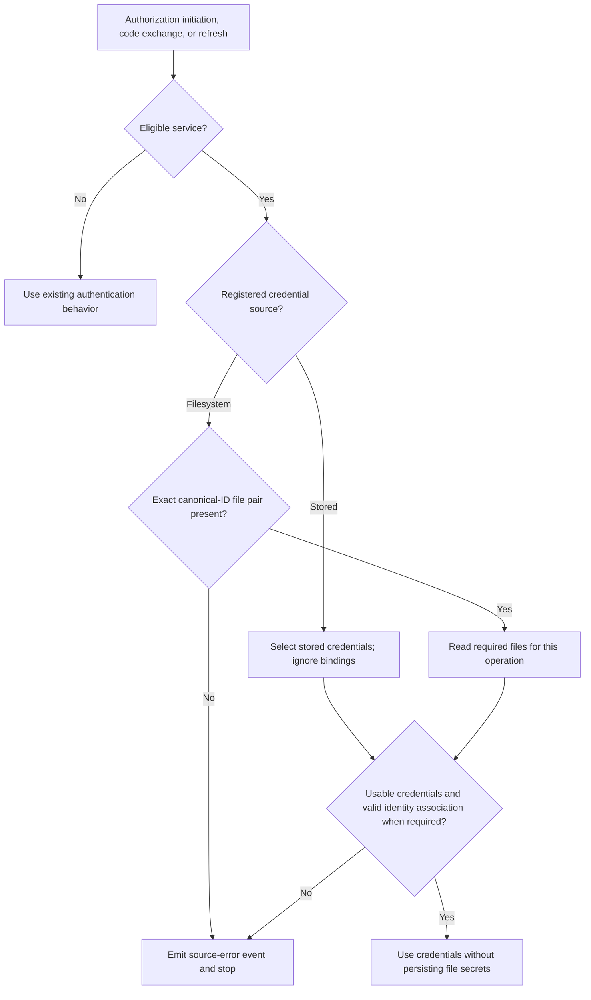

# Feature Specification: Explicit OAuth2 Credential Sources

**Feature Branch**: `051-oauth2-secret-file-overrides`

**Created**: 2026-10-02

**Status**: Refined

**Refined**: 2026-10-07 — Replace implicit secret overrides with an explicit service credential source. Filesystem mode supplies both client ID and secret without stored placeholders.

**Refined**: 2026-10-07 — Clarify paired file inputs versus administrative field omission, require upfront API compatibility and Helm gates, and define identity continuity across source transitions, including legacy contexts.

**Refined**: 2026-10-07 — Define coherent credential acquisition during concurrent publication and restrict administrative credential omission to filesystem services.

**Input**: User description: "Operator-configured file overrides for third-party OAuth2 client secrets. Bind stable AIB service UUIDs to mounted files, observe rotation on each outbound authentication operation, and fail closed without changing registration or metadata."

## Clarifications

### Session 2026-10-05

- Q: When an operation fails because the configured secret file is unusable, should end users and agents get a different API error than when the provider rejects the secret? → A: No. Only operators see the distinction, through a separate internal error category and event reason. Callers get the existing generic internal-error responses. Provider rejection keeps its existing responses. The OpenAPI contracts do not change.
- Q: How should operators write the mapping in an environment variable or a CLI flag? → A: As a JSON object string, for example `{"<canonical-id>":"/abs/path"}`, with `{}` as the explicit empty mapping.
- Q: When the config file and an env var or CLI flag both set the mapping, should the higher-precedence source replace the whole mapping or merge with it entry by entry? → A: Use standard Cobra/Viper key resolution (CLI flag, then environment variable, then configuration file, then default). The highest-precedence source that sets `third_party_oauth2.client_secret_files` supplies the complete mapping. Viper does not merge map entries across sources.
- Q: Should the broker treat a configured path as a source error when it does not resolve to a regular file, or when the file is larger than a fixed limit? → A: Yes. After symlinks are resolved, the target must be a regular file of at most 64 KiB. A directory, FIFO, socket, device, or larger file is a source error.
- Q: What chart inputs should operators use to mount the credential files? → A: No new volume inputs. The chart's existing `broker.extraVolumes` and `broker.extraVolumeMounts` already mount the Secret `agentic-platform-credentials` read-only at `/meta/credentials`. The mount yields plain-text files without trailing line breaks, such as `employee-client-secret`. Bindings select services by canonical ID instead of UUID, for example `zalando-platform: /meta/credentials/employee-client-secret`. The spec now names this deployment target, and the multi-replica scenarios are removed.

### Session 2026-10-07

- Q: Does the override design keep a stored secret that appears as `REDACTED`, although authentication uses a hidden file value? → A: Yes. Replace this design with `credential_source: stored | filesystem` on the registered service. Administrative reads must identify the source explicitly.
- Q: Can filesystem mode supply both the client ID and secret? → A: Yes. Filesystem services require neither stored credential nor placeholder. Operators configure both paths through a canonical-ID binding. The administrative API selects the source but cannot supply file paths.
- Q: Which earlier constraints change? → A: This refinement supersedes secret-only selection, unchanged registration/API/storage contracts, and filesystem-independent authorization initiation. Existing generic callback and refresh errors remain unchanged. Client-ID changes do not guarantee continuity for existing authorization codes or sessions.

## User Scenarios & Testing *(mandatory)*

AIB means Agentic Identity Broker. An eligible service is a registered confidential third-party OAuth2 service that authenticates with a shared client secret. Public clients, CIMD confidential clients, and Google-flavor services are excluded.

Each numbered acceptance scenario requires one corresponding end-to-end acceptance test. Tests use non-secret synthetic credentials and cover complete operator or user journeys.

### User Story 1 - Explicitly select a credential source (Priority: P1)

An administrator selects stored or filesystem credentials on an eligible service. Filesystem mode uses mounted client-ID and secret files without stored placeholders.

**Why this priority**: Explicit selection makes the effective credential source visible without coupling AIB to a credential provider.

**Independent Test**: Register a filesystem service without inline credentials. Configure both file paths, complete a connection, and renew access. Observe provider credentials and administrative source metadata.

**Acceptance Scenarios**:

1. **Given** an empty mapping and a service using stored credentials. **When** a user connects the service and renews access. **Then** both operations use its stored client ID and secret. The broker reads no credential file.
2. **Given** an eligible service with `credential_source: filesystem`, no stored credentials, and valid file bindings. **When** a user completes authorization. **Then** the authorization request uses the file client ID. Code exchange uses that client ID and the file secret.
3. **Given** an existing filesystem-backed user session and a valid binding. **When** the broker refreshes access. **Then** provider authentication uses the current file credentials for that session's client identity.
4. **Given** a stored-source service whose canonical ID also has a file binding. **When** a user connects the service and renews access. **Then** both operations use stored credentials. A binding alone never changes the service's source.
5. **Given** a filesystem service whose UUID, display name, client label, and filenames are unrelated to its canonical ID. **When** a user connects the service. **Then** only its exact canonical-ID binding selects the two files. No filename or credential-value matching occurs.
6. **Given** two filesystem services with different bindings. **When** users connect both services and renew access. **Then** each uses only its configured client-ID and secret files.
7. **Given** an eligible confidential service. **When** an administrator creates it with `credential_source: filesystem` and no inline credentials, then reads it through the API. **Then** registration succeeds. The response identifies `filesystem` and omits `client_id` and `client_secret`, rather than returning a misleading `REDACTED` placeholder. The service record stores neither file value.
8. **Given** a filesystem service without a matching binding, including an empty effective mapping. **When** a user starts authorization or renews access. **Then** the operation fails with a source error before a provider request. The broker never infers stored mode.
9. **Given** a filesystem registration or update with an inline client ID or secret. **When** the administrator submits it. **Then** validation rejects the mixed sources without reading files or changing the service.

---

### User Story 2 - Observe rotation without operational updates (Priority: P1)

The credential provider replaces mounted credentials. New connections use the current client ID, and secret rotation does not require changes to AIB registrations.

**Why this priority**: Reading the current value removes the manual registration update that causes the reported rotation outage.

**Independent Test**: Complete a connection with synthetic file credentials. Replace the secret, then connect again and renew the existing session. Exercise a client-ID change separately.

**Acceptance Scenarios**:

1. **Given** successful filesystem authentication. **When** the provider publishes a replacement secret for the same client ID. **Then** the next code exchange and refresh use that secret. No restart, registration update, or rotation-related service-record write occurs.
2. **Given** two independent filesystem bindings. **When** one service's credential files change and both services start new connections. **Then** only that service uses different credentials.
3. **Given** projected-volume symlinks to valid credentials. **When** the volume replaces their targets with a complete new generation. **Then** the next operation uses the new values. Each provider request uses a coherent pair under FR-009, never values from different publication generations.
4. **Given** surrounding spaces, tabs, or trailing newlines in either credential file. **When** a user connects the service and renews access. **Then** the broker removes surrounding whitespace and preserves internal characters.
5. **Given** an authorization in progress or a session established with client ID A. **When** the mounted client ID changes to B. **Then** a new authorization uses B. The broker does not exchange A's code or refresh A's session as B. The affected operation stops before provider authentication and requires a new connection.

---

### User Story 3 - Reject unavailable mandatory credentials (Priority: P1)

An operator can distinguish a credential-source problem from provider rejection. An unusable required file stops the operation rather than selecting different credentials.

**Why this priority**: Fallback can send stale credentials and conceal a broken deployment. A mandatory source must remain mandatory across operations and restarts.

**Independent Test**: Attempt connection or renewal with an unusable client-ID file, then with an unusable secret file. Observe source errors and no provider authentication request.

**Acceptance Scenarios**:

For scenarios 1–8 and 10–12, exercise each file independently. Authorization initiation requires a usable client-ID file, but does not read the secret file.

1. **Given** a required credential file that does not exist. **When** an operation requires that file. **Then** it fails before a provider request. The broker does not use stored credentials.
2. **Given** a required credential file that the broker process cannot read. **When** an operation requires that file. **Then** it fails before a provider request. The broker does not use stored credentials.
3. **Given** an empty required credential file. **When** an operation requires that file. **Then** it fails before a provider request. The broker does not use stored credentials.
4. **Given** a whitespace-only required credential file. **When** an operation requires that file. **Then** it fails before a provider request. The broker does not use stored credentials.
5. **Given** a required credential path with a broken symlink. **When** an operation requires that file. **Then** it fails before a provider request. The broker does not use stored credentials.
6. **Given** successful filesystem authentication. **When** a required file becomes unavailable. **Then** subsequent operations that require it fail before provider authentication. They use neither previous file values nor stored credentials.
7. **Given** an unavailable configured file. **When** a restarted broker with no successful read attempts authentication. **Then** the operation fails closed. Past successful reads are not necessary for this rule.
8. **Given** a failed file read. **When** the operator restores a valid file. **Then** the next operation uses its current value without a restart or registration update.
9. **Given** a source failure or provider rejection of usable filesystem credentials. **When** an operation fails. **Then** operator-visible categories and events distinguish the causes. Events identify service UUID, operation, and non-secret reason. FR-020 specifies client-facing responses.
10. **Given** a required path that resolves to a directory. **When** an operation requires that file. **Then** it fails before a provider request without using stored credentials.
11. **Given** a required path that resolves to a FIFO, socket, or device. **When** an operation requires that file. **Then** it fails before a provider request without blocking or using stored credentials.
12. **Given** a required regular file larger than 64 KiB (65,536 bytes). **When** an operation requires that file. **Then** it fails before a provider request without using stored credentials.

---

### User Story 4 - Preserve excluded authentication modes (Priority: P1)

Operators can configure bindings without changing services that do not use an eligible shared secret.

**Why this priority**: Credential selection must preserve public-client, signed-assertion, and Google-flavor behavior.

**Independent Test**: Configure unavailable file paths for excluded services. Complete their existing connection and renewal journeys without file access.

**Acceptance Scenarios**:

1. **Given** a public client with `token_endpoint_auth_method: "none"` and a configured binding. **When** a user connects and renews access. **Then** existing public-client behavior remains unchanged. The broker does not read the file or send a shared secret.
2. **Given** a CIMD confidential client with `token_endpoint_auth_method: "private_key_jwt"` and a configured binding. **When** a user connects and renews access. **Then** existing signed-assertion authentication remains unchanged. The broker does not read the file.
3. **Given** a Google-flavor service with a configured binding. **When** a user connects and renews access. **Then** existing Google-flavor credential behavior remains unchanged. The broker does not read the file.
4. **Given** a public, CIMD confidential, or Google-flavor service. **When** an administrator selects `credential_source: filesystem`. **Then** registration or update rejects the unsupported combination. No file is read, and an existing service remains unchanged.

---

### User Story 5 - Expose the source without exposing credentials (Priority: P1)

Administrators see and manage each service's credential source. Administrative and consent metadata remain available without credential-file access.

**Why this priority**: The API must distinguish stored credentials from filesystem credentials without inventing a stored secret or disclosing file contents.

**Independent Test**: Read both source modes through the API. Change sources explicitly, inspect persisted records, and repeat metadata operations during a file outage. Exercise existing codes and sessions across both transition directions with matching, different, and missing established identities.

**Acceptance Scenarios**:

1. **Given** successful filesystem code exchange and refresh. **When** an administrator reads the service and examines its persisted record. **Then** both identify the filesystem source. Neither contains file credential values. The API omits inline credential fields and exposes no path.
2. **Given** a filesystem service with an unavailable file. **When** an administrator reads or updates service metadata. **Then** the operation remains available without file access. An unrelated update preserves the selected source.
3. **Given** a filesystem service with unavailable files. **When** a user views consent or session metadata. **Then** metadata remains available without file access or disclosure. Authorization initiation fails if the client-ID file is unusable, but does not require the secret file.
4. **Given** filesystem use and source/provider errors. **When** an operator examines events, logs, errors, and configuration diagnostics. **Then** no secret or file contents appear. Administrative reads identify the source without resolving it.
5. **Given** a stored-source service with an authorization in progress or an existing session. **When** an administrator explicitly switches it to filesystem mode. **Then** the update removes its stored client ID and secret atomically. Subsequent reads identify filesystem mode without `REDACTED`. Removing the binding never restores stored mode. An operation with a recorded client identity may continue only when the file client ID matches it. A different or missing established identity requires a new connection before any provider authentication.
6. **Given** a filesystem service with an authorization in progress or an existing session. **When** an administrator switches it to stored mode. **Then** the update requires a non-empty inline client ID and secret. It never imports file contents. Subsequent authentication uses only those stored credentials, but an existing code or session may authenticate only when its recorded client identity matches the supplied client ID. A different or missing established identity requires a new connection, including a legacy context after a stored-to-filesystem-to-stored round trip.
7. **Given** a stored confidential service and an omitted source field on an unrelated update. **When** an administrator updates and reads it. **Then** it remains stored. The response reports `stored`, its stored client ID, and the existing `REDACTED` secret representation.
8. **Given** service records created before this feature. **When** the broker upgrades and an administrator reads them. **Then** their existing authentication behavior remains unchanged. Eligible confidential records identify the stored source, with no inferred filesystem selection.

---

### User Story 6 - Configure bindings through existing sources (Priority: P1)

An operator configures pairs of file paths through the established configuration system. Administrators explicitly select filesystem mode on the corresponding registered services.

**Why this priority**: The feature is a deployment concern and must use the same configuration contract as other broker capabilities.

**Independent Test**: Start the broker with each supported configuration source, then complete a connection with the selected binding. Exercise invalid startup input separately.

**Acceptance Scenarios**:

1. **Given** a configuration file with one valid file pair and a filesystem service. **When** the broker starts and a user connects. **Then** authentication uses the configured client ID and secret.
2. **Given** environment-variable configuration with multiple valid file pairs and filesystem services. **When** the broker starts and users connect. **Then** each service uses its configured pair.
3. **Given** CLI configuration with valid file pairs and filesystem services. **When** the broker starts and users connect. **Then** each service uses its configured pair.
4. **Given** conflicting bindings across configuration sources. **When** the broker starts. **Then** the highest-precedence source supplies the complete mapping. The order is CLI, environment, then configuration file. An explicit empty mapping removes all bindings, but never changes a service's selected source.
5. **Given** a binding key that is not a valid canonical ID. **When** the operator starts the broker. **Then** startup rejects the configuration before serving requests.
6. **Given** an empty, whitespace-only, relative, missing, or non-string path in either file-pair field. **When** the operator starts the broker. **Then** startup rejects the configuration before serving requests.
7. **Given** valid binding syntax and unavailable files. **When** the broker starts. **Then** file availability does not block startup or metadata. Operations fail when they require an unusable source.
8. **Given** a binding for an unknown canonical ID. **When** the broker starts. **Then** configuration neither creates a service nor selects filesystem mode for an existing service.
9. **Given** a filesystem service. **When** an administrator clears its canonical ID. **Then** validation rejects the update. A change to another valid canonical ID preserves filesystem mode and requires that ID's binding at use. Missing bindings never select stored credentials.

---

### User Story 7 - Deliver readable, rotating files through deployment (Priority: P2)

An operator supplies both file paths through chart values and explicitly selects filesystem mode on the service. Credential mounts use existing volume inputs.

**Why this priority**: The immediate deployment needs both paths next to its existing credential mount, plus an explicit service-source setting.

**Independent Test**: Render both paths and a mounted synthetic Secret. Run a non-root broker with a filesystem service before and after secret rotation.

**Acceptance Scenarios**:

1. **Given** a file-pair binding in chart values and a credential Secret mounted through existing volume inputs. **When** the chart renders. **Then** both paths reach broker configuration. Credential, configuration, and temporary-storage mounts remain intact. Default values render no binding.
2. **Given** a filesystem service and complete synthetic file updates. **When** a non-root broker connects a user and renews access after secret rotation. **Then** both operations succeed with the current credentials.
3. **Given** the target deployment inputs. **When** the operator configures both `/meta/credentials/employee-client-id` and `/meta/credentials/employee-client-secret` for `zalando-platform` and regenerates manifests. **Then** exactly that pair reaches broker configuration. The registered service explicitly selects filesystem mode, without stored placeholders.

### Edge Cases

- A stored-source service ignores file bindings. A filesystem service with an absent binding or unusable required file fails closed.
- Empty and whitespace-only values in either file produce source errors. Surrounding whitespace does not change usable credentials.
- Either file can disappear before first use or between operations. The next operation that requires it fails closed.
- A valid symlink can change targets between operations. A broken symlink is a source error.
- Each resolved target must be a regular file of at most 64 KiB. The broker never blocks on a directory, FIFO, socket, or device.
- Replacing a mounted file affects the next operation. The broker retains neither values nor open descriptors across operations.
- Detected target changes during pair acquisition produce a source error before provider authentication. A later operation acquires the current pair.
- A publication change after validated acquisition does not invalidate that operation's pair. Established client-identity checks and provider validity still apply.
- Different services use only their configured file pairs. File paths and credential values never select a service implicitly.
- Excluded modes ignore unused bindings. Selecting filesystem mode for an excluded service is invalid.
- A binding for an unknown canonical ID does not register a service or change its source.
- Administrative requests select the source, but cannot supply or construct file paths.
- Removing a binding requires a configuration update and restart. It never changes filesystem mode to stored mode.
- Bindings match canonical IDs exactly, including case. Changing a filesystem service's ID cannot select stored credentials implicitly.
- Partial file publication is outside the delivery contract. The provider must publish a consistent pair and sufficient validity overlap.
- Changed values use fresh immutable file targets. Providers never modify a published target or republish a retired target during in-flight acquisition.
- A changed client ID or credential source must not send an existing code or session under another client identity. Source transitions never rewrite established identities. Legacy contexts without an identity retain behavior only for stored services that have never changed source; transitioning back to stored does not restore that exception.
- Filesystem metadata reads do not resolve files. Authorization initiation reads the client-ID file, but never the secret file.

## Requirements *(mandatory)*

### Functional Requirements

#### Selection and operation boundaries

- **FR-001**: Stored-source services MUST use stored credentials and read no credential files, regardless of bindings. Empty configuration MUST NOT change a filesystem service's source. (US1.1, US1.4, US1.8)
- **FR-002**: Each filesystem service MUST have a canonical ID. Operators MUST explicitly bind that ID to a client-ID file and a secret file. (US1.2–3, US1.5, US6.9)
- **FR-003**: The broker MUST NOT discover files or match credentials by display name, client ID, credential-set name, client label, or filename. Bindings MUST match canonical IDs exactly. (US1.4–5)
- **FR-004**: The broker MUST support one binding for the immediate deployment and multiple independent bindings for other deployments. (US1.6, US7.3)
- **FR-005**: Filesystem authorization initiation MUST read the current client-ID file, but not the secret file. Code exchange and refresh MUST read both current files. (US1.2–3, US5.3)
- **FR-006**: Only an explicitly stored source MUST select stored credentials. An absent binding or unusable required file for a filesystem service MUST stop the operation. (US1.4, US1.8, US3.1–7, US3.10–12)
- **FR-007**: Public, CIMD confidential, and Google-flavor services MUST retain existing authentication and ignore unused bindings. Their registration and updates MUST reject filesystem mode. (US4.1–4)
- **FR-008**: File configuration MUST NOT create or modify registered services, select their source, or establish an implicit credential association. (US1.4, US6.8)

#### Fresh reads, rotation, and isolation

- **FR-009**: Each affected operation MUST read its required files anew. Code exchange and refresh MUST acquire one coherent pair under the immutable-target publication contract. After both bounded reads finish, both configured paths MUST still identify their respective opened targets. A changed target MUST produce a `generation_changed` source error before a provider request. An unavailable target MUST produce the applicable source error. The broker MUST NOT retry failed acquisition within that authentication attempt. Publication after validated acquisition MAY leave that operation using its validated pair, subject to FR-025 and provider validity. Subsequent acquisitions MUST use the current targets. The broker MUST NOT cache credentials or retain open descriptors across operations. Only FR-025's non-secret client-identity association and source-transition evidence can persist. (US2.1, US2.3, US3.6)
- **FR-010**: The broker MUST remove surrounding whitespace from both file values and preserve internal characters. (US2.4, US3.3–4)
- **FR-011**: Missing, unreadable, empty, whitespace-only, broken-symlink, non-regular, and oversized required files MUST fail before a provider request. The size limit MUST be 64 KiB (65,536 bytes) per file. Non-regular sources MUST NOT block the broker. (US3.1–5, US3.10–12)
- **FR-012**: Source errors MUST NOT select stored credentials or previous file values. This rule MUST apply after successful use and after restart. (US3.6–7)
- **FR-013**: After source recovery or a complete file update, the next affected operation MUST use current values without restart or registration update. Client-identity continuity limits remain applicable. (US2.1, US2.5, US3.8)
- **FR-014**: Normal symlinks used by projected credential volumes MUST work, including target replacement. (US2.3, US3.5)
- **FR-015**: Each service MUST use only its binding. (US1.6, US2.2)
- **FR-016**: File rotation MUST NOT write service records or persist file secrets. Normal authorization context and session/token persistence MUST remain available. (US2.1, US5.1)

#### Registration, metadata, and observability

- **FR-017**: Filesystem use MUST NOT persist file credentials on the service. Administrative reads MUST report `credential_source` and omit both inline credential fields (`client_id` and `client_secret`) for filesystem mode because metadata reads do not resolve the files. Per-service configuration MUST still contain both file paths, and provider protocol requests MUST use the resolved client ID. Administrative reads MUST NOT return a synthetic `REDACTED` secret for that mode. Consent and metadata MUST expose neither file contents nor paths. (US1.7, US5.1, US5.3, US5.7)
- **FR-018**: Administrative reads/updates, consent, and session metadata MUST remain independent of file availability. ~~Authorization initiation MUST remain independent of file availability.~~ Removed because initiation requires the filesystem client ID. Initiation MUST NOT read the secret file. (US5.2–3)
- **FR-019**: Successful filesystem credential selection and failed source reads MUST emit structured events. Events MUST identify service UUID, operation, and non-secret outcome or reason. (US3.9, US5.4)
- **FR-020**: Source failures MUST have an internal category distinct from provider rejection and distinct event reasons. Existing generic callback and refresh responses MUST remain unchanged: `callback_failed`, `500 internal_error` for session refresh, and `500 server_error` for token exchange. Authorization-initiation source failures MUST use its generic internal-error response, with no file detail. Provider rejection MUST retain its existing responses. Errors MUST NOT disclose credentials. (US1.8, US3.9, US5.3–4)
- **FR-021**: Eligible services MUST persist an explicit `credential_source` with values `stored` or `filesystem`. Unknown values MUST be rejected. Omission on creation MUST select stored mode. Omission on update MUST preserve the current mode. Existing records MUST migrate without changing authentication behavior. (US1.7, US5.2, US5.7–8)
- **FR-022**: Stored confidential services MUST require a non-empty inline client ID and secret under existing validation. Filesystem services MUST require neither stored credential nor placeholder. Filesystem creation and updates MUST reject inline credentials rather than silently ignore them. (US1.7, US1.9, US5.6–7)
- **FR-023**: Switching to filesystem mode MUST remove stored credentials atomically. Switching to stored mode MUST require explicit inline credentials, never imported file values. Unrelated updates and binding removal MUST NOT change the source. (US5.2, US5.5–6)
- **FR-024**: The service model, PostgreSQL and in-memory adapters, and required migrations MUST support the source and source-specific credential invariants. Administrative OpenAPI contracts and affected API consumers MUST define the selector and credential omission before implementation. Omitting `client_id` changes the current required response field and MUST NOT be classified as purely additive. The blocking API-design gate MUST record release status and the confirmed contract/versioning decision. A deployed or released contract MUST use a major version bump or a new endpoint, with the required breaking-change documentation, before implementation proceeds. (US1.7, US1.9, US5.5–8)
- **FR-025**: New eligible stored and filesystem authorizations and sessions MUST retain their established non-secret client ID. Before code exchange or refresh, the selected client ID MUST match that association in either source mode, including after either source transition. A mismatch MUST stop before provider authentication and require a new connection; transitions MUST NOT rewrite the association. Matching identities may continue subject to provider validity. Legacy contexts without an association MUST retain existing behavior only while the service remains stored and has never changed source. Filesystem mode or any prior source transition MUST make a missing association fail closed, including a return to stored mode. Durable non-secret source-transition evidence MUST distinguish that case without inferring identity from current credentials. Neither association nor transition evidence MUST persist file secrets. (US2.5, US5.5–6, US5.8)

### Domain Model *(if applicable - document before API or database design)*

The registered service owns its credential-source choice. Operator configuration owns filesystem paths. Filesystem values remain operation-local, except the non-secret client identity associated with an authorization or session.

**Activity / Flow Diagram**:



**Entities**:

- **ThirdpartyOAuth2Service**: The registered service with an explicit credential source and durable non-secret source-transition evidence. Stored mode owns inline credentials. Filesystem mode owns neither inline credential and requires a canonical ID. The transition evidence distinguishes unchanged legacy stored services from services that changed source, even after returning to stored. Its UUID and existing relationships remain stable.

**Value Objects**:

- **Credential source**: The registered service's explicit choice of stored or filesystem credentials.
- **Filesystem credential binding**: An operator-configured association from one exact canonical ID to two absolute paths, `client_id_file` and `client_secret_file`.
- **Operation credentials**: Normalized file values from one validated acquisition, used only for the affected operation. Code exchange and refresh require a coherent pair under FR-009. Authorization initiation requires only the client ID and never acquires the secret.
- **Client-identity association**: The non-secret client ID under which an eligible stored or filesystem authorization or session was established, compared with the selected client ID before code exchange or refresh in either mode. Source changes never rewrite it. Legacy absence is usable only for a never-transitioned stored service.

**Events**:

- **Successful filesystem use**: The broker selects usable file credentials for an operation. This event does not assert provider acceptance.
- **Credential-source failure**: The broker cannot obtain usable required values and stops before a provider request.

### Configuration Requirements *(if applicable - document before implementation)*

**Configuration Parameters**:

- ~~**`third_party_oauth2.client_secret_files`**: Optional mapping from service canonical IDs to absolute client-secret file paths. Default: `{}`.~~ Removed because a secret-only binding cannot represent the explicit filesystem credential pair.
- **`third_party_oauth2.credential_files`**: Optional mapping from exact service canonical IDs to objects containing `client_id_file` and `client_secret_file`. Default: `{}`. This mapping never selects filesystem mode by itself.
- **Service `credential_source`**: Administrative source selector, persisted on the service rather than supplied through deployment configuration. Eligible services support `stored` and `filesystem`.

**Example YAML Configuration**:

```yaml
third_party_oauth2:
  credential_files:
    zalando-platform:
      client_id_file: /meta/credentials/employee-client-id
      client_secret_file: /meta/credentials/employee-client-secret
```

The immediate service explicitly selects `credential_source: filesystem` with canonical ID `zalando-platform` and no inline credentials. Other deployments can add independent file pairs.

- **CR-001**: The mapping MUST use the existing configuration system: CLI, environment, configuration file, then default precedence. The winning source MUST replace the complete mapping, without entry merging. `IDENTITY_BROKER_THIRD_PARTY_OAUTH2_CREDENTIAL_FILES` and `--third_party_oauth2.credential_files` MUST accept a JSON object string. Example: `{"zalando-platform":{"client_id_file":"/meta/credentials/employee-client-id","client_secret_file":"/meta/credentials/employee-client-secret"}}`. `{}` MUST express an explicit empty mapping. (US6.1–4)
- **CR-002**: All supported sources MUST express one file pair, multiple independent pairs, and an explicit empty mapping. (US6.1–4)
- **CR-003**: Startup MUST validate canonical IDs and require both non-empty absolute paths in each binding. Keys MUST contain 1–128 letters, digits, `.`, `_`, or `-`, and MUST NOT be UUID-shaped. Malformed input, non-object bindings, missing fields, non-string paths, and empty, whitespace-only, or relative paths MUST be rejected. (US6.5–6)
- **CR-004**: Required file availability MUST be evaluated at use, not startup or metadata access. Authorization initiation requires only the client-ID file. (US6.7, US5.2–3)
- **CR-005**: Paths MUST originate exclusively in operator configuration. Administrative input and request identifiers MUST NOT supply paths or determine path construction. (US1.5, US5.2–3)
- **CR-006**: Binding configuration does not require hot reload. File values MUST take effect independently of configuration reload. Binding removal MUST NOT change service-source selection. (US2.1, US3.8, US5.5)
- **CR-007**: Helm MUST expose the pair mapping as `broker.thirdPartyOauth2.credentialFiles`, default `{}`. Existing `broker.extraVolumes` and `broker.extraVolumeMounts` MUST supply the files. No new volume inputs are required. (US1.1, US7.1)

**Configuration Location**: Operator examples belong in `examples/config/` and must be referenced from `examples/config/README.md`. The configuration reference must cover each supported source.

### Security Requirements *(mandatory for security-critical features)*

- **SR-001**: Selecting filesystem mode MUST make its configured sources mandatory at use, even when the binding is absent. Stored or stale-file fallback MUST NOT occur. (US1.8, US3.1–7, US3.10–12)
- **SR-002**: File contents MUST NOT appear in logs, audit events, errors, diagnostics, administrative responses, or consent metadata. The client ID necessarily appears in provider protocol requests. Its authorization/session association is permitted, but metadata reads MUST NOT resolve or disclose its file value. (US1.2, US2.5, US5.1, US5.3–4)
- **SR-003**: File credentials MUST NOT populate the service record. Stored-mode encryption and existing token/session encryption MUST remain intact. Source transitions MUST remove obsolete stored credentials. (US2.1, US5.1, US5.5–6)
- **SR-004**: ~~The feature MUST NOT expand the administrative interface.~~ Removed because explicit source selection requires a documented service field. The feature MUST NOT relax provider authentication or unrelated security controls. Filesystem mode MUST remain invalid for excluded authentication modes. (US4.1–4, US5.2)
- **SR-005**: Credential mounts MUST permit reads by the broker's non-root process. Operator instructions MUST prefer read-only directory mounts without credential-file `subPath`. (US7.1–2)

### Documentation and Deployment Requirements

- **DR-001**: Documentation MUST explain both service-source modes, source-specific registration, API representations, file-pair configuration, precedence, and independent bindings. (US1.7, US5.5–8, US6.1–4)
- **DR-002**: Documentation MUST distinguish stored mode, missing filesystem bindings, and unusable files. Binding removal MUST NOT be described as a switch to stored mode. No name or filename inference is permitted. (US1.4–5, US1.8, US3.1–7)
- **DR-003**: Deployment documentation MUST show both paths for `zalando-platform` and explicit filesystem registration without placeholders. It MUST retain the read-only `agentic-platform-credentials` mount and existing volume inputs. It MUST explain client-identity continuity limits and MUST NOT promise uninterrupted rotation. (US2.5, US7.1–3)
- **DR-004**: Chart values, schema, templates, and operator documentation MUST change together. The actual Helm contract MUST be completed test-first in the blocking design phase before broker production-code implementation, not deferred to deployment delivery. Deployment changes MUST update chart/values inputs and use the existing generation workflow. Generated-manifest-only changes are insufficient. (US7.1, US7.3)
- **DR-005**: Delivery MUST record the source boundary and user-requested API change in an ADR. It MUST update architecture, glossary, OpenAPI, configuration examples, affected API consumers, and the changelog. Binding ADR deviations require a superseding ADR. This invocation defines requirements only.

### Key Entities *(include if feature involves data)*

- **Registered service**: A service with a stable AIB UUID and explicit credential source. Filesystem mode requires a unique canonical ID and no stored credentials. Deployment configuration does not register or mutate it.
- **Mounted credential files**: Two plaintext files containing a client ID and secret. Only the operator's explicit mapping associates their paths with a filesystem service.
- **External credential provider**: The operator-selected system that owns credential rotation and file delivery. AIB consumes files and does not query that system.

## Success Criteria *(mandatory)*

### Measurable Outcomes

- **SC-001**: All filesystem acceptance journeys use the configured client ID and secret, without stored placeholders. All administrative service reads identify the source. Filesystem-service reads omit both inline credential fields. Stored confidential-service reads retain the stored client ID and existing `REDACTED` secret representation.
- **SC-002**: The first affected operation after a complete file update uses current values within the client-identity continuity rules. Required restarts, registration updates, and rotation-related service-record writes: zero.
- **SC-003**: Across all specified unavailable-source cases, failed operations send zero provider authentication requests and use zero fallback credentials.
- **SC-004**: All stored-source and excluded-service acceptance journeys retain existing authentication behavior. Credential-file reads for those services: zero, including stored services with bindings.
- **SC-005**: Across two independently bound services, credential selection has zero cross-service substitutions.
- **SC-006**: During file outages, all administrative and metadata journeys remain available. File credentials persisted on services or disclosed through these surfaces: zero.
- **SC-007**: Every successful filesystem selection and source error produces a credential-free event identifying service, operation, and outcome. All corresponding cases distinguish source errors from provider rejection.
- **SC-008**: Operators can configure the feature through all three supported sources. Invalid canonical-ID keys and invalid paths stop startup in 100% of configuration-validation acceptance cases.
- **SC-009**: An operator can use documented deployment inputs and the generation workflow to supply exactly one binding for the immediate deployment. No credential-name inference or generated-only edit is necessary.
- **SC-010**: All source-transition journeys preserve the selected mode across unrelated updates. Filesystem transitions leave zero stored credentials. Stored transitions require explicitly supplied credentials.
- **SC-011**: All client-ID-change and source-transition journeys use the selected current identity for new authorizations. Code exchanges and refreshes under a different identity from their established context: zero. Legacy missing-identity contexts used after any source transition: zero.

## Assumptions

- Eligible services can select stored or filesystem mode. A filesystem service requires a canonical ID but no stored client ID or secret.
- ~~Registration continues to require a non-empty managed secret for an eligible confidential service. An override does not relax registration validation.~~ Removed because filesystem mode has no managed secret. Stored-mode validation remains unchanged.
- Each mounted file contains one plaintext value, not JSON, YAML, or another credential document.
- ~~The client ID remains stable. Client-ID changes and continuity of existing authorization codes or refresh tokens are outside this feature.~~ Removed as a source constraint. Filesystem client IDs can change, but existing codes and sessions require their original identity or a new connection.
- The credential provider owns rotation and delivery. It must publish complete, consistent pairs through the immutable-target publication contract, not partial writes.
- Uninterrupted rotation depends on old/new validity overlap that covers delivery and in-flight authentication operations.
- Normal authorization/session persistence can record the effective non-secret client identity. Rotation never writes service credentials or persists file secrets.
- No real secret is necessary for specification or acceptance verification. Tests and verification use synthetic credentials.

### Scope Boundaries

~~This feature changes deployment configuration and outbound shared-secret selection only. It does not change administrative or OpenAPI contracts, the registered-service model, database schema, migrations, or consent UI.~~ Removed because explicit source selection changes registration, API representation, and persistence invariants.

This feature changes service-source selection, both filesystem credentials, authorization initiation, code exchange, refresh, and required API/model/storage contracts. Consent metadata remains file-independent. Existing management consumers must support source-specific credential fields without resolving filesystem values.

The following capabilities are outside scope:

- Automatic matching by display name, client ID, credential label, or filename. Only the explicitly configured canonical-ID key selects a service.
- Direct PlatformCredentialsSet, Kubernetes API, Vault, AWS Secrets Manager, or other remote-provider integration.
- A persistent file-path reference, rotation endpoint, or background reconciler that writes file credentials into the database. The source selector is in scope.
- Filesystem watches, a background credential cache, or hot reload of the binding mapping.
- ~~Client-ID overrides, client-identity migration, or guarantees about existing code/token continuity during identity changes.~~ Filesystem client-ID selection is now in scope. Automatic identity migration and continuity guarantees remain outside scope.
- Google-flavor overrides or overrides for the standalone extproc-token-exchange process's own `oauth2.client_secret`.
- A general credential-plugin framework or speculative provider adapters.

### Immediate Deployment Evidence and Prerequisites

The target deployment repository is `/Users/brennenstuhl/Projects/agentic-identity-broker-deployment`.

In each environment, the PlatformCredentialsSet `agentic-platform-credentials` produces a Secret with the same name. `deploy/values/<env>.yaml` mounts that Secret read-only at `/meta/credentials` through `broker.extraVolumes` and `broker.extraVolumeMounts`. The mount yields plain-text files without trailing line breaks, such as `employee-client-id` and `employee-client-secret`.

The immediate binding supplies `/meta/credentials/employee-client-id` and `/meta/credentials/employee-client-secret` under `third_party_oauth2.credential_files.zalando-platform`. The registered service explicitly selects filesystem mode without inline credentials. Deployment inputs use the existing manifest-generation script. Generated manifests are not edited directly.

The earlier stable-client-ID prerequisite no longer limits the credential source. Secret-only rotation can preserve existing sessions while the client ID stays unchanged. A client-ID change requires new connections and does not guarantee continuity. Provider timing and old/new validity overlap remain unverified. Direct provider integration and database reconciliation remain outside scope.
