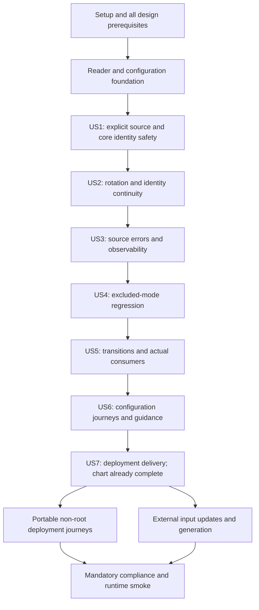

# Tasks: Explicit OAuth2 Credential Sources

**Input**: Design documents from `specs/051-oauth2-secret-file-overrides/`.

**Generated**: 2026-10-07

**Propagated**: 2026-10-07 — Moved API compatibility and Helm contracts into blocking gates; authored shared regressions before implementation; defined both-source identity checks and legacy transition evidence.

**Propagated**: 2026-10-07 — Add coherent pair acquisition, immutable-target publication, race regressions, and filesystem-only administrative credential omission.

**Prerequisites**: Refined `spec.md` and propagated `plan.md` are authoritative. Supporting research, data model, contracts, and quickstart are current. ADR 038 is Accepted. The user approved Admin API 2.0.0 on existing routes. The actual test-first chart contract and all 50 compiled acceptance expectations are complete, with initial and post-chart semantic-red evidence. Preserve unaffected content and dated supersession records. Do not apply old secret-only or unchanged-API/storage constraints.

**Tests**: The specification explicitly requires one E2E test per numbered scenario. Constitution Principles VIII and XIII require test-first behavior. Write compiled semantic expectations before implementation. Existing stored/excluded controls may already pass; do not manufacture failures. No pending/skipped tests, always-fail expectations, source-text tests, or test-only production APIs. Minimum compile-time declarations may accompany tests where new symbols require them. Record semantic failure, not compiler errors, and finish every behavior in its implementation task. No stub or placeholder can pass a green checkpoint.

**Organization**: Phase 2f authors all 50 acceptance tests before chart or broker behavior. Phase 2b completes the actual chart contract test-first before the final broker implementation gate. T023 and T029–T034 author shared regressions before the configuration/core implementation; later story phases execute those unchanged tests and independent green checkpoints. Do not write a second resolver or source-transition path.

## Format: `[ID] [P?] [Story] Description`

The 80 task markers track execution. `[P]` means eligible for concurrent work only after listed dependencies are complete. A story label appears only in a user-story phase. Every task names target files and immediate prerequisite IDs. A checkpoint is not permission to skip downstream requirements.

## Path Conventions

Paths are relative to this broker checkout unless absolute paths identify the external deployment repository. New reader, error, helper, fixture, and focused test files are intentional implementation targets. Recheck migration 036 and ADR 038 numbering before creating them. ~~Set `SPECIFY_FEATURE_DIRECTORY` because the checkout has no resolvable feature index.~~ `.specify/feature.json` selects this feature. `SPECIFY_FEATURE_DIRECTORY` remains an optional explicit override for local Spec Kit scripts.

The broker is Go 1.27.1 with existing OAuth2, Cobra/Viper, YAML, sqlx, and Unix file APIs. Add no provider SDK or crypto dependency. Use existing `model.Secret` absent/encrypted states and existing JWE authorization state. Keep service-ID token encryption AAD unchanged.

No administrative service-management UI/client exists in the React SPA. Actual consumers are the admin handler, tests, and operator documentation. Phase 2e records this evidence; no consent redesign, new management screen, or frontend screenshot task is required for the current scope.

Before code changes, read nearest repository context and binding ADRs. Reuse current patterns and run language-server references before changing exported symbols. No broad refactoring phase or new-entity boilerplate phase is needed.

---

## Phase 1: Setup (Shared Infrastructure)

**Purpose**: Refresh stale design evidence and runnable verification instructions without production changes.

- [X] T001 Refresh stale decisions for explicit service sources, paired credentials, registration/storage/API changes, three operation boundaries, safe identity association, and 50 scenarios. Retain valid bounded-reader and configuration evidence, reject old binding-driven fallback, and clear staleness only after alignment. Include coherent pair acquisition and immutable-target publication evidence. Files: `specs/051-oauth2-secret-file-overrides/research.md`.

- [X] T002 Replace placeholder registration and old flags with filesystem registration, both paths, source transitions, identity-change checks, 50-case runs, storage integration commands, and synthetic non-root smoke steps. Document feature resolution through `.specify/feature.json` and the optional `SPECIFY_FEATURE_DIRECTORY` override for local Spec Kit scripts. Files: `specs/051-oauth2-secret-file-overrides/quickstart.md`. (depends on T001)

---

## 🔒 Phase 2: Design Preconditions (Blocking Prerequisites) [MANDATORY]

**Purpose**: Domain model, configuration, API, and database design MUST all be complete before implementation.

**⚠️ CRITICAL**: No broker production-code implementation can begin until this entire phase is complete. The actual Helm contract is completed test-first within this phase, only after all acceptance expectations and initial semantic-red evidence.

**🔒 CONSTITUTION REQUIREMENT**: This phase maps directly to the constitution PRECONDITIONS checklist. All sub-phases (2a-2f) MUST be included in every tasks.md, though specific task details should be adapted to the feature.

### Phase 2a: Domain Model & Glossary [MANDATORY]

- [X] T003 Refresh the existing-service model, source-specific absence of inline credentials, pair bindings, source transitions, safe error reasons, and non-secret authorization/session identity. Preserve service UUID/canonical uniqueness and stored/session encryption. Quote retained and refined constraints rather than carrying obsolete placeholder rules. Define exact field/claim names, the CredentialFileReader.ReadClientID(path string) (string, error) and ReadPair(clientIDPath, clientSecretPath string) (clientID, clientSecret string, err error) contracts, and stored/excluded versus filesystem legacy-identity behavior before dependent test/code tasks. Define credential_source_transitioned as a durable internal boolean: false on creation/backfill, true atomically on the first actual source change, never reset. New eligible contexts capture identity in either mode; legacy missing identity is usable only for never-transitioned stored services, not after a round trip. Define target-identity revalidation, no partial pair on error, and the safe generation_changed reason under FR-009. Files: `specs/051-oauth2-secret-file-overrides/data-model.md`. Requirements: FR-009, FR-025. (depends on T002)

- [X] T004 [P] Create proposed ADR 038 for explicit credential sources and the narrow file port. Record the spec clarification of 2026-10-07 as API-scope confirmation. Explicitly supersede ADR 036's ordinary-confidential stored-secret invariant only for selected filesystem mode; preserve its public wire behavior and unrelated update semantics. Obtain acceptance before production behavior and recheck numbering before creation. Files: `adrs/038-oauth2-client-secret-file-overrides.md`. Requirements: DR-005. (depends on T003)

- [X] T005 [P] Document Credential source and its irreversible internal transition evidence, Filesystem credential binding, Operation credentials, Client-identity association, and Credential-source error, their relationships, domain ownership, and three operation boundaries. Files: `ARCHITECTURE.md`. Requirements: DR-005, FR-025. (depends on T003)

### Phase 2b: Configuration Design [MANDATORY]

- [X] T006 [P] Refresh pair-valued third_party_oauth2.credential_files, CLI/environment names, strict YAML/JSON types, exact canonical IDs, CLI > environment > file > default whole-map replacement, explicit {}, and use-time availability. Bindings never select a service source. Files: `specs/051-oauth2-secret-file-overrides/contracts/configuration.md`. Requirements: CR-001, CR-002, CR-003, CR-004, CR-005, CR-006. (depends on T003)

- [X] T007 [P] Refresh credentialFiles chart schema and both zalando-platform paths, explicit filesystem registration without placeholders, existing read-only Secret mount, non-root readability, complete pair publication, identity limits, and input-driven regeneration. Include fresh immutable targets, no retired-target reuse during acquisition, source errors on detected changes, and validated in-flight pair limits. Files: `specs/051-oauth2-secret-file-overrides/contracts/deployment.md`. Requirements: FR-009, CR-007, SR-005, DR-003, DR-004. (depends on T006)

- [X] T008 [P] Add default-empty, single-pair, multiple-pair, environment, and CLI examples. Explain exact canonical matching, explicit service-source selection, and absent-binding fail-closed behavior. Index the examples. Files: `examples/config/third-party-oauth2.yaml`, `examples/config/README.md`. Requirements: DR-001, DR-002. (depends on T006)

- [X] T064 Write semantic-red typed Helm rendering/validation tests for empty defaults, exact pair objects, canonical key spelling, both path fields, invalid pair shapes/types, and intact credential/configuration/tmp mounts. Parse Kubernetes objects and embedded broker YAML rather than source substrings. After all 50 acceptance expectations are authored, run the full feature label for compiled initial semantic-red evidence before any chart or broker implementation. Record initial acceptance and focused Helm failures without skips/placeholders. Files: `tests/integration/helm_chart_test.go`, `specs/051-oauth2-secret-file-overrides/quickstart.md`. Requirements: CR-007, DR-004. (depends on T007, T014, T015, T016, T017, T018, T019, T020)

- [X] T065 Add broker.thirdPartyOauth2.credentialFiles with default {} and existing -- value comments; require both string paths in the schema and render only non-empty third_party_oauth2.credential_files. Preserve existing extraVolumes/extraVolumeMounts and all mounts. Update README source-selection, pair, and non-root/read-only-directory guidance together. Complete the actual Helm contract inside Phase 2b after T064 semantic-red evidence and before the T021 broker implementation gate. Files: `charts/agentic-identity-broker/values.yaml`, `charts/agentic-identity-broker/values.schema.json`, `charts/agentic-identity-broker/templates/configmap.yaml`, `charts/agentic-identity-broker/README.md`. Requirements: CR-007, SR-005, DR-003, DR-004. (depends on T064)

### Phase 2c: API Design [MANDATORY]

- [X] T009 [P] Refresh initiation/client-ID-only and exchange/refresh/both-file contracts, identity binding and mismatch handling, source/provider error categories, generic responses, no metadata reads, and credential-free events. Preserve auth-style negotiation, retry policy, locking, and singleflight. Specify identity comparison in both eligible source modes after transitions, matching-ID continuity, and legacy missing-ID refusal whenever filesystem or the durable transition marker applies. Specify one ReadPair per exchange/refresh attempt, target-change refusal without acquisition retries, and permitted post-validation publication. Files: `specs/051-oauth2-secret-file-overrides/contracts/outbound-authentication.md`. Requirements: FR-005, FR-009, FR-017, FR-018, FR-019, FR-020, FR-025. (depends on T003)

- [X] T010 [P] Define the stored/filesystem selector, stored creation default, update omission preservation, unknown/mixed-source rejection, filesystem credential omission, source transitions, and excluded-mode validation. Preserve stored response redaction and unrelated/end-user errors. Record confirmation of concrete contract shapes under the requested spec scope before implementation. Treat filesystem omission of the currently required response client_id as a contract change. Record release status and resolve/confirm the versioning decision here: a released contract requires a major version bump or new endpoint and breaking-change documentation before implementation. Do not defer this decision to T071. Files: `api/admin/openapi.yaml`, `ARCHITECTURE.md`, `docs/changelog.md`. Requirements: FR-021, FR-022, FR-023, FR-024, FR-017, DR-005. (depends on T004, T009)

### Phase 2d: Database Design [MANDATORY]

- [X] T011 [P] Finalize migration 036 source/default/backfill, source-specific SQL NULL inline credentials, atomic transitions, separate nullable upstream session identity, and guarded rollback. Never infer a legacy established identity from current files or provider credentials. Document compatible UP/DOWN/reapply, incompatible DOWN refusal/dirty-state recovery, and data integrity; recheck sequence after 035 before creating files. Design the false-default/backfilled, irreversible credential_source_transitioned marker and its atomic persistence with source changes; legacy missing-identity contexts cannot become valid again after returning to stored. Files: `specs/051-oauth2-secret-file-overrides/data-model.md`. Requirements: FR-016, FR-021, FR-023, FR-024, FR-025. (depends on T003, T004)

### Phase 2e: Frontend/Design System Review [MANDATORY IF FRONTEND]

**Applicability**: Record the existing consumer inventory and evidenced lack of management UI. Principles XI/XIII apply only if actual UI scope changes.

- [X] T012 Record the evidenced consumer inventory: admin DTOs/handler, existing admin E2E callers, and the operator service-management guide. Confirm web/App and consent API/types contain no administrative service-management UI/client. Mark Phase 2e frontend design/Playwright/screenshots not applicable; do not add a screen or alter consent DTOs. Files: `specs/051-oauth2-secret-file-overrides/plan.md`, `web/src/App.tsx`, `web/src/services/api/consent.ts`, `web/src/types/consent.ts`. Requirements: FR-024, DR-005. (depends on T010)

### Phase 2f: E2E Acceptance Test Design [MANDATORY]

Use Ginkgo/Gomega production Builder, isolated fixtures, dual servers, actual source configuration, and real provider protocol observations. US4/US5 share one boundaries file and therefore serialize their authoring tasks.

- [X] T013 Extend deterministic filesystem service/pair fixtures and reused complete connect/refresh/provider-capture helpers. Use fresh storage/files/ports/logs per scenario and production Builder with separate admin/end-user servers. Support real loader, CLI, dropped-privilege process, readiness deadlines, and atomic projected-volume generations without production test-only APIs. Files: `tests/e2e/fixtures/services.go`, `tests/e2e/fixtures/config.go`, `tests/e2e/helpers/oauth2_credential_journey.go`, `tests/e2e/bootstrap/credential_process.go`, `justfile`. Requirements: SR-005. (depends on T012, T007, T008, T011, T005)

- [X] T014 [P] Write 9 isolated Ginkgo It() journeys for stored controls with/without bindings, file client ID in redirects and exchanges, current refresh credentials, exact/isolation matching, source-aware registration/reads, missing bindings, and mixed-source rejection. Give each It() its exact US1-S identifier and adjacent spec comment, with Label("oauth2-secret-file-overrides"). Use one It() per numbered scenario; provider protocol observations are separate from selection events. Files: `tests/e2e/oauth2_secret_file_selection_test.go`. (depends on T013)

- [X] T015 [P] Write 5 isolated Ginkgo It() journeys for same-ID secret rotation without writes/restarts, isolation, projected symlink generation changes, normalization of both files, and A-to-B client identity blocking old codes/sessions while new connections use B. Give each It() its exact US2-S identifier and adjacent spec comment, with Label("oauth2-secret-file-overrides"). Use one It() per numbered scenario; provider protocol observations are separate from selection events. Require coherent provider pairs across the projected-volume generation journey. Files: `tests/e2e/oauth2_secret_file_rotation_test.go`. (depends on T013)

- [X] T016 [P] Write 12 isolated Ginkgo It() journeys for each required file independently for scenarios 1–8 and 10–12, missing/unreadable/empty/whitespace/broken-symlink sources, loss/restart/recovery, safe category/events/generic responses versus provider rejection, directories/FIFOs/sockets/devices, and oversize rejection. Give each It() its exact US3-S identifier and adjacent spec comment, with Label("oauth2-secret-file-overrides"). Use one It() per numbered scenario; provider protocol observations are separate from selection events. Files: `tests/e2e/oauth2_secret_file_failures_test.go`. (depends on T013)

- [X] T017 [P] Write 4 isolated Ginkgo It() journeys for real public secretless, CIMD private_key_jwt, and Google connect/renew journeys ignoring unavailable bindings, plus filesystem registration/update rejection for each excluded mode. Give each It() its exact US4-S identifier and adjacent spec comment, with Label("oauth2-secret-file-overrides"). Use one It() per numbered scenario; provider protocol observations are separate from selection events. Files: `tests/e2e/oauth2_secret_file_boundaries_test.go`. (depends on T013)

- [X] T018 Write 8 isolated Ginkgo It() journeys for source-specific persisted/admin representations, outage-safe read/update/consent/session metadata, client-ID-only initiation, no disclosure, both atomic source transitions with matching/mismatched/missing established code and session identities (including a legacy source round trip), omitted-source updates, and legacy upgrade. Give each It() its exact US5-S identifier and adjacent spec comment, with Label("oauth2-secret-file-overrides"). Use one It() per numbered scenario; provider protocol observations are separate from selection events. Files: `tests/e2e/oauth2_secret_file_boundaries_test.go`. (depends on T013, T017)

- [X] T019 [P] Write 9 isolated Ginkgo It() journeys for real YAML/environment/CLI startup, independent pairs, whole-map precedence and winning {}, invalid canonical IDs and either path, available startup with unavailable files, unknown-ID no-registration behavior, and filesystem canonical-ID clearing/reassignment. Give each It() its exact US6-S identifier and adjacent spec comment, with Label("oauth2-secret-file-overrides"). Use one It() per numbered scenario; provider protocol observations are separate from selection events. Files: `tests/e2e/oauth2_secret_file_configuration_test.go`. (depends on T013)

- [X] T020 [P] Write 3 isolated Ginkgo It() journeys for real chart rendering with default omission and all existing mount classes, non-root connect/renew after secret rotation, and exact portable target pair with explicit filesystem registration. Give each It() its exact US7-S identifier and adjacent spec comment, with Label("oauth2-secret-file-overrides"). Use one It() per numbered scenario; provider protocol observations are separate from selection events. Files: `tests/e2e/oauth2_secret_file_deployment_test.go`. (depends on T013)

- [X] T021 Rerun the 50-scenario feature label after T064 initial semantic-red evidence and T065 chart completion, recording remaining broker semantic failures before broker production implementation. Existing stored/excluded controls may already pass. Require compiled assertions, no pending/skipped/always-fail cases, complete source-contract/design approval, and no stale supporting artifact. Document evidence and any applicable frontend decision. Require actual Helm values/schema/templates/README and the confirmed API compatibility/versioning decision at this gate. Chart-only checks may now pass; retain the original red evidence rather than manufacture failures. Files: `specs/051-oauth2-secret-file-overrides/quickstart.md`. Requirements: DR-005. (depends on T014, T015, T016, T017, T018, T019, T020, T010, T004, T005, T011, T065)

**Checkpoint**: T021 proves all design prerequisites and semantic-red acceptance evidence before foundation implementation.

---

## Phase 2.5: Foundational Infrastructure

**Purpose**: Provide the shared bounded reader and strict operator configuration required by every filesystem journey.

- [X] T022 [P] Write semantic-red real-I/O tests for the shared reader: "At most 65,536 bytes before whitespace removal", exact-limit success/growth rejection, symlink replacement, normalization/internal characters, empty values, non-regular prompt failures, permissions, descriptor closure, and credential-free errors. Test the production reader and its acquisition stages with real I/O, not OS mocks or test-only production APIs. Add deterministic target replacement between pair opens, reads, and revalidation through production internal stages with real files. Require generation_changed, no partial credentials, descriptor closure, and current-pair recovery on the next acquisition. Files: `internal/adapters/credentialfile/reader_test.go`. Requirements: FR-009, FR-010, FR-011, FR-014, SR-002. (depends on T021)

- [X] T023 [P] Write semantic-red loader/validator tests for pair objects through all sources, strict types/missing fields, whole-map precedence/{}, case/dotted keys, canonical validation, absolute paths, absent-file startup, and safe renamed-key diagnostics. Retain "1–128 letters, digits, `.`, `_`, or `-`, excluding UUID-shaped strings" and "Non-empty, not whitespace-only, and absolute on the broker platform". Also author the real loader/CLI runtime regressions later executed by T060, covering unknown-ID no-registration and unused/unavailable bindings without startup file access, before T026/T027. Files: `internal/config/credential_files_test.go`, `cmd/agentic-identity-broker/credential_files_test.go`, `internal/config/credential_files_runtime_test.go`. Requirements: CR-001, CR-002, CR-003, CR-004, CR-005, FR-002, FR-003, FR-008, CR-006. (depends on T021)

- [X] T024 Define CredentialFileReader.ReadClientID(path string) (string, error) and ReadPair(clientIDPath, clientSecretPath string) (clientID, clientSecret string, err error) and the credential-source error category with closed non-secret reasons, including missing binding, identity mismatch, and generation_changed. ReadClientID never accesses a secret path. ReadPair returns neither value on error. Return safe domain errors without raw PathError chains. Add no provider framework, crypto, or test-only API. Files: `internal/ports/credential_file.go`, `internal/domain/model/credential_source_error.go`. Requirements: FR-005, FR-006, FR-009, FR-020, SR-001, SR-002. (depends on T022)

- [X] T025 [P] Implement fresh non-blocking read-only opens for Linux/Darwin, current symlink following, descriptor regular-file/size checks, a 65,537-byte bounded read, TrimSpace, non-empty result, and closure on every path. Honor "No cross-operation cache, retained descriptor, or last-known value". Pass the real-I/O tests. ReadPair opens both targets before reading and revalidates both configured paths with os.SameFile against their opened descriptors. Retain descriptors through validation, then close both before return. Detected changes return generation_changed without partial values or acquisition retries. Reuse bounded-read logic for ReadClientID without secret access. Files: `internal/adapters/credentialfile/reader.go`. Requirements: FR-009, FR-010, FR-011, FR-012, FR-014. (depends on T024)

- [X] T026 [P] Add typed CredentialFiles pair configuration and strict source-aware decode/validation in the existing Loader. Keep literal canonical key case/dots, whole-map replacement and winning {}, existing YAML expansion, and no startup file/registration access. Reject malformed or missing pair fields without leaking input. Files: `internal/ports/config.go`, `internal/config/loader.go`, `internal/config/validator.go`, `internal/config/redactor.go`. Requirements: FR-002, FR-003, FR-004, FR-008, CR-001, CR-002, CR-003, CR-004, CR-005, CR-006. (depends on T023, T024)

- [X] T027 Register --third_party_oauth2.credential_files and its JSON-string default/description through real Cobra/Viper environment binding for IDENTITY_BROKER_THIRD_PARTY_OAUTH2_CREDENTIAL_FILES. Pass real-process source-resolution tests; no old-name alias. Files: `cmd/agentic-identity-broker/root.go`. Requirements: CR-001, CR-002. (depends on T026)

- [X] T028 Construct and inject the bounded file reader and immutable pair configuration only through Builder into the existing session domain. Update production-bootstrap wrappers as required, never handlers/routing or direct scenario wiring. Run focused config/reader checks after integration. Files: `internal/app/builder.go`, `internal/domain/oauth2session/service.go`, `tests/e2e/bootstrap/server_factory.go`. Requirements: FR-005, CR-005. (depends on T025, T027)

**Checkpoint**: T028 integrates the shared reader and strict configuration. Source selection and domain/API/storage behavior remain in the story tasks.

---

## Phase 3: User Story 1 - Explicitly select a credential source (Priority: P1)

**Purpose**: Register explicit source modes and complete stored/filesystem authorization and renewal without placeholders.

**Independent Test**: Register a filesystem service without inline fields; configure both paths; connect and refresh; observe correct provider credentials and source-aware administrative reads. Repeat stored controls with a matching binding.

### Tests for User Story 1 [MANDATORY - Principle VIII]

Write focused expectations first and observe semantic failure for new behavior. Acceptance tests already exist from Phase 2f.

- [X] T029 [P] [US1] Write semantic-red source invariants for stored default, enum rejection, filesystem canonical-ID requirement and absent inline values, mixed-source rejection, and unchanged excluded-mode predicates. Assert through production validation, not field copying. Cover false-default source-transition evidence and preservation on no-op source selections. Files: `internal/domain/model/credential_source_test.go`. Requirements: FR-007, FR-021, FR-022, FR-025. (depends on T028)

- [X] T030 [P] [US1] Write semantic-red registration/update tests for filesystem creation without placeholders, explicit stored validation, omitted-source preservation, rejection without file access or mutation, and stored-versus-filesystem selection. Include configured-binding stored controls. Before T035/T040, author the shared atomic-transition/CAS/credential-erasure regressions later run by T055, excluded registration/update regressions later run by T052, and canonical clearing/reassignment regressions later run by T061. Assert an irreversible transition marker, no-op/metadata preservation, encrypted reverse credentials, and zero file imports. Files: `internal/domain/thirdparty/credential_source_test.go`, `internal/domain/thirdparty/credential_source_transitions_test.go`, `internal/domain/thirdparty/credential_source_exclusions_test.go`, `internal/domain/thirdparty/credential_source_canonical_id_test.go`. Requirements: FR-001, FR-006, FR-008, FR-021, FR-022, FR-002, FR-003, FR-007, FR-023, FR-025, SR-003, SR-004, CR-005, CR-006. (depends on T028)

- [X] T031 [P] [US1] Write black-box administrative create/read/update contract tests for source reporting, filesystem omission of both inline credential fields, no paths/values, and unchanged stored client ID/REDACTED behavior. Exercise valid and invalid inputs against the approved OpenAPI. Also author semantic-red metadata-outage/disclosure regressions later executed by T057 before the handler/authentication implementations; cover both file outages, secret-independent initiation, and credential-free logs/errors/events/diagnostics. Files: `tests/integration/service_credential_source_api_test.go`, `tests/integration/credential_source_metadata_test.go`. Requirements: FR-017, FR-021, FR-022, FR-024, FR-018, SR-002. (depends on T028)

- [X] T032 [P] [US1] Write real-PostgreSQL migration/repository regression tests and in-memory contract tests for legacy stored backfill, source round-trips, absent filesystem credentials, constraint failures, optimistic concurrency, and encrypted stored credentials. Demonstrate failure before migrations/storage changes; use production migration harness. Before T036–T040, also author both-store transition/session-identity regressions later run by T056: atomic marker/credential updates, marker persistence across a source round trip and CAS rollback, unchanged identity associations, no rotation writes, compatible DOWN/reapply, and guarded incompatible rollback. Files: `tests/integration/migrations/credential_source_migration_test.go`, `tests/integration/storage/infra/credential_source_repository_test.go`, `internal/adapters/storage/memory/credential_source_test.go`, `tests/integration/storage/infra/credential_source_transitions_test.go`, `internal/adapters/storage/memory/credential_source_transitions_test.go`. Requirements: FR-021, FR-022, FR-024, FR-016, FR-023, FR-025, SR-003. (depends on T028)

- [X] T033 [P] [US1] Write semantic-red initiation/exchange/refresh selection tests with stored bindings ignored, exact pair/isolation lookup, missing-binding fail-closed behavior, and client-ID-only initiation. Verify sealed identity and session identity persistence through callback/refresh, without file values entering service records or metadata. Before T039/T041, author the shared fresh-read/retry/rotation tests later run by T044, identity tests later run by T045, and excluded-mode authentication tests later run by T053. Capture new eligible stored and filesystem identities; assert matching continuity and mismatched/missing-identity refusal across both source transitions and legacy round trips. Preserve the never-transitioned legacy stored exception and real public/CIMD/Google behavior. Also author deterministic acquisition-error and post-validation publication regressions later run by T044 before T041. Assert zero provider requests on generation_changed during callback and refresh, including automatic refresh. Keep only a validated operation-local pair after later publication, subject to the established-identity check. Files: `internal/domain/oauth2session/credential_selection_test.go`, `internal/domain/oauth2session/state_token_security_test.go`, `internal/adapters/storage/memory/user_session_test.go`, `internal/domain/oauth2session/credential_rotation_test.go`, `internal/domain/oauth2session/credential_identity_test.go`, `internal/domain/oauth2session/credential_exclusions_test.go`. Requirements: FR-001, FR-002, FR-003, FR-004, FR-005, FR-006, FR-015, FR-016, FR-025, FR-007, FR-009, FR-013, FR-014, SR-004. (depends on T028)

- [X] T034 [P] [US1] Write semantic-red handler contract tests for presence-aware source omission versus explicit values, filesystem rejection of either supplied inline field (including null/empty), source preservation on PUT, and get/list/create/update response omission. Keep business/source-transition invariants in the domain and stored client ID/REDACTED behavior unchanged. Files: `internal/adapters/http/handlers/admin/services_handler_test.go`. Requirements: FR-017, FR-021, FR-022, FR-024. (depends on T028)

### Implementation for User Story 1

- [X] T035 [US1] Add the explicit source choice and source-specific outbound/registration validation to the existing service entity. Default omitted creation to stored, preserve omitted update, reject unknown source and either inline credential in filesystem mode, and retain "Comparison is case-sensitive" for canonical matching. Add the internal false-default credential_source_transitioned marker without exposing it through the administrative contract. Files: `internal/domain/model/thirdparty_oauth2_provider.go`. Requirements: FR-002, FR-003, FR-007, FR-021, FR-022, FR-025. (depends on T029, T030)

- [X] T036 [US1] Create migration 036 for stored-default/backfilled source, nullable filesystem client ID, source/auth-mode/canonical-ID credential constraints, and nullable upstream client-identity association on user sessions. Never infer a legacy established identity from current files/provider credentials. Guard DOWN against incompatible filesystem rows rather than deleting/coercing them; verify compatible rollback/reapply and refusal data integrity. Include a false-default/backfilled credential_source_transitioned column for durable source history; rollback must not silently discard evidence while any legacy missing-identity contexts could be reused. Files: `migrations/036_add_oauth2_credential_source_and_client_identity.up.sql`, `migrations/036_add_oauth2_credential_source_and_client_identity.down.sql`. Requirements: FR-021, FR-022, FR-024, FR-025, FR-023. (depends on T032, T035)

- [X] T037 [P] [US1] Persist source and source-specific zero/absent inline fields in the memory provider record and repository. Preserve exact canonical/resource indexes, version checks, and atomic updates; never synthesize an encrypted placeholder. Maintain stored/public/CIMD behavior. Persist the internal transition marker and preserve it across metadata updates and a return to stored. Files: `internal/adapters/storage/memory/thirdparty_provider.go`, `internal/adapters/storage/memory/thirdparty_provider_record.go`. Requirements: FR-021, FR-022, FR-024, FR-023, FR-025. (depends on T036)

- [X] T038 [P] [US1] Update provider column projections, inserts, scans, record conversion, and transactional/CAS updates to persist source and SQL NULL filesystem credentials. Preserve protected-resource transactions, canonical uniqueness, sqlx/domain storage errors, and encrypted stored secrets. Persist credential_source_transitioned in all provider projections/writes and atomically preserve/set it with CAS source transitions. Files: `internal/adapters/storage/postgres/thirdparty_provider.go`, `internal/adapters/storage/postgres/thirdparty_provider_record.go`. Requirements: FR-021, FR-022, FR-024, FR-023, FR-025. (depends on T036)

- [X] T039 [P] [US1] Add a separate non-secret upstream client-ID association to UserSession and both session stores, including upsert and locked refresh copies/updates. Legacy missing associations remain representable; new eligible stored and filesystem sessions require the sealed initiating identity. Preserve service-ID-only encryption AAD and token encryption. Files: `internal/domain/storage/user_session.go`, `internal/adapters/storage/memory/user_session.go`, `internal/adapters/storage/postgres/user_session.go`. Requirements: FR-016, FR-024, FR-025. (depends on T036, T033)

- [X] T040 [US1] Enforce source-specific create/update invariants in the existing third-party domain, default creation/preserve update source, and reject mixed sources/canonical clearing/excluded filesystem modes without reads. Encrypt only stored credentials. Perform atomic stored-credential removal for explicit filesystem transition and require explicit credentials for the reverse; preserve version/concurrency semantics. Set credential_source_transitioned to true atomically whenever source actually changes and never reset it. No-op selections/unrelated updates preserve the marker. Never rewrite existing authorization/session identities. Files: `internal/domain/thirdparty/service.go`. Requirements: FR-007, FR-008, FR-021, FR-022, FR-023, SR-003, FR-025. (depends on T037, T038)

- [X] T041 [P] [US1] Integrate one explicit source-selection path: stored/excluded modes never read files; filesystem requires exact canonical pair. Filesystem initiation calls ReadClientID only. Seal the selected identity for both eligible modes in existing JWE state. Each filesystem exchange/refresh attempt calls ReadPair once for a coherent pair. Stored mode uses stored credentials without file access. Compare selected and established identities in either mode before provider authentication, including after either transition. Matching identities may continue; mismatches require a new connection. Carry verified identity into session creation. Permit legacy missing identity only for stored services whose credential_source_transitioned marker is false; filesystem or any prior transition requires reconnect, including return to stored. Preserve negotiation/retry/concurrency behavior. Abort detected generation changes before provider requests, without an acquisition retry or last-known pair. Permit only the already validated operation-local pair after later publication. Files: `internal/domain/oauth2session/service.go`, `internal/domain/oauth2session/state_token.go`. Requirements: FR-001, FR-002, FR-003, FR-004, FR-005, FR-006, FR-009, FR-015, FR-016, FR-025. (depends on T040, T039)

- [X] T042 [P] [US1] Extend ServiceRequest/ServiceResponse and existing JSON-presence handling for the selector and inline fields. Preserve omitted-update source without file access, reject mixed input through domain validation, report source on all CRUD response projections, and omit both filesystem credential fields. Expose no path, imported file value, synthetic REDACTED, or internal transition marker. Follow the version/endpoint shape confirmed by T010; add no unrelated API route. Files: `internal/adapters/http/handlers/admin/services_handler.go`. Requirements: FR-017, FR-021, FR-022, FR-024. (depends on T040, T034, T031, T010)

### Verification for User Story 1

- [X] T043 [US1] Run US1-S1–S9 and focused model/domain/handler/storage contracts through real dual servers and PostgreSQL where required. Complete stored and filesystem connect/refresh journeys, observe file client ID/secret at the synthetic provider, and confirm exact isolation, no placeholder/service writes, missing-binding failure, and mixed-source rejection. Run just check after this integrated Go change. Files: `tests/e2e/oauth2_secret_file_selection_test.go`, `tests/integration/service_credential_source_api_test.go`, `justfile`. Requirements: FR-001, FR-002, FR-003, FR-004, FR-005, FR-006, FR-015, FR-017, FR-021, FR-022, FR-024. (depends on T041, T042)

**Checkpoint**: Complete T043 with the story independently passing. This is an incremental validation checkpoint, not a reduction of the required seven-story delivery.

---

## Phase 4: User Story 2 - Observe rotation without operational updates (Priority: P1)

**Purpose**: Observe current file values after complete publication while preventing cross-client code/session authentication.

**Independent Test**: Rotate a secret with the same client ID and connect/refresh without restart or service writes. Change client ID A to B; new authorization uses B, while A-associated code/session operations send zero authentication requests.

### Tests for User Story 2 [MANDATORY - Principle VIII]

Focused rotation and identity regressions were authored in T033 before T041. Run unchanged expectations here; do not demand a new red failure or rewrite tests to match the implementation.

- [X] T044 [P] [US2] Run the unchanged operation-level regressions authored in T033 for fresh file reads on every broker retry/actual refresh, same-client secret rotation, projected generations, and independent services. Compare provider request credentials and service-record snapshots, not resolver forwarding. Include detected acquisition races and post-validation publication. Files: `internal/domain/oauth2session/credential_rotation_test.go`. Requirements: FR-009, FR-013, FR-014, FR-015, FR-016. (depends on T043)

- [X] T045 [P] [US2] Run the unchanged identity regressions authored in T033: new initiation uses B, old code and session operations stop before provider authentication, both source-transition directions enforce established identity and legacy missing identity requires reconnect for filesystem or any previously transitioned service, including return to stored, and neither file secrets nor inferred identities persist. Files: `internal/domain/oauth2session/credential_identity_test.go`. Requirements: FR-025. (depends on T043)

### Verification for User Story 2

- [X] T046 [US2] Run US2-S1–S5 journeys and focused rotation regressions with atomic symlink generation replacement and provider request capture. Verify both normalized file values, no cross-service substitution, no cached descriptor/value, zero restart/registration/rotation writes, and safe old-code/session identity handling. The reader and identity implementation is shared with US1; fix actual failures there without a second resolver. Run the unchanged deterministic reader interleavings from T022. Require coherent provider pairs, zero requests on acquisition errors, and fresh acquisition after recovery. Files: `tests/e2e/oauth2_secret_file_rotation_test.go`, `internal/domain/oauth2session/credential_rotation_test.go`, `internal/adapters/credentialfile/reader_test.go`. Requirements: FR-009, FR-010, FR-013, FR-014, FR-015, FR-016, FR-025. (depends on T044, T045)

**Checkpoint**: Complete T046 with the story independently passing. This is an incremental validation checkpoint, not a reduction of the required seven-story delivery.

---

## Phase 5: User Story 3 - Reject unavailable mandatory credentials (Priority: P1)

**Purpose**: Fail closed on every required-source problem and distinguish source errors from provider rejection without disclosure.

**Independent Test**: Make each required file independently unusable; observe generic caller errors, distinct safe source events, zero provider requests, no fallback, and recovery on the next operation.

### Tests for User Story 3 [MANDATORY - Principle VIII]

Write focused expectations first and observe semantic failure for new behavior. Acceptance tests already exist from Phase 2f.

- [X] T047 [P] [US3] Write semantic-red source-error propagation tests across initiation/callback, explicit refresh, and automatic token-exchange refresh. Distinguish source failures/missing bindings/identity mismatch from provider rejection; preserve generic errors and reject stored/last-known fallback before provider authentication. Files: `internal/domain/oauth2session/credential_source_errors_test.go`. Requirements: FR-006, FR-012, FR-020, SR-001. (depends on T046)

- [X] T048 [P] [US3] Write semantic-red token-exchange classification and safe-event tests for successful filesystem selection versus failed source versus usable-credential provider rejection. Assert service UUID, operation, outcome/reason, unchanged server_error/provider responses, and no file values, paths, raw OS/provider payloads, or secret-bearing requests. Files: `internal/domain/tokenexchange/credential_source_classification_test.go`. Requirements: FR-019, FR-020, SR-002. (depends on T046)

### Implementation for User Story 3

- [X] T049 [US3] Preserve credential-source categories through refreshSessionTokens and callback/provider/PKCE classification without ErrRefreshFailed/RefreshRejectedError wrapping. Emit safe source-selection/failure/provider-rejection events for all applicable operations. Keep callback_failed, session 500 internal_error, initiation generic internal error, and existing provider rejection responses. Files: `internal/domain/oauth2session/service.go`, `internal/domain/oauth2session/errors.go`. Requirements: FR-006, FR-012, FR-019, FR-020, SR-001, SR-002. (depends on T047, T048)

- [X] T050 [US3] Classify the shared source-unavailable category distinctly in existing token-exchange telemetry while preserving 500 server_error without source detail and unchanged provider rejection/expiry classifications. Reuse existing logging/span mechanism; add no new telemetry framework or API fields. Files: `internal/domain/tokenexchange/service.go`. Requirements: FR-019, FR-020, SR-002. (depends on T049)

### Verification for User Story 3

- [X] T051 [US3] Run US3-S1–S12 with each file independently for required cases, real non-root permission denial, bounded non-regular tests, first-use/restart/loss/recovery, and provider rejection comparison. Require zero new provider requests on source failures, no fallback, generic HTTP results, safe events, and current-value recovery without restart. Files: `tests/e2e/oauth2_secret_file_failures_test.go`, `internal/adapters/credentialfile/reader_test.go`. Requirements: FR-006, FR-011, FR-012, FR-013, FR-014, FR-019, FR-020, SR-001, SR-002. (depends on T050)

**Checkpoint**: Complete T051 with the story independently passing. This is an incremental validation checkpoint, not a reduction of the required seven-story delivery.

---

## Phase 6: User Story 4 - Preserve excluded authentication modes (Priority: P1)

**Purpose**: Preserve public, CIMD confidential, Google, and stored-source behavior; reject unsupported filesystem selection.

**Independent Test**: Configure unusable bindings and complete public, real CIMD-assertion, and Google journeys unchanged. Reject filesystem registration/updates without file reads or record mutation.

### Tests for User Story 4 [MANDATORY - Principle VIII]

Focused exclusion regressions were authored in T030/T033 before core validation/authentication behavior. Run unchanged expectations here; existing-mode controls may already pass.

- [X] T052 [P] [US4] Run unchanged regressions authored in T030 for rejected filesystem creation/update for public, private_key_jwt CIMD, and Google services, preserving encrypted/public/CIMD state and record version. Confirm no file read even with unavailable bindings. Existing exclusion enforcement is shared with US1, not a second eligibility policy. Files: `internal/domain/thirdparty/credential_source_exclusions_test.go`. Requirements: FR-007, SR-004. (depends on T051)

- [X] T053 [P] [US4] Run unchanged regressions authored in T033 for excluded connect/refresh operations and stored services with matching unavailable bindings through existing production authentication paths. Validate real signed CIMD assertions and public secretless forms; ensure actual Google-flavor selection, no reader access, and preserved security behavior. Files: `internal/domain/oauth2session/credential_exclusions_test.go`. Requirements: FR-001, FR-007, SR-004. (depends on T051)

### Verification for User Story 4

- [X] T054 [US4] Run US4-S1–S4 alongside existing public/CIMD/Google journey regressions and stored-source controls. Require unchanged provider authentication and invalid filesystem updates leaving the service untouched. Files: `tests/e2e/oauth2_secret_file_boundaries_test.go`, `tests/e2e/thirdparty_public_client_test.go`, `tests/e2e/thirdparty_cimd_authentication_test.go`. Requirements: FR-001, FR-007, SR-004. (depends on T052, T053)

**Checkpoint**: Complete T054 with the story independently passing. This is an incremental validation checkpoint, not a reduction of the required seven-story delivery.

---

## Phase 7: User Story 5 - Expose the source without exposing credentials (Priority: P1)

**Purpose**: Expose source metadata and atomically manage transitions without resolving or persisting file credentials.

**Independent Test**: Read and transition both modes through the API, inspect persisted records, and repeat metadata operations during outages. Require atomic credential erasure, explicit reverse credentials, preserved omitted-source updates, and upgrade compatibility.

### Tests for User Story 5 [MANDATORY - Principle VIII]

Focused transition, persistence, and metadata regressions were authored in T030–T033 before their shared implementations. Run unchanged expectations here, including both-source identity and legacy round-trip checks.

- [X] T055 [P] [US5] Run unchanged source-transition regressions authored in T030 for atomic removal of client ID/secret, failed update/CAS preserving old state, explicit reverse credentials, omitted-source metadata updates, and binding removal never restoring stored mode. Neither direction reads/imports files; stored credentials remain encrypted. Verify durable transition evidence is set atomically, never reset by a round trip, and preserved by no-op selections and unrelated updates. Files: `internal/domain/thirdparty/credential_source_transitions_test.go`. Requirements: FR-021, FR-022, FR-023, SR-003, FR-025. (depends on T054)

- [X] T056 [P] [US5] Run unchanged regressions authored in T032 for source transitions and identity association against both stores: successful credential erasure, rejection/CAS/transaction rollback integrity, persisted source/NULL fields, no file-secret writes, no rotation-related service mutation, legacy upgrade compatibility, and compatible DOWN/reapply plus guarded incompatible DOWN. Verify marker persistence across both transitions and rollback without rewriting established identities. Files: `tests/integration/storage/infra/credential_source_transitions_test.go`, `internal/adapters/storage/memory/credential_source_transitions_test.go`. Requirements: FR-016, FR-021, FR-023, FR-024, FR-025, SR-003. (depends on T054)

- [X] T057 [P] [US5] Run unchanged regressions authored in T031 for administrative and consent/session metadata during both file outages without resolving file values/paths. Check filesystem field omission, stored REDACTED representation, initiating with valid client-ID/unavailable secret, and no synthetic markers in diagnostics/logs/errors/events. Metadata and authentication must not share a file-resolving service read. Files: `tests/integration/credential_source_metadata_test.go`. Requirements: FR-017, FR-018, SR-002. (depends on T054)

### Implementation for User Story 5

- [X] T058 [US5] Update actual administrative consumers: operator curl examples for source-specific create/read/PUT transitions and typed/map-based existing test consumers where the new response contract affects them. Preserve stored callers and redaction controls; omit filesystem inline fields explicitly. There is no web admin consumer, so do not create a management UI or change consent API types. Files: `docs/guides/manage-agents-and-services.md`, `tests/e2e/oauth2_provider_flavor_test.go`. Requirements: FR-017, FR-021, FR-022, FR-023, FR-024, DR-001, DR-005. (depends on T055, T056, T057)

### Verification for User Story 5

- [X] T059 [US5] Run US5-S1–S8 with both storage transition tests and metadata-outage journeys. Verify selected-source persistence, atomically absent filesystem service credentials, explicit reverse input, no imported file values, no file-resolving reads, safe events/diagnostics, omitted-source update preservation, and unchanged legacy authentication. Reuse the source-transition implementation from US1 rather than introducing an alternative mutation path. Exercise both source transitions with matching, mismatched, and missing established code/session identities; require zero provider requests for mismatches and legacy round-trip reuse. Files: `tests/e2e/oauth2_secret_file_boundaries_test.go`, `tests/integration/credential_source_metadata_test.go`, `tests/integration/storage/infra/credential_source_transitions_test.go`. Requirements: FR-016, FR-017, FR-018, FR-019, FR-021, FR-022, FR-023, FR-024, SR-002, SR-003, FR-025. (depends on T058)

**Checkpoint**: Complete T059 with the story independently passing. This is an incremental validation checkpoint, not a reduction of the required seven-story delivery.

---

## Phase 8: User Story 6 - Configure bindings through existing sources (Priority: P1)

**Purpose**: Configure exact pair bindings through existing sources while preserving service-owned source selection.

**Independent Test**: Start the actual broker through YAML, environment, and CLI sources; connect using each selected pair. Demonstrate whole-map/empty precedence, pre-listener validation, unknown-ID no side effects, and canonical reassignment without fallback.

### Tests for User Story 6 [MANDATORY - Principle VIII]

Focused runtime and canonical-ID regressions were authored in T023/T030 before configuration/core behavior. Run unchanged expectations here rather than adding post-implementation red tests.

- [X] T060 [P] [US6] Run unchanged runtime regressions authored in T023 for actual loader and CLI pair inputs with exact case/dots, invalid IDs, missing/non-string/relative/blank paths, and explicit empty mapping. Prove startup never accesses files or creates/changes services for unused or unknown-ID bindings. Files: `internal/config/credential_files_runtime_test.go`. Requirements: FR-002, FR-003, FR-008, CR-001, CR-002, CR-003, CR-004, CR-005, CR-006. (depends on T059)

- [X] T061 [P] [US6] Run unchanged canonical-ID regressions authored in T030 to verify filesystem canonical-ID clearing is rejected without mutation, reassignment preserves filesystem mode, only the new exact binding is used, and a missing new binding fails closed without file-name or stored-source inference. Files: `internal/domain/thirdparty/credential_source_canonical_id_test.go`. Requirements: FR-002, FR-003, FR-006, CR-005, CR-006. (depends on T059)

### Implementation for User Story 6

- [X] T062 [US6] Document all supported sources and whole-map precedence, default/explicit empty mapping, two required paths, source-specific registration, stored-versus-missing-filesystem behavior, independent bindings, use-time failures, no hot reload/name inference, and binding removal preserving source. Reuse approved examples, never credential values. Explain fresh immutable targets, no retired-target reuse during acquisition, generation_changed source errors, and validated in-flight pair limits. Files: `docs/configuration.md`. Requirements: FR-009, CR-001, CR-002, CR-003, CR-004, CR-005, CR-006, DR-001, DR-002. (depends on T060, T061)

### Verification for User Story 6

- [X] T063 [US6] Run US6-S1–S9 using the production configuration loader and real CLI process, not Builder-only configuration injection. Require startup rejection before listeners for malformed input, startup/metadata availability for unavailable files, unknown-ID no-service creation, and source preservation after canonical-ID/binding changes. Files: `tests/e2e/oauth2_secret_file_configuration_test.go`. Requirements: FR-002, FR-003, FR-008, CR-001, CR-002, CR-003, CR-004, CR-005, CR-006. (depends on T062)

**Checkpoint**: Complete T063 with the story independently passing. This is an incremental validation checkpoint, not a reduction of the required seven-story delivery.

---

## Phase 9: User Story 7 - Deliver readable, rotating files through deployment (Priority: P2)

**Purpose**: Deliver readable rotating pairs using existing mounts, chart inputs, and the real external generation workflow.

**Independent Test**: Render both target paths and existing mounts, then connect/renew using a non-root broker after synthetic rotation. Independently regenerate all actual deployment environments from source inputs.

### Tests for User Story 7 [MANDATORY - Principle VIII]

T064/T065 completed focused Helm red tests and the actual chart contract in Phase 2b before broker implementation. This phase runs the already-authored US7 acceptance journeys and performs external deployment delivery.

### Implementation for User Story 7

- [X] T066 [P] [US7] Update all three source inputs with exactly zalando-platform mapped to /meta/credentials/employee-client-id and /meta/credentials/employee-client-secret. Retain the existing agentic-platform-credentials read-only mount and document explicit filesystem service registration without inline placeholders, non-root permissions, consistent pair publication, and client-ID reconnect limits. Document the immutable-target publication contract, generation_changed acquisition refusal, and permitted use of validated in-flight pairs. Files: `/Users/brennenstuhl/Projects/agentic-identity-broker-deployment/deploy/values/test.yaml`, `/Users/brennenstuhl/Projects/agentic-identity-broker-deployment/deploy/values/prod.yaml`, `/Users/brennenstuhl/Projects/agentic-identity-broker-deployment/deploy/values/sandbox.yaml`, `/Users/brennenstuhl/Projects/agentic-identity-broker-deployment/README.md`. Requirements: FR-009, DR-003, DR-004, SR-005. (depends on T063, T065)

### Integration for User Story 7

- [X] T067 [US7] Run the existing update-k8s-manifests.sh with CHART_REPO_DIR set to this feature-capable chart checkout and a broker image containing the implementation. Regenerate all environments and provenance; do not edit generated outputs as inputs. Parse each output to verify the exact pair and mount preservation. Record generation evidence without real credentials. Files: `/Users/brennenstuhl/Projects/agentic-identity-broker-deployment/scripts/update-k8s-manifests.sh`, `/Users/brennenstuhl/Projects/agentic-identity-broker-deployment/scripts/chart_ref`, `/Users/brennenstuhl/Projects/agentic-identity-broker-deployment/deploy/kubernetes/test/agentic-identity-broker/templates/configmap.yaml`, `/Users/brennenstuhl/Projects/agentic-identity-broker-deployment/deploy/kubernetes/test/agentic-identity-broker/templates/deployment.yaml`, `/Users/brennenstuhl/Projects/agentic-identity-broker-deployment/deploy/kubernetes/prod/agentic-identity-broker/templates/configmap.yaml`, `/Users/brennenstuhl/Projects/agentic-identity-broker-deployment/deploy/kubernetes/prod/agentic-identity-broker/templates/deployment.yaml`, `/Users/brennenstuhl/Projects/agentic-identity-broker-deployment/deploy/kubernetes/sandbox/agentic-identity-broker/templates/configmap.yaml`, `/Users/brennenstuhl/Projects/agentic-identity-broker-deployment/deploy/kubernetes/sandbox/agentic-identity-broker/templates/deployment.yaml`. Requirements: DR-003, DR-004. (depends on T066)

### Verification for User Story 7

- [X] T068 [P] [US7] Run US7-S1–S3 and Helm lint/render checks with portable synthetic fixtures. Exercise a real non-root broker connecting and renewing after rotation using readable directory mounts without credential-file subPath. Keep the default E2E suite independent of the external checkout; actual source generation is a separate delivery check. Files: `tests/e2e/oauth2_secret_file_deployment_test.go`, `tests/integration/helm_chart_test.go`. Requirements: CR-007, SR-005, DR-003, DR-004. (depends on T063, T065)

**Checkpoint**: Complete T068 with the story independently passing. This is an incremental validation checkpoint, not a reduction of the required seven-story delivery.

---

## 🔒 Phase N: Constitution Compliance & Polish [MANDATORY COMPLIANCE SECTION]

**Purpose**: Verify constitution requirements and final polish.

**🔒 CONSTITUTION REQUIREMENT**: This entire section MUST be included in every tasks.md file. The compliance tasks map directly to the constitution Implementation Phase checklist and MUST be completed before considering the feature done.

### 🔒 Constitution Compliance Verification [MANDATORY]

**These tasks MUST be included in every generated tasks.md file. They verify that all constitution principles have been followed.**

#### Design Phase Verification [MANDATORY]

**Constitution Reference**: PRECONDITIONS checklist - verify Phase 2 tasks were completed correctly

- [X] T069 Verify Phase 2 evidence: accepted ADR/requested API confirmation, current domain/glossary and source-specific schema/rollback design, pair examples/index and chart contract, consumer/frontend applicability, all 50 mapped acceptance tests, and semantic-red evidence before production behavior. Confirm no stale authoritative supporting document remains (Principles II, IV, V, VII, VIII, IX, X, XI, XIII). Verify T010 resolved API compatibility/versioning and T064/T065 completed the actual test-first Helm contract before broker code, with shared regressions authored before their implementations. Files: `specs/051-oauth2-secret-file-overrides/plan.md`, `specs/051-oauth2-secret-file-overrides/data-model.md`, `specs/051-oauth2-secret-file-overrides/quickstart.md`, `ARCHITECTURE.md`, `api/admin/openapi.yaml`. (depends on T068, T067)

#### Implementation Phase Verification [MANDATORY]

**Constitution Reference**: Implementation Phase checklist - verify all principles followed during implementation

**API & Documentation**:

- [X] T070 [P] Verify create/update/read behavior matches the confirmed administrative OpenAPI, filesystem omission and stored redaction are correct, unrelated/end-user responses remain unchanged, and all affected consumers migrated without shims. Add rendered end-user API documentation only if its contract actually changed (Principles IV, X). Files: `api/admin/openapi.yaml`, `api/enduser/openapi.yaml`, `docs/configuration.md`. Requirements: FR-017, FR-020, FR-024, DR-001, DR-005. (depends on T069)

**Architecture & Documentation**:

- [X] T071 [P] Align final architecture/glossary, ADR, and supporting design docs with implementation, including source ownership, operation boundaries, identity association, and no path/file-secret persistence. Check accepted ADRs and preserve existing encryption contexts. Include source/API/configuration/rotation changes in the generated release-note/PR changelog; verify the compatibility/versioning decision already confirmed in T010, including applicable major-version/new-endpoint and docs/changelog.md requirements; do not make the first compatibility decision here (Principles II, III, V, X). Files: `ARCHITECTURE.md`, `adrs/038-oauth2-client-secret-file-overrides.md`, `specs/051-oauth2-secret-file-overrides/research.md`, `.github/workflows/release.yml`. Requirements: DR-005, FR-024. (depends on T069)

**Configuration**:

- [X] T072 Verify all new broker settings use existing Loader/Cobra/Viper, strict canonical pair contracts, safe diagnostics, indexed examples, and matching Helm values/schema/templates/README. Confirm no standalone ExtProc own-secret change, file-watch/cache/hot-reload framework, or added mount inputs (Principle VII). Files: `internal/config/loader.go`, `internal/ports/config.go`, `examples/config/third-party-oauth2.yaml`, `examples/config/README.md`, `charts/agentic-identity-broker/values.yaml`. Requirements: CR-001, CR-002, CR-003, CR-004, CR-005, CR-006, CR-007, DR-001, DR-002, DR-004. (depends on T070, T071)

**Database & Persistence**:

- [X] T073 Run real PostgreSQL migration and changed-repository integration tests using production migrations. Prove legacy backfill, compatible UP/DOWN/reapply integrity, guarded incompatible rollback, source/NULL invariants, atomic CAS transitions, session identity persistence, token encryption, and no file-secret imports/writes (Principle IX). Use just test-integration-infra for the matching infra-backed layer. Prove the irreversible transition marker survives both source changes and transaction rollback without reviving legacy missing-identity contexts. Files: `tests/integration/migrations/credential_source_migration_test.go`, `tests/integration/storage/infra/credential_source_repository_test.go`, `tests/integration/storage/infra/credential_source_transitions_test.go`. Requirements: FR-016, FR-021, FR-022, FR-023, FR-024, FR-025, SR-003. (depends on T072)

**Security**:

- [X] T074 Review mandatory-source behavior, no cross-identity auth, safe structured events/errors/diagnostics, excluded security controls, no provider/file-content disclosure, stored-secret/session encryption, and only vetted crypto. Exercise specified edge cases and source/provider categories rather than relying on a field/wiring audit (Principles I, III). Exercise identity comparison in both eligible modes and missing-identity refusal after a source round trip, not only filesystem authentication. Files: `internal/domain/oauth2session/service.go`, `internal/adapters/credentialfile/reader.go`, `internal/domain/tokenexchange/service.go`. Requirements: SR-001, SR-002, SR-003, SR-004, FR-019, FR-020, FR-025. (depends on T073)

**Architecture Patterns**:

- [X] T075 Verify source/transition/eligibility decisions stay in domain services, ports own file/storage contracts, adapters do not cross-import, and construction stays in Builder. Read exported-symbol references and remove only feature-created obsolete call paths/helpers, with no aliases or test-only production APIs (Principles VI, XII). Files: `internal/ports/credential_file.go`, `internal/ports/thirdparty_provider.go`, `internal/domain/thirdparty/service.go`, `internal/app/builder.go`. (depends on T074)

**Testing**:

- [X] T076 Run just check and the focused Go/config/reader/domain/HTTP package checks plus matching self-contained integration checks. Verify meaningful semantic-red/unit evidence, minimal fixture-only expectation changes, deterministic isolated tests, no Bash code-correctness validators, and no pending/no-op/source-text/forwarding-only tests (Principle VIII). Files: `justfile`, `internal/config/credential_files_test.go`, `internal/adapters/credentialfile/reader_test.go`, `tests/integration/service_credential_source_api_test.go`. (depends on T075)

**E2E Acceptance Testing**:

- [X] T077 Run the feature label with Ginkgo --procs=1 and --procs=4, requiring exactly 50 mapped passing It() cases without shared state/pending/skips. Verify hierarchical production-bootstrap journeys and scenario comments, source/provider observations, and red-to-green evidence. Then run the full backend acceptance suite (Principles VIII, XIII). Files: `tests/e2e/oauth2_secret_file_selection_test.go`, `tests/e2e/oauth2_secret_file_rotation_test.go`, `tests/e2e/oauth2_secret_file_failures_test.go`, `tests/e2e/oauth2_secret_file_boundaries_test.go`, `tests/e2e/oauth2_secret_file_configuration_test.go`, `tests/e2e/oauth2_secret_file_deployment_test.go`. (depends on T076)

**Frontend**:

- [X] T078 Verify the recorded absence of an administrative service-management UI/client, and that consent/session/approval visuals and API types remain unchanged. Retain evidenced not-applicable frontend/Playwright/screenshots status. If implementation actually changes a UI surface, first update design/acceptance tasks for tokens, both themes, WCAG and screenshots before proceeding (Principles XI, XIII). Files: `specs/051-oauth2-secret-file-overrides/plan.md`, `web/src/App.tsx`, `web/src/services/api/consent.ts`, `web/src/types/consent.ts`. (depends on T077)

### Additional Polish [CUSTOMIZABLE]

- [X] T079 Run the refreshed synthetic non-root broker smoke guide through real registration/read/update, authorization redirects, callback, explicit/automatic refresh, secret rotation, source loss/recovery, and client-ID mismatch/new connection. Observe provider credentials in the synthetic provider only and verify outage-safe metadata plus atomic source transitions; record actual outputs, not test-pass inference. Smoke both source-transition directions with matching/mismatched established identities and a legacy missing-identity round trip. Files: `specs/051-oauth2-secret-file-overrides/quickstart.md`. Requirements: DR-001, DR-002, DR-003, DR-005. (depends on T078)

- [ ] T080 Run just verify after focused checks, smoke proof, chart lint/render, and external generation. Reconcile all requirement/scenario traceability and release evidence, remove only throwaway smoke scaffolds, and mark delivered tasks complete only when all seven stories and mandatory gates pass. Files: `justfile`, `specs/051-oauth2-secret-file-overrides/tasks.md`, `specs/051-oauth2-secret-file-overrides/quickstart.md`. Requirements: DR-004, DR-005. (depends on T079)

---

## Dependencies & Execution Order

### Phase Dependencies

Setup precedes Design Preconditions. Phase 2f authors all 50 acceptance expectations; then Phase 2b T064 records initial full-suite/focused-Helm red evidence and T065 completes the actual chart contract. T021 closes the API compatibility/design/Helm gate before foundational broker code. T023 and T029–T034 author all shared configuration/core regressions before implementation; later stories execute them unchanged.

Each story begins after the preceding story's green checkpoint. This conservative order protects shared `oauth2session/service.go`, third-party validation, and HTTP DTOs from concurrent ownership. Independent tests and disjoint adapter files use `[P]` tasks. US7's portable verification does not depend on the external checkout or generator; final compliance requires both portable and actual deployment-generation evidence.

### User Story Dependencies

### Within Each User Story

Complete prerequisite IDs before starting a task. Keep tests before behavior, models before services, services before adapter projection, and integration before the story's green checkpoint. Shared source selection, fail-closed identity checks, and transition behavior belong to US1; later stories validate these contracts rather than introduce competing code paths.

### Execution Wave DAG

These waves are computed from every task's explicit prerequisites. Tasks in one wave have disjoint listed files. `[P]` tasks can run concurrently after prior waves complete. A wave with one task remains sequential.

| Wave | Ready tasks |
|---|---|
| 1 | T001 |
| 2 | T002 |
| 3 | T003 |
| 4 | T004, T005, T006, T009 |
| 5 | T007, T008, T010, T011 |
| 6 | T012 |
| 7 | T013 |
| 8 | T014, T015, T016, T017, T019, T020 |
| 9 | T018 |
| 10 | T064 |
| 11 | T065 |
| 12 | T021 |
| 13 | T022, T023 |
| 14 | T024 |
| 15 | T025, T026 |
| 16 | T027 |
| 17 | T028 |
| 18 | T029, T030, T031, T032, T033, T034 |
| 19 | T035 |
| 20 | T036 |
| 21 | T037, T038, T039 |
| 22 | T040 |
| 23 | T041, T042 |
| 24 | T043 |
| 25 | T044, T045 |
| 26 | T046 |
| 27 | T047, T048 |
| 28 | T049 |
| 29 | T050 |
| 30 | T051 |
| 31 | T052, T053 |
| 32 | T054 |
| 33 | T055, T056, T057 |
| 34 | T058 |
| 35 | T059 |
| 36 | T060, T061 |
| 37 | T062 |
| 38 | T063 |
| 39 | T066, T068 |
| 40 | T067 |
| 41 | T069 |
| 42 | T070, T071 |
| 43 | T072 |
| 44 | T073 |
| 45 | T074 |
| 46 | T075 |
| 47 | T076 |
| 48 | T077 |
| 49 | T078 |
| 50 | T079 |
| 51 | T080 |

### Parallel Opportunities

Do not parallelize whole story implementations. Parallelize only ready disjoint slices named here or in the wave table. Integrate once and run checks after the slice completes. Never have two owners edit the shared boundaries acceptance file.

## Parallel Example: User Story 1

After their listed prerequisites, run T029, T030, T031, T032, T033, T034 concurrently. Their expanded file inventories remain disjoint: model invariants; registration/transitions/exclusions/canonical IDs; API/metadata black-box contracts; storage/migration/transition contracts; session selection/rotation/identity/exclusion behavior; and handler contracts.

## Parallel Example: User Story 2

After their listed prerequisites, run T044, T045 concurrently. Targets: `internal/domain/oauth2session/credential_rotation_test.go`, `internal/domain/oauth2session/credential_identity_test.go`.

## Parallel Example: User Story 3

After their listed prerequisites, run T047, T048 concurrently. Targets: `internal/domain/oauth2session/credential_source_errors_test.go`, `internal/domain/tokenexchange/credential_source_classification_test.go`.

## Parallel Example: User Story 4

After their listed prerequisites, run T052, T053 concurrently. Targets: `internal/domain/thirdparty/credential_source_exclusions_test.go`, `internal/domain/oauth2session/credential_exclusions_test.go`.

## Parallel Example: User Story 5

After their listed prerequisites, run T055, T056, T057 concurrently. Targets: `internal/domain/thirdparty/credential_source_transitions_test.go`, `tests/integration/storage/infra/credential_source_transitions_test.go`, `tests/integration/credential_source_metadata_test.go`.

## Parallel Example: User Story 6

After their listed prerequisites, run T060, T061 concurrently. Targets: `internal/config/credential_files_runtime_test.go`, `internal/domain/thirdparty/credential_source_canonical_id_test.go`.

## Parallel Example: User Story 7

After their listed prerequisites, run T066, T068 concurrently. Targets: `/Users/brennenstuhl/Projects/agentic-identity-broker-deployment/deploy/values/test.yaml`, `tests/e2e/oauth2_secret_file_deployment_test.go`.

---

## Requirement & Acceptance Traceability

Requirement IDs are attached directly to the actionable checklist descriptions. All 42 current FR/CR/SR/DR requirements have at least one implementation, contract, or verification task. Removed clauses are historical context, not active task requirements.

### Acceptance scenarios

Each identifier below requires one distinct Ginkgo `It()` in its authoring task. Green tasks execute these journeys rather than rewrite the expectations. Per-file failure variants stay inside the numbered scenario they exercise.

| Story | Exact scenario identifiers | Author expectations | Green checkpoint |
|---|---|---|---|
| US1 | US1-S1, US1-S2, US1-S3, US1-S4, US1-S5, US1-S6, US1-S7, US1-S8, US1-S9 | T014 | T043 |
| US2 | US2-S1, US2-S2, US2-S3, US2-S4, US2-S5 | T015 | T046 |
| US3 | US3-S1, US3-S2, US3-S3, US3-S4, US3-S5, US3-S6, US3-S7, US3-S8, US3-S9, US3-S10, US3-S11, US3-S12 | T016 | T051 |
| US4 | US4-S1, US4-S2, US4-S3, US4-S4 | T017 | T054 |
| US5 | US5-S1, US5-S2, US5-S3, US5-S4, US5-S5, US5-S6, US5-S7, US5-S8 | T018 | T059 |
| US6 | US6-S1, US6-S2, US6-S3, US6-S4, US6-S5, US6-S6, US6-S7, US6-S8, US6-S9 | T019 | T063 |
| US7 | US7-S1, US7-S2, US7-S3 | T020 | T068 |

### Success criteria

| Criterion | Verification tasks |
|---|---|
| SC-001 | T043, T059 |
| SC-002 | T046, T051 |
| SC-003 | T043, T051 |
| SC-004 | T043, T054 |
| SC-005 | T043, T046 |
| SC-006 | T059 |
| SC-007 | T051, T059 |
| SC-008 | T063 |
| SC-009 | T067, T068 |
| SC-010 | T059 |
| SC-011 | T046, T059 |

## Implementation Strategy

### MVP First (User Story 1 Only)

Complete Setup, all design preconditions, and the shared foundation, then US1 through T043. Demonstrate source-aware filesystem registration and real connect/refresh alongside stored-source controls. This is the first internal validation increment, not a release that omits source errors, rotation, transitions, exclusions, configuration, or deployment requirements.

### Incremental Delivery

Continue through US2–US7 in the explicit dependency order. Validate each independent checkpoint. Release only after all seven stories, portable/external deployment checks, runtime smoke, and T080 are complete. Do not silently narrow delivery to an MVP.

### Parallel Team Strategy

Use one integration owner for shared domain/HTTP/session files. Assign ready `[P]` tests, design documents, and memory/PostgreSQL adapter slices to separate owners. Use the same-wave file inventory to prevent collisions. Preserve test-first evidence and run integrated gates once after the relevant slice joins.

## Notes

Checked tasks record completed work, not proof of unexecuted downstream behavior. Documentation prerequisites do not establish feature test or runtime success. Production implementation remains gated on accepted ADRs, approved API/schema contracts, and semantic-red acceptance evidence. If UI scope changes, update design/test tasks before implementation.

### Delivery evidence: 2026-10-08

T001–T079 are complete. Both combined feature runs selected and passed exactly 50 unique scenarios with one and four processes.
The full backend functional suite passed 694 cases. The actual non-root broker smoke covered source transitions, rotation, recovery, automatic refresh, and legacy identity refusal.
All three external environments were regenerated from values inputs and the local working chart. Exact pairs and credential/configuration/tmp mounts were parsed and verified.
The local Linux/arm64 feature image was built without publication. CDP-managed image placeholders remain unchanged.

T080 is blocked: `just verify` stopped at gosec. UID/GID bounds checks fixed four G115 findings.
The follow-up scan retains 16 G101/G204/G304/G302/G306 findings. The user explicitly chose manual security review without suppression.
No scan rule was disabled and no new `#nosec` exception was added. The remaining verification stages run independently.
See `quickstart.md` for runtime evidence and the retained gate. Do not mark T080 complete or claim a release-ready full gate until this review is resolved.

All non-security verification stages passed independently after the UID/GID correction: Go/race, web, CDK, mocks, both integration layers, and all three E2E suites.
Backend/ExtProc/frontend E2E passed 694/112/63 cases. The seven pinned `govulncheck` scans found no reachable vulnerabilities.
Secondary-module gosec scans passed. The pinned OSV manifest scan reports 14 advisories affecting 13 packages and remains another T080 security blocker.
No unrelated dependency updates, new security suppressions, commits, pushes, registry publication, or live deployment occurred.
