# Design: Permission Sets & Tool Authorization + CIBA

**Status**: Draft — Design Discussion  
**Date**: 2026-03-01  
**Authors**: Magnus Jungsbluth, AI Design Partner  

---

## 1. Problem Statement

The Agentic Identity Broker currently surfaces raw OAuth2 scopes (e.g., `repo:write`, `admin:org`) to end users in the consent UI. These scopes:

- Carry little meaning for non-technical users
- Don't map cleanly to the tools an agent actually invokes via agentgateway
- Provide no mechanism for graduated authorization (everything is binary: grant all requested scopes or deny)
- Offer no runtime control over individual tool invocations within the consented boundary

The current authorization model is also flat: a user either has a grant for an agent+service combination, or they don't. There is no mechanism to differentiate between a low-risk `list_repositories` call and a high-risk `delete_repository` call at the gateway level.

### Goals

1. **Replace scopes with human-readable permission sets** in the consent UX
2. **Enforce permission set boundaries at the gateway** (tool-level authorization)
3. **Enable graduated runtime authorization** for tool calls within the consented boundary — from automatic approval to human-in-the-loop confirmation
4. **Support high-stake transaction approval** via upstream provider CIBA (Client-Initiated Backchannel Authentication)
5. **Implement all authorization as cross-cutting infrastructure**, not per-agent code

### Non-Goals

- Per-agent authorization code (agents should be authorization-unaware)
- Real-time OPA policy authoring UI
- Separate approval sidecar process (all approval and CIBA orchestration consolidated into the broker)

---

## 2. Architecture Overview

### 2.1 Component Map

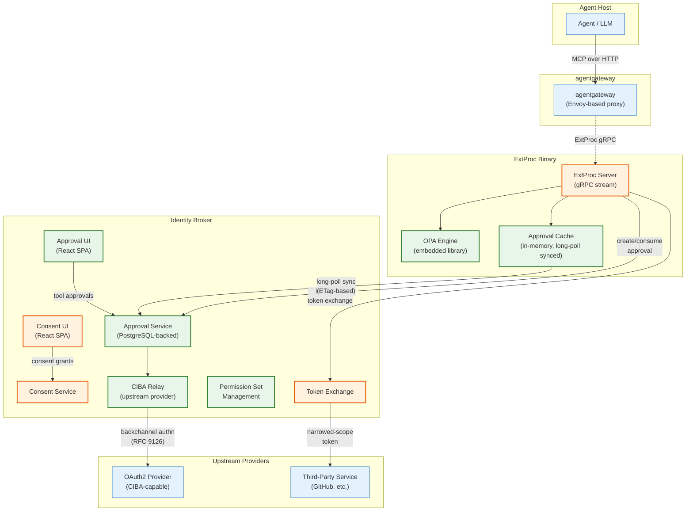

> **Legend**: 🟢 New components | 🟠 Modified components | 🔵 Existing (unchanged)
>
> **Key architectural decision**: All approval state — including CIBA orchestration — lives in the broker. ExtProc maintains a local **approval cache** synchronized via long-polling with ETags, avoiding per-request round-trips. There is no separate approval sidecar; the broker is the single source of truth for both Tier 2 (runtime approval) and Tier 3 (CIBA) approvals.

### 2.2 The Three Authorization Tiers

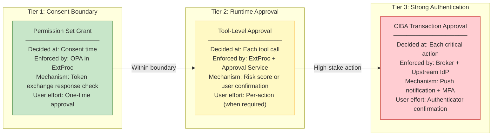

---

## 3. Core Design Decisions

### 3.1 Permission Sets: The Unit of Consent

**Decision**: Introduce `PermissionSet` as a first-class domain entity that decouples the user-facing consent model from underlying OAuth2 scopes.

| Aspect | Current (Scopes) | Proposed (Permission Sets) |
|--------|-------------------|---------------------------|
| User sees | `repo:read`, `admin:org` | "GitHub Read-Only", "GitHub Full Access" |
| Granularity | Individual OAuth2 scopes | Named bundles with set-of-sets selection |
| Agent declares | `RequiredScopes[]` | `PreferredPermissionSetID` + `AlternativePermissionSetIDs[]` |
| Grant stores | `Scopes[]` per service | `GrantedPermissionSetIDs[]` per service (multiple allowed) |
| Token exchange | Returns all granted scopes | Returns access token + `granted_permission_sets` metadata |

> **Note on token format**: The broker does not mint tokens — the `access_token` in the token exchange response is opaque and comes from the third-party OAuth2 provider. Therefore, `granted_permission_sets` cannot be embedded as a JWT claim in the access token. Instead, the broker returns it as an additional JSON field in the RFC 8693 token exchange response:
>
> ```json
> {
>   "access_token": "gho_xxxx...",
>   "token_type": "Bearer",
>   "expires_in": 3600,
>   "granted_permission_sets": {
>     "github": ["github-readonly", "github-issues"]
>   }
> }
> ```
>
> ExtProc caches `granted_permission_sets` alongside the exchanged token and passes it to OPA on each tool call evaluation. This is a local-only data flow — the field is consumed only by the ExtProc process that requested it, so trusting the broker's response is sufficient (ExtProc already trusts the broker for token exchange).

**Model: Preferred + Alternatives (set of sets)**

Each agent declares per service:
- **Preferred permission set**: What the agent ideally wants (shown as default/recommended in the consent UI)
- **Alternative permission sets**: Other acceptable combinations the user can choose instead (shown as options)
- **Multiple selection**: Users can grant **multiple** permission sets for the same service (e.g., "Read-Only" + "Issues"), and the effective scope is the **union** of all granted sets' scopes

This gives admins full flexibility to model orthogonal capabilities as independent permission sets, and lets users compose their own permission boundary by selecting any combination from the agent's allowed list.

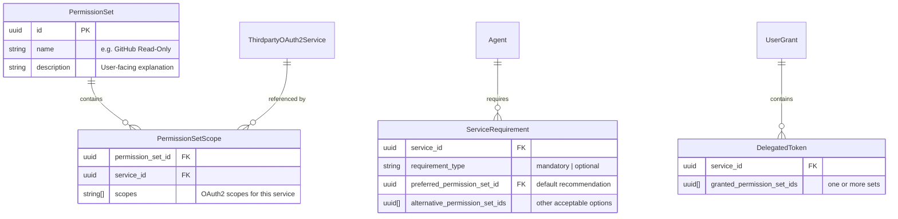

**Multi-service permission sets**: A single `PermissionSet` can span multiple services. For example, a "Full DevOps Access" permission set might bundle GitHub scopes (`repo:write`) and a CI service's scopes (`pipeline:trigger`) into one user-facing unit. The `PermissionSetScope` join entity maps each permission set to the specific scopes it grants per service. During consent, the UI shows the permission set as one logical unit; during token exchange, the broker resolves the relevant service's scopes from the `PermissionSetScope` entries.

**OPA implication**: The `tool_permissions` map in OPA policy references permission set IDs (not services). Since a permission set can cover multiple services, a single granted permission set can unlock tools across services. The `service` field in `tool_permissions` is used for token exchange routing (which service to exchange the token for), not for permission set evaluation.

**Consent UI behavior**: The preferred set is pre-selected but not locked. Alternative sets are shown as additional options with checkboxes. The consent screen explains the effective permissions as the union of selected sets. If the agent has only one permission set (no alternatives), the UI is simple approve/decline.

**OPA evaluation**: The token exchange response includes a `granted_permission_sets` field containing a map of `{service_id: [permission_set_id, ...]}`. ExtProc caches this alongside the exchanged access token. OPA policy maps tools to required permission set IDs (not tiers). A tool is allowed if **any** of the user's granted permission set IDs appears in the tool's `allowed_permission_sets` list.

**Trade-off**: This creates an admin burden (admins must define permission sets before agents can reference them) but dramatically simplifies the user experience and enables the entire tool-level authorization model. The set-of-sets model avoids the artificiality of forced hierarchies at the cost of slightly more complex OPA policy (set membership check vs. integer comparison).

### 3.2 Split Responsibility: Broker Consents, Gateway Enforces

**Decision**: The broker is the consent authority (stores what users approved). The gateway is the enforcement authority (decides if a specific tool call is allowed).

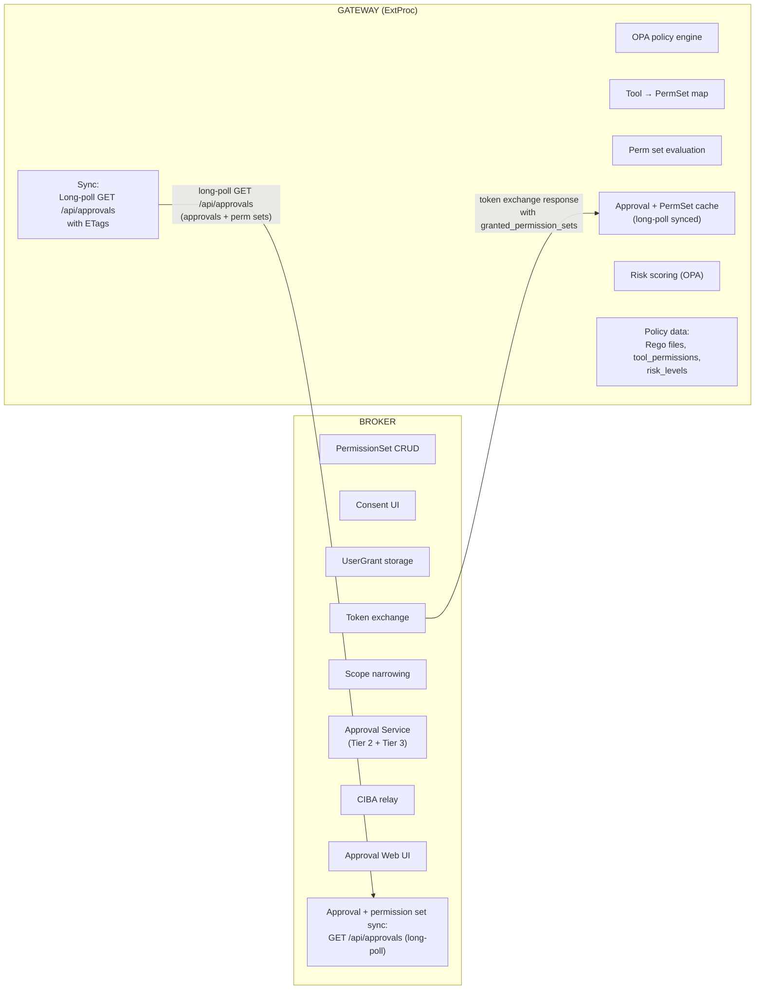

**Why not put tool mapping in the broker?** The broker is a domain service for identity and consent. Tool names are a gateway concern — they change with agent configurations, MCP server schemas, and deployment topology. Keeping them in OPA policy allows independent lifecycle management.

**Information bridge**: The broker returns `granted_permission_sets: {service_id: [permission_set_id, ...]}` as a JSON field in the token exchange response (alongside `access_token`, `token_type`, `expires_in`). This field exists primarily for **alternative setups** where ExtProc is replaced by a custom implementation that may not use the long-poll sync endpoint — in that case, simpler permission checks without the full approval infrastructure may be sufficient. In the standard ExtProc setup, the primary source of permission set data is the approvals endpoint (Section 5.1). The broker does not mint tokens; the access token is opaque and comes from the third-party OAuth2 provider, so embedding claims in it is not possible.

**Trade-off**: Two sources of truth (permission sets in broker DB, tool mappings in OPA policy) must stay in sync. A permission set ID referenced in OPA but deleted from the broker will cause failures. Mitigation: OPA policy references permission set IDs which are stable UUIDs; the broker prevents deletion of in-use permission sets (409 Conflict).

### 3.3 OPA as Embedded Library in ExtProc

**Decision**: Integrate OPA as a Go library (`github.com/open-policy-agent/opa/rego`) within the existing ExtProc binary, not as a separate sidecar.

**Rationale**:
- ExtProc already sits in the request path and sees all request data
- Avoids network hop to an external OPA server
- Single binary deployment (per ADR 011 precedent)
- CEL remains in the broker for token exchange authorization (two policy engines, different domains)

**What ExtProc sees today** (already available, no agentgateway changes needed):

| Phase | Data | Relevance |
|-------|------|-----------|
| RequestHeaders | Bearer token, `:path`, `:scheme`, `:authority`, all headers incl. `Mcp-Session-Id` | Subject token for broker auth, session binding |
| RequestBody | Full MCP JSON-RPC payload including `method` and `params` | **Tool name and parameters** |

**Critical insight**: ExtProc already receives the MCP JSON-RPC request body. An MCP `tools/call` request contains `{"method": "tools/call", "params": {"name": "create_pull_request", "arguments": {...}}}`. This means **ExtProc can extract tool names and parameters without any agentgateway changes**.

**`granted_permission_sets` bootstrap**: OPA evaluation requires `granted_permission_set_ids` as input, and this must be available **before** token exchange — otherwise tools could reach Tier 1 `allow` and trigger a token exchange for a tool the user hasn't consented to.

**Solution: Long-poll on the approvals endpoint**. Permission sets and approvals are fetched through the **approvals endpoint** (`GET /api/approvals`) described in Section 5.1. When called with `If-None-Match` and `X-Long-Poll-Timeout` headers, this endpoint becomes a long-poll subscription. Without those headers, it returns the current state immediately. This is natural because both datasets share the same lifecycle — `(principal, agent)` — and both need the same near-real-time synchronization semantics.

The response includes `granted_permission_sets` (IDs only) alongside approvals. See Section 5.1 for the full protocol, payload format, and cache lifecycle.

**Bootstrap flow**:
1. On startup, ExtProc makes a non-conditional `GET /api/approvals` to fetch all approvals and permission sets. This seeds the full cache.
2. OPA evaluates with the cached permission set IDs. If `allow` → ExtProc performs token exchange (separate step). If `deny` → no token exchange happens.
3. When grants change (user revokes or modifies), the broker increments the version counter, and the long-poll goroutine picks up the updated permission sets alongside any approval changes.

This **separates authorization from token acquisition**: OPA can deny a tool call based on permission sets without ever initiating a token exchange for a tool the user didn't consent to. The token exchange response also includes `granted_permission_sets` for alternative setups that don't use the approvals endpoint (see Section 3.2), but the primary source for ExtProc is the long-poll endpoint.

**Security invariant**: ExtProc treats a missing permission set cache as an empty set — OPA's `default decision := deny` fires, blocking any tool call until the sync bootstrap completes.

**Trade-off**: Body inspection adds latency (must buffer and parse JSON). Mitigation: parse only `tools/call` method messages; pass through `initialize`, `resources/*`, etc. without OPA evaluation.

### 3.4 Three-Tier Runtime Authorization

#### Tier 1: Permission Set Boundary (OPA)

Every tool call is checked against the user's granted permission set. This is the hard boundary — if OPA denies, the tool call is rejected regardless of any other factor.

#### Tier 2: Runtime Tool Approval (New — Cross-Cutting)

Within the permission set boundary, certain tools may require per-invocation approval. This is the middle tier — it doesn't change what the user *consented to*, but introduces a confirmation step before *execution*.

**This is the novel design element explored in Section 4.**

#### Tier 3: CIBA Transaction Approval

For irreversible, high-stake actions (financial transactions, destructive operations), the system requires IdP-level strong authentication from the upstream OAuth2 provider via CIBA.

**MCP elicitation alignment**: Both Tier 2 and Tier 3 use the standard MCP `URLElicitationRequiredError` (code `-32042`, defined in the [MCP Elicitation specification 2025-11-25](https://modelcontextprotocol.io/specification/2025-11-25/client/elicitation)). When a `tools/call` requires user interaction — whether a human approval (Tier 2) or CIBA strong authentication (Tier 3) — ExtProc returns a `URLElicitationRequiredError` containing an `elicitations` array with `mode: "url"`. The URL always points to a broker page where the user can act.

For CIBA, the broker-side behavior varies based on upstream IdP capabilities, but the **agent-facing protocol is uniform**: it always receives a `URLElicitationRequiredError` with a URL. The broker generates a status/approval page for every CIBA flow:

| Upstream IdP capability | Broker behavior | Status page shows |
|------------------------|-----------------|-------------------|
| **CIBA push supported** | Broker sends `POST /bc-authorize` to IdP. Status page auto-refreshes, showing "Waiting for device confirmation..." | Push notification status + manual fallback link |
| **CIBA push unsupported** | Broker creates pending approval. Status page provides alternative auth flow (e.g., redirect-based). | "Waiting for authentication..." with available options |

This eliminates the need for distinct elicitation modes (`push_only`, `push_with_fallback`, `url_only`) at the MCP protocol level — the broker **always provides a URL**, and the CIBA push behavior is an internal broker concern. The agent treats Tier 2 and Tier 3 identically: it receives a URL, presents it to the user, and retries the tool call once the user confirms (or polls via `get_approval_status` on the `/mcp` endpoint).

**OPA policy declares CIBA requirement** per tool (the push behavior is configured per upstream IdP, not per tool):

```rego
# CIBA-required tools (risk classification handles the tier decision)
# No per-tool elicitation mode — the broker determines push behavior
# based on the upstream IdP's CIBA capabilities
tool_risk := {
    "delete_repository": "critical",   # → ciba_required
    "transfer_funds": "critical",      # → ciba_required
    "revoke_all_access": "critical",   # → ciba_required
}
```

### 3.5 CIBA as Broker-Orchestrated Relay

**Decision**: The broker implements CIBA relay as part of the approval service. When OPA signals `ciba_required`, ExtProc creates a CIBA approval in the broker (same API as Tier 2 approvals), which triggers the broker to initiate backchannel authentication with the upstream OAuth2 provider.

**Rationale**: CIBA requires push notification infrastructure, polling endpoints, and user device management. Upstream providers (Azure AD, Okta) already have this. By hosting the CIBA orchestration in the broker alongside the approval service, we:

- **Preserve agent transparency**: The agent sees the same MCP `URLElicitationRequiredError` (code `-32042`) as Tier 2 — a standard elicitation URL. No special `request_approval` tool needed.
- **Reuse existing infrastructure**: The approval service already handles persistent state, the web UI, and subject token authentication.
- **Simplify the architecture**: No separate sidecar process to deploy, monitor, or secure.

**Flow**: ExtProc → Broker approval API (with `type: ciba`) → Broker CIBA relay → Upstream provider's backchannel authentication endpoint → User's device → Upstream returns elevated token → Broker marks approval as complete + stores CIBA token → ExtProc picks up approval via cache sync.

**CIBA token handling**: When the upstream provider returns an elevated CIBA token, the broker stores it alongside the approval record (encrypted). When ExtProc resolves the CIBA approval, the broker returns the CIBA token in place of the normal token exchange — ExtProc uses this elevated token for the request instead of performing standard RFC 8693 exchange.

---

## 4. Deep Dive: Cross-Cutting Tool Approval (Tier 2)

This section explores the design for runtime tool approval that works as cross-cutting infrastructure, independent of agent implementation. The key requirements:

1. **Agent-unaware**: Agents don't implement approval logic; it happens transparently
2. **Graduated response**: From automatic approval (risk-based) to human confirmation
3. **URL-based elicitation**: Users can be redirected to a web UI outside the agent session
4. **Extensible**: Supports future approval mechanisms beyond human-in-the-loop

### 4.1 The Approval Decision Point

The approval decision happens in ExtProc, after OPA evaluates the permission set boundary (Tier 1 ALLOW) but before token exchange:

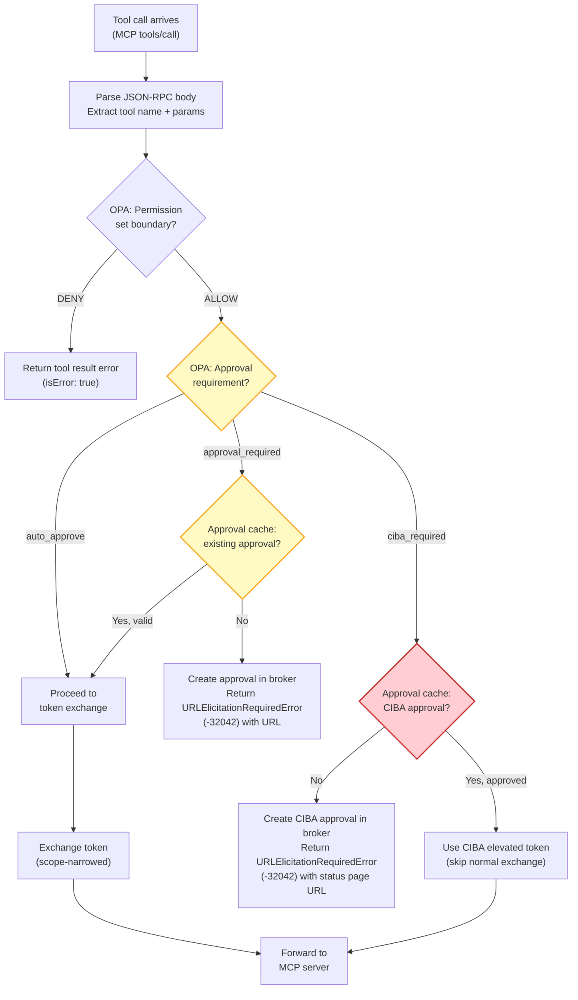

### 4.2 OPA Policy: Four-Valued Decision

OPA returns a richer decision than allow/deny:

```rego
# Example OPA policy structure
package aib.tool_authz

import rego.v1

default decision := {"action": "deny", "reason": "no policy matched"}

# Tier 1: Permission set boundary check
# A tool is allowed if ANY of the user's granted permission set IDs
# appears in the tool's allowed_permission_sets list
decision := {"action": "deny", "reason": "insufficient_permission_set"} if {
    required := tool_permissions[input.tool_name].allowed_permission_sets
    count({ps | ps := input.granted_permission_set_ids[_]; ps == required[_]}) == 0
}

# Tier 2a: Auto-approve low-risk tools within boundary
decision := {"action": "allow"} if {
    tool_risk[input.tool_name] == "low"
    some ps in input.granted_permission_set_ids
    ps in tool_permissions[input.tool_name].allowed_permission_sets
}

# Tier 2b: Require approval for medium-risk tools
decision := {
    "action": "approval_required",
    "reason": "This action modifies repository settings",
    "approval_context": {
        "tool": input.tool_name,
        "risk_level": "medium",
        "description_template": "Modify settings for repository {arguments.repo}",
        "default_persistence": "once"
    }
} if {
    tool_risk[input.tool_name] == "medium"
    some ps in input.granted_permission_set_ids
    ps in tool_permissions[input.tool_name].allowed_permission_sets
}

# Tier 3: Require CIBA for critical tools
decision := {
    "action": "ciba_required",
    "reason": "This action requires strong authentication",
    "binding_message_template": "Delete repository {arguments.repo}"
} if {
    tool_risk[input.tool_name] == "critical"
    some ps in input.granted_permission_set_ids
    ps in tool_permissions[input.tool_name].allowed_permission_sets
}

# Tool → permission set mapping (data, not logic)
# allowed_permission_sets: list of permission set IDs that grant access to this tool
# A tool can be unlocked by ANY of the listed sets (OR semantics)
tool_permissions := {
    "list_repositories": {
        "allowed_permission_sets": ["github-readonly", "github-issues", "github-full"],
        "service": "github",
    },
    "get_file_contents": {
        "allowed_permission_sets": ["github-readonly", "github-full"],
        "service": "github",
    },
    "create_issue": {
        "allowed_permission_sets": ["github-issues", "github-full"],
        "service": "github",
    },
    "create_pull_request": {
        "allowed_permission_sets": ["github-full"],
        "service": "github",
    },
    "delete_repository": {
        "allowed_permission_sets": ["github-full"],
        "service": "github",
    },
}

# Risk classification (independent of permission set mapping)
tool_risk := {
    "list_repositories": "low",
    "get_file_contents": "low",
    "create_issue": "medium",
    "create_pull_request": "medium",
    "merge_pull_request": "medium",
    "delete_repository": "critical",
}
```

### 4.3 The Approval Service

The approval service is a new **API subtree** (`/api/approvals/*`) within the existing identity broker HTTP server — not a separate server or process. It manages pending approvals and provides a web interface (served under `/approvals/:id` via the existing React SPA) for users to review and approve/deny actions.

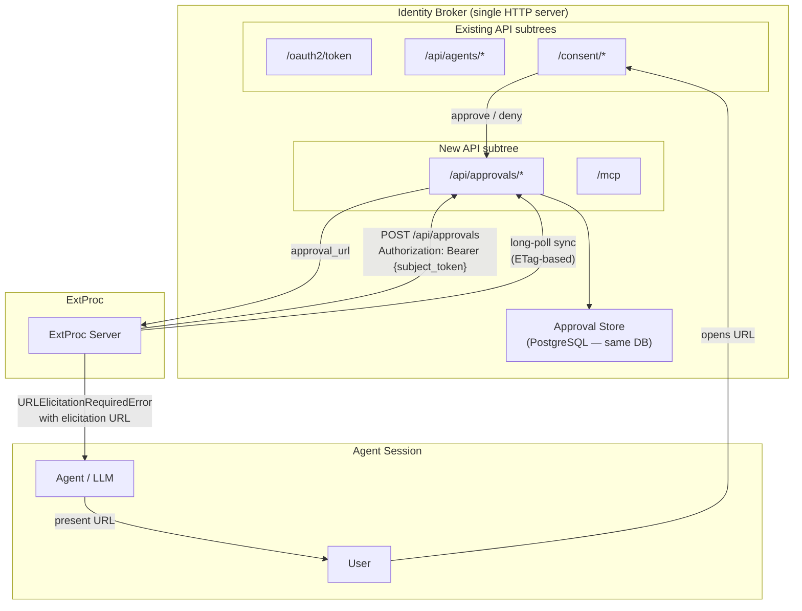

> **Note**: The `/mcp` endpoint is described in Section 5.3 (MCP Server for Approval Management).

**Why an API subtree, not a separate server?**

The approval service shares the broker's HTTP server, PostgreSQL connection pool, authentication middleware, and React SPA serving. It adds routes—not infrastructure:

| Requirement | Achieved |
|-------------|----------|
| Survives ExtProc restart | ✅ PostgreSQL-backed persistence |
| URL-based web UI | ✅ Extends existing consent UI (React SPA) |
| Audit trail | ✅ Persisted with full lifecycle logging |
| Risk-based auto-approval | ✅ Access to grant history and frequency data |
| Cross-session visibility | ✅ User can see all pending approvals |
| CIBA orchestration | ✅ Direct relay to upstream IdP, no separate process |

For Tier 3 (CIBA), approvals use the same service and persistence model as Tier 2. The only difference is the broker-side behavior: when a CIBA approval is created, the broker automatically initiates backchannel authentication with the upstream OAuth2 provider. The approval transitions from `pending` to `approved` when the user completes device authentication, and the elevated CIBA token is stored alongside the approval record.

**CIBA approvals are always one-time**: Unlike Tier 2 approvals which support `once`, `session`, and `permanent` persistence modes, CIBA approvals are **always consumed on use**. Each critical action requires a fresh CIBA authentication — there is no session or permanent CIBA approval. This reflects the security principle that strong authentication should be revalidated for every high-risk operation. After ExtProc uses a CIBA approval, it is marked consumed in the cache and reported to the broker; the next `ciba_required` tool call for the same tool+params will trigger a new CIBA flow.

### 4.4 Approval Authentication: Subject Token & Client Assertion

All approval API calls derive the principal (user) and agent identity from the authentication credential — no explicit `principal` or `agent_id` URL parameters are needed or accepted. This prevents parameter tampering and keeps the API surface minimal.

**Machine-to-machine calls (ExtProc → Broker)**:

| API call | Auth mechanism | Identity derivation |
|----------|---------------|---------------------|
| `POST /api/approvals` (create pending) | `Authorization: Bearer {subject_token}` | Principal + agent extracted from subject token |
| `GET /api/approvals/{id}` (check specific) | `Authorization: Bearer {subject_token}` | Principal + agent extracted, scoped query |
| `GET /api/approvals` (long-poll) | `Authorization: Bearer {extproc_client_assertion}` | Gateway authenticated via CEL expression (same trust mechanism as token exchange). Returns **all** approvals + permission sets. Optional `principal` query param to filter by specific principal. Long-poll behavior activated by `If-None-Match` + `X-Long-Poll-Timeout` headers. |

**Browser calls (User → Broker)**:

| API call | Auth mechanism | Broker action |
|----------|---------------|---------------|
| `GET /approvals/:id` (Approval UI page) | Upstream proxy auth (X-Remote-User) | User authenticated via normal consent UI auth flow |
| `POST /api/approvals/:id/approve` | Upstream proxy auth (X-Remote-User) | Verify requesting user matches the approval's principal |
| `POST /api/approvals/:id/deny` | Upstream proxy auth (X-Remote-User) | Verify requesting user matches the approval's principal |

**Why the subject token works for approval creation**: The subject token is a human-bound token that identifies both the principal (user) and the agent (via the client credentials used in the OAuth2 flow). The broker can extract both identities from a single token, eliminating the need for ExtProc to pass `user` and `agent` as explicit parameters. This also means the broker can **authorize** the request — only the correct user's ExtProc session can create or query approvals for that user.

**Why client assertion for long-polling**: The long-poll goroutine runs in the background and outlives individual request contexts. The `Authorization: Bearer` header carries the ExtProc's client assertion (identifying the gateway instance). The broker validates this assertion using a **CEL expression** — the same trust mechanism used for token exchange authorization (see ADR 009). The broker returns **all** approvals and permission sets (not filtered by gateway), since it has no knowledge of which agents are served by which gateway. ExtProc filters the response client-side to populate its per-`(principal, agent)` cache. On cache misses (e.g., a new `(principal, agent)` pair not yet in the long-poll response), ExtProc augments by making a targeted `GET /api/approvals?principal={p}` call.

**Approval UI authentication** is separate: when a user opens the approval URL in their browser, they authenticate through the normal upstream proxy (X-Remote-User header), not via the subject token. The broker verifies the authenticated browser user matches the principal on the pending approval.

### 4.5 Approval Flow: URL-Based Elicitation

The key innovation is that when a tool call requires approval, ExtProc doesn't block — it returns a standard MCP `URLElicitationRequiredError` (code `-32042`, per the [MCP Elicitation specification](https://modelcontextprotocol.io/specification/2025-11-25/client/elicitation)) with an elicitation URL that the agent can present to the user. The user opens the URL, reviews the action, and approves/denies in a dedicated web interface outside the agent session.

**Completion signaling constraint**: The MCP elicitation spec defines `notifications/elicitation/complete` for proactive completion signaling. However, in this architecture the MCP session is between the **agent and agentgateway** — the broker has no direct MCP connection to the agent and therefore cannot send MCP notifications. Completion detection relies on two mechanisms:

1. **User-initiated retry**: The user tells the agent "I approved it" → the agent retries the `tools/call`. On retry, ExtProc checks the approval cache (synced via long-poll) and finds the approval.
2. **Agent polling via `/mcp`**: The agent can call `get_approval_status(approval_id=elicitationId)` on the broker's MCP server endpoint to check whether the user has acted, then retry when status is `approved`.

If agentgateway adds support for server-initiated MCP notifications in the future (e.g., ExtProc signaling the gateway to push a notification), `notifications/elicitation/complete` could be forwarded to the agent. This remains a future extension.

**Approval matching on retry**: When the agent retries the tool call after the user approves, ExtProc checks its **local approval cache** (not a round-trip to the broker). The cache is synchronized from the broker via long-polling (see Section 5.1). The match uses **exact tool name + parameter matching**: the concrete tool invocation `(tool_name, arguments)` is matched against stored approval patterns using the semantics defined in Section 4.8.

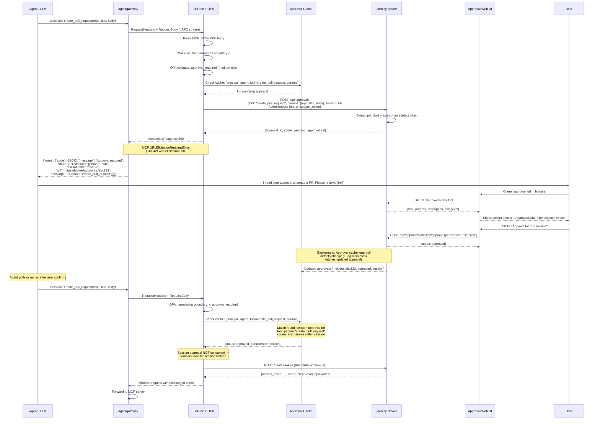

### 4.6 Risk-Based Automatic Approval

Not all "approval_required" decisions need human confirmation. The approval service can auto-approve based on risk signals:

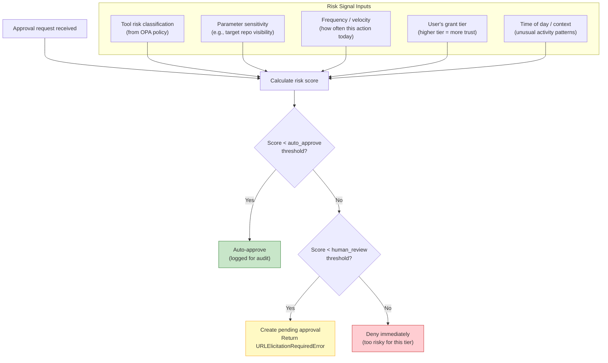

**Extensibility**: The risk scoring function is a policy decision. Initially, it can be a simple lookup table (tool risk level from OPA). Over time, it can incorporate behavioral signals, ML-based anomaly detection, or external risk APIs — all without changing the approval flow.

### 4.7 Approval Persistence Modes

When a user approves a tool call, the approval can have different **persistence scopes**. The OPA policy declares the default persistence mode per tool, but the Approval UI can offer the user a choice:

| Mode | Meaning | Stored as | Use case |
|------|---------|-----------|----------|
| **`once`** | One-time use — consumed on first matching tool call | `consumed: true` after use | Sensitive writes (e.g., merge PR) |
| **`session`** | Valid for the remainder of the MCP session | TTL = session lifetime, keyed by `(user, agent, session_id, tool_pattern)` | Repetitive medium-risk work (e.g., creating multiple PRs in a session) |
| **`permanent`** | Valid indefinitely until explicitly revoked | Persisted in `user_tool_approvals` table, no TTL | Tools the user trusts this agent to always use (e.g., "always allow this agent to create issues") |

**Approval UI offers the choice**: When a user reviews a pending approval, they see:
- "Approve this once" (default)
- "Approve for this session"
- "Always allow this agent to [action]" (with a warning that this can be revoked later)

**Permanent approvals appear in the consent management UI** alongside the user's grants, so they can review and revoke them.

**ExtProc check order**: When evaluating an `approval_required` or `ciba_required` decision, ExtProc checks its **local approval cache** (not a round-trip to the broker) in this order:
1. **Permanent approval** matching `(user, agent, tool_pattern)` → allow
2. **Session approval** matching `(user, agent, session_id, tool_pattern)` → allow
3. **Pending one-time approval** matching `(user, agent, tool, params)` with `status=approved` → allow + mark consumed (consume reported to broker asynchronously)
4. No match → create pending approval in broker (synchronous `POST`), return `URLElicitationRequiredError` with approval URL

**One-time approval consumption**: When a one-time approval is matched, ExtProc immediately marks it as consumed in the local cache (preventing double-use) and asynchronously reports the consumption to the broker via `POST /api/approvals/{id}/consume`. If ExtProc crashes before the async report, the broker will still show the approval as approved (not consumed) — the next cache sync will re-deliver it. This is safe: a one-time approval being used twice in a crash scenario is acceptable because the underlying action was already performed.

### 4.8 Tool Matching: Pattern Semantics

Approvals and OPA policies reference tools using **pattern matching with wildcard semantics**, not opaque hashes. This serves two purposes:

1. **Users see readable tool names and parameters** in the Approval UI (not hashes)
2. **Approvals can cover families of tool calls** using glob patterns

#### Pattern Syntax

```
tool_pattern := tool_name [ "(" param_pattern { "," param_pattern } ")" ]
param_pattern := param_name "=" ( literal_value | "*" )
tool_name    := identifier | identifier ".*"   # wildcard suffix
```

**Examples**:

| Pattern | Matches | Use case |
|---------|---------|----------|
| `create_pull_request` | Any `create_pull_request` call regardless of params | Session/permanent approval |
| `create_pull_request(repo=acme/app)` | Only PRs targeting `acme/app` | Scoped one-time approval |
| `create_pull_request(repo=acme/*)` | PRs targeting any repo in `acme` org | Org-scoped permanent approval |
| `issues.*` | `issues.create`, `issues.update`, `issues.close`, etc. | Broad permanent approval |
| `*` | Any tool | "Trust this agent fully" (within permission set boundary) |

**Matching in ExtProc**: When a tool call arrives, ExtProc checks existing approvals by matching the concrete tool invocation `(tool_name, params)` against stored patterns. The most specific match wins. A permanent approval for `create_pull_request(repo=acme/*)` matches `create_pull_request(repo=acme/app, title="Fix bug")` because unspecified parameters are unconstrained.

**Browser-owned scope**: The broker derives `tool_pattern` as an exact escaped matcher for the reviewed tool name. Browser users cannot edit it. Users can edit only `params_pattern` for session and permanent approvals.

**Approval UI displays**: When users review a pending approval, they see:
- The **exact tool name** (e.g., `create_pull_request`)
- The **full parameters** with values (e.g., `repo: acme/app`, `title: Fix bug`, `body: This fixes...`)
- A **description** rendered from the OPA policy's `description_template` with parameter interpolation

When users choose session or permanent persistence, the UI shows the parameter pattern that will be stored and explains what it covers:
> "Always allow this agent to call `create_pull_request` on any repo in `acme/*`"

### 4.9 Key Design Properties

**Agent-transparent**: The agent receives a standard MCP `URLElicitationRequiredError` (code `-32042`) with an elicitation URL. Any MCP client supporting the elicitation capability can handle this natively — no broker-specific SDK required. Completion is detected via agent retry or polling `get_approval_status` on the `/mcp` endpoint.

**Cross-cutting**: No agent code changes. The approve/deny decision happens entirely in ExtProc + broker. Adding approval requirements to new tools is a policy change (OPA Rego file), not a code change.

**Stateful with configurable persistence**: Approvals support three persistence modes (once, session, permanent) to balance security with usability. Permanent approvals are visible and revocable through the consent management UI.

**URL-based, not session-bound**: The approval URL works in any browser. The user doesn't need to be in the same session as the agent. This supports:
- Mobile confirmation (user scans a QR code from the agent chat)
- Async workflows (user approves later, agent retries)  
- Delegation (user forwards the URL to a team approver — future extension)

---

## 5. Sync Infrastructure

This section covers the infrastructure that enables the approval and permission set flows described in Section 4: the long-poll sync cache, session identity derivation, and the MCP server for programmatic approval access.

### 5.1 Approval Cache: Long-Polling with ETags

ExtProc maintains a **local in-memory cache** that mirrors both the broker's **approval state** and **granted permission sets** for active `(principal, agent)` pairs. The approvals endpoint (`GET /api/approvals`) serves both datasets. When called with `If-None-Match` and `X-Long-Poll-Timeout` headers, it acts as a long-poll subscription; without those headers, it returns current state immediately.

#### Cache Architecture

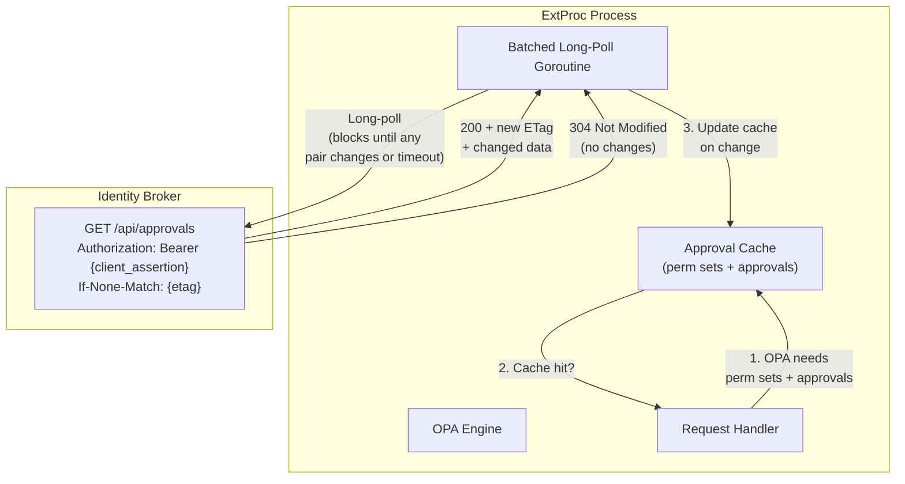

#### Protocol: ETag-Based Long-Polling

The protocol uses HTTP conditional requests to minimize bandwidth and broker load. A **single long-poll connection** per gateway instance subscribes to changes across all `(principal, agent)` pairs relevant to that gateway.

**Decision**: Use the **approvals endpoint with long-poll semantics**. The broker authenticates the gateway via a CEL expression (same mechanism as token exchange) and returns **all** approval and permission set state. ExtProc filters client-side into its per-`(principal, agent)` cache and augments on cache miss.

**Request** (from ExtProc):
```http
GET /api/approvals
Authorization: Bearer {extproc_client_assertion}
If-None-Match: "etag-abc123"
X-Long-Poll-Timeout: 30
```

Optional filtering:
```http
GET /api/approvals?principal=user@example.com
```

> **Authentication**: The `Authorization` header carries the ExtProc's client assertion. The broker validates it using a **CEL expression** (same trust mechanism as token exchange — see ADR 009) and returns all approval and permission set state.
>
> **Client-side filtering**: The broker returns the full set of approvals and permission sets across all agents. ExtProc filters locally into its per-`(principal, agent)` cache, keeping only pairs it has seen requests for. This simplifies the broker (no per-gateway subscription tracking) and makes the protocol stateless on the server side.
>
> **Cache miss augmentation**: When a new `(principal, agent)` pair arrives that isn't in the cache (not yet seen in a long-poll response), ExtProc makes a targeted `GET /api/approvals?principal={p}` call to fetch data for that specific principal. This augments the cache immediately without waiting for the next long-poll cycle.

**Response** (from Broker):

| Scenario | Status | Body | Headers |
|----------|--------|------|---------|
| Changes detected since ETag | `200 OK` | Full state for changed pairs (others omitted) | `ETag: "etag-def456"` |
| No changes within timeout | `304 Not Modified` | Empty | Same ETag |
| First request (no `If-None-Match`) | `200 OK` | Full state for all pairs | `ETag: "etag-abc123"` |
| Filtered by principal | `200 OK` | State for matching principal only | `ETag: "etag-abc123"` |

**Response payload** (grouped by `(principal, agent)` pairs — full state per pair):

```json
{
  "pairs": {
    "pair-key-1": {
      "principal": "user@example.com",
      "agent_id": "agent-abc",
      "granted_permission_sets": {
        "github": ["github-readonly", "github-issues"]
      },
      "approvals": [
        {
          "id": "abc123",
          "tool_pattern": "create_pull_request",
          "params_pattern": {},
          "status": "approved",
          "persistence": "session",
          "session_id": "sess-xyz",
          "created_at": "2026-03-17T10:00:00Z",
          "approved_at": "2026-03-17T10:01:00Z",
          "consumed": false
        }
      ],
      "ciba_tokens": {}
    },
    "pair-key-2": {
      "principal": "other@example.com",
      "agent_id": "agent-abc",
      "granted_permission_sets": { ... },
      "approvals": [ ... ],
      "ciba_tokens": { ... }
    }
  }
}
```

#### Cache Lifecycle

1. **Bootstrap**: On startup, ExtProc makes a non-conditional `GET /api/approvals` (no `If-None-Match`) to fetch all approvals and permission sets. This seeds the full cache. When a request arrives for a `(principal, agent)` pair not yet in the cache (e.g., a user who became active after the last long-poll response), ExtProc makes a targeted `GET /api/approvals?principal={p}` to augment the cache for that principal.
2. **Background sync**: A long-poll goroutine continuously polls `GET /api/approvals` with the client assertion. The broker returns all pairs. ExtProc filters the response client-side into its per-`(principal, agent)` cache, keeping only pairs it has seen requests for. On `200`, it atomically updates changed pairs. On `304`, it immediately re-polls.
3. **Cache miss path**: If OPA signals `approval_required` and the cache has no match, ExtProc creates the approval in the broker (synchronous `POST`) and returns a `URLElicitationRequiredError`. The long-poll goroutine will pick up the approved state once the user acts.
4. **Eviction**: Cache entries for pairs with no requests for an idle timeout (configurable, default 5 min) are evicted. Next request for this pair will trigger augmentation via `GET /api/approvals?principal={p}`.
5. **Session cleanup**: When a session ends (MCP session close or timeout), session-scoped approvals are removed from the local cache.

#### Consistency Guarantees

| Scenario | Guarantee |
|----------|-----------|
| User approves, agent retries immediately | Long-poll picks up change within ~1s (broker notifies waiting poll). If the agent retries faster than the poll cycle, ExtProc falls back to a synchronous `GET /api/approvals/{approval_id}` for the specific approval that was just created in `POST`. |
| Permanent approval already exists | Served from cache (populated via long-poll or augmentation). No broker round-trip. |
| ExtProc restarts | Cache is cold. First long-poll response repopulates all active pairs. Individual cache misses trigger augmentation via `GET /api/approvals?principal={p}`. |
| Broker restarts | Long-poll connections drop. ExtProc reconnects with last-known ETag. Broker responds with full state. |
| Concurrent ExtProc instances | Each maintains its own cache. Broker serves identical data to all. No coordination needed. |

**Fall-through for freshly created approvals**: When ExtProc creates a pending approval via `POST /api/approvals` and gets back `{approval_id, status: pending}`, it stores the `approval_id`. On the agent's retry, if the cache doesn't yet have the approval (long-poll hasn't caught up), ExtProc performs a targeted check: `GET /api/approvals/{approval_id}`. This avoids the race between polling and retry, at the cost of one synchronous call for this specific edge case.

**Idempotent approval creation (stale cache handling)**: A critical invariant is that the broker must handle the case where ExtProc's cache is stale and an approval already exists for the same `(principal, agent, tool, params)` combination. When `POST /api/approvals` receives a request that matches an existing **non-consumed** approval:

| Existing approval state | Broker behavior |
|------------------------|-----------------|
| `pending` (same tool + params) | Return the existing approval's `{approval_id, status: pending, approval_url}` — **do not create a duplicate** |
| `approved` (same tool + params match, not consumed) | Return `{approval_id, status: approved}` — ExtProc can proceed immediately |
| `approved` + `consumed` | Create a new approval (previous one was fully used) |
| `denied` | Create a new approval (user may have changed their mind) |

This ensures:
- **No duplicate approvals**: If the cache is stale and ExtProc thinks there's no approval, but the broker already has a pending one from a previous request, the user won't see two identical approval prompts.
- **Re-delivery safety**: If an approved but unconsumed approval exists (e.g., the cache missed it), the broker returns it directly instead of creating a redundant entry.

The uniqueness key for deduplication is `(principal, agent, tool_name, params_hash, status ∈ {pending, approved+unconsumed})`. Consumed and denied approvals are excluded from deduplication — a new request for the same tool+params after consumption legitimately needs a new approval.

#### Broker-Side Implementation

The broker maintains a **global version counter** (monotonically increasing integer mapped to an ETag). Every mutation to any approval or permission set (create, approve, deny, consume, revoke, grant change) increments this counter. Long-poll requests block (using Go channels or `sync.Cond`) until either:
- The version counter exceeds the version implied by the client's ETag → `200` with changed pairs' data
- The timeout expires → `304`

**Batched wake-up**: To avoid waking long-poll connections on every individual mutation, the broker coalesces changes within a configurable window (default: 1 second). When a mutation occurs, the broker starts a timer; additional mutations within the window are accumulated. The connection is woken once the window closes, delivering all accumulated changes in a single response. This reduces connection churn during bursts of approval activity (e.g., a user approving multiple pending actions in quick succession).

This is lightweight: no database polling, no pub/sub infrastructure. The broker holds the connection open and wakes it after the coalescing window closes.

#### Load Characteristics

| Metric | Value |
|--------|-------|
| Broker connections per ExtProc | 1 long-poll + occasional augmentation calls |
| Request rate (steady state) | ~2/min per gateway (30s timeout → reconnect) |
| Request rate (cache miss augmentation) | 1 `GET /api/approvals?principal={p}` per new principal |
| Request rate (during approval flow) | 1 extra targeted `GET` per approval creation |
| Payload size (initial) | Full state for all pairs (~2.5 KB per pair × active pairs; 50K pairs ≈ 125 MB on first fetch) |
| Payload size (delta) | Changed pairs only (<10 KB typical for steady-state updates) |
| Latency (approval propagation) | Sub-second (broker wakes blocked poll on mutation) |

#### Memory Analysis: Approval Cache at Scale

The approval cache stores approval records in-memory per ExtProc process. Here is a sizing estimate for realistic production loads:

**Per-approval record size** (estimated):

| Field | Size |
|-------|------|
| `id` (UUID) | 16 bytes |
| `tool_pattern` (string, avg 40 chars) | 40 bytes |
| `params_pattern` (map, avg 3 keys × 30 chars) | ~120 bytes |
| `status` (enum) | 8 bytes |
| `persistence` (enum) | 8 bytes |
| `session_id` (UUID, nullable) | 16 bytes |
| Timestamps (3 fields) | 24 bytes |
| `consumed` (bool) | 1 byte |
| Go map/slice overhead | ~80 bytes |
| **Total per approval** | **~313 bytes → ~320 bytes (aligned)** |

**Scenario: 10,000 users × 5 agents per user**:

| Metric | Value |
|--------|-------|
| Active `(principal, agent)` pairs | 50,000 |
| Avg approvals per pair (permanent + active session) | ~8 |
| Total approval records | 400,000 |
| Memory per record | ~320 bytes |
| **Raw approval data** | **~122 MB** |
| Go map overhead (sync.Map or sharded maps) | ~20% → ~24 MB |
| CIBA tokens (encrypted blobs, ~500 bytes × 1% of approvals) | ~2 MB |
| Long-poll goroutine (single per gateway) | **~8 KB** |
| **Total ExtProc memory for cache** | **~148 MB** |

**Key observation**: Since the broker pushes all relevant state per gateway in a single long-poll connection, only **one goroutine** is needed for background sync. The data dominates memory, not goroutines. With LRU eviction (most pairs are not simultaneously active), real-world usage is well below the theoretical maximum.

Additional levers for further reduction:

| Strategy | Impact |
|----------|--------|
| **LRU eviction with short idle timeout** (e.g., 5 min) | Most pairs are not simultaneously active. A 5-min idle timeout on a workday might keep ~5,000 pairs hot → ~15 MB total. |

**Broker-side impact**: Each long-poll connection holds one HTTP connection open — one per gateway instance. The broker maintains a single global version counter (8 bytes) and a channel/condition variable per active poll connection — lightweight. The 1-second coalescing window means at most 1 wake-up per second per connection regardless of mutation rate.

### 5.2 Agent Session Identity

The `session_id` used for session-scoped approvals is distinct from the MCP `Mcp-Session-Id` header (which identifies the MCP protocol session between agent and gateway). The agent session in the approval context represents the broader interaction session between a user and an agent, which may span multiple MCP sessions.

**Session ID derivation**: The `session_id` is not a fixed header — it must be flexibly derived from request metadata available at the agentgateway/ExtProc layer. Potential sources:

| Source | Where available | Characteristics |
|--------|----------------|-----------------|
| `Mcp-Session-Id` header | agentgateway passes to ExtProc | MCP-protocol-scoped, may be recreated on reconnect. Too narrow for approval session semantics. |
| OpenTelemetry trace ID (`traceparent` header) | If distributed tracing is enabled | Per-request, rotates too frequently. Not suitable directly. |
| **Custom `X-Agent-Session-Id` header** | Set by the agent host or agentgateway | Explicit, stable across MCP reconnects. Requires agent host to generate and propagate. |
| **Derived from `(principal, agent, time_window)`** | Computed by ExtProc | No upstream cooperation needed. A session is "any activity from this user+agent within a rolling time window." |

**Recommended approach**: ExtProc derives the session ID using a **CEL expression** (configured in the ExtProc config, not hardcoded). CEL is already used in the project for authorization policies (ADR 009), so reusing it for session ID extraction keeps the expression language consistent across the system.

The CEL expression receives the request metadata (headers, principal, agent ID, and bearer token claims) and must return a `string` — the session ID. This gives operators full flexibility without needing new strategy types for every extraction pattern.

**ExtProc config example**:
```yaml
approval_cache:
  # CEL expression that extracts the session ID from request metadata.
  # Available variables:
  #   headers      map(string, string)  — request headers (lowercase keys)
  #   principal    string               — authenticated user principal
  #   agent_id     string               — target agent identifier
  #   timestamp    google.protobuf.Timestamp — request timestamp
  #   claims       map(string, dyn)     — decoded bearer token claims (from subject token JWT)
  #
  # Must return a string. If the expression returns "", ExtProc uses
  # the Mcp-Session-Id header as fallback.
  session_id_expression: >
    has(claims["session_id"])
      ? string(claims["session_id"])
      : headers["mcp-session-id"]
```

**Example CEL expressions for common scenarios**:

| Scenario | CEL Expression |
|----------|---------------|
| Extract session ID from JWT claim | `has(claims["session_id"]) ? string(claims["session_id"]) : ""` |
| Prefer explicit header, fall back to MCP session | `has(headers["x-agent-session-id"]) ? headers["x-agent-session-id"] : headers["mcp-session-id"]` |
| Derive from JWT `sid` claim (OpenID Connect) | `has(claims["sid"]) ? string(claims["sid"]) : headers["mcp-session-id"]` |
| Always use MCP session ID | `headers["mcp-session-id"]` |
| Combine JWT issuer + subject for stable session | `has(claims["iss"]) && has(claims["sub"]) ? claims["iss"] + ":" + claims["sub"] : ""` |

**Time-window fallback**: For environments where no reliable session header exists, ExtProc provides a built-in time-window fallback that activates when the CEL expression returns an empty string. This derives a synthetic session ID from `(principal, agent, start_time)` with a configurable inactivity timeout:

```yaml
approval_cache:
  session_id_expression: ""  # empty → always use time-window fallback
  time_window_timeout: "30m" # inactivity timeout for synthetic sessions
```

**Impact on approvals**: Session-scoped approvals are keyed by `(principal, agent, session_id, tool_pattern)`. When the session ID changes (MCP reconnect under `mcp_session` strategy, or timeout under `time_window` strategy), session-scoped approvals from the previous session are no longer matched. This is intentional — a new session is a new trust boundary.

### 5.3 MCP Server for Approval Management

The broker exposes an **MCP server** (JSON-RPC over HTTP with SSE transport) that allows agents to query and manage approvals for the current user. This complements the Approval UI — while the UI serves human users directly, the MCP server enables agents to programmatically discover what approvals are pending, what has been granted, and to guide the user through the approval process conversationally.

**Why MCP**: Agents already speak MCP as their native protocol. Exposing approval state as MCP tools allows agents to seamlessly integrate approval awareness into their workflows without custom API client code. The agent can explain to the user what's pending and why, link to the approval URL, or suggest alternative tools that don't require approval.

**Endpoint**: `POST /mcp` — standard MCP JSON-RPC endpoint on the end-user server (:8000). The `/mcp` path is a top-level sibling to `/api/approvals` and can later host additional MCP capabilities beyond approvals. Authentication: same as other end-user APIs (principal from `X-Remote-User` header via upstream proxy).

**Exposed MCP tools**:

| Tool | Description | Parameters | Returns |
|------|-------------|------------|---------|
| `list_pending_approvals` | List approvals awaiting user action for the current principal | `agent_id?` (filter by agent) | Array of `{approval_id, tool_pattern, agent_name, approval_url, created_at, persistence}` |
| `list_granted_approvals` | List active (approved) approvals for the current principal | `agent_id?`, `tool_pattern?` | Array of `{approval_id, tool_pattern, agent_name, persistence, approved_at, session_id?}` |
| `get_approval_status` | Check status of a specific approval | `approval_id` | `{status, tool_pattern, agent_name, approval_url?, persistence, timestamps}` |

**Exposed MCP resources** (read-only context):

| Resource URI | Description |
|-------------|-------------|
| `approval://pending` | Summary of all pending approvals for the current user |
| `approval://granted/{agent_id}` | Granted approvals for a specific agent |

**Security boundaries**:
- The MCP server is scoped to the authenticated principal — an agent can only see approvals for the user it is acting on behalf of.
- No mutation tools (approve/deny) are exposed. Approval actions require the user to visit the approval URL in the Consent UI, maintaining the human-in-the-loop guarantee.
- The MCP server runs within the existing broker HTTP server (same port, same middleware), not as a separate process.

**Agent workflow integration**: When an agent receives a `URLElicitationRequiredError` (Tier 2 or 3), it can call `list_pending_approvals` to get the approval URL, then present it to the user conversationally: _"I need your approval to use the `deploy` tool. You can review and approve it here: [approval URL]. I'll retry once you've approved."_

---

## 6. Activity Diagrams: Runtime Use Cases

### 6.1 Use Case: User Consents to an Agent with Permission Sets

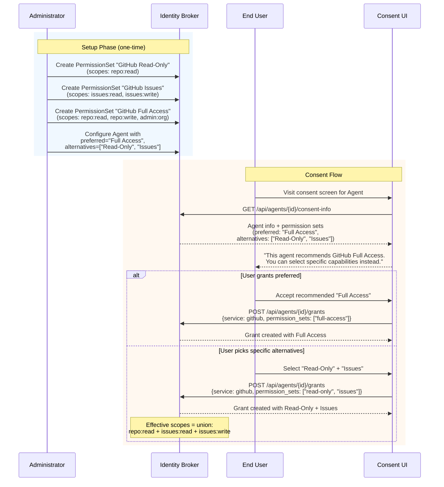

### 6.2 Use Case: Low-Risk Tool Call (Auto-Approved)

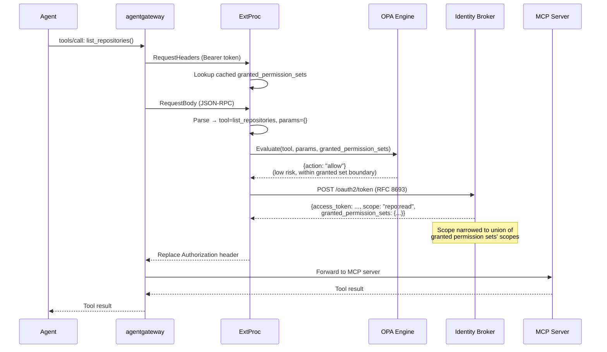

### 6.3 Use Case: Medium-Risk Tool Call (URL-Based Approval)

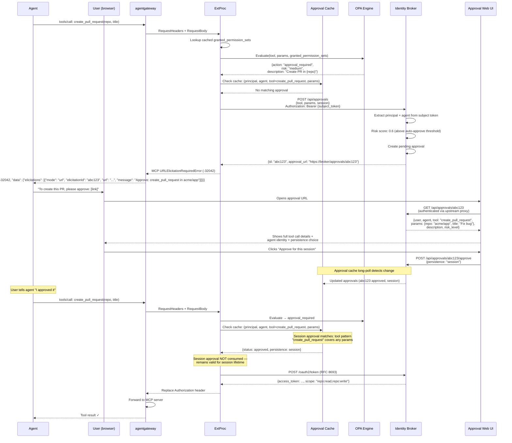

### 6.4 Use Case: Critical Tool Call (CIBA via Broker)

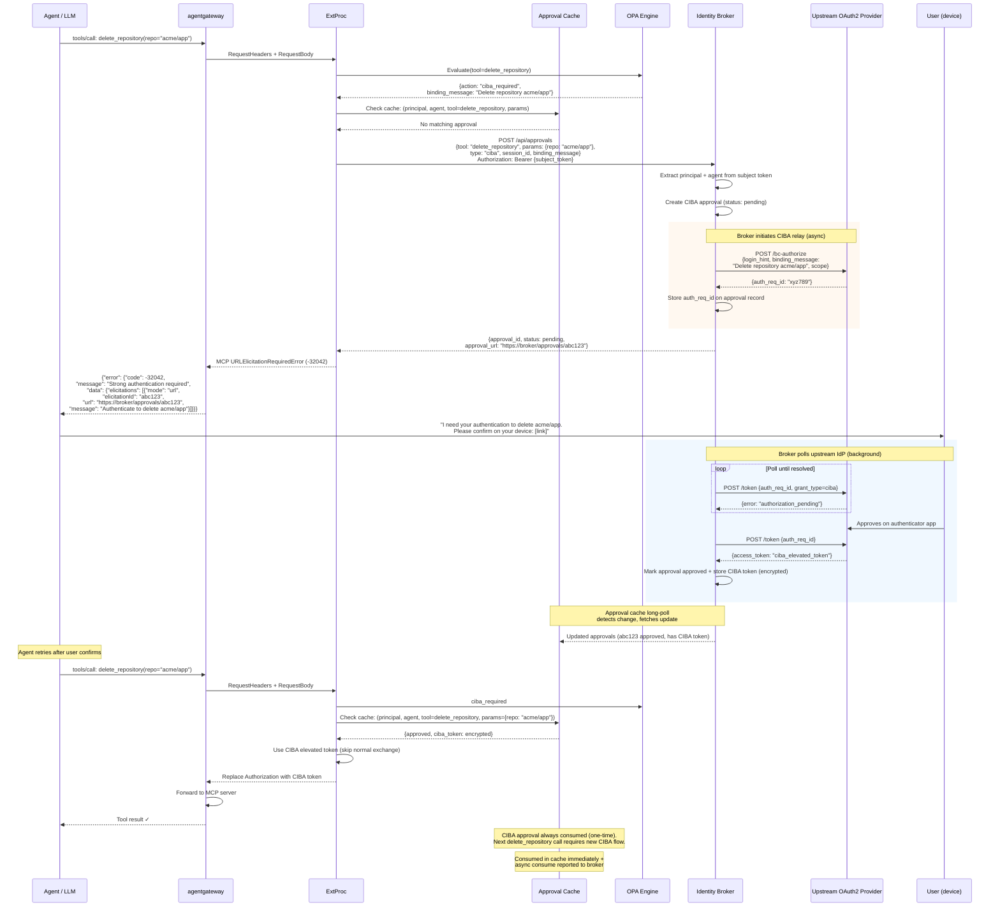

> **Agent transparency**: The agent sees the same MCP `URLElicitationRequiredError` (code `-32042`) for both Tier 2 and Tier 3 — a standard `elicitations` array with `mode: "url"`, `elicitationId`, `url`, and `message`. The agent doesn't need to know whether the approval requires a web click or device authentication. It presents the URL and retries after user confirmation (or polls via `get_approval_status`).
>
> **CIBA is always one-time**: Unlike Tier 2 approvals that support session and permanent persistence, CIBA approvals are always consumed after a single use. The next critical tool call — even with identical parameters — requires fresh strong authentication.

### 6.5 Use Case: Risk-Based Auto-Approval (No Human Involved)

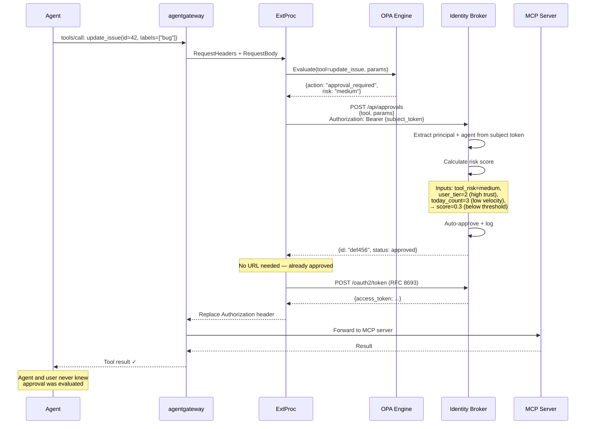

---

## 7. Cohesion & Extensibility Analysis

### 7.1 Cohesion Map

Each component has a clear, single responsibility:

| Component | Responsibility | Coupling |
|-----------|---------------|----------|
| **PermissionSet** (domain entity) | Named scope bundles + tiering | Coupled to: ThirdpartyOAuth2Service |
| **Consent UI** | Human-readable permission display | Coupled to: PermissionSet, Agent, UserGrant |
| **Token Exchange** | Scope narrowing to permission set | Coupled to: PermissionSet, UserSession |
| **ExtProc + OPA** | Tool-level authorization decisions | Coupled to: OPA policy files (data), approval cache (local), token exchange response (contract) |
| **Approval Cache** (ExtProc component) | Local cache of approvals, synced via long-poll | Coupled to: Broker approval API (sync), OPA (read) |
| **Approval Service** (broker extension) | Approval lifecycle + risk scoring + CIBA relay | Coupled to: UserGrant (for risk context), upstream IdP (for CIBA) |
| **Approval UI** | Action review + approve/deny | Coupled to: Approval Service API |

**Cross-cutting concerns** (span multiple components):
- **Audit logging**: Every authorization decision (Tier 1, 2, 3) is logged by the deciding component
- **Token exchange response contract**: The `granted_permission_sets` field is produced by the broker in the token exchange response and cached by ExtProc for OPA evaluation (loose coupling via response contract)
- **Subject token forwarding**: ExtProc forwards the human-bound subject token as `Authorization: Bearer` when creating approvals — the broker extracts principal and agent identity from it, avoiding redundant parameters. Long-poll sync uses the ExtProc client assertion instead.
- **MCP elicitation contract**: Tier 2 and Tier 3 both use the standard MCP `URLElicitationRequiredError` (code `-32042`) with `elicitations[].mode = "url"`. Tier 1 (permission boundary) returns a tool result error (`isError: true`), not an elicitation error. The agent sees a uniform pattern across Tiers 2 and 3: a `URLElicitationRequiredError` with `elicitationId` and `url`, resolvable via agent retry or polling `get_approval_status` on the `/mcp` endpoint
- **Approval cache sync**: Long-polling with ETags ensures ExtProc's local approval data stays fresh without per-request round-trips (see Section 5.1)

### 7.2 Extensibility Points

The design is extensible along several axes without modifying core components:

```mermaid
graph TB
    subgraph "Change: New third-party service"
        A1["Admin creates PermissionSets"] --> A2["Admin updates OPA policy<br/>(tool mappings)"]
        A2 --> A3["No code changes"]
    end

    subgraph "Change: New risk signal"
        B1["Add signal adapter<br/>(implements RiskSignal interface)"] --> B2["Register in builder.go"]
        B2 --> B3["Risk scorer uses it<br/>automatically"]
    end

    subgraph "Change: New approval mechanism"
        C1["E.g., Slack webhook approval"] --> C2["New approval adapter<br/>(implements ApprovalNotifier)"]
        C2 --> C3["Consent UI stays the same"]
    end

    subgraph "Change: New tool risk level"
        D1["E.g., 'elevated' between<br/>medium and critical"] --> D2["OPA policy change only"]
        D2 --> D3["No code changes"]
    end

    style A3 fill:#c8e6c9,stroke:#2e7d32
    style B3 fill:#c8e6c9,stroke:#2e7d32
    style C3 fill:#c8e6c9,stroke:#2e7d32
    style D3 fill:#c8e6c9,stroke:#2e7d32
```

### 7.3 Data Flow Summary

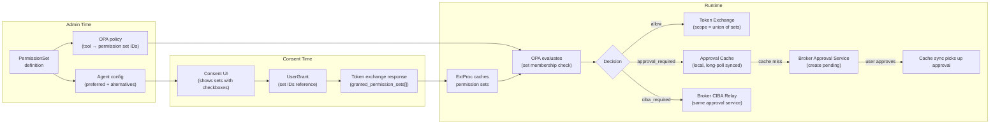

---

## 8. Trade-Offs & Open Questions

### 8.1 Decided Trade-Offs

| Trade-off | Decision | Rationale |
|-----------|----------|-----------|
| OPA in ExtProc vs. external OPA | Embedded library | Single binary, no network hop, per ADR 011 precedent |
| Permission sets in broker vs. gateway | Broker | Consent is the broker's domain; admin CRUD needs persistence |
| Permission sets per-service vs. multi-service | Multi-service | A single permission set can bundle scopes across services, simplifying consent UX |
| Tool mapping in broker vs. OPA policy | OPA policy | Tools are a gateway concern; independent lifecycle |
| Approval store: in-memory vs. persistent | Persistent (PostgreSQL) | URL-based approval needs to survive restarts, plus audit trail |
| Approval service: separate server vs. API subtree | API subtree in broker | Reuses existing HTTP server, auth middleware, DB pool. No new process. |
| CIBA orchestration: sidecar vs. broker | Broker (consolidated) | Same approval lifecycle, no separate process, agent-transparent |
| CIBA approval persistence | Always one-time (consumed on use) | Strong authentication must be revalidated per critical action |
| CIBA elicitation | Standard MCP `URLElicitationRequiredError` with broker status page URL | Uniform agent experience; broker always provides a URL + status page; CIBA push behavior is a broker-internal concern |
| Permission set + approval sync | `GET /api/approvals` with long-poll | Single endpoint for both permission sets and approvals; long-poll via `If-None-Match`; client-side filtering; separates authorization from token acquisition — OPA can deny before any exchange |
| Approval sync: per-request polling vs. cache | Long-polling with ETags, 1s coalescing | Avoids per-request broker round-trips; sub-second propagation; single connection per gateway; coalescing reduces churn |
| Approval creation: idempotent vs. always-create | Idempotent (dedup by principal+agent+tool+params) | Stale caches must not produce duplicate approval prompts |
| Auth for long-poll sync | ExtProc client assertion (CEL-validated) | Long-poll goroutine outlives request-scoped subject tokens; CEL expression validates gateway trust (same mechanism as token exchange); broker returns all pairs |
| Default OPA policy | Deny (fail-closed) | Security-first principle; every tool must be explicitly mapped |
| Scope narrowing enforcement | Report narrowed scope, OPA enforces boundary | Not all providers support scope downscoping; OPA is the real guard |

### 8.2 Open Questions

| # | Question | Impact | Options |
|---|----------|--------|---------|
| **Q1** | How does the agent know to retry after URL-based approval? | UX for Tier 2 + 3 flow | (a) User tells agent "I approved it" → agent retries; (b) Agent polls approval status; (c) Webhook/SSE notification to agent |
| **Q2** | Should permission set deletion cascade to grants or block? | Admin workflow | (a) Block deletion if grants exist (409); (b) Cascade: remove the set from grants (user keeps remaining sets); (c) Cascade: revoke entire grant |
| **Q3** | Should OPA policy support hot-reload? | Operational | (a) Restart-only (MVP); (b) File-watch + reload; (c) OPA bundle server |
| **Q4** | How to handle the migration from scope-based to permission-set-based grants? | Upgrade path | (a) Breaking change; (b) Dual-mode transition period; (c) Admin migration tooling |
| **Q5** | Should the Approval Service support delegation (forwarding approval URL to a colleague)? | Team workflows | (a) Single user only (tied to principal); (b) Allow any authenticated user in same org; (c) Explicit delegation with audit |
| **Q6** | ~~What MCP JSON-RPC error codes should be standardized for approval flows?~~ | ~~Interoperability~~ | **Resolved**: Use MCP standard `URLElicitationRequiredError` (code `-32042`) for Tier 2 and Tier 3. Tier 1 returns a tool result error, not an MCP error code. |
| **Q7** | Should risk scoring be configurable via OPA or a separate config? | Operational | (a) OPA returns risk score; (b) Broker-side risk config; (c) Hybrid |
| **Q8** | Should multi-service permission sets require all services to be configured, or allow partial grants? | Admin workflow | (a) All-or-nothing: all services in the set must be configured; (b) Partial: grant succeeds for available services, warns about missing ones |

### 8.3 Phasing Recommendation

| Phase | Scope | Dependency |
|-------|-------|------------|
| **Phase 1** | PermissionSet entity + admin API + consent UI changes + scope narrowing in token exchange | None |
| **Phase 2** | OPA integration in ExtProc (Tier 1 enforcement) + approval cache infrastructure (long-polling sync) | Phase 1 (needs `granted_permission_sets` in token exchange response) |
| **Phase 3** | Approval Service + Approval UI (Tier 2 with URL-based elicitation) | Phase 2 (OPA signals `approval_required`, cache is ready) |
| **Phase 4** | Risk-based auto-approval + MCP server for approval management | Phase 3 (approval service infra) |
| **Phase 5** | CIBA relay in broker (Tier 3) | Phase 3 (same approval service + cache, adds CIBA upstream relay) + upstream provider readiness |

---

## 9. Appendix: MCP Error & Elicitation Conventions

This section documents how the three authorization tiers map to standard MCP protocol mechanisms, aligning with the [MCP Elicitation specification (2025-11-25)](https://modelcontextprotocol.io/specification/2025-11-25/client/elicitation).

### 9.1 Tier 1: Permission Boundary Violation (Tool Result Error)

Tier 1 is **not** an elicitation — the user cannot resolve it by clicking a URL. It's a hard denial because the user's granted permission sets don't cover the requested tool. This is returned as a **tool result with `isError: true`**, not as a JSON-RPC error code:

```json
{
  "jsonrpc": "2.0",
  "id": 1,
  "result": {
    "content": [
      {
        "type": "text",
        "text": "Insufficient permissions: tool 'create_pull_request' requires permission set 'github-full', but you have granted 'github-readonly' and 'github-issues' for service 'github'."
      }
    ],
    "isError": true
  }
}
```

**Rationale**: A Tier 1 denial is informational — the agent can surface the message and suggest the user update their consent grants. Using `isError: true` in the tool result (rather than a JSON-RPC error) keeps the error within the tool call's response semantics, which is appropriate since this is a business-logic denial, not a protocol-level issue.

### 9.2 Tier 2 & Tier 3: URLElicitationRequiredError (Standard MCP)

Both Tier 2 (runtime approval) and Tier 3 (CIBA strong authentication) use the standard MCP `URLElicitationRequiredError` (code `-32042`). This error tells the MCP client that the tool call cannot proceed until the user completes an out-of-band interaction via a URL.

**MCP capability prerequisite**: The MCP client must declare `elicitation` support during `initialize`:

```json
{
  "method": "initialize",
  "params": {
    "capabilities": {
      "elicitation": {}
    }
  }
}
```

If the client does not declare elicitation support, the server MUST NOT return `URLElicitationRequiredError` — it should return a tool result error with a human-readable message containing the URL as plain text.

#### Tier 2: Approval Required

```json
{
  "jsonrpc": "2.0",
  "id": 1,
  "error": {
    "code": -32042,
    "message": "Approval required",
    "data": {
      "elicitations": [
        {
          "mode": "url",
          "elicitationId": "abc123",
          "url": "https://broker.example.com/approvals/abc123",
          "message": "Approve: Create pull request 'Fix bug' in acme/app"
        }
      ]
    }
  }
}
```

#### Tier 3: Strong Authentication Required (CIBA)

```json
{
  "jsonrpc": "2.0",
  "id": 1,
  "error": {
    "code": -32042,
    "message": "Strong authentication required",
    "data": {
      "elicitations": [
        {
          "mode": "url",
          "elicitationId": "ghi789",
          "url": "https://broker.example.com/approvals/ghi789",
          "message": "Authenticate to delete repository acme/app"
        }
      ]
    }
  }
}
```

> **Note**: The `elicitations` array uses `mode: "url"` for both tiers. The URL always points to a broker-hosted page: for Tier 2 this is the approval review UI; for Tier 3 this is a CIBA status page that shows authentication progress and may provide fallback options. The `message` field provides a human-readable summary that MCP clients can display in their UI.

### 9.3 Elicitation Lifecycle

The MCP elicitation lifecycle follows the standard protocol:

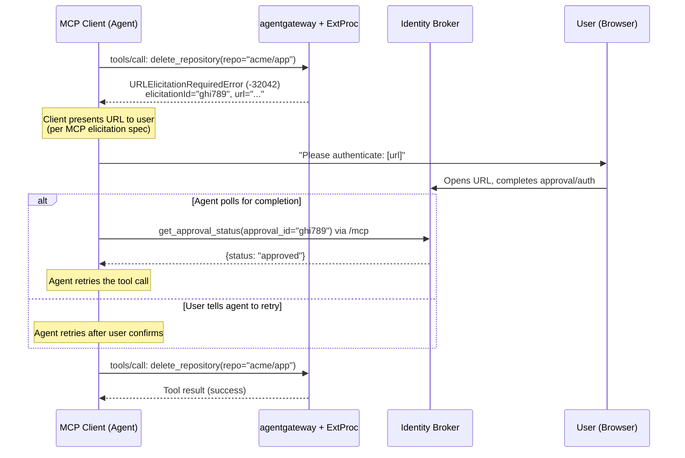

**Completion detection**: The broker cannot send `notifications/elicitation/complete` proactively because it has no MCP session with the agent — the MCP connection is between the agent and agentgateway, and the broker sits behind ExtProc. Instead, agents detect completion through:

1. **Polling via `/mcp`**: The agent calls `get_approval_status(approval_id="ghi789")` on the broker's MCP server endpoint. When the status changes to `approved` or `denied`, the agent retries or reports the denial.
2. **User-initiated retry**: The user tells the agent "I approved it" → the agent retries the `tools/call`. ExtProc checks the approval cache and finds the resolved approval.

> **Future extension**: If agentgateway adds support for server-initiated MCP notifications (e.g., an ExtProc-to-gateway signal that triggers a push to the agent), `notifications/elicitation/complete` could be forwarded from the broker through agentgateway to the agent. This would eliminate polling, but requires agentgateway changes.

### 9.4 Elicitation Metadata Convention

The `elicitationId` returned in the `URLElicitationRequiredError` corresponds to the broker's `approval_id`. This allows the MCP server tools (Section 5.3) to correlate: an agent can call `get_approval_status(approval_id=elicitationId)` to check whether the user has acted.

| MCP standard field | Broker equivalent | Description |
|--------------------|-------------------|-------------|
| `elicitationId` | `approval_id` | Unique identifier for the approval record |
| `url` | `approval_url` | Broker-hosted approval/status page |
| `message` | `description` | Human-readable action description from OPA's `description_template` |
| `mode` | Always `"url"` | Standard MCP URL mode — broker always provides a page |
